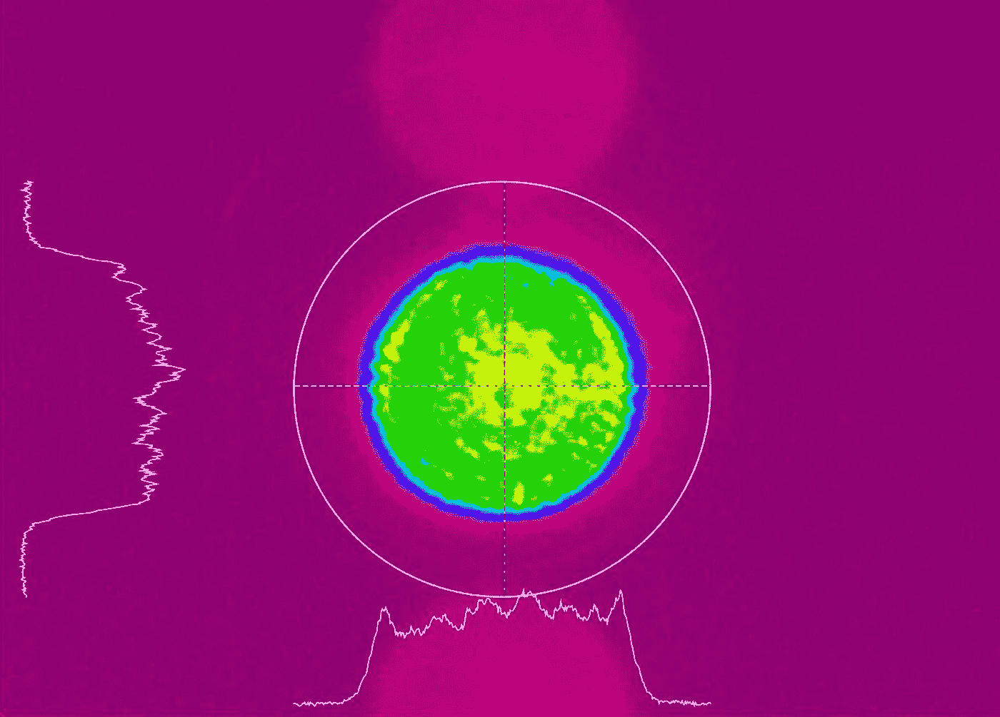
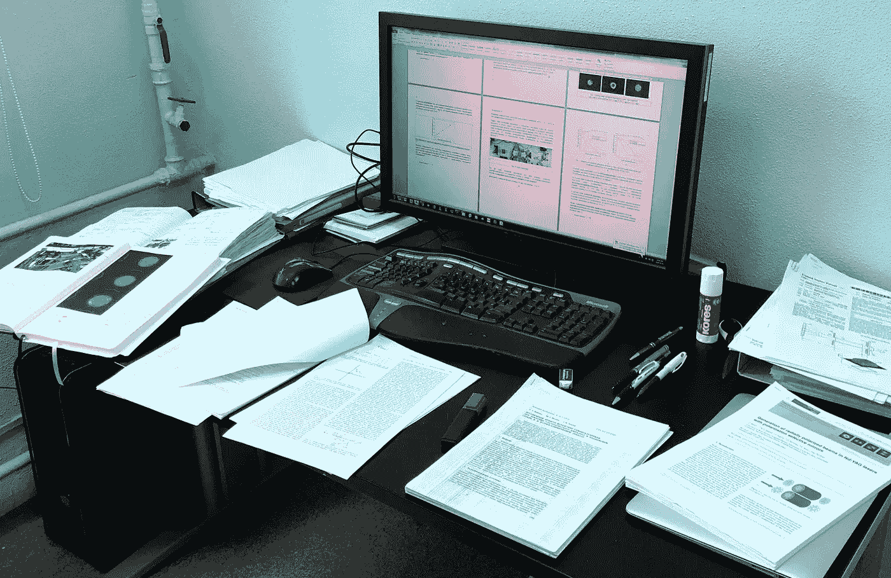
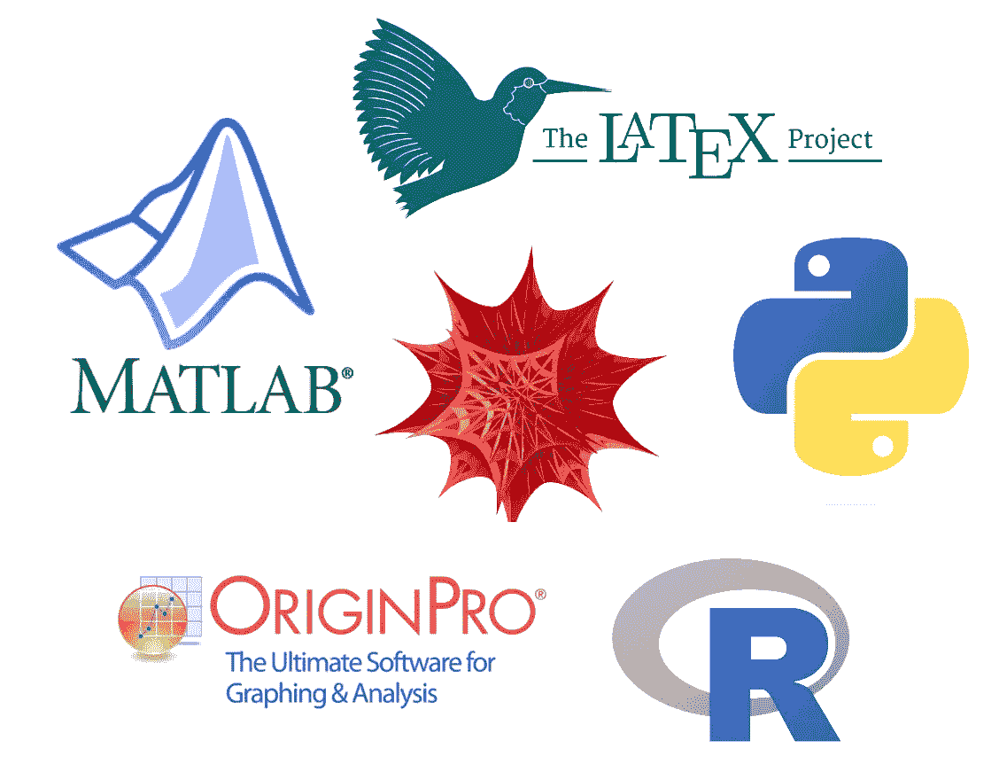
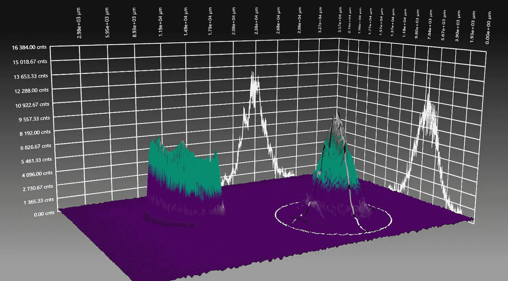
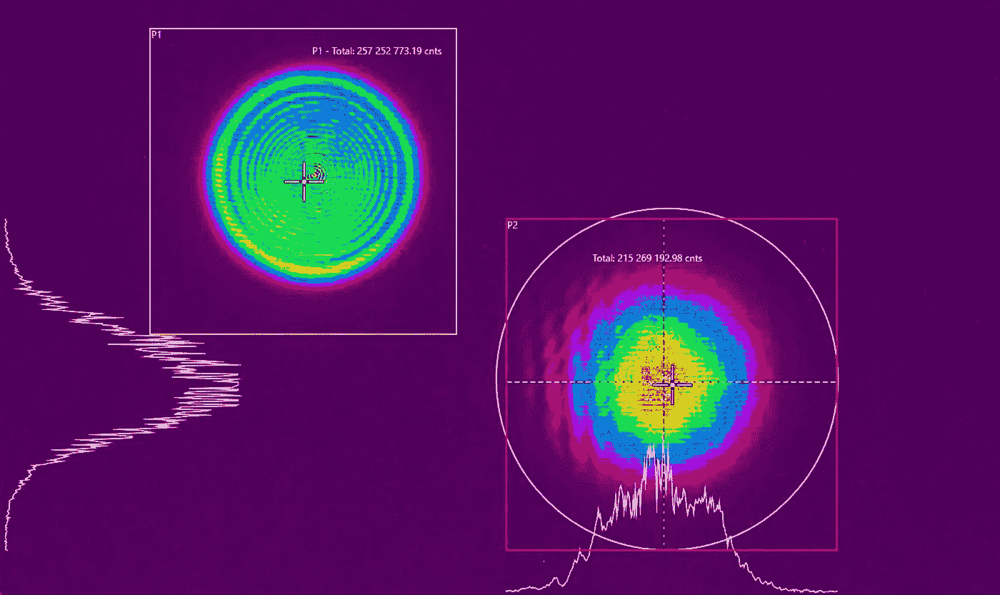

# 照亮您数据科学之旅的可转移技能

> 原文：[`towardsdatascience.com/shining-light-on-transferrable-skills-for-your-data-science-journey-a4c67c3d0de8`](https://towardsdatascience.com/shining-light-on-transferrable-skills-for-your-data-science-journey-a4c67c3d0de8)

## 我对那些从学术界转向商业数据科学的关键可转移技能的看法

 [Kirill Lepchenkov](https://medium.com/@k.lepchenkov?source=post_page-----a4c67c3d0de8--------------------------------)

·发布于[Towards Data Science](https://towardsdatascience.com/?source=post_page-----a4c67c3d0de8--------------------------------) ·阅读时间 9 分钟·2023 年 4 月 7 日

--

光束形状图像（作者拍摄）

## 前言

我在激光物理、非线性光学和固态激光工程领域担任研究员已有 5 年。虽然我完全沉浸于这个领域，并对自己所做的工作感到兴奋，但在某个时刻，我过渡到了商业数据科学行业。

在数据科学领域工作了额外 6 年后，我感到我在应用物理领域发展起来的技能在与激光物理完全无关的商业项目中得到了完美应用。

关于学术经验可能多么有用已经有很多[讨论](https://medium.com/@drmdhumphries/academia-is-the-alternative-career-path-106c89fc3412#:~:text=Along%20the%20way%2C%20you%E2%80%99ll%20obtain%20a%20wealth%20of%20useful%20skills.%20You%E2%80%99ll%20get%20the%20ability%20to%20read%20highly%20technical%20documents.%20Write%20and%20give%20presentations.%20Synthesise%20disparate%20sources%20of%20data.%20Obtain%20advanced%20IT%20skills.%20And%20test%20your%20writing%20of%20all%20kinds%2C%20from%20long%20technical%20papers%20to%20short%20abstracts.)，但我决定表达我个人对这一主题的看法。

为了阐明我的观点，我决定根据每个技能组的实用性及其原因进行评级。

## 这篇文章适合谁？

我认为我写这篇文章主要是为了那些考虑从学术环境转向商业领域的人，但也是为了我自己，反思两者之间工具、技能和思维方式的交集。

## 文献综述经验 → 7/10

为什么文献综述在商业数据科学中是如此重要且可转移的技能（习惯）？

在我物理学时期的文献综述（作者的桌面）

在我看来，文献综述在商业数据科学中有点被忽视和误解。我并不是说我们对全新模型架构和框架设计的阅读不够（这部分做得非常好）。

但当涉及到快速有效地获取关于项目主题的更结构化和有价值的信息时——在我看来，这是数据科学领域存在的最大空白。

*文献综述* 可能不是这里最好的术语。我也可以称其为*背景研究*，或*最先进的分析*。

在处理商业问题时，我认为对问题主题有一定的理论基础是至关重要的。文献综述的作用：

+   **为数据战略的可靠决策奠定基础。** 了解领域内现有的技术和方法。

+   **加快入职过程。** 如果你对自己正在从事的领域不熟悉，尽快获取相关知识是实现价值生成的第一步。

+   **提高与领域专家的沟通质量。** 领域专家，也称为主题专家，对于解决数据问题至关重要。但他们通常不编程，而且非常忙。因此，数据科学家必须掌握一些领域特定的术语和概念，以便与这些专家有效沟通和顺畅合作。

+   **大幅提升洞察力的质量。** 根据我的经验，文献综述为数据收集、预处理、建模和评估提供了决策基础，最终提高了你提供的洞察力的质量。在我的经验中，它有效，但并非总是如此。

关注文献综述，并投入时间和精力，**体现了一种特定的心态——开放、谦虚和好奇。** 文献综述有助于避免重新发明轮子或陷入[确认偏差](https://medium.com/towards-data-science/overcoming-confirmation-bias-during-covid-19-51a64205eceb)的陷阱。

我相信，随着大语言模型和基于这些模型的[服务](https://www.chatpdf.com/)的扩展，文献综述的过程会发生变化，但我们[还未到达](https://reneelin2019.medium.com/how-to-use-chatgpt-to-accelerate-literature-review-d14bfc47968b)那一步。

## 记录→ 9/10

将学术界的记录实践转移到商业数据科学中，对我来说非常有价值。除了多个实际好处，它在经历研究人员工作生活中的起伏时，给你一种**无价的连续感**。在我看来，通过采用保持实验室笔记本这一关键习惯，数据科学家可以轻松跟踪实验、记录想法和观察，监控个人和职业成长。我写了一整篇文章来阐述这样做的好处，欢迎查阅！

实验室笔记本作为数据科学从业者的选择武器

### 我的一套有效笔记记录原则，以实验室笔记本的形式呈现

towardsdatascience.com

## 编程知识 → 6/10

在我的科学历程中，我每天都在处理实验数据、进行数值模拟和统计学习。编程对于开发和测试新的激光设计（数值模拟）也是必不可少的。

我一直在不断使用它来处理典型的数据科学任务：

+   实验数据处理（Python，[Wolfram](https://www.wolfram.com/mathematica/new-in-13/?416=&src=google&gclid=CjwKCAiAmJGgBhAZEiwA1JZolrW4PacEvHUzu7HTIFHL6_VTCJpHWgkhnvTwr3TWZtwYyr5a9CtixBoCluAQAvD_BwE)）

+   数值模拟（Wolfram, Matlab, Python）

+   统计学习（Wolfram, Matlab, Python）

+   数据可视化（[Origin Pro](https://www.originlab.com/origin), Python, R）

我的“数据工作”科学工具栈

Wolfram（更具体地说是 Wolfram Mathematica）是使用最频繁的工具，因为我们在实验室里有它的许可证。它有很棒的工具集用于求解非线性微分方程，我们广泛使用它进行数值模拟。

Python 是我处理实验生成的数据（光束形状、振荡图）的首选工具。

说到数据可视化，Origin 是主要工具，因为它允许将视觉元素嵌入到文本文档中，同时保持可编辑性。折线图、直方图（包括核密度估计器）、回归分析——Origin 是一个很棒的工具。Origin 有一个图形用户界面，所以这不仅仅是编程的问题，我提到它是为了确保 Python 和 R 不会独占所有数据可视化的功劳。

总的来说，我对上述提到的每一个工具都有扎实的使用经验：我了解语法，并且能够以相当高的效率解决问题。那么为什么只有 6/10 呢？为什么在学术界获得的编程技能在商业数据科学中相对难以转移？这确实是一个相当强的声明，但我认为学术经验的缺点可能会超过其优点。主要是因为**许多科学环境中完全忽视了良好的软件实践**。

> 警告：这一说法基于我在应用物理领域的个人经验，并且绝对不适用于所有在学术界工作的人。对这一部分的内容要持保留态度！

一方面，忽视良好的软件原则是*研究人员优化研究速度和发表数量，而非代码质量和可维护性的自然结果*。另一方面，几乎没有人从正统的软件开发转到学术界（出于经济原因），因此根本没有真正的生产专业知识。我还应该提到，设计实验、进行文献综述、收集测量数据、编写处理代码以及获得有价值的见解——所有这些同时进行是非常耗费精力的。因此，你根本没有足够的资源去学习软件开发。

## 测量能力→ 9/10

这一点难以解释，所以请耐心听我说。应用激光物理中的测量工作本身就是一个独立的学科。提供有价值的测量是一项需要多年训练的技能！原因有很多：你必须理解过程的物理学，遵循测量协议，并且具备操作复杂且昂贵仪器的专业知识和训练。

例如，我一直在使用二极管泵浦脉冲固态激光器，测量激光束的多个参数：脉冲持续时间、脉冲能量、重复频率、束形、发散度、偏振、光谱内容、时间特性和光束腰部。进行这些测量中的任何一项都非常困难。比如说，你想测量束形（见下图）。

beam profiles 3d（作者拍摄）

> 光束形状指的是激光束在其截面或横截面上的强度空间分布。

理论上，你只需将激光光束对准 CCD 相机，几秒钟内就能获得光束形状。但实际操作起来则大相径庭。如果你正在使用脉冲固态激光且有相当的脉冲能量，并且你知道自己在做什么，你会将激光光束导向高质量的光学楔子，将大部分脉冲能量集中到一个陷阱中，并使用仅有原始光束一部分能量的反射光束进行工作。这样做是为了保护 CCD 相机免受灾难。但使用楔子还不够。你还需安装一个可调的光束衰减器，将其锁定到最暗模式，然后逐渐降低吸收率，直到在 CCD 相机上获得正确的曝光。

如果你正在使用对人眼不可见的红外激光，你会面临一个问题：你必须在看不到实际光束的情况下通过小孔引导光束。这项技能只能通过训练和实践获得。顺便说一下，每一步光束操作都必须极其小心，以遵守安全规定：你必须佩戴适当的防护眼镜，使用保护屏幕等。

好的，继续，现在你的光束被衰减并完美地对准了 CCD 相机。但你还有很多工作要做：将 CCD 相机连接到激光电源单元以实现同步并产生稳定的图像。如果你做对了所有步骤——你就能获得图像。等等，图像？

光束轮廓 2D（由作者捕获）

然后你意识到，如果你的激光以 50 Hz 的脉冲重复频率运行，这意味着它每秒产生 50 个脉冲。每个脉冲可能有略微不同的光束轮廓。你该如何获得结果？你应该随便选一个脉冲并捕捉图像？还是应该使用一定数量的脉冲生成平均图像？哦，管理 CCD 相机的软件默认启用了平均功能？

让我们结束这个“测量光束形状”的废话吧。根据我一生中的所有测量经验，我有两个关键的可转移品质：**警惕**（永远不要仅仅相信表面）和**对元数据的细致关注**（数据是如何测量或记录的，使用了哪些工具，甚至最初发生的原因）。这两者在处理实际数据时都是金标准。因为它让你在产生实际影响时更加高效，而不会陷入麻烦之中。这在学术界和商业数据科学中都很受重视。

## 数据通信熟练度 → 10/10

当我在学术界时，我并没有认为数据沟通是一个特别值得关注或有价值的写作主题。处理数据可视化、讨论数据和理论，以及撰写科学论文只是工作的组成部分。但经过多年的研究，你在不同层次（正式和非正式）上获得了扎实的数据沟通技能。

写作科学论文是正式数据沟通类型中最具挑战性的技能之一。要能写出一个结构合理（摘要 → 引言 → 文献综述 → 方法论 → 结果 → 讨论 → 结论 → 致谢）的引人入胜的文章，需要大量的练习。文章的结构本身假设你有一个故事要写。而且这不仅仅是写作：你还必须知道如何制作引人注目且有目的的数据可视化。这一切都是为了将你的信息传达给观众。

我将这一技能的可转移性评分为 10 分（满分 10 分），因为商业数据科学毫不意外地依赖于人与人之间的互动、传达你的思想和结果。

## 结论

总体而言，我相信拥有科学背景的人可以为数据科学领域带来独特的视角和宝贵的技能。对于那些认为转向商业数据科学意味着放弃所有辛勤工作和专业知识的学术界人士，我提供一个不同的观点：你有大量的价值可以带到桌面上。在我看来，最佳的行动方案是利用你现有的技能，同时掌握你转型领域的新技术和最佳实践（我们都知道这是一个终身的旅程）。
