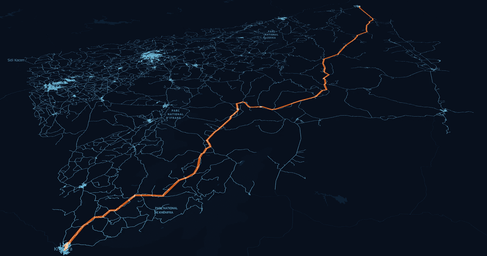
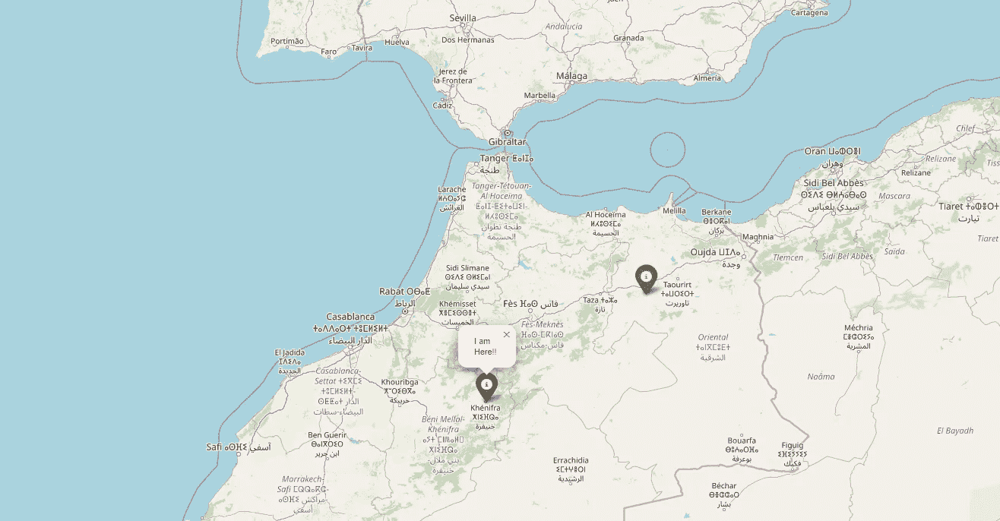
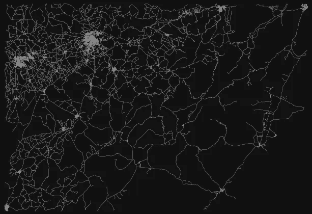
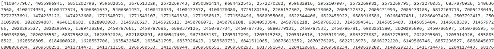
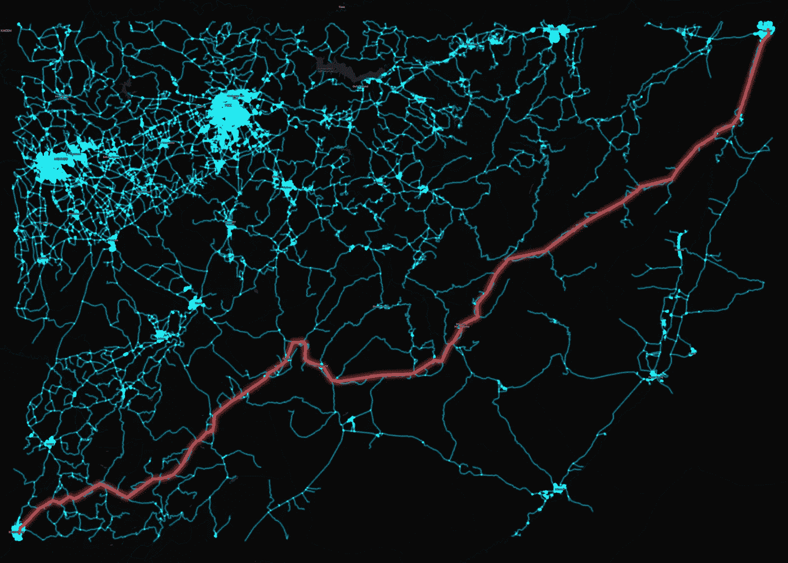
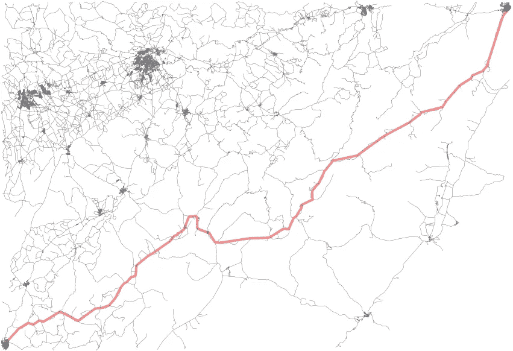
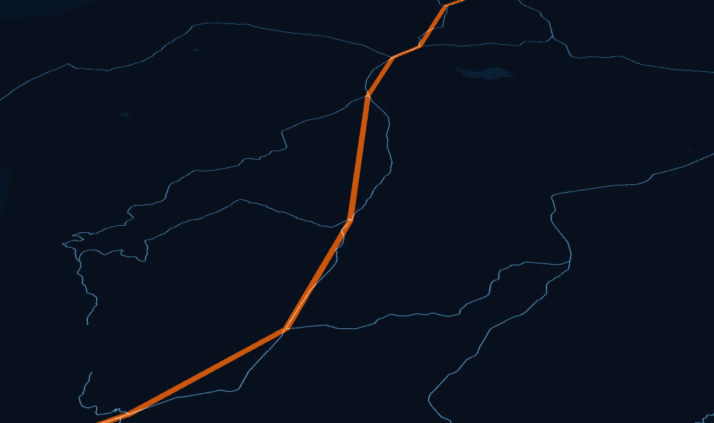

# 最短路径（Dijkstra）算法：一步步的 Python 指南

> 原文：[`towardsdatascience.com/shortest-path-dijkstras-algorithm-step-by-step-python-guide-896769522752`](https://towardsdatascience.com/shortest-path-dijkstras-algorithm-step-by-step-python-guide-896769522752)

## 使用 OSMNX 1.6 和长距离路径的更新

[](https://bryanvallejo16.medium.com/?source=post_page-----896769522752--------------------------------)[](https://towardsdatascience.com/?source=post_page-----896769522752--------------------------------) [Bryan R. Vallejo](https://bryanvallejo16.medium.com/?source=post_page-----896769522752--------------------------------)

·发布于 [Towards Data Science](https://towardsdatascience.com/?source=post_page-----896769522752--------------------------------) ·6 分钟阅读·2023 年 10 月 4 日

--



图片由作者提供。摩洛哥的最短路径（约 350 公里）

这个著名的算法在 Python 库 OSMNX 中实现，可以用来寻找两个位置之间按距离或时间加权的最短路径。该算法使用 OpenStreetMap（OSM）网络，通过 Python 库 NETWORKX 在后台寻找驾驶、步行或骑车的路线。

我写这个更新是因为函数的参数稍有变化，且有人询问为什么我的代码在旧博客文章中无法工作，这只是因为代码是用旧版本的 osmnx 编写的。

旧教程包含了相当有价值的过程，但我决定做一个一步步的指南，这样获取最短路径的过程会更准确，使用这个指南的分析师可以真正理解整个过程。

这里是旧教程，如果你想查看一下。

## 在芬兰赫尔辛基，使用不同的网络

[](/shortest-path-algorithm-used-in-osm-street-network-33e0f864f34b?source=post_page-----896769522752--------------------------------) ## OSM 街道网络中使用的最短路径算法

### 车辆、自行车和行人最短路径分析的 GIS 自动化技巧

towardsdatascience.com

## 在爱沙尼亚塔尔图，使用步行网络

[](/shortest-path-algorithm-with-osm-walking-network-6d2863ae96be?source=post_page-----896769522752--------------------------------) ## 使用 OSM 步行网络的最短路径算法

### 使用 OSM 数据在爱沙尼亚塔尔图寻找最短步行路径

towardsdatascience.com

# OSM 数据许可

+   **开放街图数据。** 依据 [Open Data Commons Open Database License (ODbl)](https://opendatacommons.org/licenses/odbl/) 或归属许可授权。用户可以自由复制、分发、传输和修改数据，只要标注作者如 © [OpenStreetMap](https://www.openstreetmap.org/copyright) 贡献者。

# 介绍

在这个实践中，我将使用摩洛哥的两个位置。这个实践由我的一位读者 [Hanae](https://medium.com/u/3b913af53dd0?source=post_page-----896769522752--------------------------------) 提出，她提供了原点和目的地。



作者提供的图像。原点和目的地位置。

# 编码实践

正如我提到的，我将做一个逐步指南，所以让我们开始。在此之前，让我们导入所需的库。

```py
import osmnx as ox
import geopandas as gpd
from shapely.geometry import Point, LineString
import pandas as pd
import matplotlib.pyplot as plt
```

## 1\. 定义原点和目的地

简单地，我们将创建几何对象作为点：

```py
# origin and destination geom

origin_geom = Point(-5.6613932957355715, 32.93210288339607)

destination_geom = Point(-3.3500597061072726, 34.23038027794419)
```

## 2\. 提取 OSM 图对象

然后，我们将提取图形，用于生成最短路径。我们逐步来看。

+   *从原点和目的地创建 GeoDataFrames*

```py
# create origin dataframe
origin =  gpd.GeoDataFrame(columns = ['name', 'geometry'], crs = 4326, geometry = 'geometry')
origin.at[0, 'name'] = 'origin'
origin.at[0, 'geometry'] =origin_geom

# create destination dataframe
destination =  gpd.GeoDataFrame(columns = ['name', 'geometry'], crs = 4326, geometry = 'geometry')
destination.at[0, 'name'] = 'destination'
destination.at[0, 'geometry'] = destination_geom
```

+   *获取包含原点和目的地的图*

我们将使用 Geopandas 的 *envelope* 函数来将多边形用作掩膜以提取图形。

首先一个简单的函数。

```py
def get_graph_from_locations(origin, destination, network='drive'):
    '''
    network_type as drive, walk, bike
    origin gdf 4326
    destination gdf 4326
    '''
    # combine and area buffer
    combined = pd.concat([origin, destination])

    convex = combined.unary_union.envelope # using envelope instead of convex, otherwise it breaks the unary_union

    graph_extent = convex.buffer(0.02)

    graph = ox.graph_from_polygon(graph_extent, network_type= network)

    return graph
```

然后，使用它并绘制结果。

```py
graph = get_graph_from_locations(origin, destination)
```

```py
fig, ax = ox.plot_graph(graph, node_size=0, edge_linewidth=0.2)
```



作者提供的图像。图包含原点和目的地

## 3\. 找到原点和目的地的最近节点

获取使用原点和目的地位置的网络中最接近的节点。节点代码可以使用 osmnx 函数获得。

```py
# ------------- get closest nodes

# origin
closest_origin_node = ox.nearest_nodes(G=graph, 
                                       X=origin_geom.x, 
                                       Y=origin_geom.y)

# destination
closest_destination_node = ox.nearest_nodes(G=graph, 
                                           X=destination_geom.x, 
                                           Y=destination_geom.y)
```

你可以检查并注意到我们目前只有代码。

## 4\. 找到最短路径

然后，使用最短路径函数来获取路线。

```py
# run
route = ox.shortest_path(graph, 
                         orig = closest_origin_node, 
                         dest = closest_destination_node, 
                         weight = 'length')
```

这将返回一堆路径中节点的代码。



作者提供的图像节点代码

## 5\. 从节点创建 Line Geometry

我们将从图中提取节点的几何形状，并创建一个表示最短路径的 LineString 几何体。

首先为此创建一个函数。

```py
def nodes_to_route(graph_nodes, path_nodes):

    # Extract the route nodes of the graph
    route_nodes = graph_nodes.loc[path_nodes]

    # ---> note! If you have more routes, check for each one, to be removed in length is 1\.  A path can not be built with only 1 node.

    # Create a LineString out of the route
    list_geom = route_nodes.geometry.to_list()
    path = LineString(list_geom)

    # Append the result into the GeoDataFrame
    route_df = gpd.GeoDataFrame( [[path]] )

    # Add a column name
    route_df.columns = ['geometry'] 

    # Set geometry
    route_df = route_df.set_geometry('geometry')

    # Set coordinate reference system
    route_df.crs = graph_nodes.crs

    # remove nans
    route_df = route_df.dropna(subset=['geometry'])

    return route_df
```

获取节点，并在函数中使用它们。

```py
# get all network nodes
graph_nodes = ox.graph_to_gdfs(graph, edges=False)

# get the line geometries from osm nodes
route_gdf = nodes_to_route(graph_nodes, route)
```

## 6\. 计算距离

我们将使用墨卡托投影来测量路线的米数。如果你想要更准确的结果，可以使用位置投影。

首先，为此创建一个函数。

```py
def compute_distance(shortest_path_gdf):
    '''
    Compute distance in EPSG:3387

    '''

    # project WGS84 to EPSG3387
    distances = shortest_path_gdf.to_crs("EPSG:3387").geometry.length

    # add
    shortest_path_gdf['distance'] = distances

    return shortest_path_gdf
```

然后，使用它：

```py
# calculate distance m
route_distance_gdf = compute_distance(route_gdf)
```

它将测量约 351.243 米的路线。

## 7\. 保存网络和路径

将网络和路径保存到本地磁盘上用于地图。

提取网络并定义 GeoDataFrame：

```py
# fetch network
network = ox.graph_to_gdfs(graph, nodes=False)

# get only needed columns
network_gdf = network.reset_index(drop=True)[['geometry']]
```

然后存储：

```py
network_gdf.to_file(r'osm_network.gpkg')
route_distance_gdf.to_file(r'osm_shortest_path.gpkg')
```

你可以使用这些数据来创建自己的地图。例如，这个在 QGIS 中：



作者提供的图像。QGIS 中的最短路径和网络

## 8\. 绘制结果

我们将通过绘制所有元素来检查我们的工作是否正确。

```py
# plot network
ax = network_gdf.plot(figsize=(12, 10), linewidth = 0.2, color='grey', zorder=0);

# origin and destination
origin.plot(ax=ax, markersize=46, alpha=0.8, color='blue', zorder=1)
destination.plot(ax=ax, markersize=46, alpha=0.8, color='green', zorder=2)

# route
route_distance_gdf.plot(ax=ax, linewidth = 3, color='red', alpha=0.4, zorder=3)

plt.axis(False);
```

结果将会是这样的。



图片由作者提供。最短路径、网络、起点和终点在 Matplotlib 中

# 已知限制

最短路径是通过节点网络的联合生成的，线条并不完全匹配道路。这完全没问题，因为我们要的只是一个近似值。如果你需要导航，应该使用 Google API 进行路由，或其他提供商。



图片由作者提供。线条是通过节点创建的。

# 结论

使用 OSMNX 的最短路径算法提供了路线的近似值，并且可以广泛用于城市或区域规模的可达性研究。这个 Python 库不断更新，函数或参数可能会有所变化，因此建议在我们的工作流程中持续更新库版本。

如果你有问题或需要定制分析，欢迎联系我：

> [Bryan R. LinkedIn](https://www.linkedin.com/in/bryanrvallejo/)
