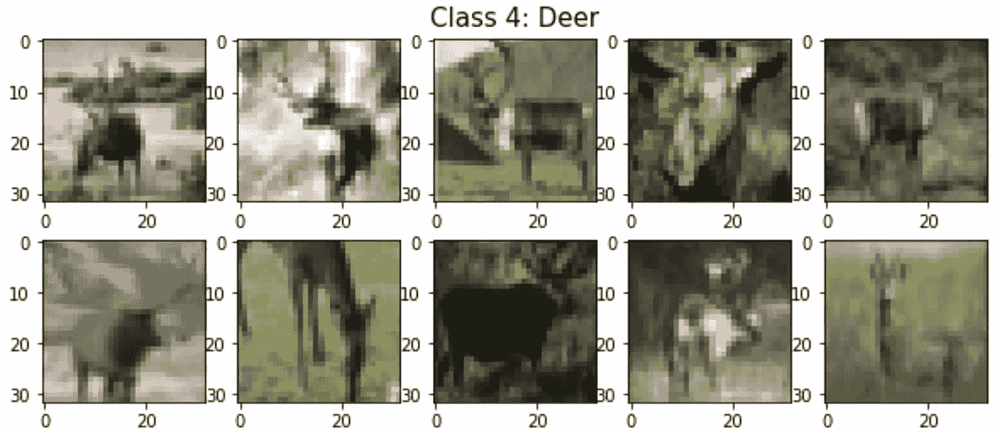

# Siamese 神经网络与三重损失和余弦距离

> 原文：[`towardsdatascience.com/siamese-neural-networks-with-tensorflow-functional-api-6aef1002c4e`](https://towardsdatascience.com/siamese-neural-networks-with-tensorflow-functional-api-6aef1002c4e)

## 理论与代码实践：使用三重损失和余弦距离进行 Siamese 网络在 CIFAR-10 数据集上的训练

[](https://tanpengshi.medium.com/?source=post_page-----6aef1002c4e--------------------------------)[](https://towardsdatascience.com/?source=post_page-----6aef1002c4e--------------------------------) [Tan Pengshi Alvin](https://tanpengshi.medium.com/?source=post_page-----6aef1002c4e--------------------------------)

·发表于 [Towards Data Science](https://towardsdatascience.com/?source=post_page-----6aef1002c4e--------------------------------) ·阅读时长 11 分钟·2023 年 5 月 12 日

--


图片由 [Alex Meier](https://unsplash.com/@alexmeier19) 提供，来源于 [Unsplash](https://unsplash.com/)

如果我们可以将每个对象图像（如人脸等）编码成一个模板——一个数字向量呢？之后，我们可以通过对比它们的模板——计算距离——来客观地确定对象之间的相似性。在深度学习中，这正是 Siamese 神经网络希望实现的目标。

Siamese 神经网络基本上是经过训练后为每个输入对象生成独特特征向量（模板）的模型。尽管这些模型通常用于对象图像的模板（计算机视觉），但它们也可以用于文本和声音数据。

除了安全认证，如人脸识别和签名比对，Siamese 神经网络还常用于电子商务平台中测量产品相似性。例如，一些电子商务平台允许你通过上传你想寻找的对象的图像来搜索类似产品。在 Kaggle 上，甚至有一个由东南亚领先电子商务公司 Shopee 举办的 [产品匹配竞赛](https://www.kaggle.com/competitions/shopee-product-matching)。

在这篇文章中，我们将探索一个在 Tensorflow 中常见的数据集——CIFAR-10——该数据集与产品相似性搜索问题有些相似，只不过兴趣对象是汽车——如汽车、飞机、卡车、船只等——以及动物（或者说宠物也行！）——如猫、狗、马、鸟、鹿等。

在开始之前，我们首先需要理解 Siamese 神经网络背后的理论。之后，我们将探索在 CIFAR-10 数据集上训练和评估简单 Siamese 神经网络的代码。

准备好了吗？开始吧！

# 1. 孪生网络理论

我不得不承认本文中的封面图片有点误导——‘Siamese’一词实际上并不是源于‘暹罗猫’。而是来源于‘暹罗双胞胎’，即身体某部分连在一起的双胞胎。

因此，孪生神经网络基本上指的是双胞神经网络，这些网络通常在最后——Lambda 层，如我们将看到的——连接在一起，然后将模型输出输入损失函数。在训练这些双胞神经网络的过程中，它们的权重在初始化、前向传播和反向传播过程中完全相同。

由于我们通常处理的是图像，每对孪生神经网络通常是卷积神经网络（CNN）。如果你对 CNN 不熟悉或需要刷新记忆，我这里有一篇关于 CNN 的优秀文章：

[](https://medium.com/mlearning-ai/transfer-learning-and-convolutional-neural-networks-cnn-e68db4c48cca?source=post_page-----6aef1002c4e--------------------------------) [## 迁移学习与卷积神经网络（CNN）

### 从 CNN 到迁移学习的完整指南，适用于 Kaggle 的猫狗数据集

medium.com](https://medium.com/mlearning-ai/transfer-learning-and-convolutional-neural-networks-cnn-e68db4c48cca?source=post_page-----6aef1002c4e--------------------------------)

牢记这一点，我们将介绍两种常见的孪生神经网络：

## 1.1 对比损失孪生网络

第一种类型是基于计算双胞 CNN 的嵌入层（特征向量）之间的欧几里得/余弦距离，然后与真实值（1:匹配，0:不匹配）比较来确定对比损失的孪生神经网络。

以下是这种模型的示意图：


对比损失的孪生神经网络示例。图片改编自[SigNet 论文](https://arxiv.org/abs/1707.02131)。


对比损失公式与欧几里得距离，其中 Y 为真实值。图片作者提供。

## 1.2 三重损失孪生网络

第二种类型的孪生神经网络基于计算三重 CNN 的嵌入层（特征向量）之间的两个欧几里得/余弦距离——即锚点和正样本之间，锚点和负样本之间——然后在 Lambda 层中完全计算三重损失，而不与任何真实值进行比较。

因为研究表明这种三重损失模型通常比对比损失模型更鲁棒，所以我们将在本文中重点讨论这种类型的孪生网络。

以下是这种模型的示意图：


三重损失孪生神经网络的示例。图片改编自[SigNet 论文](https://arxiv.org/abs/1707.02131)。


使用欧几里得距离的三元组损失公式，其中 A 是锚点图像输入，P 是正样本图像输入，N 是负样本图像输入。图片由作者提供。

## 1.3 孪生网络的目标

现在，我们已经看到孪生神经网络的大致架构。但是在训练网络后，我们打算达到什么目标？让我们看看下面的插图：


孪生网络的训练减少了相似图像之间的距离，同时增加了不相似图像之间的距离。图片来源于[FaceNet 论文](https://arxiv.org/abs/1503.03832)。

我们看到孪生网络正在学习在同一类别图像之间重建相似的特征向量。因此，训练后，相似图像模板之间的距离将减少，而不相似图像模板之间的距离将增加。

话虽如此，在训练过程中覆盖尽可能多的图像类别是很重要的，以便模型也能推广到未见过的类别（签名、面孔等）。

最后，在模型评估期间，我们主要关注生成输入图像数据的模板。因此，在进行模板推理时，仅提取单个 CNN 网络或双胞胎/三胞胎网络的主体，而不包括 Lambda 层。

## 1.4 欧几里得距离与余弦距离

在我们开始编码之前，让我们首先区分两个常见的向量距离度量——欧几里得距离和余弦距离。到目前为止，在上述插图中，我们展示了欧几里得距离，因为它更直观易懂，但在构建更好的模型时并不一定优于余弦距离。下面我们来说明一下：


2D 空间中两个向量的欧几里得距离和余弦距离的插图。图片由作者提供。

从上述内容来看，欧几里得距离只是两个特征向量之间的“坐标距离”，而余弦距离是它们之间“角度距离”的一种度量。因此，当两个特征向量远离时，我们可以看到欧几里得距离和余弦距离都很大。但它们之间存在微妙的差别，下面我们来看一下：


欧几里得距离和余弦距离在小角度下但向量长度不同的比较。图片由作者提供。

虽然余弦距离仅测量特征向量之间的角度差异，但欧几里得距离测量第二维度——长度差异。因此，虽然更直观，但欧几里得距离本质上比余弦距离更复杂。

一般来说，欧几里得距离和余弦距离都被广泛使用，选择取决于经验探索。然而，对于较小的数据集和特定数量的类别，采用余弦距离作为损失函数可能是一个更好的选择，这也是我们为 CIFAR-10 数据集所做的。

# 2. 孪生网络代码练习

接下来，让我们开始编码吧。我们将基于 TensorFlow CIFAR-10 数据集构建三元组损失孪生网络。我们将基于余弦距离来构建三元组损失，然后在测试集评估时，通过角度相似度来比较测试图像。

***注意****：使用的是角度相似度，因为它基于余弦距离，但值范围缩放在 0%到 100%之间。*


角度相似度的公式。图片由作者提供。

还需要注意的是，在模型初始化过程中，我们将采用 TensorFlow 的功能性 API（对比之前在迁移学习和 CNN 文章中使用的顺序 API），以及自定义 Lambda 层和自定义损失函数。

毫不犹豫地，让我们开始编码吧！

## 2.1 探索 CIFAR-10 数据集

```py
# import necessary libraries
import tensorflow as tf
import numpy as np
import matplotlib.pyplot as plt
import ssl
ssl._create_default_https_context = ssl._create_unverified_context

# set random seed
np.random.seed(42)

# load CIFAR-10 data
(X_train, y_train), (X_test, y_test) = tf.keras.datasets.cifar10.load_data()

# check data size
assert X_train.shape == (50000, 32, 32, 3)
assert X_test.shape == (10000, 32, 32, 3)
assert y_train.shape == (50000, 1)
assert y_test.shape == (10000, 1)

# combine data first - we will generate test set later.
X = np.concatenate([X_train,X_test],axis=0)
y = np.concatenate([y_train,y_test],axis=0)
y = np.squeeze(y)

assert X.shape == (60000, 32, 32, 3)
assert y.shape == (60000,)

# check number of data in each class
unique, counts = np.unique(y,return_counts=True)
np.asarray([unique,counts]).T
```


```py
# Plot Class N (0-9)

TARGET = # Class index here
NUM_ARRAYS = 10

arrays = X[np.where(y==TARGET)]
random_arrays_indices = np.random.choice(len(arrays),NUM_ARRAYS)
random_arrays = arrays[random_arrays_indices]

fig = plt.figure(figsize=[NUM_ARRAYS,4])
plt.title('Class 0: Plane',fontsize = 15)
plt.axis('off')

for index in range(NUM_ARRAYS):
     fig.add_subplot(2, int(NUM_ARRAYS/2), index+1)
     plt.imshow(random_arrays[index])
```



## 2.2 生成三元组

```py
# initialize triplets array
triplets = np.empty((0,3,32,32,3),dtype=np.uint8)

# get triplets for each class
for target in range(10):

    locals()['arrays_'+str(target)] = X[np.where(y==target)].reshape(3000,2,32,32,3)
    locals()['arrays_not_'+str(target)] = X[np.where(y!=target)]

    random_indices = np.random.choice(len(locals()['arrays_not_'+str(target)]),3000)
    locals()['arrays_not_'+str(target)] = locals()['arrays_not_'+str(target)][random_indices]

    locals()['arrays_'+str(target)] = np.concatenate(
        [
            locals()['arrays_'+str(target)],
            locals()['arrays_not_'+str(target)].reshape(3000,1,32,32,3)
        ],
        axis = 1
    )

    triplets = np.concatenate([triplets,locals()['arrays_'+str(target)]],axis=0)

# check triplets size
assert triplets.shape == (30000,3,32,32,3)

# plot triplets array to visualize
TEST_SIZE = 5
random_indices = np.random.choice(len(triplets),TEST_SIZE)

fig = plt.figure(figsize=[5,2*TEST_SIZE])
plt.title('ANCHOR | POSITIVE | NEGATIVE',fontsize = 15)
plt.axis('off')

for row,i in enumerate(range(0,TEST_SIZE*3,3)):
    for j in range(1,4):
        fig.add_subplot(TEST_SIZE, 3, i+j)
        random_index = random_indices[row]
        plt.imshow(triplets[random_index,j-1])

# save triplet array
np.save('triplets_array.npy',triplets)
```


## 2.3 准备模型训练/评估

```py
# Import all libraries

import tensorflow as tf
import numpy as np
import matplotlib.pyplot as plt

from tensorflow.keras.applications import MobileNetV2
from tensorflow.keras import Input, optimizers, Model
from tensorflow.keras.layers import Layer, Lambda
from tensorflow.keras.optimizers import Adam
from tensorflow.keras import backend as K
from tensorflow.keras.callbacks import EarlyStopping
from tensorflow.keras.utils import plot_model

from sklearn.metrics import precision_recall_curve, roc_curve, roc_auc_score
from sklearn.model_selection import train_test_split

from scipy import spatial
```

```py
triplets = np.load('triplets_array.npy')

triplets = triplets/255 #normalize by 255
labels = np.ones(len(triplets)) #create a fixed label

assert triplets.shape == (30000,3,32,32,3)
```

```py
# Split data into our train and test set

X_train, X_test, y_train, y_test = train_test_split(
    triplets,
    labels,
    test_size=0.05,
    random_state=42
)
```

```py
# Load pretrained model for transfer learning

pretrained_model = MobileNetV2(
    weights='imagenet', 
    include_top=False, 
    input_shape=(32,32,3)
)

for layer in pretrained_model.layers:
    layer.trainable = True
```

## 2.4 模型训练

```py
# Initialize functions for Lambda Layer

def cosine_distance(x,y):
    x = K.l2_normalize(x, axis=-1)
    y = K.l2_normalize(y, axis=-1)
    distance = 1 - K.batch_dot(x, y, axes=-1)
    return distance

def triplet_loss(templates, margin=0.4):

    anchor,positive,negative = templates

    positive_distance = cosine_distance(anchor,positive)
    negative_distance = cosine_distance(anchor,negative)

    basic_loss = positive_distance-negative_distance+margin
    loss = K.maximum(basic_loss,0.0)

    return loss
```

```py
# Adopting the TensorFlow Functional API

anchor = Input(shape=(32, 32,3), name='anchor_input')
A = pretrained_model(anchor)

positive = Input(shape=(32, 32,3), name='positive_input')
P = pretrained_model(positive)

negative = Input(shape=(32, 32,3), name='negative_input')
N = pretrained_model(negative)

loss = Lambda(triplet_loss)([A, P, N])

model = Model(inputs=[anchor,positive,negative],outputs=loss)
```

```py
# Create a custom loss function since there are no ground truths label

def identity_loss(y_true, y_pred):
    return K.mean(y_pred)

model.compile(loss=identity_loss, optimizer=Adam(learning_rate=1e-4))

callbacks=[EarlyStopping(
    patience=2, 
    verbose=1, 
    restore_best_weights=True,
    monitor='val_loss'
    )]

# view model
plot_model(model, show_shapes=True, show_layer_names=True, to_file='siamese_triplet_loss_model.png')
```


```py
# Start training - y_train and y_test are dummy

model.fit(
    [X_train[:,0],X_train[:,1],X_train[:,2]],
    y_train,
    epochs=50, 
    batch_size=64,
    validation_data=([X_test[:,0],X_test[:,1],X_test[:,2]],y_test),
    callbacks=callbacks
)
```


## 2.5 模型评估

```py
X_test_anchor = X_test[:,0]
X_test_positive = X_test[:,1]
X_test_negative = X_test[:,2]

# extract the CNN model for inference
siamese_model = model.layers[3]

X_test_anchor_template = np.squeeze(siamese_model.predict(X_test_anchor))
X_test_positive_template = np.squeeze(siamese_model.predict(X_test_positive))
X_test_negative_template = np.squeeze(siamese_model.predict(X_test_negative))

y_test_targets = np.concatenate([np.ones((len(X_test),)),np.zeros((len(X_test),))])
```

```py
# Get predictions in angular similarity scores

def angular_similarity(template1,template2):

    score = np.float32(1-np.arccos(1-spatial.distance.cosine(template1,template2))/np.pi)

    return score

y_predict_targets = []

for index in range(len(X_test)):
    similarity = angular_similarity(X_test_anchor_template[index],X_test_positive_template[index])
    y_predict_targets.append(similarity)

for index in range(len(X_test)):
    similarity = angular_similarity(X_test_anchor_template[index],X_test_negative_template[index])
    y_predict_targets.append(similarity)
```

```py
# Get prediction results with ROC Curve and AUC scores

fpr, tpr, thresholds = roc_curve(y_test_targets, y_predict_targets)

fig = plt.figure(figsize=[10,7])
plt.plot(fpr, tpr,lw=2,label='UnoFace_v2 (AUC={:.3f})'.format(roc_auc_score(y_test_targets, y_predict_targets)))
plt.plot([0,1],[0,1],c='violet',ls='--')
plt.xlim([-0.05,1.05])
plt.ylim([-0.05,1.05])
plt.legend(loc="lower right",fontsize=15)

plt.xlabel('False positive rate')
plt.ylabel('True positive rate')
plt.title('Receiver Operating Characteristic (ROC) Curve',weight='bold',fontsize=15)
```


```py
# Getting Test Pairs and their Corresponding Predictions

positive_comparisons = X_test[:,[0,1]]
negative_comparisons = X_test[:,[0,2]]

positive_predict_targets = np.array(y_predict_targets)[:1500]
negative_predict_targets = np.array(y_predict_targets)[1500:]

assert positive_comparisons.shape == (1500,2,32,32,3)
assert negative_comparisons.shape == (1500,2,32,32,3)

assert positive_predict_targets.shape == (1500,)
assert negative_predict_targets.shape == (1500,)

np.random.seed(21)
NUM_EXAMPLES = 5
random_index = np.random.choice(range(len(positive_comparisons)),NUM_EXAMPLES)
```

```py
# Plotting Similarity Scores for Positive Comparisons 
# (Switch values and input to plot for Negative Comparisons)

plt.figure(figsize=(10,4))
plt.title('Positive Comparisons and Their Similarity Scores')
plt.ylabel('Anchors')
plt.yticks([])
plt.xticks([32*x+16 for x in range(NUM_EXAMPLES)], ['.' for x in range(NUM_EXAMPLES)])
for i,t in enumerate(plt.gca().xaxis.get_ticklabels()):
    t.set_color('green') 
plt.grid(None)
anchor = np.swapaxes(positive_comparisons[:,0][random_index],0,1)
anchor = np.reshape(anchor,[32,NUM_EXAMPLES*32,3])
plt.imshow(anchor)

plt.figure(figsize=(10,4))
plt.ylabel('Positives')
plt.yticks([])
plt.xticks([32*x+16 for x in range(NUM_EXAMPLES)], positive_predict_targets[random_index])
for i,t in enumerate(plt.gca().xaxis.get_ticklabels()):
    t.set_color('green') 
plt.grid(None)
positive = np.swapaxes(positive_comparisons[:,1][random_index],0,1)
positive = np.reshape(positive,[32,NUM_EXAMPLES*32,3])
plt.imshow(positive)
```


# 3. 结论

恭喜你完成理论和代码练习！希望这个教程为你提供了关于**孪生网络**及其在对象相似度应用方面的全面介绍。

在结束之前，我还要补充的是，如何处理对象相似度分数取决于问题陈述。

如果我们在生产中进行 1:1 对象比较（即两个对象是否相似或不同），通常需要基于测试时的**假匹配率**（FMR）设置一个相似度阈值。另一方面，如果进行 1:N 对象匹配，通常会返回相似度得分最高的对象，并进行排序。

*注：有关完整的代码，请查看我的* [*GitHub*](https://github.com/tanpengshi/Siamese_Networks_Triplet_Loss_Cosine_Distance)*。*

感谢您的时间，希望您喜欢本教程。我还想介绍一个在这篇文章中详细阐述的极其重要的话题——[以数据为中心的机器学习](https://landing.ai/data-centric-ai/)。

[](https://pub.towardsai.net/data-collection-and-augmentation-strategy-for-artificial-intelligence-37eacc49129f?source=post_page-----6aef1002c4e--------------------------------) [## 以数据为中心的 AI — 数据收集和增强策略]

### 关于以数据为中心的机器学习项目的数据生成策略的综合指南

[pub.towardsai.net](https://pub.towardsai.net/data-collection-and-augmentation-strategy-for-artificial-intelligence-37eacc49129f?source=post_page-----6aef1002c4e--------------------------------)

> 感谢阅读！如果您喜欢我的内容，可以浏览我在 [Medium](https://tanpengshi.medium.com/) 上的其他文章，并在 [LinkedIn](https://www.linkedin.com/in/tanpengshi/) 上关注我。
> 
> ***支持我！*** — 如果您*没有*订阅 Medium，并且喜欢我的内容，请考虑通过我的[推荐链接](https://tanpengshi.medium.com/membership)来支持我。

[](https://tanpengshi.medium.com/membership?source=post_page-----6aef1002c4e--------------------------------) [## 通过我的推荐链接加入 Medium - Tan Pengshi Alvin]

### 阅读 Tan Pengshi Alvin 的每一个故事（以及 Medium 上成千上万的其他作家）。您的会员费用直接…

[tanpengshi.medium.com](https://tanpengshi.medium.com/membership?source=post_page-----6aef1002c4e--------------------------------)
