# 相似性搜索，第四部分：分层可导航的小世界（HNSW）

> 原文：[`towardsdatascience.com/similarity-search-part-4-hierarchical-navigable-small-world-hnsw-2aad4fe87d37?source=collection_archive---------0-----------------------#2023-06-16`](https://towardsdatascience.com/similarity-search-part-4-hierarchical-navigable-small-world-hnsw-2aad4fe87d37?source=collection_archive---------0-----------------------#2023-06-16)

## 发现如何构建高效的多层图以提升在海量数据中的搜索速度

 [Vyacheslav Efimov](https://medium.com/@slavahead?source=post_page-----2aad4fe87d37--------------------------------)

·

[关注](https://medium.com/m/signin?actionUrl=https%3A%2F%2Fmedium.com%2F_%2Fsubscribe%2Fuser%2Fc8a0ca9d85d8&operation=register&redirect=https%3A%2F%2Ftowardsdatascience.com%2Fsimilarity-search-part-4-hierarchical-navigable-small-world-hnsw-2aad4fe87d37&user=Vyacheslav+Efimov&userId=c8a0ca9d85d8&source=post_page-c8a0ca9d85d8----2aad4fe87d37---------------------post_header-----------) 发表在 [数据科学进展](https://towardsdatascience.com/?source=post_page-----2aad4fe87d37--------------------------------) · 13 分钟阅读 · 2023 年 6 月 16 日

--

**相似性搜索** 是一个问题，其中给定一个查询，目标是找到与之最相似的文档，这些文档位于所有数据库文档中。

# 介绍

在数据科学中，相似性搜索通常出现在自然语言处理领域、搜索引擎或推荐系统中，这些系统需要为查询检索最相关的文档或项目。在海量数据中，有各种不同的方法可以提高搜索性能。

[**分层可导航小世界**](https://arxiv.org/pdf/1603.09320.pdf)（HNSW）是一种用于近似邻居搜索的最先进算法。在背后，HNSW 构建了优化的图结构，使其与本系列文章前面讨论的其他方法大相径庭。

> HNSW 的主要思想是构建一个图，使得任意一对顶点之间的路径可以在少量步骤内遍历。

一个著名的类比是著名的 [六度分隔理论](https://en.wikipedia.org/wiki/Six_degrees_of_separation)，与这种方法相关：

> 所有人彼此之间的社交联系最多为六层。

在深入探讨 HNSW 的内部工作之前，我们先讨论跳表和可导航小世界——HNSW 实现中使用的关键数据结构。

# 跳表

[跳表](https://en.wikipedia.org/wiki/Skip_list) 是一种概率数据结构，允许在排序列表中以 *O(logn)* 的平均时间复杂度插入和搜索元素。跳表由多个层次的链表构成。最低层包含所有元素的原始链表。当移动到更高的层级时，被跳过的元素数量增加，从而减少了连接数。

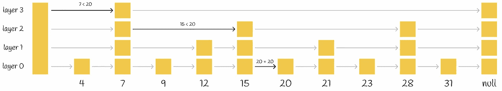

在跳表中找到元素 20

对于某个值的搜索程序从最高层开始，将其下一个元素与该值进行比较。如果值小于或等于该元素，则算法继续到下一个元素。否则，搜索程序降到连接更多的较低层，并重复相同的过程。最后，算法降到最低层并找到所需的节点。

根据 [维基百科](https://en.wikipedia.org/wiki/Skip_list) 的信息，跳表有一个主要参数 *p*，它定义了一个元素出现在多个列表中的概率。如果一个元素出现在层 *i* 中，则它出现在层 *i + 1* 的概率等于 *p*（*p* 通常设置为 0.5 或 0.25）。平均而言，每个元素会出现在 *1 / (1 — p)* 个列表中。

正如我们所见，这个过程比普通的链表线性搜索要快得多。实际上，HNSW 继承了相同的思想，但它使用的是图而不是链表。

# 可导航的小世界

[**可导航的小世界**](https://en.wikipedia.org/wiki/Small-world_network) 是一个具有多对数 *T = O(logᵏn)* 搜索复杂度的图，它使用贪心路由。**路由** 指的是从低度顶点开始搜索过程，并以高维度顶点结束。由于低度顶点的连接非常少，算法可以在它们之间迅速移动，从而高效地导航到可能存在最近邻的区域。然后，算法逐渐放大并切换到高维度顶点，以在该区域的顶点中找到最近邻。

> 顶点有时也被称为**节点**。

## 搜索

首先，通过选择一个入口点进行搜索。为了确定算法下一步移动的顶点（或顶点），它计算查询向量到当前顶点邻居的距离，并移动到最近的一个。某些时候，当算法找不到比当前节点更靠近查询的邻居节点时，它会终止搜索过程。这个节点被返回作为查询的响应。

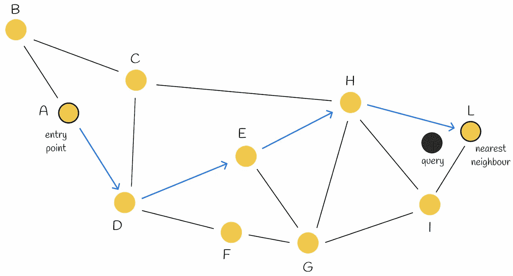

可导航的小世界中的贪心搜索过程。节点 A 被用作入口点。它有两个邻居 B 和 D。节点 D 比 B 更接近查询。因此，我们移动到 D。节点 D 有三个邻居 C、E 和 F。E 是距离查询最近的邻居，所以我们移动到 E。最终，搜索过程将导致节点 L。由于 L 的所有邻居都比 L 本身离查询更远，我们停止算法，并将 L 作为查询的答案返回。

这种贪心策略不能保证找到确切的最近邻，因为该方法仅使用当前步骤的局部信息来做出决策。**早期停止** 是该算法的问题之一。特别是在搜索过程的开始阶段，当没有比当前节点更好的邻居节点时，早期停止现象尤为明显。在大多数情况下，这可能发生在起始区域有太多低度顶点时。

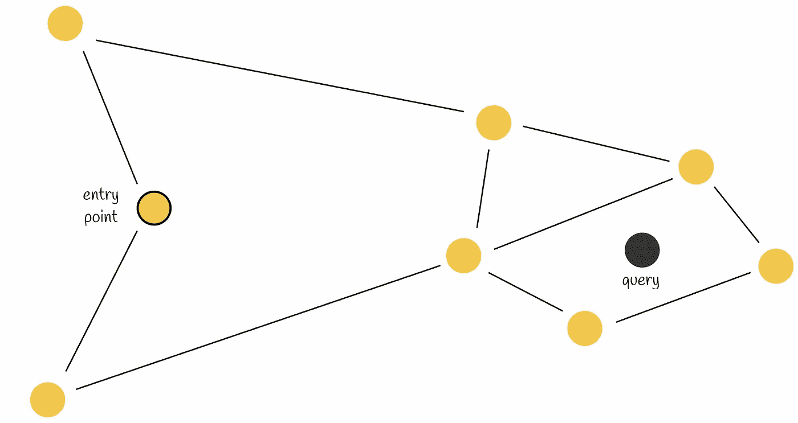

早期停止。当前节点的两个邻居都比查询更远。因此，算法返回当前节点作为响应，尽管存在距离查询更近的节点。

可以通过使用多个入口点来提高搜索精度。

## 构建

NSW 图是通过打乱数据集点并逐个将它们插入当前图中来构建的。当插入一个新节点时，它会通过边连接到其*M*个最近的顶点。

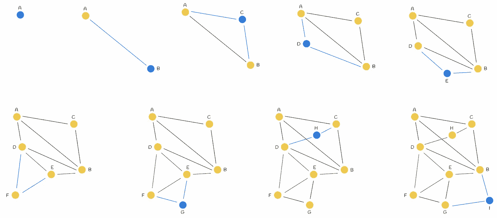

节点的顺序插入（从左到右），M = 2。在每次迭代中，向图中添加一个新顶点，并将其链接到其 M = 2 个最近邻居。蓝线表示连接到新插入节点的边。

在大多数情况下，长距离边缘可能会在图构建的初始阶段创建。它们在图导航中扮演着重要角色。

> 在构建开始时插入的元素的最近邻链接随后变成了网络中心之间的桥梁，这些桥梁保持了整个图的连通性，并允许在贪婪路由过程中对跳数进行对数缩放。 — Yu. A. Malkov, D. A. Yashunin

从上图中的示例可以看出，在开始时添加的长距离边缘*AB*的重要性。设想一个查询需要遍历从相对远离的节点*A*到*I*的路径。拥有边缘*AB*允许通过直接从图的一侧导航到另一侧来快速完成这个过程。

随着图中顶点数量的增加，新连接到新节点的边的长度变短的概率也增加。

# HNSW

[**HNSW**](https://arxiv.org/pdf/1603.09320.pdf) 基于与跳表和可导航小世界相同的原理。它的结构表现为一个多层次的图，其中顶部层次的连接较少，而底部层次的区域则更为密集。

# 搜索

搜索从最高层开始，每次在层节点中贪婪地找到局部最近邻，然后逐层向下。最终，找到的最低层上的最近邻即为查询的答案。

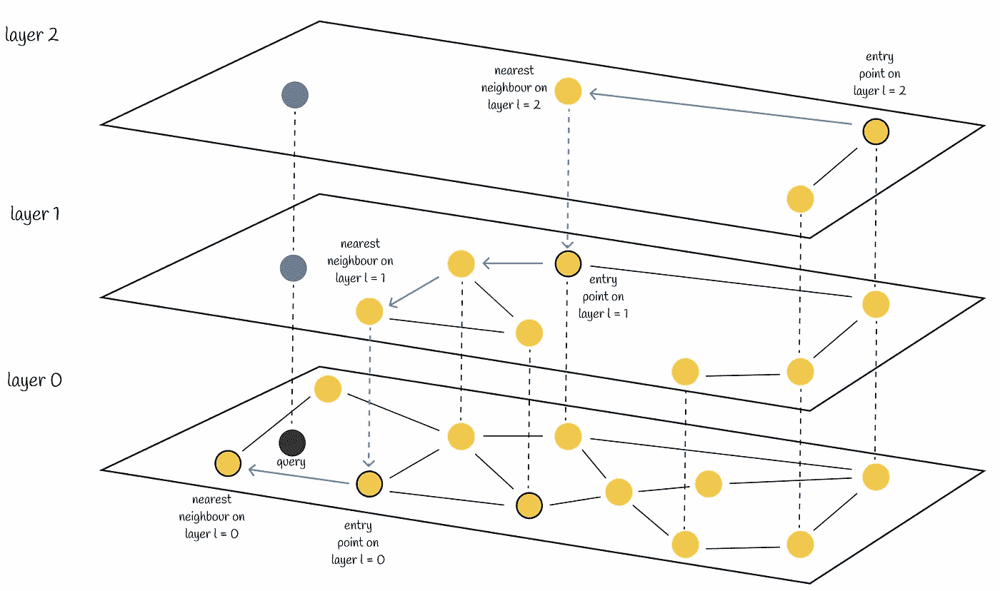

HNSW 中的搜索

类似于 NSW，通过使用多个入口点可以提高 HNSW 的搜索质量。与其在每层上仅找到一个最近邻，不如使用*efSearch*（一个超参数）找到与查询向量最接近的最近邻，并将每个邻居作为下一层的入口点。

## 复杂度

[原始论文](https://arxiv.org/pdf/1603.09320.pdf)的作者声称，在任何层上查找最近邻所需的操作数都由一个常数限制。考虑到图中的所有层数是对数级的，我们得到了总的搜索复杂度，即*O(logn)*。

# 构建

## 选择最大层

节点在 HNSW 中是一个接一个地顺序插入的。每个节点会随机分配一个整数*l*，表示该节点可以出现在图中的最大层。例如，如果*l = 1*，则该节点只能在第 0 层和第 1 层找到。作者为每个节点随机选择*l*，其*指数衰减概率分布*由非零乘数*mL（mL = 0* 结果是 HNSW 中的单层和非优化的搜索复杂度）*进行归一化*。通常，大多数*l*值应该等于 0，因此大多数节点仅存在于最低层。较大的*mL*值增加了节点出现在更高层的概率。

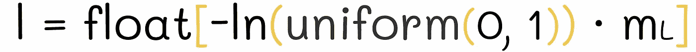

每个节点的层数 l 是根据*指数衰减概率分布*随机选择的。

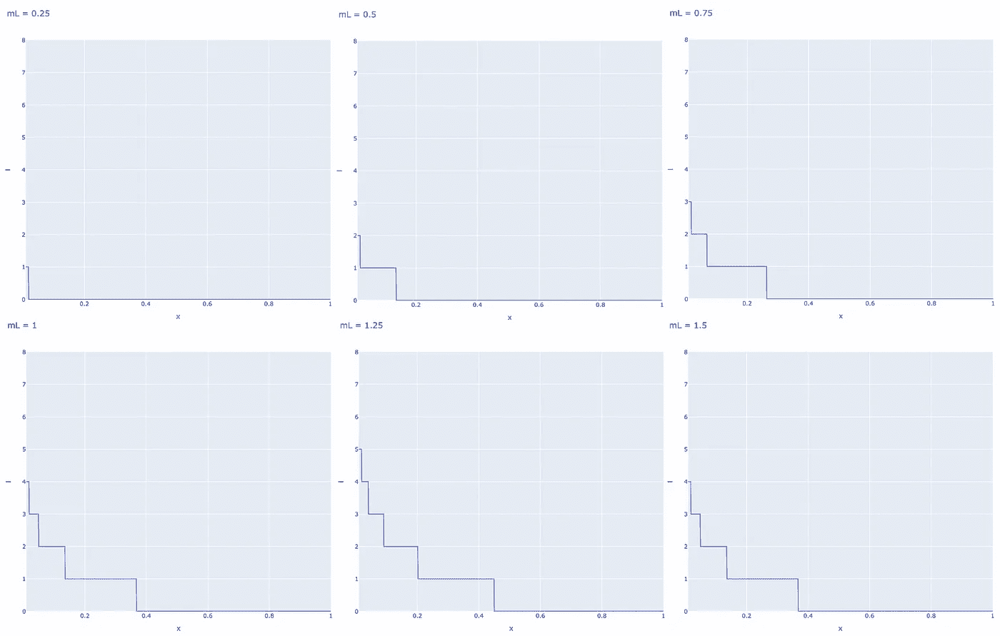

基于标准化因子*mL*的层数分布。横轴表示均匀分布(0, 1)的值。

> 为了实现可控层次结构的最佳性能优势，不同层之间的邻居重叠（即也属于其他层的元素邻居的百分比）必须很小。 — Yu. A. Malkov, D. A. Yashunin。

减少重叠的一个方法是减小*mL*。但重要的是要记住，减少*mL*通常会导致在每层贪婪搜索过程中需要更多的遍历。因此，选择一个能够平衡重叠和遍历次数的*mL*值至关重要。

论文的作者建议选择*mL*的最佳值，即*1 / ln(M)*。该值对应于跳表的参数*p = 1 / M*，它是层间的平均单元素重叠。

## 插入

节点被分配*l*值后，有两个插入阶段：

1.  算法从上层开始，贪婪地找到最近的节点。找到的节点随后被用作下一层的入口点，搜索过程继续。一旦达到层*l*，插入过程就进入第二步。

1.  从层*l*开始，算法在当前层插入新节点。然后，它像之前一样执行第 1 步，但不是仅找到一个最近邻，而是贪婪地搜索*efConstruction*（超参数）个最近邻。然后从*efConstruction*个邻居中选择*M*个，并建立从插入节点到它们的边。之后，算法下降到下一层，每个找到的*efConstruction*节点作为入口点。算法在新节点及其边被插入到最低层 0 后终止。

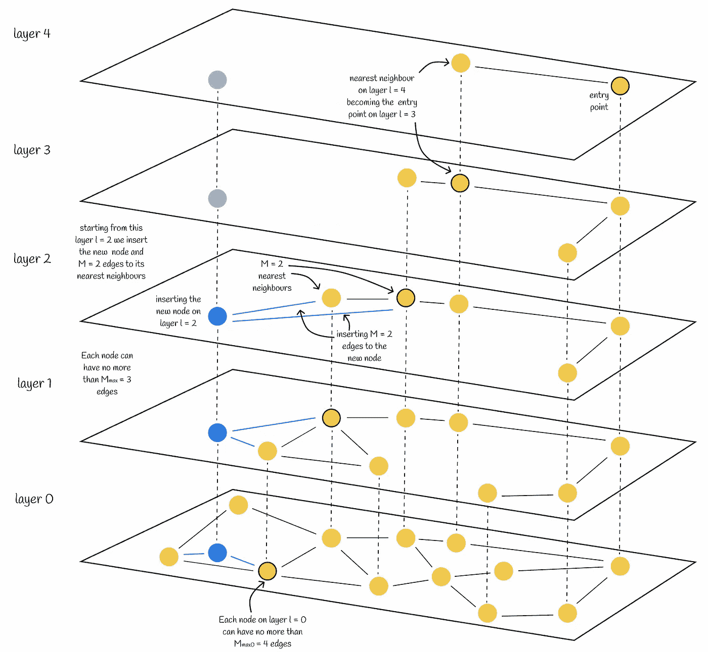

在 HNSW 中插入一个节点（蓝色）。新节点的最大层随机选择为 l = 2。因此，节点将被插入到层 2、1 和 0。在每一层，节点将连接到其 M = 2 个最近邻。

## 选择构造参数的值

原始论文提供了如何选择超参数的几个有用见解：

+   根据模拟，*M*的良好值在 5 到 48 之间。较小的*M*值适合较低的召回率或低维数据，而较大的 M 值则更适合较高的召回率或高维数据。

+   更高的*efConstruction*值意味着更深层次的搜索，因为会探索更多的候选项。然而，这也需要更多的计算。作者建议选择一个*efConstruction*值，以便在训练过程中回忆接近*0.95–1*。

+   另外，还有一个重要的参数 *Mₘₐₓ* — 一个顶点可以拥有的最大边数。除此之外，还存在一个相同的参数 *Mₘₐₓ₀*，但仅针对最低层。建议选择一个接近 *2 * M* 的 *Mₘₐₓ* 值。大于 *2 * M* 的值可能会导致性能下降和过度的内存使用。同时，*Mₘₐₓ = M* 会导致高召回率下性能差。

## 候选选择启发式

上面提到，在节点插入过程中，从 *efConstruction* 候选节点中选择 *M* 个来建立边。让我们讨论选择这些 *M* 个节点的可能方法。

天真的方法选取 *M* 个最近的候选节点。然而，这并不总是最优选择。下面是一个演示这个问题的例子。

想象一个如下面图所示的图结构。正如你所见，图中有三个区域，其中两个区域彼此没有连接（在左侧和顶部）。因此，例如，从点 *A* 到 *B* 需要通过另一个区域经过很长的路径。为了更好的导航，将这两个区域以某种方式连接起来是合乎逻辑的。

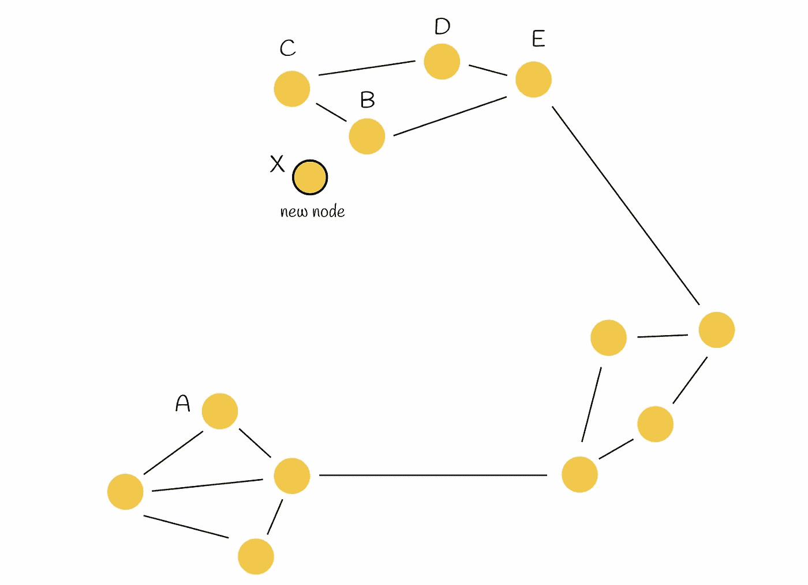

节点 *X* 被插入到图中。目标是将其最优地连接到其他 *M* = 2 个点。

然后一个节点 *X* 被插入到图中，并且需要连接到 *M* *= 2* 个其他顶点。

在这种情况下，天真的方法直接选择 *M = 2* 个最近的邻居（*B* 和 *C*），并将 *X* 连接到它们。尽管 *X* 已经连接到其真实的最近邻居，但这并没有解决问题。让我们来看一下作者们发明的启发式方法。

> 启发式算法不仅考虑节点之间的最近距离，还考虑图中不同区域的连通性。

启发式算法选择第一个最近的邻居（在我们的例子中是 *B*）并将插入的节点 (*X*) 连接到它。然后算法按照排序的顺序逐个选择下一个最接近的邻居 (*C*)，并仅当该邻居到新节点 (*X*) 的距离小于该邻居到所有已经连接的顶点 (*B*) 到新节点 (*X*) 的距离时，才建立一条边。之后，算法继续处理下一个最近的邻居，直到建立 *M* 条边。

回到例子，启发式过程如下面的图所示。启发式算法选择 *B* 作为 *X* 的最近邻居，并建立了边 *BX*。然后算法选择 *C* 作为下一个最近邻居。然而，这次 *BC < CX*。这表明将边 *CX* 添加到图中并不是最优的，因为已经存在边 *BX*，且节点 *B* 和 *C* 非常接近。相同的类比适用于节点 *D* 和 *E*。之后，算法检查节点 *A*。这一次，它满足条件，因为 *BA* *> AX*。因此，新边 *AX* 和两个初始区域变得互相连接。

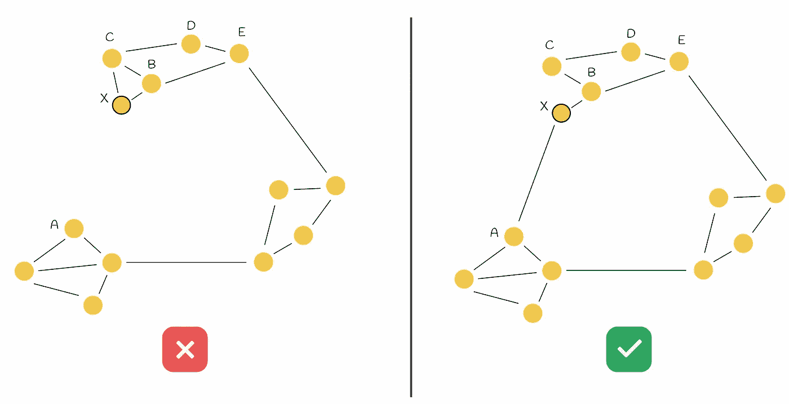

左侧的示例使用了简单的方法。右侧的示例使用了选择启发式，使两个初始不相交的区域相互连接。

## 复杂度

插入过程与搜索过程非常相似，没有显著的差异需要非恒定数量的操作。因此，单个顶点的插入需要 *O(logn)* 的时间。要估计总复杂度，应该考虑给定数据集中的所有插入节点 *n*。最终，HNSW 构建需要 *O(n * logn)* 时间。

# 将 HNSW 与其他方法结合使用

HNSW 可以与其他相似性搜索方法结合使用，以提供更好的性能。最常见的方法之一是将其与倒排文件索引和产品量化（*IndexIVFPQ*）结合使用，这在本系列文章的其他部分中已有描述。

 [## 相似性搜索，第三部分：融合倒排文件索引和产品量化

### 在本系列的前两部分中，我们讨论了信息检索中的两个基本算法：倒排……

medium.com](https://medium.com/@slavahead/similarity-search-blending-inverted-file-index-and-product-quantization-a8e508c765fa?source=post_page-----2aad4fe87d37--------------------------------)

在这个范式中，HNSW 充当**粗量化器**的角色，负责找到最近的 Voronoi 划分，从而可以缩小搜索范围。为此，必须在所有 Voronoi 质心上构建 HNSW 索引。给定查询时，使用 HNSW 找到最近的 Voronoi 质心（而不是之前通过比较每个质心的距离进行的暴力搜索）。之后，查询向量在相应的 Voronoi 划分中被量化，并通过 PQ 代码计算距离。

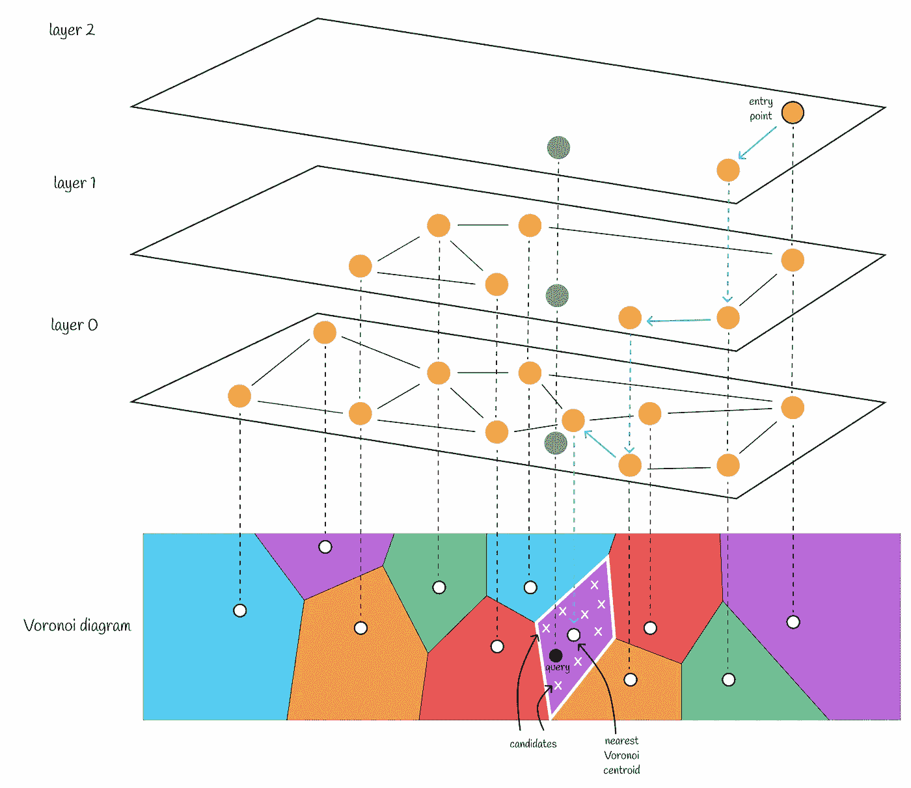

通过在 Voronoi 质心上建立的 HNSW 中找到最近邻，选择最接近的 Voronoi 质心。

当仅使用倒排文件索引时，最好将 Voronoi 划分的数量设置得不太大（例如 256 或 1024），因为会执行暴力搜索以找到最近的质心。通过选择较少的 Voronoi 划分，划分内的候选项数量变得相对较大。因此，算法迅速识别查询的最近质心，并且大部分运行时间集中在 Voronoi 划分内找到最近邻上。

然而，将 HNSW 引入工作流需要调整。考虑仅在少量质心（256 或 1024）上运行 HNSW：由于质心数量较少，HNSW 在执行时间上与简单的暴力搜索相对相同，因此不会带来显著的好处。此外，HNSW 需要更多的内存来存储图结构。

> 这就是为什么在合并 HNSW 和倒排文件索引时，建议将 Voronoi 质心的数量设置得比平时大得多。这样，每个 Voronoi 分区内的候选者数量会大大减少。

这种范式的转变导致了以下设置：

+   HNSW 以对数时间快速识别最近的 Voronoi 质心。

+   之后，执行各自 Voronoi 分区内的穷举搜索。因为潜在候选者的数量较少，所以不应成为问题。

# Faiss 实现

> [**Faiss**](https://github.com/facebookresearch/faiss)（Facebook AI 搜索相似性）是一个用 C++编写的 Python 库，用于优化相似性搜索。该库提供了不同类型的索引，这些索引是用于高效存储数据和执行查询的数据结构。

根据[Faiss 文档](https://faiss.ai)的信息，我们将探讨如何将 HNSW 与倒排文件索引和乘积量化结合使用。

## IndexHNSWFlat

FAISS 有一个类*IndexHNSWFlat*实现了 HNSW 结构。通常，“*Flat*”后缀表示数据集向量完全存储在索引中。构造函数接受 2 个参数：

+   **d**：数据维度。

+   **M**：在插入过程中需要添加到每个新节点的边的数量。

此外，通过**hnsw**字段，*IndexHNSWFlat* 提供了几个有用的属性（可以修改）和方法：

+   **hnsw.efConstruction**：构造时要探索的最近邻数量。

+   **hnsw.efSearch**：搜索时要探索的最近邻数量。

+   **hnsw.max_level**：返回最大层级。

+   **hnsw.entry_point**：返回入口点。

+   **faiss.vector_to_array(index.hnsw.levels)**：返回每个向量的最大层级列表。

+   **hnsw.set_default_probas(M: int, level_mult: float)**：允许分别设置*M*和*mL*值。默认情况下，*level_mult* 设置为 *1 / ln(M)*。

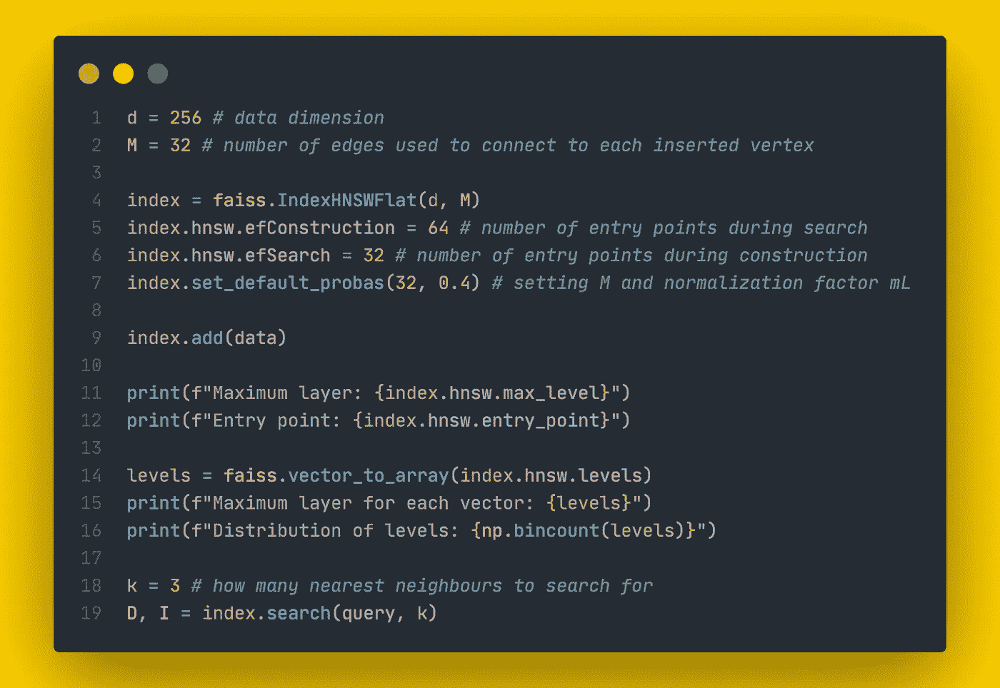

Faiss 实现的 IndexHNSWFlat

*IndexHNSWFlat* 为*Mₘₐₓ = M* 和 *Mₘₐₓ₀ = 2 * M* 设置值。

## IndexHNSWFlat + IndexIVFPQ

*IndexHNSWFlat* 也可以与其他索引结合使用。一个例子是前面部分描述的*IndexIVFPQ*。创建这个复合索引分两个步骤进行：

1.  *IndexHNSWFlat* 被初始化为粗量化器。

1.  量化器作为参数传递给*IndexIVFPQ*的构造函数。

训练和添加可以使用不同或相同的数据完成。

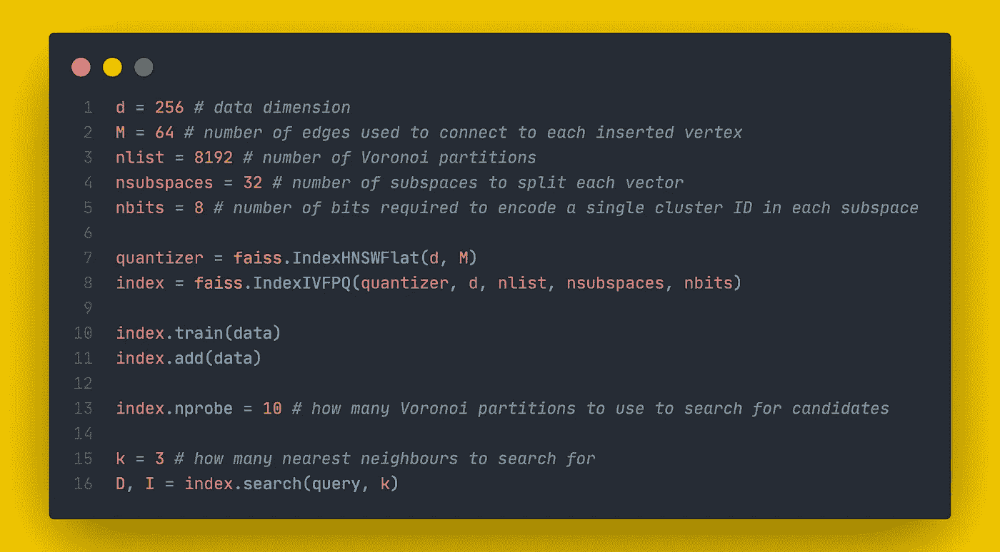

FAISS 实现的 IndexHNSWFlat + IndexIVFPQ

# 结论

在这篇文章中，我们研究了一种强大的算法，该算法在处理大型数据集向量时表现尤为出色。通过使用多层图表示和候选选择启发式方法，其搜索速度在保持合理的预测准确性的同时得以高效扩展。值得注意的是，HNSW 还可以与其他相似性搜索算法结合使用，使其非常灵活。

# 资源

+   [六度分隔理论 | 维基百科](https://en.wikipedia.org/wiki/Six_degrees_of_separation)

+   [跳表 | 维基百科](https://en.wikipedia.org/wiki/Skip_list)

+   [使用层次导航小世界图进行高效且强大的近似最近邻搜索。Yu. A. Malkov, D. A. Yashunin](https://arxiv.org/pdf/1603.09320.pdf)

+   [Faiss 文档](https://faiss.ai)

+   [Faiss 仓库](https://github.com/facebookresearch/faiss)

+   [Faiss 索引总结](https://github.com/facebookresearch/faiss/wiki/Faiss-indexes)

*除非另有说明，否则所有图像均由作者提供。*
