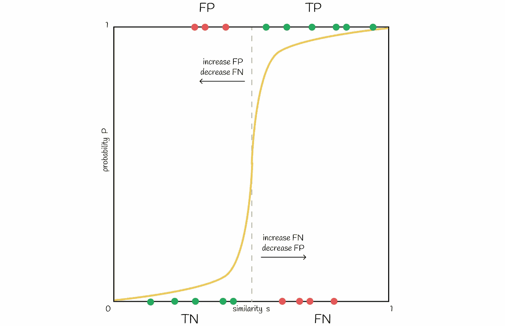

# 相似性搜索，第五部分：局部敏感哈希（LSH）

> 原文：[`towardsdatascience.com/similarity-search-part-5-locality-sensitive-hashing-lsh-76ae4b388203?source=collection_archive---------0-----------------------#2023-06-24`](https://towardsdatascience.com/similarity-search-part-5-locality-sensitive-hashing-lsh-76ae4b388203?source=collection_archive---------0-----------------------#2023-06-24)

## 探索如何将相似性信息融入哈希函数

 [Vyacheslav Efimov](https://medium.com/@slavahead?source=post_page-----76ae4b388203--------------------------------)

·

[关注](https://medium.com/m/signin?actionUrl=https%3A%2F%2Fmedium.com%2F_%2Fsubscribe%2Fuser%2Fc8a0ca9d85d8&operation=register&redirect=https%3A%2F%2Ftowardsdatascience.com%2Fsimilarity-search-part-5-locality-sensitive-hashing-lsh-76ae4b388203&user=Vyacheslav+Efimov&userId=c8a0ca9d85d8&source=post_page-c8a0ca9d85d8----76ae4b388203---------------------post_header-----------) 发表在 [Towards Data Science](https://towardsdatascience.com/?source=post_page-----76ae4b388203--------------------------------) ·10 分钟阅读·2023 年 6 月 24 日

--

**相似性搜索** 是一个问题，给定一个查询的目标是在所有数据库文档中找到与其最相似的文档。

# 介绍

在数据科学中，相似性搜索通常出现在自然语言处理（NLP）领域、搜索引擎或推荐系统中，其中需要为一个查询检索到最相关的文档或项目。存在多种不同的方法来提升在海量数据中的搜索性能。

在本系列文章的前几部分中，我们讨论了倒排文件索引、产品量化和 HNSW 以及它们如何结合使用以提高搜索质量。在本章中，我们将探讨一种主要不同的方法，这种方法既能保持高搜索速度，又能保证高质量。

 ## 相似性搜索，第三部分：融合倒排文件索引和产品量化

### 在本系列的前两部分中，我们讨论了信息检索中的两个基本算法：倒排…

towardsdatascience.com  ## 相似性搜索，第四部分：分层可导航小世界（HNSW）

### 分层可导航小世界（HNSW）是一种最先进的算法，用于近似搜索最近的…

towardsdatascience.com

> **局部敏感哈希**（LSH）是一组方法，用于通过将数据向量转换为哈希值来缩小搜索范围，同时保留有关其相似性的信息。

我们将讨论传统方法，该方法包括三个步骤：

1.  **切片**：将原始文本编码成向量。

1.  **MinHashing**：将向量转换为一种称为 **签名** 的特殊表示形式，这种表示形式可以用于比较它们之间的相似性。

1.  **LSH 函数**：将签名块哈希到不同的桶中。如果一对向量的签名至少有一次落入同一个桶中，则它们被视为候选。

我们将逐步深入探讨这些步骤的细节。

# 切片

**切片**是从给定文本中收集 *k*-grams 的过程。***k*-gram** 是一组 *k* 个顺序排列的标记。根据上下文，标记可以是单词或符号。切片的最终目标是通过使用收集到的 *k*-grams 来编码每个文档。我们将使用独热编码来完成这一点。然而，也可以应用其他编码方法。

收集句子“学习数据科学很有趣”的长度为 k = 3 的唯一切片

首先，收集每个文档的独特*k*-gram。其次，为了对每个文档进行编码，需要一个词汇表，它代表了所有文档中独特*k*-gram 的集合。然后，为每个文档创建一个长度等于词汇表大小的零向量。对于文档中出现的每个*k*-gram，确定其在词汇表中的位置，并在文档向量的相应位置放置一个*“1”*。即使相同的*k*-gram 在文档中出现多次也没关系：向量中的值始终为 1。

一热编码

# MinHashing

在这个阶段，初始文本已经被向量化。可以通过**Jaccard 指数**比较向量的相似性。记住，Jaccard 指数定义为两个集合中共同元素的数量除以所有元素的总长度。

Jaccard 指数定义为两个集合的交集与并集之比

如果取一对编码向量，则 Jaccard 指数公式中的交集是两个都包含 1 的行数（即*k*-gram 在两个向量中都出现），并且并集是至少包含一个 1 的行数（*k*-gram 至少在一个向量中出现）。

Jaccard 指数公式

使用上述公式计算两个向量的 Jaccard 指数的示例

当前的问题是编码向量的稀疏性。计算两个一热编码向量之间的相似性得分将耗费大量时间。将它们转换为稠密格式可以使后续操作更高效。最终目标是设计一个将这些向量转换为较小维度的函数，同时保留它们的相似性信息。构建这样的函数的方法称为 MinHashing。

> **MinHashing** 是一种哈希函数，它对输入向量的组件进行排列，然后返回排列向量组件等于 1 的第一个索引。

计算给定向量和排列的 minhash 值的示例

为了获得由*n*个数字组成的向量的稠密表示，可以使用*n*个 minhash 函数来获得*n*个 minhash 值，这些值构成一个**签名**。

一开始可能不太明显，但可以使用多个 minhash 值来近似向量之间的 Jaccard 相似性。实际上，使用的 minhash 值越多，近似值就越准确。

计算签名矩阵及其如何用于计算向量之间的相似性。使用 Jaccard 相似性和签名计算的相似性应该通常大致相等。

这只是一个有用的观察。事实证明，背后有一个完整的定理。让我们来了解为什么 Jaccard 指数可以通过使用签名来计算。

## 陈述证明

假设给定的一对向量仅包含*01*、*10*和*11*类型的行。然后对这些向量进行随机排列。由于所有行中至少存在一个 1，因此在计算两个哈希值时，这两个哈希值计算过程中的至少一个会在具有对应哈希值为 1 的向量的第一行停止。

第二个哈希值等于第一个的概率是多少？显然，只有当第二个哈希值也等于 1 时才会发生。这意味着第一行必须是*11*类型。由于排列是随机的，这种事件的概率等于*P* *=* *count(11) / (count(01) + count(10) + count(11)*)。这个表达式与 Jaccard 指数公式完全相同。因此：

> **基于随机行排列，两个二进制向量获得相同哈希值的概率等于 Jaccard 指数**。

然而，通过证明上述陈述，我们假设初始向量不包含*00*类型的行。显然，*00*类型的行不会改变 Jaccard 指数的值。同样，包含*00*类型行时获得相同哈希值的概率不会影响它。例如，如果第一个排列行是 00，则 minhash 算法只是忽略它，转到下一行，直到找到至少一个 1。**当然，*00*类型的行可能导致不同的哈希值，但获得相同哈希值的概率保持不变**。

我们已经证明了一个重要的陈述。但是，如何估计获得相同的 minhash 值的概率呢？当然，可以生成所有可能的向量排列，然后计算所有的 minhash 值以找到所需的概率。出于显而易见的原因，这种方法效率不高，因为一个大小为*n*的向量的可能排列数等于*n!*。不过，概率可以大致评估：我们可以使用很多哈希函数来生成大量的哈希值。

> 两个二进制向量的 Jaccard 指数大致等于它们签名中对应值的数量。

数学符号

很容易注意到，采用更长的签名会导致更准确的计算。

# LSH 函数

目前，我们可以将原始文本转换为长度相等的密集签名，从而保留关于相似性的的信息。然而，在实践中，这些密集签名通常仍具有高维度，直接比较它们效率不高。

考虑到*n = 10⁶* 个文档，每个文档的签名长度为 100\. 假设一个签名的单个数字需要 4 字节来存储，那么整个签名将需要 400 字节。存储*n = 10⁶* 个文档需要 400 MB 的空间，这在现实中是可行的。但以蛮力方式比较每个文档需要大约 5 * 10¹¹次比较，这太多了，尤其是当*n* 更大的时候。

为了避免这个问题，可以建立一个哈希表来加速搜索性能，但即使两个签名非常相似，仅在 1 个位置上有所不同，它们仍可能具有不同的哈希值（因为向量的余数可能不同）。然而，我们通常希望它们落入同一个桶中。这就是 LSH 派上用场的地方。

> **LSH**机制构建一个哈希表，该表由几个部分组成，如果一对签名有至少一个对应的部分，它们就会被放入同一个桶中。

LSH 将签名矩阵水平分成相等的*b*部分，称为**带**，每部分包含*r* **行**。而不是将整个签名插入到一个哈希函数中，签名被分成*b*部分，每个子签名由一个哈希函数独立处理。因此，每个子签名落入不同的桶中。

LSH 的示例。两个长度为 9 的签名被分成 b = 3 个带，每个带包含 r = 3 行。每个子向量被哈希到 k 个可能的桶之一。由于第二个带中存在匹配（两个子向量具有相同的哈希值），我们将这两个签名对视为最近邻候选。

如果两个不同签名的对应子向量之间至少有一个碰撞，那么这些签名被视为候选。如我们所见，这个条件更灵活，因为考虑向量作为候选者时，它们不需要完全相等。然而，这增加了假阳性的数量：一对不同的签名可能只有一个对应的部分，但总体上完全不同。根据问题的不同，优化参数*b*、*r* 和 *k* 总是更好的。

# 错误率

使用 LSH，可以估计两个具有相似度*s*的签名被视为候选的概率，给定带数*b*和每个带中的行数*r*。让我们分几个步骤找到它的公式。

两个签名的任意一行相等的概率

一随机带有 r 行的概率相等

一随机带有 r 行的概率不同

表中所有 b 个带不同的概率

至少有一个 b 带相等的概率，即两个签名是候选的

注意，公式没有考虑当不同的子向量意外地哈希到同一个桶中时的碰撞。因此，签名成为候选的真实概率可能会略有不同。

## 示例

为了更好地理解我们刚刚得到的公式，我们考虑一个简单的例子。考虑两个长度为 35 符号的签名，它们被平均分成 5 个带，每个带有 7 行。以下表格表示了基于 Jaccard 相似度至少有一个相等带的概率：

基于相似度 *s*，至少获得一对签名具有对应带的概率 P

我们注意到，如果两个相似的签名具有 80% 的 Jaccard 相似度，那么在 93.8% 的情况下它们有一个对应带（*true positives*）。在剩余的 6.2% 情况下，这样的一对签名是 *false negative*。

现在让我们考虑两个不同的签名。例如，它们的相似度只有 20%。因此，在 0.224% 的情况下，它们是 *false positive* 候选。在其他 99.776% 的情况下，它们没有相似的带，所以它们是 *true negatives*。

## 可视化

现在让我们可视化相似度 *s* 和两个签名成为候选的概率 *P* 之间的关系。通常，随着签名相似度 *s* 的提高，签名成为候选的概率应当更高。理想情况下，情况如下：

理想的场景。只有当签名的相似度大于某个阈值 t 时，才认为一对签名是候选的

基于上述获得的概率公式，典型的线如下图所示：

一条典型的线在开始和结束时缓慢上升，并在图中所示的近似概率公式的阈值 t 处有一个陡峭的斜率

可以通过改变带的数量*b*，将图中的线向左或向右移动。增加 *b* 将线向左移动，并导致更多的 *FP*，减少则将其向右移动，导致更多的 *FN*。根据问题找到一个好的平衡点是很重要的。

带的数量增加，线会向左移动；减少则向右移动

将阈值向左移动会增加 FP，而向右移动则增加 FN

## 采用不同数量的带和行进行实验

以下为不同值的*b*和*r*构建的几条线图。根据具体任务调整这些参数通常更为有效，以成功检索所有相似文档对，并忽略那些具有不同签名的文档。

调整带的数量

调整行数

# 结论

我们已经讲解了 LSH 方法的经典实现。LSH 通过使用低维签名表示和快速哈希机制来优化搜索速度，从而减少候选项的搜索范围。同时，这也会影响搜索的准确性，但在实践中，差异通常微不足道。

然而，LSH 对高维数据比较敏感：更多维度需要更长的签名长度和更多计算来保持良好的搜索质量。在这种情况下，建议使用其他索引。

实际上，存在不同的 LSH 实现，但所有这些实现都基于*将输入向量转换为哈希值的相同范式，同时保留关于它们相似性的信息*。基本上，其他算法只是定义了获得这些哈希值的不同方式。

**随机投影**是另一种 LSH 方法，将在下一章中介绍，并且在[Faiss](https://github.com/facebookresearch/faiss)库中实现为 LSH 索引，用于相似性搜索。

# 资源

+   [局部敏感哈希 | 安德鲁·怀利 | 2013 年 12 月 2 日](https://cse.iitkgp.ac.in/~animeshm/algoml/lsh.pdf)

+   [数据挖掘 | 局部敏感哈希 | 塞格德大学](https://www.inf.u-szeged.hu/~berendg/docs/dm/DM_lsh_en_pf.pdf)

+   [Faiss 库](https://github.com/facebookresearch/faiss)

*所有图像除非另有说明，均由作者提供。*
