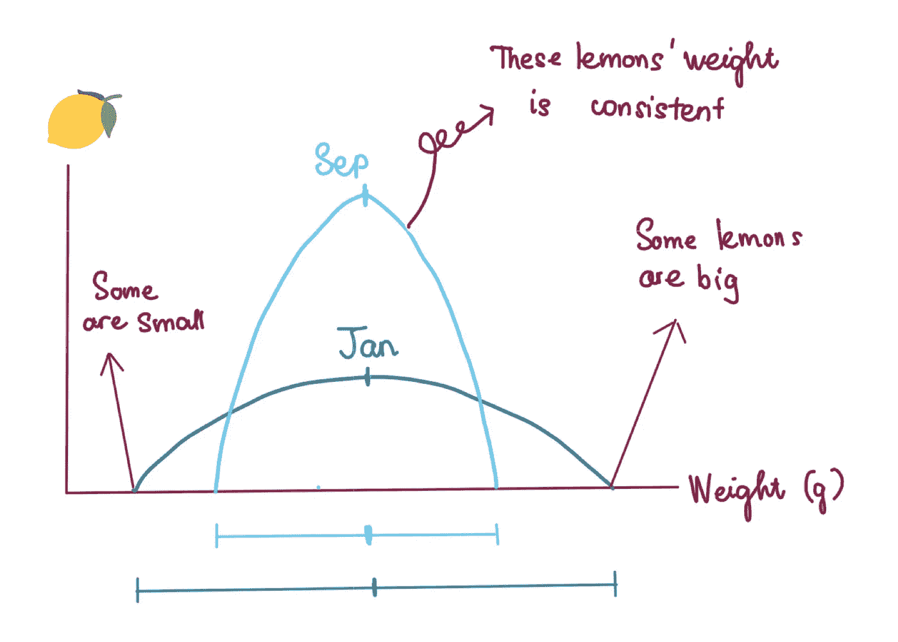
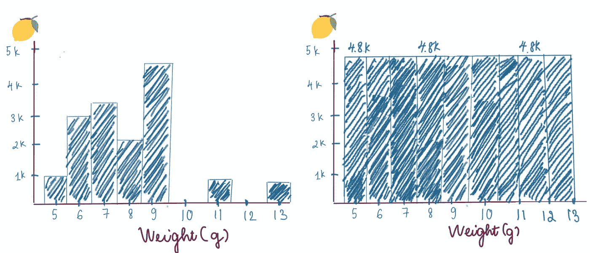
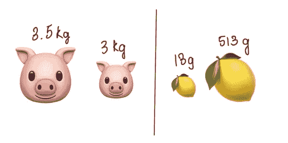
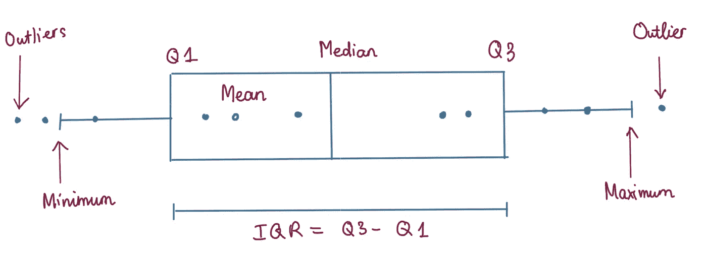
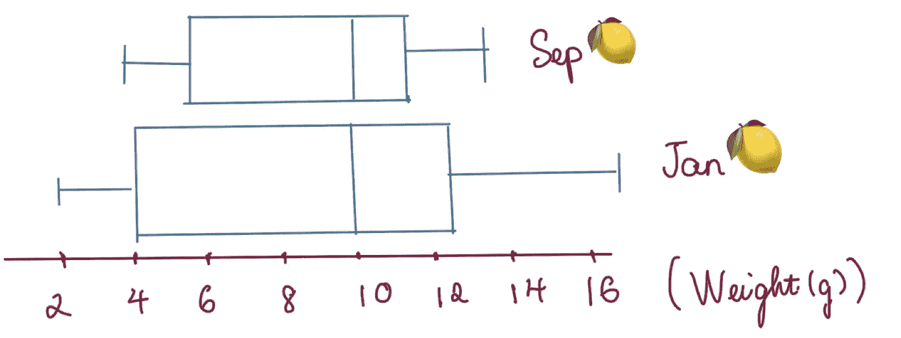
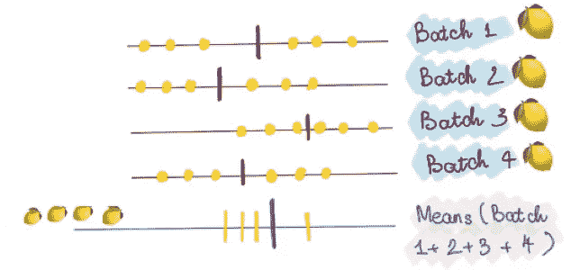
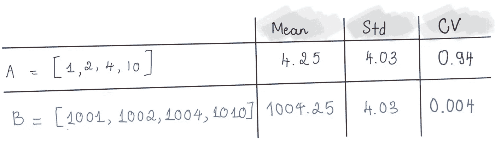

# 基本统计概念的简单解释（第二部分）

> 原文：[`towardsdatascience.com/simple-explanations-of-basic-statistics-concepts-part-2-baa49db597ba`](https://towardsdatascience.com/simple-explanations-of-basic-statistics-concepts-part-2-baa49db597ba)

## 不同统计概念的简单解释

 [Chi Nguyen](https://nphchi223.medium.com/?source=post_page-----baa49db597ba--------------------------------)

·发布于 [Towards Data Science](https://towardsdatascience.com/?source=post_page-----baa49db597ba--------------------------------) ·7 分钟阅读·2023 年 3 月 22 日

--

图片来源于 [Icons8 Team](https://unsplash.com/@icons8?utm_source=medium&utm_medium=referral) 在 [Unsplash](https://unsplash.com/?utm_source=medium&utm_medium=referral)

# 介绍

在 ***第一部分：基本统计概念的简单解释***中，我解释了有关统计概念的一些基本思想，包括与总体和样本相关的不同定义、抽样方法和置信区间。今天，我将为你提供一些经常遇到的统计主题的额外解释。希望即使是对统计学不熟悉的人也能简单易懂。

现在，让我们深入了解吧！

# 变异性

## 什么是变异性 & 为什么它很重要？

谈到变异性时，你是在讨论数据的**分散程度**。中位数和均值并不适用于此，因为它们仅显示了大多数数据值的范围。

你还记得第一部分中提到的我家柠檬农场的例子吗 ^^？在本节中，我将再次提到我的柠檬农场。每年，我家需要在 1 月和 9 月进行两次柠檬收获。下面展示了每个收获季节柠檬重量的分布。乍一看，我们可以看到两个收获季节的柠檬平均重量大致相同。然而，似乎 1 月份柠檬的重量分布比 9 月份的柠檬更为分散。换句话说，尽管两个月收获的柠檬重量相似，但 1 月份收获的柠檬变异性更大。***因此，相同的集中趋势并不意味着相似的变异度，反之亦然。***

图 1 — 作者提供的图片

显然，了解变异性同样重要，因为它帮助我的家庭评估两个收获季节之间柠檬的质量，并在 1 月份调整种植方法，以产出更可比的产品。

***总体而言，低变异性更可取，因为它使用样本数据提供了更准确的总体信息预测。***

那么，我们如何在统计学中描述变异性（或差异）呢？我们来看 4 个指标：范围、标准差、方差和四分位差。

## 范围

这是变异性的最简单测量方法，计算方法是最小值与最大值之间的差异。

例如，在 1 月份的收获中，最重的柠檬重 13 克，而最小的柠檬仅重 2 克。这意味着重量从 2 克到 13 克变化，柠檬的重量范围是 11 克。

尽管其简单性，范围很少作为唯一的变异性测量方法。原因是范围不能考虑所有数据点。看看下面的图 2，你会看到两种情况的范围都是 13–5=8 克。然而，那两者之间的体重分布完全不同。这就是为什么仅了解范围并不能告诉你数据如何分散。

图 2：作者拍摄

要深入了解，方差和标准差是你可能需要的。

## 方差与标准差

这两个指标描述了值的分布情况。

在比较两个大致相同平均值的不同数据集的离散度时，标准差很有帮助，因为它告诉我们每个数据点与均值的平均距离。标准差较小的数据集在均值周围更加集中。

但在使用标准差时，有一些注意事项。

***首先，标准差需要参考均值来评估***。例如，在比较猪的体重时，500 克的差异并不大。然而，对柠檬来说情况却不同。虽然柠檬的平均重量仅为 10 克，但增加 500 克的重量会产生巨大的差异。

图 3：作者拍摄

***其次，极端值可能会影响对标准差的解释。*** 一些异常值可能会增加标准差，使离散度看起来比正常情况更大。***这引出了我的第三点，即当数据呈正态分布时，标准差更受青睐。***

方差是通过平方标准差计算得出的。更高的方差意味着数据更分散。方差可能更难直观理解，但毫无疑问，它是用于统计检验的一个重要指标，例如 ANOVA，用于测试数据集之间的差异。

## 四分位差

当数据具有不对称分布、包含极端值或在有序水平上测量时，使用四分位距会更合适。

当数据值按升序排序时，Q1（即第一个四分位数）是 25%的数据值小于或等于的那个值。类似地，75%的数据值低于的那个值被称为第三四分位数（Q3）。IQR 即 Q3 与 Q1 之间的差值。

图 4: IQR — 作者

假设我农场生产的 9 月柠檬和 1 月柠檬的重量中位数相同。然而，如图 5 所示，1 月收获的重量 IQR 大于 9 月的。因此，这表明 1 月采摘的柠檬重量差异显著，而 9 月收获的柠檬重量更为接近。

图 5 — 作者

## 一般来说，…

+   如果你的数据是有序的，使用范围和四分位距来评估数据的变异性。

+   如果你的数据呈正态分布，应考虑标准差和方差，但要注意异常值。

+   如果你的数据不对称或有异常值，四分位距是合适的方法。

# 标准差与标准误差

标准误差定义为均值的标准差。这是什么意思呢？

假设我家想检查 9 月柠檬的重量。然而，由于称量所有柠檬会浪费太多时间，我们决定随机选择 4 个样本来评估重量。对于每一批次，我们仔细称量每个柠檬，并得出每批柠檬的平均重量。结果，我们得到 4 个均值，分别对应 4 个批次。然后，我们计算这 4 个均值的平均值。均重值的标准差被定义为**标准误差**。换句话说，**标准误差提示了如果我们随机选择 4 个柠檬样本进行评估时，均值的变化情况**。

如你从我之前的帖子中了解到的，抽样误差始终存在。因此，通过了解标准误差，你可以评估你的样本代表了多大程度的人群，从而得出可靠的见解。**低标准误差表明样本均值接近于总体均值，意味着样本代表性较好，反之亦然。**

图 6: 标准误差示例 — 作者

标准误差通常小于标准差，因为均值之间的差异不显著。

# 标准差与变异系数

变异系数（CV）可以简单理解为相对变异性的度量。它是通过将标准差与数据的规模结合考虑得出的。我为什么这么说呢？我们来举一个非常简单的例子。

假设我有两个数据集 A 和 B，如下所示。对于每个数据集，我可以很容易地计算均值和标准差。看来这两个数据集的标准差相同。然而，这是否意味着这两个数据集的数据分布应相似？答案是否定的。

看列表 A，你会发现最大值是最小值的 10 倍。而在列表 B 中，最大值仅比最小值大 1.009 倍。因此，很明显，列表 B 中的数据点彼此更接近。在这种情况下，标准差不再有用，因为它是以绝对值计算的。我们需要一种能考虑数据集规模的度量，那就是 CV。

CV 的计算方法是将标准差除以均值。A 的 CV 为 0.94，而 B 的 CV 仅为 0.004。B 的 CV 远小于 A 的 CV。显然，这个结果给我们展示了一个与标准差完全不同的情况。

图 6：CV — 作者

通常，当我们想要比较两个不同单位的数据集（如津巴布韦元与美元）时，CV 比标准差更有用。

# **结论**

统计学还有很多内容需要覆盖。然而，我会很快回来发布下一篇文章。希望我能让这些概念稍微清晰一点。感谢你一直耐心阅读到最后。

为了接收有关我即将发布的文章的更新，请使用提供的[**Medium 链接**](https://nphchi223.medium.com/subscribe)订阅成为会员。

干杯。

## 参考资料

[## 4.5.3 计算方差和标准差

### Statistics: Power from Data! 是一个创建于 2001 年的网络资源，旨在帮助中学学生和教师…

[www150.statcan.gc.ca](https://www150.statcan.gc.ca/n1/edu/power-pouvoir/ch12/5214891-eng.htm?source=post_page-----baa49db597ba--------------------------------)

[`www.scribbr.com/statistics/variability/#:~:text=questions%20about%20variability-,Why%20does%20variability%20matter%3F,the%20sample%20to%20your%20population`](https://www.scribbr.com/statistics/variability/#:~:text=questions%20about%20variability-,Why%20does%20variability%20matter%3F,the%20sample%20to%20your%20population)
