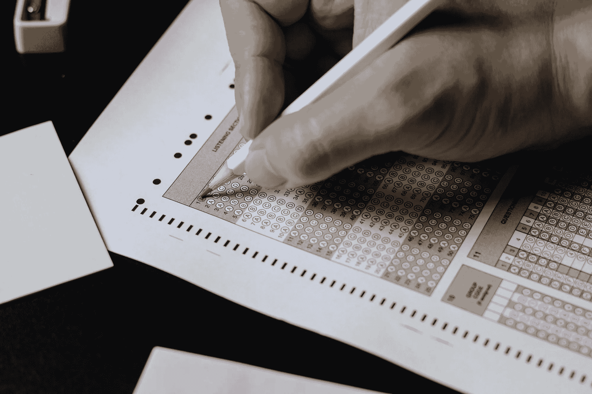
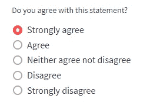
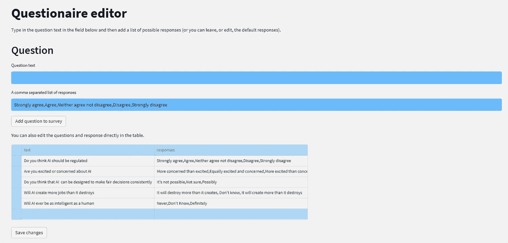
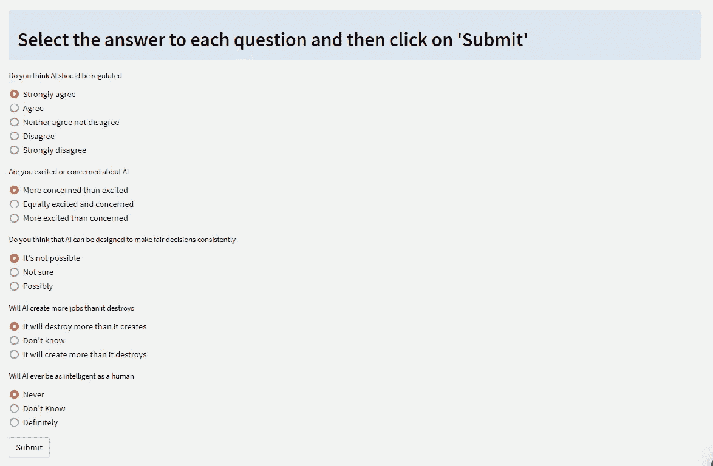
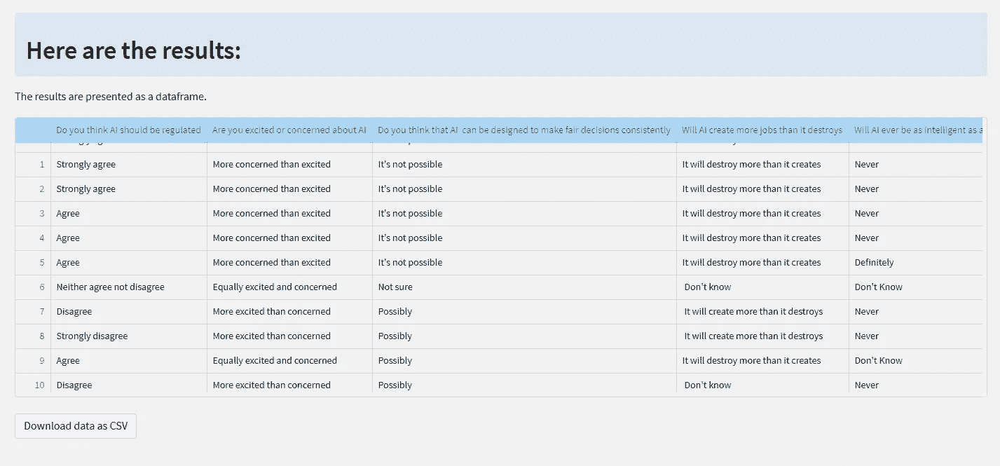
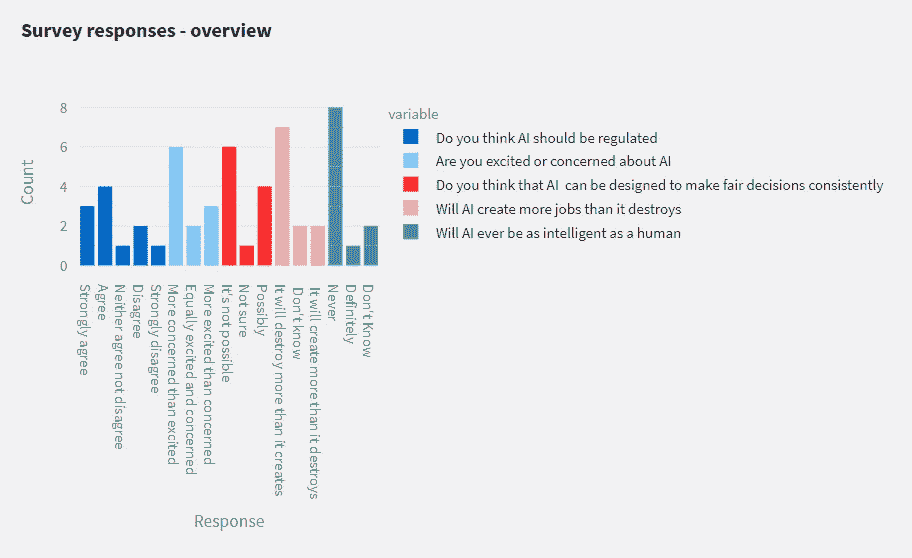
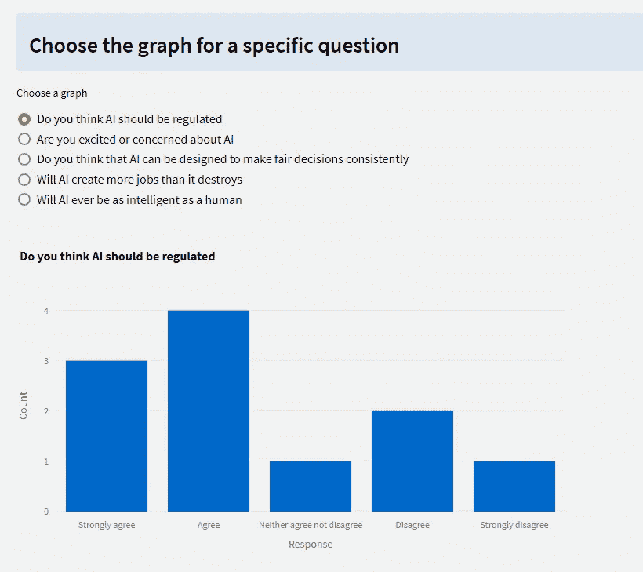

# 使用 Streamlit 进行简单调查

> 原文：[`towardsdatascience.com/simple-surveys-with-streamlit-and-databutton-d027586f1c71`](https://towardsdatascience.com/simple-surveys-with-streamlit-and-databutton-d027586f1c71)

## Streamlit 的用户界面组件使得构建简单调查变得容易

[](https://medium.com/@alan-jones?source=post_page-----d027586f1c71--------------------------------)[](https://towardsdatascience.com/?source=post_page-----d027586f1c71--------------------------------) [Alan Jones](https://medium.com/@alan-jones?source=post_page-----d027586f1c71--------------------------------)

·发布于 [Towards Data Science](https://towardsdatascience.com/?source=post_page-----d027586f1c71--------------------------------) ·阅读时间 10 分钟·2023 年 6 月 19 日

--



照片由 [Nguyen Dang Hoang Nhu](https://unsplash.com/@nguyendhn?utm_source=medium&utm_medium=referral) 提供，来源于 [Unsplash](https://unsplash.com/?utm_source=medium&utm_medium=referral)

+   *你对人工智能的未来有什么看法？应该对其进行监管吗？它会创造新工作还是会毁灭现有工作？*

+   *你认为气候变化将如何影响你的生活方式？*

+   *你相信宇宙中存在外星生命吗？*

+   *你最喜欢的数据科学编程语言是什么？*

有时我们使用他人的数据来创建故事——而有时我们需要创建自己的数据，因此我们必须进行收集。这可能是调查或实验结果的日志，但我们需要提出问题并记录结果数据。

当然，也有一些服务可以为你完成这项工作（有时需要付费，但也经常有免费的选项）。或者你可以坚持使用经过验证的剪贴板和铅笔方法。

但如果你是 Streamlit 用户，创建一个简单的调查还是相当容易的。

## 存储数据

不过有一点问题。虽然 Streamlit 的用户界面组件非常出色且易于使用，但没有内置的数据存储方法。你可以简单地将数据存储在文本文件或 SQLite 数据库中，这对于本地应用来说效果很好。 

如果你尝试在 Streamlit Cloud 部署该应用，你会发现你创建的任何数据都会消失。

一想就明白了。

当你启动一个 Streamlit Cloud 应用时，它会从 Github 复制源文件，包括任何数据文件或数据库，但当你离开应用时，数据不会被写回。因此，当你再次启动应用时，你将从头开始。你收集并存储的任何数据只能在应用运行时存在，当你离开应用时，这些数据就会丢失。

对于调查应用来说，这种行为并不好。

Streamlit 团队当然考虑到了这一点，并在他们的文档中提供了建议的解决方案（参见“[知识库](https://docs.streamlit.io/knowledge-base/tutorials)”中的教程部分）。这些主要涉及连接运行各种数据库（如 MySQL、Microsoft SQL Server 等）的数据库服务器，但也展示了如何将 Streamlit 与基于云的服务（如 Amazon S3、MongoDB 和 Google Cloud Storage）一起使用。

还有一个[Databutton](https://databutton.com/)，这是一个综合性的在线开发环境，专为 Streamlit 设计，具有一键部署、AI 支持编码等功能，并且将数据存储方便地集成在开发和部署环境中。文章末尾有一节关于迁移到 Databutton 的内容。

*（你们中的一些人可能已经看到这篇文章的标题上带有 Databutton——这是一个错误。我已经包含了一个 Databutton 部分，但我会在不久的将来写一篇更全面的关于 Databutton 的文章。）*

现在，我们将集中精力处理调查部分，并单独处理存储。在这个应用程序中，我们将使用一个本地文件来存储数据，但为了将来更方便，我们将把所有文件操作放入一个库中。这样，如果我们想迁移到另一个平台，我们只需重写库即可。因此，请记住，我们的初始应用程序并不是为了部署而设计的，而是为了在本地机器上运行。

## 在 Streamlit 中创建调查

Streamlit 提供了良好的用户界面组件选择，可用于创建、展示和分析调查数据。特别是，我们将利用一组单选按钮来实现多项选择题，并使用可编辑的数据框来展示和编辑问卷本身。



使用 Streamlit 单选按钮的多项选择题——截图由作者提供

我们可以稍后考虑更复杂的展示方式或不同的问题类型——目前我们将保持简单。

该应用程序有三个组件：问卷编辑器；调查展示；和结果分析器/可视化器。我已经将它们实现为多页面应用程序中的页面。（这仅意味着它们位于一个名为 *pages* 的文件夹中。）

## 编辑器

我们将主要使用 Python 字典来表示我们的数据——包括问卷和结果——在本地应用程序版本中，我们将其存储为 JSON 文件。

问题将存储在两个字段中，`text`，一个包含问题文本的字符串，以及 `responses`，一个由逗号分隔的多项选择答案的字符串。

你可以在下面的截图中看到以 Streamlit `data_editor` 组件显示的问题数据。使用这个组件，你可以直接编辑问卷（如果你愿意的话）。

在可编辑的数据框上方有几个字段：第一个是问题，第二个是可能的回答列表。填写这些内容并点击 *将问题添加到问卷* 按钮，你会看到新问题出现在数据框中。

如我所说，你也可以直接编辑数据框：点击相应的字段以更改现有数据；点击行左侧以选择该行并使用删除键删除它；或点击最后一行下方左侧以添加新行。

无论哪种情况，你都需要点击 *保存更改* 以存储数据。



问卷编辑器 — 作者截图

你可以看到下面的实现。

Streamlit 程序在每次用户交互时都会重新运行，因此我们使用 Streamlit 会话功能来存储问卷，以便其值得到适当维护。除此之外，这是一个非常直接的 Streamlit 程序；它展示了两个 `st.text_input()` 组件（在第二个组件中添加了默认响应字符串），接着是一个 `st.data_editor()`，它不仅显示问卷，还允许修改。

程序的最后一部分是数据存储。这使用了我在 `DButils` 库中编写的例程。这些本质上是对基本文件存储函数的封装 —— 正如我之前所说，我实现了类似的存储方式，以便程序可以在不同平台上与其他存储选项一起使用。

`DButils.get_survey()` 用于检索存储的问卷，`DButils.save_survey()` 用于将整个数据框保存到文件中。

```py
import streamlit as st
import DButils

st.set_page_config(layout="wide")

if 'survey' not in st.session_state:
    st.session_state['survey'] = DButils.get_survey()

st.title("Questionaire editor")
st.write("""Type in the question text in the field below and then add
            a list of possible responses (or you can leave, or edit, 
            the default responses)."""
)

# Set a default response
default_response = (
    "Strongly agree,Agree,Neither agree not disagree,Disagree,Strongly disagree"
)

st.header("Question")
q_text = st.text_input("Question text")
q_responses = st.text_input(
    "A comma separated list of responses", value=default_response
)

submitted = st.button("Add question to survey")

if submitted:
    st.session_state['survey'].append(
        {
            "text": q_text,
            "responses": q_responses,
        }
    )

st.write("You can also edit the questions and response directly in the table.")

edited_df = st.data_editor(st.session_state['survey'], num_rows="dynamic")

save = st.button("Save changes")
if save:
    DButils.save_survey(edited_df)
    st.success(f"Changes saved")
```

## 展示问卷

每个问题都以一组单选按钮的形式展示。



展示问卷 — 作者截图

如下所示，我们遍历问卷，提取 `text` 字段作为提示，并将 `responses` 字段拆分为单独的答案，以便显示按钮组。

```py
import pandas as pd
import streamlit as st

import DButils

st.info("## Select the answer to each question and then click on 'Submit'")
questions = DButils.get_survey()

responses = {}

for q in questions:
    response = st.radio(label=q['text'], options=q['responses'].split(","))
    responses[q['text']] = response.strip()

if st.button("Submit"):
    entry = responses
    DButils.append_results(entry)
    st.write("Updated")
```

然后，将完整的记录数据添加到存储的响应中，使用 `DButils.update()`。

## 展示结果

结果页面分为 3 部分：第一部分以数据表格的形式展示结果，可以下载为 CSV 文件。



展示结果 1 — 作者截图

第二部分是对整个调查的图形概述。条形图是使用 Plotly Express 创建的。



展示结果 2 — 作者截图

最后一部分允许用户选择每个问题的结果，这些结果以条形图的形式显示（也是 Plotly）。



展示结果 3 — 作者截图

下面是这部分的代码。我们使用 `DButils.get_results()` 来加载结果数据框，然后将其显示为 `st.dataframe()`（这次不可编辑，当然！），并添加一个下载按钮，将数据保存到你的本地机器上作为 CSV 文件。

接下来是整个响应数据的条形图（每个问题有不同的颜色）。由于这不一定是最容易阅读的，因此紧接着会出现一个单选按钮组，让你选择一个特定的问题进行关注。每个问题的条形图在之前的循环中绘制，并根据选择的单选按钮显示相应的条形图。

```py
import streamlit as st
import plotly.express as px
import pandas as pd
import DButils

st.set_page_config(layout="wide")

st.info("## Here are the results:")

st.write("The results are presented as a dataframe.")

# Read data from Databutton's datastore
results = DButils.get_results()
st.dataframe(results, use_container_width=True)

df = pd.DataFrame(results)

st.download_button(
    label="Download data as CSV",
    data=df.to_csv().encode("utf-8"),
    file_name="survey_results.csv",
    mime="text/csv",
)

# Plot a summary bar graph

fig = px.bar(results, title="Survey responses - overview")
fig.update_xaxes(title_text="Response")
fig.update_yaxes(title_text="Count")
st.plotly_chart(fig)

# Create an array of bar graph figures
# one for each question 

figures = []

for q in df.columns:
    fig = px.bar(df[q], title=q)
    fig.update_layout(showlegend=False)
    fig.update_xaxes(title_text="Response")
    fig.update_yaxes(title_text="Count")
    figures.append(fig)

# Choose which graph to display with a set of radio buttons

st.info("### Choose the graph for a specific question")
f = st.radio("Choose a graph", options=df.columns)
column_index = df.columns.get_loc(f)
st.plotly_chart(figures[column_index])
```

## `DButils` 库

正如你在下面看到的，`DButils` 库有许多用于读取、写入和更新 CSV 文件的函数。它还定义了我们上面使用的两个文件的常量。

这个库是专门为本地应用编写的，使用 JSON 文件来存储数据，但如果你想要移植到另一个平台，只需重写四个简单的函数并定义两个常量即可。

```py
import os
import json

SURVEY_KEY = "survey.json"
RESULTS_KEY = "results.json"

# Save data
def save_dict(value, key=SURVEY_KEY):
    print(f"Saving: {value}")
    #return None
    out_file = open(key, "w")
    json.dump(value,out_file)
    out_file.close()

def save_results(value):
    save_dict(value,RESULTS_KEY)

def save_survey(value):
    save_dict(value, SURVEY_KEY)

# Retrieve data
def retrieve(key):
    # file exists read it and return dict array
    if os.path.isfile(key):
        in_file = open(key, "r")
        result = json.load(in_file)
        in_file.close()
        return result
    else:
        # File does not exist return an empty dict array
        return []

def get_survey(key=SURVEY_KEY):
    return retrieve(key)

def get_results(key=RESULTS_KEY):
    return retrieve(key)

# Update results
# This may not be efficient but it is simple
def append_results(value):
    results = get_results()
    results.append(value)
    save_results(results)
```

## Databutton

为了演示将其移植到另一个平台是多么简单，特别是将其移植到 Databutton 是多么容易，这里有一个新的 *DButils* 库版本。

```py
import databutton as db

def get_survey():
    survey = db.storage.json.get("survey", default=[])
    return survey

def save_survey(survey):
    db.storage.json.put("survey", survey)

def append_results(entry):
    # Retrieve the existing survey results from the JSON file in Databutton
    survey_results = db.storage.json.get("survey_results", default=[])

    # Append the new entry to the survey results
    survey_results.append(entry)

    # Save the updated survey results back to the JSON file in Databutton
    db.storage.json.put("survey_results", survey_results)

def get_results():
    # Retrieve the results data from Databutton's datastore
    results = db.storage.json.get("survey_results", default={})
    return results
```

要将整个内容移植到 Databutton，只需将上述页面复制到 Databutton 页面中，并将上述代码复制到 Databutton 库中。

这之所以如此简单，是因为我几乎没有编写任何代码——Databutler 为我完成了这项工作。我只是让 AI 助手为每个页面生成库代码，然后将其粘贴到库文件中。

然后它就正常工作了？

并不是完全正确。Databutler 为单个页面生成的代码使用了略微不同的名称来存储数据，例如，一个页面用 `survey_results`，另一个页面用 `survey`。这在几秒钟内得到修复。然后它就正常工作了！

经过反思，我本可以在提示中更精确一些，告诉 Databutler 应使用的名称。

## 在现实世界中

我希望你能同意这些简单的例程创建了一个相当吸引人的应用程序，并向你展示了如何使用 Streamlit 创建简单的调查。

但如果你想要在现实世界中部署这样的东西，你需要考虑一些事项。

这里有一些你可能需要考虑的事项：

+   尽管调查是匿名进行的，你可能还是希望能够识别受访者，以避免重复条目。

+   你可能想要包含不同类型的问题或以不同的方式呈现它们（例如 `st.select_slider()`）。

+   随机化响应的呈现方式有时可以避免引导受访者到特定的答案。

+   你几乎肯定会想要向调查中添加人口统计问题。这些问题也可以作为多项选择题来实现，但在分析时需要以不同的方式处理结果。

但这不是一个关于如何设计调查的教程，所以我就不再详细讲解了。

感谢阅读，我希望这对你设计 Streamlit 中的调查问卷有所帮助。这个应用程序故意保持非常简单，数据存储仅在应用程序本地部署时有效——我希望在后续文章中解决这些问题。

如果你想查看更多我的作品，请查看我的[网页](http://alanjones2.github.io)。
