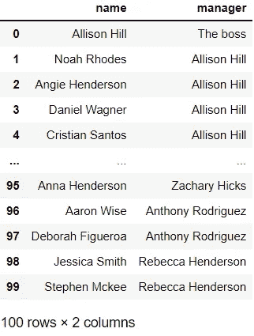
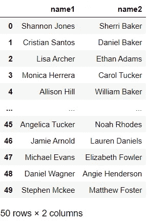
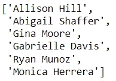
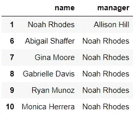
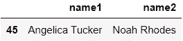
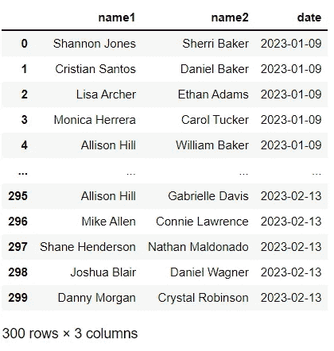
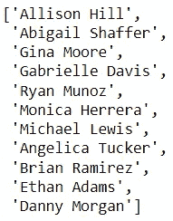
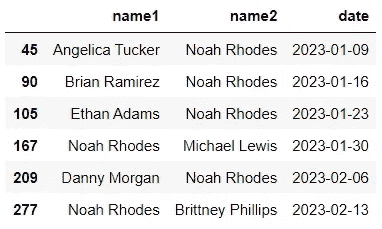
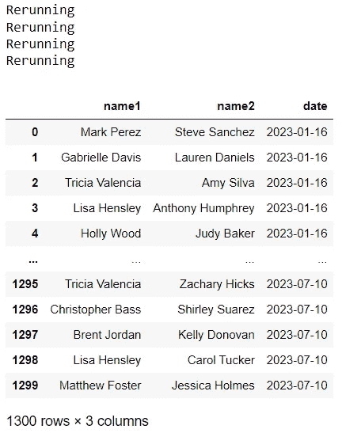
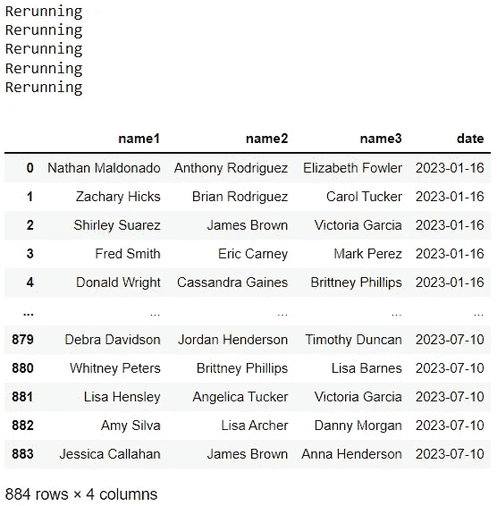

# 促进员工之间联系的简单工具

> 原文：[`towardsdatascience.com/simple-tool-to-foster-connection-among-employees-82ef5c1353f5`](https://towardsdatascience.com/simple-tool-to-foster-connection-among-employees-82ef5c1353f5)

## 办公时间

## 利用 Python 构建一个快乐而紧密的团队

 [Zolzaya Luvsandorj](https://zluvsand.medium.com/?source=post_page-----82ef5c1353f5--------------------------------)

·发表于 [Towards Data Science](https://towardsdatascience.com/?source=post_page-----82ef5c1353f5--------------------------------) ·6 分钟阅读·2023 年 2 月 1 日

--

COVID-19 促进了一个积极的变化，那就是推动更多公司采用灵活的工作安排。这种采用意味着我们中的更多人即使在封锁结束后也能继续在家工作。虽然这种灵活性在许多方面都很棒，但一个潜在的缺点是，你不能像在办公室那样随意碰到同事，并进行那些随意的自发对话，这有助于建立更好的同事关系并让你感受到团队的一部分。在这篇文章中，我分享了一个利用一点编程技能来激发这些对话的简单想法，当不是所有人都在办公室时可以用得上。

图片来源：[Toa Heftiba](https://unsplash.com/@heftiba?utm_source=medium&utm_medium=referral) 在 [Unsplash](https://unsplash.com/?utm_source=medium&utm_medium=referral)

# 💡 想法

所以这个想法很简单：我们定期随机匹配同事组，并鼓励他们在小组内进行随意对话。例如，我们每周随机将所有同事分成 3 人一组，指定其中一人作为会议组织者，在他们的日历中预定一个 25 分钟的会话，并鼓励他们参加这个会话以便彼此沟通。或者可以是每两周进行一次的步行交流，以此作为关心健康的举措。这个基本想法可以进一步调整和自由定制，以适应公司文化。

我所在的公司每周组织一次，我们每周都会与另一位同事进行虚拟或面对面的咖啡交流。我还听说过其他公司在 COVID-19 之前就已经组织了较大的小组在附近的咖啡馆一起喝咖啡。因此，即使每个人都在办公室，这个想法也可以帮助促进联系！

在这篇文章的剩余部分，我们将查看如何在简单约束下创建随机匹配的 Python 初始代码。我们将从对开始，然后扩展代码以适应不同的组大小。虽然示例是用 Python 编写的，但这个想法也可以转换到其他语言中。

# 📦 数据集

在这个示例中，我们假设我们想为整个公司（100 名员工）组织这项团队建设活动。根据公司的规模和结构，这项活动可以涉及整个组织中的所有同事，或特定部门的同事。

我们将从导入库和创建一个包含 100 名员工的合成数据集开始。与经理或直接下属进行定期沟通是很常见的，因此我们将添加一个简单的约束，避免将经理和他们的直接下属配对，因为他们之间的互动已经足够多。因此，我们将经理分配给员工。

太棒了，我们现在将初始化一个数据框来保存历史记录。

跟踪匹配历史将有助于确保相同的配对不会过快地再次匹配。这样，每个人都能有机会与尽可能多的不同人互动。为此，我们将在第一次匹配后使用匹配历史作为额外约束条件。

# 🌸 对

我们将从最简单的形式开始，一个对：两个组成的组。让我们构建一个`Matcher`对象，寻找在以下约束条件下的两人匹配：

◼️ 排除同事的直接下属或经理

◼️ 排除过去 10 次匹配中与同事匹配的人员

我们刚刚为 50 对创建了第一次匹配。让我们选择一个示例员工：*‘诺亚·罗德斯’* 并检查他的约束条件：

由于我们还没有进行任何匹配，因此约束条件应仅基于他的经理和直接下属。让我们在员工数据集中检查这些信息：

太棒了，约束条件很合理。让我们看看诺亚会匹配到谁：

这个匹配符合约束条件。现在，我们将进行另外 5 次匹配，持续 5 周，并检查约束条件是否按预期工作：

让我们再次检查诺亚的约束条件：

我们有几个新的约束条件。这些新的约束条件应该反映历史上的匹配。让我们检查一下：

很棒，所以约束条件按预期工作。*‘布里特妮·菲利普斯’* 不在约束条件中是有道理的，因为这是最近的一次匹配。

经过一些检查后，我们将再次初始化`Matcher`对象，并运行半年的时间：

我们可以看到在一些情况下，找到匹配项时遇到困难，因此不得不重新开始随机匹配。目前，`Matcher`的设置是，如果我们有一个奇数个员工，一个人将被分配一个默认值：*‘去散步’*，这样那个没有找到匹配的人可以进行一些运动。这个默认值可以是任何东西！

在做了一个简单版本之后，让我们调整`Matcher`对象，以便它可以处理不同的组大小。

# 🍀 组

以下展示了一种我们可以扩展代码以适应不同组大小的方式。虽然处理员工人数不能被组大小整除的情况有不同的方法，但我们选择了一种更简单的选项，通过填充默认值直到记录数量变为可整除的数字。例如，当我们尝试将 100 名员工分成 3 人一组时，会出现一个多余的人。在这种情况下，我们将用默认值：*‘去散步’* 填充两次，将记录数增加到 102，一个可以被 3 整除的数字。为了防止一个人被匹配到两个默认值，我们可以确保任何组只有一个默认值使用约束。因此，这两个较小的组（即对）可以进行步行会议或视频通话。

尽管在这个示例中我们选择了一个 3 人的组，但该对象也可以处理更大的数字。

好了，这就是本帖的全部内容！希望这段起始代码能为你提供帮助，节省时间，如果你想在你的组织中提出这个想法的版本来实现。

图片由 [Shaurya Sagar](https://unsplash.com/@shauryasagar?utm_source=medium&utm_medium=referral) 提供，来源于 [Unsplash](https://unsplash.com/?utm_source=medium&utm_medium=referral)

感谢阅读本文。如果你感兴趣，这里有一些我其他帖子的链接：

◼️️ 从 ML 模型到 ML 管道

◼️️ 用 SHAP 解释 Scikit-learn 模型

◼️️ Python 中绘制多个图表的 4 个简单技巧

◼️ 美化 pandas DataFrames

◼ 你会发现有用的 Python 简单数据可视化️

◼️ 6 个让 Seaborn（Python）绘图更美观和个性化的简单技巧

再见了 🏃 💨
