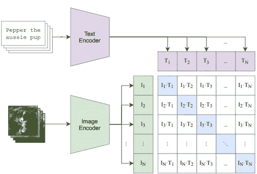

# 提高零-shot CLIP 性能的简单方法

> 原文：[`towardsdatascience.com/simple-way-of-improving-zero-shot-clip-performance-4eae474cb447`](https://towardsdatascience.com/simple-way-of-improving-zero-shot-clip-performance-4eae474cb447)

## 第一部分 — 通过语言模型定制提示（CuPL）

[](https://medium.com/@alexml0123?source=post_page-----4eae474cb447--------------------------------)[](https://towardsdatascience.com/?source=post_page-----4eae474cb447--------------------------------) [Alexey Kravets](https://medium.com/@alexml0123?source=post_page-----4eae474cb447--------------------------------)

·发表于 [Towards Data Science](https://towardsdatascience.com/?source=post_page-----4eae474cb447--------------------------------) ·12 分钟阅读·2023 年 11 月 3 日

--

单模态模型旨在处理来自单一模态的数据，这可以是文本或图像。这些模型专注于理解和生成特定于其选择模态的内容。例如，GPT 在生成类似人类的文本方面表现出色。它们已被用于语言翻译、文本生成和问题回答等任务。卷积神经网络（CNNs）是图像模型的例子，擅长于图像分类、对象检测和图像生成等任务。目前，许多有趣的任务，如视觉问答（VQA）和图像-文本检索等，需要多模态能力。是否可以结合文本和图像处理？可以！CLIP 是最初几个高度成功的图像-文本模型之一，展示了在图像识别和文本理解方面的能力。

我们将把这篇文章分为以下几个部分：

1.  引言

1.  架构

1.  训练过程和对比损失

1.  零-shot 能力

1.  CuPL

1.  结论

# 引言

CLIP 模型是一种令人印象深刻的零-shot 预测器，使其能够在没有明确训练的任务上进行预测。正如我们将在接下来的部分中详细了解的，通过使用自然语言提示来查询图像，CLIP 可以在没有任务特定训练数据的情况下执行图像分类。然而，通过一些技巧，可以显著提高其性能。在这一系列文章中，我们将探讨利用大型语言模型（LLM）生成的额外提示或少量示例的几种方法，而无需涉及任何参数训练。这些方法具有显著优势，因为它们计算负担较轻，不需要微调额外的参数。

# 架构

CLIP 是一个双编码器模型，具有两个独立的编码器用于视觉和文本模态，分别独立编码图像和文本。这种架构不同于融合编码器，它通过交叉注意力实现视觉和文本模态之间的交互，涉及学习注意力权重，帮助模型在处理两种模态时关注图像的特定区域和文本的相应部分。这个想法类似于自注意力，它允许每个标记关注同一模态中的其他标记。交叉注意力扩展了这个概念，允许一种模态中的标记（例如，代表图像特征的标记或补丁）关注另一种模态中的标记（例如，代表文本描述的标记）。双编码器和融合编码器的概念可以总结如下：


作者插图 — 双编码器与融合编码器

## 编码器

**文本编码器：** 负责处理输入文本，文本编码器将其转换为向量表示。在 CLIP 中，模型使用一种标准，我们在[这篇](https://medium.com/towards-data-science/deep-dive-into-the-code-of-bert-model-9f618472353e)文章中进行了详细探讨。文本编码器为提供的文本生成嵌入，封装与输入相关的语义信息。

**图像编码器：** 图像编码器处理图像以获取其向量表示。视觉编码器可以是像 ResNet 模型这样的卷积神经网络，或者是 ViT Transformer（请参见[这里](https://medium.com/towards-data-science/a-deep-dive-into-the-code-of-the-visual-transformer-vit-model-1ce4cc05ca8d)以刷新你的知识），用于生成图像向量表示。

这两个向量具有相同的维度，从而能够计算给定文本和图像之间的相似性。如果你一直只使用一种模态，你可能会想，图像和文本嵌入如何能够进行比较呢？关键在于训练过程和损失函数，这使得 CLIP 能够学习一个统一的图像-文本空间，促进来自不同模态的向量比较。

# 训练过程与对比损失

CLIP 通过在一个包含图像-文本对的大规模数据集上进行多模态目标训练。当我说大规模时，意味着数据量非常庞大——约为 4 亿对图像-文本。这些数据来自互联网上公开的来源，并经过自动筛选以确保高质量。

一旦图像-文本对被收集，模型通过对比损失进行训练。对比损失使模型能够通过对齐图像和文本的表示来学习共享的图像-文本空间，最大化匹配对嵌入之间的相似性，同时最小化不匹配对嵌入之间的相似性。该过程如下图所示：



图片来自[CLIP](https://arxiv.org/pdf/2103.00020.pdf)论文 — 对比损失

图像嵌入 I_i 对应于文本嵌入 T_i（即在对角线上）形成匹配对，而所有其他文本 T_j（j ≠ i）（非对角线）被视为不匹配对。同样地，对于 T_i，只有 I_i 被认为是匹配的图像，而所有其他图像 I_j（j ≠ i）则不被视为 T_i 的描述。然而，这种假设可能是有限的，因为可能存在其他文本对有效地描述一个图像，反之亦然。挖掘困难负例是解决这一挑战的潜在方案。尽管如此，CLIP 凭借其 32,768 的巨大批量大小成功克服了这一限制。

在这个多样化的数据集上预训练之后，CLIP 学习到的嵌入可以用于许多下游应用 — 其中一个真正令人印象深刻的是零-shot 图像分类。

# 零-shot 能力

那么零-shot 到底是什么意思呢？如介绍中提到的，零-shot 分类指的是模型在没有特定类别示例或训练数据的情况下，正确分类未见过的类别的能力。CLIP 在一个大型数据集上进行了训练，它学会了在广泛的概念中进行泛化，使其能够根据语义关系识别和分类类别。让我们看看这在实践中是如何实现的：

假设我们只知道特定数据集的类别名，比如

*[“狗”、 “猫”、 “马”]*。由于 CLIP 被训练来匹配图像和文本，我们可以计算给定测试图像与提示*“一个{类别名}的图片”*之间的余弦相似度，这在我们的情况下变成：

*“一个{狗}的图片”、 “一个{猫}的图片”、 “一个{马}的图片”*。

具有最高余弦相似度的提示代表预测的类别。

# 通过定制提示改进 Zero-Shot CLIP（CuPL）

现在，Zero-Shot CLIP 已经取得了相当令人印象深刻的表现，不过，我们仍然可以通过一些简单的技巧进一步挖掘其潜力。CLIP 的零-shot 性能对其输入的文本提示非常敏感。这就是为什么对于不同的数据集如 ImageNet，人们提出了不同的文本提示，如*“一个折纸{类别名}”*、*“一个视频游戏中的{类别名}”*等。这些手动设计的提示比简单的*“一个{类别名}的图片”*要好，但它们仍然存在一些主要的限制：

1.  手动编写的提示需要大量的人力

1.  手动编写的提示必须是通用的 — 我们不能使用像*“一个{鸭嘴兽}的照片，一种水生哺乳动物”*这样的模板，因为这只适用于水生哺乳动物，而不适用于其他类别。这是一个限制，因为描述性细节对细粒度分类是有用的。

1.  编写高效的提示模板需要对数据集内容的事先了解。因此，对于 ImageNet，我们必须提前知道感兴趣的数据集包含折纸、视频游戏图像等。

那我们能做什么呢？我们只需请求一个大型语言模型 (LLM) 为我们生成这样的提示，这些提示可以轻松扩展到任何数量的类别和数据集！我们可以向 LLM 提出以下问题：

+   *描述一个/该类别名称的外观：*

+   *描述一个/该类别名称：*

+   *一个/该类别名称的识别特征是什么？*

为什么这应该比简单提示更好？假设是 LLM 生成的提示将包含非常详细的类别描述，并使 CLIP 更加重视对正确分类最相关的图像区域。

现在让我们跳入编码中看看我们能得到什么。我们将使用 [Hugging Face](https://www.google.com/url?sa=t&rct=j&q=&esrc=s&cd=&ved=2ahUKEwiu6cr-kKGCAxXk_7sIHYoVCdMQFnoECB0QAQ&url=https%3A%2F%2Fhuggingface.co%2Fdocs%2Ftransformers&usg=AOvVaw1c0CbHgKUDJPUj-n5H3rT8&opi=89978449) 的 Transformers 库中的 CLIP。因此，让我们导入模型——我们将使用 ViT，patch 大小为 32，以及处理文本和预处理图像的管道：

```py
from transformers import CLIPProcessor, CLIPModel
import torch
import requests
from PIL import Image

model = CLIPModel.from_pretrained("openai/clip-vit-base-patch32")
processor = CLIPProcessor.from_pretrained("openai/clip-vit-base-patch32")
```

接下来，我们将从 *freeimages* 网站下载一张 *“树蛙”* 的图片，该网站对下方的图片有开放许可。然后，我们将使用 CLIP 和简单提示 *“{类别} 的照片”* 来预测它是 *“树蛙”* 还是 *“有尾蛙”*（它们在视觉上相似，主要在于大眼睛的大小）：


来自 [FreeImages](https://images.freeimages.com/images/large-previews/342/green-tree-frog2-1616738.jpg) 的树蛙图像（许可： [`www.freeimages.com/license`](https://www.freeimages.com/license)）

```py
url = "https://images.freeimages.com/images/large-previews/342/green-tree-frog2-1616738.jpg"
image = Image.open(requests.get(url, stream=True).raw)

inputs = processor(text=["a photo of a tree frog", "a photo of a tailed frog"], images=image, return_tensors="pt", padding=True)

outputs = model(**inputs)
logits_per_image = outputs.logits_per_image  # this is the image-text similarity score
probs = logits_per_image.softmax(dim=1)  # we can take the softmax to get the label probabilities
print(probs)

"""
Output:
tensor([[0.3164, 0.6836]], grad_fn=<SoftmaxBackward0>)
"""
```

模型通过选择 *“有尾蛙”* 以 0.68 的概率做出了错误预测。

现在让我们请求一个 LLM（例如 ChatGPT）为我们生成提示：

```py
prompts = {"tree frog": [
        "A tree frog is a small frog that typically has greenish coloration.",
        "A tree frog is a small frog that typically has bright colors, long toes that help it climb, and suction cups on its feet.",
        "A tree frog is small, typically green, frog that lives in trees.",
        "A tree frog looks like a frog with special adaptations for living in trees.",
        "A tree frog is a small, typically green frog with large adhesive pads on its feet that allow it to climb smooth surfaces like glass and plastic.",
        "Tree frogs are small amphibians with big toes that help them climb.",
        " Most tree frogs have bright colors.",
        "Tree frogs are small frogs that live in trees.",
        "A tree frog is a small frog that has large toe pads that help it climb trees.",
        "A tree frog typically has green skin, although some species can be brown, gray, or yellow.",
        "A tree frog is a small frog that lives in trees.",
        "A tree frog is a small, tailless amphibian with large, powerful hind legs and webbed feet.",
        "A tree frog is a amphibian that has well-developed hind legs which enable it to climb trees and other structures.",
        "Avatar of the forest, the tree frog is a small amphibian with big eyes bulging out of its head.",
        "A tree frog is a small amphibian that typically has bright green skin and lives in trees.",
        "A tree frog is a small, slim frog that typically has brightly colored skin.",
        "A tree frog is a small frog that typically has a bright green body and lives in trees.",
        "A tree frog is a small, tailless amphibian that typically has bright green or yellowish skin and lives in trees or near bodies of water.",
        "A tree frog is a small amphibian that typically has a green body and large eyes.",
        "A tree frog is a small frog that typically has bright colors.",
        "The identifying characteristics of a tree frog varies depending on the species, but some common features include large adhesive toes, protruding eyes, and bright colours.",
        "Some identifying characteristics of a tree frog are that they have large toe pads, which help them grip onto tree branches, and their bodies are slim so that they can fit into small spaces.",
        "Tree frogs are small frogs that live in trees and other high places.",
        "The identifying characteristics of a tree frog are its long hind legs, which it uses to jump, and its adhesive pads, which it uses to stick to surfaces.",
        "The identifying characteristics of a tree frog are that they have long, sticky toes that help them climb trees, and they have wrinkled skin that helps them absorb water.",
        "Tree frogs have long, sticky toes that help them climb trees.",
        "Tree frogs are small frogs that can climb trees.",
        "Tree frogs have long hind legs that they use to jump.",
        "There are over 6,300 species of tree frogs, so it is difficult to give one answer to this question.",
        "The identifying characteristics of a tree frog are its long, sticky toes that help it climb trees, and its dark green or brown coloration that helps it blend in with leaves."
    ],
    "tailed frog": [
        " short, stout body; webbed hind feet with large, adhesive discs on the toes; long, muscular tail; small eyes located on top of the head; smooth or warty skin; and a small mouth.",
        "A tailed frog has a long, skinny body and a long tail.",
        "A tailed frog has a long, slender body with a tail that is about as long as its body.",
        "A tailed frog is a frog with a long tail.",
        "A tailed frog has a long tail and four legs.",
        "A tailed frog is a small frog that has a long tail.",
        "A tailed frog has a long tail that is often as long as its body.",
        "A tailed frog has a long tail and webbed feet.",
        "A tailed frog is a frog with a long tail.",
        "A tailed frog is a small frog with a long tail.",
        "A tailed frog (Asteriscus species) is a species of frog in the Asteriscidae family.",
        "A tailed frog is a type of frog that has a long tail.",
        "A tailed frog is a frog with a long tail, typically over 10 cm in length.",
        "A tailed frog is a species of frog that has a long tail.",
        "Tailed frogs are a type of frog that have a long tail.",
        "A tailed frog is a type of frog that has a long, tail-like structure protruding from its back.",
        "A tailed frog is a frog that has a long tail.",
        "A tailed frog is a frog that has a long tail.",
        "A tailed frog has a long, thin body with short legs.",
        "A tailed frog is a small amphibian that has a long tail.",
        "Some identifying characteristics of a tailed frog are that they have a long tail, they are good swimmers, and they live near water.",
        "There are over 60 species of tailed frogs, so it is difficult to give a definitive answer.",
        "There are over 100 species of tailed frogs, so it is difficult to give a general answer to this question.",
        "Some identifying characteristics of a tailed frog are that they have a long tail, they are small, and they have webbed feet.",
        "There are over 60 species of tailed frog, so identifying characteristics can vary.",
        "Tailed frogs are a species of frog that are native to the western United States and northern Mexico.",
        "The identifying characteristics of a tailed frog are its tail, which is used for swimming, and its webbed feet.",
        "Tailed frogs are small, dark-colored frogs with long, slender hind legs and a long, thin tail.",
        "Some tailed frogs have a tail that is about one-third the length of their body.",
        "The identifying characteristics of a tailed frog are its long tail and its smooth, moist skin."
    ]}
```

> 这些提示对类别的描述更加详细，这应该能指导模型识别正确的类别。例如，许多“树蛙”的提示强调它有“很大的眼睛”，这是像“树蛙的图片”这样的简单提示所无法捕捉的。

使用上述提示并经过一些操作，我们为一个类别形成最终的提示，带有平均向量嵌入：

```py
"""
First of all, we can verify that 
outputs = model(**inputs)
logits_per_image = outputs.logits_per_image  # this is the image-text similarity score
probs = logits_per_image.softmax(dim=1)  # we can take the softmax to get the label probabilities
probs

Is the same as:
image_features = model.visual_projection(model.vision_model(inputs['pixel_values']).pooler_output)
text_features = model.text_projection(model.text_model(inputs['input_ids']).pooler_output)
image_features = image_features / image_features.norm(dim=-1, keepdim=True)
text_features = text_features / text_features.norm(dim=-1, keepdim=True)

# cosine similarity as logits
logit_scale = model.logit_scale.exp()
logits_per_image = logit_scale * image_features @ text_features.t()
probs = logits_per_image.softmax(dim=1)
probs
"""

image_features = model.visual_projection(model.vision_model(inputs['pixel_values']).pooler_output)

tree_frog_vector = model.text_model(processor(prompts['tree frog'], return_tensors="pt", padding=True)['input_ids']).pooler_output
# take the mean prompt embedding
tree_frog_vector = tree_frog_vector.mean(dim=0, keepdims=True)
# final projection 
tree_frog_vector = model.text_projection(tree_frog_vector)

tailed_frog_vector = model.text_model(processor(prompts['tailed frog'], return_tensors="pt", padding=True)['input_ids']).pooler_output
# take the mean prompt embedding
tailed_frog_vector = tailed_frog_vector.mean(dim=0, keepdims=True)
# final projection
tailed_frog_vector = model.text_projection(tailed_frog_vector)

# concatenate 
text_features = torch.cat([tree_frog_vector, tailed_frog_vector], dim=0)

# normalize features
image_features = image_features / image_features.norm(dim=-1, keepdim=True)
text_features = text_features / text_features.norm(dim=-1, keepdim=True)

# cosine similarity as logits
logit_scale = model.logit_scale.exp()
logits_per_image = logit_scale * image_features @ text_features.t()
probs = logits_per_image.softmax(dim=1)
print(probs)

"""
Output:
tensor([[0.6512, 0.3488]], grad_fn=<SoftmaxBackward0>)
"""
```

使用 LLM 提供的提示可以给出正确的分类答案——*“树蛙”*。

# 结论

在这篇文章中，我们已经看到如何通过使用**大型语言模型**轻松提高 CLIP 的零样本预测。这个解决方案的优点不仅在于更高的准确性，还在于其可扩展性，因为我们不需要任何人工努力来生成提示。在接下来的文章中，我们将探索其他方法来改进 CLIP 的零样本学习以及无需训练的少样本学习方法。

# 参考文献

[1] [[2103.00020] 从自然语言监督中学习可迁移的视觉模型 (arxiv.org)](https://arxiv.org/abs/2103.00020)

[2] [[2209.03320] 杜鹃鸟的样子是什么？生成定制化提示用于零样本图像分类 (arxiv.org)](https://arxiv.org/abs/2209.03320)

[3] [CLIP (huggingface.co)](https://huggingface.co/docs/transformers/model_doc/clip)
