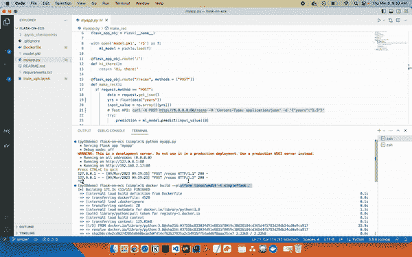
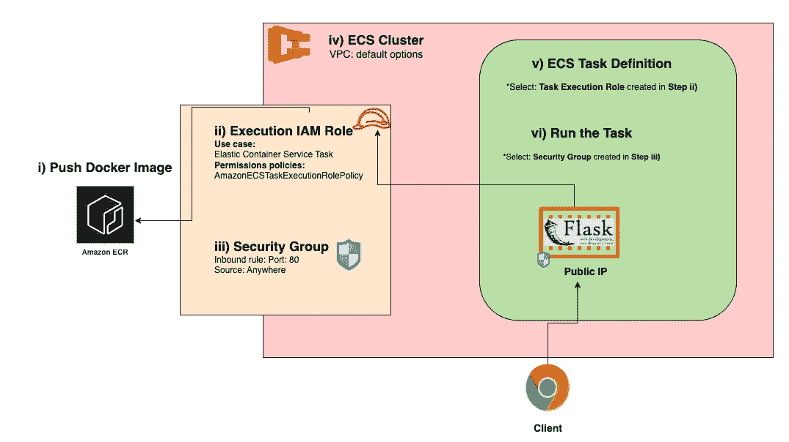

# 在 Amazon ECS 上将机器学习模型作为 Flask API 部署的简单方法

> 原文：[`towardsdatascience.com/simple-way-to-deploy-ml-models-as-flask-apis-on-amazon-ecs-7be11f9dc4d9`](https://towardsdatascience.com/simple-way-to-deploy-ml-models-as-flask-apis-on-amazon-ecs-7be11f9dc4d9)

## 在 4 分钟内将 Flask API 部署到 Amazon ECS

[](https://medium.com/@nikola.kuzmic945?source=post_page-----7be11f9dc4d9--------------------------------)[](https://towardsdatascience.com/?source=post_page-----7be11f9dc4d9--------------------------------) [Nikola Kuzmic](https://medium.com/@nikola.kuzmic945?source=post_page-----7be11f9dc4d9--------------------------------)

·发表于 [Towards Data Science](https://towardsdatascience.com/?source=post_page-----7be11f9dc4d9--------------------------------) ·6 分钟阅读·2023 年 3 月 10 日

--


图片由 [Arjan van den Berg](https://unsplash.com/@arjan71?utm_source=medium&utm_medium=referral) 提供，来源于 [Unsplash](https://unsplash.com/?utm_source=medium&utm_medium=referral)

在这篇文章中，我们将介绍如何部署一个线性回归 XGBoost 模型，该模型根据开发者的工作经验年限来预测他们的薪资。

## 👉 游戏计划

1.  训练一个 XGBoost 模型

1.  构建一个简单的 Flask API 来提供模型预测

1.  为 Flask API 构建 Docker 镜像

1.  在 Amazon ECS 上部署 Docker 容器

完整源代码 GitHub 仓库：[link](https://github.com/kuzmicni/flask-on-ecs/tree/simple)🧑‍💻

```py
flask-on-ecs - repo structure
.
├── Dockerfile
├── README.md
├── myapp.py
├── requirements.txt
└── train_xgb.ipynb
```

## 为什么我们需要 API 来部署机器学习模型

如果你正在阅读这篇文章，说明你已经到了数据科学项目的阶段，希望将你出色的机器学习模型在互联网上提供给所有人。人们称这一步骤为将模型部署到生产环境中。

在这里，我们不会使事情变得过于复杂，也不会详细审查生产级部署的样子，而是简单地利用默认的 Flask 开发服务器演示从训练/保存的 XGBoost 机器学习模型，到 Docker 化，再到将其作为实时 API 部署到 Amazon ECS 的全过程。

## 👉 步骤 1：训练一个 XGBoost 模型

训练一个 XGBoost 模型以预测开发者的薪资，基于他们的工作经验年限，并将模型保存为 pickle 文件。

为了在 VS Code 内运行，让我们创建一个单独的 Python 3.8 环境：

```py
conda create --name py38demo python=3.8 
conda activate py38demo
pip install ipykernel pandas flask numpy xgboost scikit-learn
```

然后重启 VS Code，并在 Jupyter Notebook 中 -> 选择‘**py38demo**’作为内核。

训练并 pickle XGBoost 模型：


现在是创建一个可以提供这些推荐的 API 的时候了！

## 👉 步骤 2：Flask API

我们的 API 将加载 XGBoost 模型，接受 POST 请求，并生成响应。

首先让我们在本地运行 API。然后在一个单独的终端中，我们可以通过发送负载 POST 请求来测试，以查看一个拥有 2.5 年经验的开发者会做什么：

```py
curl -X POST http://0.0.0.0:80/recms -H 'Content-Type: application/json' -d '{"years":"2.5"}'
```


2.5 年后 $260k，12.5 年后 $750k。不错！🤑

## 👉 步骤 3：Docker 镜像

要在 Docker 容器中运行我们的应用程序，我们需要一个“蓝图”，该蓝图包含有关使用什么环境、要复制哪些本地文件以及如何运行应用程序的指令。所有这些都被称为 Docker 镜像，通常在 **Dockerfile** 中指定。

现在我们可以在 Docker 容器中运行我们的 API 并进行本地测试。

> 注意：由于我在 Mac 上构建镜像，我需要指定
> 
> - - platform linux/amd64
> 
> 使其与 ECS Fargate Linux 环境兼容。

这是我们如何构建和运行镜像的步骤。

> 注意：我们将主机（即笔记本电脑）的端口 80 绑定到 Docker 容器的端口 80：

```py
docker build --platform linux/amd64 -t simpleflask .
docker run -dp 80:80 simpleflask
```

让我们测试一下现在在 Docker 容器中运行的 API！📦

```py
curl -X POST http://0.0.0.0:80/recms -H 'Content-Type: application/json' -d '{"years":"12.5"}'
```



是时候在 AWS 上部署了！🚀

## 👉 步骤 4：在 Amazon ECS 上运行容器

这个部分可能一开始看起来很复杂，但实际上如果我们将过程分解成 6 个简单步骤，就会变得很简单。



Chrome 徽标：[1]，Flask 徽标：[2]

**i) 将 Docker 镜像推送到 ECR**

让我们创建一个名为 **demo** 的 ECR 仓库，我们可以将 Docker 镜像推送到其中。


然后我们可以使用 ECR 提供的推送命令：

```py
# autheticate
aws ecr get-login-password --region us-east-1 | docker login --username AWS --password-stdin <Your-aws-acc-no>.dkr.ecr.us-east-1.amazonaws.com

#tag the image
docker tag <Your-local-docker-image-name>:latest <Your-aws-acc-no>.dkr.ecr.us-east-1.amazonaws.com/<Your-ECR-repo-name>:latest

#push the image to ECR
docker push <Your-aws-acc-no>.dkr.ecr.us-east-1.amazonaws.com/<Your-ECR-repo-name>:latest
```

> 假设：您已在本地机器上配置了 AWS CLI，并设置了具有与 ECR 交互所需权限的 IAM 用户。您可以在此 [链接](https://docs.aws.amazon.com/AmazonECR/latest/userguide/getting-started-cli.html) 中找到更多信息。

运行上述 3 个命令后，我们可以看到我们的镜像已经在 ECR 上了！🎉


> **复制并粘贴镜像 URI** 到某个地方，因为我们将在接下来的几个步骤中需要它。

**ii) 创建 IAM 执行角色**

我们需要创建一个执行角色，以便运行容器的 ECS 任务可以访问从 ECR 拉取镜像。我们将其命名为：**simpleRole**


**iii) 创建安全组**

需要安全组以允许互联网上的任何人向我们的应用程序发送请求。在现实世界中，您可能希望将其限制为特定的 IP 集合，但在这里我们将其对所有人开放，并命名为：

**simpleSG**


**iv) 创建 ECS 集群**

这个步骤很简单，只需几秒钟。我们将其命名为：**flaskCluster**


在我们的集群被配置时，让我们创建一个任务定义。

**v) 创建任务定义**

任务定义，顾名思义，是一组与运行哪个镜像、开放哪个端口以及分配多少虚拟 CPU 和内存相关的指令。我们将其称为：**demoTask**


**vi) 运行任务**

让我们在我们的**flaskCluster**上运行**demoTask**，使用我们在***步骤 iii)*** 中创建的**simpleSG**。


现在可以通过**公共 IP**地址测试已部署的 API 了！ 🥁

```py
curl -X POST http://<PUBLIC-IP>:80/recms -H 'Content-Type: application/json' -d '{"years":"2.5"}'
```


它正在运行！ 🥳

正如你所见，我们可以通过向 ECS 提供的**公共 IP**发送 POST 请求来获取薪资预测。 🔥

## 最后

这只是一个简单的演示，展示了我们如何将 XGBoost 模型 Docker 化并在 Amazon ECS 上进行实时推理。然而，我们使用了 Flask 提供的默认开发服务器，实际上应该使用像 Gunicorn 这样的生产级应用服务器，下一篇文章中我们会介绍它。

感谢阅读，希望你觉得这些内容对开始使用 Flask、Docker 和 Amazon ECS 有帮助！

# 想要更多关于 ML 工程的有用文章？

[*免费订阅*](https://medium.com/@nikola.kuzmic945/subscribe) *以便在我发布新故事时收到通知。*

*成为 Medium 会员，阅读更多来自我和其他数千名作者的故事。你可以通过使用我的* [*推荐链接*](https://medium.com/@nikola.kuzmic945/membership) *来支持我。当你注册时，我将获得佣金，而你无需额外支付费用。*

**参考资料**

[1] Chrome 标志：[链接](https://logos-world.net/chrome-logo/)

[2] Flask 标志：[链接](https://flask.palletsprojects.com/en/2.2.x/)
