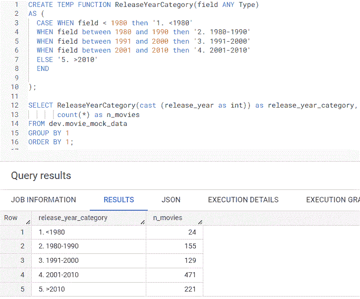
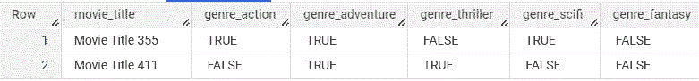
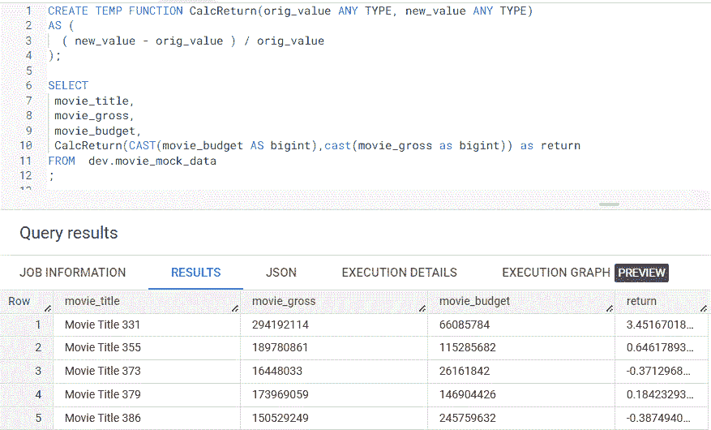

# 使用 BigQuery SQL 用户定义函数简化数据清洗

> 原文：[`towardsdatascience.com/simplify-data-cleaning-with-bigquery-sql-user-defined-functions-41c0560ea6`](https://towardsdatascience.com/simplify-data-cleaning-with-bigquery-sql-user-defined-functions-41c0560ea6)

## 介绍及用例

 [Vicky Yu](https://madfordata.medium.com/?source=post_page-----41c0560ea6--------------------------------)

·发表于 [Towards Data Science](https://towardsdatascience.com/?source=post_page-----41c0560ea6--------------------------------) ·阅读时间 5 分钟·2023 年 4 月 20 日

--

图片由 [Brooke Cagle](https://unsplash.com/@brookecagle?utm_source=medium&utm_medium=referral) 提供，来源于 [Unsplash](https://unsplash.com/?utm_source=medium&utm_medium=referral)

数据清洗是任何与数据相关的工作中占比很大的部分，但编写 SQL 语句往往是乏味的，尤其是在表中的多个列上编写相同的 SQL 逻辑。直到我发现可以创建 [BigQuery 中的用户定义函数 (UDFs)](https://cloud.google.com/bigquery/docs/reference/standard-sql/user-defined-functions) 来满足我特定的数据清洗用例。今天，我想分享一些数据清洗用例，在这些用例中，你可以应用 UDF 来简化你的 SQL 查询。

## 介绍

由于不同公司对数据库权限的管理有所不同，我将讨论使用临时 UDF 的数据清洗示例，因为永久性 UDF 可能需要数据库管理员不允许的额外访问权限。临时 UDF 在 SQL 查询完成时会过期，而持久性 UDF 会保存在数据库中，可以在多个 SQL 查询中使用。

我将使用我创建并上传到 [BigQuery 沙箱](https://cloud.google.com/bigquery/docs/sandbox) 的虚拟电影数据，该沙箱对任何拥有 Google 账户的人都是免费的。我几年前在一次数据分析师面试的家庭作业中收到了类似的数据，并将使用在作业中执行的数据清洗示例，但这次使用 UDFs。

## 用例 1：用于报告的值分组

我开始时是按年份统计电影数量，但这并没有什么用，因为在 1980 年之前有许多电影的数量不到 5 部。我决定改为按十年分组电影，以更好地了解电影的频率分布。

在下面的临时 UDF **ReleaseYearCategory** 中（第 1 到 10 行），第 3 到 8 行的 **CASE** 语句根据 **release_year** 字段将电影分为 5 类。注意我在第 3 到 7 行的 **CASE** 语句前缀，即 **1\. < 1980**。数字前缀将强制 **release_year_category** 从较早的年代到最近的年代排序。

虽然这是一次性的任务，但使用 UDF 仍然有许多优点。

1.  **release_year** 字段是字符串，但需要是数字以进行日期范围检查。与其在每次引用 **release_year** 字段时进行类型转换，不如一次性将 ***cast(*release_year *as int)*** 传递给 UDF，然后 **field** 变量将被替换为 ***cast(*release_year *as int).***

1.  如果 **release_year** 字段被更改为整数类型，我只需在调用 **ReleaseYearCategory** UDF 时去掉 cast 语句。

1.  UDF 是可重用的（假设它被保存为持久性 UDF）。如果我想将相同的年份分组逻辑应用于另一张表，只需将不同的字段名称传递给 UDF。

1.  如果我想按 5 年的增量分组，而不是按十年分组，我只需修改一个 UDF，而不是更改多个 SQL 语句。

作者创建的临时 UDF ReleaseYearCategory 示例截图

将电影分成 5 个类别显示大多数电影是在 2000 年后发布的。如果在按字段分组时数据行过多，考虑像我上面做的那样将数据折叠到更少的行中。一个常见的例子是按周或月而不是按日分组数据。

## **用例 2：将字符串值转换为数字**

我想查看按每部电影分配的类别数量来统计电影数量。一种简单的方法是对类别字段求和并以此作为分组字段，但类别字段必须从 **TRUE** 转换为 **1**，从 **FALSE** 转换为 **0**。例如，在下面的数据示例中，第 1 行的 **Movie Title 355** 将累加为 3，因为动作、冒险和科幻类别字段的 TRUE 值将被转换为 1。

作者创建的具有 TRUE 和 FALSE 值的电影类别字段的截图示例

UDF 使得编码转换变得更容易，因为我不需要为每个类别字段输入 CASE 语句。我只需将字段名称传递给 UDF。在下面的 **ConvertTrueFalse** UDF 中（第 1 到 8 行），我在第 6 行有一个 **ELSE -1** 语句，以捕捉任何不匹配 **TRUE** 或 **FALSE** 预期值的值。由于我之前确认了类别字段中只有 TRUE 或 FALSE 值，因此 ELSE 不是必需的，但作为最佳实践，您可以添加一个 ELSE 语句以防映射到意外值。例如，如果类别字段为 NULL，我将会在没有 ELSE 语句的情况下将其设置为 0。

我还在第 4 和第 5 行中添加了 UPPER 函数，以防**TRUE**或**FALSE**被拼写为混合大小写，如**True**或**false**。在处理混合大小写字符串时，添加 UPPER 函数是一种良好的做法。如果字段的值为**True**，如果没有 UPPER 函数，我会将其设置为 0，这会导致分析错误。尽管这是一次性的任务，但可以看到第 11 到第 15 行中的 UDF 调用减少了 SQL 代码，使其更易于阅读。

作者创建的临时 UDF ConvertTrueFalse 示例截图

## 用例 3：计算收益

我想通过类型来分析每部电影的收益，以了解哪些类型的电影更有利可图。为了计算收益，我需要使用类型为字符串的**movie_gross**和**movie_budget**字段。为了避免多次编写 cast 语句，我只需将 cast 语句传递给第 10 行中显示的**CalcReturn** UDF。

虽然这是一次性计算，但如果你经常需要计算收益或其他常见计算，考虑使用 UDF 来简化编码。

作者创建的临时 UDF CalcReturn 示例截图

## 最后想法

虽然数据清理可能不是你作为数据专业人士最喜欢的活动，但我希望你能看到创建 UDF（用户自定义函数）如何帮助简化你的 SQL 编码。

虽然我只讨论了临时 UDF，但将经常使用的 SQL 逻辑保存为持久 UDF 可以帮助集中代码，并允许在 SQL 查询中重复使用。这可能需要与你的数据库管理员讨论，以了解关于 UDF 创建和 SQL 用户使用的数据库权限。查看文档也会有帮助，以查看 UDF 代码和使用说明。

我已简要介绍了 UDF，并强烈建议你查看 [文档](https://cloud.google.com/bigquery/docs/reference/standard-sql/user-defined-functions) 以了解更多信息。

*注意：上述所有查询均在* [*BigQuery sandbox*](https://cloud.google.com/bigquery/docs/sandbox) *上运行，任何拥有 Google 帐号的人都可以免费使用。*

## 你可能还会喜欢…

 ## BigQuery SQL 数据清理函数

### 使用案例和应用函数

[towardsdatascience.com  ## BigQuery SQL 过程语言简化数据工程

### 简介

[towardsdatascience.com  ## 每个用户都应该知道的 6 个 BigQuery SQL 函数

### 检查你的数据库是否也包含这些函数

[towardsdatascience.com
