# 使用 Fugue 和 Python 简化 BigQuery 上的数据科学工作流

> 原文：[`towardsdatascience.com/simplify-data-science-workflows-on-bigquery-with-fugue-and-python-5215a1b65e43`](https://towardsdatascience.com/simplify-data-science-workflows-on-bigquery-with-fugue-and-python-5215a1b65e43)

## 加快迭代速度并降低计算成本

[](https://khuyentran1476.medium.com/?source=post_page-----5215a1b65e43--------------------------------)[](https://towardsdatascience.com/?source=post_page-----5215a1b65e43--------------------------------) [Khuyen Tran](https://khuyentran1476.medium.com/?source=post_page-----5215a1b65e43--------------------------------)

·发表在 [Towards Data Science](https://towardsdatascience.com/?source=post_page-----5215a1b65e43--------------------------------) ·阅读时间 6 分钟·2023 年 4 月 13 日

--

# 动机

许多数据团队开始时会在数据仓库如 BigQuery 上建立分析实践。然而，仅依赖 BigQuery 处理数据科学工作负载可能不是最佳方法，原因有很多：

+   **SQL 之外的高级需求**：如数据验证、可视化和机器学习预测等用例可能需要超出 SQL 语法限制的更高级功能。

+   **探索成本高**：由于 BigQuery 的迭代特性，它可能不是数据科学任务中最具成本效益的解决方案，这涉及到大量的特征工程和算法实验。

对于在 BigQuery 上处理数据的数据科学家而言，一个理想的解决方案应能够让他们：

+   使用 SQL 和 Python 查询 BigQuery 中的数据。

+   互动地在本地测试各种 SQL 查询

+   在彻底测试后轻松切换回 BigQuery。

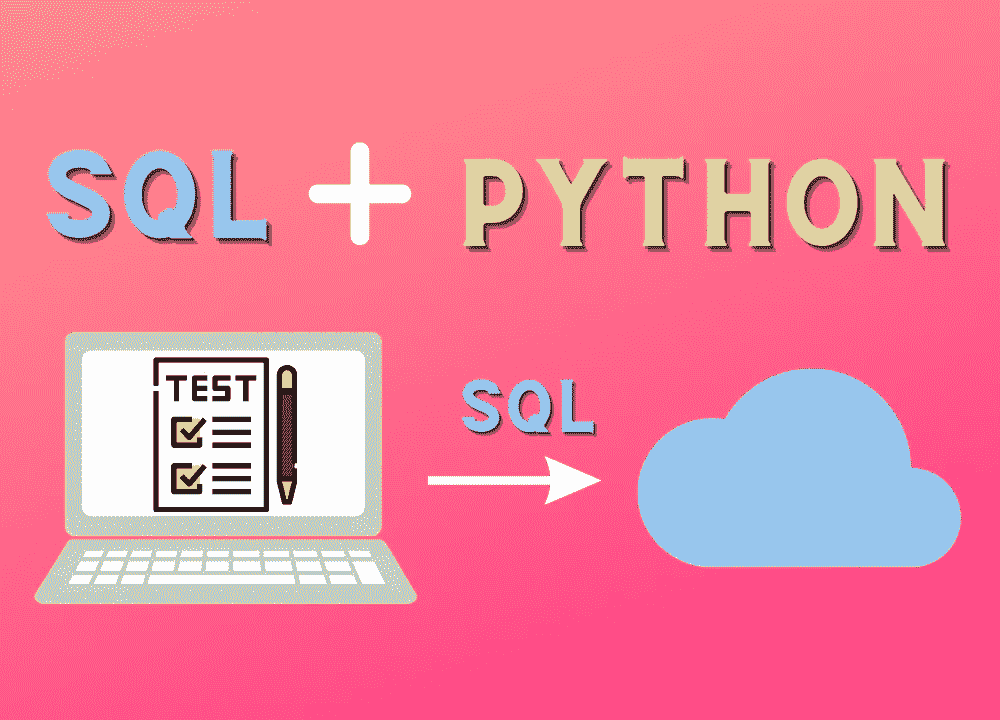

作者提供的图片

FugueSQL BigQuery 集成允许你做到这一点。

# Fugue 是什么？

[Fugue](https://github.com/fugue-project/fugue) 是一个开源项目，通过将 Python、Pandas 和 SQL 移植到如 Spark、Dask 和 Ray 等分布式计算引擎上，从而简化大数据开发。

[](/introducing-fuguesql-sql-for-pandas-spark-and-dask-dataframes-63d461a16b27?source=post_page-----5215a1b65e43--------------------------------) ## 介绍 FugueSQL — Pandas、Spark 和 Dask 数据框的 SQL

### 面向数据科学和分析的端到端 SQL 界面

towardsdatascience.com

在本文中，我们将使用 FugueSQL 来简化在 BigQuery 上的开发。

欢迎在此处自由试验和分叉本文的源代码：

[](https://github.com/khuyentran1401/Data-science/blob/master/data_science_tools/fugue_bigquery.ipynb?source=post_page-----5215a1b65e43--------------------------------) [## Data-science/fugue_bigquery.ipynb at master · khuyentran1401/Data-science

### 目前无法执行该操作。你在另一个标签或窗口中登录。你在另一个标签或窗口中登出……

github.com](https://github.com/khuyentran1401/Data-science/blob/master/data_science_tools/fugue_bigquery.ipynb?source=post_page-----5215a1b65e43--------------------------------)

# 安装和设置

## **安装 Fugue BigQuery**

要安装 Fugue BigQuery 集成，请输入：

```py
pip install fugue-warehouses[bigquery]
```

## **对 Google BigQuery 进行身份验证**

要对 Google BigQuery 进行身份验证，标准方法是使用 `GOOGLE_APPLICATION_CREDENTIALS` 环境变量指定凭证 JSON 文件的位置。

```py
import os  

os.environ['GOOGLE_APPLICATION_CREDENTIALS'] = 'path/to/your/credential.json'
```

> [如何获取凭证 JSON 文件。](https://cloud.google.com/bigquery/docs/quickstarts/quickstart-client-libraries)

# Fugue BigQuery 使用

## 查询表格

开始时，设置 FugueSQL 以便在 Jupyter Notebook 或 Lab 中使用：

```py
from fugue_jupyter import setup
setup(run_js=True)
```

要使用 FugueSQL BigQuery 集成运行 SQL 查询，只需在单元格的开头添加 `%%fsql bq`。

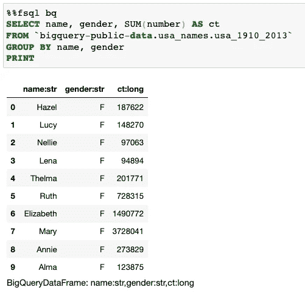

作者提供的图片

## 参数化

FugueSQL 允许你使用 Jinja 模板对 SQL 查询进行参数化。

以下查询对 `table` 变量进行参数化，这在从开发表过渡到生产表时特别有用。

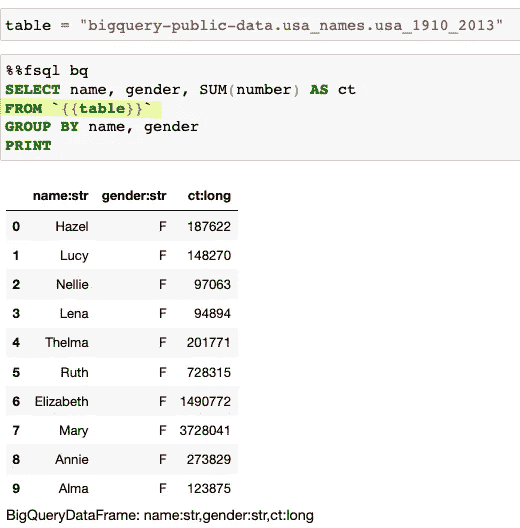

作者提供的图片

## 拆分查询

Fugue 包含了多个改进的标准 SQL 功能，这些功能有助于查询拆分。以下查询展示了这些增强功能：

+   等号将查询的输出分配给 `df` 变量，该变量随后在另一个操作中被重用。

+   `TAKE` 返回整行数据。`PREPARTION BY` 按性别对数据进行分区。`PRESORT` 按 `ct` 列以降序排序数据。

+   `YIELD` 使 DataFrame 可用于后续的 Jupyter Notebook 单元格。

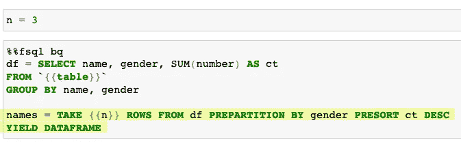

作者提供的图片

我们现在可以访问 `names` 变量，并在另一个 Jupyter Notebook 单元格中执行额外的查询。

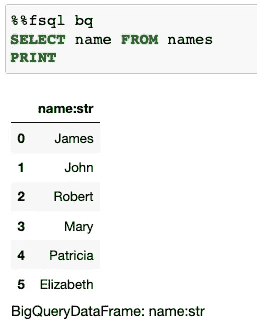

作者提供的图片

# FugueSQL Python 扩展

## TRANSFORM

FugueSQL 允许你通过使用 [TRANSFORM 关键字](https://fugue-tutorials.readthedocs.io/tutorials/quick_look/ten_minutes_sql.html#invoking-python-code) 将 Python 函数集成到 SQL 查询中。

以下查询演示了如何使用 `TRANSFORM` 将 `get_decade` 函数应用于数据，以生成名为 `decade` 的新列。

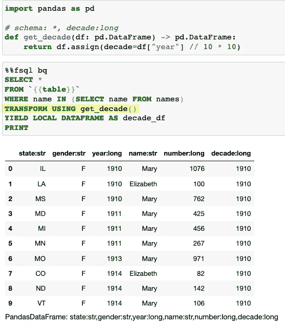

作者提供的图片

使用 `TRANSFORM`，数据科学家现在可以对数据进行特征工程，并在 BigQuery 上利用新的机器学习模型。

## OUTPUT

FugueSQL 还提供了内置扩展，方便与其他绘图库（如 seaborn）集成。

在下面的代码中，`OUPUT USING sns:lineplot()` 将查询结果导入 pandas，然后使用 seaborn 生成线图。

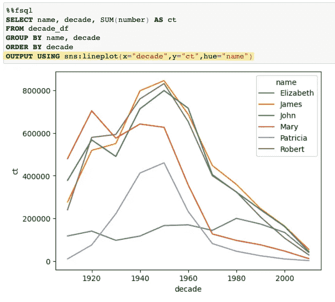

作者提供的图片

# 生产化 SQL 查询

为了将笔记本过渡到生产环境，我们可以消除中间的 `YIELD` 语句，并将查询作为字符串传递给 `fugue_sql()` 函数。

```py
import fugue.api as fa
res = fa.fugue_sql("""
SELECT name, gender, SUM(number) AS ct
  FROM `{{table}}`
 GROUP BY name, gender

names = TAKE {{n}} ROWS PREPARTITION BY gender PRESORT ct DESC

SELECT name, year, SUM(number) AS ct
  FROM `{{table}}`
 WHERE name IN (SELECT name FROM names)
 GROUP BY name, year
 ORDER BY year
""", engine="bq", table=table, n=n)
```

然后我们可以使用 `as_pandas()` 函数将输出转换为 pandas 以进行进一步分析。

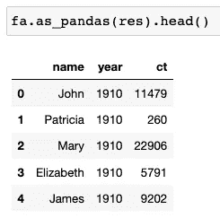

作者提供的图片

# 迭代大数据

FugueSQL 提供了使用 `SAMPLE` 关键字将 BigQuery 表采样到较小的数据框的功能。这加快了迭代过程，避免了每次都需要处理完整数据集。

在这里，`YIELD` 关键字再次被使用，以便使 `test` 数据框可用。

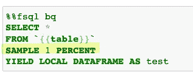

作者提供的图片

在下一个单元格中，我们可以使用 FugueSQL 和 [DuckDB](https://duckdb.org/) 后端在 `test` 数据框上测试查询，以加速代码。

[](/fugue-and-duckdb-fast-sql-code-in-python-e2e2dfc0f8eb?source=post_page-----5215a1b65e43--------------------------------) [## Fugue 和 DuckDB：Python 中的快速 SQL 代码]

### 使用 Python 和 DuckDB 优化 SQL 代码

towardsdatascience.com](/fugue-and-duckdb-fast-sql-code-in-python-e2e2dfc0f8eb?source=post_page-----5215a1b65e43--------------------------------) 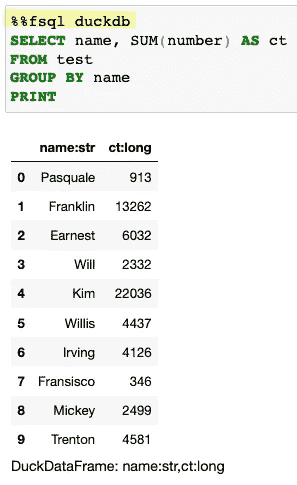

作者提供的图片

一旦查询经过彻底测试，切换引擎到 `bq` 是一项简单的任务。

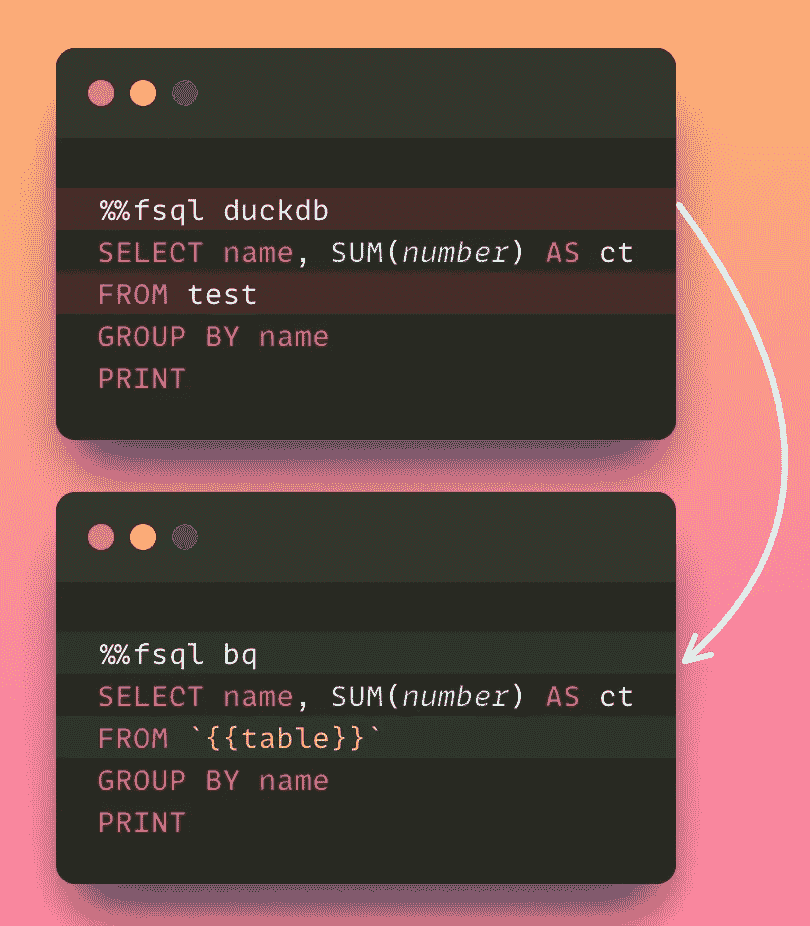

作者提供的图片

# 将 BigQuery 与 Spark、Dask 或 Ray 结合使用

如果你在 BigQuery 中处理大量数据，单台机器可能处理速度过慢。Fugue 提供了将 BigQuery 与分布式计算框架（如 Spark、Dask 和 Ray）集成的便捷方式。

在下面的查询中，`transform()` 函数以分布式方式将 `median` 函数应用到 Dask 数据框的每个分区。

```py
import pandas as pd
from typing import List, Any

# schema: *
def median(df:pd.DataFrame) -> List[List[Any]]:
    return [[df.state.iloc[0], df.number.median()]]

fa.transform(
    ("bq", """SELECT state, number
    FROM `bigquery-public-data.usa_names.usa_1910_2013` TABLESAMPLE SYSTEM (1 PERCENT)"""),
    median,
    partition="state",
    engine="dask"
).compute().head()
```


作者提供的图片

当查询执行时，数据会自动持久化到临时数据集。默认情况下，数据集名为 `FUGUE_TEMP_DATASET`，必须在 BigQuery 工作区中创建，如下所示。

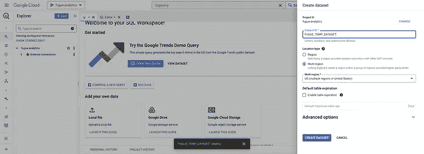

作者提供的图片

# 结论

恭喜你！你刚刚学会了如何使用 FugueSQL 快速迭代 BigQuery 中的数据。Fugue 的 Python 和 SQL 互操作性提供了无摩擦的开发者体验，且代码冗余最小。

我喜欢撰写数据科学概念和玩各种数据科学工具。你可以在[LinkedIn](https://www.linkedin.com/in/khuyen-tran-1401/)和[Twitter](https://twitter.com/KhuyenTran16)上与我联系。

如果你想查看我写的文章的代码，可以给[这个仓库](https://github.com/khuyentran1401/Data-science)加星。关注我在 Medium 上，以便及时了解我最新的数据科学文章：

[## 使用 Pandera 验证你的 pandas DataFrame

### 确保你的数据符合预期

[## 使用管道编写清晰的 Python 代码

### 处理可迭代对象的简短而清晰的方法

[## 当 Python 文件发生更改时自动重新加载的 2 个工具

[## 使用 Hex 创建可观察和可重复的笔记本

### 如何将笔记本集成到你的数据管道中

[## 创建可观察和可重复的 Hex 笔记本
