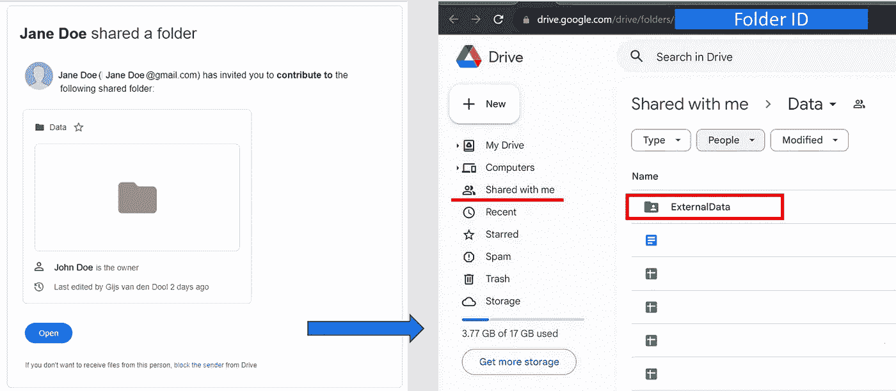
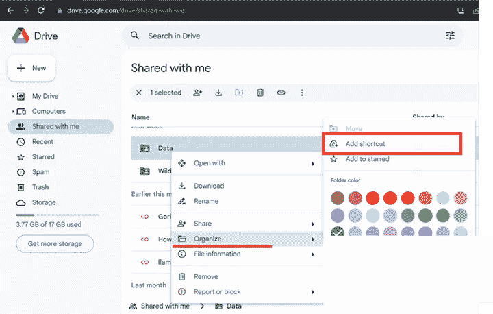
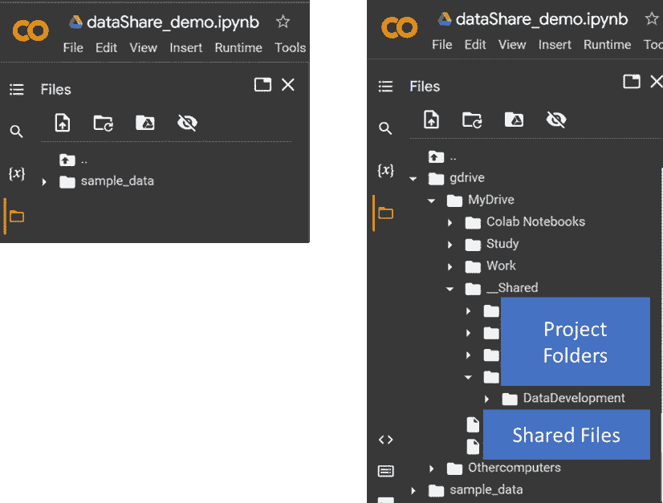

# 简化文件共享

> 原文：[`towardsdatascience.com/simplify-file-sharing-44bde79a8a18?source=collection_archive---------4-----------------------#2023-09-12`](https://towardsdatascience.com/simplify-file-sharing-44bde79a8a18?source=collection_archive---------4-----------------------#2023-09-12)

## 使用 Python 操作 Google Drive 的共享文件夹的编码示例

[](https://medium.com/@gijs.vandendool?source=post_page-----44bde79a8a18--------------------------------)[](https://towardsdatascience.com/?source=post_page-----44bde79a8a18--------------------------------) [Gijs van den Dool](https://medium.com/@gijs.vandendool?source=post_page-----44bde79a8a18--------------------------------)

·

[关注](https://medium.com/m/signin?actionUrl=https%3A%2F%2Fmedium.com%2F_%2Fsubscribe%2Fuser%2Fea289793d3d7&operation=register&redirect=https%3A%2F%2Ftowardsdatascience.com%2Fsimplify-file-sharing-44bde79a8a18&user=Gijs+van+den+Dool&userId=ea289793d3d7&source=post_page-ea289793d3d7----44bde79a8a18---------------------post_header-----------) 发表在 [Towards Data Science](https://towardsdatascience.com/?source=post_page-----44bde79a8a18--------------------------------) ·13 分钟阅读·2023 年 9 月 12 日[](https://medium.com/m/signin?actionUrl=https%3A%2F%2Fmedium.com%2F_%2Fvote%2Ftowards-data-science%2F44bde79a8a18&operation=register&redirect=https%3A%2F%2Ftowardsdatascience.com%2Fsimplify-file-sharing-44bde79a8a18&user=Gijs+van+den+Dool&userId=ea289793d3d7&source=-----44bde79a8a18---------------------clap_footer-----------)

--

[](https://medium.com/m/signin?actionUrl=https%3A%2F%2Fmedium.com%2F_%2Fbookmark%2Fp%2F44bde79a8a18&operation=register&redirect=https%3A%2F%2Ftowardsdatascience.com%2Fsimplify-file-sharing-44bde79a8a18&source=-----44bde79a8a18---------------------bookmark_footer-----------)

最近，又出现了数据共享问题，我认为这是设计一个处理共享文件夹的方法的好时机。我作为一名独立的地理信息科学专家，常常与多个组织同时合作。在我的项目中，我注意到每个组织在处理数据时都有其独特的方法，这些方法受到其特定文化和工作伦理的影响，导致出现了多种多样的方法论。幸运的是，它们之间有一些共同的做法，其中之一就是使用基于云的数据管理系统，通常是 Google，但也可以是 Microsoft 的 One-Drive 或 Dropbox。

在这篇文章中，我将解释如何在 Google 生态系统中使用 Python 操作共享文件夹。


[Annie Spratt](https://unsplash.com/@anniespratt?utm_source=unsplash&utm_medium=referral&utm_content=creditCopyText) 提供的照片，来源于 [Unsplash](https://unsplash.com/photos/QckxruozjRg?utm_source=unsplash&utm_medium=referral&utm_content=creditCopyText)

# 用例

在本地计算机上管理文件是非常个性化的，在组织中工作时（希望）能够标准化，或者至少有一些标准化。系统间共享文件可能会很复杂，但当你没有直接访问生产文件夹的权限时，使用共享文件夹是一个选项，组织可以与你共享一个专门指定的工作文件夹来交换文件。在这个例子中，组织已经授权访问他们 Google Drive 仓库中的一个名为 DATA 的文件夹，并且已经同意我们可以使用这个文件夹来交换文件。

## 本地文件管理

简单解释一下，对于不熟悉 Google Drive 文件共享的人，这个过程从收到一封邀请你贡献特定文件夹的电子邮件开始；请参见下面的邀请（左侧）。在邀请中有一个按钮，点击后会打开一个带有 Google Drive 界面的网页浏览器（右侧），该界面与接收邀请的 Google 邮箱相关联。



图 1：创建共享文件夹（作者提供的图片）

界面中隐藏了一些重要信息，尽早了解这些信息将有助于完成后续过程。

+   在 URL（屏幕顶部）中，有一个隐藏的 ID，这就是 Google 用来跟踪对该文件夹的所有操作的 ID，这也是我们稍后在 Python 代码中获取的 ID。

+   然后它会显示：“与我共享”以及共享文件夹的名称；这点很重要，因为当我们将 Google Drive 挂载到 CoLab 笔记本时，我们会发现这个类别不可用。

+   最后，我们看到 Data 下的文件和文件夹；这意味着我们可以访问所需的信息，并向文件夹中添加新文件。不过，文件夹的安全设置可能存在问题，因此在此阶段的一个好测试是创建一个小文本文件，并拖放到“ExternalData”文件夹中，以验证你是否拥有完全访问权限。

为了使“与我共享”的文件夹可访问，我们需要将该文件夹链接到本地/个人驱动器。我们可以通过创建快捷方式来实现，但这是一个手动步骤，每个人都会有所不同。要在 Google Colab 中访问与你共享的文件夹或文件，你需要：

1.  转到 Google Drive 中的“与我共享”。

1.  选择你想访问的文件夹或文件。

1.  右键点击它并选择“将快捷方式添加到驱动器”，会出现一个弹出窗口，选择“MyDrive”，然后点击“添加快捷方式”。

1.  将快捷方式放在驱动器上一个容易找到的位置；在我使用的设置中，快捷方式的位置是“__Shared”，确保包含快捷方式的文件夹在“MyDrive”下的文件夹列表顶部，然后是组织的子目录。

1.  将快捷方式重命名为有意义的名称；在此示例中，我使用了“DataDevelopement”。文件位置和名称约定非常个人化，程序不关心文件存储的位置或名称，但有一定结构可以避免以后的一些麻烦。



图 2：创建快捷方式（图片由作者提供）

在本地文件系统组织好，并配置好个人 Google Drive 后，我们可以尝试在 Python 笔记本中使用这个共享文件夹，并自动化项目中的文件共享。

# **安装**

本项目基于 Google Colab 或“Collaboratory”笔记本，我将在本文底部分享。使用这个环境的优点是它允许你在浏览器中编写和执行 Python，且

+   不需要配置

+   免费访问 GPU

+   简单共享

在与拥有内部程序的组织合作时，这些是非常重要的点，因为作为外部协作者，你通常无法直接访问代码库（这可能有许多不同的原因，从安全问题到项目管理限制）。Colab 笔记本是 Google 生态系统的一部分，并且（作为附加优势）创建了一个运行时环境，提供了挂载个人 Google 驱动器（用于文件共享）的选项。

# 导入模块和包

在此示例中，只加载了运行时所需的必要包，我们需要一些特定的库来处理共享驱动器。

## Google 授权

```py
from oauth2client.client import GoogleCredentials

from google.colab import auth as google_auth
google_auth.authenticate_user()

from google.colab import drive
drive.mount('/content/gdrive')
```

使用 oauth2client 和 Google Credentials 会使文件操作更加轻松。有其他替代方案，如下载带有凭据的 JSON 文件，在某些情况下，使用 JSON 文件可能会优于使用 Google Credentials，但由于这是一个不涉及敏感数据的项目，使用 oauth2client 库已经提供了足够的保护。

## pydrive

```py
from pydrive.auth import GoogleAuth
from pydrive.drive import GoogleDrive

gauth = GoogleAuth()
gauth.credentials = GoogleCredentials.get_application_default()
drive = GoogleDrive(gauth)
```

**pydrive** 是 google-api-python-client 的一个封装库，它简化了许多常见的 Google Drive API 任务，其中之一是处理查询 Google Drive 文件系统时的响应。Google Drive 通过 ID 存储所有对象，这些 ID 通过对象中的关系信息进行链接。通过 API 可以访问这些信息（见下一个代码块），但封装库在我们使用 Files.list() 的参数作为 dict 创建 GoogleDriveFileList 实例时，处理了所有繁重的工作。调用 GetList() 会以 GoogleDriveFile 的列表形式获取所有匹配查询的文件。

## Google API 客户端

```py
# Google API client:
from googleapiclient.discovery import build

# Initialize the Google Drive API client
drive_service = build('drive', 'v3')
```

Google API 客户端是一个大型库，功能众多，但在这个项目中，我们只需要一个模块：build。[build 模块](https://googleapis.github.io/google-api-python-client/docs/epy/googleapiclient.discovery-module.html)构造一个资源对象用于与 API 交互，并返回与服务交互的方法。pydrive 库能够很好地处理基本功能，如创建、更新和删除文件，但在这个项目中，有些时候我们需要更高级的功能，访问“服务”使我们能够提取 pydrive 方法未捕获的信息。

> 这就完成了笔记本的配置。在这个例子中，我们不需要比加载的库更多的库进行文件管理，加载库后，我们可以查看它们的作用。

# 笔记本中的文件管理

到目前为止，发生了一些事情：

+   Google 授权已设置，

+   我们创建了对驱动器的访问（用于读/写访问），并且

+   Pydrive 包可用于在驱动器上进行导航

希望在你跟随并运行代码时，你会在刷新面板后看到右侧的图片。你可以在图像中看到“__Shared”下的快捷方式作为一个文件夹，我们没有看到“Shared with me”部分，但由于我们有快捷方式，所以不需要查看“Shared with me”文件。



图 3：Google Colab 网络界面中运行时环境的未挂载状态与挂载状态（图片由作者提供）

Google Drive 的工作方式与本地操作系统中的文件管理不同，文件的物理位置不重要，因为这些对象由 ID 管理，存储在非结构化的数据湖中，我们可以通过 ID 访问文件和文件夹。

不幸的是，虽然 `os.path`（在 Python 中）有用于遍历文件系统的 walk 函数，但 Google Drive 中没有类似的方法（或者我对此方法不知情）。不过，我们可以使用 pydrive 库，手动遍历目录树中的文件夹，幸运的是，我们知道从文件夹的路径要去哪里。因此，我们不需要遍历整个结构，而是可以使用数据路径中的文件夹名称深入文件夹树。

因此，我们遍历小列表（在这个例子中，有三个项目）来找到 ID 并使用这个 ID 进入下一个级别。请注意第四级被注释掉了；我们将在笔记本的文件处理部分的第二部分中到达这个级别。

```py
# File handling testing:
# There are in this example three folder levels:
# /content/gdrive/MyDrive/__Shared/<your Project>/DataDevelopment

# Update these to your structure:
folderList1 = ["__Shared", your_Project ,"DataDevelopment"] #, "ExternalData"]
```

下面的代码块中的循环从根目录开始，当它在列表中找到一个项目时，循环将使用对象的 ID 进入列表的下一个级别，如果没有找到项目，代码将提示找不到文件夹，并且不会在结构中更深的地方查找任何文件夹。循环以快捷方式文件夹的 ID 或提示找不到文件夹结束。

```py
# Trying to copy the created dummy file:
boo_foundFolder = False
fileID = "root"
level = 0

# View all folders and file in your Google Drive
# First loop over the list:
print("File and Folder structure - check with IDs")
for folderName in folderList1:
  print(f"Checking: {folderName}")

  if boo_foundFolder or fileID == "root": #first run
    boo_foundFolder = False

    fileList = drive.ListFile({'q': f"'{fileID}' in parents and trashed=false"}).GetList()
    for file in fileList:
      # Testing the name:      
      if(file['title'] == folderName):
        fileID = file['id']
        boo_foundFolder = True

        level += 1 
      # end if
    # end for

    if boo_foundFolder == False:
      print(f"folder not found")
      break
    # end if    
  # end if
# end for

print(f"Did we find the folder: {boo_foundFolder}")
if boo_foundFolder:
  print(fileID)
  ShortCutID = fileID
else:
  ShortCutID = 0
```

目前，我们已经获得了工作文件夹的本地文件 ID，但在我们能够在这个位置查找文件之前，我们需要将这个本地 ID 与共享文件夹的目标 ID 匹配。为了找到这些信息，我们必须深入 Google 基础设施，为此我们需要一个助手：`drive_service`。我们在加载项目时激活了这个助手，并且没有收到警告，这意味着我们可以通过 API 访问服务，并通过 ID 请求信息。

我们需要的详细信息最好通过一个简单的函数来收集，例如下一段代码块中的 `findTargetID` 函数。在这个函数中，`fileID` 是我们通过遍历文件夹中的名称找到的快捷方式 ID，通过调用 `drive_service.files().get` 并指定字段，我们可以获得文件夹的目标 ID（这将与 Google Drive Web 界面 URL 中的 ID 相同（见图 1））。

```py
def findTargetID(fileID, drive_service):
  # The ID of the shared file you want to get ShortcutDetails from
  file_id = fileID

  try:
      # Get the file details
      file = drive_service.files().get(fileId=file_id, 
                                      fields="id, shortcutDetails").execute()

      # Check if the file is a shortcut
      if 'shortcutDetails' in file:
          shortcut_details = file['shortcutDetails']
          print("Shortcut Details:")
          print(f"Target ID: {shortcut_details['targetId']}")
          print(f"Target MIME Type: {shortcut_details['targetMimeType']}")
      else:
          print("The file is not a shortcut.")
      # end if

  except Exception as e:
      print(f"An error occurred: {e}")

  return shortcut_details['targetId']

if boo_foundFolder:
  targetID = findTargetID(fileID, drive_service)
  print(targetID)
else:
  print("Folder not found")
# end if 
```

有了这个目标 ID，我们可以访问 Google 数据服务器上的实际共享文件夹，我们不再在快捷方式文件夹中工作。

> 总结一下，我们创建快捷方式文件夹的原因是为了能够在挂载的文件夹列表中查看文件夹。类别“与我共享”没有挂载，但快捷方式有。因此，我们可以使用这个新的 ID 查找文件。

# 查找文件

我们现在得到了所需的目标 ID，即在流程开始时与我们共享的文件夹的目标 ID，凭借这个 ID，所有正常的文件操作对我们都是可用的。

我们可以通过在运行时环境中首先创建一个小的文本文件来验证我们是否对共享文件夹拥有足够的权限；创建这个文件也确认了我们可以访问运行时环境，因为当文件正确创建时，它将出现在 CoLab 笔记本的 Web 界面的左侧面板中。

```py
# Create a test file:
with open('example.txt', 'w') as f:
  f.write('This is an example file, to test CoLab file sharing')
# this file is now sitting in the runtime space of the notebook 
# (see left plane, under files)
```

现在的想法是将这个文件移动到“与我共享”的文件夹“Data”，我们在快捷方式中将其重命名为“DataDevelopment”，但前面的函数提供了 <target ID>，我们现在可以使用这个 ID 来检查我们刚刚在运行时环境中创建的文件是否在共享驱动器上可用。

```py
if boo_foundFolder:
  print("folder found")
  folderID = targetID

  file_on_drive = False
  file_id = 0

  # check if the file is on the drive:
  fileList = drive.ListFile({'q': f"'{folderID}' in parents and trashed=false"}).GetList()
  for file in fileList:
    if(file['title'] == "example.txt"):
      file_on_drive = True
      fileID = file['id']
    # end if
  # end for

  if file_on_drive:
  #Overwrites the existing Google drive file."""
    file1 = drive.CreateFile({'id': fileID})
    strFileHandling = "Updated"

  else:
    file1 = drive.CreateFile({"mimeType": "text/csv",
                             "parents": [{"kind": "drive#fileLink", 
                                        "id": folderID}]})
    strFileHandling = "Created"
  # end if

  # creating the binding to the file in the Run-Time environment:
  file1.SetContentFile("example.txt")

  # copying the file to the Google Drive:
  file1.Upload()

  print(f'{strFileHandling} file %s with mimeType %s' % (file1['title'], file1['mimeType']))

else:
  print("folder not found")
# end if
```

运行上述代码将创建一个新的共享文件夹中的文件，或者在找到文件时更新（覆盖）文件。

## 创建工作区

使用快捷方式 ID 查找目标 ID 的第二个原因是查找共享文件夹下的项目。如前所述，Google Drive 通过 ID 管理一切，快捷方式 ID 没有任何子项，因此使用此 ID 查找新项目将导致空列表。这可以通过在第一个文件夹列表中包含“ExternalData”文件夹名称来测试；第一个列表将找不到此文件夹。但是，重新启动以目标 ID 为起点的循环将找到此文件夹。

在下面的代码片段中，创建了一个新文件夹列表，使用“共享给我”文件夹名称下方的文件夹名称。虽然“ExternalData”文件夹已存在（见图 1），但“NewDataFolder”尚未创建。

```py
# Update these to your structure:
# ... DataDevelopment/ExternalData/__CoLab_Notebook 

# Setting the Working Folder:
folderList2 = ["ExternalData", "NewDataFolder"]
```

我们可以使用与之前相同的循环结构，但现在不是从 ROOT 开始，而是从目标 ID 开始，循环将找到“ExternalData”文件夹，但找不到新数据文件夹。在共享为 gist 的笔记本中，此测试的代码以以下内容开始：

```py
print("File and Folder structure - check with TARGET IDs")
boo_foundFolder = False
fileID = targetID

for folderName in folderList2:
  print(f"Checking: {folderName}")
```

使用第二个文件夹列表和 targetID 开始检查时，循环将报告没有“NewDataFolder”。

由于工作文件夹尚不存在，我们可以使用`drive_service.files`来创建这个新文件夹，并用同样的方法将所有需要从运行时环境转移到“共享给我”文件夹的文件也转移过去。

```py
def create_folder_in_folder(folder_name,parent_folder_id, drive_service):

    file_metadata = {
    'name' : folder_name,
    'parents' : [parent_folder_id],
    'mimeType' : 'application/vnd.google-apps.folder'
    }

    file = drive_service.files().create(body=file_metadata, supportsAllDrives=True, 
                                  fields='id').execute()

    print ('Folder ID: %s' % file.get('id')) 
```

```py
if WorkingFolderID == 0: 
  # fileID is the parent ID from the previous search
  create_folder_in_folder("NewDataFolder", fileID, drive_service)
```

> **主要收获：** Google Drive 文件系统是基于 ID 的，所有对象都有 ID。“共享给我”的对象在 Google Colab 中不可用，但通过“快捷方式”可以访问它们，通过查找相关的目标 ID，我们可以直接在“共享给我”文件夹中工作，包括最初与我们共享的文件夹下的对象。

# 结论

在本文中，我们涵盖了与共享文件夹相关的一些基本方面，包括：

1.  **设置本地文件管理：** 我们从接收贡献指定 Google Drive 目录的邀请开始，展示了如何构建本地文件系统以提高协作效率。

1.  **配置 Google Colab 以进行协作：** 我们讨论了使用 Google Colab（一个协作 Python 环境）的优势，以及如何为项目协作进行设置。

1.  **导入必要的模块和包：** 我们提供了导入基本模块和包的代码示例，包括 Google 授权、简化 Google Drive API 任务的 pydrive 和用于高级功能的 Google API 客户端。

1.  **笔记本中的文件管理：** 你看到如何在 Google Colab 环境中管理文件，包括创建和移动文件，在本地环境和共享文件夹之间使用共享 ID 和目标 ID。

1.  **查找文件和创建工作区：** 我们深入探讨了使用目标 ID 在共享文件夹中查找文件的过程，以及为你的项目创建新文件夹和工作区的方法。

我希望这篇关于组织间共享文件夹和文件的操作指南对你有所帮助，并且提供了一些关于如何在共享文件夹中操作文件和文件夹的见解。

> *感谢阅读，我希望这篇文章能帮助你解决问题或给你下一项目的灵感。*

*Google CoLab NoteBook 链接:* [*gist*](https://gist.github.com/GvdDool/3840487dbe658c42f2d5128000bbed9f)

*免责声明:* 这个示例中使用的代码并未优化，而是为了说明过程（对改进代码的任何建议欢迎在托管此笔记本的 gitHub 页面提出）。
