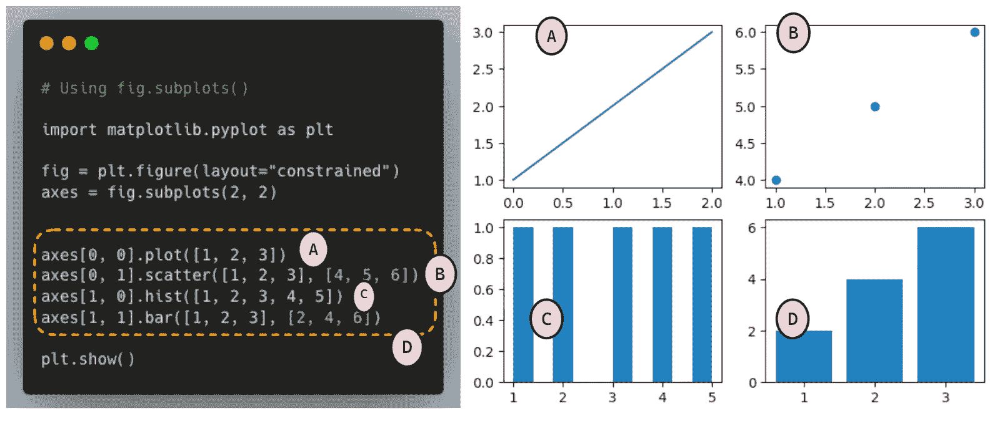
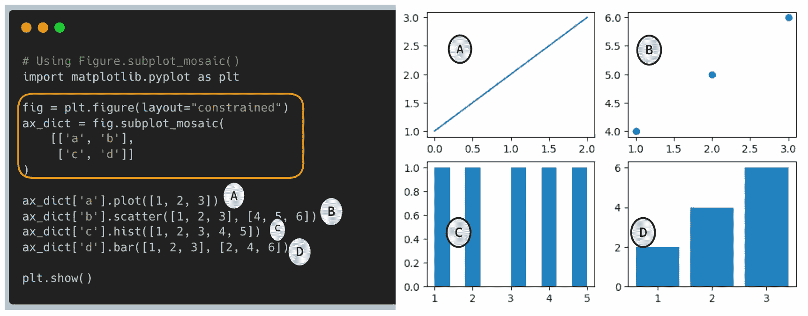
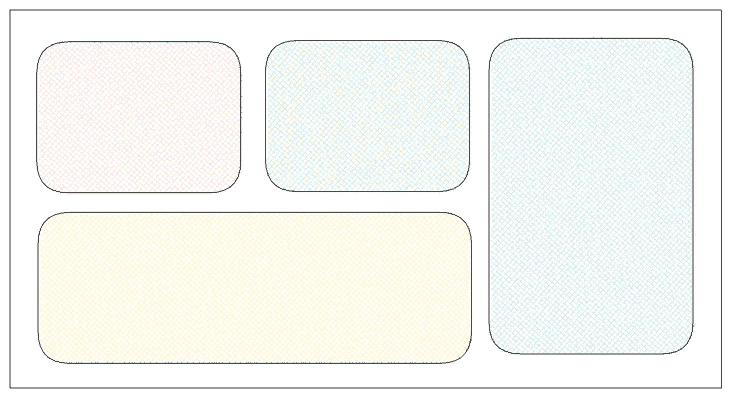
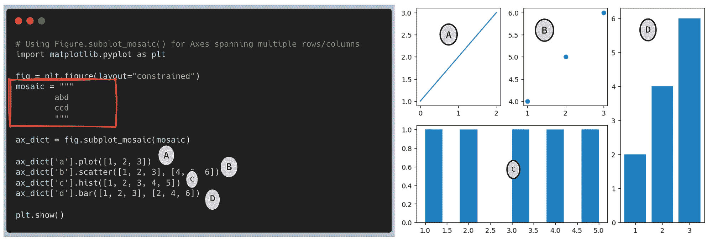
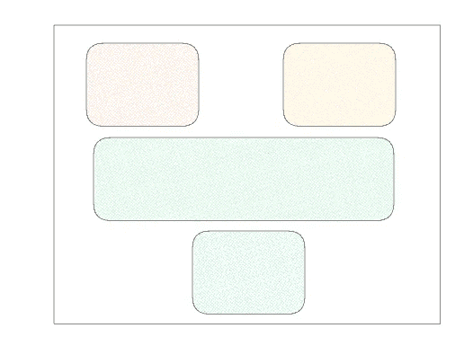
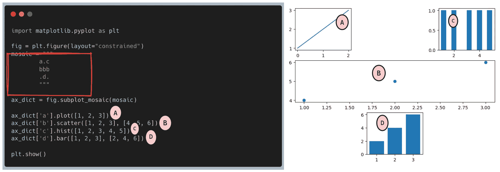

# 简化 Matplotlib 中子图的创建

> 原文：[`towardsdatascience.com/simplifying-subplots-creation-in-matplotlib-3f6efce356b9`](https://towardsdatascience.com/simplifying-subplots-creation-in-matplotlib-3f6efce356b9)

## 将马赛克魔法融入你的图表

[](https://pandeyparul.medium.com/?source=post_page-----3f6efce356b9--------------------------------)[](https://towardsdatascience.com/?source=post_page-----3f6efce356b9--------------------------------) [Parul Pandey](https://pandeyparul.medium.com/?source=post_page-----3f6efce356b9--------------------------------)

·发布于 [Towards Data Science](https://towardsdatascience.com/?source=post_page-----3f6efce356b9--------------------------------) ·阅读时间 5 分钟·2023 年 5 月 23 日

--


图片由 [charlesdeluvio](https://unsplash.com/@charlesdeluvio?utm_source=medium&utm_medium=referral) 在 [Unsplash](https://unsplash.com/?utm_source=medium&utm_medium=referral) 提供

最近，我在一个项目中需要使用 [Matplotlib](https://matplotlib.org/) 库创建子图。如果你曾经使用过 Matplotlib 库，你很可能也使用过它的子图功能。子图是同时生成多个图表的有效工具，这在比较结果或多个图表共享相同坐标轴时非常有用。然而，有时 Matplotlib 中的子图语法对我们很多人来说可能非常复杂，包括我自己。实现所需的子图布局似乎像是在进行试错游戏，这使我们从实际项目中分心。

# 藏在显眼处，真的！！


藏在显眼处 | [图片来源于 Pixabay](https://pixabay.com//?utm_source=link-attribution&amp%3Butm_medium=referral&amp%3Butm_campaign=image&amp%3butm_content=317041)

我知道 R 中的 [patchwork 库](https://cran.r-project.org/web/packages/patchwork/vignettes/patchwork.html) 擅长处理子图的创建。然而，我惊讶地发现 [**Matplotlib 一直都有这个功能**](https://twitter.com/matplotlib/status/1382034095534931969)，这让我意识到应该彻底阅读文档。出于好奇，我决定深入了解这个功能，并通过博客文章将我的经历和见解分享给他人。

# Matplotlib 中的子图

Matplotlib，一个广泛使用的绘图库，提供了两种创建子图的方法：`**Figure.subplots()**`和`**Figure.subplot_mosaic()**`。虽然这两种方法都能实现相同的目的，但使用后者方法具有一些固有的优势。让我们探讨它们的区别，强调`Figure.subplot_mosaic()`相较于`Figure.subplots()`提供的简便性和灵活性。

## 理解 Figure.subplots 方法

Matplotlib 中的 subplots 方法允许我们在网格状结构中创建子图。它接受指定子图网格中的行数和列数的参数，并返回一个`Figure`对象和一个表示各个子图的`Axes`对象数组。

让我们考虑一个示例，我们希望创建一个包含四个子图的 2X2 图形。我们可以使用`[**Figure.subplots()**](http://Figure.subplots)`方法来实现这个任务。



图（1）：使用`[**Figure.subplots**](https://matplotlib.org/stable/api/figure_api.html#matplotlib.figure.Figure.subplots)`方法在 Matplotlib 中创建子图 | 作者图片

如*图（1）*所示，尽管`**Figure.subplots**`方法通过指定行数和列数提供了一种直接创建子图的方法，但在以下情况下会显得不足：

+   **手动索引错误**

用户必须手动指定每个子图的索引。这个过程可能容易出错，特别是在处理复杂的子图排列时，或者当索引错误导致子图位置错误或遗漏时。

+   **有限的布局灵活性**

该方法依赖于固定的网格结构，导致创建不规则或自定义布局变得困难。如果所需的排列不符合指定的网格，可能会导致视觉不一致或图形扭曲。

+   **调整挑战**

对子图排列进行更改或添加/删除子图可能会很麻烦。调整索引或调整网格大小需要仔细的手动调整，增加了引入错误的风险。

## 更好的替代方案 — **Figure.subplot_mosaic 方法**

`[**Figure.subplot_mosaic**](https://matplotlib.org/stable/api/figure_api.html#matplotlib.figure.Figure.subplot_mosaic)`方法是 Matplotlib 3.4.0 版本中引入的一种强大替代方案，旨在简化子图的创建和排列。它提供了一种更直观的方法，通过**类似字典的结构**定义子图，其中键表示子图标签，值定义它们在网格中的位置。使用这种方法，你可以通过指定每个子图的相对位置轻松创建复杂的子图布局。

让我们将之前的方法与`Figure.subplot_mosaic()`方法进行比较。



图 (2)：使用 `[**Figure.subplot_mosaic**](https://matplotlib.org/stable/api/figure_api.html#matplotlib.figure.Figure.subplot_mosaic)` 方法在 Matplotlib 中创建子图 | 图片由作者提供

从*图(2)*可以看出，虽然我们获得了相同的结果，但过程要简单得多且更直观。此外，我们还拥有以下优点：

1\. **直观的语法**

`Figure.subplot_mosaic()` 使用的字典-like 结构提供了一种清晰简洁的方式来指定子图的排列。这种方法消除了在 `fig.subplots()` 中手动计算和索引的需要。我们已经在上面的代码中看到如何指定子图的顺序。然而，我们可以通过 [*限制坐标轴标签*](https://matplotlib.org/stable/gallery/subplots_axes_and_figures/mosaic.html#string-short-hand) 为单个字符来进一步简化过程，如下所示：

```py
ax_dict

--------------------------------

{'a': <AxesSubplot: label='a'>,
 'b': <AxesSubplot: label='b'>,
 'd': <AxesSubplot: label='d'>,
 'c': <AxesSubplot: label='c'>}
```

**2\. 排列子图的灵活性：**

`Figure.subplot_mosaic()` 使我们能够轻松定义复杂的子图布局，包括跨越多行或多列的不规则网格。这种灵活性在处理需要并排显示的不同可视化数据集时特别有用。我们来看两个示例，展示我们希望的子图排列：

+   首先，我们希望有一个跨越多行或多列的坐标轴。更准确地说，我们寻找的是类似于以下示例的东西：



图片由作者提供

尽管使用 `[Figure.subplots](https://matplotlib.org/stable/api/figure_api.html#matplotlib.figure.Figure.subplots)` 方法排列子图可能让人感到困难，但 `Figure.subplot_mosaic()` 方法将过程简化为仅重新排列坐标轴标签。



使用 Figure.subplot_mosaic() 进行跨越多行/列的坐标轴 | 图片由作者提供

+   另一个需要考虑的场景是并非将坐标轴填满整个图形，而是留下一些网格空间为空，如下所示：



图片由作者提供



# 使用 Figure.subplot_mosaic() 指定网格中的一些空间为空白

除了上述优点之外，我们还可以 [控制马赛克创建](https://matplotlib.org/stable/gallery/subplots_axes_and_figures/mosaic.html#controlling-mosaic-creation)、[管理子图创建](https://matplotlib.org/stable/gallery/subplots_axes_and_figures/mosaic.html#controlling-subplot-creation)以及分别调整 [每个子图的参数](https://matplotlib.org/stable/gallery/subplots_axes_and_figures/mosaic.html#per-axes-subplot-keyword-arguments) 等功能。文档提供了详细的示例，是实验和探索这些功能的极好资源。

[](https://matplotlib.org/stable/gallery/subplots_axes_and_figures/mosaic.html?source=post_page-----3f6efce356b9--------------------------------#string-short-hand) [## 复杂和语义化的图形组合（subplot_mosaic） - Matplotlib 3.7.1 文档

### 在图形中以非均匀网格布局坐标轴可能既繁琐又冗长。

matplotlib.org](https://matplotlib.org/stable/gallery/subplots_axes_and_figures/mosaic.html?source=post_page-----3f6efce356b9--------------------------------#string-short-hand)

# 结论

在这篇博客文章中，我们探讨了在 Matplotlib 中使用`Figure.subplot_mosaic()`相较于`fig.subplots()`的优势。前者在组织子图方面提供了更高的灵活性，其定位语法特别直观，从而使数据科学家和可视化爱好者能够轻松创建复杂和定制化的布局。这一功能让我想起了我最初接触 Python 的 `f-strings`。在 f-strings 推出之前，我主要使用`%-formatting`和`str.format`方法进行字符串格式化。虽然这些方法是有效的，但并不特别直观。然而，自从引入`f-strings`以来，我的编码体验显著改善——就像我使用`Figure.subplot_mosaic()`的经历一样👩‍💻😃


