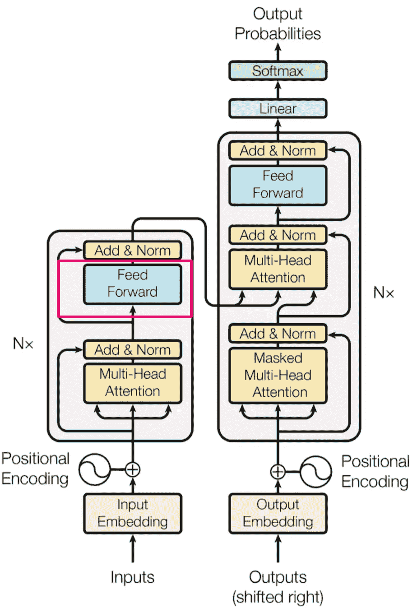

# 简化 Transformers：用你理解的词汇解析最前沿的 NLP —— 第四部分 —— 前馈层

> 原文：[`towardsdatascience.com/simplifying-transformers-state-of-the-art-nlp-using-words-you-understand-part-4-feed-foward-264bfee06d9?source=collection_archive---------4-----------------------#2023-10-04`](https://towardsdatascience.com/simplifying-transformers-state-of-the-art-nlp-using-words-you-understand-part-4-feed-foward-264bfee06d9?source=collection_archive---------4-----------------------#2023-10-04)

## 传统的前馈层及其在 Transformers 中的作用。

 [Chen Margalit](https://medium.com/@chenmargalit?source=post_page-----264bfee06d9--------------------------------)

·

[关注](https://medium.com/m/signin?actionUrl=https%3A%2F%2Fmedium.com%2F_%2Fsubscribe%2Fuser%2Ff8e6113b0479&operation=register&redirect=https%3A%2F%2Ftowardsdatascience.com%2Fsimplifying-transformers-state-of-the-art-nlp-using-words-you-understand-part-4-feed-foward-264bfee06d9&user=Chen+Margalit&userId=f8e6113b0479&source=post_page-f8e6113b0479----264bfee06d9---------------------post_header-----------) 发表在 [Towards Data Science](https://towardsdatascience.com/?source=post_page-----264bfee06d9--------------------------------) ·9 分钟阅读·2023 年 10 月 4 日

--

由于这是一个持续更新的系列，如果你还没有开始，可能需要考虑从之前的部分开始：第一部分、第二部分 和 第三部分。

本节将介绍基本的前馈层，这是大多数深度学习架构中的一个基本元素。在讨论深度学习中的重要主题时，我们将强调它们在塑造 Transformers 架构中的重要作用。

[原始论文中的图片](https://proceedings.neurips.cc/paper_files/paper/2017/file/3f5ee243547dee91fbd053c1c4a845aa-Paper.pdf)

前馈线性层基本上是一堆神经元，每个神经元都与其他一堆神经元相连。请看下面的图片。A、b、c 和 d 是神经元。它们持有一些输入，即表示我们想要理解的数据的数字（像素、词嵌入等）。它们与神经元 1 相连。每个神经元有不同的连接强度。a-1 是 0.12，b-1 是 -0.3，等等。实际上，左列中的所有神经元都与右列中的所有神经元相连。这样做会使图像变得不清晰，因此我没有这样做，但这点很重要。正如 a-1 存在一样，我们也有 a-2、b-2、c-2、d-3 等。每两个神经元之间的连接都有不同的“连接强度”。

作者提供的图片

在这个架构中，有两点需要注意：

1. 如前所述，每个节点（神经元）都与每个其他节点相连。四个神经元 a、b、c 和 d 都与每个其他神经元（1、2、3）相连。将这张图片视为一个指挥链。1、2、3 是指挥官。他们从士兵 a、b、c 和 d 那里收到报告。A 知道一些事情，但视野不广。1 知道得更多，因为它从 a、b、c 和 d 那里收到报告。2 和 3 也是指挥官，它们的情况也是如此。这些指挥官（1、2、3）也将报告传递给更高层的指挥官。那些更高层的指挥官会同时收到来自 a、b、c、d 和 1、2、3 的报告，因为下一层（每一列神经元是一个层）也是以完全相同的方式连接的。因此，第一个重要的理解点是 1 的视野比 a 广，而下一层的指挥官将比 1 的视野更广。当你有更多的点时，你可以建立更多有趣的连接。

2\. 每个节点与下一层的每个其他节点有不同的连接强度。a-1 是 0.12，b-1 是-0.3。我这里给出的数字显然是虚构的，但它们的规模是合理的，并且它们是学习到的参数（例如，在训练过程中会发生变化）。把这些数字看作是 1 在 a、b 等上的权重。从指挥官 1 的角度来看，a 稍微可信一点。你不应该完全相信他说的每句话，但你可以相信他的话中的一部分。B 则非常不同。这个节点通常会减轻它收到输入的重视程度。就像一个随和的人。这是一个对发生事情的过度简化，但重要的是要注意：每个神经元持有一些输入，无论是原始输入还是处理过的输入，并以自己的处理方式传递它。

你知道“传话游戏”吗？你和 10 个人坐成一排，你对下一个人耳语一个词，比如“Pizza”。第 2 个人听到的类似“Pazza”，于是他们把“Pazza”传给第 3 个人。第 3 个人听到的是“Lassa”（毕竟是耳语），于是他传递“Lassa”。第 4 个人听到的是“Batata”，所以他传递“Batata”，依此类推。当你问第 10 个人你听到的是什么，他会说：“Shambala！”我们怎么从 Pizza 变成 Shambala 的？事有凑巧。这种游戏和神经网络的区别在于，每个人都会添加自己的有用处理。第 2 个人不会说“Pazza”，他会说：“Pazza 是意大利菜，非常棒”。第 3 个人会说：“Lassa 是意大利菜，在世界各地都很常见”，等等。每个人（层）都添加了一些希望有用的东西。

基本上就是这样发生的。每个神经元接收一个输入，处理它，然后传递出去。为了匹配完全连接层，我建议对“传话游戏”进行升级：从现在起，你与多个排进行游戏，每个人对其他行中的任何其他人耳语。第 2 位置及其后的人从许多人那里收到耳语，并需要理解他们给每个人多少“权重”（重要性）。这就是前馈层。

我们为什么使用这些层？因为它们允许我们进行有用的计算。把它想象成群体智慧的一个例子。你知道猜测牛的体重的故事吗？1906 年，在英国某地，有人把一头牛带到展览上。主持人让 787 个随机人猜它的体重。你会怎么说？这头牛重多少？

所有猜测的平均值是 1197 磅（542 千克）。这些是随机人的猜测。它们的误差有多大？1 磅，450 克。Steer 的重量是 1198。这个故事来源于 [这里](https://www.wondriumdaily.com/the-wisdom-of-crowds/#:~:text=An%20Astonishing%20Example%20of%20the%20Wisdom%20of%20Crowds&text=The%20actual%20weight%20of%20the,that%20weight%20was%201%2C197%20pounds.)，我不知道细节是否正确，但回到我们的主题，你可以把线性层想象成类似的工作方式。你增加更多的参数，更多的计算（更多的猜测），你就能得到更好的结果。

图片由 [Larry Costales](https://unsplash.com/@larry3?utm_source=unsplash&utm_medium=referral&utm_content=creditCopyText) 提供，来源于 [Unsplash](https://unsplash.com/photos/Ahf1ZmcKzgE?utm_source=unsplash&utm_medium=referral&utm_content=creditCopyText)。

让我们试着想象一个真实场景。我们给网络一个图像，并且我们想决定它是一个苹果还是一个橘子。这个架构基于 CNN 层，我不会深入讨论，因为它超出了本系列的范围，但基本上，它是一个能够识别图像中特定模式的计算层。每一层都能识别逐渐复杂的模式。例如，第一层几乎不能察觉任何东西，它只是传递原始像素，第二层识别垂直线，下一层得知有垂直线，并且从其他神经元那里知道垂直线非常接近。它进行 1+1 运算并认为：不错！这是一个角落。这就是从多个来源获取输入的好处。

我们做的计算越多，我们可以想象得到的结果就会更好。实际上，它并不完全是这样，但确实有 **一些** 真理。如果我进行更多的计算并咨询更多的人（神经元），我通常可以达到更好的结果。

**激活函数** 我们将堆叠另一个深度学习中基本且非常重要的概念的关键构建块，然后我们将连接这些点以理解它与 Transformers 的关系。

全连接层虽然很棒，但有一个大缺点。它们是线性层，只进行线性变换和线性计算。它们只能进行加法和乘法，但不能以“创造性”的方式转换输入。有时候，增加更多的能力并不足够，你需要从完全不同的角度思考问题。

如果我赚取 $10，每天工作 10 小时，并且我想更快地存到 $10k，我可以每周工作更多天数或每天工作额外的小时。但还有其他解决方案，不是吗？那么多的银行可以抢劫，其他人不需要他们的钱（我可以更好地使用），找到更高薪的工作等等。解决方案不总是更多的同样方法。

激活函数来救场。激活函数允许我们进行非线性变换。例如，将一组数字 [1, 4, -3, 5.6] 转换成概率。这正是 Softmax 激活函数所做的。它将这些数字转换为 [8.29268754e-03, 1.66563082e-01, 1.51885870e-04, 8.24992345e-01]。这五个数字的和为 1。虽然写法有些繁琐，但每个 e-03 表示第一个数字（8）后面跟着 3 个零（例如 0.00 然后是 82926。实际数字是 0.00829268754）。这个 Softmax 激活函数将整数转变为 0 到 1 之间的浮点数，同时保持它们之间的间距。当需要对这些值使用统计方法时，你可以想象这有多么有用。

还有其他类型的激活函数，其中最常用的一种是 ReLU（修正线性单元）。它是一个极其简单（但极其有用）的激活函数，将任何负数变为 0，将任何非负数保持不变。非常简单，非常有用。如果我将列表 [1, -3, 2] 传递给 ReLU，我得到 [1, 0, 2]。

在用 Softmax 吓到你之后，你可能会期待更复杂的东西，但正如有人曾告诉我的，“运气是有用的”。有了这个激活函数，我们很幸运。

我们需要这些激活函数的原因是非线性关系无法通过线性计算（全连接层）来表示。如果每小时我赚 $10，那么我得到的金额是线性的。如果每工作 5 小时，我在接下来的 5 小时中获得 10% 的增加，关系就不再是线性的了。我的工资不会是我工作的小时数 * 固定小时工资。我们之所以在更复杂的任务中，如计算机识别和文本生成中承担深度学习的负担，是因为我们寻找的关系是高度非线性的。“我爱”之后出现的词并不明显，也不是恒定的。

ReLU 的一个重要好处，也可能是它如此常用的原因，是它在计算大量数字时非常便宜。当你有少量神经元（假设是几万个）时，计算并不是特别关键。但当你使用数百亿个神经元，如大型语言模型所做的那样，计算上的效率差异可能会产生显著影响。

**正则化** 在解释它在 Transformers 中（非常简单）实现的方式之前，我们将介绍最后一个概念，即 dropout。Dropout 是一种正则化技术。正则化？正如我们所教的那样，学习复杂的逻辑并不总是有用，有时我们可以记住我们所见到的东西，或记住接近它的东西。第二次世界大战是什么时候？嗯……它受到第一次世界大战、经济危机、愤怒的人们等的影响……大约在 1917 年，所以我们说 1928 年。也许记住实际日期会更好。

正如你想象的，这对机器学习来说不好。如果我们需要回答我们已经知道的答案，我们就不需要这个复杂的领域了。我们需要一个聪明的算法，因为我们不能记住所有的东西。我们需要它对实时推断进行考虑，我们需要它有点像思考。用于让算法学习而不是记忆的技术的总称是正则化。在这些正则化技术中，一个常用的是 dropout。

**Dropout** 什么是 dropout？一种相当简单的（幸运的是）技术。记住我们说全连接层是完全连接的？好吧，dropout 打破了这个逻辑。Dropout 技术意味着将“连接强度”设置为 0，这意味着它不会产生任何效果。焊接的“a”对指挥官 1 完全无用，因为其输入被设置为 0。没有答案，没有正面，没有负面。在每一层中我们添加 dropout 时，我们随机选择一定数量的神经元（由开发者配置），并将它们与其他神经元的连接设置为 0。每次指挥官都被迫忽略不同的士兵，因此无法记住他们，因为下次可能不会遇到他们。

**回到 Transformers！** 我们现在拥有了理解 Feed Forward 层中具体发生什么的所有构建块。这将变得非常简单。

[原始论文中的图像](https://proceedings.neurips.cc/paper_files/paper/2017/file/3f5ee243547dee91fbd053c1c4a845aa-Paper.pdf)

这个层简单地做三件事：

1\. 基于位置的线性计算——文本中的每个位置（以向量表示）都通过一个线性层。

2\. 在线性计算的输出上进行 ReLU 计算。

3\. 在 ReLU 输出上进行另一个线性计算。

4\. 最后，我们将添加到第 3 层的输出中。

就是这样。如果你对深度学习有经验，这部分可能对你来说非常简单。如果没有，你可能会遇到一些困难，但你已经理解了深度学习中的一个极其重要的移动部分。

在接下来的部分，我们将讨论解码器！你可以在这里找到它。
