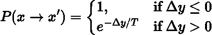
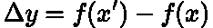
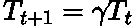
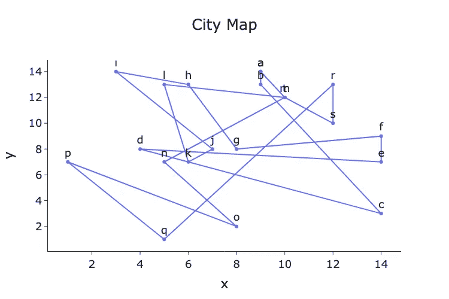
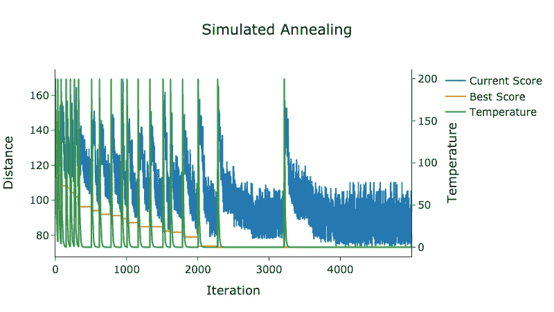
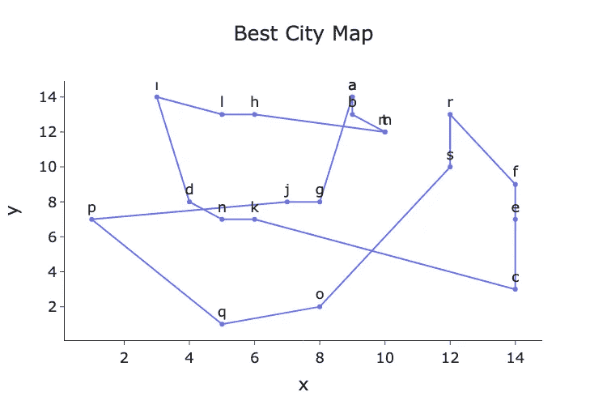

# 带重启策略的模拟退火

> 原文：[`towardsdatascience.com/simulated-annealing-with-restart-a19a53d914c8`](https://towardsdatascience.com/simulated-annealing-with-restart-a19a53d914c8)

## 对经典的模拟退火优化算法及其在旅行商问题中的应用进行变种处理

 [Egor Howell](https://medium.com/@egorhowell?source=post_page-----a19a53d914c8--------------------------------)

·发表于 [Towards Data Science](https://towardsdatascience.com/?source=post_page-----a19a53d914c8--------------------------------) ·5 分钟阅读·2023 年 2 月 13 日

--

图片由 [Jonathan Greenaway](https://unsplash.com/es/@jogaway?utm_source=medium&utm_medium=referral) 提供，来源于 [Unsplash](https://unsplash.com/?utm_source=medium&utm_medium=referral)

# 背景

在我之前的文章中，我们讨论了如何使用 [***模拟退火***](https://en.wikipedia.org/wiki/Simulated_annealing) 的 [***元启发式***](https://en.wikipedia.org/wiki/Metaheuristic) 优化算法来解决 [***旅行商问题 (TSP)***](https://en.wikipedia.org/wiki/Travelling_salesman_problem)。你可以在这里查看那篇文章：

 ## 如何使用模拟退火解决旅行商问题

### 使用模拟退火优化算法来获得旅行商问题的最优解

towardsdatascience.com

TSP 是一个著名的 [***组合优化***](https://en.wikipedia.org/wiki/Combinatorial_optimization) 和 [***运筹学***](https://en.wikipedia.org/wiki/Operations_research) 问题。它的目标是找到销售员访问 ***n*** 个城市的最短路径，要求每个城市仅访问一次，并以原始/起始城市结束。

问题听起来很简单，但随着城市数量的增加，可能的路径数量会出现[***组合爆炸***](https://en.wikipedia.org/wiki/Combinatorial_explosion)。例如，***4***个城市的可能路径数量为***3***，***6***个城市的可能路径数量为***60***，而***20***个城市的可能路径数量则是巨大的***60,822,550,200,000,000!*** 实际上，对于***20***个城市，尝试每一条路径的时间大约是[***~2000***年](https://www.sciencedirect.com/topics/earth-and-planetary-sciences/traveling-salesman-problem)，这需要[***暴力破解***](https://blog.routific.com/blog/travelling-salesman-problem)！

> TSP 的可能解的数量按**(n-1)!/2**的比例增长，其中**n**是城市的数量。

这是[***启发式***](https://en.wikipedia.org/wiki/Heuristic_(computer_science))和元启发式方法，如模拟退火，发挥作用的地方，它们在合理的计算时间内提供足够好的解决方案。

在本文中，我们将回顾模拟退火的过程，并解释其原始算法的一个小变化，这种变化可能会改善性能。然后，我们将实现这种变化以在 Python 中解决 TSP。

# 带重启的模拟退火

## 概述

模拟退火是一种随机的（随机）[***全局搜索***](https://en.wikipedia.org/wiki/Global_optimization)优化算法。它的名字来源于[***退火***](https://en.wikipedia.org/wiki/Annealing_(materials_science))过程，这一过程在[***冶金学***](https://en.wikipedia.org/wiki/Metallurgy)中通过温度变化改变金属的物理性质。

模拟退火利用温度的概念来计算转移到较差解的概率，以更好地[***探索***](https://scikit-optimize.github.io/stable/auto_examples/exploration-vs-exploitation.html)状态空间，从而更有可能达到[***全局最优***](https://en.wikipedia.org/wiki/Maxima_and_minima)。这是为了避免陷入[***局部最优***](https://en.wikipedia.org/wiki/Local_optimum)，这是[***贪婪***](https://en.wikipedia.org/wiki/Greedy_algorithm)算法，如[***最近邻***](https://en.wikipedia.org/wiki/Nearest_neighbour_algorithm)，经常发生的情况。

## 理论

模拟退火的一般数学框架是：

由作者使用 LaTeX 生成的方程。

其中：

> 这个转移概率源自于[**玻尔兹曼分布**](https://en.wikipedia.org/wiki/Boltzmann_distribution)和[**热力学**](https://www.britannica.com/science/thermodynamics)。

由作者使用 LaTeX 生成的方程。

这里***x***是当前解，***x'***是新解，***Δy***是两个解之间的性能差异，***P(x → x')***是过渡到新解的概率，***T***是此时过程的温度。

如果新解优于当前解，则我们总是过渡到这个新解，因为上述公式中的概率为***1***。此外，当新解较差但温度很高时，我们很可能会过渡到新解，尽管它的表现较差。然而，随着温度的下降，我们过渡到更差的新解的可能性会减小。因此，过程开始收敛，并且正在[***利用***](https://scikit-optimize.github.io/stable/auto_examples/exploration-vs-exploitation.html)搜索空间。

温度通常以几何方式降温：

由作者在 LaTeX 中生成的方程。

其中***γ***是取值范围为***0 ≤ γ ≤ 1***的调用因子，***t***是迭代次数。

另一个常见的问题是如何计算初始温度？这是一个复杂的主题，好的研究[***这里***](https://www.researchgate.net/publication/227061666_Computing_the_Initial_Temperature_of_Simulated_Annealing)可以帮助回答这个问题。一般来说，这主要是一个试错过程。

## 变体

从[这篇研究论文](https://econpapers.repec.org/article/gamjmathe/v_3a9_3ay_3a2021_3ai_3a14_3ap_3a1625-_3ad_3a591554.htm)的作者那里获得灵感，我们可以稍微修改这个原始实现，以帮助更广泛地探索搜索空间。这是通过**每次找到新的最佳解时重置温度到初始温度**来完成的。这一过程可以描述为***重启***。这实际上是我们执行多个模拟退火过程，并选择找到的最佳解。

## 修改版 TSP 算法

实现修改版模拟退火算法以解决 TSP 问题的步骤：

+   获取一个初始解，这可以是任何有效的路径。

+   随机选择两个城市并交换它们以生成新路径。

+   使用模拟退火来计算接受这个新解的概率。

+   持续进行这一过程，迭代设置次数，并在每次迭代中降低温度。

+   如果新解是迄今为止我们见过的最佳解，则将温度重置为初始温度。

+   始终记录最优的总体解。

# Python 实现

我们现在将实现这个新修改版的模拟退火算法来解决 TSP 问题。让我们从生成一些城市并绘制初始解开始：

作者的 GitHub Gist。

由作者在 Python 中生成的图表。

现在让我们为修改版的模拟退火算法构建一个 Python 类，以解决 TSP 问题：

> 我不是最好的编码者，因此以下代码片段可能不是最优或最佳实践实现！

作者的 GitHub Gist。

运行算法并记录输出：

作者的 GitHub Gist。

由作者在 Python 中生成的图表。

由作者在 Python 中生成的图表。

从上述图表中，我们可以看到温度在过程开始时频繁重启，但随着迭代次数的增加逐渐减少。找到的最佳路线看起来合理，但仍有一些路径交叉，可能意味着我们尚未找到全局最优解。但这正是元启发式算法的要点，解决方案是*足够好的*！

# 总结与进一步思考

在本文中，我们解释了模拟退火算法的修改版本。在此版本中，每次找到新的最佳解时，我们将温度重置为初始温度，这个过程称为*重启*。这种方法为我们在 Python 中实现的旅行商问题提供了一个良好的解决方案。

本文中使用的完整代码可以在我的 GitHub 上找到：

[## Medium-Articles/sa_with_restart.py at main · egorhowell/Medium-Articles](https://github.com/egorhowell/Medium-Articles/blob/main/Optimisation/simulated-annealing/sa_with_restart.py?source=post_page-----a19a53d914c8--------------------------------)

### 我在 Medium 博客/文章中使用的代码。通过创建一个账户来贡献开发 egorhowell/Medium-Articles：

[github.com](https://github.com/egorhowell/Medium-Articles/blob/main/Optimisation/simulated-annealing/sa_with_restart.py?source=post_page-----a19a53d914c8--------------------------------)

# 另一件事！

我有一个免费的新闻简报，[**Dishing the Data**](https://dishingthedata.substack.com/)，每周分享成为更好数据科学家的技巧。没有“虚假”或“诱饵”，只有来自实践中的数据科学家的纯粹可操作的见解。

[## Dishing The Data | Egor Howell | Substack](https://newsletter.egorhowell.com/?source=post_page-----a19a53d914c8--------------------------------)

### 如何成为更好的数据科学家。点击阅读 Dishing The Data，作者 Egor Howell 的 Substack 出版物...

[newsletter.egorhowell.com](https://newsletter.egorhowell.com/?source=post_page-----a19a53d914c8--------------------------------)

# 联系我！

+   [**YouTube**](https://www.youtube.com/@egorhowell)

+   [**LinkedIn**](https://www.linkedin.com/in/egor-howell-092a721b3/)

+   [**Twitter**](https://twitter.com/EgorHowell)

+   [**GitHub**](https://github.com/egorhowell)

# 参考文献与进一步阅读

+   [*优化算法*](https://mitpress.mit.edu/9780262039420/algorithms-for-optimization/)*.* [Mykel J. Kochenderfer](https://mitpress.mit.edu/author/mykel-j-kochenderfer-18773) 和 [Tim A. Wheeler](https://mitpress.mit.edu/author/tim-a-wheeler-28144). ***2019***。
