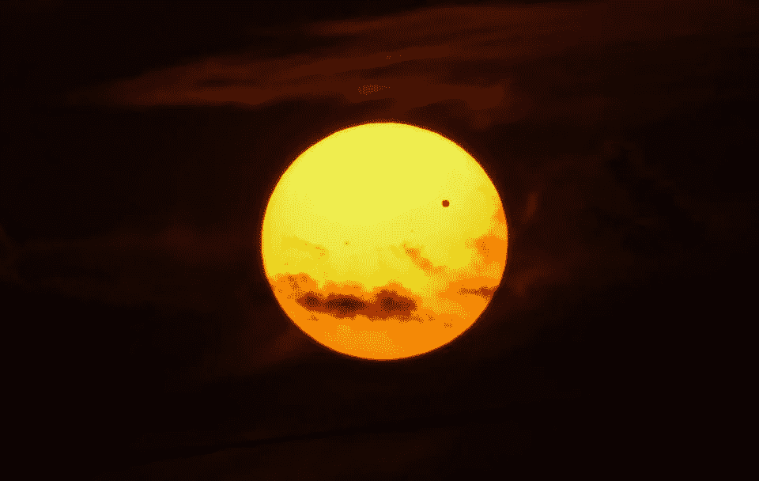
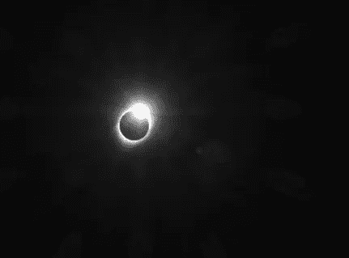

# 使用 Python 模拟外星行星的发现

> 原文：[`towardsdatascience.com/simulating-exoplanet-discoveries-with-python-a2d460a4889b?source=collection_archive---------6-----------------------#2023-12-18`](https://towardsdatascience.com/simulating-exoplanet-discoveries-with-python-a2d460a4889b?source=collection_archive---------6-----------------------#2023-12-18)

## 快速成功的数据科学

## 建模的强大力量！

 [Lee Vaughan](https://medium.com/@lee_vaughan?source=post_page-----a2d460a4889b--------------------------------)

·

[关注](https://medium.com/m/signin?actionUrl=https%3A%2F%2Fmedium.com%2F_%2Fsubscribe%2Fuser%2F5d604015c08b&operation=register&redirect=https%3A%2F%2Ftowardsdatascience.com%2Fsimulating-exoplanet-discoveries-with-python-a2d460a4889b&user=Lee+Vaughan&userId=5d604015c08b&source=post_page-5d604015c08b----a2d460a4889b---------------------post_header-----------) 发表在 [Towards Data Science](https://towardsdatascience.com/?source=post_page-----a2d460a4889b--------------------------------) ·15 分钟阅读·2023 年 12 月 18 日

--

2012 年 6 月金星过境太阳（Evan Clark via [Real-world Python](https://a.co/d/4GHvthg)）

在我飞往爱达荷州拍摄*2017 年美国大日食*之前，我做了充分的准备。*全食事件*，即月球完全遮住太阳的时刻，仅持续了 2 分钟 10 秒。那没有时间进行实验、测试或临时解决问题。

为了成功捕捉到半影、全影、太阳耀斑和钻石戒指效应的图像，我必须准确知道需要带什么设备、使用什么相机设置，以及这些事件的发生时间。在互联网的帮助下，我能够搞清楚这些并为我的位置准备了一个精确的时间表。

2017 年全日食期间的钻石戒指效应（作者提供）

类似地，*计算机模拟*帮助科学家为观察自然界做好准备。它们帮助他们理解预期的内容和时间，并且如何校准仪器和设计实验。

本文的目标是展示使用*系外行星过境事件*的*实际应用*。系外行星是指绕我们太阳系外的恒星运行的天体。
