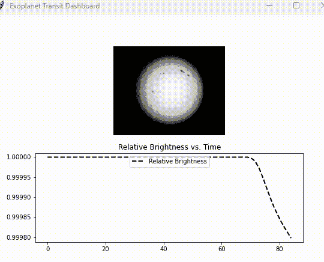

# 使用 Python 模拟系外行星发现

> 原文：[`towardsdatascience.com/simulating-exoplanet-discoveries-with-python-a2d460a4889b`](https://towardsdatascience.com/simulating-exoplanet-discoveries-with-python-a2d460a4889b)

## 快速成功数据科学

## 模型的强大威力！

[](https://medium.com/@lee_vaughan?source=post_page-----a2d460a4889b--------------------------------)[](https://towardsdatascience.com/?source=post_page-----a2d460a4889b--------------------------------) [Lee Vaughan](https://medium.com/@lee_vaughan?source=post_page-----a2d460a4889b--------------------------------)

·发表于 [Towards Data Science](https://towardsdatascience.com/?source=post_page-----a2d460a4889b--------------------------------) ·15 分钟阅读·2023 年 12 月 18 日

--


2012 年 6 月金星凌日（Evan Clark via [现实世界的 Python](https://a.co/d/4GHvthg)）

在我飞往爱达荷州拍摄*2017 年大美洲日全食*之前，我做了充足的准备。*全食事件*，即月球完全遮住太阳的时刻，仅持续了 2 分钟 10 秒。这没有时间进行实验、测试或现场解决问题。

为了成功捕捉到半影、全影、太阳耀斑和钻石环效应的影像，我必须准确了解需要带什么设备、使用什么相机设置以及这些事件何时发生。在互联网的帮助下，我能够理清这些细节并为我的位置准备了一个精确的时间表。


2017 年全日食中的钻石环效应（作者提供）

同样，*计算机模拟*也帮助科学家为观察自然世界做好准备。它们帮助科学家理解期望什么、何时期望以及如何校准仪器和设计实验。

本文的目标是展示使用*系外行星凌日事件*的*实际应用*。系外行星是指绕我们太阳系之外的恒星运行的天体。

天文学家们通过一种叫做*凌日光度测量*的技术发现了数千颗系外行星，该技术记录了当系外行星在恒星与地球之间经过时，恒星光线的微弱暗淡。我们可以使用凌日模拟器来理解行星大小以及太阳黑子、小行星带、卫星甚至外星巨构等因素的影响。

要构建模拟器，我们将使用 [OpenCV](https://opencv.org/)，这是 Python 处理图像和视频的首选开源库，以及 [Tkinter](https://en.wikipedia.org/wiki/Tkinter)，这是 Python 内置的图形用户界面（GUI）工具。我们将使用后者来制作仪表板。这里是一个预览：


运行中的系外行星过境仪表板（由作者提供）

# 过境光度测量

在天文学中，*过境*发生在一个相对较小的天体直接穿过一个较大天体的盘面和观察者之间。当小天体横穿大天体的表面时，大天体会稍微变暗。最著名的过境是水星和金星经过我们的太阳。

借助今天的技术，天文学家可以检测到远离的恒星在过境事件中的微弱暗淡。这种技术称为过境光度测量，它输出恒星亮度随时间变化的图表。


过境光度测量技术用于探测系外行星（来自 [Real-world Python](https://a.co/d/4GHvthg)）

在前面的图中，光曲线图上的蓝色点表示测量到的恒星发出的光。当一个行星没有位于恒星上方（图中的位置 1）时，测量到的亮度达到最大值。（我们将忽略行星在其相位过程中反射的光，这会略微增加恒星的表观亮度）。

当行星的前缘移动到盘面上（位置 2），发出的光逐渐变暗，形成光曲线中的一个斜坡。当整个行星在盘面上可见时（位置 3），光曲线变平，保持平坦，直到行星开始从盘面的远端离开。这会形成另一个斜坡（位置 4），直到行星完全离开盘面（位置 5）。此时，光曲线在其最大值处变平，因为恒星不再被遮挡。

因为过境期间阻挡的光量与行星圆盘的大小成正比，所以你可以使用以下公式计算行星的半径：


其中 *Rp* 是行星的半径，*Rs* 是恒星的半径。天文学家通过恒星的距离、亮度和颜色（与其温度相关）来确定恒星的半径。*深度* 指的是过境期间亮度的总变化，如下图所示。


“深度”是光曲线中观察到的亮度总变化（来自 [Real-world Python](https://a.co/d/4GHvthg)）

系外行星越大，光曲线的深度就越大。

当然，这些计算假设了*整个*系外行星，而不仅仅是*部分*，都经过了星体的表面。如果系外行星只是从我们的视角上擦过星体的顶部或底部，结果将是一个“未完成的”和“V 形的”光曲线，实用性有限。


部分过境（红箭头）产生了一个“V 形”的光曲线（作者提供）

> 通过测量光曲线观察系外行星不仅仅是专业天文学家的工作。根据 [*Sky & Telescope*](https://skyandtelescope.org/astronomy-news/how-amateurs-could-help-future-exoplanet-observations/) 杂志，即使是小型 6" 望远镜也可以记录有用的光曲线。NASA 甚至启动了一个 [公民科学家计划](https://science.nasa.gov/science-research/astrophysics/confirm-the-existence-of-newly-discovered-worlds-right-from-your-backyard-with-unite/)，让后院天文学家帮助专业人员寻找类木星大小的系外行星。

# 代码

以下 Python 程序使用 OpenCV 生成系外行星过境星体的可视化模拟，使用 Matplotlib 绘制结果光曲线，并在仪表板中同时显示这两者。

为了生成光曲线，我们需要能够测量亮度的变化。我们可以通过对像素进行数学操作来使用 OpenCV 实现这一点。

OpenCV 最好通过 pip 安装，因此如果你是 Anaconda 用户，你应该将其作为你添加到 conda 环境中的*最后*一个包。以下是安装命令：

`pip install opencv-python`

你还需要一张我们太阳的图像，你可以从这个 [GitHub 仓库](https://github.com/rlvaugh/Real_World_Python/blob/master/Chapter_8/limb_darkening.png)下载。只需点击链接，然后按图像右上角的下载图标即可。将其保存在与你的 Python 脚本相同的文件夹中。


点击红色圆圈中的图标从 [GitHub](https://github.com/rlvaugh/Real_World_Python/blob/master/Chapter_8/limb_darkening.png) 下载图像 ([NSO/AURA/NSF](https://nso.edu/about/image-use-policy/))

## 导入库和分配常量

以下代码导入了 tkinter，用于创建仪表板；matplotlib，用于绘制光曲线；matplotlib 的 `backend_tkagg` 模块和 `FigureCanvasTkAgg` 类，用于在 tkinter 和 matplotlib 之间集成；以及 OpenCV（`cv2`），用于显示星体图像和计算光曲线的相对亮度。

```py
import tkinter as tk
import matplotlib.pyplot as plt
from matplotlib.backends.backend_tkagg import FigureCanvasTkAgg
import cv2 as cv

IMG_HT, IMG_WIDTH = 400, 500
BLACK_IMG = cv.imread('limb_darkening.png', cv.IMREAD_GRAYSCALE)
EXO_RADIUS = 7
EXO_DX = 3
EXO_START_X = 40
EXO_START_Y = 230
NUM_FRAMES = 145
```

`BLACK_IMG` 变量包含了我们太阳的图像，将作为外星星体的替代图像。注意，我们将其加载为*灰度*图像，以便可以直接从像素中测量强度（亮度）。

> 使用图像可以捕捉到*光球*亮度的现实变化。光球是恒星发光和辐射热量的外层。由于光球的温度随着距离恒星中心的增加而降低，恒星光盘的边缘比中心部分更凉，因此看起来更暗。这种效应被称为 [*边缘变暗*](https://en.wikipedia.org/wiki/Limb_darkening)，它对光曲线有明显影响。

以 `EXO_` 开头的常量代表与外星行星相关的参数，包括其半径、速度（`DX`）和起始坐标（以像素为单位）。`NUM_FRAMES` 常量决定了模拟的运行时长。

## 定义一个创建仪表板的函数

我们的仪表板将包括图像和图表。OpenCV 处理图像，matplotlib 处理图表，Tkinter 将它们组合成一个单一的显示。Tkinter 使用一个名为 *canvas* 的小部件来实现这一点，该小部件提供了一个绘图区域，用于显示图像、绘制形状和创建交互元素。

```py
def create_dashboard(root):
    fig, (ax1, ax2) = plt.subplots(2, 1, figsize=(8, 6))
    canvas = FigureCanvasTkAgg(fig, master=root)
    canvas_widget = canvas.get_tk_widget()
    canvas_widget.pack(side=tk.TOP, fill=tk.BOTH, expand=1)

    intensity_samples = []
    exo_start_x = EXO_START_X

    for _ in range(NUM_FRAMES):
        temp_img = BLACK_IMG.copy()
        cv.circle(temp_img, (exo_start_x, EXO_START_Y), EXO_RADIUS, 0, -1)
        intensity = temp_img.mean()
        intensity_samples.append(intensity)
        relative_brightness = calc_rel_brightness(intensity_samples)

        update_image(ax1, temp_img)
        update_light_curve(ax2, relative_brightness, 'k')

        canvas.draw()
        root.update()
        root.after(3)

        exo_start_x += EXO_DX
```

代码开始时使用 matplotlib 创建两个垂直堆叠的子图。接着，我们使用 `FigureCanvasTkAgg` 类创建画布，将其嵌入 Tkinter 窗口中。我们将在此画布上显示我们的图形（`fig`）。作为 `backend_tkagg` 模块的一部分，`FigureCanvasTkAgg` 促进了 Matplotlib 图形在 Tkinter 应用程序中的正确渲染。

此类的 `master` 参数指定了将包含画布的 *主小部件*（或窗口）。在这种情况下，它是我们将在程序结束时创建的 Tkinter *根窗口*（`root`）（使用 `root = tk.Tk()`）。

接下来，我们创建一个空列表来保存强度（相对亮度）测量值，并将 x 轴起始点常量重新分配给一个新变量 `exo_start_x`。程序运行时，我们将通过 `EXO_DX` 常量增加该变量，以使外星行星向前移动。`EXO_DX` 的值越大，移动速度越快。

模拟是由 `NUM_FRAMES` 常量控制的 `for` 循环。为了避免降低输入图像的质量，我们在每次循环开始时将其复制到临时图像（`temp_img`）。接着，我们使用 `[cv.circle()](https://docs.opencv.org/4.x/d6/d6e/group__imgproc__draw.html#gaf10604b069374903dbd0f0488cb43670)` 方法绘制一个黑色圆圈，表示外星行星。

为了测量强度，我们取图像的平均值并将其附加到 `intensity_samples` 列表中。

接下来的几行代码绘制仪表板并通过调用接下来将定义的函数来更新其组件。`root.after(3)` 行在每次迭代后引入了 3 毫秒的短暂延迟。函数通过增加外星行星的 x 坐标来结束。

## 定义一个计算相对亮度的函数

接下来，我们定义一个辅助函数来计算从强度样本列表中的相对亮度。第一步是找到列表中的最大值。下一步返回一个新列表，其中每个强度项都被最大值除以，将结果归一化到 0 到 1 之间。

```py
def calc_rel_brightness(intensity_samples):
    max_brightness = max(intensity_samples)
    return [intensity / max_brightness for intensity in intensity_samples]
```

## 定义更新仪表板的函数

现在我们定义函数以在每次循环迭代中更新仪表板的两个组件。第一个更新灰度图像。第二个用更新后的`intensity_samples`列表重新绘制光曲线。

```py
def update_image(ax, img):
    ax.clear()
    ax.imshow(img, cmap='gray')
    ax.axis('off')

def update_light_curve(ax, data, color):
    ax.clear()
    ax.plot(data, 
            color=color, 
            linestyle='dashed', 
            linewidth=2, 
            label='Relative Brightness')
    ax.legend(loc='upper center')
    ax.set_title('Relative Brightness vs. Time')
```

## 运行模拟

最后部分的代码调用了 Tkinter 根窗口、创建仪表板的函数以及 Tkinter 的 `mainloop()` 函数。后者是运行模拟的 Tkinter *事件循环*。

```py
if __name__ == "__main__":
    root = tk.Tk()
    root.title("Exoplanet Transit Dashboard")
    create_dashboard(root)
    root.mainloop()
```

这是完成模拟的一个示例：


模拟结束时的仪表板（作者提供）

尽管系外行星过境对其恒星光曲线的影响看起来很戏剧性，但你看到的只是总亮度的最顶层部分。如果你用*y 值的完整范围*重新绘制曲线，行星的影响几乎无法察觉。


完整 y 轴绘制的光曲线（作者提供）

接下来，我们将处理*单次过境*，但在现实生活中，天文学家会尽可能捕捉*多个过境*。光曲线中包含大量信息，通过记录多个过境事件，天文学家可以确定系外行星的轨道参数，比如行星与恒星之间的距离。他们可以利用光曲线中的细微变化来推测行星完全覆盖恒星表面的时间。他们可以估计理论上的光边暗化量，并使用建模——如你在这里所做的——将所有信息结合起来，并将其假设与实际观察结果进行比较。

# 过境光度测量实验

现在我们有了一个工作中的模拟器，我们可以用它来建模可能的过境行为，以便将来更好地分析现实中的观察结果。一个方法是运行大量可能的情况，并生成一个“图谱”来预期系外行星的反应。研究人员可以使用这个图谱来帮助他们解释实际的光曲线。

## 星黑子

太阳黑子——在外星太阳上称为星黑子——是由于恒星磁场的变化而导致的表面温度降低的区域。星黑子可以使恒星的表面变暗，并对光曲线产生有趣的影响。

要查看示例，请编辑之前的脚本，使得一个与星黑子大小大致相同的系外行星在过境期间经过几个星黑子。根据以下指示更改常量：

`EXO_RADIUS = 4`

`EXO_START_Y = 205`

这是结果：


过境路径中的星黑子导致“崎岖不平”的光曲线（作者提供）

当系外行星遮挡（覆盖）一个星斑时，整体效果是让图像变亮，因为两个暗点变成了一个。这反过来会导致光曲线中短暂的“波动”。

## 小行星带

不对称的光曲线也可能由*小行星带*产生。这些碎片带通常源于行星碰撞或太阳系的形成，例如木星轨道上的[特洛伊小行星](https://www.nasa.gov/missions/nasas-lucy-in-the-sky-with-asteroids/)。


特洛伊小行星和木星（感谢[NASA](https://www.nasa.gov/image-article/lucy-mission-study-trojan-asteroids/)）

以下代码使用面向对象编程（OOP）创建随机小行星。如果你需要*可重复*的小行星对象，请确保`random.seed(15)`这一行未被注释。更改种子编号`(15)`将会改变小行星的大小及其分布。

```py
"""Simulate transit of asteroids and plot light curve."""
import random
import tkinter as tk
import matplotlib.pyplot as plt
from matplotlib.backends.backend_tkagg import FigureCanvasTkAgg
import cv2 as cv

IMG_HT, IMG_WIDTH = 400, 500
BLACK_IMG = cv.imread('limb_darkening.png', cv.IMREAD_GRAYSCALE)
NUM_ASTEROIDS = 15
NUM_LOOPS = 170

random.seed(15) # Uncomment to permit reproducible asteroids.

class Asteroid():
    """Draws a circle on an image that represents an asteroid."""    
    def __init__(self, number):
        self.radius = random.choice((1, 1, 1, 1, 1, 1, 1, 1, 1, 1, 2, 2, 2, 3))
        self.x = random.randint(-30, 60)
        self.y = random.randint(220, 230)
        self.dx = 3  

    def move_asteroid(self, image):
        """Draw and move an asteroid object."""
        cv.circle(image, (self.x, self.y), self.radius, 0, -1)
        self.x += self.dx

def create_dashboard(root):
    asteroid_list = []

    for i in range(NUM_ASTEROIDS):
        asteroid_list.append(Asteroid(i))

    fig, (ax1, ax2) = plt.subplots(2, 1, figsize=(8, 6))
    canvas = FigureCanvasTkAgg(fig, master=root)
    canvas_widget = canvas.get_tk_widget()
    canvas_widget.pack(side=tk.TOP, fill=tk.BOTH, expand=1)    
    intensity_samples = []

    for _ in range(NUM_LOOPS):
        temp_img = BLACK_IMG.copy()        
        for ast in asteroid_list:
            ast.move_asteroid(temp_img)
        intensity = temp_img.mean()
        intensity_samples.append(intensity)
        relative_brightness = calc_rel_brightness(intensity_samples)        
        update_image(ax1, temp_img)
        update_light_curve(ax2, relative_brightness, 'k')
        canvas.draw()
        root.update()

def calc_rel_brightness(intensity_samples):
    max_brightness = max(intensity_samples)
    return [intensity / max_brightness for intensity in intensity_samples]

def update_image(ax, img):
    ax.clear()
    ax.imshow(img, cmap='gray')
    ax.axis('off')

def update_light_curve(ax, data, color):
    ax.clear()
    ax.plot(data, color=color, linestyle='dashed', linewidth=2, 
            label='Relative Brightness')
    ax.legend(loc='upper center')
    ax.set_title('Relative Brightness vs. Time')

if __name__ == "__main__":
    root = tk.Tk()
    root.title("Exoplanet Transit Dashboard")
    create_dashboard(root)
    root.mainloop()
```

这是输出：



小行星带的模拟过境（作者提供）

过境小行星产生不规则且不对称的光曲线。内部的“台阶”代表小行星在星体表面上移动和离开的情况。

# 趣味模拟

现在，让我们对边缘情况和“尖锐”情况进行一些不寻常的实验。我们将进行这些实验而不显示太阳图像，以便可以完全专注于模拟的特征。为了简洁，我将提供每个模拟的代码链接，而不是直接包含代码。

## 模拟一个带有外卫星的系外行星

如果系外行星有一个卫星会发生什么？让我们来看看（你可以在这个[GitHub 仓库](https://github.com/rlvaugh/Real_World_Python/blob/master/Chapter_8/practice_planet_moon.py)中找到这次模拟的代码）：


一个具有卫星的系外行星（作者及埃里克·莫滕森博士提供）


具有卫星的系外行星的光曲线（作者及埃里克·莫滕森博士提供）

一个月球在与系外行星轨道相同平面上且与地球轨道平行的轨道上，每当它被系外行星掩蔽时都会在光曲线中产生一个小的波动。NASA 可能已经观察到这种现象。你可以在[这里](https://exoplanets.nasa.gov/news/1525/new-moon-astronomers-find-first-evidence-of-a-possible-moon-outside-our-solar-system/)观看该事件的视频。


开普勒-1625 的光曲线暗示了一个具有卫星的系外行星的存在（[NASA](https://exoplanets.nasa.gov/news/1525/new-moon-astronomers-find-first-evidence-of-a-possible-moon-outside-our-solar-system/)）

注意前一图中的开普勒-1625 光曲线与我们模拟的月球之间的相似性。得益于建模，开普勒-1625 的结果并不令人意外。

## 探测外星人巨构

在 2015 年，分析开普勒太空望远镜数据的公民科学家注意到，位于天鹅座的 Tabby 的星星有些异常。2013 年记录的这颗星星的光变曲线表现出亮度的非规则变化，这些变化远远超出了行星所能引起的范围。


由开普勒太空观测台测量的 Tabby 的星星光变曲线（作者来自[Wikipedia](https://en.wikipedia.org/wiki/Tabby%27s_Star)）

除了亮度的剧烈下降外，光变曲线还不对称，并包含一些在典型行星凌日中未见的奇怪波动。提出的解释包括：光变曲线是由星星吞噬行星、云团过境的解体彗星、大型环形行星后面跟随着小行星群，或者是外星人建造的巨大结构引起的。

科学家推测，这种规模的人工结构最可能代表了外星文明试图从其太阳中收集能量。科学文献和科幻小说都描述了这些令人惊叹的巨大太阳能板项目。例子包括戴森群、戴森球、环世界和 Pokrovsky 壳。


设计用来拦截恒星辐射的 Pokrovsky 壳层系统（[Wikimedia Commons](https://commons.wikimedia.org/wiki/File:Pokrovsky_shell.png)）

为了模拟一个巨大结构，我们将用其他简单几何形状替换程序中使用的圆形外行星。我们不需要*完全*匹配曲线；我们只需要捕捉到*关键特征*，如不对称性、2 月 28 日左右的“突起”以及（非常）大的亮度下降。

这是我使用两个巨大的但不对称的太阳能板的尝试：


为 Tabby 的星星模拟的巨大结构（作者提供）


为 Tabby 的星星模拟的巨大结构光变曲线（作者提供）

这个曲线与 Tabby 的星星的曲线非常相似。信不信由你，我第一次尝试就制作出了这个！你可以在[这里](https://github.com/rlvaugh/Real_World_Python/blob/master/Chapter_8/practice_tabbys_star.py)找到代码。

这很有趣，但我们现在知道，无论是什么在 Tabby 的星星周围，都允许*一些*光波长通过，因此它不可能是一个固体物体。基于这种行为及其吸收的波长，科学家们认为尘埃导致了这颗星星光变曲线的奇怪形状。然而，其他星星，如天秤座中的 HD 139139，具有奇异的光变曲线，仍然没有解释。

## 侦测外星舰队

既然我们已经很开心了，就不要拘谨。

系外行星 BR549 的超进化海狸们忙得不可开交。他们聚集了一支巨大的殖民船队，这些船只现在已经装载完毕，准备离开轨道。由于他们自己对系外行星的检测，他们决定放弃被啃噬的故乡，前往地球的郁郁葱葱的森林！

我们能否通过光变曲线检测到这支舰队？让我们找出答案。你可以在[这里](https://github.com/rlvaugh/Real_World_Python/blob/master/Chapter_8/practice_alien_armada.py)找到这个模拟的代码。


外星舰队穿越外星恒星（作者）


外星舰队模拟的光变曲线（作者）

环绕的宇宙飞船产生了不对称且不规则的光变曲线。根据 Tabby 星的例子，这肯定会引起兴趣，但我敢打赌没有天文学家（也许只有[Avi Loeb](https://medium.com/@avi-loeb/about)）会有勇气提出其真实来源！无论如何，你不应该在进行详尽的模拟，包括小行星、多颗系外行星、彗星群、尘埃云和其他自然现象后得出这个结论。

# 摘要

希望你喜欢这个小项目，并对计算机模拟有了更深的了解。作为科学研究的多功能和强大工具，它们可以帮助科学家和工程师理解复杂现象并设计高效的实验。它们的优势包括：

+   模拟复杂系统的能力，这些系统可能很难或不可能直接研究。这包括避免与实地研究相关的安全隐患。

+   设计高效且成本效益高的实验，这些实验在现实世界中是无法实现的。正如我们无需观测站即可模拟系外行星的掠过，模拟可以消除对昂贵设备和资源的需求，并缩短完成研究的时间。

+   使用灵敏度分析预测和解决参数变化的影响。这有助于识别关键因素并消除昂贵的试错需求。

+   发现*涌现现象*，这些现象可能在现实世界观察中不立即显现。这可能会导致在运行模拟之前未曾梦想到的其他发现。

+   设计和优化最有效或最高效的解决方案。

+   为教室里的学生或会议室里的管理者生成引人入胜的教育工具。如果一张图片价值千言万语，那么一个好的模拟就值百万。

+   对*预测建模*的贡献，使研究人员能够预测未来趋势、行为或事件。这在经济学、气候学和流行病学等领域尤为重要。

虽然模拟不能完全替代现实世界的实验，但它们在成本、时间、安全性以及探索和理解复杂系统的能力上提供了诸多优势。

# 谢谢

感谢阅读，请关注我以获取更多*快速成功的数据科学*项目。有关发现外行星的更多内容，请查看我的书第八章，[*现实世界中的 Python*](https://a.co/d/4GHvthg)。

[](https://a.co/d/4GHvthg?source=post_page-----a2d460a4889b--------------------------------) [## 现实世界中的 Python：黑客解决问题的指南

### 现实世界中的 Python：黑客解决问题的指南 [Vaughan, Lee] 在 Amazon.com 上。*免费*送货。

a.co](https://a.co/d/4GHvthg?source=post_page-----a2d460a4889b--------------------------------)
