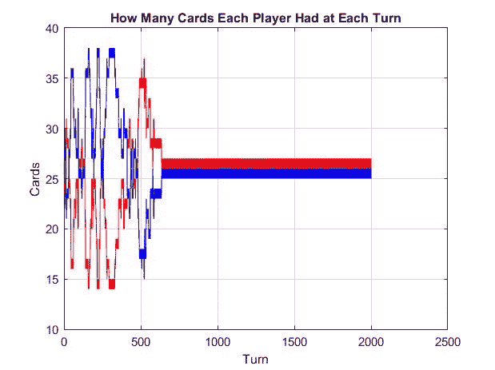
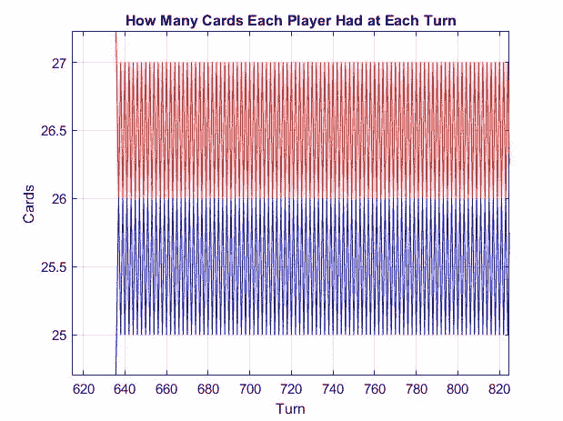
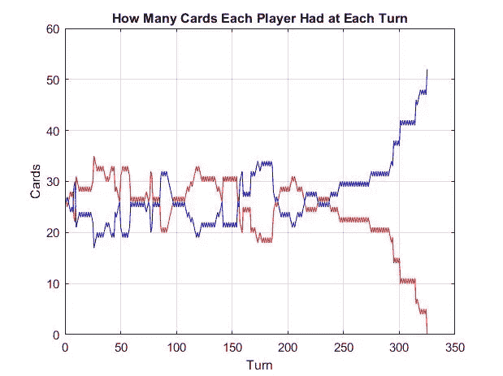
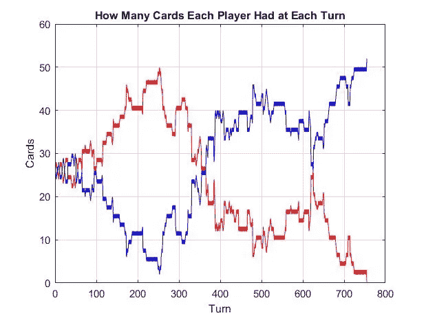
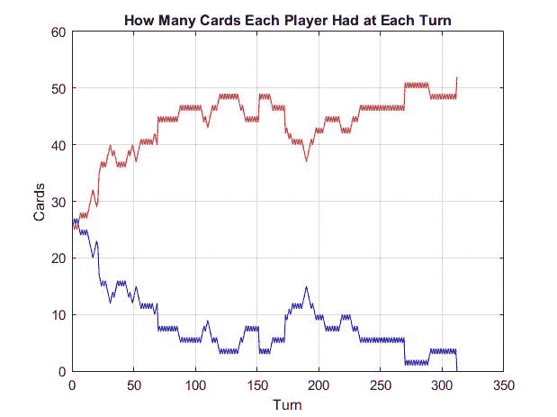
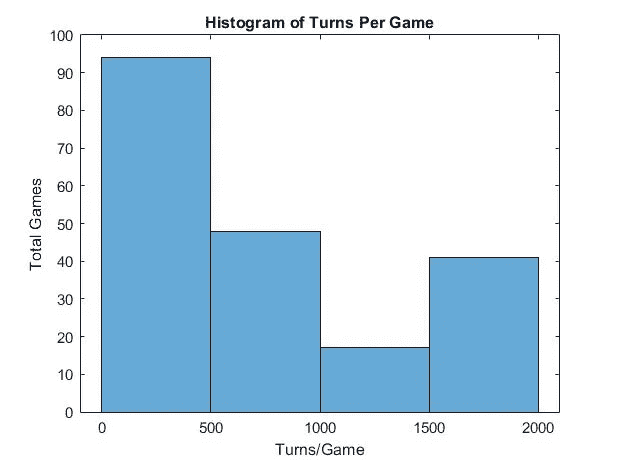
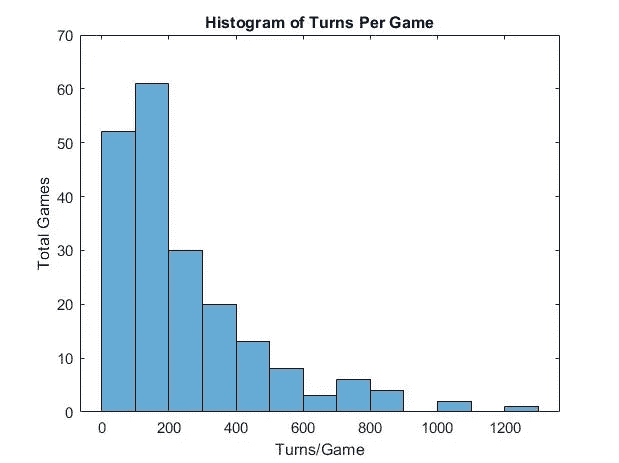

# 模拟扑克牌游戏‘战争’

> 原文：[`towardsdatascience.com/simulating-the-card-game-war-ebafb4462a6a`](https://towardsdatascience.com/simulating-the-card-game-war-ebafb4462a6a)

## 一个关于具有无限变化的简单游戏的编程故事

[](https://medium.com/@Jake_Mitchell?source=post_page-----ebafb4462a6a--------------------------------)[](https://towardsdatascience.com/?source=post_page-----ebafb4462a6a--------------------------------) [Jake Mitchell](https://medium.com/@Jake_Mitchell?source=post_page-----ebafb4462a6a--------------------------------)

·发表于 [Towards Data Science](https://towardsdatascience.com/?source=post_page-----ebafb4462a6a--------------------------------) ·阅读时间 6 分钟·2023 年 1 月 24 日

--

我模拟了很多游戏——需要技巧、欺骗或策略的游戏。

**这不是其中之一。**


图片由 [Ivan Slade](https://unsplash.com/@flowinteractive?utm_source=medium&utm_medium=referral) 提供，来源于 [Unsplash](https://unsplash.com/?utm_source=medium&utm_medium=referral)

## 引言：

‘战争’游戏非常简单。两个玩家分别抽取一副标准 52 张扑克牌的一半。然后两人对峙，翻开他们的顶牌。谁的牌面值高，谁就拿走这两张牌。如果牌面值相同，玩家需要冒险出自己牌堆中的接下来的 3 张牌，并用第 4 张牌进行对战。谁打出的第 4 张牌最大，谁就赢得所有牌（包括自己出的 3 张牌和对手出的 3 张牌）。当一位玩家没有任何牌时，游戏结束。

获胜没有秘密。你只能希望你的牌面值比对手的牌高。**你完全依赖运气。**

当我开始编写这个游戏的代码时，我对卡片的初始值是否能在游戏开始之前预测赢家感兴趣。令我没有预料到的是，在适当的情况下，这个游戏实际上可以*永远*进行下去。

## **游戏编程：**

我首先对一副扑克牌进行‘洗牌’：

```py
deal = randperm(52,52);
  for i = 1:13
    for j = 1:52
      if deal(j) > (i - 1)*4 && deal(j) <= (i - 1)*4 + 4
        deal(j) = i;
      end
    end
  end
```

这段代码创建了一个包含 1 到 52 的 52 空间数组，数字随机排列。然后，循环会将 1 到 13 的值分配给 4 张卡，其中 1 代表 A，13 代表 K。剩下的就是相当于洗过牌的扑克牌。

然后我决定每个对手的下一张卡是否不相等。如果是，代码就非常简单：

```py
if next_up(1,1) ~= next_up(1,2)
  [best,index] = max(next_up(1,:));
  player_cards(index,size(player_cards,2) + 1:size(player_cards,2) + 2) = next_up(1,:);
  player_cards(1,next_up(2,1)) = 0;
  player_cards(2,next_up(2,2)) = 0;
end
```

这确定了哪张牌更高，前提是两张牌不相等，并将这两张牌给予赢家，同时从输家那里拿走那张牌。

如果打出的卡牌相同，那么玩家必须进入战争。这段代码与之前展示的代码相同，不同之处在于从每个玩家处额外添加了 3 张卡牌到共享堆中。

这些步骤会重复进行，直到决定出胜者…… *或者我以为如此*。

## 结果：

当一个模拟无法结束时，结果很难得出。然后我查看了每个玩家的牌组。

**玩家们已经进入了一个完美平衡的“战争”游戏。**

然后我绘制了每回合每手牌的数量，以可视化发生了什么：



作者提供的图像。

这是一个显示每回合游戏状态的图表。由于游戏的零和性质，它在 26 张卡牌线处完美对称。这张图显示在这个无限游戏中（我在 2000 回合时停止了它以生成这张图片），**玩家们不小心发现了一种导致卡牌流动完美平衡的模式。**

红方拿到的每张卡牌，蓝方在下一回合会拿回。如此反复——永远。我放大了之前的图表来说明这一点：



作者提供的图像。

不过这并不是每个游戏都会发生的情况。很多游戏的进展完全正常。我积累了更多这些图表，以展示“战争”游戏可以产生的不同卡牌流动。



作者提供的图像。

视觉化这些游戏的样子是非常迷人的。一方面（左侧），你会看到一个包含许多不同枢纽点的游戏。玩家来回交换领先位置，直到有一个无法继续竞争。而在另一端（右侧），你会看到一个从一开始就严重偏向某个玩家的游戏。蓝方可能依靠几张高价值的卡牌勉强维持，但最终还是运气耗尽了。

我仍然对找出有多少比例的游戏会跃入无限感兴趣。我模拟了数百次“战争”游戏，并跟踪了达到 2000 回合的游戏数量（这是我对无限的定义，因为如果我真的让它无限运行下去，我将无法完成模拟）。**我发现 16.67%的游戏结果是无限游戏。**

我还发现**平均非无限游戏持续 513 回合。** 根据下面的直方图，大多数游戏持续不到 500 步。虽然这看起来很多，但平均每步可能持续 2-3 秒，意味着平均游戏时间是 15-20 分钟。

当我们考虑到 16.67%的游戏会进入无限回合时，**我们可以理论上说平均每游戏回合数……是无限——** 但这个想法让我脑袋有点疼。



作者提供的图像。

到这个时候，我发现也许我对规则的理解导致了这个无限游戏。我编写代码使得当一个玩家获胜时，他们将那些卡片放回到手牌的底部——没有洗牌。

我模拟了相同的代码，这次加入了一个洗牌块，生成的结果与我玩游戏的经验更为一致。

我发现**没有一个模拟游戏达到无限。** 我还发现**每局游戏的平均回合数缩短到了大约 250 回合**——是未洗牌版本的一半。



图片由作者提供。

直方图本身说明了一切。很少有游戏接近无限，许多游戏只持续了 5 到 10 分钟。

只需简单地洗牌就可以产生足够的变化，防止游戏持续无限时间，这完全是合理的。对于不感兴趣于实验卡片总平衡性的普通玩家来说，洗牌你的胜利卡片就足以使游戏时间保持在合理范围内。

## 结论：

“战争”游戏在未洗牌的版本中，有很大的可能性会持续无限时间。每 6 场游戏中可能有 1 场是无限的。如果你的目标是找到卡片之间的完美平衡，那么我建议你玩这个版本。

我很少有项目的结果超出我的预期。在[Catan](https://medium.com/codex/the-best-and-worst-catan-board-setups-989df4ba550a)中，我一般知道什么是好的设置，只是在优化它。在[Monopoly](https://medium.com/towards-data-science/a-data-driven-tactics-simulation-for-monopoly-864e7cffe508)中，我期望找到投资回报最好的物业是理想的。在这个项目中，我盲目地进行实验——发现我最简单的项目产生了最有趣的结果。

感谢你花时间阅读我的文章！如果你读到这里，为什么不继续阅读有关棋盘游戏中的数据科学呢？看看我其他的一些项目：

+   [模拟纸牌游戏‘BS’](https://medium.com/codex/simulating-the-card-game-bs-to-find-the-optimal-setup-82541bacf628)

+   [模拟曼卡拉](https://medium.com/towards-data-science/simulating-mancala-what-happens-when-i-push-this-game-to-its-limits-28d9c0a58616)

+   [将机器学习应用于井字棋](https://medium.com/towards-data-science/applying-machine-learning-to-tic-tac-toe-47d954671c73)

+   [滑梯与梯子](https://medium.com/towards-data-science/the-surprisingly-interesting-mathematics-within-chutes-and-ladders-40f931c18489)

+   [教机器玩四子棋](https://medium.com/towards-data-science/i-taught-a-machine-how-to-play-connect-4-df261da4e23f)
