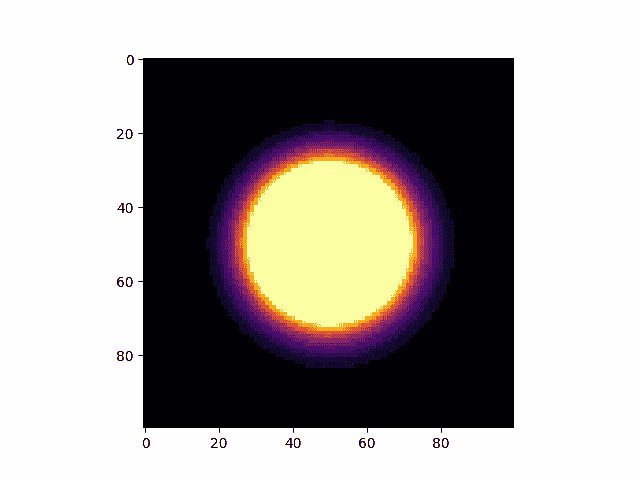
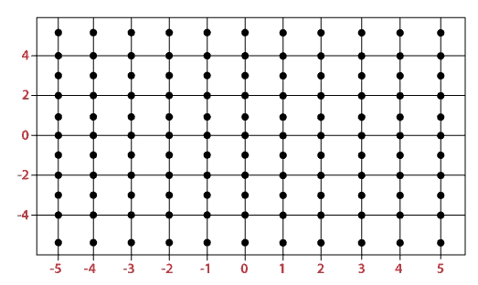
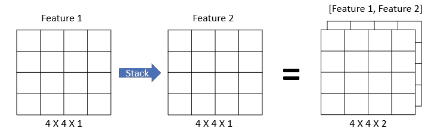
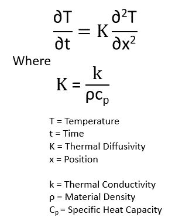
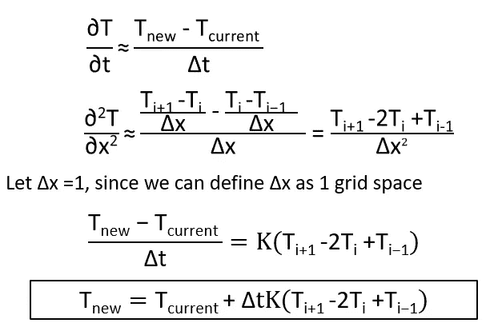
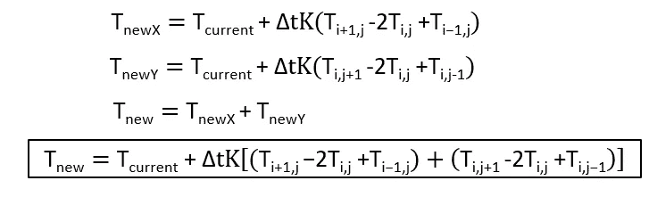
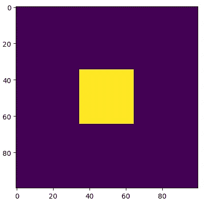
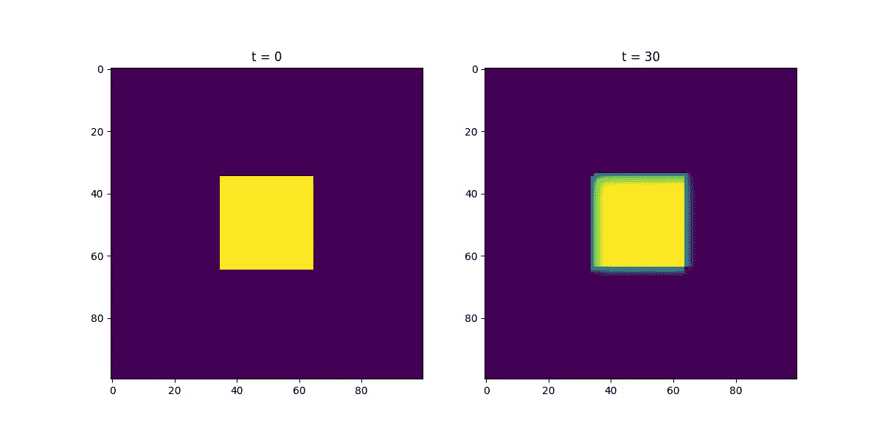
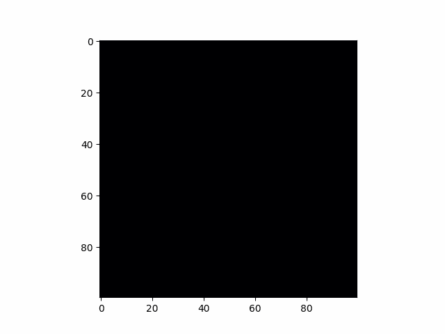

# 模拟 101：导热传输

> 原文：[`towardsdatascience.com/simulation-101-conductive-heat-transfer-a4f09b3e16b4`](https://towardsdatascience.com/simulation-101-conductive-heat-transfer-a4f09b3e16b4)

## 计算物理的温馨介绍

[](https://medium.com/@ln8378?source=post_page-----a4f09b3e16b4--------------------------------)[](https://towardsdatascience.com/?source=post_page-----a4f09b3e16b4--------------------------------) [Le Nguyen](https://medium.com/@ln8378?source=post_page-----a4f09b3e16b4--------------------------------)

·发表于[Towards Data Science](https://towardsdatascience.com/?source=post_page-----a4f09b3e16b4--------------------------------) ·11 分钟阅读·2023 年 7 月 25 日

--

传导或物体之间的热传递是我们每天都会经历的现象。将锅放在炉子上或坐在热公园长椅上让我们对导热传递有直观的感觉，但在这里我们将正式化这一过程并建立一个基本的计算框架来模拟它。传导是解决的第一个模拟问题，因为它使用了许多计算物理问题中的基本工具。



在本文中，我们将：

+   创建网格网格以表示材料

+   学习基本的热传递方程及其计算等效物

+   基于基础物理更新网格网格中的值

+   模拟导热传输

# 创建网格网格

网格网格是用于离散化连续空间的计算工具。也就是说，我们无法在问题的所有时间和空间上进行计算，因此我们选择一个代表性子集的点，通常间隔规则地查看。

在下图 1 中，我们可以看到一个网格网格的示例。这里一个空间被细分为均匀间隔的单元，这在物理模拟中是常见做法。我们现在可以只处理网格点，这使得问题更具可行性。



图 1：[网格网格示例](https://www.javatpoint.com/numpy-meshgrid)。在模拟中，我们将空间划分成这样的网格，并在每个虚线网格点计算值。

上面的网格是使用 Python 的 [numpy meshgrid](https://numpy.org/doc/stable/reference/generated/numpy.meshgrid.html) 函数创建的，该函数可以接受一组一维数组并为我们创建一个网格。对于我们的模拟，我们希望建模一个二维表面，因此我们将生成 2 个数组，填充我们想要的起始值，长度为我们希望在其上评估模拟的间隔数。请参见下面的代码片段，我们创建了一个 100x100 的零网格作为模拟的基础。

```py
import numpy as np

#Define how many intervals we want per axis
resolution = 100

#Create x and Y arrays of zeros of length 100
x = np.zeros(resolution)
y = np.zeros(resolution)

#Create a mesh grid from above arrays. Outputs are all x and Y values in grid
gridX, gridY = np.meshgrid(x,y)
```

在讨论网格之前，需要注意的是，我们的网格上的每个点通常不是单一值。通常在每个网格点上，我们希望有一个值的数组来表示我们将要处理的属性。在我们的热传导模拟中，我们需要知道每个网格点的材料属性以及温度。因此，网格上的所有点将是一个包含如温度、材料密度、材料导热性以及我们需要了解的其他信息的数组。

制作网格的简单方法是创建多个在每个点上包含单一值的网格，然后将它们叠加在一起，如图 2 所示。



图 2: 叠加 2 个网格以创建一个新的网格，其中每个点包含多个值。

Numpy 在这里再次发挥作用，通过 [dstack 函数](https://numpy.org/doc/stable/reference/generated/numpy.dstack.html)可以按元素叠加两个数组。下面的代码片段将创建 2 个网格并将它们叠加在一起。

```py
import numpy as np

#Define how many intervals we want per axis
resolution = 100

#Create x and Y arrays of zeros of length 100
x1 = np.zeros(resolution)
y1 = np.zeros(resolution)

x2 = np.full(resolution, 1)
y2 = np.full(resolution, 1)

#Create a mesh grids from above arrays. Outputs are all x and Y values in grid
gridX, gridY = np.meshgrid(x1,y1)
gridX2, gridY2 = np.meshgrid(x2,y2)

#Stack both of the mesh grids we have created so every element is [0,1]
fullGridX = np.dstack([gridX,gridX2])
fullGridY = np.dstack([gridY,gridY2])
```

有了创建我们自己的网格以表示模拟环境的工具后，我们可以继续研究物理学。

# 热传导基础

我们将首先从一维时间相关热传导方程开始。



方程 1: [一维时间相关热传导方程](http://geodynamics.usc.edu/~becker/teaching/557/problem_sets/problem_set_fd_explicit.pdf)。

该方程表明温度随时间变化的原因是材料的热属性与材料内的温度变化的比例（严格来说是温度的二阶导数）。我们不需要担心材料的热属性，因为它们可以在 [查找表](https://www.engineersedge.com/heat_transfer/thermal_diffusivity_table_13953.htm) 中找到。我们需要做的是将方程中的导数转换为我们可以计算的形式。幸运的是，这可以通过 [有限差分法](https://en.wikipedia.org/wiki/Finite_difference_method) 完成，将方程 1 转换为下面的方程 2。



方程 2: 计算[一维时间依赖热传导方程](http://geodynamics.usc.edu/~becker/teaching/557/problem_sets/problem_set_fd_explicit.pdf)。

方程 2 是时间依赖热传导方程的计算等效形式，我们可以用它来更新模拟中的温度。遍历网格图中的每个单元，我们可以通过该单元的当前温度加上该单元与其邻近单元之间的温差（这里 i 代表网格索引），乘以材料的热属性和我们选择的时间步长来更新该单元的温度。

方程 1 和 2 是一维热方程，但我们希望在二维中运行我们的模拟。添加第二维是直接的，特别是当我们有热方程的计算版本时，我们只需将所有邻近单元添加到方程 3 中。



方程 3: [计算二维时间依赖热传导方程](https://resources.system-analysis.cadence.com/blog/msa2022-using-the-2d-finite-difference-method-for-heat-transfer-analysis)。

现在我们已经将时间依赖热传导方程转换为计算表达式，我们可以用它来更新我们的网格图。

# 更新我们的网格图

首先，我们使用迄今为止开发的工具初始化一个网格图。我们知道我们需要至少 2 个特征来插入我们的温度方程，即当前温度和我们选择的材料的热扩散常数。我们将从室温（20°C）开始，材料为铜，其热扩散率为 1.11x10^-2 cm²/s。我们用这些值填充 2 个网格图并将它们叠加以形成我们的整体网格。

```py
import numpy as np

#Define how many intervals we want per axis
resolution = 100
startingTemperature = 20
thermalDiffusivity = 1.11*10**-2

#Create x and Y arrays of zeros of length 100
x1 = np.full(resolution, 20)
y1 = np.full(resolution, 20)

x2 = np.full(resolution, 1.11*10**-2)
y2 = np.full(resolution, 1.11*10**-2)

#Create a mesh grids from above arrays. Outputs are all x and Y values in grid
gridX, gridY = np.meshgrid(x1,y1)
gridX2, gridY2 = np.meshgrid(x2,y2)

#Stack both of the mesh grids we have created so every element is
#[20,1.11*10**-2]
fullGridX = np.dstack([gridX,gridX2])
fullGridY = np.dstack([gridY,gridY2])
```

在我们的具体情况下，我们的网格图是对称的（x 和 y 方向上的特征值相同），所以单独定义 x 和 y 网格不是必要的，但这仍然是一个好习惯，因为在模拟时我们不会总是有这样的对称性。现在我们已经用网格图表示了材料，我们需要给它添加热量（正如我们在物理方程中看到的，热量传递必须有温差）。为了给材料添加热量，我们需要选择网格图中要加热的单元，并增加它们的温度索引。我们将继续保持简单，假设在 X 和 Y 方向的 35–65 索引范围内添加 1000°C 的热量。下面可以看到执行此操作的代码和结果图。

```py
import matplotlib.pyplot as plt

#fullGridX[:,:,0] gets the first index of every element in our mesh grid
#fullGridX[:,:,0][35:65,35:65] selects a box of values
fullGridX[:,:,0][35:65,35:65] += 1000

plt.imshow(fullGridX[:,:,0])
```



图 3: 我们的网格图上增加热量的可视化。

我们在网格中添加了一片热区，这只是一个好的开始，但现在我们需要随着时间推移来演变我们的系统，以观察热量的传递。我们还需要开发几个工具来完成这项工作。第一个工具是查找邻居温度的函数，该函数可以获取所有邻近单元格的温度。下面给出的函数循环遍历了给定单元格的所有 8 个边界单元格，但忽略了角落，仅检索上、下、左、右的单元格。我们在查看一个单元格的所有邻居时，还需要考虑**边界条件**，即当我们到达网格的边缘时我们想要做什么。如果我们处于已经在网格边缘的网格单元格中，寻找所有邻居将抛出一个错误，因为它们并不都存在。我们可以在循环中使用 try except 语句来处理这一点，当我们尝试查找不存在的单元格时，它将给出我们的边界条件。我们的边界条件可以填充我们想要假设在网格外部的温度。在我们的模拟中，我们将假设这是室温，因此当我们计算网格边缘的热传递时，室温将始终作为邻近值提供给边缘单元格。

```py
def getNeighborsTemperature(grid, point, boundaryTemp):
    #List to collect all neighboring temperatures
    neighbors = []
    #Loop over all neighboring cells
    for i in range(-1,2):
        for j in range(-1,2):
            try:
                #Ignore corner cells
                if abs(i) != abs(j):
                    neighbors.append(grid[point[0] + i][point[1]+ j])
            except:
                #Apply boundary condition
                neighbors.append(boundaryTemp)

    return neighbors
```

接下来我们需要开发的函数将实现上一节中找到的二维时间相关热传导方程。我们已经解决了这个方程的计算等效，因此实现是直接的，下面给出。该函数通过获取给定单元格的温度、周围单元格的温度、我们选择的时间步长以及单元材料的热扩散率来完成热传导方程。

```py
def calculateHeat(cellTemp, neighborTemps, timeStep, thermalDiffusivity):
    #Converting equation 3 into code
    cellTemp = cellTemp + timeStep*thermalDiffusivity*((neighborTemps[0] -2*cellTemp + neighborTemps[-1]) + 
                                                       (neighborTemps[1] -2*cellTemp + neighborTemps[-2]))
    return cellTemp
```

我们需要的最后一个函数将结合之前的两个函数，循环遍历网格中的每个单元格，并更新其温度。对于网格中的每个单元格，我们首先运行“getNeighbors”来获取所有邻近的温度，然后将邻近的温度加上当前单元格的温度以及其他参数传递给更新单元格的温度。

```py
def heatTransfer(grid, timeStep, boundaryTemp):
    #Loop over all grid cells 
    for i in range(0,len(grid)):
        for j in range(0,len(grid)):
            #Get neighboring cell temperatures
            neighbors = getNeighborsTemperature(grid[:,:,0], (i,j), boundaryTemp)
            #Update current cell temperature
            grid[:,:,0][i][j] = calculateHeat(grid[:,:,0][i][j], neighbors, timeStep, grid[:,:,1][i][j])

    return grid
```

最后，我们可以使用我们的热传递方程来更新原始网格。最终的代码片段将用 30 秒的时间步长更新我们的网格，并比较前后的结果。

```py
#Applying our heat transfer equation on current grid with a 30 secound time step
nextGrid = heatTransfer(fullGridX.copy(),30, 20)

#Matplotlib subplots to show the original and updated mesh grid
plt.figure(figsize = (12,6))

plt.subplot(1,2,1)
plt.imshow(fullGridX[:,:,0])
plt.title("t = 0")

plt.subplot(1,2,2)
plt.imshow(nextGrid[:,:,0])
plt.title("t = 30")
```



图 4：用 30 秒的时间步长更新我们的网格热传递。

我们现在拥有了进行导热传递模拟所需的所有工具，接下来我们将在下一节中运行几个模拟。

# 模拟

创建完所有模拟工具后，我们只需将热传递方程放入循环中，并根据我们想要的时间步长来演变系统。给出的代码以及一个将我们的模拟可视化为 gif 的函数。

```py
import imageio
"""
This make gif function takes in a set of images and turns them into a gif!
Give the frames as an array of mesh grids (only the temperature)and a name 
for the gif as well as the temperature bounds for the heat map.
"""
def makeGif(frames,name,minTemp,maxTemp):
    !mkdir frames

    counter=0
    images = []
    for i in range(0,len(frames)):
        plt.figure()
        plt.imshow(frames[i], cmap = "inferno", vmin = minTemp, vmax = maxTemp)
        plt.savefig("frames/" + str(counter)+ ".png")
        images.append(imageio.imread("frames/" + str(counter)+ ".png"))
        counter += 1
        plt.close()

    imageio.mimsave(name, images)

    !rm -r frames
```

```py
#RUNNING SIMULATION
#Keep track of our mesh grid frames to make into gif
frames = [fullGridX[:,:,0].copy()]

timeStep = 30
boundaryTemp = 20

#Run for 500 time steps
for t in range(0,500):
    fullGridX = heatTransfer(fullGridX.copy(),timeStep,boundaryTemp)
    frames.append(fullGridX[:,:,0].copy())

makeGif(frames,"simulation.gif",20,500)
```


图 5：我们的导热传递模拟的 gif

就这样。我们已经运行了导热传递的模拟并进行了可视化（使用酷炫的“火焰”色彩图）。凭借我们开发的一套通用工具，我们可以运行许多不同的模拟，包括不同的时间步长、起始温度、材料和几何形状。下一节也是最后一节将展示使用我们的工具制作的几个更多场景。

# 示例场景

## 焊接

以下是黄铜和钢板焊接的模拟。值得注意的是，黄铜（左侧）的热导率约为钢材（右侧）的 3 倍，我们可以看到热量散失过程中材料属性的差异。

注意，我们还可以通过在模拟循环内向网格温度层中添加热量来迭代地增加热量。



图 6: 黄铜与钢材焊接的模拟。

## 布鲁纳

在这里，通过向网格中添加一个圆形热斑来模拟炉灶顶部的加热。热量逐渐添加（每秒 3°C），直到炉灶关闭并允许其冷却。


图 7: 模拟炉灶顶部加热并关闭的过程。

# 完整代码

```py
import numpy as np
import matplotlib.pyplot as plt
import imageio

def getNeighborsTemperature(grid, point, boundaryTemp):
    neighbors = []
    for i in range(-1,2):
        for j in range(-1,2):
            try:
                if abs(i) != abs(j):
                    neighbors.append(grid[point[0] + i][point[1]+ j])
            except:
                neighbors.append(boundaryTemp)

    return neighbors

def calculateHeat(cellTemp, neighborTemps, timeStep, thermalDiffusivity):
    cellTemp = cellTemp + timeStep*thermalDiffusivity*((neighborTemps[0] -2*cellTemp + neighborTemps[-1]) + 
                                                       (neighborTemps[1] -2*cellTemp + neighborTemps[-2]))
    return cellTemp

def heatTransfer(grid, timeStep, boundaryTemp):

    for i in range(0,len(grid)):
        for j in range(0,len(grid)):
            neighbors = getNeighborsTemperature(grid[:,:,0], (i,j), boundaryTemp)
            grid[:,:,0][i][j] = calculateHeat(grid[:,:,0][i][j], neighbors, timeStep, grid[:,:,1][i][j])

    return grid

def makeGif(frames,name,minTemp,maxTemp):
    !mkdir frames

    counter=0
    images = []
    for i in range(0,len(frames)):
        plt.figure()
        plt.imshow(frames[i], cmap = "inferno", vmin = minTemp, vmax = maxTemp)
        plt.savefig("frames/" + str(counter)+ ".png")
        images.append(imageio.imread("frames/" + str(counter)+ ".png"))
        counter += 1
        plt.close()

    imageio.mimsave(name, images)

    !rm -r frames

#Make mesh grid
resolution = 100
startingTemperature = 20
thermalDiffusivity = 1.11*10**-2

x1 = np.full(resolution, 20)
y1 = np.full(resolution, 20)

x2 = np.full(resolution, 1.11*10**-2)
y2 = np.full(resolution, 1.11*10**-2)

gridX, gridY = np.meshgrid(x1,y1)
gridX2, gridY2 = np.meshgrid(x2,y2)

fullGridX = np.dstack([gridX,gridX2])
fullGridY = np.dstack([gridY,gridY2])

#Add heat
fullGridX[:,:,0][35:65,35:65] += 1000

#Run simulation
frames = [fullGridX[:,:,0].copy()]

timeStep = 30
boundaryTemp = 20

for t in range(0,500):
    fullGridX = heatTransfer(fullGridX.copy(),timeStep,boundaryTemp)
    frames.append(fullGridX[:,:,0].copy())

#Make Gif, saves as "simulation.gif"
makeGif(frames,"simulation.gif",20,500)
```

# 参考文献

[1] 有限差分示例：1D 显式热方程 [`geodynamics.usc.edu/~becker/teaching/557/problem_sets/problem_set_fd_explicit.pdf`](http://geodynamics.usc.edu/~becker/teaching/557/problem_sets/problem_set_fd_explicit.pdf)

[2] 使用 2D 有限差分法进行热传递分析 [`resources.system-analysis.cadence.com/blog/msa2022-using-the-2d-finite-difference-method-for-heat-transfer-analysis`](https://resources.system-analysis.cadence.com/blog/msa2022-using-the-2d-finite-difference-method-for-heat-transfer-analysis)

[3] 热传导方程 [`cecs.wright.edu/~sthomas/htchapter02.pdf`](https://cecs.wright.edu/~sthomas/htchapter02.pdf)

[4] 除非另有引用，本文中的所有图形均由作者创建。
