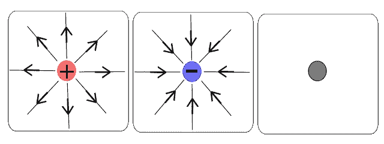
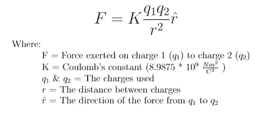
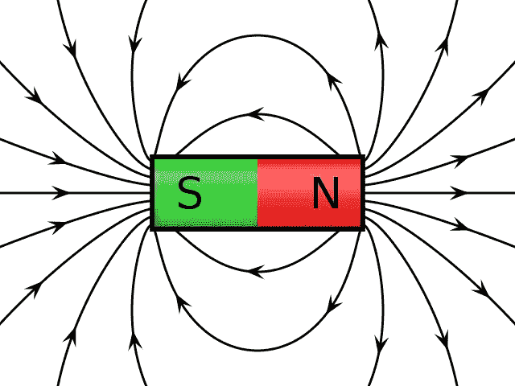
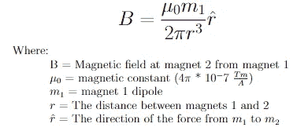
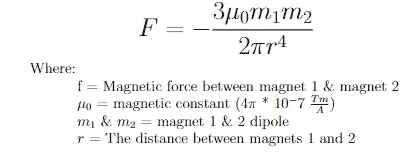
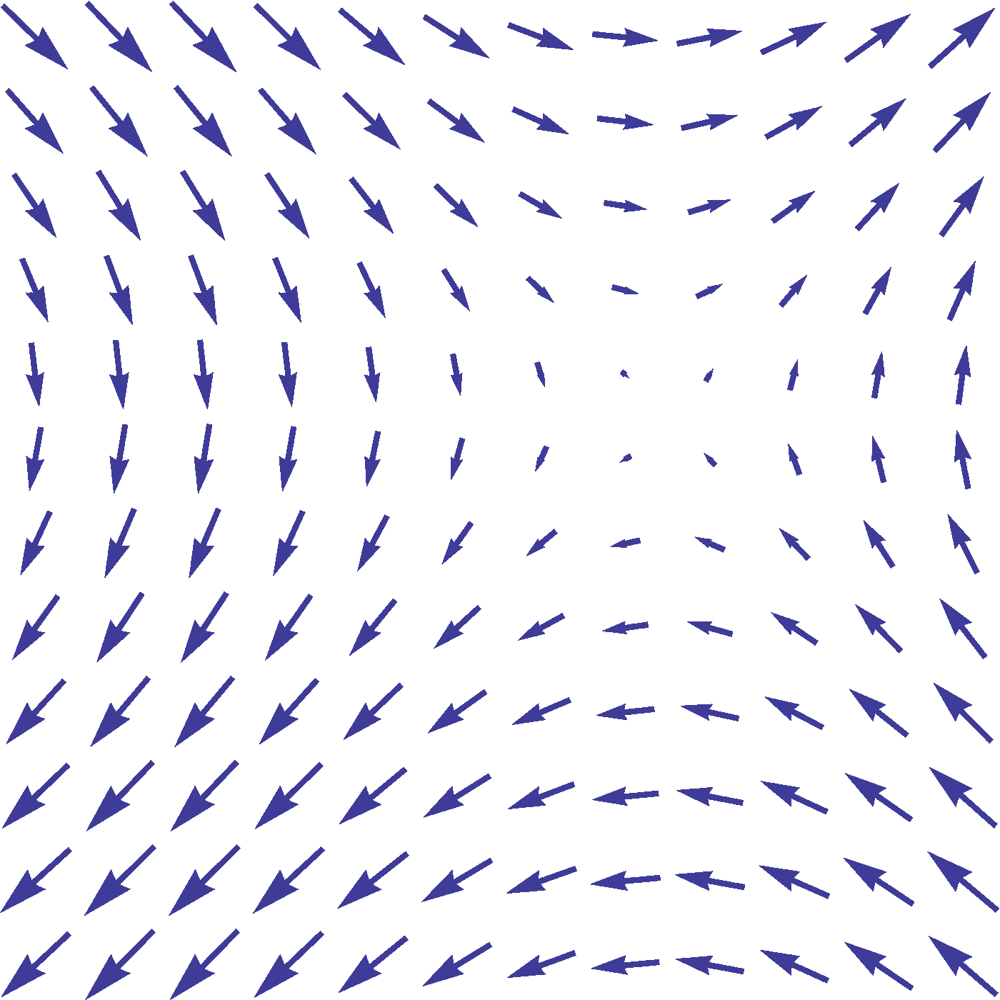
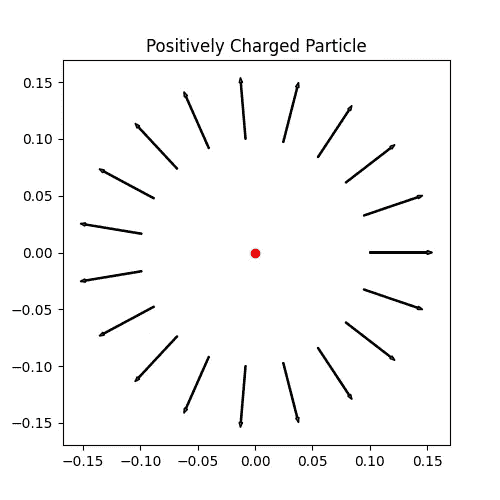
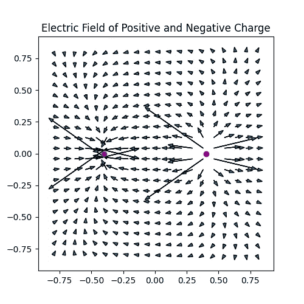
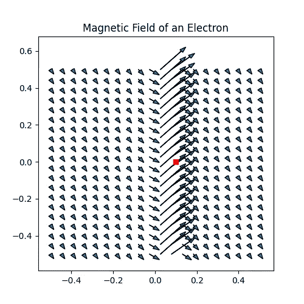
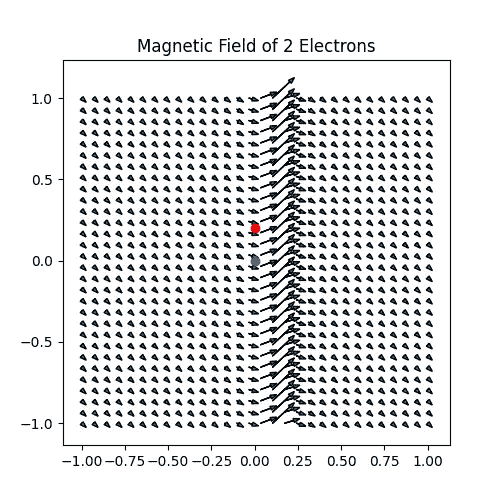

# 仿真 104：使用向量场的电磁映射

> 原文：[`towardsdatascience.com/simulation-104-electromagnetic-mapping-with-vector-fields-96ab3d5e7637`](https://towardsdatascience.com/simulation-104-electromagnetic-mapping-with-vector-fields-96ab3d5e7637)

## 建模电场和磁场

[](https://medium.com/@ln8378?source=post_page-----96ab3d5e7637--------------------------------)[](https://towardsdatascience.com/?source=post_page-----96ab3d5e7637--------------------------------) [Le Nguyen](https://medium.com/@ln8378?source=post_page-----96ab3d5e7637--------------------------------)

·发布于 [Towards Data Science](https://towardsdatascience.com/?source=post_page-----96ab3d5e7637--------------------------------) ·阅读时间 12 分钟·2023 年 8 月 7 日

--

水、火、空气和泥土，磁铁是如何工作的？这不是奇迹，而是科学！我们都曾玩过磁铁，无论是在冰箱上还是在科学课堂上，但我们可能不完全理解磁铁的真正含义或功能。本文将学习电场和磁场背后的基本理论，并学习如何构建一个计算框架来对其进行建模。


图 1：[电场示例](https://en.wikipedia.org/wiki/Magnetic_field)

在本文中我们将：

+   学习基本的电磁（EM）理论

+   创建向量场

+   使用向量场绘制电磁场

# 电场和磁场

电磁学是[宇宙的四种基本力](https://www.space.com/four-fundamental-forces.html)之一。它是支配带电粒子行为的力量，电场和磁场是这种力量表现出来的方式。在本节中，我们将深入探讨这些场背后的理论。

## 电场

[电场](https://en.wikipedia.org/wiki/Electric_field)是带电粒子固有的。这就是为什么带电粒子可以相互排斥和吸引的原因。按照惯例，我们说正电荷粒子具有指向外部的电场，而负电荷粒子具有指向内部的电场，如图 2 所示。在吸引的情况下，当一个负电荷和一个正电荷粒子靠近时，场线从正电荷开始并终止于负电荷，如图 1 所示。



图 2：[电场线](https://en.wikipedia.org/wiki/Field_line)对于正、负和中性电荷粒子。

布朗定律所描述的电荷粒子之间的相互作用力由[**库仑定律**](https://en.wikipedia.org/wiki/Coulomb%27s_law)给出。库仑定律指出，电荷之间的力与每个粒子的电荷成正比，并且与它们之间的距离成反比。具体的方程见下方的方程 1。



方程 1：库仑定律

我们现在了解了电场的基本知识，可以继续研究磁场。

## 磁场

[磁场](https://en.wikipedia.org/wiki/Magnetic_field#:~:text=A%20magnetic%20field%20is%20a,electric%20currents%2C%20and%20magnetic%20materials.) 比电场更复杂一些，因为它们是由移动的电荷产生的。这可以是由于[电磁铁](https://en.wikipedia.org/wiki/Electromagnet)中的电流，或者由于[铁磁材料](https://en.wikipedia.org/wiki/Ferromagnetism)中的电子自旋产生的固有磁偶极子。在任何情况下，磁场是施加在磁铁（和移动电荷）之间的力。磁场更复杂，因为与带电粒子不同，没有磁单极子。也就是说，没有正负磁铁，每个磁铁都有一个北极和一个南极，这两个极分别吸引其他磁铁的相反极。这意味着在确定磁场时需要考虑磁铁的方向和几何形状。



图 3：[圆柱形磁铁的磁场线](https://commons.wikimedia.org/wiki/File:VFPt_cylindrical_magnet_thumb.svg)

由于磁场的复杂性，我们将考虑最简单的情况：磁铁足够小或相距足够远，以至于它们的几何形状不重要。在这种情况下，磁铁可以被看作是电荷粒子，或者更确切地说，就像图 1 所示的正负电荷紧挨在一起。这种简化的设置被称为[磁偶极子-偶极子相互作用](https://en.wikipedia.org/wiki/Magnetic_dipole%E2%80%93dipole_interaction#:~:text=Magnetic%20dipole%E2%80%93dipole%20interaction%2C%20also,in%20calculating%20their%20interaction%20energy.)，如果我们假设磁铁沿同一方向对齐，它将进一步简化。

在所有这些简化假设下，我们得到了方程 2 描述的磁场，并且磁场施加的力由方程 3 描述。



方程 2：磁偶极子-偶极子场



方程 3：磁偶极子-偶极子力

理解电场和磁场后，我们将继续研究矢量场；这是一种计算方案，将帮助我们建模这些场。

*注意：为了简洁和简单性，本介绍文章对电磁场理论进行了许多简化。更高级的解释将在未来的文章中给出。*

# 矢量场

[向量](https://en.wikipedia.org/wiki/Vector_(mathematics_and_physics))是数量的数学表示，这些数量还具有相关的方向。例如，我可以告诉你外面的风速是 25 英里每小时，这是与风速相关的数量或标量，但如果我告诉你风速是 25 英里每小时向东北方向，你现在就有了风速向量，因为你知道风的强度或大小以及风吹的方向。

继续使用这个风速类比，向量只能表示空间中的一个点的风，但假设我们想知道风在整个区域的表现。为此，我们需要一个[向量场](https://en.wikipedia.org/wiki/Vector_field)，这类似于我们在[上一篇文章](https://medium.com/towards-data-science/simulation-101-conductive-heat-transfer-a4f09b3e16b4)中讨论的网格，只不过我们现在在网格中查看的是向量，而不是点。下面的图 4 展示了一个向量场的例子。如我们所见，存在许多均匀间隔的向量，每个向量都有自己的方向和大小。视觉上，向量的大小或强度由其尺寸表示，因此较大的向量表示其给定方向上的风速更高。



图 4: [向量场的例子](https://commons.wikimedia.org/wiki/File:VectorField.svg?uselang=en#Licensing)

向量场是建模电磁场的完美计算工具，因为正如我们在前一部分看到的那样，它们具有强度和方向。我们现在将深入探讨如何使用向量场来建模电场和磁场。

# 电磁场映射

为了创建我们的向量场，我们将使用[matplotlib 的箭头函数](https://matplotlib.org/stable/api/_as_gen/matplotlib.pyplot.arrow.html)。这个函数将在给定的 x,y 位置绘制一个向量，以及一个 x,y 大小。结合[numpy 的网格函数](https://numpy.org/doc/stable/reference/generated/numpy.meshgrid.html)，我们可以通过制作向量网格来创建一个向量场。现在，让我们开始吧。

## 电场

首先，让我们创建一个[类](https://docs.python.org/3/tutorial/classes.html)来表示带电粒子，我们可以调用它来生成任意数量的粒子。该类将接收一个位置和一个给定的电荷量来初始化一个粒子。

```py
class charge():

    def init(self, position, charge):
        self.position = np.array(position)
        self.charge = charge
```

现在让我们编写一个库仑定律的函数，该函数将接收库仑常数、粒子的电荷量以及到某个观察点的距离。请注意，此时我们使用库仑定律来查看由于一个粒子而在某个观察点的场强度，因此第二个粒子的电荷量（尚未）不需要。还要注意，我们用* r *除以* r *的大小来表示我们的方向单位向量。

```py
def coulombs_law(k,q,r):
    F = k*q*r/(np.linalg.norm(r))**3
    return F
```

让我们映射单个带电粒子周围的电场。我们将围绕粒子设置一个观察点的环，并查看场强（大小）和方向。我们的结果将在图 5 中显示。

```py
#Define coulomb's constant and charge of our particle
k = 8.9e9                           
q = 0.1e-6    

#Make our charged particle
particle = charge()
particle.init([0,0],q)

#Define our source and observation points
source = np.array(particle.position)
observations = []
r = []
field = []
#Need to scale our vectors to always have a visible magnitude
visual_scale = []

#Loop over points in a circle around our charge
for i in np.linspace(0,2*np.pi,20):
    observations.append(np.array([0.1*np.cos(i),0.1*np.sin(i)]))          
    r.append(observations[-1] - source)                
    field.append(coulombs_law(k,q,r[-1]))  
    visual_scale.append(np.linalg.norm(r[-1])/np.linalg.norm(field[-1])/2)  

#Plot our particle and the vector field around it
fig = plt.figure(figsize=(5,5))
plt.plot(particle.position[0],particle.position[1],'ro')

for j in range(0, len(observations)):
    plt.arrow(observations[j][0],observations[j][1],visual_scale[j]*field[j][0],visual_scale[j]*field[j][1])  

plt.title("Positively Charged Particle"); 
```



图 5：模拟的正电荷粒子的电场

我们已经成功模拟了单个带电粒子周围的电场，这很酷，但让我们模拟一些更有趣的东西。比如在图 1 中，一个负电荷旁边有一个正电荷？现在我们将有 2 个带电粒子，它们的电荷大小相等但方向相反，因此我们必须跟踪两个粒子的电场，并查看它们如何叠加到整体场中。这将要求我们找出每个粒子到给定观察点的 2 个距离*r*，然后找到每个粒子的场的向量贡献，并[将它们相加](https://www.physicsclassroom.com/class/vectors/Lesson-1/Vector-Addition)，以获得该观察点的整体场。

在这里，我们将使用观察点的网格来创建一个向量场。有关电荷偶极子的结果，请参见图 6。

```py
#Define coulomb's constant and charge of our particle
k = 8.9e9                           
q = 0.1e-6  

#Make our charges
q1 = charge()
q2 = charge()
q1.init([0.4,0],q)
q2.init([-0.4,0],-q)

#Make a meshgrid of observation points
x = np.linspace(-.8,.8,20)
X,Y = np.meshgrid(x,x)
grid =[]
for i in range(0, len(X)):
    for j in range(0, len(Y)):
        grid.append([X[i][j],Y[i][j]])

#Define our needed quantities
observations = np.array(grid)  
r1 = []
r2 = []
field1 = []
field2 = []
field_total = []

#Loop through observation points
for n in range(0,len(observations)):

    r1.append(observations[n] - q1.position)               
    r2.append(observations[n] - q2.position)

    field1.append(coulombs_law(k,q1.charge,r1[-1]))  
    field2.append(coulombs_law(k,q2.charge,r2[-1]))
    field_total.append(field1[-1]+field2[-1])

#Scale x and y
field_total = np.array(field_total)
scale_x = .3/max(field_total[:,0])
scale_y = .3/max(field_total[:,1])

#Plot vector field
fig = plt.figure(figsize=(5,5))

plt.plot(q1.position[0],q1.position[1],'ro', label = "Positive")
plt.plot(q2.position[0],q2.position[1],'bo', label = "Negitive")

for j in range(0, len(observations)):
    plt.arrow(observations[j][0],observations[j][1],scale_x*field_total[j][0],scale_y*field_total[j][1], head_width = .025)  

plt.title("Electric Field of Positive and Negative Charge")
plt.show()
```



图 6：模拟的电荷偶极子的电场

我们现在已经模拟了如图 1 所示的正负电荷的电场。如我们所见，所有向量的箭头都指向正确的方向；从正电荷（红色）到负电荷（蓝色）。由于观察点靠近带电粒子，存在一些视觉噪声。由于库仑定律的制定方式，当距离粒子接近 0 时，场强会趋于无穷大；因此，我们会在靠近电荷的点看到大的向量。我们可以选择对它们进行归一化、去除，或仅保留作为合理性检查。

现在我们已经模拟了电场，是时候转向磁场了。

## 磁场

当我们将磁场情景简化为类似电场时，代码看起来会非常相似。我们将定义一个磁铁类和一个偶极-偶极相互作用函数。注意，与方程 2 不同，我使用了 x 和 y 坐标而不是距离*r*。这样可以使计算更清晰，因为与粒子电荷不同，偶极子(*m*)本身是一个具有 x，y 分量的向量。还需注意的是，我们这里将映射*磁场*而不是*磁力*。磁场施加的磁力取决于带电粒子/其他磁体如何通过它，这超出了本文的范围。

```py
class magnet():

    def init(self, position, dipole):
        self.position = np.array(position)
        self.dipole = dipole

def dipole_dipole(u_0,m,x,y):

    r = np.sqrt(x**2 + y**2)
    r_hat_x = x / r
    r_hat_y = y / r

    factor = (u_0 / (4 * np.pi)) * (3 * (m[0] * r_hat_x + m[1] * r_hat_y))

    Bx = factor * r_hat_x - m[0]
    By = factor * r_hat_y - m[1]

    Bx /= r**3
    By /= r**3

    return Bx, By
```

现在让我们模拟磁场。在这里，我们将模拟电子的磁场并使用其偶极子。

```py
#Define magnetic constant and dipole of our magnet
u_0 = 4*np.pi*10**-7
#dipole on an electron
m = (-9.28*10**-24,0)   

#Make our magnets
m1 = magnet()
m1.init([.1,0],m)

#Make a meshgrid of observation points
x = np.linspace(-.5,.5,20)
X,Y = np.meshgrid(x,x)
grid =[]
for i in range(0, len(X)):
    for j in range(0, len(Y)):
        grid.append([X[i][j],Y[i][j]])

#Define our needed quantities
observations = np.array(grid)  
field1 = []

#Loop through observation points
for n in range(0,len(observations)):

    x = observations[n][0] - m1.position[0]               
    y = observations[n][0] - m1.position[1]

    field1.append(dipole_dipole(u_0,m1.dipole,x,y))  

#Scale x and y
field_total = np.array(field1)
scale_x = .1/max(field_total[:,0])
scale_y = .1/max(field_total[:,1])

#Plot vector field
fig = plt.figure(figsize=(5,5))

plt.plot(m1.position[0],m1.position[1],'rs')

for j in range(0, len(observations)):
    plt.arrow(observations[j][0],observations[j][1],scale_x*field1[j][0],scale_y*field1[j][1], head_width = .02)  

plt.title("Magnetic Field of an Electron")
```



图 7：模拟的电子的磁场

在这里我们看到的是我们模拟的电子磁场。它看起来有点奇怪，因为我们只在二维空间中工作，所以我们实际上只看到磁场的一个垂直切片。在三维中，[我们会看到矢量向我们弯曲并绕着电子缠绕](http://www.faithfulscience.com/classical-physics/electric-and-magnetic-fields.html)。

我们也会看到两个电子相同的效果。

```py
#Define coulomb's constant and charge of our particle
u_0 = 4*np.pi*10**-7                          
m = (-9.28*10**-24,0)   

#Make our charges
m1 = magnet()
m2 = magnet()
m1.init([0,.2],m)
m2.init([0,0],m)

#Make a meshgrid of observation points
x = np.linspace(-1,1,30)
X,Y = np.meshgrid(x,x)
grid =[]
for i in range(0, len(X)):
    for j in range(0, len(Y)):
        grid.append([X[i][j],Y[i][j]])

#Define our needed quantities
observations = np.array(grid)  
field1 = []
field2 = []
field_total = []

#Loop through observation points
for n in range(0,len(observations)):

    x1 = observations[n][0] - m1.position[0]               
    y1 = observations[n][0] - m1.position[1]

    x2 = observations[n][0] - m2.position[0]               
    y2 = observations[n][0] - m2.position[1]

    field1.append(dipole_dipole(u_0,m1.dipole,x1,y1))  
    field2.append(dipole_dipole(u_0,m2.dipole,x2,y2))
    field_total.append(field1[-1]+field2[-1])

#Scale x and y
field_total = np.array(field_total)
scale_x = .1/max(field_total[:,0])
scale_y = .1/max(field_total[:,1])

#Plot vector field
fig = plt.figure(figsize=(5,5))

plt.plot(m1.position[0],m1.position[1],'ro', label = "Positive")
plt.plot(m2.position[0],m2.position[1],'bo', label = "Negitive")

for j in range(0, len(observations)):
    plt.arrow(observations[j][0],observations[j][1],scale_x*field_total[j][0],scale_y*field_total[j][1], head_width = .025)  

plt.title("Magnetic Field of 2 Electrons")
```



图 8：两个电子的磁场（它们通过不同的颜色表示，但具有相同的偶极子）

这可能不是最直观的结果，但在未来的文章中，我们将进行三维电磁场映射，并结合几何学来更好地定义场。

# 完整代码

## 电场

```py
import numpy as np
import matplotlib.pyplot as plt

class charge():

    def init(self, position, charge):
        self.position = np.array(position)
        self.charge = charge

def coulombs_law(k,q,r):
    F = k*q*r/(np.linalg.norm(r))**3
    return F

#Define coulomb's constant and charge of our particle
k = 8.9e9                           
q = 0.1e-6  

#Make our charged particle
particle = charge()
particle.init([0,0],q)

#Define our source and observation points
source = np.array(particle.position)
observations = []
r = []
field = []
#Need to scale our vectors to always have a visible magnitude
visual_scale = []

#Loop over points in a circle around our charge
for i in np.linspace(0,2*np.pi,20):
    observations.append(np.array([0.1*np.cos(i),0.1*np.sin(i)]))          
    r.append(observations[-1] - source)                
    field.append(coulombs_law(k,q,r[-1]))  
    visual_scale.append(np.linalg.norm(r[-1])/np.linalg.norm(field[-1])/2)  

#Plot our particle and the vector field around it
fig = plt.figure(figsize=(5,5))
plt.plot(particle.position[0],particle.position[1],'ro')

for j in range(0, len(observations)):
    plt.arrow(observations[j][0],observations[j][1],visual_scale[j]*field[j][0],visual_scale[j]*field[j][1])  

plt.title("Positively Charged Particle");
```

```py
#Make our charges
q1 = charge()
q2 = charge()
q1.init([0.4,0],q)
q2.init([-0.4,0],-q)

#Make a meshgrid of observation points
x = np.linspace(-.8,.8,20)
X,Y = np.meshgrid(x,x)
grid =[]
for i in range(0, len(X)):
    for j in range(0, len(Y)):
        grid.append([X[i][j],Y[i][j]])

#Define our needed quantities
observations = np.array(grid)  
r1 = []
r2 = []
field1 = []
field2 = []
field_total = []

#Loop through observation points
for n in range(0,len(observations)):

    r1.append(observations[n] - q1.position)               
    r2.append(observations[n] - q2.position)

    field1.append(coulombs_law(k,q1.charge,r1[-1]))  
    field2.append(coulombs_law(k,q2.charge,r2[-1]))
    field_total.append(field1[-1]+field2[-1])

#Scale x and y
field_total = np.array(field_total)
scale_x = .3/max(field_total[:,0])
scale_y = .3/max(field_total[:,1])

#Plot vector field
fig = plt.figure(figsize=(5,5))

plt.plot(q1.position[0],q1.position[1],'ro', label = "Positive")
plt.plot(q2.position[0],q2.position[1],'bo', label = "Negitive")

for j in range(0, len(observations)):
    plt.arrow(observations[j][0],observations[j][1],scale_x*field_total[j][0],scale_y*field_total[j][1], head_width = .025)  

plt.title("Electric Field of Positive and Negative Charge") 
```

## 磁场

```py
import numpy as np
import matplotlib.pyplot as plt
```

```py
class magnet():

    def init(self, position, dipole):
        self.position = np.array(position)
        self.dipole = dipole

def dipole_dipole(u_0,m,x,y):

    r = np.sqrt(x**2 + y**2)
    r_hat_x = x / r
    r_hat_y = y / r

    factor = (u_0 / (4 * np.pi)) * (3 * (m[0] * r_hat_x + m[1] * r_hat_y))

    Bx = factor * r_hat_x - m[0]
    By = factor * r_hat_y - m[1]

    Bx /= r**3
    By /= r**3

    return Bx, By

#Define magnetic constant and dipole of our magnet
u_0 = 4*np.pi*10**-7
#dipole on an electron
m = (-9.28*10**-24,0)   

#Make our magnets
m1 = magnet()
m1.init([.1,0],m)

#Make a meshgrid of observation points
x = np.linspace(-.5,.5,20)
X,Y = np.meshgrid(x,x)
grid =[]
for i in range(0, len(X)):
    for j in range(0, len(Y)):
        grid.append([X[i][j],Y[i][j]])

#Define our needed quantities
observations = np.array(grid)  
field1 = []

#Loop through observation points
for n in range(0,len(observations)):

    x = observations[n][0] - m1.position[0]               
    y = observations[n][0] - m1.position[1]

    field1.append(dipole_dipole(u_0,m1.dipole,x,y))  

#Scale x and y
field_total = np.array(field1)
scale_x = .1/max(field_total[:,0])
scale_y = .1/max(field_total[:,1])

#Plot vector field
fig = plt.figure(figsize=(5,5))

plt.plot(m1.position[0],m1.position[1],'rs')

for j in range(0, len(observations)):
    plt.arrow(observations[j][0],observations[j][1],scale_x*field1[j][0],scale_y*field1[j][1], head_width = .02)  

plt.title("Magnetic Field of an Electron")
```

```py
#Make our charges
m1 = magnet()
m2 = magnet()
m1.init([0,.2],m)
m2.init([0,0],m)

#Make a meshgrid of observation points
x = np.linspace(-1,1,30)
X,Y = np.meshgrid(x,x)
grid =[]
for i in range(0, len(X)):
    for j in range(0, len(Y)):
        grid.append([X[i][j],Y[i][j]])

#Define our needed quantities
observations = np.array(grid)  
field1 = []
field2 = []
field_total = []

#Loop through observation points
for n in range(0,len(observations)):

    x1 = observations[n][0] - m1.position[0]               
    y1 = observations[n][0] - m1.position[1]

    x2 = observations[n][0] - m2.position[0]               
    y2 = observations[n][0] - m2.position[1]

    field1.append(dipole_dipole(u_0,m1.dipole,x1,y1))  
    field2.append(dipole_dipole(u_0,m2.dipole,x2,y2))
    field_total.append(field1[-1]+field2[-1])

#Scale x and y
field_total = np.array(field_total)
scale_x = .1/max(field_total[:,0])
scale_y = .1/max(field_total[:,1])

#Plot vector field
fig = plt.figure(figsize=(5,5))

plt.plot(m1.position[0],m1.position[1],'ro', label = "Positive")
plt.plot(m2.position[0],m2.position[1],'bo', label = "Negitive")

for j in range(0, len(observations)):
    plt.arrow(observations[j][0],observations[j][1],scale_x*field_total[j][0],scale_y*field_total[j][1], head_width = .025)  

plt.title("Magnetic Field of 2 Electrons")
```

# 参考文献

1.  本文中使用的所有图形要么由作者生成，要么符合[创意共享许可证 CC BY-SA](https://creativecommons.org/licenses/by-sa/3.0/)，正如原始图像创作者所声明的那样。

1.  《电动力学导论》第四版 [`hansandcassady.org/David%20J.%20Griffiths-Introduction%20to%20Electrodynamics-Addison-Wesley%20(2012).pdf`](https://hansandcassady.org/David%20J.%20Griffiths-Introduction%20to%20Electrodynamics-Addison-Wesley%20(2012).pdf)
