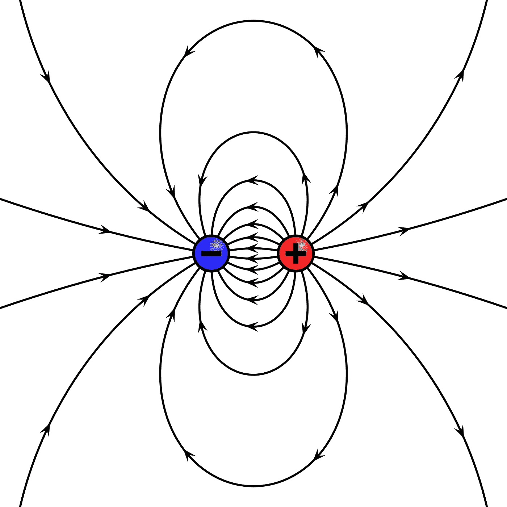

# 模拟 104: 使用矢量场进行电磁映射

> 原文：[`towardsdatascience.com/simulation-104-electromagnetic-mapping-with-vector-fields-96ab3d5e7637?source=collection_archive---------7-----------------------#2023-08-07`](https://towardsdatascience.com/simulation-104-electromagnetic-mapping-with-vector-fields-96ab3d5e7637?source=collection_archive---------7-----------------------#2023-08-07)

## 模拟电场和磁场

 [Le Nguyen](https://medium.com/@ln8378?source=post_page-----96ab3d5e7637--------------------------------)

·

[关注](https://medium.com/m/signin?actionUrl=https%3A%2F%2Fmedium.com%2F_%2Fsubscribe%2Fuser%2Fb34fcbf59198&operation=register&redirect=https%3A%2F%2Ftowardsdatascience.com%2Fsimulation-104-electromagnetic-mapping-with-vector-fields-96ab3d5e7637&user=Le+Nguyen&userId=b34fcbf59198&source=post_page-b34fcbf59198----96ab3d5e7637---------------------post_header-----------) 发表在 [Towards Data Science](https://towardsdatascience.com/?source=post_page-----96ab3d5e7637--------------------------------) · 12 分钟阅读 · 2023 年 8 月 7 日

--

水、火、空气和土壤，磁铁是如何工作的？这不是奇迹，而是科学！我们都曾在冰箱上或科学课堂上玩过磁铁，但可能并不真正了解磁铁是什么或它们的作用。在本文中，我们将学习电场和磁场的基本理论，并学习如何创建一个计算框架来对它们进行建模。

图 1: [电场示例](https://en.wikipedia.org/wiki/Magnetic_field)

在本文中，我们将：

+   学习基础电磁学（EM）理论

+   创建矢量场

+   使用矢量场绘制电磁场

# 电场和磁场

电磁学是[宇宙四大基本力](https://www.space.com/four-fundamental-forces.html)之一。它是支配带电粒子行为的力，电场和磁场就是这种力的表现形式。在这一部分，我们将深入探讨这些场的理论基础。

## 电场

[电场](https://en.wikipedia.org/wiki/Electric_field)是带电粒子固有的性质。这就是为什么带电粒子可以相互排斥和吸引的原因。根据惯例，我们说正电荷粒子具有向外指的电场，而负电荷…
