# 模拟 106：使用网络建模信息扩散和社会传染

> 原文：[`towardsdatascience.com/simulation-106-modeling-information-diffusion-and-social-contagion-with-networks-7c1184004889`](https://towardsdatascience.com/simulation-106-modeling-information-diffusion-and-social-contagion-with-networks-7c1184004889)

## 基于图的方法来建模信息通过社交网络的传播

[](https://medium.com/@ln8378?source=post_page-----7c1184004889--------------------------------)[](https://towardsdatascience.com/?source=post_page-----7c1184004889--------------------------------) [Le Nguyen](https://medium.com/@ln8378?source=post_page-----7c1184004889--------------------------------)

·发表于 [Towards Data Science](https://towardsdatascience.com/?source=post_page-----7c1184004889--------------------------------) ·12 分钟阅读·2023 年 9 月 7 日

--

社交媒体彻底改变了信息的格局。我们比人类历史上任何时候都更加互联。新闻可以瞬间传达给我们，思想在几天内传播到全球，但这如何运作？信息是如何传播的，我们能否对其进行建模？在本文中，我们将介绍信息传播的理论，并使用网络进行建模。


图 1: [通过网络连接的世界的艺术表现](https://commons.wikimedia.org/wiki/File:Social_Network_Visualization.png)。根据 [知识共享](https://creativecommons.org/licenses/by-sa/4.0/deed.en) 许可。

在本文中，我们将：

+   学习图和网络理论的基础

+   概述信息扩散和社会传染

+   构建一个计算框架来模拟思想的传播

# 图和网络

## 什么是图和网络？

[图](https://en.wikipedia.org/wiki/Graph_(discrete_mathematics))是一种数学结构，用于显示对象之间的关系。它通过将每个对象表示为一个*顶点*，并用*边*将其连接到其他顶点，从而展示它们之间的关系。

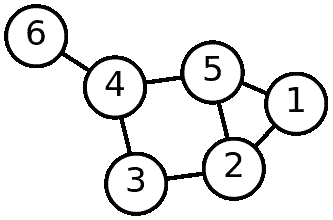

图 2: [具有 7 条边和 6 个顶点的图示例](https://commons.wikimedia.org/wiki/File:6n-graf.svg)

有许多[图的类型](https://en.wikipedia.org/wiki/Graph_(discrete_mathematics)#Types_of_graphs)，包括[加权图](https://en.wikipedia.org/wiki/Graph_(discrete_mathematics)#Weighted_graph)，在这些图中，所有边都被赋予值，以不仅显示关系，还显示关系的强度，以及[有向图](https://en.wikipedia.org/wiki/Graph_(discrete_mathematics)#Directed_graph)，在这些图中，边有一个方向以显示有向关系。各种类型的图使它们成为展示实体之间关系的强大工具，我们将讨论这些工具。

从概念上讲，图和[网络](https://en.wikipedia.org/wiki/Network_theory)是相同的，在大多数情况下，这些术语可以互换使用。然而，根据惯例，*图* 用于指代抽象的数学概念，而*网络* 用于实际应用的上下文。例如，我们使用了“计算机网络”和“社交网络”这两个术语，即使计算机图或社交图也可以表达相同的意思。对于我们的目的，我们将说网络是应用图，唯一需要的术语差异是将*顶点* 叫作*节点*。

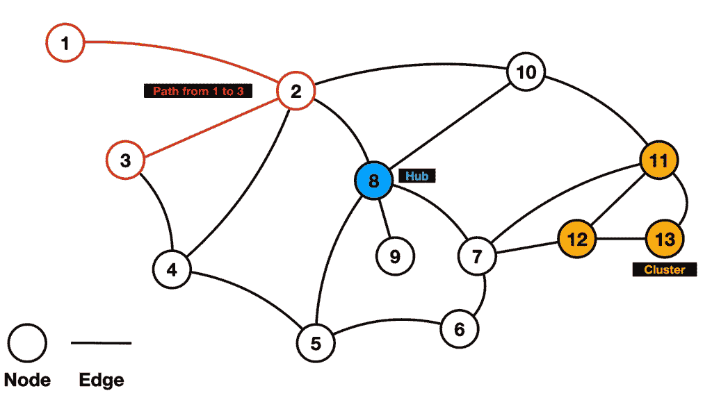

图 3: [具有指定特征的网络示例](https://commons.wikimedia.org/wiki/File:NetworkGraph.png)

## 图论

[图论](https://en.wikipedia.org/wiki/Graph_theory#:~:text=In%20mathematics%2C%20graph%20theory%20is,also%20called%20links%20or%20lines).) 是研究图（和网络）的数学分支，描述图的性质以及它们的应用。我们不会在这篇文章中覆盖图论的整个领域，但我们将关注与信息传播相关的要点。

信息的传播可以用[流图](https://en.wikipedia.org/wiki/Flow_graph_(mathematics))建模，或者在我们的例子中是[流网络](https://en.wikipedia.org/wiki/Flow_network)。流网络是一种加权的[有向图](https://en.wikipedia.org/wiki/Graph_(discrete_mathematics)#Directed_graph)，它展示了在结构中某物的转移或运输。这可能是管道中的水、计算机网络中的数据，或者在我们的例子中是社交网络中的信息。

流网络具有任何网络的所有组件（节点、边、权重），但现在它们是某种结构中流动的特定表示。在我们的例子中，*节点* 是社交网络中的个体，这些个体通过*边* 连接到其他个体，而*权重* 则由它们之间的联系程度决定。流网络还可以建立在一个*源* 上，即信息的起点，以及一个*汇*，即信息流终止的地方，还有一个*容量* 或者说网络中可以传输的最大信息量。

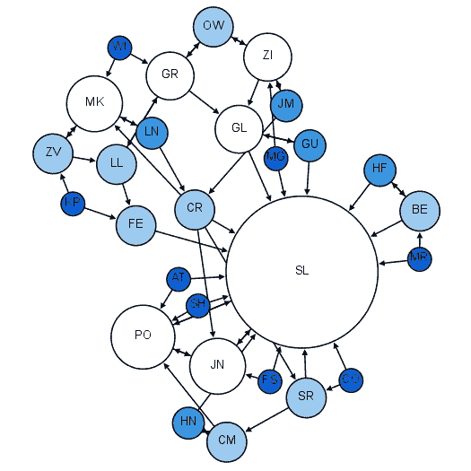

图 4：[社会流动网络示例](https://commons.wikimedia.org/wiki/File:Moreno_Sociogram_2nd_Grade.png)

图 4 是一个表示教室的社会流动网络。每个学生（以及老师）是这个网络中的一个节点，通过有向边与教室中的其他节点相连，显示他们之间的联系。在这种情况下，边没有权重，但节点的大小由其[中心性](https://en.wikipedia.org/wiki/Centrality)决定。

图表/网络中心性的度量有很多种，但总体中心性反映了一个节点在网络中的重要性。一些例子包括[度中心性](https://en.wikipedia.org/wiki/Centrality#Degree_centrality)，即连接到一个节点的边的数量，以及[接近中心性](https://en.wikipedia.org/wiki/Centrality#Closeness_centrality)，即一个节点到所有其他节点的短路径数量。在图 4 中，我们看到节点的大小由度中心性决定，老师（SL）是网络中最中心的节点，具有最高的度中心性。

通过对图形和网络的基本理解，我们可以深入探讨下一部分内容；信息扩散和社会传染。

# 信息扩散与社会传染

[信息扩散](https://www.ncbi.nlm.nih.gov/pmc/articles/PMC7123536/)指的是信息在群体或系统中的传播。对于一个群体，信息通过成员以各种方式传播，如面对面、在线、书面、通过言语或录音等。信息扩散用于描述谣言的传播、广告活动的有效性，以及信息在群体中的其他传播方式。

我们不能谈论信息扩散而不讨论[社会传染](https://en.wikipedia.org/wiki/Social_contagion)。它研究信息在信息扩散过程中如何通过群体传播及其影响因素。社会传染因素包括社会联系、媒体覆盖和文化规范等，以研究信息传播的速度或传染性、信息传播到的群体范围，以及群体成员对新信息的抵抗。社会传染可用于研究现象，如病毒视频的快速传播、阴谋论的传播以及新趋势的采纳。

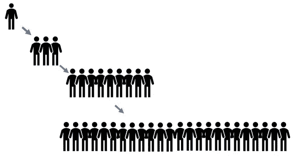

图 5：[信息扩散和社会传染的插图](https://commons.wikimedia.org/wiki/File:%D7%94%D7%93%D7%91%D7%A7%D7%94.jpg)。我们可以看到信息从一个人开始传播，扩散到更大的群体中。图中的箭头表示信息的传染过程。

## 扩散和传染模型

信息扩散和社会传播都是经过充分研究的话题，并且有理论模型为它们开发。我们将首先查看一个简单的信息扩散模型，称为 [两步流动模型](https://en.wikipedia.org/wiki/Two-step_flow_of_communication)。

两步流动模型从某种大规模媒体开始，比如新闻网络或大型公司发布一个想法，然后由意见领袖/社区中高度影响力的成员采纳。随后，社区成员会从他们最亲近的意见领袖那里接受这个想法。这个从媒体到意见领袖再到他们的社区的两步过程假设大多数人不会直接从大众媒体中采纳想法；他们需要一个更接近他们的来源来分享这个想法，才能采纳它。

例如，假设有一款新手机发布，广告随处可见。一般公众可能会对广告感到麻木，或被竞争手机公司的广告淹没，这不会说服他们购买新手机。然而，如果他们从更亲近的来源，如喜欢的名人、网红、同事或家庭成员那里听到这款新手机，那将更具说服力。我们可以在图 6 中看到这种两步流动过程的可视化。

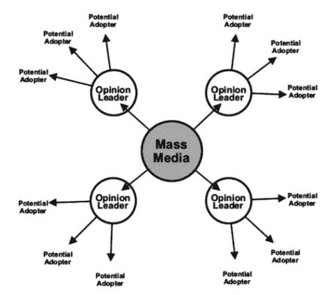

图 6: [信息扩散的两步流动模型](https://scholarworks.rit.edu/cgi/viewcontent.cgi?article=12588&context=theses)

在深入探讨模拟之前，我们将观察一种社会传播模型。社会传播将信息的传播视为一种疾病（因此称为“传播”），这种疾病通过接触信息而传播。因此，基本的社会传播模型借鉴了疾病建模，并且类似于我们之前看到的 SIR 曲线 [当我们模拟疾病传播时](https://medium.com/@ln8378/simulation-102-agent-based-disease-modeling-17307f2de2f3)。

这个曲线可以在图 7 中看到，它是对图 5 中所见内容的线性建模。首先，一个想法由个人或小组持有，他们将其传播给他们最亲近的人。然后，这些人将其传播给他们最亲近的人，将信息扩散到人群中。这个迭代过程最初会以指数级传播想法，直到它达到一个临界质量，然后在主流之后线性传播这个想法。一旦覆盖到所有人并且没有更多人可以传播，这种增长将开始减缓。这与通过接触传播的疾病的行为是相同的，因此信息以类似的方式传播是合理的。

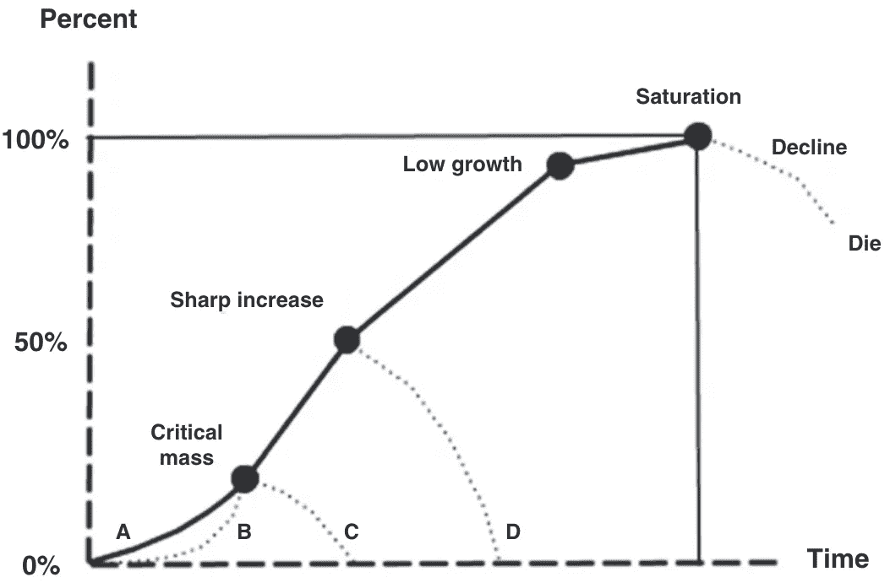

图 7: [信息传播曲线](https://scholarworks.rit.edu/cgi/viewcontent.cgi?article=12588&context=theses)

我们现在可以结合对网络和想法传播的理解，创建一个计算框架来模拟信息和想法的传播。

# 模拟

在本次模拟中，我们将使用类似于我们在[基于代理的疾病模型](https://medium.com/@ln8378/simulation-102-agent-based-disease-modeling-17307f2de2f3)中创建的 python 类方法。我们还将使用[NetworkX](https://networkx.org/)库来构建网络。我们首先创建一个网络类，并添加一些初始方法。我们需要一个方法来在网络中创建初始信息源，以及添加新节点（人）和有向边（连接）。实现这一点的代码如下，并在图 8 中进行了可视化。

```py
class Network:

    def create_source(self):
        G = nx.DiGraph()
        self.G = G
        self.G.add_node(0)

    def add_node(self):
        index = len(self.G.nodes)
        self.G.add_node(index)

    def add_connection(self,node1,node2):
        self.G.add_edge(node1,node2)
```

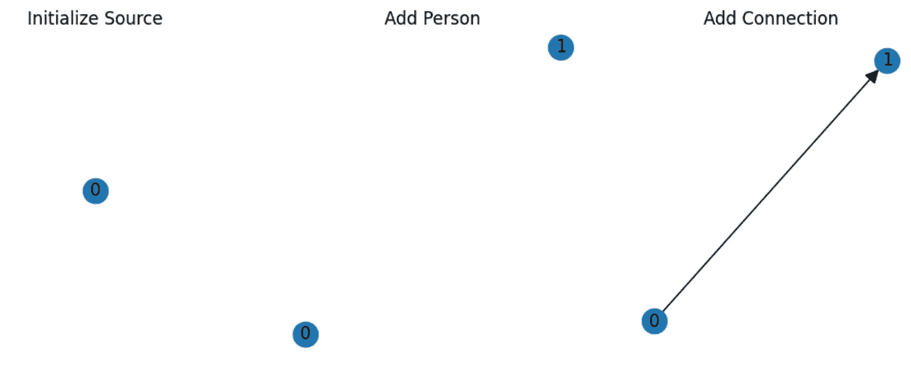

图 8：网络类的初始方法。

现在我们可以初始化信息源，向网络中添加更多的人，并在信息源与网络中的人之间以及人与人之间添加连接。不过，在运行完整的模拟之前，我们需要在网络类中添加更多功能。我们需要一种方法来跟踪网络中初始想法已经到达的人，并拥有传播该想法的机制。

通过为节点添加特性来完成这一点，这由 NetworkX 的功能轻松处理。我们给图中的每个人或节点添加“informed”特性，这是一个布尔值，告诉我们这个想法是否已经到达他们那里。通过我们的网络传播一个想法将使越来越多的节点的*informed*特性值设置为 1（true）。

在节点中添加了*informed*特性后，我们还可以创建一个方法，通过网络传播一个想法。我们通过遍历网络中的边列表（由 NetworkX 对象提供）来实现这一点，查看哪些节点是相互连接的。如果一个已知的节点连接到一个未知的节点（*informed*特性值为 0 或 false），那么它将把自己的想法传播给未知的节点；将其*informed*特性值设置为 1。

为了使这次模拟更加现实，我们将传播机制设为概率性的，因为并非所有人与人之间的互动都会传播想法或特定的想法。我们将通过对边值进行加权（赋予节点之间的连接一个强度值），然后随机对这个边值进行滚动，来判断是否在两个节点之间传播想法。为了这次模拟，我们将通过边的度中心性来加权边缘，因此网络中中心度更高、连接更好的节点将有更高的传播概率。

此外，这种随机对边值的滚动将由*阻力*值决定。*阻力*值是社会传播理论中出现的一个概念，用于确定一个人接受或传播新思想的抗拒程度。在我们的网络中，个体的*阻力*值越低，他们越有可能在对边值的滚动中获得积极结果，从而获得信息。

添加了*信息*特征和传播方法，代码如下所示，并在图 8 中进行了可视化。

```py
class Network:

    def create_source(self):
        G = nx.DiGraph()
        self.G = G
        self.G.add_node(0)
        self.G.nodes[0]["Informed"] = 1

    def add_node(self):
        index = len(self.G.nodes)
        self.G.add_node(index)
        self.G.nodes[index]["Informed"] = 0

    def add_connection(self,node1,node2):
        self.G.add_edge(node1,node2)
        self.G[node1][node2]["Connection"] = nx.degree_centrality(self.G)[node1]

    def propogate_information(self, resistance):
        for edge in list(self.G.edges):
            rand = np.random.uniform(0,resistance)
            if self.G.nodes[edge[0]]["Informed"] == 1 and rand < self.G[edge[0]][edge[1]]["Connection"]:
                self.G.nodes[edge[1]]["Informed"] = 1
```

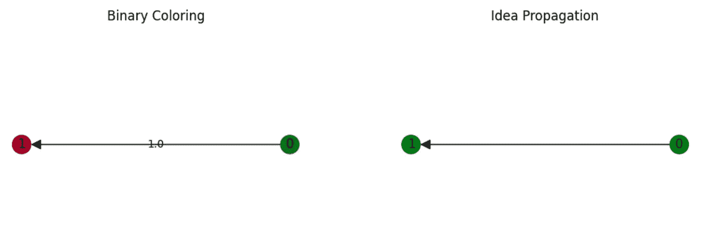

图 8: 节点现在以绿色（真）和红色（假）进行二进制着色，以显示其信息特征值。边缘也按度中心性加权。

通过我们构建的方法，我们可以创建一个社交网络。我们的网络以信息源开始，然后我们添加 100 个节点（人）。接下来，我们通过随机选择网络中的 2 个节点并在它们之间创建有向边来添加人与人之间的连接。这一过程重复 300 次，意味着平均每个人与其他 3 个人相连。图 9 显示了在初始社交网络中执行此操作的结果，其中想法被保留在源头。

```py
def get_color(network):
    color_dict = dict({0:"red",1:"green"})
    color = list(dict(network.G.nodes(data="Informed")).values())
    color = [color_dict[i] for i in color]
    return color

network = Network()
network.create_source()

for i in range(0,100):
    network.add_node()

nodes = list(network.G.nodes)
for i in range(0,300):
    if i == 0: 
        node1 = nodes[0]
    else:
        node1 = np.random.choice(nodes)
    node2 = np.random.choice(nodes)

    if node1 != node2:
        network.add_connection(node1,node2)

pos = nx.kamada_kawai_layout(network.G)
color = get_color(network)

plt.figure(figsize =(10,10))
nx.draw(network.G,  node_color = color, arrowsize=20, pos = pos)
```


图 9: 初始社交网络

现在是时候将我们的想法从源头传播到网络的其余部分了。我们将把传播方法简单地加入一个循环中，让其在给定的时间步数内在网络中传播。这里我们将传播这个想法 50 个时间步，并给每个人一个统一的抵抗值 0.3。

该传播的动画显示在图 10 中，最终网络显示在图 11 中。

```py
informed = []
networks = [network.G.copy()]
for i in range(0,50):
    network.propogate_information(.3)
    informed.append(sum(list(dict(network.G.nodes(data="Informed")).values())))
    networks.append(network.G.copy())
```

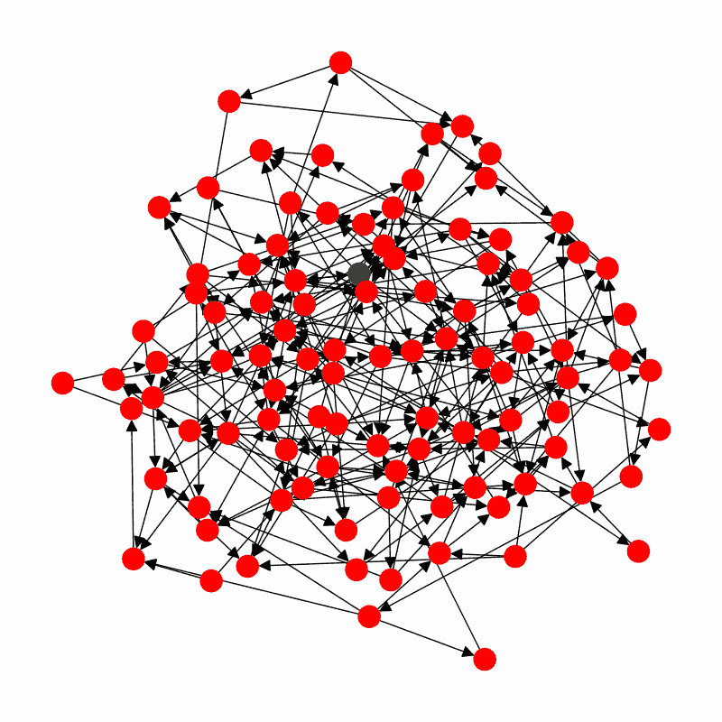

图 10: 想法传播的动画

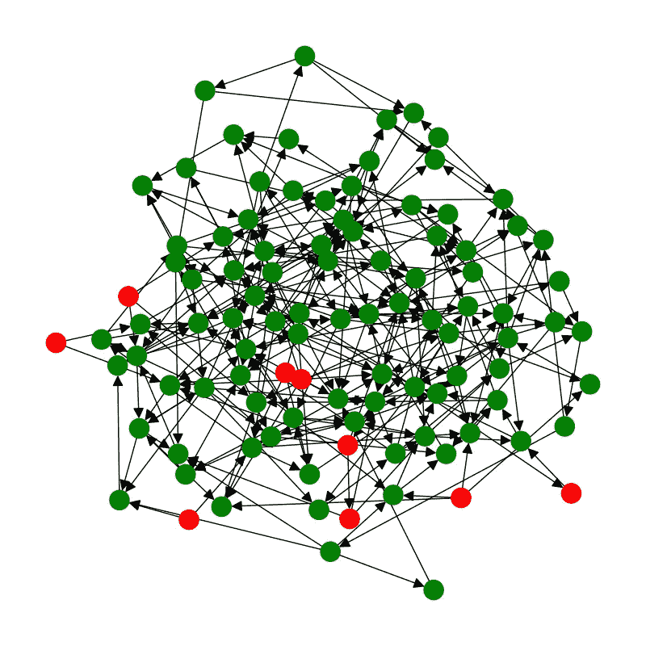

图 11: 最终网络

通过我们的模拟，我们可以通过保存每个时间步的信息节点数来跟踪想法在网络中的传播情况。这可以在图 12 中看到，它与我们期望的社会传播理论中的理论曲线非常接近，即图 7。我们看到经典的 S 形曲线，其中想法呈指数增长，经过线性阶段，最后在网络被想法饱和时趋于平稳。仔细观察我们的网络，有一些节点没有指向它们的边缘，只是从它们指向其他节点，这意味着它们将信息流入网络，但反向却不是这样。这些节点将永远不会被通知，因此我们的总人口将永远无法完全接触到源想法。

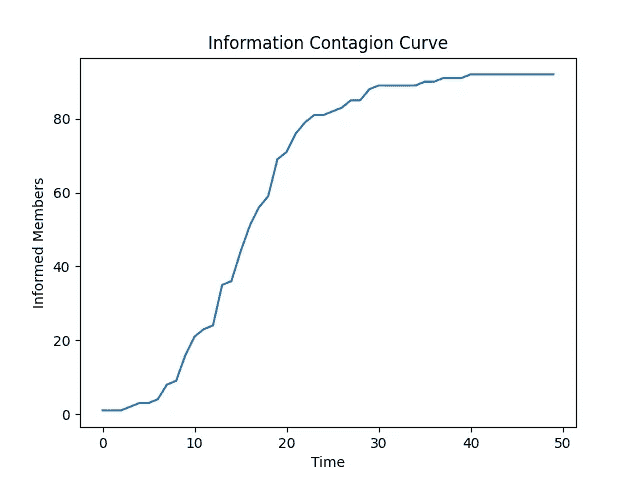

图 12: 传播曲线

# 结论

在本文中，我们了解了图形和网络作为表示对象之间关系的数学结构。我们还通过讨论信息扩散和社会传播理论来了解了思想的传播。然后，我们结合对网络和思想传播的理解，模拟了一个想法在社交网络中的传播。

# 完整代码

```py
#Import Libraries
import networkx as nx
import matplotlib.pyplot as plt
import numpy as np
import imageio

#Make helper functions
def makeGif(networks, name):
    !mkdir frames

    counter=0
    images = []
    for i in range(0,len(networks)):
        plt.figure(figsize = (8,8))

        color = get_color(networks[i])
        nx.draw(networks[i],  node_color = color, arrowsize=20, pos = pos)
        plt.savefig("frames/" + str(counter)+ ".png")
        images.append(imageio.imread("frames/" + str(counter)+ ".png"))
        counter += 1
        plt.close()

    imageio.mimsave(name, images)

    !rm -r frames

def get_color(graph):
    color_dict = dict({0:"red",1:"green"})
    color = list(dict(graph.nodes(data="Informed")).values())
    color = [color_dict[i] for i in color]
    return color

#Create Network Class
class Network:

    def create_source(self):
        G = nx.DiGraph()
        self.G = G
        self.G.add_node(0)
        self.G.nodes[0]["Informed"] = 1

    def add_node(self):
        index = len(self.G.nodes)
        self.G.add_node(index)
        self.G.nodes[index]["Informed"] = 0

    def add_connection(self,node1,node2):
        self.G.add_edge(node1,node2)
        self.G[node1][node2]["Connection"] = nx.degree_centrality(self.G)[node1]

    def propogate_information(self, resistance):
        for edge in list(self.G.edges):
            rand = np.random.uniform(0,resistance)
            if self.G.nodes[edge[0]]["Informed"] == 1 and rand < self.G[edge[0]][edge[1]]["Connection"]:
                self.G.nodes[edge[1]]["Informed"] = 1
#Run simulation
network = Network()
network.create_source()

for i in range(0,100):
    network.add_node()

nodes = list(network.G.nodes)
for i in range(0,300):
    if i == 0: 
        node1 = nodes[0]
    else:
        node1 = np.random.choice(nodes)
    node2 = np.random.choice(nodes)

    if node1 != node2:
        network.add_connection(node1,node2)

pos = nx.kamada_kawai_layout(network.G)
color = get_color(network.G)

#Plot initial netowork
plt.figure(figsize =(10,10))
nx.draw(network.G,  node_color = color, arrowsize=20, pos = pos)

#Propogate idea
informed = []
networks = [network.G.copy()]
for i in range(0,50):
    network.propogate_information(.3)
    informed.append(sum(list(dict(network.G.nodes(data="Informed")).values())))
    networks.append(network.G.copy())

#Plot final network
plt.figure(figsize =(10,10))
color = get_color(network.G)
nx.draw(network.G,  node_color = color, arrowsize=20, pos = pos)

#Plot contagion curve
plt.figure()
t = np.arange(0,len(informed),1)
plt.plot(t,informed)
plt.xlabel("Time")
plt.ylabel("Informed Members")
plt.title("Information Contagion Curve")
plt.savefig("contagionCurve.png")

#Save gif
makeGif(networks, "contagion.gif") 
```

# 参考文献

本文中使用的所有图像均由作者创建，取自作者自己的作品，或属于[创意共享许可](https://creativecommons.org/licenses/)。

阮乐，《基于图的激进在线情绪传播研究方法》（2023）。论文。罗彻斯特理工学院。访问于

[`scholarworks.rit.edu/theses/11453`](https://scholarworks.rit.edu/theses/11453)
