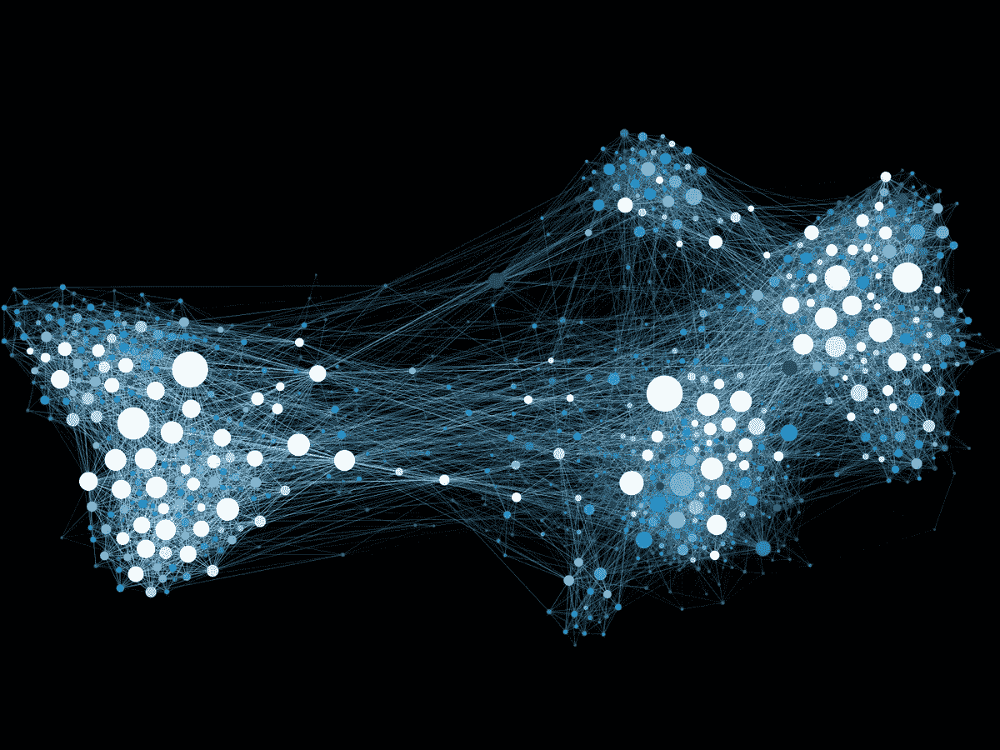

# 模拟 106：使用网络建模信息扩散和社会传染

> 原文：[`towardsdatascience.com/simulation-106-modeling-information-diffusion-and-social-contagion-with-networks-7c1184004889?source=collection_archive---------8-----------------------#2023-09-07`](https://towardsdatascience.com/simulation-106-modeling-information-diffusion-and-social-contagion-with-networks-7c1184004889?source=collection_archive---------8-----------------------#2023-09-07)

## 一种基于图的社会网络信息传播建模方法

 [Le Nguyen](https://medium.com/@ln8378?source=post_page-----7c1184004889--------------------------------)

·

[关注](https://medium.com/m/signin?actionUrl=https%3A%2F%2Fmedium.com%2F_%2Fsubscribe%2Fuser%2Fb34fcbf59198&operation=register&redirect=https%3A%2F%2Ftowardsdatascience.com%2Fsimulation-106-modeling-information-diffusion-and-social-contagion-with-networks-7c1184004889&user=Le+Nguyen&userId=b34fcbf59198&source=post_page-b34fcbf59198----7c1184004889---------------------post_header-----------) 发表在 [Towards Data Science](https://towardsdatascience.com/?source=post_page-----7c1184004889--------------------------------) · 12 min read · 2023 年 9 月 7 日 

--

社交媒体彻底改变了信息的格局。我们比人类历史上任何时候都更紧密地联系在一起。新闻故事能够瞬间传达给我们，想法在几天内传播到全球，但这到底是如何运作的呢？信息如何传播，我们能否对其进行建模？在本文中，我们将探讨信息传播背后的理论，并使用网络对其进行建模。

图 1：[由网络连接的世界的艺术表现](https://commons.wikimedia.org/wiki/File:Social_Network_Visualization.png)。授权依据[知识共享](https://creativecommons.org/licenses/by-sa/4.0/deed.en)。

在这篇文章中，我们将：

+   学习图和网络理论的基础知识

+   概述信息扩散和社会传染

+   构建一个计算框架以模拟思想的传播

# 图与网络

## 什么是图和网络？

一个[图](https://en.wikipedia.org/wiki/Graph_(discrete_mathematics))是一个数学结构，展示了对象之间的关系。它通过将每个对象表示为一个*顶点*，并通过*边*连接其他顶点，从而展示它们之间的关系。
