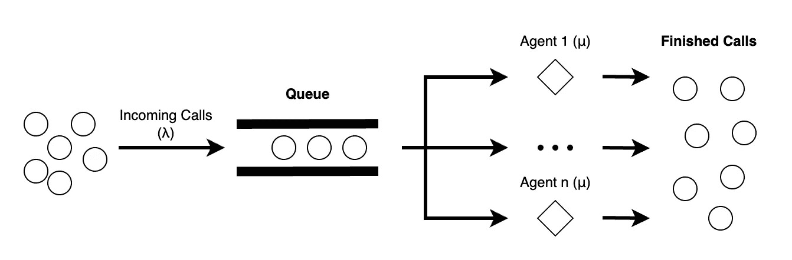

# 仿真优化：帮助我的朋友建模和优化他公司的支持台

> 原文：[`towardsdatascience.com/simulation-optimization-helping-my-friend-model-and-optimize-his-companys-support-desk-be6ae83b4ae3?source=collection_archive---------3-----------------------#2023-12-07`](https://towardsdatascience.com/simulation-optimization-helping-my-friend-model-and-optimize-his-companys-support-desk-be6ae83b4ae3?source=collection_archive---------3-----------------------#2023-12-07)


由 DreamStudio 生成。

## 一个关于创建仿真优化模型以帮助简化支持台人员配置的故事。

[](https://medium.com/@mcw232?source=post_page-----be6ae83b4ae3--------------------------------)[](https://towardsdatascience.com/?source=post_page-----be6ae83b4ae3--------------------------------) [Maxwell Wulff](https://medium.com/@mcw232?source=post_page-----be6ae83b4ae3--------------------------------)

·

[关注](https://medium.com/m/signin?actionUrl=https%3A%2F%2Fmedium.com%2F_%2Fsubscribe%2Fuser%2F548fc755310&operation=register&redirect=https%3A%2F%2Ftowardsdatascience.com%2Fsimulation-optimization-helping-my-friend-model-and-optimize-his-companys-support-desk-be6ae83b4ae3&user=Maxwell+Wulff&userId=548fc755310&source=post_page-548fc755310----be6ae83b4ae3---------------------post_header-----------) 发表在 [Towards Data Science](https://towardsdatascience.com/?source=post_page-----be6ae83b4ae3--------------------------------) ·10 分钟阅读·2023 年 12 月 7 日[](https://medium.com/m/signin?actionUrl=https%3A%2F%2Fmedium.com%2F_%2Fvote%2Ftowards-data-science%2Fbe6ae83b4ae3&operation=register&redirect=https%3A%2F%2Ftowardsdatascience.com%2Fsimulation-optimization-helping-my-friend-model-and-optimize-his-companys-support-desk-be6ae83b4ae3&user=Maxwell+Wulff&userId=548fc755310&source=-----be6ae83b4ae3---------------------clap_footer-----------)

--

[](https://medium.com/m/signin?actionUrl=https%3A%2F%2Fmedium.com%2F_%2Fbookmark%2Fp%2Fbe6ae83b4ae3&operation=register&redirect=https%3A%2F%2Ftowardsdatascience.com%2Fsimulation-optimization-helping-my-friend-model-and-optimize-his-companys-support-desk-be6ae83b4ae3&source=-----be6ae83b4ae3---------------------bookmark_footer-----------)

# 介绍

一开始这是一个相当简单的请求。我的朋友，负责运营和管理一个支持中心，遇到了一些困难。在任何给定的时间，支持台的员工似乎都没有得到有效优化，要么人手过多，要么人手不足。他有相当干净的数据，记录了电话（电话、聊天消息和电子邮件）何时到来、呼叫者在等待中的时间以及对话持续的时间。知道我在运筹学（OR）方面的背景，我的朋友向我介绍了这个问题。我很兴奋——在我的职业生涯中，我不常使用 OR 原理。这是一个让我重新接触我投入了五年时间研究的领域的机会。

运筹学程序的核心是排队理论，这正是一个* m/m/c* 队列的教科书案例（字面意义上）。电话以设定的随机速率进入，一些员工处理来电，所有电话都以设定的随机速率处理，随机速率应遵循指数分布。所以我启动了 Jupyter Notebook，使用 scipy 将指数分布拟合到一些来电和处理时间上。我发现，确实，我们的参数与指数分布非常匹配。



m/m/c 队列。图表由作者提供。

现在，如果我的朋友仅仅想知道他需要多少名员工来支撑他的支持台，有公式可以准确告诉你这个；主要是*Erlang-C*。[[1](https://www.techtarget.com/searchunifiedcommunications/definition/Erlang-C)] 然而，就像任何现实世界的场景一样，当我们开始引入影响这个特定支持中心的众多参数时，这个公式很快就失效了。举几个例子：全天的来电需求波动、员工效率、休息时间、员工需要轮班，等等。因此，这使我转向了**模拟**，这是运筹学的另一个核心内容。

# 模拟

模拟很有用，因为你不受限于特定的公式。你可以利用随机系统的属性，知道任何具有随机输入的系统将会收敛到一个设定的输出——前提是你运行系统足够多次以获得可靠的平均值。系统和数据中的大多数异常情况可以通过调整模拟的部分并将输出与现实世界的训练数据进行匹配来解释。


运行模拟 5 次与 50 次。图表由作者提供。

所以我开始工作。在接下来的几天里，我用 Python 构建了一个支持台的模拟，使用了真实的数据输入。我的模拟的核心部分包括考虑全天的来电时间和代理处理时间的变化，同时还考虑了诸如队列长度和参数变化时工作的代理等组件。现在是决定我们要测量什么的时候了，测量选项有很多。我开始测量代理的利用率和队列的平均长度，但支持中心的主要指标之一是连接时间服务水平协议（SLA）。[[2](https://www.sprinklr.com/cxm/service-level-agreement/)] SLA 本质上是对人们在队列中等待时间的约定目标测量。SLA 的重要性不仅在于作为平均值进行监控，还要作为全天的时间序列进行监控。支持中心希望在短时间内、可预测的时间内接听电话，无论有人何时打电话。

幸运的是，这相对容易。每当我在模拟运行过程中进行测量时，我会检查排队的第一个人等待了多久。知道排队的第一个人等待的时间最长，我们可以知道最大 SLA 仍然得到保持。我们用这些数据创建了训练和验证集，进行了更多的调整，我的朋友有了一个可以用来更改代理人数、来电参数并查看 SLA 变化的工具。不能忽视的是，这部分项目花费了很多时间。


模拟结果与一周滚动平均队列时间的比较。图表由作者提供。

# 优化

在一次公路旅行中，我们讨论了这个工具虽然很有趣，但不一定实用。我的朋友可以输入数字并查看结果，但这并没有使人员配置决策变得更容易，因为它基本上是经过教育的试错法。更有帮助的是一个系统，在这个系统中你可以设置一个全天的目标 SLA，系统会根据可变的来电参数和代理处理时间给出最佳的代理安排。这是运筹学的第三个重要支柱：**优化**。

问题在于，优化需要一个公式来优化，而我们只有一个模拟。然而，我突然意识到没有理由我们不能将模拟用作优化问题的目标函数。它接受一组输入，通过足够多的模拟运行，给出一个可信的输出。幸运的是，30 年前的研究人员也有过相同的想法，并从那时起一直在研究模拟优化领域。这些聪明的人为我做了所有的艰苦工作。[[3](https://people.orie.cornell.edu/shane/pubs/WSC2015TutSlides.pdf), [4](https://www.informs-sim.org/wsc97papers/0118.PDF)]

所以，我再次开始工作。现在，仿真优化的核心是创建一组输入，运行仿真，并以智能的方式选择下一组输入，直到达到目标。我的优化问题看起来像这样：

> 我的目标是制定一个时间表。时间表由班次组成。班次是在仿真“日”中的固定时间段（比如上午 9 点到下午 5 点，上午 10 点到下午 4 点），在这些时间段内，代理可以工作。时间表是所有班次的集合，包括每个班次上工作的代理人数。一个好的时间表是能让 SLA 保持在目标附近，并最小化总工时（工人数 * 班次长度）的时间表。某些班次有员工数量上限（例如，半天早班最多只能有 10 人），每个班次都有一定的休息时间表。SLA 不应超过目标之上的硬性上限（例如，我们的目标是 3 分钟的 SLA，但没有人应等待超过 10 分钟）。

我设置了框架以考虑所有这些约束条件，现在我准备开始优化。仿真优化研究中讨论的一些问题很困难，因为它们的仿真是黑箱，即除了仿真答案外没有任何有用的信号。幸运的是，这个仿真不同。我们在整个仿真“日”中测量排队时间，因此我们可以看到某些班次的表现如何。

> 例如，如果早班的员工比晚班多，但晚班的来电更多，我们可能会发现晚班的目标偏差比早班大。在下一次尝试中，我们可能应该增加晚班的人员数量。

事情并不像这般简单——由于复杂的重叠班次和其他参数会有相互依赖性，但我们可以将任何时间表插入仿真中看看会发生什么。

我们从仿真中得到的这些信号使我得出了明确的策略——梯度。

> 基于梯度的搜索可以理解为一个球滚下山坡，每一步你都试图让球达到一个更低的状态，直到它到达底部。这被一个不均匀的山坡所复杂化。在山坡上会有虚假的底部，你选择的任何方向都会回到山坡上，但真正的底部需要从不同的位置开始滚动。在实际操作中，我们永远无法知道是否到达了真正的底部，但有聪明的方法来确保我们进行足够的测试，以确定我们非常接近。在我们的例子中，球是一个时间表，而山坡的底部是完美的线路，在那里所有的来电等待的时间正好符合目标服务水平协议（SLA）。


由 DreamStudio 生成。

那么，最自然的梯度步骤是什么？取最差的计划（即与目标平均最远的那个），如果平均值高于目标，则在变换中添加一个代理；如果平均值低于目标，则去掉一个代理。如果你陷入了所有变换都使计划变得更差但 SLA 距离目标仍然较远的情况，回到一个以前较好的计划，从那里重新开始。我尝试了其他选择下一个计划的方法，但这种方法最为一致。如何知道何时停止？设定一个容差值，比如说如果每个变换平均距离目标少于 30 秒，则认为问题已解决。如果步数过多则停止，并从模拟出的计划中选择最佳方案。


选择下一个计划。图示由作者提供。

在理想的世界里，我们会永远运行这个程序，尝试每一个计划，直到找到最佳方案，但我们需要这个程序在 5 分钟内选择一个计划。这个项目中最有趣的部分是测试优化算法，以找到能最快得到良好解决方案的算法。

结果最好的解决方案利用了你可以控制模拟运行次数的事实，权衡是运行次数越少，对结果的信心越低。我发现以下方法有效：

> 开始时运行优化算法时，先使用较少的模拟次数，随着目标接近，逐渐增加模拟次数。这是因为在开始阶段，许多的变换会将计划朝着目标方向推进，因此在选择方向时不需要特别有信心。随着一个较好的解决方案逐渐接近，计划的走向变得更加重要。将此与从相同起始点开始的分层运行相结合，以确保探索到更广泛的解决方案。

这种方法的优点是我能够控制算法的运行时间。我可以查看模拟运行所需的时间，并相应地调整迭代次数，我还可以选择从起始点开始的次数。每台运行此算法的机器操作会略有不同，一致的算法运行时间对于确保该项目在实际应用中的有效性至关重要。


优化运行的结果。图示由作者提供。

```py
#schedule is {(start_time, end_time): num_agents}

{'Schedule': 
  {(0, 540): 5,
   (30, 570): 2,
   (60, 600): 1,
   (90, 630): 1,
   (120, 660): 4,
   (150, 690): 1,
   (180, 720): 0,
   (210, 750): 1,
   (240, 780): 18,
   (0, 660): 0,
   (30, 690): 0,
   (60, 720): 0,
   (90, 750): 0,
   (120, 780): 3}
'Average Wait': 0.5738814985851588
'Worker Units': 660.0
'Worst Shift Time In Queue, Relative to Target': 0.5965600329117189}
```

# 结论

现在我的朋友有一个程序，可以根据他的输入和约束条件为他建立一个时间表。目前尚不清楚这个程序的实际表现如何。我们需要等待收集足够的数据来评估时间表和仿真的准确性。现实世界中会有我们没有考虑到的因素，比如人们生病或度假。但仿真的一个好处是我们可以在以后添加未考虑到的内容。这样不会需要大规模的项目重做。我们只需在需要的地方插入更改即可。

这个项目最重要的部分之一是每个部分都可以独立工作，且非常模块化。我们可以将任何不规则的情况建模并纳入仿真中。许多作业项目因为解决方案的僵化而未能脱离课堂。在我看来，这个项目特别有用，因为它的灵活性和重做能力。现实世界在不断变化，技术解决方案应能够适应以保持相关性。


一个集装箱港口是一个模块化系统。照片由[CHUTTERSNAP](https://unsplash.com/@chuttersnap?utm_content=creditCopyText&utm_medium=referral&utm_source=unsplash)提供，刊登于[Unsplash](https://unsplash.com/photos/aerial-view-of-intermodal-containers-xewrfLD8emE?utm_content=creditCopyText&utm_medium=referral&utm_source=unsplash)。

# 最终想法

非常感谢 Jeremy Harper，项目中的朋友。

这个项目激发了我对这个领域的兴趣，我希望能尝试其他不同的问题。如果你有一个需要建模、仿真和优化的现实世界问题，我很愿意了解，并可能在这个领域进一步合作。[我的 LinkedIn](https://www.linkedin.com/in/maxwell-wulff-1b5849123/)。

# 参考文献

1\. Rahul Awati, [Erlang C](https://www.techtarget.com/searchunifiedcommunications/definition/Erlang-C)，techtarget.com

2\. Naveen Mahadevan, [服务水平协议](https://www.sprinklr.com/cxm/service-level-agreement/) (2022)，sprinklr.com

3\. N. Jian, S. Henderson, [仿真优化导论](https://people.orie.cornell.edu/shane/pubs/WSC2015TutSlides.pdf) (2015)，冬季仿真会议

4\. Y. Carlson, A. Maria, [仿真优化：方法与应用](https://www.informs-sim.org/wsc97papers/0118.PDF) (1997)，冬季仿真会议
