# 奇异值分解（SVD）揭秘

> 原文：[`towardsdatascience.com/singular-value-decomposition-svd-demystified-57fc44b802a0`](https://towardsdatascience.com/singular-value-decomposition-svd-demystified-57fc44b802a0)

## 一份包含 Python 示例的 SVD 综合指南

[](https://medium.com/@roiyeho?source=post_page-----57fc44b802a0--------------------------------)[](https://towardsdatascience.com/?source=post_page-----57fc44b802a0--------------------------------) [Dr. Roi Yehoshua](https://medium.com/@roiyeho?source=post_page-----57fc44b802a0--------------------------------)

·发表于 [Towards Data Science](https://towardsdatascience.com/?source=post_page-----57fc44b802a0--------------------------------) ·阅读时间 19 分钟·2023 年 11 月 8 日

--

奇异值分解（SVD）是一种强大的矩阵因式分解技术，将矩阵分解成三个其他矩阵，从而揭示了原始矩阵的重要结构特征。它在信号处理、图像压缩以及机器学习中的降维等广泛应用中都发挥了作用。

这篇文章提供了计算矩阵奇异值分解的逐步指南，包括详细的数值示例。随后，文章演示了如何使用奇异值分解进行降维，并使用 Python 示例说明了这一过程。最后，文章讨论了奇异值分解的各种应用及其一些局限性。

文章假设读者具有基础的线性代数知识。具体来说，读者应该熟悉诸如向量和矩阵范数、矩阵的秩、特征分解（特征向量和特征值）、正交归一向量和线性投影等概念。


图片由 [Peggy und Marco Lachmann-Anke](https://pixabay.com/users/peggy_marco-1553824/?utm_source=link-attribution&utm_medium=referral&utm_campaign=image&utm_content=1027571) 提供，来源于 [Pixabay](https://pixabay.com//?utm_source=link-attribution&utm_medium=referral&utm_campaign=image&utm_content=1027571)

# 数学定义

一个 *m* × *n* 实数矩阵 *A* 的奇异值分解是形式为 *A* = *U*Σ*Vᵗ* 的因式分解，其中：

+   *U* 是一个 *m* × *m* **正交矩阵**（即，其列和行是正交归一的向量）。*U* 的列被称为 *A* 的 **左奇异** **向量**。

+   Σ 是一个 *m* × *n* 的矩形对角矩阵，对角线上有非负实数。对角线条目 *σᵢ* = Σ*ᵢᵢ* 被称为 *A* 的**奇异值**，通常按降序排列，即 *σ*₁ *≥ σ*₂ *≥ … ≥ σₙ ≥* 0。非零奇异值的数量等于 *A* 的秩。

+   *V* 是一个 *n* × *n* 的正交矩阵。*V* 的列称为 *A* 的**右奇异向量**。

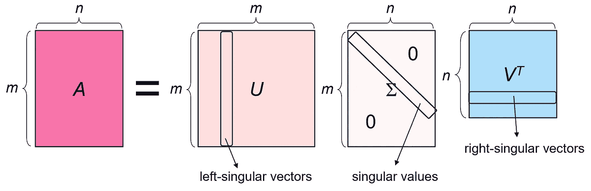

矩阵的 SVD

每个矩阵都有一个奇异值分解（此声明的证明可以在[这里](https://en.wikipedia.org/wiki/Singular_value_decomposition#Proof_of_existence)找到）。这与特征值分解不同，例如，特征值分解仅适用于平方对角化矩阵。

# 计算 SVD

矩阵 *A* 的奇异值分解可以通过以下观察来计算：

1.  *A* 的左奇异向量是一组 *AAᵗ* 的正交特征向量。

1.  *A* 的右奇异向量是一组 *AᵗA* 的正交特征向量。

1.  *A* 的非零奇异值是 *AᵗA* 和 *AAᵗ* 的非零特征值的平方根。

1.  如果 *U*Σ*Vᵗ* 是 *A* 的 SVD，那么对于每个奇异值 *σᵢ*，


其中 **u***ᵢ* 是 *U* 的第 *i* 列，**v***ᵢ* 是 *V* 的第 *i* 列。

**证明**：

1.  我们将首先证明 *A* 的左奇异向量是一组 *AAᵗ* 的正交特征向量。

设 *A* = *U*Σ*Vᵗ* 为 *A* 的 SVD，接下来检查 *AAᵗ* 的乘积：

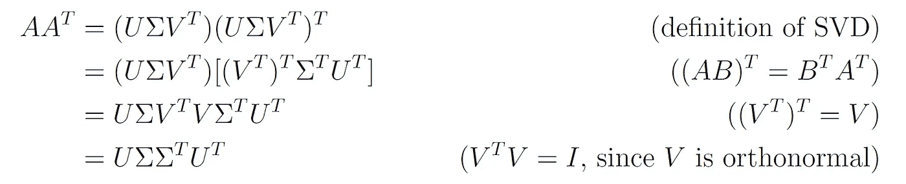

由于 Σ 是一个对角矩阵，对角线上有奇异值 *σᵢ*，ΣΣ*ᵗ* 也是一个对角矩阵，其中每个对角元素是 *σᵢ*²。我们用 Σ² 来表示这个矩阵。这给我们带来了：


由于 *U* 是正交的，*UᵗU* = *I*，通过将方程的两边右乘 *U*，我们得到：


现在考虑 *U* 的一列，记作 **u***ᵢ*。由于 *ABᵢ* = [*AB*]*ᵢ*（即矩阵 *A* 乘以矩阵 *B* 的第 *i* 列等于它们的积 *AB* 的第 *i* 列），我们可以写出：


因此，**u***ᵢ* 是 *AAᵗ* 的一个特征向量，对应于特征值

*λᵢ* = *σᵢ*²。换句话说，*U* 的列是 *AAᵗ* 的特征向量。由于 *U* 的列是正交的，*A* 的左奇异向量（*U* 的列）是 *AAᵗ* 的一组正交向量。

2\. 以类似的方式，我们可以证明 *A* 的右奇异向量是一组 *AᵗA* 的正交特征向量。

3\. 我们首先注意到*AAᵗ*是对称且半正定的。因此，它的所有特征值都是实数且非负的，并且有一组完整的正交特征向量。设{**u**₁, …, **u***ₙ*}为对应特征值*λ*₁ *≥ λ*₂ *≥ … ≥ λₙ ≥* 0 的*AAᵗ*的正交特征向量。对于任何特征值为*λᵢ*的*AAᵗ*的特征向量**u***ᵢ*，我们有：


因此，*A*的奇异值是*AAᵗ*特征值的平方根。

类似地，我们可以证明*A*的奇异值也是*AᵗA*特征值的平方根。

4\. 留给读者作为练习。

根据上述观察，我们可以使用以下步骤计算一个*m* × *n*矩阵*A*的 SVD。

1.  构造矩阵*AᵗA*。

1.  计算*AᵗA*的特征值和特征向量。特征值将是*A*的奇异值的平方，特征向量将形成矩阵*V*在 SVD 中的列。

1.  将矩阵*A*的奇异值按降序排列。创建一个*m* × *n* 的对角矩阵Σ，奇异值放在对角线上，如有必要可填充零，以使矩阵与*A*具有相同的维度。

1.  将*AᵗA*的特征向量归一化为单位长度，并将它们作为矩阵*V*的列。

1.  对于每个奇异值*σᵢ*，计算相应的左奇异向量**u***ᵢ*为：


其中**v***ᵢ*是*V*的第*i*列。将这些向量作为列放入矩阵*U*中。

如果*n* < *m* 或*A*是秩亏的（即，rank(*A*) < min(*m*, *n*）），那么没有足够的非零奇异值来确定*U*的列。在这种情况下，我们需要通过找到额外的正交向量来完成*U*，这些向量生成*Aᵗ*的零空间（核）。

*Aᵗ*的**零空间**，记作*N*(*Aᵗ*），是满足*Aᵗ***x** = **0**的向量**x**的集合，这些向量也是*AAᵗ*的特征值为 0 的特征向量（因为*Aᵗ**x** = 0⋅**x**）。要找到*N*(*Aᵗ*)的正交基，我们首先解齐次线性系统*Aᵗ***x** = **0**以找到*N*(*Aᵗ*)的基，然后对这组基向量应用[Gram-Schmidt 过程](https://en.wikipedia.org/wiki/Gram%E2%80%93Schmidt_process)使它们正交，最后将它们归一化为单位向量。

找到*A*的左奇异向量（*U*的列）的另一种方法是计算*AAᵗ*的特征向量，但这种方法通常比使用左奇异向量和右奇异向量之间的关系（观察 4）以及计算*Aᵗ*的零空间（如有必要）更耗时。

请注意，也可以通过找到左奇异向量（即*AAᵗ*的特征向量）来开始 SVD 计算，然后使用以下关系找到右奇异向量：


选择使用 *AAᵗ* 或 *AᵗA* 取决于哪个矩阵较小。

## 数值示例

例如，让我们计算以下矩阵的 SVD：


设 *U*Σ*Vᵗ* 为 *A* 的奇异值分解（SVD）。*A* 的维度是 3 × 2\. 因此，*U* 的大小是 3 × 3，Σ 的大小是 3 × 2，而 *V* 的大小是 2 × 2。

由于 *AᵗA* (2 × 2) 的大小小于 *AAᵗ* (3 × 3) 的大小，因此从 *A* 的右奇异向量开始是有意义的。

我们首先计算 *AᵗA*：


我们现在找到 *AᵗA* 的特征值和特征向量。矩阵的特征多项式为：


这个多项式的根是：


*AᵗA* 的特征值按降序排列为 *λ*₁ *=* 9 和 *λ*₂ = 1\. 因此，*A* 的奇异值为 *σ*₁ = 3 和 *σ*₂ = 1，矩阵 Σ 为：


我们现在通过找到 *AᵗA* 的一组正交标准特征向量来找到右奇异向量（*V* 的列）。

对应于 *λ*₁ *=* 9 的特征向量是：

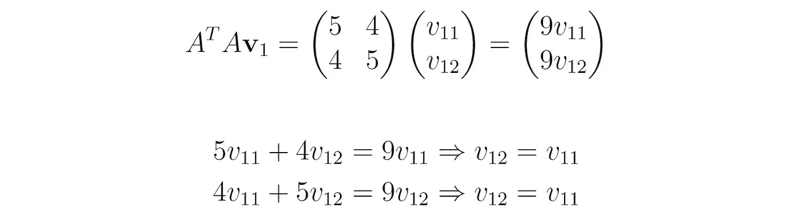

因此，特征向量的形式为 **v**₁ = (*t*, *t*)。为了得到单位长度的特征向量，我们需要：


因此，对应于 *λ*₁ =9 的单位特征向量是：


同样，对应于 *λ*₂ = 1 的特征向量是：

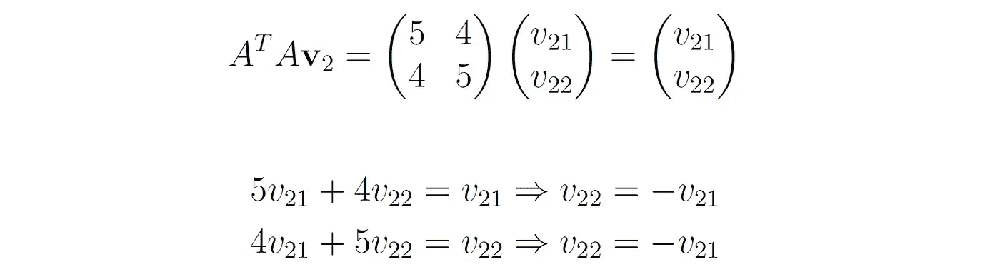

因此，特征向量的形式为 **v**₂ = (*t*, *t*)。为了得到单位长度的特征向量，我们需要


因此，*λ*₂=1 对应的单位特征向量是：


我们现在可以写出矩阵 *V*，其列为向量 **v**₁ 和 **v**₂：


最后，我们找到 *A* 的左奇异向量。从观察 4 中可以得出：

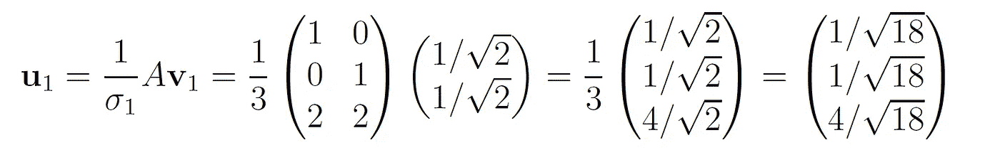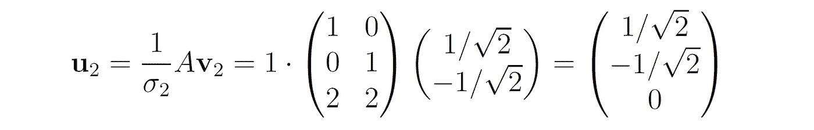

由于只剩下一个 *U* 的列向量，我们可以直接找到一个垂直于 **u**₁ 和 **u**₂ 的单位向量，而不是计算 *Aᵗ* 的核。

设 **u**₃ = (*a*, *b*, *c*)。为了垂直于 **u**₂，我们需要 *a* = *b*。然后条件 **u**₃*ᵗ***u**₁ = 0 变为


因此，


为了使向量长度为单位，我们需要


因此，


而矩阵 *U* 为：


*A* 的最终完整 SVD 为：

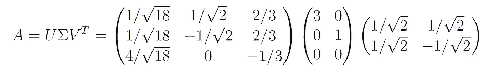

## 使用 NumPy 计算 SVD

要使用 numpy 计算矩阵的 SVD，可以调用函数 `[np.linalg.svd](https://numpy.org/doc/stable/reference/generated/numpy.linalg.svd.html)`。给定一个形状为 (*m*，*n*) 的矩阵 *A*，该函数返回一个元组 (*U*，*S*，*Vᵗ*)，其中 *U* 是一个形状为 (*m*，*m*) 的矩阵，包含左奇异向量在其列中，*S* 是一个大小为 *k* = min(*m*，*n*) 的向量，包含按降序排列的奇异值，而 *Vᵗ* 是一个形状为 (*n*，*n*) 的矩阵，包含右奇异向量在其行中。

例如，使用这个函数来计算之前示例中矩阵的 SVD：

```py
import numpy as np

A = np.array([[1, 0], [0, 1], [2, 2]])
np.linalg.svd(A)
```

我们得到的输出是：

```py
(array([[-2.35702260e-01,  7.07106781e-01, -6.66666667e-01],
        [-2.35702260e-01, -7.07106781e-01, -6.66666667e-01],
        [-9.42809042e-01, -1.11022302e-16,  3.33333333e-01]]),
 array([3., 1.]),
 array([[-0.70710678, -0.70710678],
        [ 0.70710678, -0.70710678]]))
```

这是我们通过手动计算得到的相同 SVD 分解，只是符号有所不同（例如，*U* 的第一列方向已翻转）。这表明，矩阵的 SVD 分解不是完全唯一的。虽然奇异值本身是唯一的，但相关的奇异向量（即 *U* 和 *V* 的列）由于以下原因不是严格唯一的：

1.  如果奇异值重复，则可以选择任何正交归一集来填满相关的特征空间。

1.  即使奇异值不同，对应的奇异向量也可以乘以 -1（即，它们的方向可以被翻转），仍然可以形成有效的 SVD。

# 紧凑 SVD

紧凑奇异值分解是完整 SVD 的简化形式，仅保留非零奇异值及其对应的奇异向量。

正式来说，一个 *m* × *n* 矩阵 *A* 的紧凑 SVD（秩为 *r*（*r* ≤ min{*m*，*n*}））的分解形式是 *A* = *Uᵣ*Σ*ᵣVᵣᵗ*，其中：

+   *Uᵣ* 是一个 *m* × *r* 的矩阵，其列是 *A* 的前 *r* 个左奇异向量。

+   Σ*ᵣ* 是一个 *r* × *r* 的对角矩阵，对角线上是 *r* 个非零奇异值。

+   *Vᵣ* 是一个 *n* × *r* 的矩阵，其列是 *A* 的前 *r* 个右奇异向量。

例如，我们之前示例中的矩阵的秩为 2，因为它有两个非零奇异值。因此，它的紧凑 SVD 分解为：

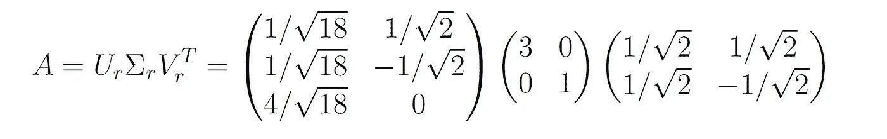

矩阵 *Uᵣ*、Σ*ᵣ* 和 *Vᵣ* 仅包含重构矩阵 *A* 所需的基本信息。紧凑 SVD 可以显著节省存储和计算，尤其是对于具有许多零奇异值的矩阵（即，当 *r* << min{*m*，*n*}）。

# 截断 SVD

截断（简化）SVD 是 SVD 的一种变体，用于用较低秩的矩阵来近似原始矩阵 *A*。

要创建一个具有秩 *r* 的矩阵 *A* 的截断 SVD，我们仅取前 *k* < *r* 个最大奇异值及其对应的奇异向量（*k* 是一个参数）。这给出了原矩阵 *Aₖ* 的近似，即 *Aₖ* = *Uₖ*Σ*ₖVₖᵗ*，其中：

+   *Uₖ* 是一个 *m* × *k* 的矩阵，其列是 *A* 的前 *k* 个左奇异向量，对应于 *k* 个最大的奇异值。

+   Σ*ₖ* 是一个 *k* × *k* 的对角矩阵，对角线上是 *k* 个最大的奇异值。

+   *Vₖ* 是一个 *n* × *k* 的矩阵，其列是 *A* 的前 *k* 个右奇异向量，对应于 *k* 个最大的奇异值。

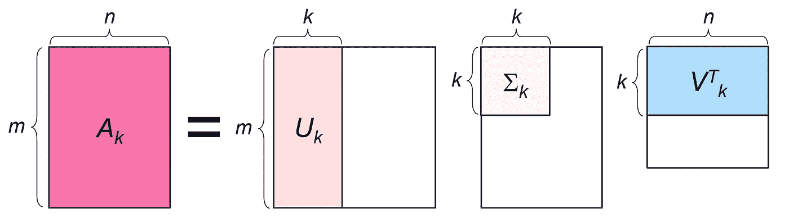

截断 SVD

例如，我们可以通过仅取最大单一值及其对应向量，将前面例子的矩阵截断到秩 *k* = 1：

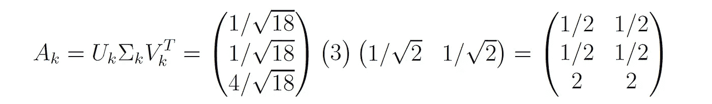

在 NumPy 中，可以使用以下代码片段轻松计算截断 SVD：

```py
U, S, Vt = np.linalg.svd(A)

k = 1  # target rank
U_k = U[:, :k]
S_k = np.diag(S[:k])
Vt_k = Vt[:k, :]

A_k = U_k @ S_k @ Vt_k
A_k
```

```py
array([[0.5, 0.5],
       [0.5, 0.5],
       [2\. , 2\. ]])
```

截断 SVD 特别有效，因为截断矩阵 *Aₖ* 在 Frobenius 范数（最小二乘差异）和 2-范数方面都是矩阵 *A* 的最佳秩-*k* 近似，即：


这个结果被称为**Eckart-Young-Mirsky 定理**或矩阵近似引理，其证明可以在这个[维基百科页面](https://en.wikipedia.org/wiki/Low-rank_approximation)中找到。

*k* 的选择控制了近似精度与表示紧凑性之间的权衡。较小的 *k* 会导致矩阵更紧凑，但近似更粗糙。在实际数据矩阵中，只有非常小的奇异值较大。在这种情况下，*Aₖ* 通过保留少量较大的奇异值，可以很好地近似 *A*。

## 截断 SVD 降维

使用截断 SVD，也可以减少数据矩阵 *A* 的维度（特征）。为了将 *A* 的维度从 *n* 降到 *k*，我们将矩阵行投影到由前 *k* 个右奇异向量张成的空间。这是通过将原始数据矩阵 *A* 乘以矩阵 *Vₖ* 来完成的：


降维矩阵现在具有 *n* × *k* 的维度，并包含原始数据在 *k* 维子空间上的投影。它的列是降维空间中的新特征。这些特征是原始特征的线性组合，并且彼此正交。

使用我们之前的例子，我们可以将数据矩阵 *A* 的维度从 2 降到 1，如下所示：


另一种计算降维矩阵的方法基于以下观察：


*证明*：*A* 的完整 SVD 是 *A* = *U*Σ*Vᵗ*，因此 *AV* = *U*Σ。通过比较方程两边的 *j* 列，我们得到：


因此，*AVₖ* 的所有列都等于 *Uₖ*Σ*ₖ* 的所有列，因此这两个矩阵必须相等。

使用 *Uₖ*Σ*ₖ* 是计算降维矩阵的更高效的方法，因为它只需乘以 *m* × *k* 和 *k* × *k* 的矩阵，而不是 *m* × *n* 和 *n* × *k* 的矩阵（*k* 通常比 *n* 小得多）。

在我们之前的例子中：

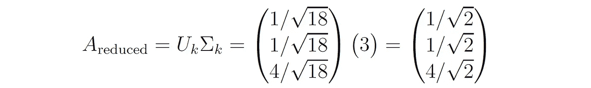

使用截断 SVD 进行降维通常作为机器学习任务（如分类或聚类）之前的数据预处理步骤，这有助于处理[维度灾难](https://medium.com/ai-made-simple/what-is-the-curse-of-dimensionality-b9b4b81a25c5)，减少计算成本，并可能提高机器学习算法的性能。

要对训练完成后的新数据点（例如测试集中的样本）进行降维，我们只需将它们投影到 *A* 的前 *k* 个右奇异向量张成的相同子空间上：


请记住，我们的惯例是将每个向量 **x** 表示为列向量，而数据点以 *A* 的行形式存储，这就是为什么我们用 *Vₖᵗ* 左乘 **x** 而不是右乘 *Vₖ*。

## 重建误差

评估降维技术效果的一个关键指标叫做**重建误差**。它提供了一个定量衡量降维过程导致信息丢失的指标。

要测量特定向量的重建误差，我们首先将其投影回由 *m* 个右奇异向量张成的原始空间。这是通过将 *Vₖ* 乘以降维后的向量来完成的：


然后我们将重建误差测量为向量重建组件与原始组件之间的均方误差（MSE）：


我们还可以通过将降维后的矩阵行投影回由 *m* 个右奇异向量张成的原始空间来测量整个矩阵 *A* 的重建误差。这是通过将降维后的 *A* 乘以 *Vₖ* 的转置来完成的：


然后，我们可以使用重建矩阵与原始元素之间的均方误差（MSE）或两个矩阵之间差异的弗罗贝纽斯范数：


例如，我们之前示例中降维矩阵的重建矩阵是：

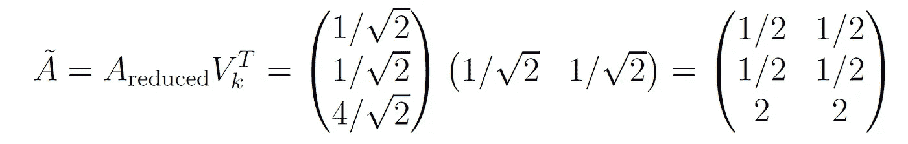

重建误差为：


## Scikit-Learn 中的截断 SVD

Scikit-Learn 提供了 `sklearn.decomposition.TruncatedSVD` 类的高效实现。其重要参数包括：

+   `n_components`：输出数据的期望维度数量（默认为 2）。

+   `algorithm`：要使用的 SVD 求解器。可以是以下选项之一：

    1\. `‘arppack’` 使用[ARPACK 包装器](https://docs.scipy.org/doc/scipy/tutorial/arpack.html)在 SciPy 中计算*AAᵗ*或*AᵗA*的特征分解（以更高效的方式）。ARPACK 是一个迭代算法，能高效地计算大稀疏矩阵的几个特征值和特征向量。

    2\. `‘randomized’`（默认）使用基于 Halko 等人算法的快速随机 SVD 求解器[1]。

+   `n_iter`：随机 SVD 求解器的迭代次数（默认为 5）。

例如，让我们演示如何在之前示例中的矩阵上使用此类：

```py
from sklearn.decomposition import TruncatedSVD

svd = TruncatedSVD(n_components=1, random_state=0)
A_reduced = svd.fit_transform(A)
A_reduced
```

我们得到的输出是减少后的矩阵：

```py
array([[0.70710678],
       [0.70710678],
       [2.82842712]])
```

# 示例：图像压缩

奇异值分解可用于图像压缩。尽管图像矩阵通常是满秩的，但其较低的秩通常具有非常小的奇异值。因此，截断 SVD 可以显著减少图像大小，而不会丢失太多信息。

例如，我们将演示如何使用截断 SVD 压缩以下图像：


作者拍摄的照片

我们首先使用函数`[matplotlib.pyplot.imread](https://matplotlib.org/stable/api/_as_gen/matplotlib.pyplot.imread.html)`将图像加载到 NumPy 数组中：

```py
import matplotlib.pyplot as plt

image = plt.imread('image.jpg')
```

图像的形状为：

```py
image.shape
```

```py
(1600, 1200, 3)
```

图像的高度为 1600 像素，宽度为 1200 像素，具有 3 个颜色通道（RGB）。

由于 SVD 仅适用于二维数据，我们可以分别对每个颜色通道执行它，或者通过将每个颜色通道展平并水平（或垂直）堆叠，将图像从 3D 矩阵重塑为 2D 矩阵。

例如，以下代码片段通过水平堆叠颜色通道将图像重塑为 2D 矩阵：

```py
height, width, channels = image.shape
flat_image = image.reshape(-1, width * channels)
```

展平图像的形状为：

```py
flat_image.shape
```

```py
(1600, 3600)
```

图像矩阵的秩为：

```py
np.linalg.matrix_rank(flat_image)
```

```py
1600
```

矩阵是满秩的（因为 min(1600, 3600) = 1600）。

让我们绘制矩阵的前 100 个奇异值：

```py
U, S, Vt = np.linalg.svd(flat_image)

k = 100
plt.plot(np.arange(k), S[:k])
plt.xlabel('Rank of singular value')
plt.ylabel('Magnitude of singular value')
```

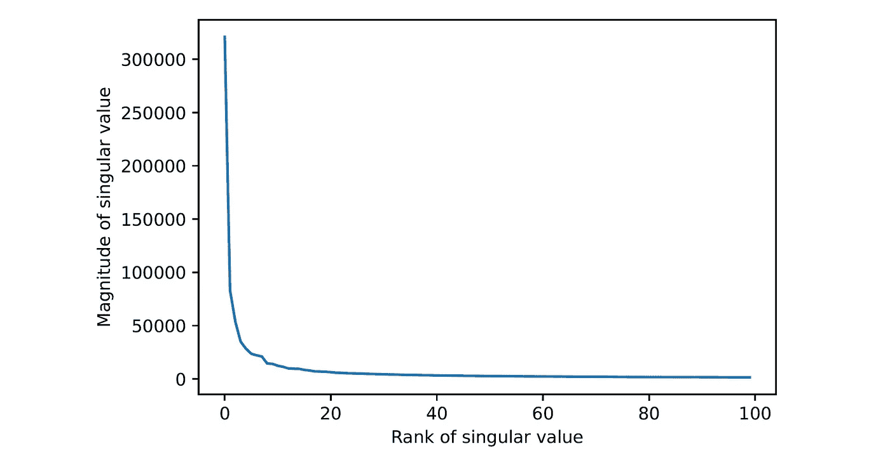

图像中的前 100 个奇异值

我们可以清楚地看到奇异值的快速衰减。这种衰减意味着我们可以有效地截断图像，而不会显著损失精度。

例如，让我们使用 Truncated SVD 将图像截断到秩为 100：

```py
svd = TruncatedSVD(n_components=100)
truncated_image = svd.fit_transform(flat_image)
```

截断图像的形状为：

```py
truncated_image.shape
```

```py
(1600, 100)
```

截断图像的大小仅为原始图像的 100/3600 = 2.78%！

要查看压缩中丢失了多少信息，我们可以测量图像的**重建误差**。我们将重建误差测量为原始图像与重建图像之间像素值的均方误差（MSE）。

在 Scikit-Learn 中，可以通过调用`TruncatedSVD`转换器的`inverse_transform`方法来获得重建图像：

```py
reconstructed_image = svd.inverse_transform(truncated_image)
```

因此，重建误差为：

```py
reconstruction_error = np.mean(np.square(reconstructed_image - flat_image))
reconstruction_error
```

```py
29.323291415822336
```

因此，原始图像和重建图像之间的像素强度的均方根误差（RMSE）只有大约 5.41（相对于像素范围[0, 255]来说很小）。

要显示重建图像，我们首先需要将其重新塑造成原始的 3D 形状，然后将像素值剪裁到[0, 255]范围内的整数：

```py
reconstructed_image = reconstructed_image.reshape(height, width, channels)
reconstructed_image = np.clip(reconstructed_image, 0, 255).astype('uint8')
```

我们现在可以使用`plt.imshow`函数显示图像：

```py
plt.imshow(reconstructed_image)
plt.axis('off')
```


重建图像

我们可以看到，排名为 100 的重建仅丢失了少量细节。

让我们将上述所有步骤放入一个函数中，该函数将给定的 3D 图像压缩到指定数量的维度，然后重建它：

```py
def compress_image(image, n_components=100):   
    # Reshape the 3D image into a 2D array by stacking the color channels horizontally
    height, width, channels = image.shape
    flat_image = image.reshape(-1, width * channels)

    # Truncate the image using SVD
    svd = TruncatedSVD(n_components=n_components)  
    truncated_image = svd.fit_transform(flat_image)

    # Recover the image from the reduced representation
    reconstructed_image = svd.inverse_transform(truncated_image)

    # Reshape the image to the original 3D shape
    reconstructed_image = reconstructed_image.reshape(height, width, channels)

    # Clip the output to integers in the range [0, 255]
    reconstructed_image = np.clip(reconstructed_image, 0, 255).astype('uint8')
    return reconstructed_image
```

我们现在可以用不同数量的组件调用这个函数，并检查重建结果：

```py
fig, axes = plt.subplots(1, 5, figsize=(10, 50))
plt.setp(axes, xticks=[], yticks=[])  # Remove axes from the subplots

for i, k in enumerate([5, 10, 20, 50, 100]):
    output_image = compress_image(image, k)    
    axes[i].imshow(output_image)
    axes[i].set_title(f'$k$ = {k}')
```

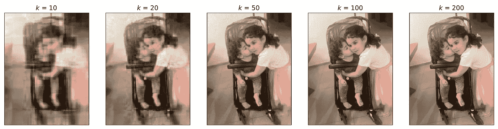

不同排名的 SVD 重建

正如我们所见，使用过低的排名，如*k* = 10，可能会导致信息的显著丢失，而排名为 200 的 SVD 几乎与全秩图像不可区分。

除了压缩图像，SVD 还可以用来去除图像中的噪声。这是因为丢弃图像的低阶成分倾向于去除细小的噪声元素，同时保留图像中更重要的部分。

# SVD 的应用

SVD 被应用于许多类型的应用程序中，它有助于揭示观察数据的潜在特征。示例包括：

1.  [潜在语义分析](https://en.wikipedia.org/wiki/Latent_semantic_analysis)（LSA）是自然语言处理中的一种技术，它通过使用 SVD 减少文本数据的维度，从而揭示词语和文本文档之间的潜在关系。

1.  在推荐系统中，SVD 用于分解用户-项目交互矩阵，揭示有关用户偏好和项目属性的潜在特征，从而帮助预测算法做出更准确的推荐。

1.  SVD 可以用来高效计算[摩尔-彭若斯伪逆](https://en.wikipedia.org/wiki/Moore%E2%80%93Penrose_inverse)，这在矩阵不可逆的情况下使用，例如计算线性方程组的最小二乘解而该方程组没有解。

# SVD 的局限性

SVD 有几个局限性，包括：

1.  计算可能会非常密集，特别是对于大矩阵。SVD 的标准（非随机化）实现的运行时间复杂度为*O*(*mn*²)，如果*m* ≥ *n*，或者为*O*(*m*²*n*)，如果*m* < *n*。

1.  需要将整个数据矩阵存储在内存中，这使得它在非常大的数据集或实时应用中不切实际。

1.  假设数据内部的关系是线性的，这意味着 SVD 可能无法捕捉变量（特征）之间更复杂的非线性交互。

1.  从 SVD 获得的潜在特征通常不容易解释。

1.  标准 SVD 无法处理缺失数据，这意味着需要某种形式的填补，这可能会引入数据偏差。

1.  当新数据到达时，没有简单的方法可以逐步更新 SVD，这在数据频繁变化的动态系统中（如实时推荐系统）是必需的。

# 最后的说明

除非另有说明，所有图片均由作者提供。

你可以在我的 GitHub 上找到本文的代码示例：[`github.com/roiyeho/medium/tree/main/svd`](https://github.com/roiyeho/medium/tree/main/svd)。

感谢阅读！

## 参考文献

[1] Halko, N., Martinsson, P. G., & Tropp, J. A. (2011). Finding structure with randomness: Probabilistic algorithms for constructing approximate matrix decompositions. *SIAM review*, 53(2), 217–288。

[2] 奇异值分解，*维基百科，自由百科全书，* [`en.wikipedia.org/wiki/Singular_value_decomposition`](https://en.wikipedia.org/wiki/Singular_value_decomposition)。
