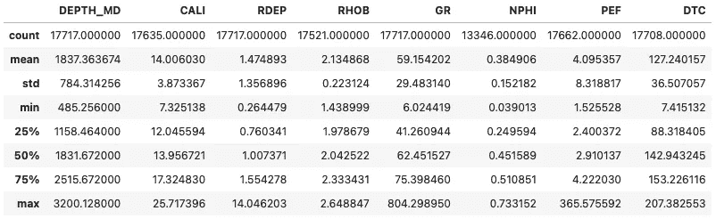
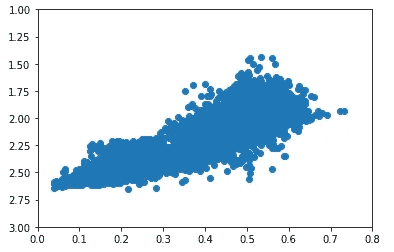
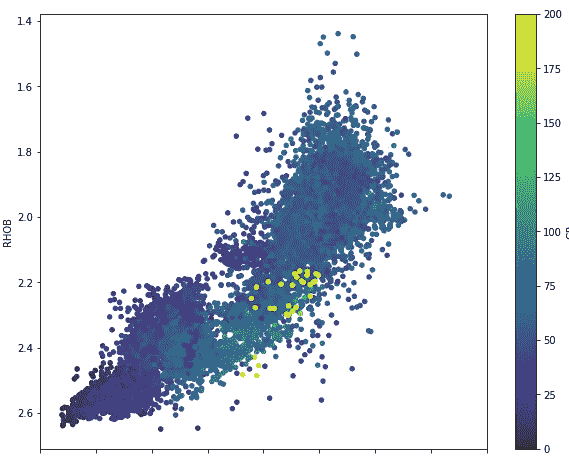

# Sketch: 一个有前景的 AI 库，帮助直接在 Jupyter 中处理 Pandas 数据框

> 原文：[`towardsdatascience.com/sketch-a-promising-ai-library-to-help-with-pandas-dataframes-directly-in-jupyter-5162c32c66ef`](https://towardsdatascience.com/sketch-a-promising-ai-library-to-help-with-pandas-dataframes-directly-in-jupyter-5162c32c66ef)

## 在 Jupyter Notebook 中利用 AI 的力量

[](https://andymcdonaldgeo.medium.com/?source=post_page-----5162c32c66ef--------------------------------)[](https://towardsdatascience.com/?source=post_page-----5162c32c66ef--------------------------------) [Andy McDonald](https://andymcdonaldgeo.medium.com/?source=post_page-----5162c32c66ef--------------------------------)

·发布于[Towards Data Science](https://towardsdatascience.com/?source=post_page-----5162c32c66ef--------------------------------) ·阅读时间 7 分钟·2023 年 2 月 21 日

--


[来自 Pexels 的照片，作者：Tara Winstead](https://www.pexels.com/photo/robot-pointing-on-a-wall-8386440/)

最近几个月，利用 AI 和大型语言模型创建类似于 ChatGPT 的互动聊天机器人受到广泛关注。我们能够直接从 Python 库中在 Jupyter Notebook 中使用这些模型的能力只是时间问题。

一款最近推出的 Python 库 Sketch 将 AI 编码助手直接带到 Python，并可以在 Jupyter 笔记本和 IDE 中轻松使用。该库旨在让用户更容易理解和探索存储在[pandas](https://pandas.pydata.org/)数据框中的数据，而无需额外的插件。

Sketch 库可以快速总结存储在数据框中的数据。它通过使用近似算法（称为数据草图）创建数据摘要，然后将生成的摘要传递给大型语言模型来实现。

通过自然语言输入和可用的功能，我们可以探索我们的数据集。这在很多方面都很有帮助，例如：

+   为非编码用户创建一个应用程序以探索数据

+   快速获取创建图表和管理数据的代码

你可以在 PyPi 上找到更多关于这个库的信息：

[](https://pypi.org/project/sketch/?source=post_page-----5162c32c66ef--------------------------------) [## sketch

### Sketch 是一个 AI 代码编写助手，专为 pandas 用户设计，理解你数据的上下文，大大提高了…

pypi.org](https://pypi.org/project/sketch/?source=post_page-----5162c32c66ef--------------------------------)

在本文中，我们将探索 sketch 中的两个可用函数：`.ask`和`.howto`函数。这些函数允许我们用自然语言提问有关数据框的问题以及如何操作它们，而不是使用内建的 pandas 函数。

***在撰写本文时，Sketch 库仅有几个月大，版本为 0.3.5，仍在积极开发中。***

# 导入库和数据

第一步是将 sketch 和[pandas](https://pandas.pydata.org/)导入到我们的笔记本中。

```py
import sketch
import pandas as pd
```

接下来，我们将使用 pandas 的`read_csv`函数从 CSV 文件中加载数据。在此函数中，我们将传递文件位置和名称。

```py
df = pd.read_csv('Data/Xeek_Well_15-9-15.csv')
```

当数据加载完成后，我们可以通过调用`df`来检查其内容。


包含井测量数据的 Pandas 数据框。图片由作者提供。

现在我们已经加载了数据，可以开始在笔记本中使用 sketch 了。

在导入 sketch 之后，将有三个新的函数附加到数据框对象上。这些函数是`df.ask()`、`df.howto()`和`df.apply()`。在本文中，我们将重点关注`ask`和`howto`方法。

# 用.sketch.ask 提问

`.ask()`方法允许我们使用简单的语言提问有关数据框的问题。我们可以利用这个方法来帮助我们理解和探索数据。

为了尝试一下，我们将询问数据框中的 GROUP 列中有多少个唯一值。该列应包含 7 个不同的地质组。

```py
df.sketch.ask('How many unique values are in the GROUP column?')
```

Sketch 将返回以下内容：

```py
7
```

我们可以扩展查询，并要求 Sketch 除了显示 GROUP 列中的唯一值外，还显示这些值的数量：

```py
df.sketch.ask("""How many unique values are in the 
GROUP column and what are the values?""")
```

Sketch 返回了以下内容。你会看到这更像是句子形式，而不仅仅是一个数字和列表。这对于我们想直接将输出复制到报告中非常方便。

```py
The GROUP column has 7 unique values: 'NORDLAND GP.', 'VESTLAND GP.', 
'TROMS GP.', 'FINNMARK GP.', 'SVALBARD GP.', 'BARENTS SEA GP.', and 
'NORTH SEA GP.'.
```

尽管如此，当对 FORMATION 列提出相同问题时，AI 助手变得困惑：

```py
df.sketch.ask("""How many unique values are in the 
FORMATION column and what are the values?""")
```

这返回了一个岩石类型的列表，而不是包含地质形成的列表。

```py
The FORMATION column has 15093 unique values. 
The values are: ['nan', 'SHALE', 'SANDSTONE', 'LIMESTONE', 
'DOLOMITE', 'CHALK', 'ANHYDRITE', 'GYPSUM'].
```

我们可以通过调用`df.FORMATION.unique()`来检查 FORMATION 列中实际存在的内容。当我们这样做时，我们会得到一个形成名称的数组，这是符合预期的。

```py
array([nan, 'Utsira Fm.', 'Frigg Fm.', 'Balder Fm.', 'Sele Fm.',
       'Lista Fm.', 'Tor Fm.', 'Hod Fm.', 'Blodoeks Fm.', 'Draupne Fm.',
       'Heather Fm.', 'Skagerrak Fm.'], dtype=object)
```

我们还可以要求 Sketch 提供一些数据统计信息。在此示例中，我们将获取 GR（伽马射线）列的最小值、最大值和均值。

```py
df.sketch.ask('What is the min, max and mean values for the GR column')
```

Sketch 返回了以下内容：

```py
The min value for the GR column is 6.0244188309, 
the max value is 804.2989502 and the mean value is 57.9078450037.
```

乍一看，这似乎是合理的。然而，当我们调用`df.describe()`并查看 pandas 的汇总统计信息时，我们可以看到均值 59.1542 与 Sketch 返回的 57.9078 不同。



使用.describe 方法创建的 Pandas 数据框总结。图片由作者提供。

这可能是代码中的一个错误导致的结果吗？可能是。

# 询问 Sketch 如何使用 sketch.howto 做事

Sketch 允许我们询问如何使用我们的数据框，并将返回一个代码块。如果你想快速绘制数据而不必记住所有 matplotlib 调用，这非常方便。

在这个例子中，我们将询问它如何创建一个简单的密度与中子孔隙度散点图，这是岩石物理学中常用的图表。

```py
df.sketch.howto("""How to make a scatterplot with NPHI on the x axis,
caled from 0 to 0.8, and RHOB on the y axis reversed scaled from 1 to 3""")
```

这返回了一些简单的 matplotlib 代码，可以复制粘贴到下一个单元格中：

```py
import matplotlib.pyplot as plt

# Create the scatterplot
plt.scatter(df['NPHI'], df['RHOB'])

# Set the x-axis limits
plt.xlim(0, 0.8)

# Reverse the y-axis limits
plt.ylim(3, 1)

# Show the plot
plt.show()
```

执行后，生成以下图表：



从 Sketch 返回的代码生成的基本 matplotlib 图。图片由作者提供。

我们可以看到，上述图表非常简单，因此让我们通过使用第三个变量来为图表添加一些颜色。

```py
df.sketch.howto("""How to make a scatterplot with NPHI on the x axis, 
scaled from 0 to 0.8 and RHOB on the y axis reversed scaled from 1 to 3\. 
Colour the points by GR and add a colorbar.
Limit the colorbar values to between 0 and 200.""")
```

返回以下代码

```py
 import matplotlib.pyplot as plt

# Create the scatterplot
_['NPHI'].plot.scatter(x='NPHI', y='RHOB', c='GR', cmap='viridis', 
                        vmin=0, vmax=200, s=20, figsize=(10,8))

# Reverse the y axis
plt.gca().invert_yaxis()

# Scale the x axis
plt.xlim(0, 0.8)

# Add a colorbar
plt.colorbar()
```

它返回的代码几乎是正确的。然而，它对代码添加了一些奇怪的内容。

它没有扩展上述代码，而是转而使用了 pandas `.plot` 方法，并将其应用于 `_['NPHI']`。它还忽略了我的 y 轴刻度范围，但正确地进行了反转。

最后，它还添加了 plt.colorbar 的调用，这其实并不必要，并且如果包含会抛出错误。

通过对代码进行一些修正，我们可以使其正常工作：

```py
import matplotlib.pyplot as plt

# Create the scatterplot
df.plot.scatter(x='NPHI', y='RHOB', c='GR', cmap='viridis', 
                        vmin=0, vmax=200, s=20, figsize=(10,8))

# Reverse the y axis
plt.gca().invert_yaxis()

# Scale the x axis
plt.xlim(0, 0.8)
```



从 Sketch 生成的代码创建的图，经过修改。图片由作者提供。

现在我们有一个很好的图表可以用于进一步构建。

# 总结

[sketch](https://github.com/approximatelabs/sketch) 库在将 AI 的强大功能集成到 Jupyter Notebook 或 IDE 中看起来非常有前途。尽管在撰写本文时出现了一些问题，但我们必须记住这仍然是一个较新的库，仍在积极开发中。接下来几个月这个库的发展将非常值得关注。

与当前任何基于 AI 的工具一样，始终需要谨慎，特别是在依赖它生成的答案时。然而，即使有这种谨慎，这些系统也可以带来诸多好处，包括在你忘记函数调用时帮助回忆，或者无需编写代码即可快速创建图表。

有趣的是，如果将其与像 Streamlit 这样的仪表板或应用程序集成，这可能为非编码人员提供一个强大的工具。

本文使用的数据集是 Xeek 和 FORCE 2020 机器学习比赛的训练数据集的一个子集 *(Bormann et al., 2020)*。该数据集以挪威政府的 NOLD 2.0 许可协议发布，详情见这里：[挪威开放政府数据许可 (NLOD) 2.0](https://data.norge.no/nlod/en/2.0/)。完整数据集可以通过 [这里](https://doi.org/10.5281/zenodo.4351155) 访问。

数据集的完整参考是：

Bormann, Peter, Aursand, Peder, Dilib, Fahad, Manral, Surrender, & Dischington, Peter. (2020). FORCE 2020 深度测井和岩性数据集用于机器学习竞赛 [数据集]。Zenodo。 [`doi.org/10.5281/zenodo.4351156`](http://doi.org/10.5281/zenodo.4351156)

*感谢阅读。在你离开之前，你应该订阅我的内容，并将我的文章发送到你的收件箱。* [***你可以在这里做到这一点！***](https://andymcdonaldgeo.medium.com/subscribe)*或者，你可以* [***注册我的通讯***](https://fabulous-founder-2965.ck.page/2ca286e572) *以免费获取额外的内容直接发送到你的收件箱。*

*其次，你可以通过注册会员获得完整的 Medium 体验，并支持我和其他成千上万的作者。它每月仅需 $5，你可以完全访问所有精彩的 Medium 文章，还能通过写作赚钱。如果你使用* [***我的链接***](https://andymcdonaldgeo.medium.com/membership)***,*** *你将直接通过你的费用的一部分支持我，而且不会额外花费你更多。如果你这样做，非常感谢你的支持！*
