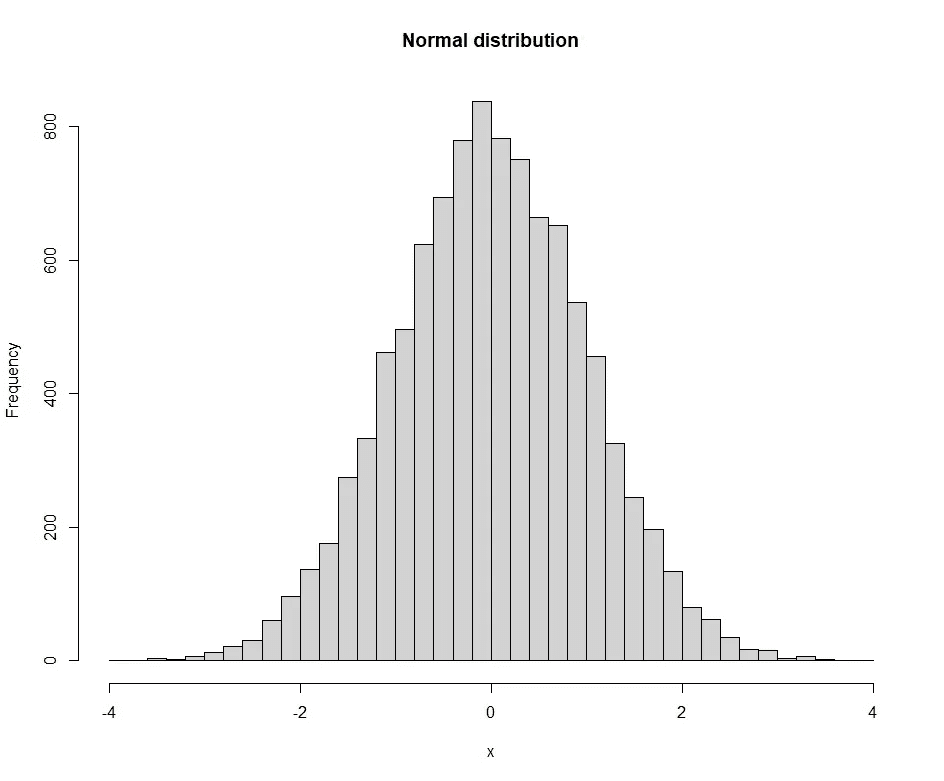
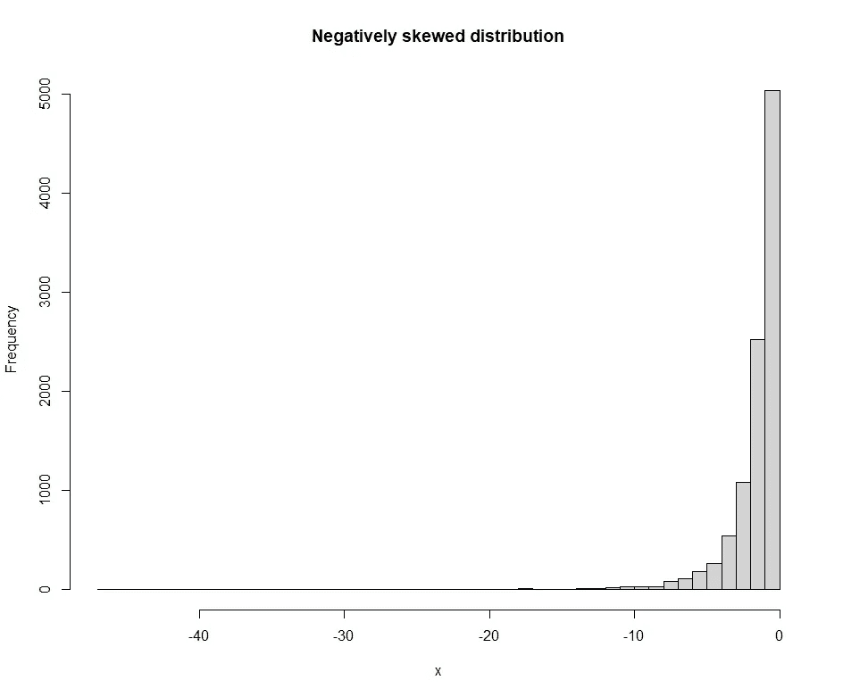
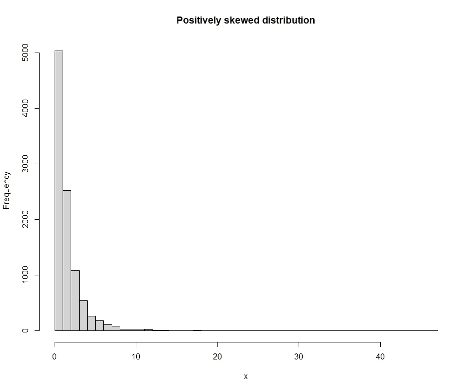
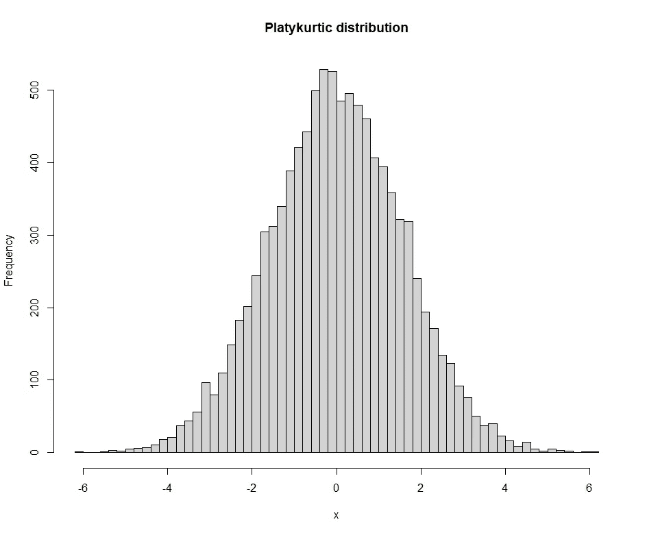
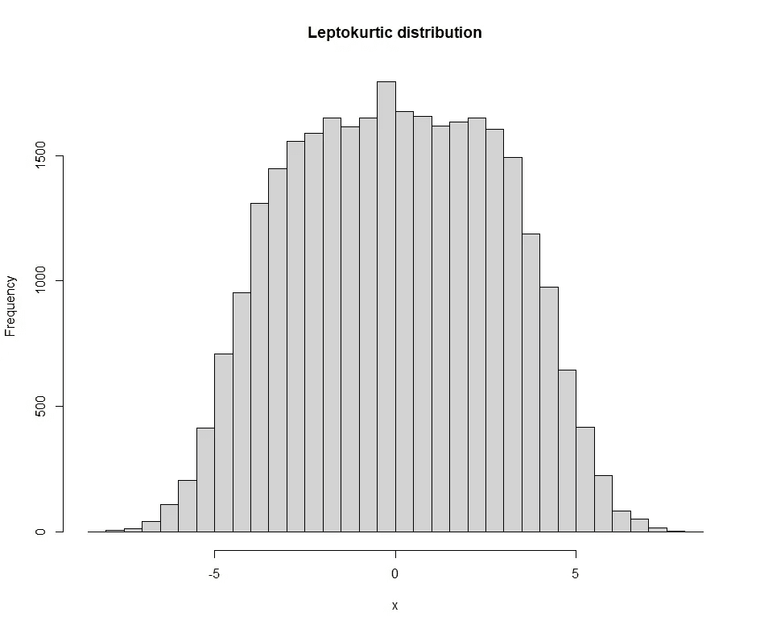
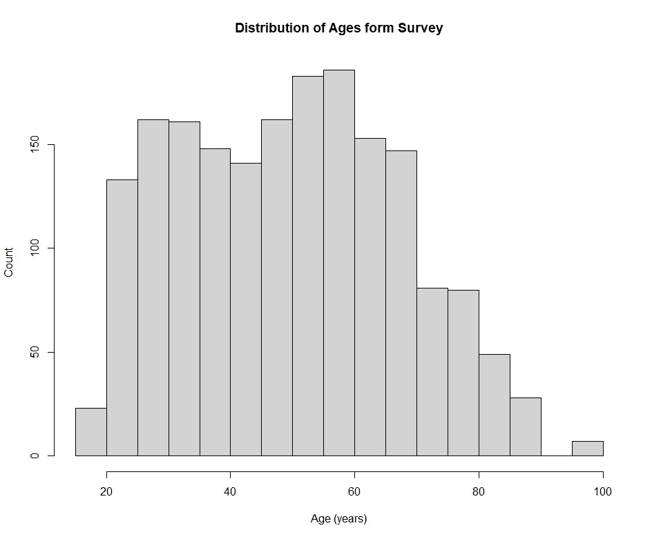
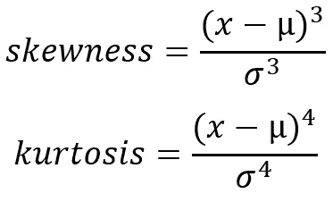
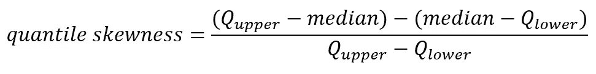
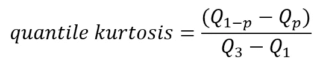

# 带有异常值的偏度和峰度

> 原文：[`towardsdatascience.com/skewness-and-kurtosis-with-outliers-f43167532c69`](https://towardsdatascience.com/skewness-and-kurtosis-with-outliers-f43167532c69)

## R 统计系列

 [Md Sohel Mahmood](https://mdsohel-mahmood.medium.com/?source=post_page-----f43167532c69--------------------------------)

·发布于 [Towards Data Science](https://towardsdatascience.com/?source=post_page-----f43167532c69--------------------------------) ·6 分钟阅读·2023 年 5 月 10 日

--

图片来源：[Aaron Burden](https://unsplash.com/@aaronburden?utm_source=unsplash&utm_medium=referral&utm_content=creditCopyText) 在 [Unsplash](https://unsplash.com/photos/6jYoil2GhVk?utm_source=unsplash&utm_medium=referral&utm_content=creditCopyText)

> **介绍**

现实世界的数据通常包含极端值，这可能导致偏斜分布。偏斜的数据不适合许多统计分析。单个异常值可能会大幅改变分布的整体统计特性。因此，这些极端值需要谨慎处理。如果这些异常值没有正当理由，一般的指导方针是将其去除。本文将探讨异常值对偏度以及峰度的影响。

下图展示了一个正态分布数据的示例，这种数据适用于多种统计分析。

图片来源：作者

> **偏度**

在统计学中，偏度是衡量非对称分布的指标。基本上，它描述了钟形曲线从对称形式的扭曲程度。偏度可以分为两种类型：

1.  显示正偏度的分布，其右侧尾部比左侧尾部更长或更分散。分布的均值大于其中位数。

1.  负偏度的指示是分布的尾部在左侧比右侧更长或更分散。因此，均值小于中位数。

在统计分析中，识别和分析偏斜分布很重要，因为它们可能有显著的影响。

图片来源：作者

图片来源：作者

> **峰度**

峰度描述了分布尾部相对于峰值的形状。除了衡量分布的平坦度外，它还衡量了数据在均值周围的集中程度。峰度可以分为三种类型：

1.  中峰度型分布的峰度等于零，意味着它们是具有钟形曲线的正态分布。

1.  它的特点是比正态分布具有更高的峰值和更重的尾部，因为它的峰度大于零。与正态分布相比，这表明数据在均值周围更加集中。

1.  在低峰度分布中，峰值比正态分布更平坦，尾部也更轻，因为峰度小于零。因此，相比于正态分布，数据在均值周围的集中度较低。

作者提供的图片

作者提供的图片

> **异常值**

现在处理实际世界的数据，这些数据大多是偏斜的，通常包含异常值。我们之前讨论过异常值检测程序。一种常见的策略是 IQR（四分位距）方法，这是行业标准。下面的文章是使用 python 编写的。

## Python 中异常值检测的实际应用

### IQR、Hampel 和 DBSCAN 方法

towardsdatascience.com

确定上下限的 IQR 方法如下。

+   找到第一个四分位数，Q1。

+   找到第三个四分位数，Q3。

+   计算 IQR。IQR= Q3-Q1。

+   定义正常数据范围，其中下限为 Q1–1.5*IQR，上限为 Q3+1.5*IQR。

+   任何超出此范围的数据点都被视为异常值，应在进一步分析中删除。

> **数据集**

本案例研究的数据来源将是 UCI 机器学习库的[成人数据集](https://archive.ics.uci.edu/ml/datasets/adult)。根据数据集中的种族、教育程度、职业、性别、薪资、每周工作小时数以及收入，应该识别出约 30000 人。

让我们检查年龄的分布。

作者提供的图片

这似乎在右侧有些偏斜，并且右侧还有一些可能的异常值。让我们在 R 中确定偏度和峰度。

> **在 R 中的实现**

偏度和峰度公式

偏度和峰度测量的公式如上所示。这里，µ = 样本均值，σ = 样本标准差。在 R 中，我们可以定义一个函数或使用 moments 库来计算偏度，如代码所示。使用 moments 库确定的偏度值为 0.2213737，而使用公式计算的偏度为 0.2211937，这两个值非常接近。由于值大于 0，分布是正偏的。

现在是重点。我们想要去除异常值并查看分布是否仍然偏斜。让我们修剪顶部 2.5% 和底部 2.5% 的数据以排除极端数据点。在这种情况下，分位数偏度定义为：

从年龄数据中计算出的分位数偏度为 0.09677419，虽然仍为正值，但幅度较小。如果我们排除顶部 1% 和底部 1%，偏度将为 0.1304348，这也是正值，但相比于原始数据幅度较小。105 的修剪将得到 0.0212766 的偏度值。修剪 25% 会使其变为负偏，但在实际操作中，修剪 25% 的数据并不实用。因此，显然修剪的数据越多，数据的偏度越小。

> 1% 修剪 → 偏度 0.1304348
> 
> 2.5% 修剪 → 偏度 0.09677419
> 
> 10% 修剪 → 偏度 0.0212766

接下来，我们可以对峰度进行相同的研究。使用 moments 库和公式计算的原始峰度值分别为 2.298557 和 2.296066。正态分布的峰度为 3。如果峰度大于 3，分布被认为是尖峰的；如果峰度小于 3，分布被认为是平峰的。

我们可以使用下面的公式进行基于分位数的峰度分析。

在这里，Q₁ 和 Q₃ 是分布的第一个和第三个四分位数值。Qₚ 是 p 处的分位数。当 p=0.025（基本上从顶部修剪 2.5% 和从底部修剪 2.5%）时，分位数峰度是 95% 内四分位区间与四分位范围的比率。年龄的分位数峰度计算值为 2.214286，也小于 3。因此，去除异常值对峰度值的影响不大。

与其决定性地修剪固定比例的数据，不如使用 IQR 方法来去除异常值。

这个过程给出了偏度和峰度分别为 0.1967011 和 2.203808。

> **结论**

我们已经涵盖了偏度和峰度的基本概念并在 R 中实现了它。处理有异常值的实际数据需要进行一些清理以去除那些极端值。讨论了基于分位数的偏度和峰度测量，并在 R 中实现了行业标准的异常值检测方法（IQR）。读者需要根据自己的判断选择异常值去除方法。

> **数据集致谢**

[Dua, D. 和 Graff, C. (2019). UCI 机器学习库 [http://archive.ics.uci.edu/ml]. 加州尔湾: 加州大学信息与计算机科学学院。](https://archive.ics.uci.edu/ml/datasets/adult)

感谢阅读。

[请我喝杯咖啡](https://ko-fi.com/learningfromdata)。

 [## 使用我的推荐链接加入 Medium - Md Sohel Mahmood

### 阅读 Md Sohel Mahmood 的每一篇故事（以及 Medium 上其他成千上万位作者的故事）。你的会员费将直接…

[获取每当 Md Sohel Mahmood 发布新内容时的邮件通知](https://mdsohel-mahmood.medium.com/membership?source=post_page-----f43167532c69--------------------------------)  [## 获取每当 Md Sohel Mahmood 发布新内容时的邮件通知。

### 每当 Md Sohel Mahmood 发布新内容时，你会收到邮件通知。如果你还没有 Medium 账户，注册时将创建一个账户…

[使用我的推荐链接加入 Medium - Md Sohel Mahmood](https://mdsohel-mahmood.medium.com/subscribe?source=post_page-----f43167532c69--------------------------------)
