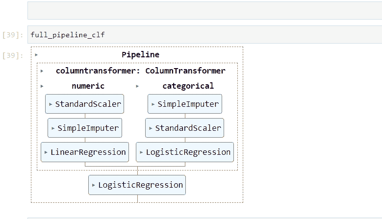

# 现代 ML 工程师的 Sklearn 管道：你不能忽视的 9 种技术

> 原文：[`towardsdatascience.com/sklearn-pipelines-for-the-modern-ml-engineer-9-techniques-you-cant-ignore-637788f05df5`](https://towardsdatascience.com/sklearn-pipelines-for-the-modern-ml-engineer-9-techniques-you-cant-ignore-637788f05df5)

## 你可以用很多方法来构建它们……

[](https://ibexorigin.medium.com/?source=post_page-----637788f05df5--------------------------------)[](https://towardsdatascience.com/?source=post_page-----637788f05df5--------------------------------) [Bex T.](https://ibexorigin.medium.com/?source=post_page-----637788f05df5--------------------------------)

·发表于 [Towards Data Science](https://towardsdatascience.com/?source=post_page-----637788f05df5--------------------------------) ·10 分钟阅读·2023 年 5 月 29 日

--


**由我使用 Midjourney 制作的图像**

## 动机

今天，这就是我所销售的：

```py
awesome_pipeline.fit(X, y)
```

`awesome_pipeline` 可能看起来只是另一个变量，但它在幕后对 `X` 和 `y` 的作用如下：

1.  自动隔离 `X` 的数值特征和分类特征。

1.  填充数值特征中的缺失值。

1.  对偏斜特征进行对数变换，同时对其余部分进行归一化。

1.  填充分类特征中的缺失值，并对其进行一热编码。

1.  对目标数组 `y` 进行归一化，以确保准确。

除了将几乎 100 行不可读的代码压缩成一行之外，`awesome_pipeline` 现在还可以插入到交叉验证器或超参数调整器中，保护你的代码免受数据泄漏，并使一切变得可重复、模块化且无头痛。

让我们看看如何构建它。

## 0\. 估计器 vs 变换器

首先，让我们了解一下术语。

在 Sklearn 中，变换器是任何接受数据集特征、应用变换并返回结果的类或函数。它具有 `fit_transform` 和 `transform` 方法。

一个例子是 `QuantileTransformer`，它接受数值输入并将其转换为正态分布。对于具有 异常值 的特征特别有用。

变换器继承自 `TransformerMixin` 基类。

```py
from sklearn.base import TransformerMixin
from sklearn.preprocessing import QuantileTransformer

isinstance(QuantileTransformer(), TransformerMixin)
```

```py
True
```

另一方面，估计器是任何通常会对数据集生成预测的类。估计器的名称通常以 `Regressor` 或 `Classifier` 结尾。

估计器继承自 `BaseEstimator` 类。

```py
Estimators inherit from the BaseEstimator class
```

```py
True
```

## 1\. 原始管道

Sklearn 中的基本管道始终由一个或多个相同类型的变换器和一个最终的估计器组成。它将变换器串联起来，对特征数组（`X`）执行一系列操作，避免了对每个变换器调用 `fit_transform` 的需求，并将最终输出传递给估计器。所有这些操作都在一行代码中完成。

```py
from sklearn.impute import SimpleImputer
from sklearn.linear_model import LinearRegression
from sklearn.preprocessing import StandardScaler

from sklearn.pipeline import make_pipeline

# Define the numeric pipeline
numeric_pipeline = make_pipeline(
    StandardScaler(), SimpleImputer(), LinearRegression()
)

numeric_pipeline.fit(only_numeric_X, y)
```

要构建一个基本管道，你可以使用 `make_pipeline` 函数并传入变换器和估计器。变换器的顺序很重要。

上述示例展示了一个**数字管道**，它只能应用于包含数字特征的数据集。还有一个**分类管道**，专为仅包含分类特征的数据集设计：

```py
from sklearn.linear_model import LogisticRegression
from sklearn.preprocessing import OneHotEncoder

# Define the categorical pipeline
categorical_pipeline = make_pipeline(
    SimpleImputer(strategy="most_frequent"),
    StandardScaler(),
    LogisticRegression(),
)
```

传入 `make_pipeline` 的每一项都被称为管道中的一个步骤，如下输出所示：

```py
numeric_pipeline
```

```py
Pipeline(steps=[('standardscaler', StandardScaler()),
                ('simpleimputer', SimpleImputer()),
                ('linearregression', LinearRegression())])
```

`make_pipeline` 函数会自动为管道中的每一步分配名称，但这些名称可能会很长且显式。

如果你想提供自定义步骤名称，你需要直接使用 `Pipeline` 类：

```py
from sklearn.pipeline import Pipeline

numeric_pipeline = Pipeline(
    steps=[
        ("scale", StandardScaler()),
        ("impute", SimpleImputer()),
        ("lr", LinearRegression()),
    ]
)
```

`steps` 参数接受一个包含两个项目的元组列表：

1.  步骤名称，作为字符串。

1.  该步骤的变换器或估计器。

正确命名步骤的重要性将在接下来的部分中显现出来。

## 2\. 变换器的奶昔

在实际应用中，你很少会单独使用基本变换器，因为现实世界的数据集通常包含数字特征和分类特征的混合。

因此，你需要一种方法将不同类别的变换器组合成一个对象，同时指定哪些变换器应应用于数据集 `X` 的哪些列。

这一功能在 `ColumnTransformer` 类中得到了优雅的实现。

在第 0 步中，你需要分别定义数字特征和分类特征：

```py
nums = ["numeric_1", "numeric_2", "numeric_3"]
cats = ["categorical_1", "categorical_2", "categorical_3"]
```

在第 1 步中，为数字特征和分类特征分别定义两个仅包含变换器的管道：

```py
numeric_pipe = make_pipeline(SimpleImputer(), QuantileTransformer())
categorical_pipe = make_pipeline(
    SimpleImputer(strategy="most_frequent"), OrdinalEncoder()
)
```

然后，你可以创建一个 `ColumnTransformer` 类的实例：

```py
from sklearn.compose import ColumnTransformer

transformers = ColumnTransformer(
    transformers=[
        ("numeric", numeric_pipeline, nums),
        ("categorical", categorical_pipeline, cats),
    ]
)
```

`ColumnTransformer` 的 `transformers` 参数接受一个包含三项元组的列表：

1.  步骤的名称。

1.  变换器或变换器的管道。

1.  应应用变换器的列名称。

当你使用 `transformers` 对象时，它会对数字特征和分类特征分别应用两种类型的操作，然后将结果合并以返回一个单一的矩阵。

因此，`ColumnTransformer` 代表了一个更复杂的管道，它不包括最终的估计器。要完成管道，我们需要添加一个。

## 3\. 顶部有西瓜的奶昔

目前，我们的半成品管道仅*转换*数据集 `X`：

```py
X_transformed = transformers.fit_transform(X)
```

唯一缺少的是一个估计器。这很容易解决：

```py
full_pipeline_reg = make_pipeline(transformers, LinearRegression())

# You can also use `Pipeline` class for named steps
full_pipeline_clf = Pipeline(
    steps=[
        ("preprocess", transformers),
        ("clf", LogisticRegression()),
    ]
)
```

根据机器学习任务的不同，你需要将回归器或分类器估计器串联为管道中的最终步骤。生成的管道将具有 `fit` 和 `predict` 方法，具体取决于任务。

```py
# y is a classification label
full_pipeline_clf.fit(X, y)

# y is a numeric label
full_pipeline_reg.fit(X, y)
```

## 4\. 选择风格化的列

在定义 `ColumnTransformer` 时，我们逐一手动指定了数值和分类特征。就像一个原始人一样。

但不用担心！Sklearn 提供了一种更高效的方法来实现这一点。

```py
import numpy as np
from sklearn.compose import make_column_selector

numeric_cols = make_column_selector(dtype_include=np.number)
categoricals = make_column_selector(dtype_exclude=np.number)
```

`make_column_selector` 是一个方便的函数，它允许你以各种方式从数据框中自动隔离列。在上面的示例中，我们使用它根据数据类型过滤列。然而，你也可以利用 `pattern` 参数来指定用于过滤列名的正则表达式（RegEx）模式。

这是一个示例：

```py
pattern = "^(word1|word2)"
filtered_columns = make_column_selector(pattern)
```

提供的示例捕获了以 `word1` 或 `word2` 开头的列。

这个功能在构建 `ColumnTransformer` 对象时特别有用。它消除了手动列出每一个列名的需求，这在处理包含大量列的数据集时可能变得具有挑战性，甚至是不可能的。

```py
from sklearn.compose import make_column_transformer

# Automatically capture cols based on dtype
nums = make_column_selector(dtype_include=np.number)
cats = make_column_selector(dtype_exclude=np.number)

# Build the pipelines
numeric_pipe = make_pipeline(...)
categorical_pipe = make_pipeline(...)

transformers = make_column_transformer(
    (nums, numeric_pipe), (cats, categorical_pipe)
)
```

`make_column_transformer` 函数是一个简写函数，类似于 `make_pipeline`，它允许你构建 `ColumnTransformer` 对象而无需明确指定步骤名称。通过将其与 `make_column_selector` 结合使用，你可以显著缩短代码。

## 5\. 视觉管道

当你打印一个复杂的管道，例如 `full_pipeline_clf`，输出可能在你的 Jupyter notebook 中变成难以阅读的混乱。

为了解决这个问题，你可以使用 `set_config` 函数将 `display` 选项设置为 `diagram`：

```py
from sklearn import set_config

set_config(display="diagram")
```

现在，当你打印或返回管道时，将显示一个 HTML 图示，提供管道的视觉表示：



这种视觉表示对于调试和诊断极为有用。

> 请注意，HTML 表示是最新版本 Sklearn（1.0.0 及以后版本）的默认设置。

## 6\. 管道缓存

一旦你的管道准备好，你可能会想让它全天候运行。然而，由于管道包含多个转换器来处理数据，重新运行相同的操作可能会耗时。

为了解决这个问题，Sklearn 提供了一个 `memory` 参数，允许你缓存管道内转换器的输出。这个缓存机制有助于避免不必要的重新计算转换器的输出。以下是使用方法：

```py
from shutil import rmtree
from tempfile import mkdtemp

from sklearn.decomposition import PCA

# Make a temporary directory
cache_dir = mkdtemp()

estimators = [("reduce_dim", PCA()), ("clf", LogisticRegression())]
my_pipe = Pipeline(estimators, memory=cache_dir)

# Run the pipeline
...

# Remove the cache directory at the end of your script
rmtree(cache_dir)
```

要启用缓存，你需要使用 `mkdtemp` 函数创建一个临时目录。然后，你可以将该目录路径传递给 `Pipeline` 对象的 `memory` 参数。

最后，确保在脚本或 notebook 的末尾包含 `rmtree(cache_dir)` 以删除缓存目录及其内容。

但是，使用缓存有一些注意事项（虽然不严重）。你可以在[这里](https://scikit-learn.org/stable/modules/compose.html#caching-transformers-avoid-repeated-computation)阅读更多关于它们的内容。

## 7\. 在其他对象中

尽管管道包含各种转换器，但归根结底，它仍然是一个估计器：

```py
isinstance(my_pipe, BaseEstimator)
```

```py
True
```

这意味着它可以在任何典型的独立估计器可以使用的地方使用。例如，管道通常被插入到交叉验证器中，以保护机器学习模型免受数据泄漏：

```py
from sklearn.model_selection import cross_validate

results = cross_validate(
    estimator=full_pipeline_clf,
    X,
    y,
    cv=5,
    n_jobs=-1,
    scoring=["accuracy", "logloss"],
)
```

或者用于超参数调优器，例如`HalvingGridSearch`（出于相同的原因）：

```py
from sklearn.model_selection import HalvingGridSearchCV
from sklearn.preprocessing import OneHotEncoder, StandardScaler
from sklearn.svm import SVC

# Define the pipeline with ColumnTransformer
preprocessor = ColumnTransformer(
    transformers=[
        ("numeric", num_pipe, num_cols),
        ("categorical", cat_pipe, cat_cols),
    ]
)

pipe = Pipeline(
    [("preprocessor", preprocessor), ("classifier", SVC())]
)

param_grid = {
    "preprocessor__numeric__with_mean": [True, False],
    "preprocessor__categorical__min_frequency": [2, 4, 6],
    "classifier__C": [0.1, 1, 10],
    "classifier__kernel": ["linear", "rbf"],
}

search = HalvingGridSearchCV(
    pipe, param_grid, cv=5, factor=2, random_state=42
)
```

在这一点上，我想引起你对参数网格定义的注意。看看它是如何定义的：

```py
param_grid = {
    "preprocessor__numeric__with_mean": [True, False],
    "preprocessor__categorical__min_frequency": [2, 4, 6],
    "classifier__C": [0.1, 1, 10],
    "classifier__kernel": ["linear", "rbf"],
}
```

`StandardScaler`的第一个参数`with_mean`作为嵌套参数的一个例子。它前面有两个说明符：`preprocessor`和`numeric`，由双下划线分隔。

嵌套参数遵循`<step_name>__<parameter>`语法。在这种情况下，`with_mean`是一个变换器的参数，它深度为两层。内部管道的名称是`numeric`，外部管道的名称是`preprocessor`，结果是`preprocessor__numeric__with_mean`。

通过使用这种语法编写嵌套参数，你不仅可以优化模型的参数，还可以优化内部变换器本身的参数。

## 8\. 自定义变换器

如果你想对数据进行自定义变换，而这些变换在`sklearn.preprocessing`模块中没有实现怎么办？你必须放弃 Sklearn 管道及其带来的所有好处吗？

绝对不是！使用`FunctionTransformer`类，你可以将任何 Python 函数转换为一个可以集成到管道中的变换器。例如，考虑以下函数，它在 DataFrame 的每一行中添加一个表示缺失值数量的列：

```py
def num_missing_row(X: pd.DataFrame, y=None):
    # Calculate some metrics across rows
    num_missing = X.isnull().sum(axis=1)

    # Add the above series as a new feature to the df
    X["num_missing"] = num_missing

    return X
```

要将其转换为变换器，你只需用`FunctionTransformer`包装它，并将其传递到管道中：

```py
from sklearn.preprocessing import FunctionTransformer

# Create a custom transformer
custom_transformer = FunctionTransformer(func=num_missing_row)

# Pass it into a pipeline
numeric_pipe = make_pipeline(
    StandardScaler(), customer_transformer, LinearRegression()
)
```

也有可能简单的函数不足以创建自定义变换。在这种情况下，你可以创建自己的类，继承自`TransformerMixin`类。我不会在这里详细说明，但我建议你查看我去年写的一篇关于该主题的综合文章：

[## 深入指南：为任何数据预处理场景构建自定义 Sklearn 变换器](https://ibexorigin.medium.com/in-depth-guide-to-building-custom-sklearn-transformers-for-any-data-preprocessing-scenario-33450f8b35ff?source=post_page-----637788f05df5--------------------------------)

### 编辑描述

[ibexorigin.medium.com](https://ibexorigin.medium.com/in-depth-guide-to-building-custom-sklearn-transformers-for-any-data-preprocessing-scenario-33450f8b35ff?source=post_page-----637788f05df5--------------------------------)

## 9\. 使用管道进行目标变换

大多数情况下，你管道中的变换器专注于特征数组`X`。然而，也有一些情况需要对目标数组`y`进行一些预处理。

回归中的一个常见场景是使目标变量符合正态分布，以提高线性模型的拟合效果。如果你在管道外进行标准化，有可能会导致训练集数据泄漏。

为了解决这个问题并简化流程，Sklearn 提供了`TransformedTargetRegressor`类。通过这个类，你可以在管道中直接包含目标数组的变换，确保数据完整性并减少冗余代码。

```py
from sklearn.compose import TransformedTargetRegressor
from sklearn.preprocessing import QuantileTransformer

# Define the pipeline for X
transformers = ColumnTransformer(...)
full_pipeline = make_pipeline(transformers, LinearRegression())

# Define the transformer for y
qt = QuantileTransformer(output_distribution="normal")

# Define the final regressor
tt = TransformedTargetRegressor(
    regressor=full_pipeline, transformer=qt
)

tt.fit(X, y)
```

在定义了一个以回归模型如`LinearRegression`结尾的管道后，你可以将其传递给`TransformedTargetRegressor`类的`regressor`参数。此外，你还需要使用`transformer`参数指定目标数组`y`的变换器。

有关这个类及其使用的更多信息，你可以参考[Sklearn 文档](https://scikit-learn.org/stable/modules/generated/sklearn.compose.TransformedTargetRegressor.html#sklearn.compose.TransformedTargetRegressor)。

## 结论

我相信这篇文章是我关于 Sklearn 的最详细的一篇，除非你可能还算上这两篇：

[](/19-hidden-sklearn-features-you-were-supposed-to-learn-the-hard-way-5293e6ff149?source=post_page-----637788f05df5--------------------------------) ## 19 个你本该艰难学习的隐藏 Sklearn 特性

### 编辑描述

towardsdatascience.com [](/10-sklearn-gems-buried-in-the-docs-waiting-to-be-found-ad95a8fabdfd?source=post_page-----637788f05df5--------------------------------) ## 文档中埋藏的 10 个 Sklearn 珍品，等待被发现

### 编辑描述

towardsdatascience.com

无论如何，Sklearn 管道是我不断回到这个最爱库的主要原因之一。它们为混乱的机器学习工作流带来了和谐，以优雅和高效将原始数据转化为黄金。

使用管道，你可以协调变换器、估算器和列变换器的交响乐，轻松驯服最复杂的数据集。

感谢阅读！

喜欢这篇文章以及它那奇特的写作风格？想象一下，能够访问到数十篇类似的文章，所有文章都由一位才华横溢、迷人风趣的作者撰写（顺便说一句，那就是我 :）。

只需 4.99 美元的会员费，你将不仅可以访问我的故事，还可以获取 Medium 上最佳和最聪明的头脑提供的知识宝库。如果你使用[我的推荐链接](https://ibexorigin.medium.com/membership)，你将获得我超级感激的心和虚拟的高五，以支持我的工作。

[](https://ibexorigin.medium.com/membership?source=post_page-----637788f05df5--------------------------------) [## 使用我的推荐链接加入 Medium - Bex T.

### 获得对我所有⚡优质⚡内容的独家访问权限，畅享 Medium 上的所有内容。通过购买来支持我的工作…

[ibexorigin.medium.com](https://ibexorigin.medium.com/membership?source=post_page-----637788f05df5--------------------------------) 

图片由我使用 Midjourney 制作
