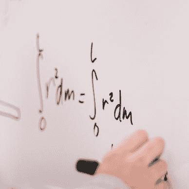
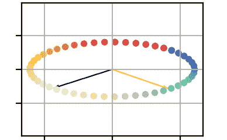
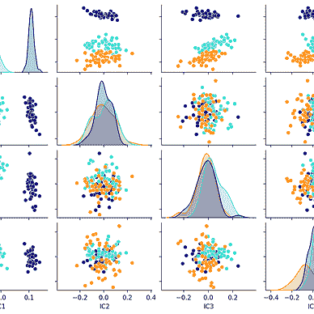
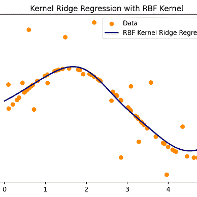
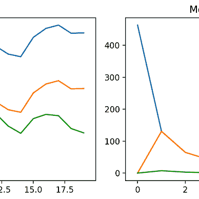
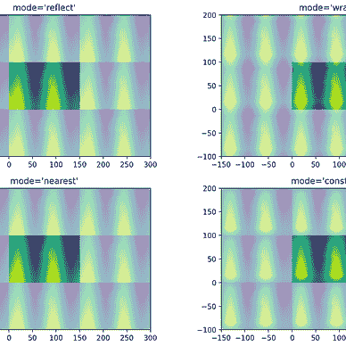

# Sklearn 教程：第 1 模块

> 原文：[`towardsdatascience.com/sklearn-tutorial-module-1-f31b3964a3b4`](https://towardsdatascience.com/sklearn-tutorial-module-1-f31b3964a3b4)

## **我参加了官方的 sklearn MOOC 教程。以下是我的收获。**

[](https://mocquin.medium.com/?source=post_page-----f31b3964a3b4--------------------------------)[](https://towardsdatascience.com/?source=post_page-----f31b3964a3b4--------------------------------) [Yoann Mocquin](https://mocquin.medium.com/?source=post_page-----f31b3964a3b4--------------------------------)

·发表在 [Towards Data Science](https://towardsdatascience.com/?source=post_page-----f31b3964a3b4--------------------------------) ·9 分钟阅读·2023 年 11 月 22 日

--

在多年使用 Python 科学计算栈（NumPy、Matplotlib、SciPy、Pandas 和 Seaborn）后，我意识到下一步就是 scikit-learn，或称为“sklearn”。


图片由 [Thought Catalog](https://unsplash.com/@thoughtcatalog?utm_source=medium&utm_medium=referral) 提供，来源于 [Unsplash](https://unsplash.com/?utm_source=medium&utm_medium=referral)

# 但为什么选择 sklearn？

在所有机器学习库中，scikit-learn 无疑是最简单、最易于学习的框架。它基于科学计算栈（主要是 NumPy），专注于传统但强大的算法，如线性回归/支持向量机/降维，并提供了许多围绕这些算法构建的工具（如模型评估和选择、超参数优化、数据预处理和特征选择）。

**但它的主要优势无疑是其文档和用户指南。你可以仅通过 scikit-learn 网站学到几乎所有的东西，且有大量示例。**

请注意，其他流行的框架有 TensorFlow 和 PyTorch，但它们学习曲线更陡峭，并且专注于计算机视觉和神经网络等更复杂的主题。由于这是我第一次真正接触机器学习，我决定从 sklearn 开始。

我几个月前已经开始阅读文档，但由于其庞大感到有些迷茫。虽然文档内容丰富且写得非常好，但我不确定按照页面逐一学习 scikit-learn 是否是最好的方法。

好消息是，激发我进一步学习 scikit-learn 的原因是 scikit-learn 的“官方”MOOC 的推出，这个 MOOC 是由 scikit-learn 的实际团队创建的。

[](https://www.fun-mooc.fr/fr/cours/machine-learning-python-scikit-learn/?source=post_page-----f31b3964a3b4--------------------------------) [## 使用 scikit-learn 进行 Python 机器学习

### 使用 scikit-learn 构建预测模型，并获得对其优缺点的实际理解……

[www.fun-mooc.fr](https://www.fun-mooc.fr/fr/cours/machine-learning-python-scikit-learn/?source=post_page-----f31b3964a3b4--------------------------------)

**在本系列中，我将尝试总结我从组成 MOOC 的 6 个模块中学到的内容。** 这对我来说是一个很好的练习，可以锻炼我的记忆并总结所学内容，同时也是一个很好的入门介绍，如果你想接触 sklearn 的话。

请注意，这个 MOOC 是免费的，所以如果你喜欢下面的内容，绝对应该订阅！请注意，这些帖子是我对 MOOC 的精心整理视角，而 MOOC 本身仅仅是对 scikit-learn 的介绍。

# 模块 1：机器学习概念

第一个模块专注于介绍以下概念：

+   将数据拆分为训练集/测试集

+   列选择器/转换器

+   模型、管道和带有 `.fit()`、`.transform`、`.predict()`、`.score()` 方法的估算器 API

+   交叉验证

所以我们今天的计划是用文字而不是代码来复习这些概念。如果你想进一步了解，我强烈建议你去阅读文档。

# 将数据拆分为训练集和测试集

机器学习中的一个重要最佳实践是将数据拆分为训练集和测试集。其思路是，给定固定大小的输入数据，我们将用整个数据的一部分——训练集——来训练模型，并在另一部分——测试集——上测试其性能。

这个方法非常重要，原因有很多：**机器学习和模型的全部意义在于能够从新的、未见过的数据中预测输出**。如果我们使用全部数据来训练模型，我们别无选择，只能用相同的数据来测试其性能。显然，这似乎是一个有偏的练习：模型当然能够根据已经见过的输入来猜测输出，更何况它还接触过对应的输出。这个概念也被称为 **泛化与记忆**：我们希望模型能够泛化（为新的输入数据推断输出），而不仅仅是记住它所训练的数据。

另一个原因（实际上，换句话说）是为了避免过拟合。过拟合是机器学习中一个非常重要的概念，会在另一个模块中进一步学习。现在，让我们暂且说，当一个模型对它训练的数据学习得过于精细时，就会发生“过拟合”。拥有一个与训练集不同的测试集，让我们检查模型在训练集和测试集上的性能是否大致相同。

为此，scikit-learn 提供了一个简单但重要的函数 `train_test_split`：

```py
from sklearn.model_selection import train_test_split
data_train, data_test, target_train, target_test = train_test_split(
    data,           # the input array that contains all the input features
    target,         # the target array that contains the truth
    test_size=0.25, # the percentage of data attributed to the test set, defaults to 0.25
    shuffle=True,   # if the data should be randomly split (defaults to True)
    random_state=42 # this is an optional parameter to be able to have reproducible splitting
)
```

这个思路是使用 `data_train` 和 `target_train` 来训练我们的模型，并使用 `data_test` 和 `target_test` 来测试模型在未见数据上的表现。

# 列转换器/预处理器

**通常，原始输入数据格式不是很好，需要进行一些预处理步骤，然后才能进入典型模型**。例如，如果输入数据包含一个以字符串形式存储的分类列，而模型只使用数值输入，我们需要将这个字符串列转换为数值列（编码相同的信息），以便模型能够利用该特征的信息。

另一个典型的例子是当几个数值特征具有非常不同的尺度和/或单位时。模型通常会从具有相同尺度的数据中受益——即具有或多或少相同的均值和/或围绕其均值的变化尺度。

一旦应用了这些预处理步骤，转换后的数据就会被送到实际模型中。

为了实现这些预处理步骤，scikit-learn 提供了一些有用的工具。第一个是预处理函数（实际上存储在类中），它们有助于改善每个特征的尺度或将分类特征编码为数值格式。

一旦实例化，这些对象可以用于预处理数据：

```py
from sklearn.preprocessing import StandardScaler, OneHotEncoder

scaler = StandardScaler()
encoder = OneHotEncoder()

# Example of StandardScaler
data = np.arange(100)
scaler.fit(data)                            # scaler 'fits' to the data and stores the mean and variance for later use
scaled_data = scaler.transform(data)        # apply the actual transformation
scaled_data = scaler.fit_transform(data)    # do both at once
other_scaled = scaler.transform(other_data) # note that one can apply the same transformation to other data

# Example of OneHotEncoder
data = [['toto'], ['titi'], ['toto'], ['tata']]
encoder.fit_transform(data).toarray() # fit and transform the column into OneHotEncoded columns
array([[0., 0., 1.],
 [0., 1., 0.],
 [0., 0., 1.],
 [1., 0., 0.]])
# The encoder creates 3 new columns, where the first one corresponds to 'toto', 2nd 'titi' and so on
```

现在让我们回顾一下`ColumnTransformer`类：它允许你指定一些列与一些预处理器之间的映射。基本的例子是将数值列映射到标准化器，并将分类列映射到独热编码器。所以假设我们有一组数值列和一组分类列，我们可以这样创建一个新的预处理器对象：

```py
from sklearn.compose import ColumnTransformer

categorical_cols = ['gender', 'country']
numerical_cols = ['age', 'weight', 'height']

preprocessor = ColumnTransformer(
     [ # a list of 3-tuple : (name of the preprocessor, the actual preprocessor, list of columns names to apply on)
         ("onehot_cat", OneHotEncoder(), categorical_cols), 
         ("stdsc_num", StandardScaler(), numerical_cols),
     ],
     remainder=OneHotEncoder(), # the remaining cols that are not identified in cat/num cols will be OneHotEncoded
)
```

这样，`preprocessor`现在是一个新的预处理器，就像`StandardScaler`一样，它具有 fit/transform API。我们可以将这个新的预处理器作为我们模型的全局预处理器，直接应用于整个数据矩阵。注意，`make_column_transformer`也做了相同的事情，而不需要为每个预处理器指定名称。

但如果我们事先不知道数据矩阵中列的名称怎么办？或者我们不想查看所有列，而是仅根据它们的数据类型进行映射呢？为此，我们可以使用`make_column_selector`辅助函数，它基本上创建了用于提取整个数据矩阵列的过滤器，以便在`ColumnTransformer`中映射预处理器：

```py
from sklearn.compose import make_column_selector

num_selector = make_column_selector(dtype_exclude=object) # suppose every non-object dtype is numerical
cat_selector = make_column_selector(dtype_include=object) # suppose every object dtype is categorical

preprocessor = ColumnTransformer(
    [
         ("onehot_cat", OneHotEncoder(), cat_selector), 
         ("stdsc_num", StandardScaler(), num_selector),
    ],
    remainder=OneHotEncoder(), # the remaining cols that are not identified in cat/num cols will be OneHotEncoded
)
```

通过这种方式，我们创建了几乎相同的`ColumnTransformer`预处理器对象，但不需要假设列名。

# 流水线

现在我们拥有了定义流水线的所有工具：**流水线基本上是各种处理器的串联**。既然我们已经有了一些预处理器，我们只需要添加一个预测模型，比如线性回归或支持向量分类器。

为此，我建议使用`Pipeline`构造函数：

```py
from sklearn.pipeline import Pipeline
from sklearn.linear_model import LinearRegression

pipeline = Pipeline(
    [
        ('std', StandardScaler()),
        ('lin_reg', LinearRegression())
  ]
)
```

新创建的流水线对象再次暴露了 fit/transform API（就像我们上面看到的预处理器一样，也像 LinearRegression()实例）。我们可以用它来训练和测试我们模型（流水线）在拆分数据上的表现：

```py
pipeline.fit(data_train, target_train) # make the model "learn"
y_predicted = pipeline.transform(data_test) # make a prediction on unseen data
# or directly compute a score to measure the performance on the test set
pipeline.score(data_test, target_test)
# to check the training score, we can use
pipeline.score(data_train, target_train)
```

# 交叉验证

我想在这个第一模块中介绍的最终主题是交叉验证。

还记得一开始我们将输入数据拆分成训练集和测试集吗？实际上，这个拆分可能显得有些任意。如果由于运气好或运气不好，数据以某种特定的方式划分，对模型性能有利或不利，会怎么样？

为了规避这个风险，我们可以使用所谓的 **交叉验证：其思想是将数据以不同的方式划分，并对每个划分训练和测试模型。模型的总体性能由每个划分性能的平均值给出**。例如，第一个划分将使用前 75% 的条目进行训练，最后 25% 的条目进行测试。重新开始，第二个划分将使用 25%-100% 的条目进行训练，前 25% 的条目进行测试。依此类推。对于每个划分，模型都从头开始拟合和测试。

```py
from sklearn.model_selection import cross_validate
cv_results_dict = cross_validate(
    pipeline,   # our model
    data,       # the whole input data
    target,     # the whole target data
    cv=10,      # number of splits (defaults to 5)
    return_estimator=True,   # so we can retrieve each fitted pipeline
    return_train_score=True, # to get the train scores, in addition to the test scores
)
```

输出是一个字典，其中包含大量信息，包括每个数据划分的测试分数和模型。请注意，有多种数据划分方法，包括随机划分或最常见的 KFold，将数据划分为连续子组。

# 完整的工作示例

让我们用 iris 玩具数据集回顾一下我们看到的所有内容。

在下面的示例中，我们创建了 5 个基于 5 种分类模型的管道，即逻辑回归、决策树、随机森林、支持向量机和 K 最近邻。这里的想法不是了解每个模型如何工作，而是查看创建包含预处理器和模型的管道的整体过程，以及如何以稳健的方式计算它们的性能。

在这里，我们使用辅助函数 `make_pipeline` 代替可能显得有点冗长的 `Pipeline` 构造函数。此外，我们不仅仅指定交叉验证的分割数量，而是明确指定我们希望使用的折叠类型：这里是 10 折随机分割。

```py
import numpy as np
from sklearn.model_selection import cross_validate, KFold
from sklearn.linear_model import LogisticRegression
from sklearn.tree import DecisionTreeClassifier
from sklearn.ensemble import RandomForestClassifier
from sklearn.svm import SVC
from sklearn.neighbors import KNeighborsClassifier
from sklearn.datasets import load_iris
from sklearn.preprocessing import StandardScaler
from sklearn.pipeline import make_pipeline

# Load the Iris dataset
iris = load_iris()
X, y = iris.data, iris.target

# Create models with StandardScaler in a Pipeline
models = {
    'Logistic Regression': make_pipeline(StandardScaler(), LogisticRegression()),
    'Decision Tree': make_pipeline(StandardScaler(), DecisionTreeClassifier()),
    'Random Forest': make_pipeline(StandardScaler(), RandomForestClassifier()),
    'SVM': make_pipeline(StandardScaler(), SVC()),
    'K-Nearest Neighbors': make_pipeline(StandardScaler(), KNeighborsClassifier())
}

# Perform 10-fold cross-validation for each model
for model_name, model in models.items():
    cv_results = cross_validate(
        model, X, y, 
        cv=KFold(n_splits=10, shuffle=True, random_state=42),
        return_train_score=True
    )

    print(f'Model: {model_name}')
    print('---------------------------')
    print(f'Test Accuracy: {np.mean(cv_results["test_score"]):.4f} ± {np.std(cv_results["test_score"]):.4f}')
    print(f'Train Accuracy: {np.mean(cv_results["train_score"]):.4f} ± {np.std(cv_results["train_score"]):.4f}')
    print('\n')
```

# 重点

在这第一篇文章中，我们看到：

+   这意味着什么 **将数据分为训练集和测试集**，我们为什么要这样做，以及如何做

+   如何创建 **列变换器/预处理器**，用于对输入特征应用转换

+   管道的概念，意味着将各种步骤（如预处理器和模型）连接在一起，以便从基本工具中创建复杂模型

+   最终，什么是交叉验证：我们为什么以及如何以一种稳健的方式评估模型性能

现在，请给这篇帖子：

+   如果只是一般般，给 1 个掌声（一般般！）

+   如果你觉得写得很清楚，给 10 个掌声（很棒！）

+   如果它非常清楚和有趣，给 50 个掌声（真是太棒了！）

你可能会喜欢我的一些其他帖子，确保查看它们：


[Yoann Mocquin](https://mocquin.medium.com/?source=post_page-----f31b3964a3b4--------------------------------)

## 科学/数值 Python

[查看列表](https://mocquin.medium.com/list/scientificnumerical-python-9ce115122ab6?source=post_page-----f31b3964a3b4--------------------------------)3 个故事

[Yoann Mocquin](https://mocquin.medium.com/?source=post_page-----f31b3964a3b4--------------------------------)

## 数据科学与机器学习

[查看列表](https://mocquin.medium.com/list/data-science-and-machine-learning-ba3fb2206051?source=post_page-----f31b3964a3b4--------------------------------)3 个故事

[Yoann Mocquin](https://mocquin.medium.com/?source=post_page-----f31b3964a3b4--------------------------------)

## 时间序列的傅里叶变换

[查看列表](https://mocquin.medium.com/list/fouriertransforms-for-timeseries-ed423e3f38ad?source=post_page-----f31b3964a3b4--------------------------------)4 个故事
