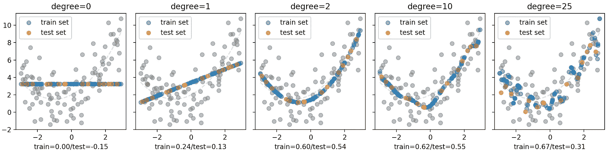
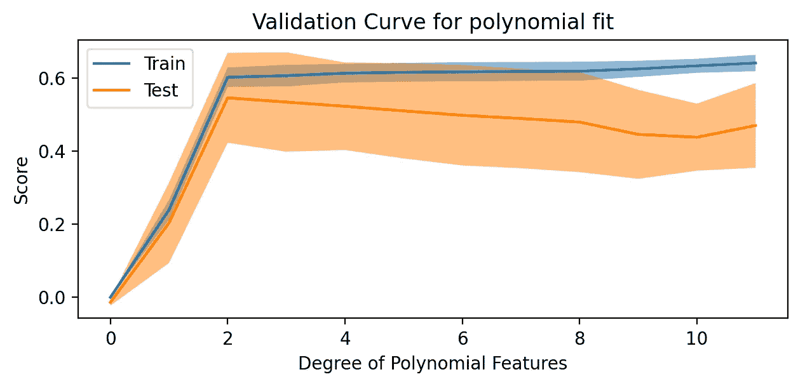
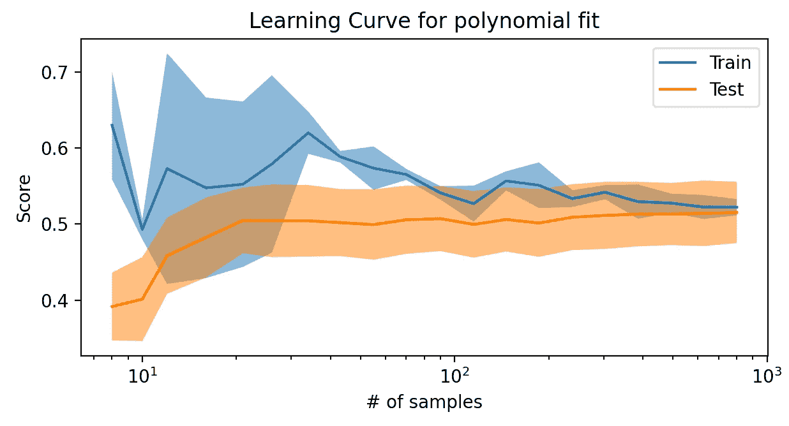
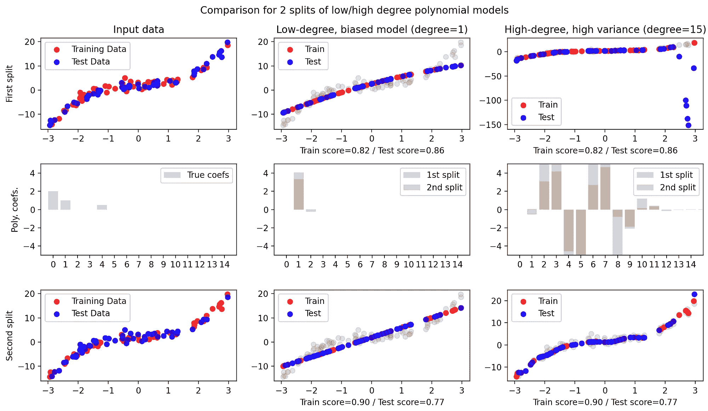
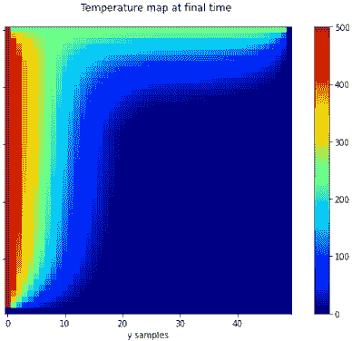

# Sklearn 教程：第二章

> 原文：[`towardsdatascience.com/sklearn-tutorial-module-2-0739c44f595a`](https://towardsdatascience.com/sklearn-tutorial-module-2-0739c44f595a)

## 我参加了官方的 sklearn MOOC 教程。这是我的收获。

[](https://mocquin.medium.com/?source=post_page-----0739c44f595a--------------------------------)[](https://towardsdatascience.com/?source=post_page-----0739c44f595a--------------------------------) [Yoann Mocquin](https://mocquin.medium.com/?source=post_page-----0739c44f595a--------------------------------)

·发表于 [Towards Data Science](https://towardsdatascience.com/?source=post_page-----0739c44f595a--------------------------------) ·14 分钟阅读·2023 年 11 月 25 日

--

在多年使用 Python 科学计算栈（NumPy、Matplotlib、SciPy、Pandas 和 Seaborn）之后，我明显感觉到下一步是 scikit-learn，即“sklearn”。


图片由 [Nick Morrison](https://unsplash.com/@nickmorrison?utm_source=medium&utm_medium=referral) 提供，来自 [Unsplash](https://unsplash.com/?utm_source=medium&utm_medium=referral)

第二个模块侧重于模型分数的概念，包括测试分数和训练分数。这些分数用于定义过拟合和欠拟合，以及偏差和方差的概念。

我们还将了解如何根据模型的复杂性和输入样本的数量来检查模型的性能。

*所有图片由作者提供。*

如果你没有看到，我强烈推荐你查看本系列的第一篇文章——这样会更容易跟上：

[](/sklearn-tutorial-module-1-f31b3964a3b4?source=post_page-----0739c44f595a--------------------------------) ## Sklearn 教程：第一章

### 我参加了官方的 sklearn MOOC 教程。这是我的收获。

towardsdatascience.com

# **分数：训练分数和测试分数**

我想讨论的第一个概念是**训练分数和测试分数**。**分数是以数字形式表达模型性能的一种方式**。为了计算这种性能，我们使用分数函数，该函数聚合了模型预测与实际值之间的“距离”或“误差”。例如：

```py
model = LinearRegressor()
model.fit(X_train, y_train)
y_predicted = model.predict(X_test)
test_score = some_score_function(y_predicted, y_test)
```

在 sklearn 中，所有模型（也称为估算器）提供了一种更快捷的方式来计算模型的分数：

```py
# the model will computed the predicted y-value from X_test, 
# and compare it to y_test with a score function
test_score = model.score(X_test, y_test)
train_score = model.score(X_train, y_train)
```

**模型的实际评分函数依赖于模型及其设计解决的问题类型**。例如，线性回归器使用的是 R²系数（数值回归），而支持向量分类器（分类）则使用准确率，这基本上是正确分类预测的数量。

如果模型的默认评分不符合您的需求，您还可以从 sklearn 的 metrics 导入评分函数。许多评分函数可以用于计算模型的评分，每种都有其优缺点。它们在 sklearn.metrics 模块中可用：

```py
from sklearn.metrics import r2_score, mean_absolute_error, mean_squared_error
from sklearn.linear_model import LinearRegression
from sklearn.model_selection import train_test_split
import numpy as np

np.random.seed(42)
X = 2 * np.random.rand(100, 1)
y = 4 + 3 * X + np.random.randn(100, 1)

# See my previous post for why we split the input data
X_train, X_test, y_train, y_test = train_test_split(X, y, test_size=0.2, random_state=42)

# create and train a linear regression
lr = LinearRegression()
lr.fit(X_train, y_train)

# Compute predicted values
y_pred = lr.predict(X_test)

print("Model Score (R-squared):",
      lr.score(X_test, y_test)) # use the .score method of the model
print("R-squared Score:", 
      r2_score(y_test, y_pred)) # use the the same function, but from sklearn.metrics

# use other score functions
print("Mean Absolute Error:",
      mean_absolute_error(y_test, y_pred))
print("Mean Squared Error:",
       mean_squared_error(y_test, y_pred))
```

```py
Model Score (R-squared): 0.8072059636181392
R-squared Score: 0.8072059636181392
Mean Absolute Error: 0.5913425779189776
Mean Squared Error: 0.6536995137170021
```

所以请记住以下内容：从数据集中，我们创建一个训练集和一个测试集。训练模型后，我们可以计算训练集和测试集上的评分，以估计拟合模型的性能。

给定一个固定的输入数据集，这些分数依赖于模型的选择、该模型的参数（例如多项式拟合的度数）、我们如何划分数据集（哪个样本进入哪个集合）以及评分函数的选择。

引入测试和训练得分很重要，因为这些概念用于检查模型的“拟合状态”——过拟合或欠拟合。

# **过拟合/欠拟合与训练/测试得分的关系**

请记住之前拆分和交叉验证背后的原理：

+   **拆分**：可以估计模型的泛化性能。

+   **交叉验证**：估计泛化的稳健性，平衡单次拆分中的运气/非运气。

同样，请记住，在交叉验证过程中使用了不同的拆分，但其余的过程是相同的：拆分后，在训练集上训练模型，然后我们可以计算该模型的评分（训练得分和测试得分）。

既然如此，让我们定义什么是过拟合和欠拟合。顾名思义，它们对应于模型相对于相关数据集的对立状态。

**我们说一个训练好的模型过拟合**，如果它对训练数据学习得太多，从而缺乏泛化能力。当训练得分非常好（模型在训练数据上几乎没有错误）但测试得分很差时，可以看出这一点，因此它在泛化方面表现不佳。这可能发生在模型过于复杂/灵活（例如，非常高的多项式度数）、训练集太小或噪声很大时。在这种情况下，训练集的小变化会导致测试预测的重大变化。

**另一方面，如果训练模型只是关注非常一般的全局趋势而忽略细节，模型则会出现欠拟合**。当训练分数不够好时就能看出这一点，这意味着模型没有足够的灵活性来学习数据的复杂性。这通常发生在模型不够灵活时（我们也说模型过于“受限”），这可能是模型选择或其参数（例如，将 1 度多项式用于拟合 10 度问题）选择的结果。

我们的工作是找到最佳的中间点，在过拟合和欠拟合之间找到最佳平衡点，通过调整模型——在非常一般的意义上，包括模型选择、预处理选择以及所有相关参数。

总结一下，训练误差、测试误差和模型复杂度之间的关系（在固定输入数据集的情况下）：

+   **欠拟合**：在非常低的复杂度下，模型会欠拟合训练集（因为它没有足够的灵活性来承受数据中的实际复杂性），导致训练集和测试集上都有误差（训练集和测试集应有更多或更少相同的复杂性/噪声，因为它们来自相同的人群/数据集）。

+   **最佳点**：随着模型复杂度的增加，远离严重欠拟合，训练误差和测试误差都会减少。

+   **过拟合**：如果复杂度增加过多，训练误差会减少（因为我们给模型更多的灵活性来学习训练集），但测试误差会呈指数增长（因为模型“过度学习”了训练集，因此在测试集的新数据上表现较差）。

让我们看一个快速示例：我们将通过改变多项式拟合的度数来修改模型复杂度。真实模型是 0.5 * X**2 + X + 2，我们尝试了不同的度数：0、1、2、10 和 25。由于模型具有 0、1 和 2 次方，因此我们知道 0 度可能会欠拟合，而 25 度可能会过拟合。

```py
%matplotlib qt
import numpy as np
import matplotlib.pyplot as plt
from sklearn.model_selection import train_test_split
from sklearn.linear_model import LinearRegression
from sklearn.preprocessing import PolynomialFeatures
from sklearn.pipeline import make_pipeline

def truth(X):
    return 0.5 * X**2 + X + 2 

X = 6 * np.random.rand(100, 1) - 3
y = truth(X) + np.random.randn(100, 1)*2

X_train, X_test, y_train, y_test = train_test_split(X, y, test_size=0.15, random_state=42)

def fitted_model(degree):
    model = make_pipeline(PolynomialFeatures(degree), LinearRegression())
    model.fit(X_train, y_train)
    return model

fig, axes = plt.subplots(1, 5, sharex=True, sharey=True)
xs = np.linspace(X.min(), X.max())

degrees = [0, 1, 2, 10, 25]

for deg, ax in zip(degrees, axes):

    model = fitted_model(deg)
    y_train_pred = model.predict(X_train)
    y_test_pred = model.predict(X_test)
    y_train_score = model.score(X_train, y_train)
    y_test_score = model.score(X_test, y_test)

    ax.plot(xs, truth(xs), '--', alpha=0.2)
    ax.scatter(X, y, alpha=0.5, color="gray")
    ax.scatter(X_train, y_train_pred, label=f"train set", alpha=0.5)
    ax.scatter(X_test, y_test_pred, label=f"test set", alpha=0.5)
    ax.set_xlabel(f"train={y_train_score:.2f}/test={y_test_score:.2f}")
    ax.legend()
    ax.set_title(f"degree={deg}")
fig.tight_layout()
```

结果如下所示：



从左到右，复杂度通过度数增加。两个分数都从较低开始，并增加到度数 2/10。之后，测试分数明显下降，表明缺乏泛化能力和过拟合。

**在极低复杂度的 0 度**时，模型欠拟合。训练和测试分数都很低（对于线性回归来说，最佳分数是 1）。

**将度数提高到 1**显著改善了两个分数，但我们仍然可以在视觉上看到模型过于简单，无法拟合数据趋势。

**度数为 2**时，模型似乎接近最佳。分数再次明显提高，我们得到了视觉上的一致性。**相比于度数为 5**，虽然分数稍微好一些，但我们可以看到一个不匹配的峰值（实际上是过拟合）。可能在另一个划分（如交叉验证）中，度数 5 会有很大不同。

**在 25 度时**，我们可以看到测试分数明显下降，而训练分数不断提高：这明显是过拟合的信号。此时，我们的模型正在记忆训练集，无法对新数据进行泛化。

这种训练/测试分数与模型复杂性的依赖关系展示了过拟合和欠拟合是如何发生的。我们将在下面的验证曲线中进一步检查这一点。

另一个重要术语是：**归纳偏差**：这是由模型的选择/类型引入的偏差。它内置于模型本身，而不是超参数或样本数量（与由不同超参数如多项式回归的度数引入的偏差相对）。记住，模型的复杂性取决于模型的类型及其参数。

# **模型性能与样本数量的关系**

虽然在大多数情况下，我们必须处理固定大小的输入数据，但另一种查看模型性能和整体机器学习过程的方法是检查分数如何随样本数据的数量变化。

再次，我们可以分为大致 3 个区域：

+   **当样本数量较少时**，训练误差和测试误差都很重要（数据不足，模型无法理解发生了什么，无论其灵活性如何）

+   **随着样本数量的增加**，训练误差将增加（因为模型复杂性固定），但测试误差将下降（添加更多样本使得模型能够更好地学习）

+   **如果样本数量大幅增加**，训练误差和测试误差将几乎趋于一致：模型达到了其潜力。训练误差停止增加，因为模型自身（它所学习的内容）不会被任何新数据点改变，而测试误差受限于模型复杂性，无法再降低。

在样本数量非常大的情况下，我们说模型接近于**贝叶斯误差率**：这是在无限数据上训练的最佳模型的误差，当预测仅受数据中的噪声限制时。

# **将分数可视化为复杂性和样本数量的函数**

最后，使用所谓的“验证曲线”和“学习曲线”来可视化这些概念是一个不错的实践：

+   **验证曲线**：将测试分数和训练分数绘制为模型复杂性的函数（如多项式拟合的度数）：`score=f(complexity)`

+   **学习曲线**：将测试分数和训练分数绘制为输入大小的函数（对于给定的输入数据矩阵，我们可以只使用总数据的一部分）：`score=f(#samples)`

两条曲线可以通过 sklearn 简单生成：

```py
import numpy as np
import matplotlib.pyplot as plt
from sklearn.model_selection import train_test_split, validation_curve
from sklearn.linear_model import LinearRegression
from sklearn.preprocessing import PolynomialFeatures
from sklearn.pipeline import make_pipeline
from sklearn.model_selection import ValidationCurveDisplay

def truth(X):
    return 0.5 * X**2 + X + 2 

X = 6 * np.random.rand(100, 1) - 3
y = truth(X) + np.random.randn(100, 1) * 2
X_train, X_test, y_train, y_test = train_test_split(X, y, test_size=0.15, random_state=42)
degrees = np.arange(0, 12, 1)

# Plotting the validation curve
ValidationCurveDisplay.from_estimator(
    make_pipeline(PolynomialFeatures(), LinearRegression()),
    X, y,
    param_name='polynomialfeatures__degree',
    param_range=degrees,
)
plt.xlabel('Degree of Polynomial Features')
plt.ylabel('Score')
plt.title('Validation Curve for polynomial fit')
```



正如你所见，训练分数和测试分数在[0–2]范围内快速增加。对于更高的度数，测试分数开始下降，表明模型的泛化能力下降。显然，随着模型复杂性的增加，训练分数持续增加。

```py
import numpy as np
import matplotlib.pyplot as plt
from sklearn.linear_model import LinearRegression
from sklearn.preprocessing import PolynomialFeatures
from sklearn.pipeline import make_pipeline
from sklearn.model_selection import ValidationCurveDisplay, LearningCurveDisplay

def truth(X):
    return 0.5 * X**2 + X + 2 

N = 1000
X = 6 * np.random.rand(N, 1) - 3
y = truth(X) + np.random.randn(N, 1) * 2

LearningCurveDisplay.from_estimator(
    make_pipeline(PolynomialFeatures(2), LinearRegression()),
    X, y,
    train_sizes=np.logspace(-2, 0, 20), 
)
plt.xlabel('# of samples')
plt.ylabel('Score')
plt.title('Learning Curve for polynomial fit')
```



如你所见，固定度数为 2 时，训练分数和测试分数在样本数量非常多时趋于相同的值。这种曲线可以帮助你分析你所处理的输入数据是否足够让你的模型接近其贝叶斯误差率。

# **偏差-方差权衡**

偏差、方差和偏差-方差权衡的概念与过拟合和欠拟合的概念密切相关。我们已经讨论了过拟合和欠拟合，所以我会简要说明：

+   **方差** 指的是模型响应在训练集中的变化程度。换句话说，当训练集非常小和/或模型复杂性非常高时，模型可能会表现出强烈的方差。过拟合通常与高方差相关，因为模型对训练数据的具体情况非常敏感。

+   **偏差** 指的是拟合模型相对于完美模型的“偏倚”，无论输入什么内容，结果都大致相同。这尤其发生在模型复杂性/灵活性与我们希望它学习的内容相比非常低时。换句话说，模型对其假设有偏见，可能无法很好地适应数据的复杂性。欠拟合与高偏差相关，因为模型的灵活性不足以适应数据的复杂性。

**偏差-方差权衡** 是机器学习中的一个关键概念：它表明偏差和方差之间存在权衡。增加模型复杂性通常会减少偏差，但增加方差，反之亦然。目标是找到一个合适的平衡点，以最小化偏差和方差，从而得到一个能很好地泛化到新的、未见过的数据的模型。因此，我们作为数据科学家的工作是调整模型并找到这个甜蜜点。

下面的示例展示了一个单变量的简单多项式拟合，即 y=p(x)，它可以具有高偏差或高方差，这取决于模型允许的度数（代码在下方的图形下面提供）。

> 思路如下：我们创建一个玩具数据集 y，其已知多项式函数为 p(x)=0.5X³ + X + 2 + 噪声。因此，我们希望多项式拟合学习到的真实系数是常数项为 2，X 项为 1，以及 X³ 项为 0.5。我们测试 2 个模型：一个度数为 1 的低度多项式和一个度数为 15 的高度多项式。
> 
> 一旦生成数据，我们将其分成 50–50 的训练集/测试集。低度和高度模型都在这个划分上进行拟合，并计算它们的学习系数、预测和评分。然后我们交换训练集和测试集，即第二次划分时，我们在原测试集上训练，在原训练集上测试。这不是常见的做法，而是一种教学技巧。再次，低度和高度模型都进行拟合，并计算它们的学习系数、预测和评分。

结果如下：



**正如你可以看到低度数的图（中间列的图）**，两个拆分得出的系数解几乎是一样的。预测与真实数据有“偏差”，学习到的系数存在这种常量“偏移”。

**另一方面，对于高阶图（右列图）**，两个拆分得到的系数差异很大。它们的响应具有高方差。

这是使用的代码：

```py
%matplotlib qt
import numpy as np
import matplotlib.pyplot as plt
from sklearn.model_selection import train_test_split
from sklearn.preprocessing import PolynomialFeatures
from sklearn.linear_model import LinearRegression
from sklearn.metrics import mean_squared_error, r2_score

degree_low = 2
degree_high = 15
true_coefs = np.zeros(degree_high)

true_coefs[4] = 0.5
true_coefs[1] = 1
true_coefs[0] = 2

N = 100
X = 6 * np.random.rand(N, 1) - 3
y = 0.5 * X**3 + X + 2 + np.random.randn(N, 1)

X_train, X_test, y_train, y_test = train_test_split(X, y, test_size=0.5, random_state=42)

def compute_results(X_train, X_test, y_train):
    model_underfit = make_pipeline(PolynomialFeatures(degree=degree_low), LinearRegression())
    model_underfit.fit(X_train, y_train)
    y_pred_train_underfit = model_underfit.predict(X_train)
    y_pred_test_underfit = model_underfit.predict(X_test)
    model_overfit = make_pipeline(PolynomialFeatures(degree=degree_high), LinearRegression())
    model_overfit.fit(X_train, y_train)
    y_pred_train_overfit = model_overfit.predict(X_train)
    y_pred_test_overfit = model_overfit.predict(X_test)
    return model_underfit, model_overfit, y_pred_train_underfit, y_pred_test_underfit, y_pred_train_overfit, y_pred_test_overfit

# Plot the results
fig, axes = plt.subplots(3, 3, figsize=(12, 8))
axes[0,0].set_title("RAW input data")
axes[0,0].set_ylabel('First split')
axes[2,0].set_ylabel('Second split')
axes[1,0].set_ylabel('Poly. coefs.')
axes[0,0].set_title("Input data")
axes[0,1].set_title("Low-degree, biased model (degree=1)")
axes[0,2].set_title("High-degree, high variance (degree=15)")
axes[1,0].bar(np.arange(len(true_coefs)), true_coefs, alpha=0.3, label="True coefs")

model_underfit, model_overfit, y_pred_train_underfit, y_pred_test_underfit, y_pred_train_overfit, y_pred_test_overfit = compute_results(X_train, X_test, y_train)

axes[0,0].scatter(X_train, y_train, label='Training Data', color='red', alpha=0.7)
axes[0,0].scatter(X_test,  y_test, label='Test Data', color='blue', alpha=0.7)
axes[0,1].scatter(X, y, color="gray", alpha=0.2)
axes[0,1].scatter(X_train, y_pred_train_underfit, color='red', label='Train', alpha=0.7)
axes[0,1].scatter(X_test,  y_pred_test_underfit, color='blue', label='Test', alpha=0.7)
axes[0,2].scatter(X, y, color="gray", alpha=0.2)
axes[0,2].scatter(X_train, y_pred_train_overfit, color='red', label='Train', alpha=0.7)
axes[0,2].scatter(X_test,  y_pred_test_overfit, color='blue', label='Test', alpha=0.7)
axes[1,1].bar(np.arange(degree_low+1), model_underfit.named_steps['linearregression'].coef_.flatten(),  label="1st split", alpha=0.3)
axes[1,2].bar(np.arange(degree_high+1), model_overfit.named_steps['linearregression'].coef_.flatten(),  label="1st split", alpha=0.3)
axes[1,0].set_xticks(np.arange(len(true_coefs))); axes[1,0].set_xlim(-1, 15); axes[1,0].set_ylim(-5, 5)
axes[1,1].set_xticks(np.arange(len(true_coefs))); axes[1,1].set_xlim(-1, 15); axes[1,1].set_ylim(-5, 5)
axes[1,2].set_xticks(np.arange(len(true_coefs))); axes[1,2].set_xlim(-1, 15); axes[1,2].set_ylim(-5, 5)
axes[0,1].set_xlabel(f'Train score={model_underfit.score(X_train, y_train):.2f} / Test score={model_underfit.score(X_test, y_test):.2f}')
axes[0,2].set_xlabel(f'Train score={model_underfit.score(X_train, y_train):.2f} / Test score={model_underfit.score(X_test, y_test):.2f}')

# Switch train and test sets...
X_train, X_test, y_train, y_test = X_test, X_train, y_test, y_train 

# ... and start over
model_underfit, model_overfit, y_pred_train_underfit, y_pred_test_underfit, y_pred_train_overfit, y_pred_test_overfit = compute_results(X_train, X_test, y_train)

axes[2,0].scatter(X_train, y_train, label='Training Data', color='red', alpha=0.7)
axes[2,0].scatter(X_test,  y_test, label='Test Data', color='blue', alpha=0.7)
axes[2,1].scatter(X, y, color="gray", alpha=0.2)
axes[2,1].scatter(X_train, y_pred_train_underfit,  color='red', label='Train', alpha=0.7)
axes[2,1].scatter(X_test,  y_pred_test_underfit, color='blue', label='Test', alpha=0.7)
axes[2,2].scatter(X, y, color="gray", alpha=0.2)
axes[2,2].scatter(X_train, y_pred_train_overfit, color='red', label='Train', alpha=0.7)
axes[2,2].scatter(X_test,  y_pred_test_overfit, color='blue', label='Test', alpha=0.7)
axes[1,1].bar(np.arange(degree_low+1), model_underfit.named_steps['linearregression'].coef_.flatten(),  label="2nd split", alpha=0.3)
axes[1,2].bar(np.arange(degree_high+1), model_overfit.named_steps['linearregression'].coef_.flatten(),  label="2nd split", alpha=0.3)
axes[1,0].set_xticks(np.arange(len(true_coefs))); axes[1,0].set_xlim(-1, 15); axes[1,0].set_ylim(-5, 5)
axes[1,1].set_xticks(np.arange(len(true_coefs))); axes[1,1].set_xlim(-1, 15); axes[1,1].set_ylim(-5, 5)
axes[1,2].set_xticks(np.arange(len(true_coefs))); axes[1,2].set_xlim(-1, 15); axes[1,2].set_ylim(-5, 5)
axes[2,1].set_xlabel(f'Train score={model_underfit.score(X_train, y_train):.2f} / Test score={model_underfit.score(X_test, y_test):.2f}')
axes[2,2].set_xlabel(f'Train score={model_underfit.score(X_train, y_train):.2f} / Test score={model_underfit.score(X_test, y_test):.2f}')

fig.suptitle('Comparison for 2 splits of low/high degree polynomial models')
for ax in axes.flatten(): ax.legend()

plt.tight_layout()
```

# 总结

总结一下，记住这些重要概念：

+   **分数/训练分数/测试分数：** 分数量化了模型的表现；训练分数反映了模型在训练数据上的准确性，测试分数则是在未见数据上的准确性。平衡高训练分数与可比较的测试分数对一个能够良好泛化的模型至关重要。

+   **欠拟合/过拟合：** 欠拟合发生在模型过于简单，未能捕捉数据复杂性；过拟合发生在模型过度适应训练数据，阻碍泛化。找到模型复杂度的平衡对避免欠拟合的简单性和过拟合的记忆化至关重要。

+   **模型性能作为复杂性和样本数的函数：** 检查模型分数如何随复杂性（例如，多项式度数）或数据集大小的变化而变化，可以提供有关其行为的见解。在不同复杂性和样本大小下评估性能有助于识别最佳模型特征。

+   **模型评估中的偏差和方差：** 偏差指的是模型偏离真实数据模式的倾向；低灵活性会产生高偏差。方差则捕捉了模型对数据集变化的敏感性；高复杂性导致高方差。

最后，实现偏差-方差平衡通常是调整模型以获得最佳性能的关键点。

你可能会喜欢我的其他一些帖子，确保查看一下：


[Yoann Mocquin](https://mocquin.medium.com/?source=post_page-----0739c44f595a--------------------------------)

## Sklearn 教程

[查看列表](https://mocquin.medium.com/list/sklearn-tutorial-2e46a0e06b39?source=post_page-----0739c44f595a--------------------------------)9 个故事

[Yoann Mocquin](https://mocquin.medium.com/?source=post_page-----0739c44f595a--------------------------------)

## 科学/数值 Python

[查看列表](https://mocquin.medium.com/list/scientificnumerical-python-9ce115122ab6?source=post_page-----0739c44f595a--------------------------------)3 个故事

[Yoann Mocquin](https://mocquin.medium.com/?source=post_page-----0739c44f595a--------------------------------)

## 数据科学与机器学习

[查看列表](https://mocquin.medium.com/list/data-science-and-machine-learning-ba3fb2206051?source=post_page-----0739c44f595a--------------------------------)3 篇故事

[Yoann Mocquin](https://mocquin.medium.com/?source=post_page-----0739c44f595a--------------------------------)

## 时间序列的傅里叶变换

[查看列表](https://mocquin.medium.com/list/fouriertransforms-for-timeseries-ed423e3f38ad?source=post_page-----0739c44f595a--------------------------------)4 篇故事
