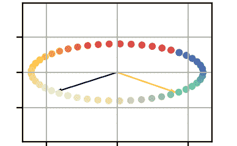

# Sklearn 教程：模块 3

> 原文：[`towardsdatascience.com/sklearn-tutorial-module-3-08c9ae5cb8fa`](https://towardsdatascience.com/sklearn-tutorial-module-3-08c9ae5cb8fa)

## 我参加了官方的 sklearn MOOC 教程。以下是我的收获。

[](https://mocquin.medium.com/?source=post_page-----08c9ae5cb8fa--------------------------------)[](https://towardsdatascience.com/?source=post_page-----08c9ae5cb8fa--------------------------------) [Yoann Mocquin](https://mocquin.medium.com/?source=post_page-----08c9ae5cb8fa--------------------------------)

·发表于 [Towards Data Science](https://towardsdatascience.com/?source=post_page-----08c9ae5cb8fa--------------------------------) ·9 分钟阅读·2023 年 12 月 1 日

--

这是我 scikit-learn 教程系列中的第三篇文章。如果你错过了，我强烈推荐你阅读前两篇文章——这样会更容易跟上：

[](/sklearn-tutorial-module-1-f31b3964a3b4?source=post_page-----08c9ae5cb8fa--------------------------------) ## Sklearn 教程：模块 1

### 我参加了官方的 sklearn MOOC 教程。以下是我的收获。

towardsdatascience.com [](/sklearn-tutorial-module-2-0739c44f595a?source=post_page-----08c9ae5cb8fa--------------------------------) ## Sklearn 教程：模块 2

### 我参加了官方的 sklearn MOOC 教程。以下是我的收获。

towardsdatascience.com

在第三模块中，我们将了解什么是超参数，以及我们为什么和如何优化它们。


图片由 [Glenn Carstens-Peters](https://unsplash.com/@glenncarstenspeters?utm_source=medium&utm_medium=referral) 提供，来自 [Unsplash](https://unsplash.com/?utm_source=medium&utm_medium=referral)

# 什么是超参数

在设置模型时，我们只改变了预处理、模型类型或两者——但我们还没有真正调整模型的超参数。

模型的超参数是我们数据科学家在创建模型/管道时设定的参数。它们是在模型看到任何数据之前定义模型的参数。可以说，它们允许我们定义相同管道的不同“变体”。

超参数通常会影响模型的复杂性，从而影响学习过程和整体模型性能。给定数据集和你想解决的问题，作为数据科学家的你需要在“超参数化模型”的无限空间中找到最佳的“超参数化模型”。

超参数不应与模型在学习过程中学到的内部参数混淆——这些内部参数也称为“系数”。例如，在多项式回归中，超参数（在学习之前设置）是回归的度数，而使用训练集学到的内部参数是多项式系数（a/b/c 在 aX² + bX + c 中）。换句话说，你首先设置度数（超参数），然后使用数据进行回归拟合（内部系数被学习）——而不是反过来。

因此，模型超参数可以在模型/预处理器创建时设置。例如，在 scikit-learn 中：

+   `PolynomialFeatures(degree=degree)`：根据每个特征创建的多项式度数。

+   `Ridge(alpha=5)`：线性岭回归的正则化项。

+   `SVC(C=1.0, kernel="rbf")`：用于支持向量分类器的正则化参数和核函数。根据选择的核函数，还可以使用其他超参数。

+   `KNeighborsClassifier(n_neighbors=5)`：在 K 近邻分类器中考虑的邻居数量。

+   `StandardScaler(with_mean=True, with_std=True)`：标准化器预处理器也可以通过其超参数进行调节，比如是否去除均值和/或除以标准差。

这些例子表明，可用的超参数取决于你为模型使用的整个管道。例如，以下管道具有标准化器和回归器的超参数：

```py
from sklearn.pipeline import Pipeline
from sklearn.linear_model import LinearRegression
from sklearn.preprocessor import StandardScaler

pipeline = Pipeline(
    steps=[
    "standard_scaler", StandardScaler(with_mean=True), # has with_mean/with_std hyperparameters
    "linear_regression", LinearRegression(fit_intercept=True), # has fit_intercept 
 ]
)
# This pipeline's hyperparameters set is the union of the hyperparameters of each step of the pipeline
```

如下所示，超参数还可以在管道创建后进行读取和设置。我们甚至会看到个别步骤可以被视为超参数（例如，标准化器预处理器的“类型”，其可能的值有“StandardScaler”、“MinMaxScaler”等）。

请注意，对于给定的数据集，就像某种模型可能优于另一种模型一样——某个超参数也可能优于另一个。换句话说，对于每个数据集，都存在一个最佳的超参数集。

所以请记住：

+   **超参数对应于在创建模型时设置的参数，在模型接收数据集之前。**

+   **它们对应于你在创建管道时可以设置的每个参数，具体取决于管道中的每一步。**

+   **最佳超参数集取决于 ML 任务的目标和输入数据集。**

+   **我们的工作是找到最佳的超参数。**

本文其余部分解释了如何访问和修改模型的超参数，以及搜索和优化这些超参数的不同方法。

# 如何获取/设置管道/模型的超参数：

在 sklearn 中，一旦创建了模型或管道，就可以使用 API 来：

+   列出可用的超参数及其各自的值。

+   更改其值。

**对于给定的模型，你可以使用**`**.get_params()**` **方法获取所有超参数及其值**：

```py
from sklearn.pipeline import Pipeline
from sklearn.preprocessing import StandardScaler
from sklearn.linear_model import LinearRegression
pipeline = Pipeline(
    steps=[
        ('preprocessor', StandardScaler()),
        ('lin_reg', LinearRegression())
    ]
)
pipeline.get_params()
```

```py
{
 'memory': None,
 'steps': [
 ('preprocessor', StandardScaler()),
 ('lin_reg', LinearRegression())
 ],
 'verbose': False,
 'preprocessor': StandardScaler(),
 'lin_reg': LinearRegression(),
 'preprocessor__copy': True,
 'preprocessor__with_mean': True,
 'preprocessor__with_std': True,
 'lin_reg__copy_X': True,
 'lin_reg__fit_intercept': True,
 'lin_reg__n_jobs': None,
 'lin_reg__positive': False
}
```

几个重要的事项需要注意：

+   `.get_params()` 返回一个字典，包括一个 `steps` 条目，该条目包含管道步骤的列表

+   创建管道时使用的名称，`preprocecssor` 和 `lin_reg` 在我们的例子中，被用于和存储在这个参数字典中

+   因此，每个步骤的超参数都使用`<step_name>__<parameter_name>`的约定命名，步骤名称和步骤参数名称之间用双下划线分隔

为了使 API 接口一致，请注意*所有*参数都在这个字典中返回，包括一些对性能没有影响的超参数（如`lin_reg__n_jobs`和`preprocessor__copy`）。

**类似地，我们可以使用以下一致的 API 来更改这些参数中的任何一个值** `**set_params(name=value)**`**:**

```py
# to change 2 parameters at once
pipeline.set_params(lin_reg__fit_intercept=False, preprocessor__with_std=False)
# to change the scaler step completly
pipeline.set_params(preprocessor=MinMaxScaler())
pipeline.get_params()
```

```py
{
 'memory': None,
 'steps': [
     ('preprocessor', MinMaxScaler()), 
     ('lin_reg', LinearRegression())
 ],
 'verbose': False,
 'preprocessor': MinMaxScaler(),
 'lin_reg': LinearRegression(),
 'preprocessor__clip': False,
 'preprocessor__copy': True,
 'preprocessor__feature_range': (0, 1),
 'lin_reg__copy_X': True,
 'lin_reg__fit_intercept': True,
 'lin_reg__n_jobs': None,
 'lin_reg__positive': False
}
```

如前所述，我们甚至可以使用相同的 API 完全更改一个步骤：这里我们将预处理器从 StandardScaler 更改为 MinMaxScaler。注意在更改预处理器类型后，参数的可用差异（仍称为‘preprocessor’，但相应的超参数是 MinMaxScaler 的那些）。

# 手动超参数调优

现在我们知道了什么是超参数，如何获取/设置它们，以及为什么我们应该优化它们，让我们首先采取一种方法来进行优化。

对于任何优化问题，我们识别：

+   我们想要探索的“空间”：这就是我们想要尝试的所有超参数值。

+   我们想要优化的值：这里对应于模型的性能得分。

最简单且最无效、非鲁棒的优化方式是对一个超参数使用循环，并使用单次训练/测试划分的得分：

```py
pipeline = Pipeline(
     [('preprocessor', StandardScaler()),
      ('lin_reg', LinearRegression())]
)
X_train, X_test, y_train, y_test = train_test_split(X, y)
for with_mean in [True, False]:
    pipeline.set_params(preprocessor__with_mean=with_mean)
    pipeline.fit(X_train, y_train)
    print(f"with_mean={with_mean}: score={pipeline.score(X_test, y_test)}")
# we can then identify the best value for with_mean
```

所以在这种初步方法中，我们手动编写了一个循环，其中管道被拟合和测试。**我们可以做的第一个改进是使用交叉验证来计算一个更有意义的得分：**

```py
for with_mean in [True, False]:
    pipeline.set_params(preprocessor__with_mean=with_mean)
    cv_results = cross_validation(pipeline, X, y)
    print(f"with_mean={with_mean}: score={cv_results['test_score']}")
# we can then identify the best value for with_mean, with more certainty about our choice
```

使用交叉验证，我们对每个超参数值都有一个更稳健的模型性能估计。

现在，让我们通过优化两个超参数进一步改进：我们需要嵌套两个循环，每个超参数一个：

```py
for with_mean in [True, False]:
    for with_std in [True, False]:
        pipeline.set_params(preprocessor__with_mean=with_mean, preprocessor__with_std=with_std)
        cv_results = cross_validation(pipeline, X, y)
        print(f"with_mean={with_mean}/with_std={with_std}: score={cv_results['test_score']}")
# we can then identify the best value for (with_mean, with_std)
```

现在，如果我们想优化 3、4、10 或更多的超参数呢？如果我们想对每个超参数尝试 10 种不同的值呢？我们必须编写许多嵌套循环并检查许多得分。

**这就是为什么 scikit-learn 提供了自动化这个超参数搜索过程的辅助函数，如 GridSearchCV 和 RandomSearchCV。**

# 使用 GridSearch 进行自动调优

sklearn 提供的第一个自动化方法来优化超参数被称为`GridSearchCV`。**这个方法的核心思想是使用字典来指定每个超参数的所有值，并测试所有组合**。例如，为了重现上述示例，其中`with_mean`可以是`[True, False]`，`with_std`可以是`[True, False]`，我们会使用：

```py
param_grid = {
    "preprocessor__with_mean":[True, False],
    "preprocessor__with_std":[True, False],
}
model_grid_search = GridSearchCV(pipeline, param_grid=param_grid)
```

这个第一个代码片段仅创建了一个`model`：是的，一个新的模型，它封装了真正的低级管道。这个新的网格搜索模型可以拟合，再次使用`model_grid_search.fit`。在这个拟合步骤中，所有超参数组合都会被测试，并使用交叉验证计算模型性能。一旦网格搜索拟合完成，它可以像其他预测器一样使用（例如调用 predict 或 score），使用在拟合过程中找到的最佳参数的模型：

```py
# fit the gridsearch model
model_grid_search.fit(X_train, y_train)
# use the best model found
model_grid_search.score(X_test, y_test)
model_grid_search.predict(X_new)
# or inspect the results of the grid search
model_grid_search.cv_results_
```

换句话说，拟合一个 GridSearch 模型意味着尝试所有组合并保留最佳的一个。

一个重要的特点是，我们可以使用字典列表而不仅仅是单个字典来指定我们想尝试的组合，以便精细调整应测试的超参数集合。例如：

```py
param_grid = [
    {
        "preprocessor":StandardScaler(), 
        "preprocessor__with_mean":[True, False], 
        "preprocessor__with_std":[True, False],
    },
    {
        "preprocessor":MinMaxScaler(), 
        "preprocessor__feature_range":[(0, 1), (0, 0.5), (0.25, 0.75)],
    },
]
# This grid search will try the StandardScaler with all combinations of with_mean/with_std AND the MinMaxScaler with 3 different ranges
model_grid_search = GridSearchCV(pipeline, param_grid=param_grid)
```

# 使用 RandomizedSearchCV 进行随机调优

当超参数是连续值且范围很大，和/或需要调整的超参数数量很重要，和/或模型计算复杂时，GridSearchCV 的全组合方法显现出它的局限性：拟合时间开始增加。显然，测试超参数集合的数量与总时间之间存在权衡。

为了规避这些限制并提高找到一个好的——如果不是最好的——超参数集合的机会，我们可以使用随机方法来抽样超参数空间。

这个想法是指定所有超参数的所有可能值，并随机尝试集合。

使用随机方法来优化数值问题是一种常见的技巧，例如用于数值积分或优化问题。

为了在 sklearn 中实现这一点，我们使用`RandomizedSearchCV` —— 使用方法与`GridSearchCV`完全相同。例如，假设我们想通过调整其 C 参数（可以是从 0 到无穷大的任何值）以及其他超参数如 kernel 和 gamma 来优化支持向量分类器：

```py
from sklearn.model_selection import RandomizedSearchCV
param_grid = {
    'C': uniform(0,1000).rvs(100),
    'kernel': ['linear', 'rbf', 'poly', 'sigmoid'],
    'gamma': ['scale', 'auto'] + list(uniform(0,1).rvs(10))
}
random_search_model = RandomizedSearchCV(pipeline, param_grid=param_grid, n_iter=1000)
# fit the gridsearch model
random_search_model.fit(X_train, y_train)
# use the best model found
random_search_model.score(X_test, y_test)
random_search_model.predict(X_new)
# or inspect the results of the grid search
random_search_model.cv_results_
```

在这里，我们允许搜索尝试 1000 个超参数集合，使用`n_iter`来控制尝试次数。

**所以记住：随机化方法允许随机尝试超参数，并使用 n_iter 控制尝试次数。当一些超参数是连续值且/或可能取一个广泛的值范围时，这种方法是有用的。**

# 嵌套交叉验证模式

为了训练和找到使用`GridSearchCV`/`RandomizedSearchCV`发现的最佳超参数模型，我们使用第一次拆分的原始训练集。这个第一次拆分的训练集在内部使用了另一个训练/测试拆分。换句话说：

+   第一次拆分：原始数据集被拆分成 X_train 和 X_test。

+   然后 X_train 被用来通过训练/测试每个超参数集合，使用 N 个内部拆分（折数）来优化超参数：所以 X_train 被拆分 n 次成另一个 X_train/X_test。模型对于每个超参数集合进行拟合/测试，并使用交叉验证评估模型性能。

+   最终，找到的最佳模型在原始 X_test 集上进行测试和评估。

这意味着这种方法仅为我们提供了对泛化性能的单次评估，因为仅保留了原始 X_test 集，且在学习步骤（拟合和优化）中从未使用。为了改善对泛化性能的估计，我们可以使用外部交叉验证循环。

所以请记住：外部循环用于估计整体拟合/优化过程的泛化性能。换句话说，估计的最佳模型性能是通过交叉验证来评估的。

```py
# nested-cross validation pattern: 
cv_results = cross_validate(
    model_grid_search, X, y,
)
```

这样，我们可以在增加计算量的代价下获得两全其美的效果。

# 总结

第三个模块专注于超参数：

+   超参数是定义模型工作和学习方式的参数，它们定义了模型的复杂性。它们不应与模型在展示训练集时学习到的内部系数混淆。

+   由于这些超参数对模型有很大影响，因此必须对其进行优化，以提高模型在给定任务上的表现。最佳超参数取决于输入数据。

+   优化超参数可以通过交叉验证搜索方法，如网格搜索和随机搜索来完成。

+   在优化超参数时，一个好的做法是使用嵌套交叉验证模式来估计最佳拟合模型的性能。

你可能会喜欢我其他的一些帖子，确保查看一下：


[Yoann Mocquin](https://mocquin.medium.com/?source=post_page-----08c9ae5cb8fa--------------------------------)

## Sklearn 教程

[查看列表](https://mocquin.medium.com/list/sklearn-tutorial-2e46a0e06b39?source=post_page-----08c9ae5cb8fa--------------------------------)9 个故事

[Yoann Mocquin](https://mocquin.medium.com/?source=post_page-----08c9ae5cb8fa--------------------------------)

## 科学/数值 Python

[查看列表](https://mocquin.medium.com/list/scientificnumerical-python-9ce115122ab6?source=post_page-----08c9ae5cb8fa--------------------------------)3 个故事

[Yoann Mocquin](https://mocquin.medium.com/?source=post_page-----08c9ae5cb8fa--------------------------------)

## 数据科学与机器学习

[查看列表](https://mocquin.medium.com/list/data-science-and-machine-learning-ba3fb2206051?source=post_page-----08c9ae5cb8fa--------------------------------)3 篇故事

[Yoann Mocquin](https://mocquin.medium.com/?source=post_page-----08c9ae5cb8fa--------------------------------)

## 时间序列的傅里叶变换

[查看列表](https://mocquin.medium.com/list/fouriertransforms-for-timeseries-ed423e3f38ad?source=post_page-----08c9ae5cb8fa--------------------------------)4 篇故事
