# Sklearn 教程：模块 4

> 原文：[`towardsdatascience.com/sklearn-tutorial-module-4-1e1a50e5247d`](https://towardsdatascience.com/sklearn-tutorial-module-4-1e1a50e5247d)

## 线性模型、处理非线性和正则化

[](https://mocquin.medium.com/?source=post_page-----1e1a50e5247d--------------------------------)[](https://towardsdatascience.com/?source=post_page-----1e1a50e5247d--------------------------------) [Yoann Mocquin](https://mocquin.medium.com/?source=post_page-----1e1a50e5247d--------------------------------)

·发布在 [Towards Data Science](https://towardsdatascience.com/?source=post_page-----1e1a50e5247d--------------------------------) ·14 分钟阅读·2023 年 12 月 22 日

--

这是我 scikit-learn 教程系列的**第四**篇文章。如果你错过了前几篇，我强烈推荐你先阅读前三篇——这样会更容易跟上：


[Yoann Mocquin](https://mocquin.medium.com/?source=post_page-----1e1a50e5247d--------------------------------)

## Sklearn 教程

[查看列表](https://mocquin.medium.com/list/sklearn-tutorial-2e46a0e06b39?source=post_page-----1e1a50e5247d--------------------------------)9 个故事

第 4 模块介绍了**线性模型**的概念，使用臭名昭著的**线性回归**和**逻辑回归**模型作为实际示例。

除了这些基本的线性模型外，我们展示了如何利用特征工程来**仅使用线性模型处理非线性问题**，以及**正则化**的概念以防止过拟合。

总体而言，这些概念使我们能够创建非常简单但强大的模型，能够处理许多机器学习问题，通过微调超参数来避免过拟合，同时处理非线性问题。


图片由 [Roman Synkevych](https://unsplash.com/@synkevych?utm_source=medium&utm_medium=referral) 拍摄，来自 [Unsplash](https://unsplash.com/?utm_source=medium&utm_medium=referral)

*所有图表和图像均由作者制作。*

# 线性模型

**线性模型是通过设置系数来“拟合”或“学习”的模型，使其最终仅依赖于输入特征的线性组合。** 换句话说，如果输入数据由 N 个特征 f_1 到 f_N 组成，则模型在某些时候基于线性组合：

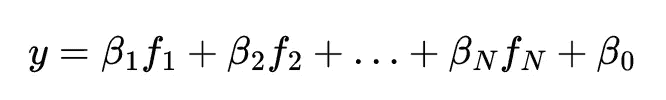

模型学习到的系数是 N+1 个系数 beta。系数 beta_0 代表一个偏移量，无论输入值如何，输出中都存在一个常量值。这种模型的思想是“真实情况”可以通过输入和输出之间的线性关系来近似。

在回归问题中，我们想从输入中预测一个数值，其中一个最简单且广为人知的线性模型是线性回归。你很可能已经进行过数百次线性回归（通过手动操作、在 Excel 中或使用 Python）。

在分类问题中，我们想要从输入中预测一个类别，最简单且广为人知的线性模型是逻辑回归（不要被“逻辑回归”中的“回归”欺骗，它实际上处理的是分类问题）。

还有许多其他线性模型，例如支持向量回归和支持向量分类，以及许多线性回归和逻辑回归的变体。这些都可以成为一系列文章的主题。这里的想法不是深入审查它们，而是展示它们的基本使用和限制（尽管我的完备症会让我详细讲解一些）。

**重要说明：** sklearn 的一个承诺立场是提供开箱即用的模型，以便新手可以快速运行代码（而不需要花费太多时间设置框架的花招或在设置新模型时处理很多错误）——我仍然建议广泛阅读文档，因为它写得很好，你将会学到很多关于 Python API 以及数学和良好实践的知识。

## 回归的线性模型：线性回归

线性回归是最著名的线性回归模型。如上所述，其思想是通过输入 f_i 的线性组合尽可能准确地近似输出 y：


线性回归和线性模型广泛流行的原因之一是它们可以用矩阵来处理，因为矩阵是线性操作的表示。特别是，学习系数 beta 的一种可能方法（在科学中普遍使用，尤其是在机器学习中）是使用普通最小二乘法。

**普通最小二乘法** 旨在选择一个最佳的 beta 向量，使得平方误差之和最小：这种方法的优点在于易于解释（模型“最小化”数据与预测之间的平方距离），并且它有一个封闭形式的解（因此不需要数值优化方法，它基本上只是矩阵乘法和逆运算）。如果你查看 sklearn 的 LinearRegression 文档，你会看到正是这个方法被实现了。

还有许多其他方法可以用来拟合线性回归，这些方法都导致了该最简单模型的“变体”。正如我们下面将看到的，岭回归和套索回归是这些变体的一部分。

注意，线性回归允许进行多项式回归，只需应用一个小的预处理步骤。事实上，多项式就像是输入的单项式的线性组合：


所以一个多项式可以写成

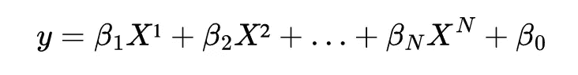

在单变量（单一输入特征）的情况下。为此，我们只需生成一个新的输入矩阵，该矩阵由我们想要的所有多项式变量组成（对于单变量问题，是 X¹、X² 等，甚至在多变量多项式情况下如 X_1 X_2、X_1 X_3 等的交叉变量）。

这是一个关于 1d 输入特征的线性回归简单示例，因此模型实际上只学习 beta0 和 beta1：

```py
import numpy as np
import matplotlib.pyplot as plt
from sklearn.model_selection import train_test_split
from sklearn.linear_model import LinearRegression

X = 2 * np.random.rand(100, 1)
y_true = 4 + 3 * X
y = y_true + 0.5 * np.random.randn(100, 1)

X_train, X_test, y_train, y_test = train_test_split(X, y, test_size=0.2)

model = LinearRegression()
model.fit(X_train, y_train)
y_pred = model.predict(X_test)

fig, ax = plt.subplots()
ax.scatter(X_train, y_train, alpha=0.5, label='Training Set', color='blue')
ax.scatter(X_test, y_test, alpha=0.5,label='Test Set', color='green')
ax.plot(X, y_true, label='True Underlying Model', color='red', linestyle='--')
ax.plot(X_test, y_pred, label='Linear Regression Model', color='orange')
ax.set_xlabel('X')
ax.set_ylabel('y')
ax.set_title(f'Linear Regression on a 1D feature with test score R²=\n {model.score(X_test, y_test):.2f}')
ax.legend()
```

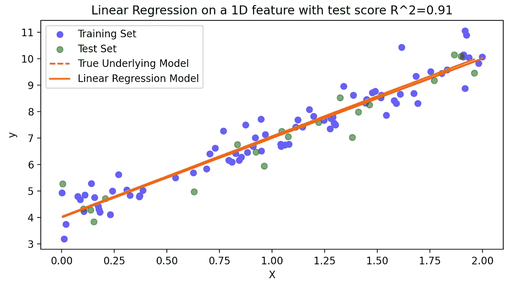

让你多了解一些关于 sklearn 中线性回归模型的信息：

+   你可以通过设置 `fit_intercept` 超参数 `LinearRegression(fit_intercept=True)` 来调整线性回归是否处理偏置 beta0。如果使用 False，则模型期望目标 y 被中心化，即均值为 0。

+   一旦模型拟合完成，它就会学习到系数 beta。你可以使用 `model.intercept_` 和 `model.coefficients_` 来检查这些系数。请记住，在 sklearn API 中，学习到的参数后缀带有下划线“_”。

+   线性回归的默认评分是 R² 系数，它表明拟合模型“解释”数据集变异性的程度。当然，你也可以从 metrics 模块中导入任何评分函数，并使用例如 `from sklearn.metric import mean_absolute_error; mean_absolute_error(y_true, y_pred)` 来计算其他评分。

## 分类的线性模型：逻辑回归

线性回归在分类问题中的等价物是逻辑回归。

这个想法很简单：创建一个线性组合 y，当其输入到逻辑函数时，能够最好地分隔目标类别。像线性回归一样，线性组合 y 可以具有任何值——但为了满足分类的背景，它被输入到逻辑函数中，该函数是一个 S 形函数，接受任何实数输入，并将其映射到 [0, 1] 区间。这个区间然后与目标类别相关联，其中 0 对应于一个类别，+1 对应于另一个类别。

换句话说，如果一个样本从线性组合中映射到一个非常负的值，它将与类别 0 密切相关。随着 y 值的增加并接近 0.5，目标类别变得“不确定”。然后，如果线性组合 y 继续增加超过 0.5，它将被映射到类别+1。在这种情况下，我们称 0.5 为分类阈值。请注意，一些其他类似的算法使用的是[-1,1]的映射区间，阈值为 0。这些基本上只是惯例，不会改变模型的性能。

所以我们可以这样写模型：


其中 x 代表一个长度为 N 的样本向量，特征为 f_1 到 f_N，y 是该样本与模型系数的线性组合，系数可以有任意值，该值通过逻辑函数映射到[0-1]区间。

换句话说，一个样本属于某一类别的概率与其对应的线性组合值 y 有关。最终的类别是基于其相对于阈值的位置，最接近的 - 或最可能的 - 类别。

在 sklearn 术语中，概率是通过`.predict_proba`计算的，该方法返回一个浮点数组，数组的和为 1，以表示属于某个类别的概率。另一方面，`.predict`返回一个类别，对应于`.predict_proba`的最可能类别。

让我们看一个简单的一维例子：同样，线性模型只有一个输入，因此 X 轴可以用来绘制特征值或 y 线性组合（beta1X+beta0）：

```py
import numpy as np
import matplotlib.pyplot as plt
from sklearn.model_selection import train_test_split
from sklearn.linear_model import LogisticRegression
from sklearn.datasets import make_classification

X, y = make_classification(n_samples=100, n_features=1, n_informative=1, n_redundant=0, n_clusters_per_class=1)

X_train, X_test, y_train, y_test = train_test_split(X, y, test_size=0.2, random_state=42)

model = LogisticRegression()
model.fit(X_train, y_train)

x_ = np.linspace(-2, 3).reshape(-1,1)

fig, ax = plt.subplots()
ax.scatter(X_train[y_train == 0], y_train[y_train == 0], label='Class 0 (Training)', color='blue')
ax.scatter(X_train[y_train == 1], y_train[y_train == 1], label='Class 1 (Training)', color='red')
ax.scatter(X_test[y_test == 0], y_test[y_test == 0], label='Class 0 (Test)', marker='s', color='blue', alpha=0.5)
ax.scatter(X_test[y_test == 1], y_test[y_test == 1], label='Class 1 (Test)', marker='s', color='red', alpha=0.5)
ax.plot(x_, model.predict_proba(x_)[:, 1], label='Logistic Regression Model', color='green')
ax.axhline(0.5, color='gray', linestyle='--', label='Decision Boundary (0.5)')
ax.set_xlabel('X')
ax.set_ylabel('Probability')
ax.set_title(f'Logistic Regression Example with score={model.score(X, y):.2f}')
ax.legend()

y_pred = model.predict(X_test)
y_proba = model.predict_proba(X_test)[:, 1]
```

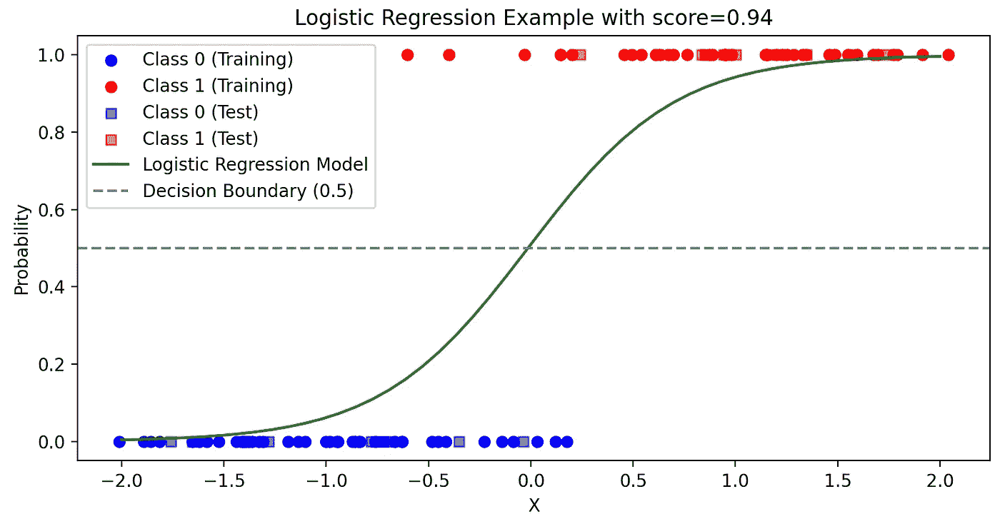

在这里，绿色线条对应于输入特征的线性组合。它对应于给定样本的线性组合的逻辑值。通过调整线性系数，这条绿色线的形状和位置会移动，以更好地匹配训练样本。然后它被用来预测新样本的类别和概率。

为了更好地理解，我们来看看一个二维例子，这个例子更适合用于视觉线性分类。

```py
import numpy as np
import matplotlib.pyplot as plt
import seaborn as sns
from sklearn.model_selection import train_test_split
from sklearn.linear_model import LogisticRegression
from sklearn.datasets import make_classification
from sklearn.inspection import DecisionBoundaryDisplay

X, y = make_classification(n_samples=100, n_features=2, n_informative=2, n_redundant=0, n_clusters_per_class=1, random_state=42)
X_train, X_test, y_train, y_test = train_test_split(X, y, test_size=0.2, random_state=42)

model = LogisticRegression(C=10000000, max_iter=100000)
model.fit(X_train, y_train)

db = DecisionBoundaryDisplay.from_estimator(
    model,
    X,
    response_method="predict_proba", # "predict_proba",
    cmap="RdBu_r",
    alpha=0.5, grid_resolution=200,
)
sns.scatterplot(x=X_train[:, 0], y=X_train[:, 1], hue=y_train, palette={0:"blue", 1:"red"}, alpha=0.5, ax=db.ax_)
sns.scatterplot(x=X_test[:, 0],  y=X_test[:, 1], hue=y_test, palette={0:"blue", 1:"red"}, ax=db.ax_)

db.ax_.set_title(f"Decision boundary of the trained\n LogisticRegression with score={model.score(X, y):.2f}')
```

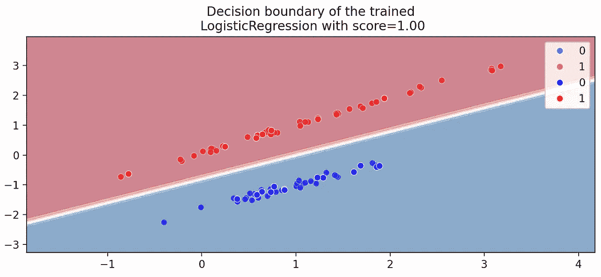

这个例子展示了模型如何通过一条一维线将二维输入特征划分开来。这条“线”代表逻辑函数，因此在阈值以上样本属于一个类别，而在另一侧则属于另一个类别。这里的重要思想是将前一个例子的推理扩展到更高维度。

像之前一样，这里是有关 sklearn 中的逻辑回归模型的附加信息：

+   LogisticRegression 接受更多的超参数，包括类似线性回归的`fit_intercept`，但也有其他参数允许调整正则化——我们将在下面进一步讨论这些。

+   与线性回归一样，学习到的系数可以通过`model.coef_`和`model.intercept_`访问。此外，你还可以通过`model.classes_`获取遇到的类列表。

+   默认的评分是准确度，这只是正确分类的百分比：0 表示没有正确预测，1 表示所有预测都正确。

再次强调，关于分类的线性模型还有很多要说的，但这里的重点只是提供一个简单的例子。要了解更多关于 LogisticRegression 的内容，我强烈建议你去查看 sklearn 的用户指南。

# 处理非线性数据

到目前为止，我们已经看到线性回归和逻辑回归在合成数据上的例子，这些数据确实是线性的。换句话说，我们尝试用线性模型来逼近的真实情况确实是线性的。但在实际数据中，这几乎从未发生过，我们尝试建模和复制的系统通常是相当非线性的。

那么这是否意味着线性模型不够好？实际上并非如此，有解决方法。

除了使用天生非线性的模型（通过设计处理非线性数据的模型）外，我们还可以通过在输入数据中创建具有一定非线性的特征来使用线性模型。

换句话说，我们将使用相同的模型，但使用“更大”的输入数据矩阵，在其中我们“自己”添加包含输入特征之间非线性关系的新特征。

一个好的简单例子是上面介绍的多项式回归。假设我们想要拟合一个相对于单个特征 x 非线性的目标 y。对于标准线性模型，这个多项式回归只是 beta1 x + beta0 回归。如果我们创建新的特征，比如 x²和 x³，输入矩阵现在有 3 个特征，线性回归可以使用关系 y=beta3 x³ + beta2 x² + beta1x + beta0 来拟合目标。见下例：

```py
import numpy as np
import matplotlib.pyplot as plt
from sklearn.preprocessing import PolynomialFeatures
from sklearn.linear_model import LinearRegression
from sklearn.pipeline import make_pipeline

X = 2 * np.random.rand(100, 1)
y = X**3 + 3 * X**2 + 0.5 * X + 2 + np.random.randn(100, 1)

linreg = LinearRegression()
linreg.fit(X, y)

degree = 3
poly_linreg = make_pipeline(PolynomialFeatures(degree), LinearRegression())
poly_linreg.fit(X, y)

x_ = np.linspace(0, 2, 100).reshape(-1, 1)

fig, ax = plt.subplots()
ax.scatter(X, y, label='Original Data')
ax.plot(x_, linreg.predict(x_), color='blue', label=f'Linear Regression (linreg) score={linreg.score(X, y):.2f}')
ax.plot(x_, poly_linreg.predict(x_), color='red', label=f'Polynomial Regression (poly_linreg, Degree {degree}) score={poly_linreg.score(X, y):.2f}')
ax.set_xlabel('X')
ax.set_ylabel('y')
ax.set_title('Fitting Linear and Polynomial Curves to Data')
ax.legend()
```

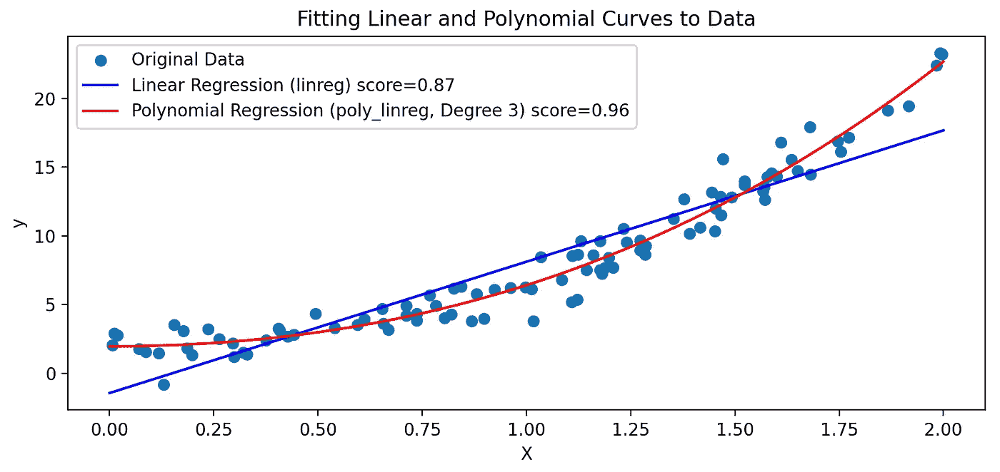

特别是，让我们检查线性回归和多项式回归的系数：

```py
print(linreg.coef_, linreg.intercept_)
print(poly_linreg[-1].coef_, poly_linreg[-1].intercept_)
# [[10.607613]] [-2.32139028]
# [[-0.83958618  5.07382762  0.30530322]] [1.9408571]
```

对于简单的线性回归，我们只得到 beta1 值和 beta0 截距，但对于多项式回归，我们得到 3 个系数，分别对应 beta3、beta2 和 beta1，以及 beta0 截距。

使用 PolynomialFeatures 只是创建包含非线性的新特征的众多可能性之一。其他选项包括使用 KBinsDiscretizer（特别是`encode='onehot'`）、SplineTransformer 或使用 Nystroem 的核方法，或者某些模型中实现的核技巧（例如，使用 SVR 进行回归和 SVC 进行分类的支持向量机模型）。

方法总是一样的：创建非线性的新特征并将其添加到输入数据中，以便线性模型可以利用这些特征来拟合复杂的 y 目标。好消息是，在 sklearn 中，所有这些方法都实现为管道中的预处理步骤，或内置于估计模型中。

# 正则化

到目前为止，我们已经看到如何使用基本的线性模型，既用于线性问题也用于通过添加新的非线性特征来处理非线性问题。

正则化的目的是改变或调整模型的学习方式，通常是通过改变目标/代价函数，以保持模型复杂度不过高。

从数学上讲，它通常是通过在问题的代价函数中添加一个项来实现的。例如，正则化的一个最简单的例子是线性回归，在这种情况下称为“岭回归”。经典的线性回归代价函数由平方误差的均值（或总和）给出：

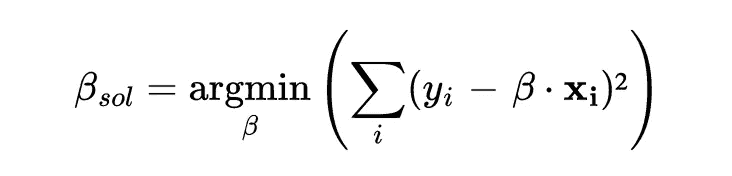

使用正则化时，代价函数包含一个附加项，即向量 beta 的 L2 范数：

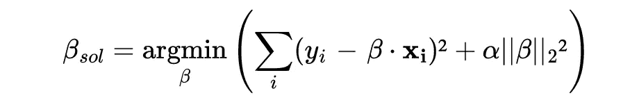

系数向量的范数由 alpha 超参数加权，以便我们可以修改其范数在最终解决方案中应有的影响程度。这样，在优化/学习过程中，beta 的系数不会变得过于庞大，而是会找到范数和误差之间的良好平衡。

这个概念可以应用于几乎任何其他模型，包括逻辑回归。

关于正则化，我们可以进一步讨论：就像我们看到的在管道/模型中调整超参数的重要性一样，岭回归的 alpha 参数也应该被优化（这适用于任何正则化参数）。

为此，我们可以使用 GridSearchCV 或 RandomSearchCV，正如在之前的模块中所见，但由于优化岭回归的 alpha 参数非常常见，sklearn 提供了一个 RidgeCV 模型，它接受一个 alpha 值列表进行测试，并使用交叉验证进行选择。

所以，让我们总结一下处理线性回归正则化的 4 种方法：

1.  不使用正则化，使用 LinearRegression()

1.  标准的未优化岭回归，使用 Ridge()，相当于 alpha=1

1.  使用 GridSearch 或 RandomSearch 优化的岭回归

1.  带有内置优化的岭回归，使用 RidgeCV

让我们通过视觉化的方式来看正则化如何影响线性回归的系数，因此使用岭回归模型。在以下示例中，我们使用 5 次多项式特征扩展进行线性回归，通过 Ridge 模型的正则化项及其 alpha 超参数来控制正则化的强度。

**使用 alpha=0** 时，没有正则化，我们得到经典的线性回归结果。由于我们使用高达 5 次特征来回归一个有噪声的线性关系，模型往往会有些过拟合，线性系数的范围很大（这里在 -1500 到 +1500 之间）。

**使用 alpha=1** 时，我们得到“轻微”正则化。模型过拟合的程度明显减少，系数的幅度也小了很多。

**使用 alpha=100** 时，我们得到非常强的正则化，因此系数不会增长很多，模型往往会出现欠拟合。

```py
import numpy as np
import matplotlib.pyplot as plt
from sklearn.linear_model import Ridge
from sklearn.preprocessing import PolynomialFeatures
from sklearn.pipeline import make_pipeline

X = 2 * np.random.rand(50, 1)
y = 4 + 3 * X + np.random.randn(50, 1)

# Function to fit and plot Ridge Regression models
def plot_ridge(alpha, ax1, ax2, deg=8):
    model = make_pipeline(PolynomialFeatures(deg, include_bias=False), Ridge(alpha=alpha))
    model.fit(X, y)

    ax1.scatter(X, y, color='blue', s=10, label='Data')

    x_range = np.linspace(0, 2, 100).reshape(-1, 1)
    y_pred = model.predict(x_range)
    ax1.plot(x_range, y_pred, color='red', label=f'Ridge Regression (alpha={alpha})')

    coefs = model.named_steps['ridge'].coef_.ravel()
    ax2.plot(range(deg), coefs, color='green', marker='o', label='Coefficients')

    ax1.set_title(f'Ridge Regression with alpha={alpha} / R²={model.score(X,y):.2f}')
    ax2.set_title(f"Linear coefficients with alpha={alpha}")
    ax1.legend()

fig, axs = plt.subplots(2, 3, figsize=(18, 6))
plot_ridge(0,   axs[0,0], axs[1,0])
plot_ridge(1,   axs[0,1], axs[1,1])
plot_ridge(100, axs[0,2], axs[1,2])
fig.tight_layout()
```

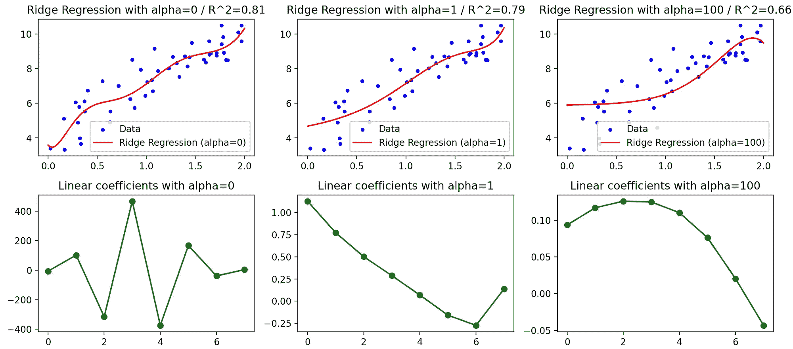

让我们进一步探讨 alpha 值如何影响训练分数和测试分数的变化：

```py
from sklearn.model_selection import ValidationCurveDisplay
# Plotting the validation curve
ValidationCurveDisplay.from_estimator(
    make_pipeline(PolynomialFeatures(10, include_bias=False), Ridge()),
    X, y,
    param_name='ridge__alpha',
    param_range=np.logspace(-3, 3),
)
```

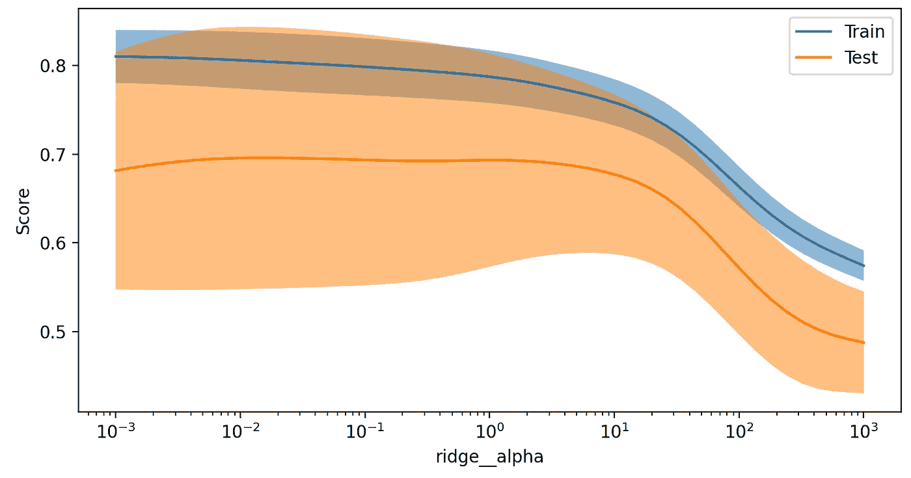

对于一个 10 次多项式，最佳正则化系数 alpha 似乎在 0.01 到 1 之间。

最后，请记住，就像创建新特征来处理非线性可以应用于几乎所有模型一样，正则化也可以包含在大多数模型中（包括带有其 C 参数的逻辑回归）。

# 总结

在这第 4 篇文章中，我们看到了：

+   最重要的线性模型，即线性回归和逻辑回归

+   如何通过创建新特征来处理非线性问题，例如创建多项式特征

+   如何通过在目标函数中添加正则化项来控制模型的复杂度，以使线性系数不能任意增大

你可能会喜欢我的一些其他文章，确保查看一下：


[Yoann Mocquin](https://mocquin.medium.com/?source=post_page-----1e1a50e5247d--------------------------------)

## 时序的傅里叶变换

[查看列表](https://mocquin.medium.com/list/fouriertransforms-for-timeseries-ed423e3f38ad?source=post_page-----1e1a50e5247d--------------------------------)4 个故事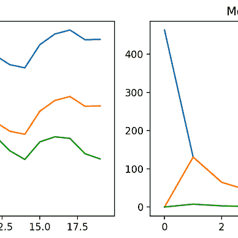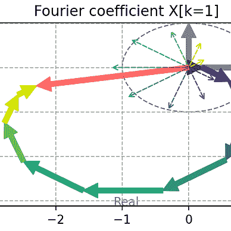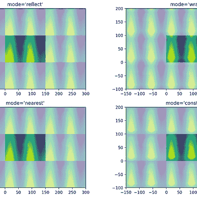

[Yoann Mocquin](https://mocquin.medium.com/?source=post_page-----1e1a50e5247d--------------------------------)

## 科学/数值 Python

[查看列表](https://mocquin.medium.com/list/scientificnumerical-python-9ce115122ab6?source=post_page-----1e1a50e5247d--------------------------------)3 个故事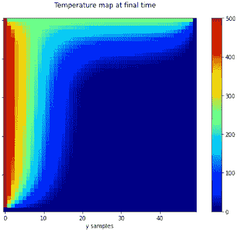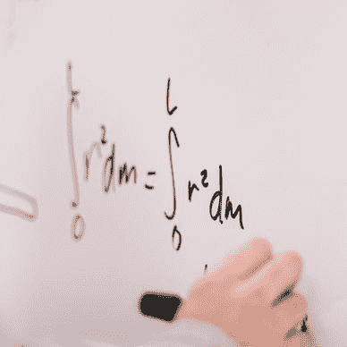

[Yoann Mocquin](https://mocquin.medium.com/?source=post_page-----1e1a50e5247d--------------------------------)

## Sklearn 教程

[查看列表](https://mocquin.medium.com/list/sklearn-tutorial-2e46a0e06b39?source=post_page-----1e1a50e5247d--------------------------------)9 个故事

[Yoann Mocquin](https://mocquin.medium.com/?source=post_page-----1e1a50e5247d--------------------------------)

## 数据科学与机器学习

[查看列表](https://mocquin.medium.com/list/data-science-and-machine-learning-ba3fb2206051?source=post_page-----1e1a50e5247d--------------------------------)3 个故事！[](../Images/c078e74fd67e0141c2b54b82823c78d4.png)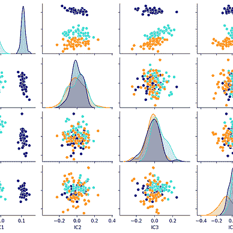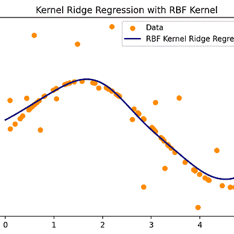
