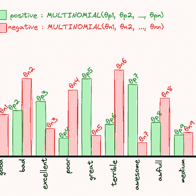
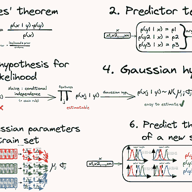

# Sklearn 教程：模块 4

> 原文：[`towardsdatascience.com/sklearn-tutorial-module-4-1e1a50e5247d?source=collection_archive---------12-----------------------#2023-12-22`](https://towardsdatascience.com/sklearn-tutorial-module-4-1e1a50e5247d?source=collection_archive---------12-----------------------#2023-12-22)

## 线性模型、处理非线性和正则化

 [Yoann Mocquin](https://mocquin.medium.com/?source=post_page-----1e1a50e5247d--------------------------------)

·

[关注](https://medium.com/m/signin?actionUrl=https%3A%2F%2Fmedium.com%2F_%2Fsubscribe%2Fuser%2F173731d06320&operation=register&redirect=https%3A%2F%2Ftowardsdatascience.com%2Fsklearn-tutorial-module-4-1e1a50e5247d&user=Yoann+Mocquin&userId=173731d06320&source=post_page-173731d06320----1e1a50e5247d---------------------post_header-----------) 发表在 [Towards Data Science](https://towardsdatascience.com/?source=post_page-----1e1a50e5247d--------------------------------) ·14 分钟阅读·2023 年 12 月 22 日

--

这是我 scikit-learn 教程系列的**第四**篇文章。如果你没看过前面的文章，我强烈推荐你先看前三篇——这样会更容易跟上：

[Yoann Mocquin](https://mocquin.medium.com/?source=post_page-----1e1a50e5247d--------------------------------)

## Sklearn 教程

[查看列表](https://mocquin.medium.com/list/sklearn-tutorial-2e46a0e06b39?source=post_page-----1e1a50e5247d--------------------------------)9 篇故事

本模块介绍了**线性模型**的概念，使用臭名昭著的**线性回归**和**逻辑回归**模型作为工作示例。

除了这些基本的线性模型外，我们还展示了如何使用特征工程来**仅使用线性模型处理非线性问题，**以及**正则化**的概念，以防止过拟合。

总的来说，这些概念使我们能够创建非常简单但功能强大的模型，这些模型能够处理许多机器学习问题，通过微调超参数来避免过拟合，同时处理非线性问题。

照片由 [Roman Synkevych](https://unsplash.com/@synkevych?utm_source=medium&utm_medium=referral) 提供，来源于 [Unsplash](https://unsplash.com/?utm_source=medium&utm_medium=referral)

*所有图表和图像均由作者制作。*

# 线性模型

**线性模型是通过设置系数来“拟合”或“学习”的模型，以便它们最终只会**…
