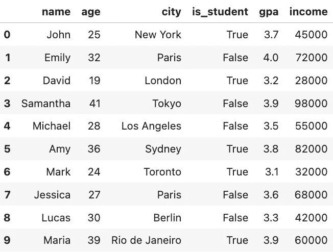
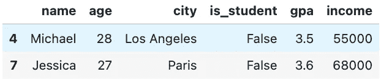
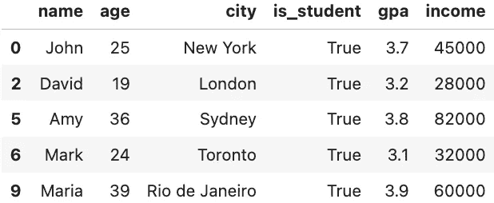
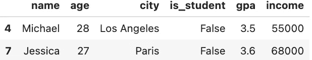
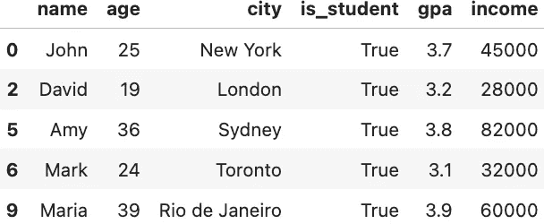
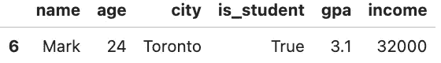

# 使用“&”和“|”而不是“and”和“or”来切片 Pandas 数据框

> 原文：[`towardsdatascience.com/slicing-a-pandas-dataframe-using-and-instead-of-and-and-or-eca8fed7751`](https://towardsdatascience.com/slicing-a-pandas-dataframe-using-and-instead-of-and-and-or-eca8fed7751)

## 3 分钟 Pandas

## 当你看到 ValueError: The truth value of a Series is ambiguous. Use a.empty, a.bool(), a.item(), a.any() or a.all() 时

[](https://jianan-lin.medium.com/?source=post_page-----eca8fed7751--------------------------------)[](https://towardsdatascience.com/?source=post_page-----eca8fed7751--------------------------------) [Yufeng](https://jianan-lin.medium.com/?source=post_page-----eca8fed7751--------------------------------)

·发表在 [Towards Data Science](https://towardsdatascience.com/?source=post_page-----eca8fed7751--------------------------------) ·阅读时间 6 分钟·2023 年 4 月 14 日

--


图片由 [TJ Arnold](https://unsplash.com/@missinformed?utm_source=medium&utm_medium=referral) 提供，来源于 [Unsplash](https://unsplash.com/?utm_source=medium&utm_medium=referral)

如果你处理数据，数据过滤/切片是一项日常任务。

数据切片的一般思路是选择那些列值符合特定标准的行。例如，选择第二列值小于 3 的行、选择第三列值在预定义列表中的行、选择第五列值以‘ABC’开头的行等（[详细了解如何切片](https://medium.com/towards-data-science/extract-rows-columns-from-a-dataframe-in-python-r-678e5b6743d6)）。

如果你在 Python 库`pandas`中进行数据切片，并使用`and`或`or`运算符结合多个标准，你一定遇到过这种情况。

```py
ValueError: The truth value of a Series is ambiguous. Use a.empty, a.bool(), a.item(), a.any() or a.all()
```

这是一个示例。让我们在 pandas 中创建一个数据框，

```py
import pandas as pd
import numpy as np

data = {'name': ['John', 'Emily', 'David', 'Samantha', 'Michael', 'Amy', 'Mark', 'Jessica', 'Lucas', 'Maria'],
        'age': [25, 32, 19, 41, 28, 36, 24, 27, 30, 39],
        'city': ['New York', 'Paris', 'London', 'Tokyo', 'Los Angeles', 'Sydney', 'Toronto', 'Paris', 'Berlin', 'Rio de Janeiro'],
        'is_student': [True, False, True, False, False, True, True, False, False, True],
        'gpa': [3.7, 4.0, 3.2, 3.9, 3.5, 3.8, 3.1, 3.6, 3.3, 3.9],
        'income': [45000, 72000, 28000, 98000, 55000, 82000, 32000, 68000, 42000, 60000]}

# create the pandas DataFrame
df = pd.DataFrame(data)
```

数据框如下所示，



创建的玩具数据框（图片由作者提供）

然后，使用‘***and***’，我们尝试选择年龄不超过 25 岁但年收入至少为 50,000 的人。

```py
df[(df['age']<=30) and (df['income']>=50000)]
```

这是我得到的结果，

```py
---------------------------------------------------------------------------
ValueError                                Traceback (most recent call last)
/var/folders/13/qmh5_52s3m72pbywgbf08_ch0000gn/T/ipykernel_50721/396533384.py in <module>
----> 1 df[(df['age']<=30) and (df['income']>=50000)]

~/opt/anaconda3/lib/python3.9/site-packages/pandas/core/generic.py in __nonzero__(self)
   1525     @final
   1526     def __nonzero__(self):
-> 1527         raise ValueError(
   1528             f"The truth value of a {type(self).__name__} is ambiguous. "
   1529             "Use a.empty, a.bool(), a.item(), a.any() or a.all()."

ValueError: The truth value of a Series is ambiguous. Use a.empty, a.bool(), a.item(), a.any() or a.all().
```

我使用了`and`来将两个标准结合在一起，以便从数据框中获取满足两个标准的行。

我收到这个“值错误”，因为即使该 pandas series 由布尔值组成，将 pandas series 对象视为布尔对象仍然是模糊的。

具体来说，在表达式 `(df[‘age’]<=30) and (df[‘income’]>=50000)` 中，Python 尝试将布尔 pandas Series `df[‘age’]<=30` 和 `df[‘income’]>=50000` 首先转换为单个布尔值。

这很模糊，因为 Python 不知道是应该仅当所有值都为`True`时才分配`True`，还是只要任何一个值为`True`。因此，结果出现了值错误。

解决此类问题非常简单，关键是避免将 pandas 系列转换为单一布尔值。

## 避免 pandas.Series()到布尔值的转换

在上面的例子中，我们实际上需要在两个 pandas 系列之间进行逐元素的`and`操作。来吧。

最简单的解决方案是将`and`改为`&`。

```py
df[(df['age']<=30) & (df['income']>=50000)]
```

结果为，



`&`而非`and`结果（作者提供的图片）

`or`操作也是一样的。

例如，我们希望选择那些仍然是学生或者年龄在 25 岁以下的人。

使用`or`将导致与使用`and`相同的值错误，

```py
df[(df['age']<=25) or df['is_student']]
```

```py
df[(df['age']<=25) or df['is_student']]
---------------------------------------------------------------------------
ValueError                                Traceback (most recent call last)
/var/folders/13/qmh5_52s3m72pbywgbf08_ch0000gn/T/ipykernel_50721/1315814170.py in <module>
----> 1 df[(df['age']<=25) or df['is_student']]

~/opt/anaconda3/lib/python3.9/site-packages/pandas/core/generic.py in __nonzero__(self)
   1525     @final
   1526     def __nonzero__(self):
-> 1527         raise ValueError(
   1528             f"The truth value of a {type(self).__name__} is ambiguous. "
   1529             "Use a.empty, a.bool(), a.item(), a.any() or a.all()."

ValueError: The truth value of a Series is ambiguous. Use a.empty, a.bool(), a.item(), a.any() or a.all().
```

相反，我们应该这样做，

```py
df[(df['age']<=25) | df['is_student']]
```

结果为，



`|`而非`or`结果（作者提供的图片）

当然，我们也可以使用 NumPy 函数来实现相同的操作，因为 pandas 系列是建立在 NumPy 数组之上的。

```py
df[np.logical_and(df['age']<=30,df['income']>=50000)]
```

结果与使用`&`得到的相同，



np.logical_and()结果（作者提供的图片）

对于`or`操作也是类似的，

```py
df[np.logical_or(df['age']<=25, df['is_student'])]
```

结果为，



np.logical_or()结果（作者提供的图片）

为了使代码看起来整洁，我建议在数据切片中使用`&`和`|`。

## 避免链式比较

有时你可能会感到困惑，即使使用了`&`和`|`，仍然得到相同的错误。

你很可能做了链式比较。

例如，使用上述相同的数据，我们希望获取那些年龄在 20 到 25 岁之间且 GPA 至少为 3.0 的人。

```py
df[(20 < df['age'] < 25) &
  (df['gpa'] >= 3)]
```

结果为，

```py
---------------------------------------------------------------------------
ValueError                                Traceback (most recent call last)
/var/folders/13/qmh5_52s3m72pbywgbf08_ch0000gn/T/ipykernel_50721/1837177779.py in <module>
----> 1 df[(20 < df['age'] < 25) &
      2   (df['gpa'] >= 3)]

~/opt/anaconda3/lib/python3.9/site-packages/pandas/core/generic.py in __nonzero__(self)
   1525     @final
   1526     def __nonzero__(self):
-> 1527         raise ValueError(
   1528             f"The truth value of a {type(self).__name__} is ambiguous. "
   1529             "Use a.empty, a.bool(), a.item(), a.any() or a.all()."

ValueError: The truth value of a Series is ambiguous. Use a.empty, a.bool(), a.item(), a.any() or a.all().
```

不要将此错误与我们上面看到的错误混淆。虽然错误信息相同，但原因不再是`&`操作。这是关于`20<df['age']<25`的链式比较。

不幸的是，pandas 数据切片中不允许进行链式比较。

因此，链式比较必须拆分为两个独立的比较。

```py
df[(20 < df['age']) &
   (df['age']< 25) &
  (df['gpa'] >= 3)]
```

现在我们得到了正确的结果，



避免链式比较（作者提供的图片）

并且不要忘记对每个你希望用`&`或`|`结合的条件使用括号，否则操作符`&`和`|`将比比较操作有更高的优先级。

例如，

```py
df[20 < df['age'] &
   df['age']< 25 &
  df['gpa'] >= 3]
```

将给出相同的错误信息。

```py
---------------------------------------------------------------------------
ValueError                                Traceback (most recent call last)
/var/folders/13/qmh5_52s3m72pbywgbf08_ch0000gn/T/ipykernel_50721/2058952526.py in <module>
----> 1 df[20 < df['age'] &
      2    df['age']< 25 &
      3   df['gpa'] >= 3]

~/opt/anaconda3/lib/python3.9/site-packages/pandas/core/generic.py in __nonzero__(self)
   1525     @final
   1526     def __nonzero__(self):
-> 1527         raise ValueError(
   1528             f"The truth value of a {type(self).__name__} is ambiguous. "
   1529             "Use a.empty, a.bool(), a.item(), a.any() or a.all()."

ValueError: The truth value of a Series is ambiguous. Use a.empty, a.bool(), a.item(), a.any() or a.all().
```

## 重点总结

1.  使用`&`和`|`而非`and`和`or`来结合 pandas 数据切片中的比较。

1.  避免使用链式比较作为数据切片的一个标准。

感谢阅读！希望你在工作中享受使用 Pandas 技巧！

如果你想阅读更多我的故事，请[订阅我的 Medium](https://jianan-lin.medium.com/subscribe)。你还可以通过我的[推荐链接](https://jianan-lin.medium.com/membership)加入 Medium 会员！
