# Pandas 中的滑动窗口

> 原文：[`towardsdatascience.com/sliding-windows-in-pandas-40b79edefa34?source=collection_archive---------1-----------------------#2023-03-29`](https://towardsdatascience.com/sliding-windows-in-pandas-40b79edefa34?source=collection_archive---------1-----------------------#2023-03-29)

## 使用重叠窗口技术识别时间序列数据中的模式

[](https://avrilaysha.medium.com/?source=post_page-----40b79edefa34--------------------------------)[](https://towardsdatascience.com/?source=post_page-----40b79edefa34--------------------------------) [Avril Aysha](https://avrilaysha.medium.com/?source=post_page-----40b79edefa34--------------------------------)

·

[关注](https://medium.com/m/signin?actionUrl=https%3A%2F%2Fmedium.com%2F_%2Fsubscribe%2Fuser%2Fb016782a8709&operation=register&redirect=https%3A%2F%2Ftowardsdatascience.com%2Fsliding-windows-in-pandas-40b79edefa34&user=Avril+Aysha&userId=b016782a8709&source=post_page-b016782a8709----40b79edefa34---------------------post_header-----------) 发表于 [Towards Data Science](https://towardsdatascience.com/?source=post_page-----40b79edefa34--------------------------------) · 10 分钟阅读 · 2023 年 3 月 29 日[](https://medium.com/m/signin?actionUrl=https%3A%2F%2Fmedium.com%2F_%2Fvote%2Ftowards-data-science%2F40b79edefa34&operation=register&redirect=https%3A%2F%2Ftowardsdatascience.com%2Fsliding-windows-in-pandas-40b79edefa34&user=Avril+Aysha&userId=b016782a8709&source=-----40b79edefa34---------------------clap_footer-----------)

--

[](https://medium.com/m/signin?actionUrl=https%3A%2F%2Fmedium.com%2F_%2Fbookmark%2Fp%2F40b79edefa34&operation=register&redirect=https%3A%2F%2Ftowardsdatascience.com%2Fsliding-windows-in-pandas-40b79edefa34&source=-----40b79edefa34---------------------bookmark_footer-----------)

图片由 [尤金·赫斯季亚科夫](https://unsplash.com/it/@eugenechystiakov?utm_source=unsplash&utm_medium=referral&utm_content=creditCopyText) 提供，来自 [Unsplash](https://unsplash.com/photos/B-h3so_5UKA?utm_source=unsplash&utm_medium=referral&utm_content=creditCopyText)

窗口技术使数据分析师能够识别时间序列数据中的有价值模式。滑动窗口特别强大，因为它们允许你比其他技术更早地发现模式。在做出关键决策的几分钟（或几秒钟）早一点可能会为你节省资金，这是一项重要的功能。

本文将展示在`pandas`中执行窗口操作的三种方法，并讨论每种方法的权衡和好处。到最后，你将能够创建一个类似于下面这样的滑动窗口可视化：

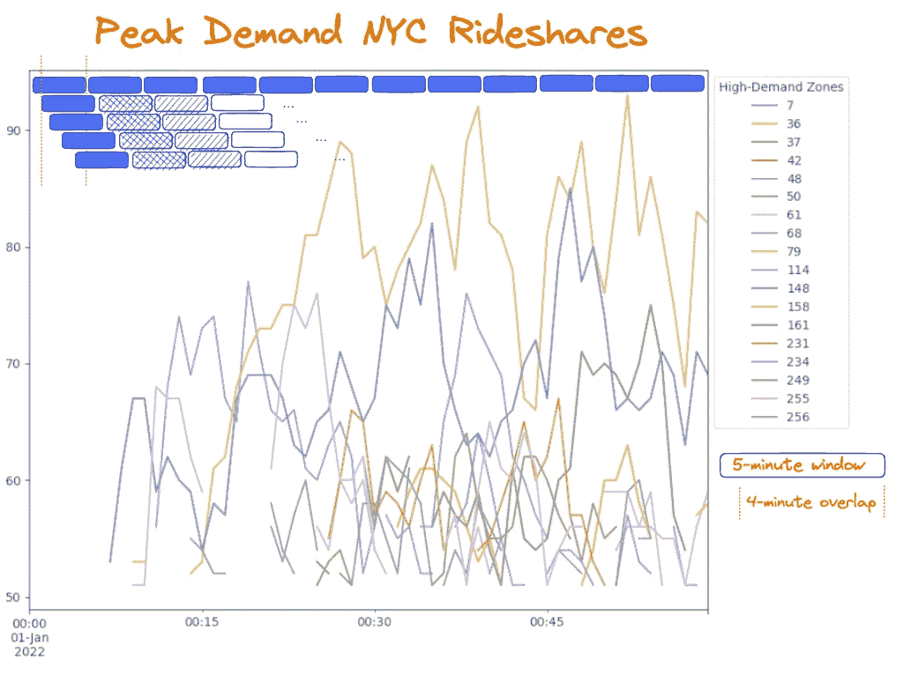

作者提供的图片

想象一下你是 Uber 或 Lyft 的司机。你在纽约驾驶，等待下一个乘客……同时还在烧着昂贵的汽油。这不太好。你需要找到一种方法来最大化迅速获得新乘客的机会。你该怎么做？

你可以采取经验驱动的方法，经过一段时间测试不同策略来找出纽约的高需求区域。你可以尝试第一天从一个社区开始，第二天从另一个社区开始，依此类推……但纽约市很大，这样做需要花费*很长*时间才能开始以任何程度的信心识别出模式。

采用**数据驱动的方法**会更有效。这正是我们在本文中要做的。

开始吧 🚀

## 数据集

我们将使用来自纽约市出租车和豪华车委员会（TLC）旅行记录*数据集的 1 小时拼车（Uber/Lyft）数据，该数据集从 2022 年 1 月的完整数据集中子样本提取。你可以[下载完整的 Parquet 文件](https://d37ci6vzurychx.cloudfront.net/trip-data/fhvhv_tripdata_2022-01.parquet)（2022 年 1 月）。这包含了超过 1450 万次的乘车数据！（）要复制本文使用的数据集，请将数据子样本提取到前 100K 行。你也可以[直接访问数据和笔记本](https://github.com/rrpelgrim/sliding-windows-pandas)的专用 Github 仓库。

```py
df = pd.read_parquet("fhvhv_tripdata_2022-01.parquet").head(100_000)
```

记住：我们的目标是**识别需求峰值区域，定义为每单位时间的请求数量。**

# 1\. 快速粗略：对整个数据集进行 GroupBy


作者提供的图片

我们将开始对整个 1 小时数据集进行非常粗略的处理，以识别高需求区域。

在使用`time_mask`将数据子集提取到特定小时，并按`request_datetime`列排序值之后，这基本上就是一个 groupby 操作。

```py
# define time mask
time_mask = (df['request_datetime'].dt.month == 1) & \
            (df['request_datetime'].dt.day == 1) & \
            (df['request_datetime'].dt.hour == 0) 

# sort values
one_hour = df[time_mask].sort_values(by=['request_datetime'])

# perform a simple groupby with .count()
high_demand = one_hour[['PULocationID','hvfhs_license_num']].groupby(['PULocationID']).count()
```

我们现在有每个取车地点的请求数量列表。让我们清理列名并排序值以获取有意义的输出。

```py
high_demand = high_demand.rename(columns={'hvfhs_license_num':'n_requests'})
high_demand.sort_values(by='n_requests', ascending=False, inplace=True)
high_demand.head(10)
```

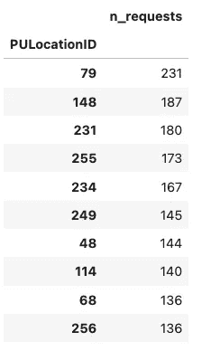

作者从[这个笔记本]生成的数据输出

太好了。我们现在可以识别出数据中需求最高的前 10 个取车区域。我们可以每小时批量运行一次这个代码。这很棒……但仅仅是这样。

以每小时为批次处理数据意味着司机只能在*每小时结束时*收到高需求区域的信号。如果高峰实际上发生在那个小时的前 15 分钟甚至 5 分钟内呢？那么，急匆匆地赶到那个城区只会发现高峰需求早已过去，毫无用处。

# 2\. Pandas 中的滑动窗口

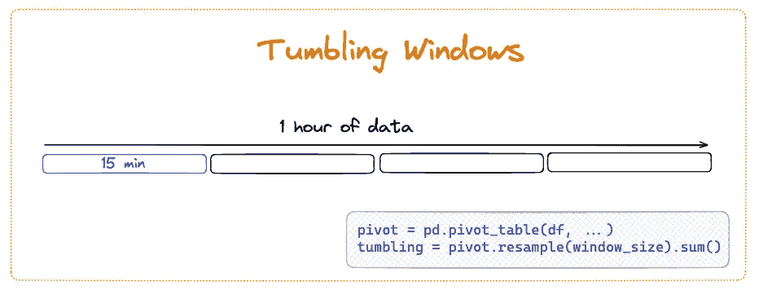

作者提供的图像

司机们不满意。我们需要做得更好。让我们编写一些代码，将我们的一小时数据分割成[tumbling windows](https://pathway.com/glossary/tumbling-window) 每 15 分钟一个窗口。这样我们将获得更多的细节，并能给司机提供更有帮助的指示，告诉他们何时到达城市的哪个部分。

我们可以使用 pandas 的`pivot_table()`和`.resample()`方法来完成这个任务。我们需要将数据框的索引设置为一个 datetime 列。由于我们对请求数量感兴趣，我们将使用`request_datetime`列。

注意，数据集按请求的顺序未正确排序，并且包括一些在前一年午夜之前请求的行程。因此，让我们先清理这些数据。

```py
# subset df to requests from 2022 only
requests = df[['request_datetime', 'on_scene_datetime', 'pickup_datetime', 'dropoff_datetime', 'PULocationID', 'DOLocationID']][df.request_datetime.dt.year==2022]

# sort by request_datetime
requests.sort_values(by=['request_datetime'], inplace=True)

# set request_datetime as index
requests.set_index('request_datetime', inplace=True)

requests.head()
```

我们的数据框现在看起来像这样：

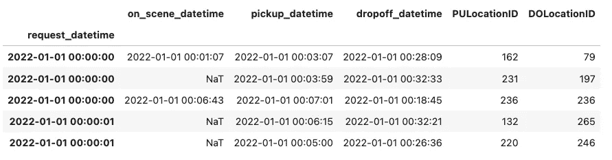

作者生成的数据输出

记住，我们希望将数据集分组到 15 分钟的窗口中，每个窗口对应一个接送区的请求数量。这意味着我们希望输出具有 4 行（15 x 4 = 60 分钟）和每个 PULocationID 的列。

我们需要一个透视表：

```py
# expand df to have a unique column for each PULocationID
pivot = pd.pivot_table(
    requests, 
    values='pickup_datetime', 
    index=requests.index,
    columns=['PULocationID'], 
    aggfunc='count'
)

pivot.head()
```

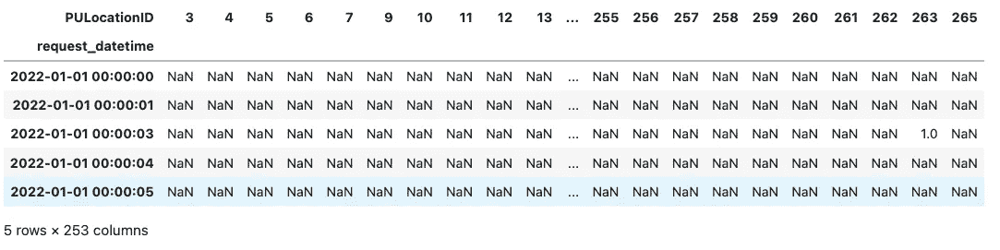

作者生成的数据输出

这是一个稀疏的数据框，对于每一行（请求），在对应于该请求的接送区的列中仅有一个计数（1）。

让我们使用`.sum()`对我们的数据框进行重采样，将数据分组到 15 分钟的窗口中，并对每个 PULocationID 的计数进行求和：

```py
tumbling = pivo.resample('15min').sum()
tumbling
```

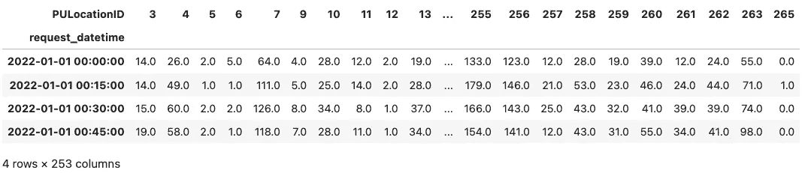

作者生成的数据输出

很好！我们现在有了每个 15 分钟窗口每个接送区的请求数量。剩下的就是准确地定义“高需求”的标准——假设为每 15 分钟窗口 40 个请求——然后我们可以使用这个数据框来筛选出超过高需求阈值的窗口和接送区。

我们还可以通过可视化数据来识别高峰需求区域：

```py
res.resample('15min').sum().plot(legend=False)
```

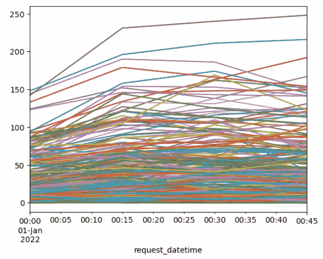

作者生成的图表

这很好……但仍然只是有点好。我们仍然缺少很多细节。我们需要等待每个 15 分钟窗口完成后才能聚合数据。如果峰值发生在第 1 分钟到第 16 分钟之间的 15 分钟窗口（而不是第 0 分钟到第 15 分钟之间），我们将错过峰值一分钟，但需要等到 14 分钟后才能收到信号。到那时，可能已经太晚了，无法指示司机前往那个接送区。

> 不要害怕，完美就在眼前！

# 3\. Pandas 中的滑动窗口


图片由作者提供

理想情况下，我们希望每分钟都有一个信号，告诉我们哪些区域正在经历高峰需求。我们还希望减少窗口的大小，以使我们的驱动程序能够更快地对 incoming 数据做出反应。因此，让我们使用 5 分钟的窗口，并将“高峰需求”定义为**每 5 分钟窗口内超过 50 个请求**。

我们可以使用 pandas 的`.rolling()`方法来创建**滑动窗口**：5 分钟的窗口，重叠 4 分钟，以便我们可以每分钟跟踪 incoming 请求的速率。

你可以使用`.resample()`和`.rolling()`方法在 pandas 中创建滑动窗口。确保`.resample()`到**你所需信号间隔的大小**，而不是窗口的大小：

```py
# create sliding windows in pandas
res = pivot.resample(interval_size).sum()
windows = res.rolling(window_size).sum()
```

让我们一步步拆解。

我们希望输出是一系列行，每行是一个 5 分钟窗口，列中包含该 5 分钟窗口内每个取件区域的请求总数。然而，我们希望第二行不是从第一个 5 分钟窗口结束时开始，而是从第一个 5 分钟窗口的第一分钟结束时开始。

还跟得上吗？如果不行，也许下面的图示会有帮助：

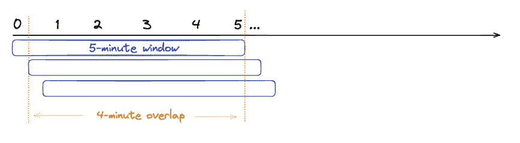

图片由作者提供

我们真正想要的是 56 行每行 5 分钟，每行之间有 4 分钟的重叠。这将为我们提供每分钟的信号，告知哪些区域（如果有的话）每 5 分钟内请求超过 50 个。

为了实现这一点，我们需要首先重采样我们的 DataFrame，以便每分钟获取一行数据：

```py
res_1m = res.resample('1min').sum()
res_1m.head(3)
```

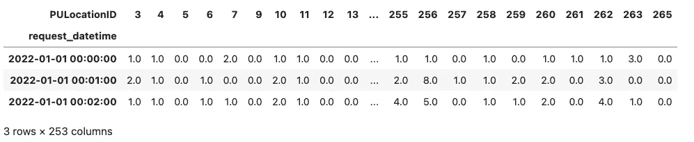

作者生成的数据输出

*(如果你想每秒钟获取一个信号，你可以在这里将采样频率调整为`*1s*`。)*

现在每一行代表一分钟，我们可以使用`rolling()`和`sum()`来获得每 5 行（分钟）的请求总数：

```py
windows = res_1m.rolling(5).sum()
windows.head()
```

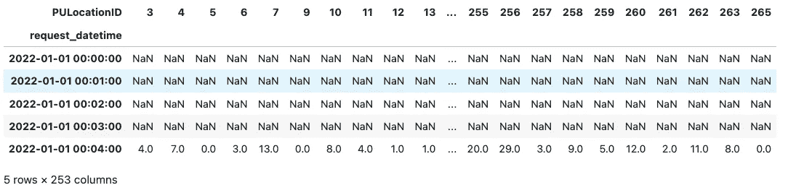

作者生成的数据输出

😱 哎呀，这么多 NaNs。

但这只是因为`.rolling()`默认将窗口操作（在此例中为总和）的输出放在窗口的右边缘。这在技术上是正确的，因为我们只能在第 4 分钟末获得第一个信号，当第一个窗口已完成时。

如果我们想去掉前 4 列，可以丢弃前 4 行空数据（分钟）：

```py
windows_drop = windows.iloc[4:]
windows_drop.head()
```

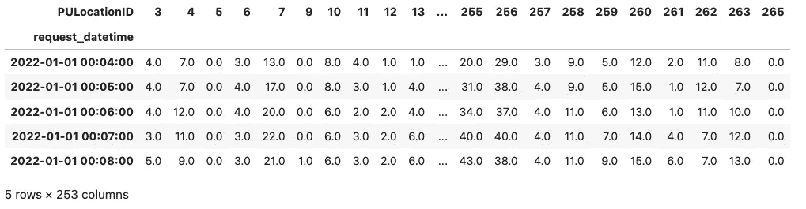

作者生成的数据输出

## 附注：前瞻性窗口

在某些情况下，你可能希望将值移动到左边缘，以使其更易读。如果你这样做，请小心不要犯错，误认为第 1 分钟时窗口 1 中实际上会有数据 (!) — 你实际上只是将结果移动到了第一行。

你可以使用`FixedForwardWindowIndexer`对象将窗口输出放在左边缘并创建前瞻性窗口：

```py
# create custom window indexer
indexer = pd.api.indexers.FixedForwardWindowIndexer(window_size=5)

# use indexer to create rolling window
windows_f = res_1m.rolling(window=indexer).sum()

windows_f.head()
```

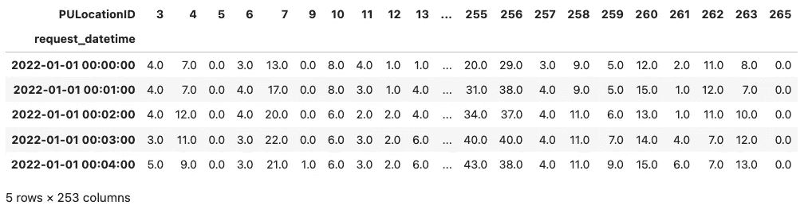

作者生成的数据输出

数据框的最后 4 列现在为空（因为在第 55 分钟之后没有完整的 5 分钟窗口），我们可以删除这些列。

```py
# drop the last 14 columns
windows_f_drop = windows.iloc[:45]
windows_f_drop.tail()
```

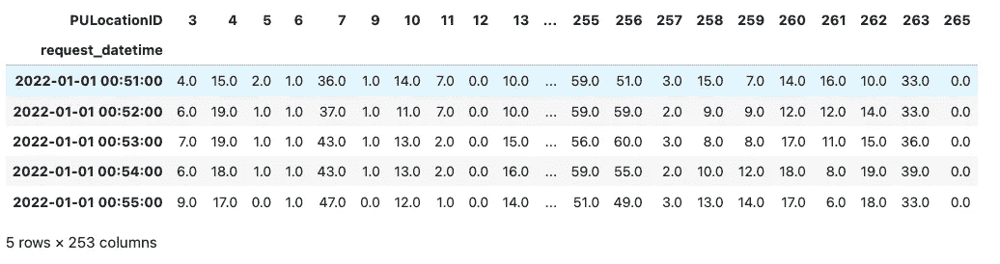

作者生成的数据输出

使用 `.rolling()` 方法的这种方式并不广为人知，且在[文档中稍微有些埋没](https://pandas.pydata.org/docs/user_guide/window.html#custom-window-rolling)，但一旦你理解了它的工作原理，使用起来还是相当简单的。

# 在 Pandas 中可视化滑动窗口

让我们可视化数据，以识别一些模式，并找到需求峰值最高的接送区域。我们将使用 `windows` 来明确显示前 5 分钟的数据缺失：

```py
import matplotlib.pyplot as plt

windows.plot(kind='bar', legend=False);
```

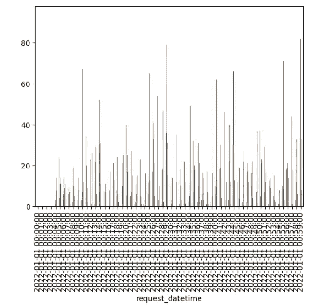

作者生成的图表

这是一个非常粗略的可视化，但即便如此，我们也可以清晰地看到：

1.  前 5 分钟的数据缺失

1.  在特定区域内，接送请求的频率存在明显的峰值。

从这里，我们可以定义一个截断值/阈值，并识别在特定窗口中请求超过阈值的区域。然后我们可以鼓励司机去这些区域。

澄清图表的一种方法是删除所有值低于阈值的列。假设我们想要识别每 5 分钟窗口内请求超过 50 的区域：

```py
signal = windows[(windows > 50)].dropna(axis=1, how=”all”)
signal.plot(figsize=(10,8))
plt.legend(bbox_to_anchor=(1.0,1.0))
plt.show()
```

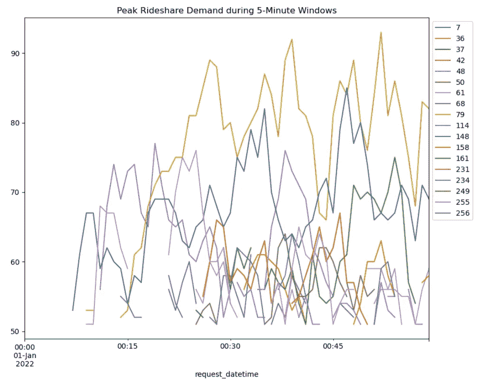

作者生成的图表

这里还有很多可以做的事情。可以在 [这个笔记本](https://github.com/rrpelgrim/sliding-windows-pandas/blob/main/pandas-sliding-windows-nyc-uber-lyft.ipynb) 中玩玩代码，进一步完善它。

# Pandas 中的滑动窗口：结论

本文介绍了在时间序列数据上执行滑动窗口的强大功能。通过将数据集切割成小的、重叠的窗口，你现在可以以*可操作的速率*获得有价值的数据信号。

当然，理想情况下，你会实时完成所有这些操作。敬请关注有关实时处理的更多内容，但与此同时，你可能想查看一下 [这个实时监控教程](https://www.dataengineeringweekly.com/p/unlocking-data-stream-processing)。做好准备，从纽约交通转到网站流量的背景变化 ;)

希望你觉得这篇文章有帮助且有趣。 [关注我的 LinkedIn](https://www.linkedin.com/in/avrilaysha/) 以获取我的最新内容。

数据处理愉快！👋

**纽约市出租车和豪华轿车委员会（TLC）行程记录数据于 2023 年 3 月 15 日访问，来源于* [*https://www.nyc.gov/site/tlc/about/tlc-trip-record-data.page*](https://www.nyc.gov/site/tlc/about/tlc-trip-record-data.page)*。许可证：* [*https://www.nyc.gov/home/terms-of-use.page*](https://www.nyc.gov/home/terms-of-use.page)
