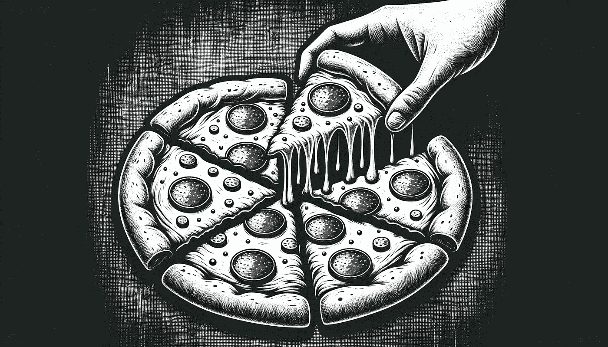

# 秘密科学：数据挖掘曝光

> 原文：[`towardsdatascience.com/sneaky-science-data-dredging-exposed-26a445f00e5c?source=collection_archive---------2-----------------------#2023-10-18`](https://towardsdatascience.com/sneaky-science-data-dredging-exposed-26a445f00e5c?source=collection_archive---------2-----------------------#2023-10-18)

从披萨到研究的黑暗面。图像由作者使用 Dall·E 3 创建。

## 深入探讨 p-hacking 的动机和后果

 [Hennie de Harder](https://hennie-de-harder.medium.com/?source=post_page-----26a445f00e5c--------------------------------)

·

[关注](https://medium.com/m/signin?actionUrl=https%3A%2F%2Fmedium.com%2F_%2Fsubscribe%2Fuser%2Ffb96be98b7b9&operation=register&redirect=https%3A%2F%2Ftowardsdatascience.com%2Fsneaky-science-data-dredging-exposed-26a445f00e5c&user=Hennie+de+Harder&userId=fb96be98b7b9&source=post_page-fb96be98b7b9----26a445f00e5c---------------------post_header-----------) 发表在 [Towards Data Science](https://towardsdatascience.com/?source=post_page-----26a445f00e5c--------------------------------) ·10 min read·2023 年 10 月 18 日

--

**《纽约客》最近的标题是** [**“他们研究了不诚实。他们的工作是个谎言吗？”**](https://www.newyorker.com/magazine/2023/10/09/they-studied-dishonesty-was-their-work-a-lie)**。这背后的故事是什么？行为经济学家丹·艾瑞里和行为科学家弗朗西斯卡·吉诺，两位在各自领域都颇具声誉的人物，正面临对其研究不端行为的审查。坦率地说，他们被指控伪造数据以获得统计显著的结果。**

可悲的是，这种情况并不罕见。科学研究中存在一定程度的欺诈行为。p-hacking 的做法——例如操控数据、在达到显著的 p 值后停止实验，或仅报告显著的发现——长期以来一直是一个问题。在这篇文章中，我们将反思为何一些研究人员可能会被诱惑去调整他们的发现。我们将展示其后果，并解释你可以做些什么来防止在自己的实验中发生 p-hacking。

但在我们深入探讨丑闻和秘密之前，先从基础开始——《假设检验 101》的速成课程。这些知识在我们探讨 p-hacking 的世界时将非常有用。

# 假设检验 101

让我们回顾一下你需要了解的关键概念，以便完全理解这篇文章。如果你对假设检验有一定了解，包括...
