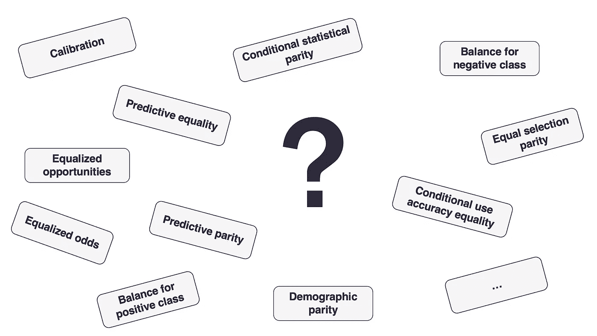

# 所以你的 AI 究竟有多公平？

> 原文：[`towardsdatascience.com/so-how-fair-is-your-ai-exactly-83f8defcf449?source=collection_archive---------14-----------------------#2023-02-24`](https://towardsdatascience.com/so-how-fair-is-your-ai-exactly-83f8defcf449?source=collection_archive---------14-----------------------#2023-02-24)

## 关于准确实现公平目标的挑战

 [Boris Ruf](https://medium.com/@boris-ruf?source=post_page-----83f8defcf449--------------------------------)

·

[关注](https://medium.com/m/signin?actionUrl=https%3A%2F%2Fmedium.com%2F_%2Fsubscribe%2Fuser%2Fed341456850c&operation=register&redirect=https%3A%2F%2Ftowardsdatascience.com%2Fso-how-fair-is-your-ai-exactly-83f8defcf449&user=Boris+Ruf&userId=ed341456850c&source=post_page-ed341456850c----83f8defcf449---------------------post_header-----------) 发表在 [Towards Data Science](https://towardsdatascience.com/?source=post_page-----83f8defcf449--------------------------------) ·6 分钟阅读·2023 年 2 月 24 日

--

图片由 [Pawel Czerwinski](https://unsplash.com/@pawel_czerwinski?utm_source=medium&utm_medium=referral) 提供，来源于 [Unsplash](https://unsplash.com/?utm_source=medium&utm_medium=referral)

*人工智能（AI）的使用引发了新的伦理和法律挑战。在* *我之前的文章* *中，我说明了为什么从训练数据中移除敏感信息并不能促进公平，反而相反。本文讨论了为 AI 应用选择最合适的公平性定义。这个专门的工具最初是在一篇* [*研究论文*](https://arxiv.org/abs/2102.08453) *中提出的，我在这方面有共同发表。*

通过 AI 收集和分析数据已成为标准做法，机器学习如今在许多领域改善了商业表现。然而，近年来暴露了许多 AI 机器偏见的案例，并且新的例子不断出现。这是 AI 的主要陷阱之一：如果训练数据包含任何形式的偏见，算法将会纳入并强化这些偏见——这可能会对性别、宗教、民族或年龄等敏感子群体造成伤害。

# 定义“公平性”的挑战

当前的偏见缓解方法主要是技术性的，专注于调整算法或数据以满足某种公平性。然而，存在多种相互冲突的公平性概念，遗憾的是没有普遍接受的定义。最合适的公平性度量始终取决于应用的背景。在实践中，确定公平性目标是复杂的，因为将伦理原则映射到度量标准不是一个简单的过程。不过，为了获得更公平 AI 的可持续解决方案，必须将注意力集中在这个问题上，因为当实施的公平性目标与利益相关者的期望不一致时，最佳的技术缓解方法将会失败。

分类任务的可用公平性度量。图片由作者提供。

# 不在同一页面上

在许多情况下，这一决定并非轻而易举，正如围绕 COMPAS 算法的激烈辩论所显现的那样。该算法由 Northpointe 公司开发，用于生成一个独立的数据派生的“风险评分”，以评估多种形式的再犯风险。这种算法在美国刑事司法部门中被用来支持法官做出特定决定，如批准保释或假释。评分具有信息性质，最终决定仍由法官做出。

2016 年 5 月，调查性新闻网站 ProPublica 将注意力集中在 COMPAS 算法可能存在的种族偏见上。其主要论点基于对数据的分析，显示结果存在偏差。特别是，对于黑人群体的[假阳性率](https://en.wikipedia.org/wiki/False_positive_rate)显著高于白人群体。因此，黑人被不成比例地错误地归因于高复发风险。另一方面，Northpointe 对这些指控的回应是，算法实际上在两个群体之间实现了[预测值平等](https://en.wikipedia.org/wiki/Positive_and_negative_predictive_values)。简而言之，这确保了风险评分与重新犯罪的概率相符，无论肤色如何。

从客观的角度来看，可以说双方对数据做出了有效且合理的观察。然而，巨大的争议揭示了精确定义和披露应用程序所选公平目标是绝对关键的。而这个决定通常涉及仲裁和妥协。在给定的场景中，例如，只有在满足以下条件之一时，两个公平目标才能互相满足：要么敏感子群体的[基本比率](https://en.wikipedia.org/wiki/Base_rate)完全相同，要么结果类别完全可分，从而能够创建一个实现完美准确性的理想分类器。不幸的是，这两个要求在现实世界中都非常不可能满足。

# 导航指标

令人惊讶的是，关于如何简化实际应用中的公平选择过程的研究相对较少。为了解决这个挑战，我们开发了[Fairness Compass](https://axa-rev-research.github.io/fairness-compass.html)，这是一个实验工具，旨在结构化复杂的公平指标领域。基于一系列关于数据性质、对其正确性的信念、公平政策以及模型应关注的特异性或灵敏度的问题，Fairness Compass 引导 AI 从业者找到最适合给定场景的选项。将这一选择过程形式化并转化为简单的程序，有助于消除在现实世界中实施负责任的 AI 的障碍。此外，记录决策背后的理由可以作为内部文档，并作为沟通手段来增加透明度，促进对技术的信任。

Fairness Compass 已作为开源项目发布在[GitHub](https://github.com/axa-rev-research/fairness-compass)上。它曾获得[Gartner Eye on Innovation award](https://www.gartner.com/en/about/awards/eye-on-innovation)提名，并被世界经济论坛纳入[AI Fairness Global Library](https://www.aifairnesslibrary.com)。

# 示例应用程序

为了说明这个概念，让我们以人力资源领域的一个示例场景为例。作为敏感子群体，我们考虑男性和女性。需要回答的问题是，在评估员工晋升决策的公平性时，哪种公平定义最为合适。请注意，这只是一个虚构的思维实验，根据具体情况，其他答案可能会有不同的结果。Fairness Compass 的目的是基于给定场景的定义要求，支持做出明智的决策。

B. Ruf 和 M. Detyniecki，“[AI 中的公平性之正确方向](https://axa-rev-research.github.io/static/AXA_FairnessCompass-English.pdf)”，ECML/PKDD 2021（工业追踪）

在上面的动画中，公平性指针被表示为一个包含三种不同类型节点的决策树：钻石形状表示决策点；白色框表示行动，灰色圆角框表示公平性定义。连接节点的箭头代表可能的选择。

让我们开始这个过程。第一个问题是关于可能影响决策的现有政策。公平性目标可以超越对不同群体或类似个体的平等待遇。如果目标是通过提升弱势群体来弥合现存的不平等，积极行动或配额可以是有效的措施。这种目标可能源自法律、法规或内部组织指南。这种方法排除了敏感属性与结果之间的任何可能因果关系。如果数据在不同子群体之间的基准率有所不同，这是一个强烈的承诺，这意味着将算法的准确性服从于政策的总体目标。例如，许多大学通过接收更多来自弱势背景的学生来提高多样性。这些招生政策承认来自敏感子群体的学生具有同等高的学术潜力，并将他们可能较低的教育水平视为社会中的不公正，而不是个人缺陷。

对于我们的示例场景，我们得出结论，促销决策没有实行这种积极行动政策。因此，我们选择“否”并记录我们选择的理由。现在，我们继续下一个问题，并重复该过程，直到到达一个叶节点，该节点包含为定义的用例推荐的公平性定义。

因此，遵循这样的形式化过程可以显著有助于识别和解释特定 AI 应用的最佳公平性度量。

# 所以呢

在实践中，存在许多不同的公平性定义。由于一些定义是互相排斥的，因此必须选择其中之一。做出选择并非易事，因为最佳决策始终取决于应用的背景，权衡往往是不可避免的。因此，选择 AI 应用的公平性目标时需要特别小心，并且还需将其传达给内部和外部利益相关者。关于这一决策背后的透明性是实现更公平 AI 的关键因素。

*非常感谢 Antoine Pietri 在撰写这篇文章中的宝贵支持。在* [*以下文章*](https://medium.com/just-tech-it-now/3-strategies-to-fight-discrimination-in-ai-applications-2ce78e7fae65)*中，我将概述如何主动减少 AI 应用中的偏见。*

## 参考文献

N. Mehrabi, F. Morstatter 等 (2021). [机器学习中的偏见与公平性调查](https://arxiv.org/abs/1908.09635)。ACM 计算调查 (CSUR) 54, 6 (2021), 1–35。

J. Angwin, J. Larson 等 (2016). [机器偏见](https://www.propublica.org/article/machine-bias-risk-assessments-in-criminal-sentencing)。数据与分析伦理，Auerbach 出版社，254–264。

W. Dieterich, C. Mendoza 等 (2016). [COMPAS 风险量表：展示准确性、公平性和预测一致性](https://go.volarisgroup.com/rs/430-MBX-989/images/ProPublica_Commentary_Final_070616.pdf)。Northpointe Inc.

S. Corbett-Davies & S. Goel (2018). [公平性的测量与误测量：对公平机器学习的批判性回顾](https://arxiv.org/abs/1808.00023)。*arXiv:1808.00023*。

P. Saleiro, B. Kuester 等 (2018). [Aequitas：一个偏见与公平性审计工具包](https://arxiv.org/pdf/1811.05577.pdf)。*arXiv:1811.05577*。

K. Makhlouf, S. Zhioua 等 (2021). [关于机器学习公平性概念的适用性](https://dl.acm.org/doi/10.1145/3468507.3468511)。ACM SIGKDD 探索新闻通讯。23, 1, 14–23。

B. Ruf & M. Detyniecki (2021). [迈向正确的人工智能公平性](https://arxiv.org/abs/2102.08453)。ECML/PKDD 2021 行业专场。
