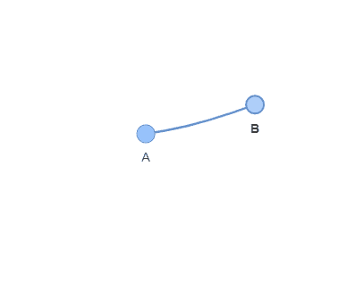
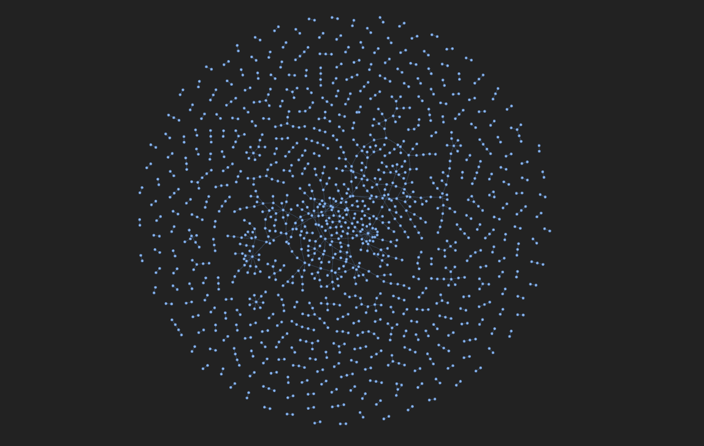
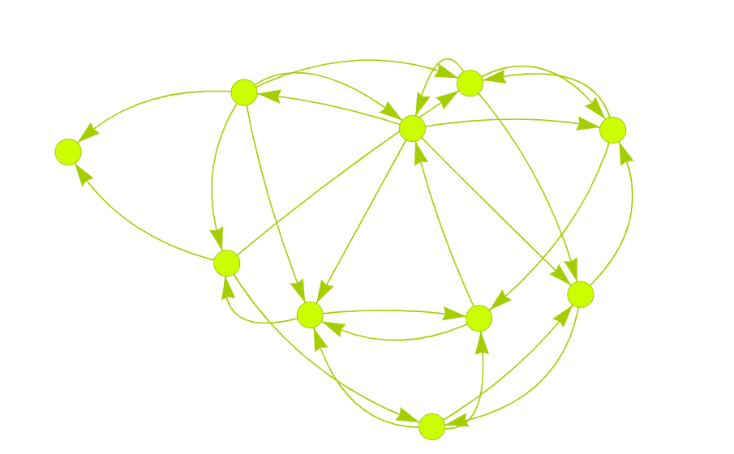
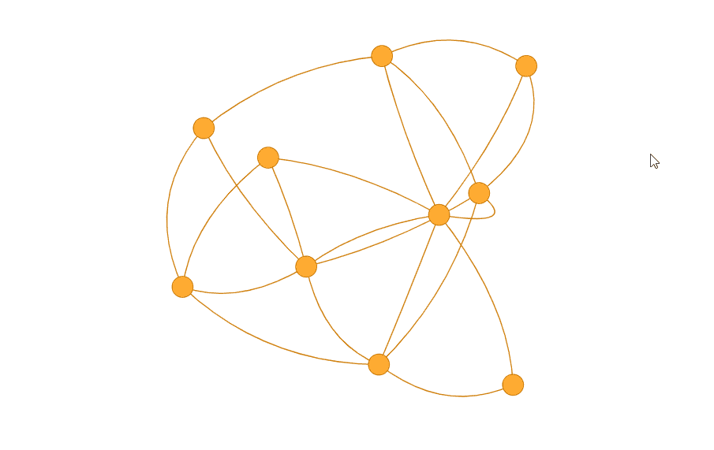
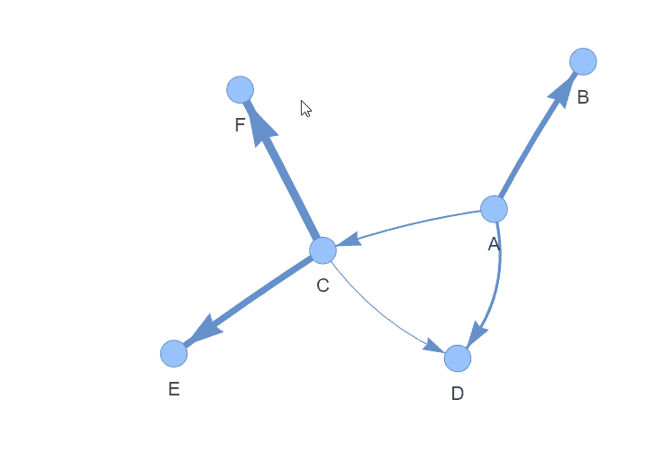
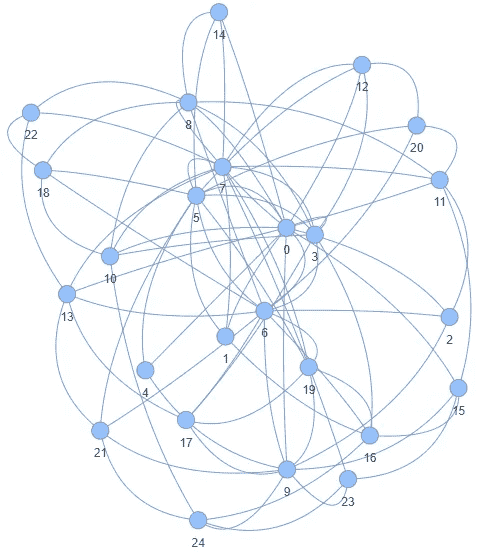
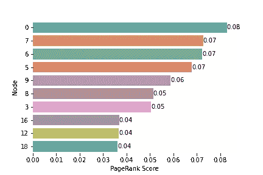
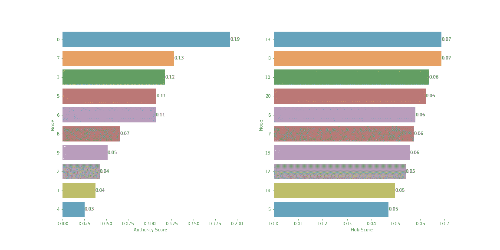

# 使用 NetworkX 进行社会网络分析：温和的介绍

> 原文：[`towardsdatascience.com/social-network-analysis-with-networkx-a-gentle-introduction-6123eddced3`](https://towardsdatascience.com/social-network-analysis-with-networkx-a-gentle-introduction-6123eddced3)

## 了解像 Facebook 和 LinkedIn 这样的公司如何从网络中提取洞察

[](https://medium.com/@riccardo.andreoni?source=post_page-----6123eddced3--------------------------------)[](https://towardsdatascience.com/?source=post_page-----6123eddced3--------------------------------) [Riccardo Andreoni](https://medium.com/@riccardo.andreoni?source=post_page-----6123eddced3--------------------------------)

·发布于[Towards Data Science](https://towardsdatascience.com/?source=post_page-----6123eddced3--------------------------------) ·8 分钟阅读·2023 年 9 月 28 日

--


图片来源：[pixabay.com](https://pixabay.com/photos/play-stone-network-networked-1237457/)

像 Netflix 这样的流媒体平台是如何**推荐完美的电影**给你度过晚上？我们如何优化**运动中的球员位置**？我们如何**识别金融网络中的欺诈活动**？我们如何**预测约会应用中的匹配**？

所有这些挑战都有相同的解决方案：[**社会网络分析**](https://en.wikipedia.org/wiki/Social_network_analysis)。

社会网络分析（SNA）是一个强大的数据科学领域，它可以探索网络中实体之间复杂的关系，发现隐藏的模式并捕捉洞察。网络实体可以是各种事物：它们可以是社交网络上的人，比如 Instagram 上的用户，也可以是互联网上的网站，甚至是比赛网络中的运动队。

在接下来的部分中，我将帮助你理解数据科学中的网络是什么，我将描述最常见的类型，并实现几个算法以从网络中提取有价值的信息。

所有理论部分将结合实际示例。你会找到几个**Python 代码**片段，以帮助你熟悉[**NetworkX**](https://networkx.org/) Python 库。

# 理解网络

网络，也称为图，是信息的特定表示，包括两个基本组成部分：**节点**和**边**。

**节点**是网络的构建块。它们代表网络中的个体实体。它们可以是社交网络中的人，也可以是生物网络中的基因。

**边**则表示节点之间的关系。它们可以定义两个人之间的互动、关联或依赖关系。边可以是有向的，这意味着它们表示的关系从一个节点到另一个节点。想象一个有向边表示一个人向另一个人支付的钱，了解资金流向的方向确实是有益的。这种不对称用箭头表示。

在 [NetworkX](https://networkx.org/) 中，节点和边的表示方式如下：

```py
import networkx as nx

# Create an instance of a graph
G = nx.Graph()

# Create an edge between two nodes. The nodes will be also created.
G.add_edge('A', 'B', weight=6)
```

上面的“Hello world”代码的结果是这个小而简单的网络：



图片由作者提供。

然而，类似地，[NetworkX](https://networkx.org/) 库可以轻松创建更复杂的网络，如下所示：



图片由作者提供。[数据源](https://snap.stanford.edu/data/ego-Facebook.html)。

# 网络类型

在建模现实世界网络时，我们必须考虑到存在**多种结构**。我将简要介绍最常见的网络，并展示如何使用 NetworkX 模型化它们。

## 有向和无向网络

**有向**网络具有定义的方向。这表示两个节点之间关系的不对称。例如，在电子邮件网络中，边的方向可以指示哪个节点发送电子邮件，哪个节点接收。

另一方面，**无向**网络忽略任何方向，意味着节点之间的关系是对称的。一个例子可能是友谊网络，通常关系是相互的，或体育赛事网络。

在 NetworkX 中，用于分别实例化有向和无向网络的代码是 `DiGraph()` 或 `Graph()`。我使用 [Numpy](https://numpy.org/) 库随机生成合成网络：

```py
# Synthetic Directed Graph
Gd = nx.DiGraph()
for i in range(30):
    node_1 = np.random.randint(10)
    node_2 = np.random.randint(10)
    if node_1 != node_2:
        Gd.add_edge(node_1, node_2)   

# Synthetic Undirected Graph
G = nx.Graph()
for i in range(30):
    node_1 = np.random.randint(10)
    node_2 = np.random.randint(10)
    if node_1 != node_2:
        G.add_edge(node_1, node_2) 
```

你可以通过一些美丽的互动可视化来探索图形：



合成有向图。图片由作者提供。



合成无向图。图片由作者提供。

## 加权网络

在某些情况下，**实体之间的关系是不平等的**。我们可以通过给每条边加上权重来衡量关系的“强度”。权重反映了两个节点之间交互的重要性。

以航班网络为例。每个机场代表一个节点，边代表它们之间的航班。为每条边分配权重，以建模如航班时长、距离或票价等信息是很方便的。

要在 NetworkX 中创建一个简单的加权网络，我们需要初始化一个空的 `nx.Graph()` 对象。第二步是使用 `add_edge()` 方法添加边，并包含权重属性。

```py
# Initialize the graph
G = nx.Graph()

# Add weighted edges
G.add_edge("A", "B", weight=0.6)
G.add_edge("A", "C", weight=0.2)
G.add_edge("C", "D", weight=0.1)
G.add_edge("C", "E", weight=0.7)
G.add_edge("C", "F", weight=0.9)
G.add_edge("A", "D", weight=0.3)
```

最后，我们可以可视化加权网络。



合成加权图。图片由作者提供。

一种加权网络的变体是**有符号网络**。它们通过**分配符号**（+ 或 -）来考虑每个关系的正负性。

一个有向网络的例子是在线产品评价网络。这样的网络将产品和客户表示为节点，客户评价为边。边可以有正号（+）或负号（-），分别表示正面评价或负面评价。

在 NetworkX 中，有符号图的创建和加权图一样简单：

```py
# Initialize the graph
G = nx.Graph()

# Add weighted edges
G.add_edge("A", "B", sign='+')
G.add_edge("A", "C", sign='-')
G.add_edge("C", "D", sign='-')
G.add_edge("C", "E", sign='+')
G.add_edge("C", "F", sign='-')
G.add_edge("A", "D", sign='+')
```

# 从网络中提取信息

一旦我们理解了网络可以呈现的不同形式，我们需要知道如何**提取有意义的洞察**。我们可能希望找到**关键节点**或边，并发现**隐藏的模式**。幸运的是，已经开发了多种算法来回答这些问题。

## PageRank 算法

PageRank 是一种著名的算法，用于衡量网络中节点的重要性。它最初由拉里·佩奇（**Larry Page**）和谢尔盖·布林（**Sergey Brin**）在谷歌开发，并在搜索引擎网页排名中取得了卓越的成果。

PageRank 算法的核心思想是，重要的节点是那些从其他网络节点，特别是从其他重要节点接收许多入边的节点。

PageRank 算法遵循的步骤很简单：

1.  为每个节点分配初始 PageRank 分数，等于 1/N（其中 N 是网络中的总节点数）。

1.  应用基本的 PageRank 更新规则。该规则指出，每个节点将其 PageRank 分数的等分额提供给其邻居节点。

1.  每个节点的新 PageRank 分数更新为其从邻居节点接收到的值之和。

这些步骤会重复进行，直到 PageRank 分数收敛到稳定值。

如果我们以以下 25 个节点的网络为例，这个网络是我合成生成的，极其复杂，很难确定哪个是最有影响力的。



使用 PAM 算法生成的合成网络。图片由作者提供。

我们可能有一些线索，但 PageRank 算法通过为每个节点的重要性分配一个数学值，使我们的生活更容易。幸运的是，NetworkX 具有内置的 PageRank 方法。

```py
# Generate an artificial network of 25 nodes
G = nx.barabasi_albert_graph(25,4, seed=42)

# Apply the PageRank algorithm and store the scores in a pd dataframe
pagerank_results = nx.pagerank(G, alpha=0.85, max_iter=100, tol=1e-06)
pagerank_results = pd.Series(pagerank_results).sort_values(ascending=False)

# Plot the most importan node scores
fig, ax = plt.subplots()
sns.barplot(x=pagerank_results.iloc[:10].values, y=pagerank_results.iloc[:10].index.astype(str), orient='h', alpha=0.75)
ax.set_xlabel('PageRank Score')
ax.set_ylabel('Node')
ax.spines['top'].set_visible(False)
ax.spines['bottom'].set_visible(False)
ax.spines['right'].set_visible(False)
ax.spines['left'].set_visible(False)
for i in ax.containers:
    ax.bar_label(i,fmt='%.2f')
```

从结果中我们可以清楚地看到，节点 0、7 和 6 拥有最高的 PageRank 分数。



图片由作者提供。

## HITS 算法

HITS 算法旨在识别网络中的**两种重要节点类型**：中心节点和权威节点。

+   **中心节点**是指指向许多其他节点的节点。

+   **权威**是指许多中心节点所指向的节点。

与 PageRank 不同，HITS 不仅可以衡量网络中每个节点的重要性，还可以推断出其在图中的角色。

HITS 算法遵循的步骤是：

1.  为网络中的每个节点分配一个权威分数和一个中心分数，初始值均为 1。

1.  对每个节点应用 Authority 更新规则。一个节点的 Authority 分数是指向它的节点的 Hub 分数之和。

1.  对每个节点应用 Hub 更新规则。一个节点的 Hub 分数是它指向的节点的 Authority 分数之和。

每次迭代后，我们都会更新 Authority 和 Hub 分数。经过大量迭代后，这两个分数应该会收敛。

感谢 NetworkX 库，我们可以将 HITS 结果与 NetworkX 提供的结果进行比较。

```py
# Convert the previously create graph to directed
G_dir = G.to_directed()
for a, b in list(G.edges()):
    G_dir.remove_edge(a, b)

# Compute HITS scores
hits_results = nx.hits(G_dir, max_iter=100, tol=1e-06)
authority_results = pd.Series(hits_results[1]).sort_values(ascending=False)
hubs_results = pd.Series(hits_results[0]).sort_values(ascending=False)

# Plot the results
fig, (ax1, ax2) = plt.subplots(nrows=1, ncols=2)
fig.set_figheight(8)
fig.set_figwidth(16)
sns.barplot(x=authority_results.iloc[:10].values, y=authority_results.iloc[:10].index.astype(str), orient='h', alpha=0.75, ax=ax1)
ax1.set_xlabel('Authority Score')
ax1.set_ylabel('Node')
ax1.spines['top'].set_visible(False)
ax1.spines['bottom'].set_visible(False)
ax1.spines['right'].set_visible(False)
ax1.spines['left'].set_visible(False)
for i in ax1.containers:
    ax1.bar_label(i,fmt='%.2f')

sns.barplot(x=hubs_results.iloc[:10].values, y=hubs_results.iloc[:10].index.astype(str), orient='h', alpha=0.75, ax=ax2)
ax2.set_xlabel('Hub Score')
ax2.set_ylabel('Node')
ax2.spines['top'].set_visible(False)
ax2.spines['bottom'].set_visible(False)
ax2.spines['right'].set_visible(False)
ax2.spines['left'].set_visible(False)
for i in ax2.containers:
    ax2.bar_label(i,fmt='%.2f')
```

我们可以清楚地看到，具有较高 Authority 分数的节点也往往具有较高的 PageRank 分数。节点 0 在这两个度量中都排名第一，节点 7、6 和 5 排名也靠前。



图片由作者提供。

PageRank 缺少的是节点 13、8、10 和 20 的“Hub”角色。它们与相关节点连接，因此我们可以断言它们在网络中发挥了重要作用。

# 结论

在这篇文章中，我们看到如何通过像 NetworkX 这样的专业库使从网络中提取信息变得更加容易。大多数度量标准和网络算法可以通过一个函数来计算。

我们所看到的只是机器学习中的社交网络分析的简介，这些主题应该成为每个数据科学家工具包的一部分。虽然我们触及了一些基本概念，但该领域的内容远超这些入门见解。

我推荐深入研究本文附带的资源和参考资料。

如果你喜欢这个故事，可以考虑关注我，以便获取我即将发布的项目和文章的通知！

这是我过去的一些项目：

[](/ensemble-learning-with-scikit-learn-a-friendly-introduction-5dd64650de6c?source=post_page-----6123eddced3--------------------------------) ## 使用 Scikit-Learn 进行集成学习：友好的入门指南

### 像 XGBoost 或随机森林这样的集成学习算法是 Kaggle 竞赛中的顶级模型之一……

towardsdatascience.com [](/use-deep-learning-to-generate-fantasy-character-names-build-a-language-model-from-scratch-792b13629efa?source=post_page-----6123eddced3--------------------------------) ## 使用深度学习生成幻想名称：从零开始构建语言模型

### 语言模型能否创造独特的幻想角色名称？让我们从头开始构建它

towardsdatascience.com

# 参考文献

+   [社交网络分析](https://en.wikipedia.org/wiki/Social_network_analysis)

+   [NetworkX](https://networkx.org/)

+   [网络科学 — 阿尔伯特·拉斯洛·巴拉巴西](http://networksciencebook.com/)

+   [社会网络分析：方法与应用 — Stanley Wasserman, Katherine Faust](https://www.cambridge.org/core/books/social-network-analysis/90030086891EB3491D096034684EFFB8)

+   [Python 中的应用社会网络分析](https://www.coursera.org/learn/python-social-network-analysis)
