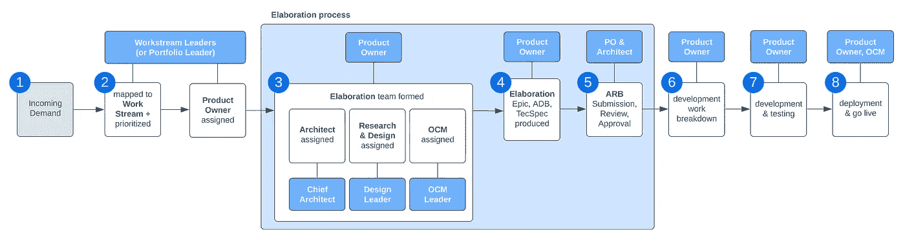

# 敏捷项目中的软件规范

> 原文：[`towardsdatascience.com/software-specification-in-agile-projects-8248f5be6c1`](https://towardsdatascience.com/software-specification-in-agile-projects-8248f5be6c1)

## IBM 最大转型项目的原始见解

 [Thomas Reinecke](https://medium.com/@thomas.reinecke?source=post_page-----8248f5be6c1--------------------------------)

·发表于 [Towards Data Science](https://towardsdatascience.com/?source=post_page-----8248f5be6c1--------------------------------) ·阅读时间 8 分钟·2023 年 3 月 10 日

--

传统的瀑布式和 V 模型软件开发依赖于大量前期时间投资来指定解决方案、集成或功能，通常导致广泛的文档。这些方法因其不灵活、高成本和无法适应实时变化而不适用于敏捷过程。

然而，人们常常认为敏捷团队在没有规范的情况下工作，因为他们优先考虑接受变化和交付产品，而不是文档。其实并非如此。即使是敏捷项目，不论其规模如何，仍然需要一定程度的**结构**、**指导**、**治理**和**文档**来确保一致性和防止混乱。这对于涉及多个开发小组和数百名工程师的大规模项目尤为重要。

本文提供了对我们在 IBM 实施的一些最大内部转型项目的模式和方法的未经过滤的见解。

图片来源：[ThisisEngineering RAEng](https://unsplash.com/@thisisengineering?utm_source=unsplash&utm_medium=referral&utm_content=creditCopyText) 在 [Unsplash](https://unsplash.com/photos/DbLlKd8u2Rw?utm_source=unsplash&utm_medium=referral&utm_content=creditCopyText)

# 为什么结构、指导、治理？

假设你正在创建一个涉及多个小组的复杂产品，那么敏捷 Scrum 团队自给自足且任何需求都可以分配给任何团队的假设不可避免地会引出以下问题：

+   谁负责拥有数据模型，或至少是其特定部分或对象？

+   我们如何在图书馆、实用类和应重新使用的服务等基础能力上达成一致？

+   对于哪些数据元素，产品成为记录系统（SoR），而哪些只是消费者或处理器？

+   我们如何对上下游数据流进行对齐和标准化？

+   谁负责领导和标准化数字体验，包括与设计系统、组件库、外壳、页面布局和设计原则相关的问题？

+   我们如何向用户通知即将到来的或已部署的变更？

+   测试和持续集成/持续部署（CI/CD）是如何工作的，怎样才能标准化这些流程？

+   我们如何确保维护最高标准的安全性和合规性？

[Matt Walsh](https://unsplash.com/fr/@two_tees?utm_source=unsplash&utm_medium=referral&utm_content=creditCopyText)拍摄的照片，来源于 [Unsplash](https://unsplash.com/photos/tVkdGtEe2C4?utm_source=unsplash&utm_medium=referral&utm_content=creditCopyText)

这绝不是一个完整的列表，但足以识别出一个模式：

许多上述问题无法在单个小组的范围内解答，而必须在项目层面上解决。这意味着我们需要在小组之上有一个更高层次的监督，以推动**标准化**，并且需要建立一个为小组服务的**治理和指导流程**。该流程并非旨在减缓开发活动，但如果正确应用，可以帮助减少波动、优化输出并加快开发速度。总体而言，该流程为我们提供了开发解决方案的护栏。

另一个重要的考虑因素是是否在前期指定要求或在实施后记录要求。然而，实施前指定要求在执行效率方面具有显著优势。

# 详细说明是什么？

详细说明是定义解决方案提案的过程，通常会导致一个轻量级的**规格文档**，供开发小组执行。**产品负责人**通过组建**详细说明团队**来领导详细说明，收集业务级要求，发现和转化潜在的现有遗留功能，定义用户角色和用户故事，测试程序，并与指定的**架构师**一起制定解决方案规格文档。

详细说明以**架构评审委员会（ARB）**的成功批准结束，这就是我提到的治理层。

# 需求管理的步骤

由作者提供的图片

1.  在 IBM，我们通常使用 Aha!或 Jira 来收集漏斗顶部的需求。虽然短期企业目标可以显著影响需求，但我们的优先排序过程主要围绕企业战略、核心转型原则和对提升用户体验的重视。

1.  一个详细说明通常始于已接受的需求，由工作流领导者优先排序并分配给匹配的**产品负责人**。

1.  **产品负责人**组建详细说明团队（详见下文）。

1.  根据复杂性，进行一系列会议以研究、收集需求、定义角色、编写用户故事、提出架构决策、指定数据模型和 API、提供线框图，并收集合理的实施细节。这通常在较短的时间内发生，几周时间被认为是最大期限，但可能会有例外。

1.  收集和总结相关信息到规格说明文档中，该文档的大小可以有所不同（见下文），并提交给架构评审委员会（ARB）。ARB 作为一个检查点，审查提案，验证架构一致性，并总体测试详细设计是否妥善进行。详细设计在获得 ARB 批准后成功结束。

1.  产品负责人将规格说明文档拆分为 Jira 故事和任务，这些任务分配给开发小组的成员执行。

1.  开发和测试在小组中进行。

1.  功能、能力或集成功能上线，且应用了**变更管理**（OCM）。

# 详细设计团队

产品负责人负责组建详细设计团队，该团队通常包括以下角色的代表：

+   **工作流（或投资组合）负责人**：领导产品战略，定义为什么需要或必须更改某个功能。

+   **产品负责人**：负责功能、能力或集成，负责召集详细设计团队并推动详细设计。产品负责人定义功能的具体内容。

+   **架构师**：确保解决方案提案在产品/平台范围内以及相关的上游和下游系统中的技术适配。架构师定义如何实现功能，确保架构的连贯性、一致性和标准化。架构师确保功能适合更大的整体图景。

+   **主题专家**（SMEs）：了解待实现或现有解决方案的人，能够指导团队处理相关细节。

+   **设计与研究**：定义解决方案预期覆盖的各种场景的用户体验。这包括用户体验研究，以了解用户理想的工作方式以及设计线框图的制作。

+   **变更管理**（OCM）：在功能上线前后，提供必要的步骤以通知和启用用户。

# 基于 T 恤尺码的高效规格说明

在 IBM，我们使用粗略的 T 恤尺码来区分我们近期转型项目中的解决方案提案的大小：

+   **小型** — 低工作量，低复杂度，通常附加到现有功能，开发工作大约需要一个冲刺（两周）。这种类型的规格说明作为**Jira Epic**提交给 ARB，且没有正式结构。

+   **中型** — 中等规模的投入和复杂度，可以是一个小的新功能，最多两次冲刺（四周）的开发工作。这类规格应作为“**架构决策简报**”（ADB）文档提交，内容不应超过五页，通常描述待解决的问题、解决方案以及一些实施细节。

+   **大型** — 高投入和复杂度，通常是一个新的功能或与两个以上冲刺的集成。这是我们处理的最复杂的规格文档，大小可以在 10 到 40 页之间变化。最相关的方面是找到时间投入与“足够好”之间的正确平衡。规格应创建一个适当的架构框架用于实施，并提供一致性、架构的凝聚性和标准化。同时，它还应为开发团队提供足够的指导，以实现功能。

# 规格文档结构

为了提供对这种规格文档结构的理解，以下是一个通用的提纲：

+   **介绍和执行摘要** — 本节提供了功能概述，并从执行层面描述*“为什么”*。

+   **术语** — 包含任何使用的缩写描述的术语表。

+   **业务需求、用户故事、角色和场景** — 本章代表*“什么”*。它从一个高层次的需求集合开始，深入到具体的用户故事，最终描述产品中的必要场景，包括涉及角色的流程图。这是将原始需求与实施细节对接的最相关部分，创建了对将交付内容的共同理解。

+   **架构** — 本章及接下来的三章代表了*“如何”*，并用技术术语描述解决方案，考虑现有的产品、平台及其生态系统。

+   **对象模型** — 本节包括任何新对象或对现有对象的更改，并处理安全性、合规性和保留问题，如记录共享、字段可见性或字段历史跟踪。

+   **用户界面原型** — 针对上述每个用户故事，设计会创建并提供一组用户界面原型。在规格文档交付时，这些原型不一定需要像素完美，但需要清晰地勾勒出用户界面如何支持指定的流程以及新页面如何融入产品的信息架构。

+   **实施细节** — 这里定义如何配置或开发实施的具体方面，以支持开发团队。该章的范围可能大相径庭，实际上取决于编制时间和开发团队的技能深度。

+   **未来的考虑和开放话题** — 本章区分了规范中排除的内容以及可能在以后发生的内容。

# 总结

我们观察到，前期花时间进行特性规范和创建文档并不一定与敏捷方法论相冲突。关键在于追求“**足够好**”。

如果我们把软件开发视作一个涉及多个迭代步骤的旅程，那么规范可以看作是目的地的一个模糊愿景。了解我们要去哪里是至关重要的，而不是盲目前进。

规范还充当了工作流负责人、产品负责人、架构师、设计、OCM 和开发团队之间关于交付内容的合同。它建立了一个“足够好”的相互理解水平，并确保每个人都在同一页面上。

图片由[Antonio Janeski](https://unsplash.com/@janesky?utm_source=unsplash&utm_medium=referral&utm_content=creditCopyText)提供，来源于[Unsplash](https://unsplash.com/photos/CHVTt0aGbx0?utm_source=unsplash&utm_medium=referral&utm_content=creditCopyText)

如果你觉得阐述过程有点太昂贵，请记住，你也可以分阶段提交规范文档。这在 ARB 中是很常见的情况，它允许开发团队在项目仍在阐述中时开始处理项目的一部分。

值得注意的是，IBM 的 ARB 中总是有指定的架构师和产品负责人参与。这在准备 ARB 提交时非常有帮助，这意味着提交不是意外的，已经与更广泛的团队对齐。我们的一次性通过 ARB 提交的成功率超过 98%，这表明 ARB 只是一个检查点，详细阐述过程在此之前已经很好地完成了。可以说，**ARB 只是阐述的催化剂**。在非常少见的情况下，批准会被拒绝，但只有当明显没有适当的阐述、解决方案考虑不周或缺乏关键细节时才会发生。这只会发生在提案的产品负责人与更广泛的团队未连接时。

因此，带有 ARB 批准作为检查点的详细阐述过程为团队创建了正确的心态，以便为敏捷执行指定一个“足够好”的特性。

谢谢。

**关于托马斯·雷内克** — 在过去 5 年中担任多个关键 IBM 内部转型项目的首席架构师期间，我有独特的机会共同领导并影响 IBM 一些最复杂、最全面和最具影响力的业务转型，其中包括支持、销售和业务合作伙伴生态系统的转型。以合理的水平指定能力在所有这些项目中都是一个常见的热点话题。

[**https://medium.com/@thomas.reinecke/membership**](https://medium.com/@thomas.reinecke/membership)
