# 像数据科学家一样解决神秘盒子

> 原文：[`towardsdatascience.com/solve-a-mystery-box-like-a-data-scientist-f9ee9570ba52`](https://towardsdatascience.com/solve-a-mystery-box-like-a-data-scientist-f9ee9570ba52)

## 获取数据，训练 ViT，最小化问题；实在是过度处理

 [Dennis Bakhuis](https://dennisbakhuis.medium.com/?source=post_page-----f9ee9570ba52--------------------------------)

·发表于 [Towards Data Science](https://towardsdatascience.com/?source=post_page-----f9ee9570ba52--------------------------------) ·阅读时间 17 分钟·2023 年 1 月 13 日

--

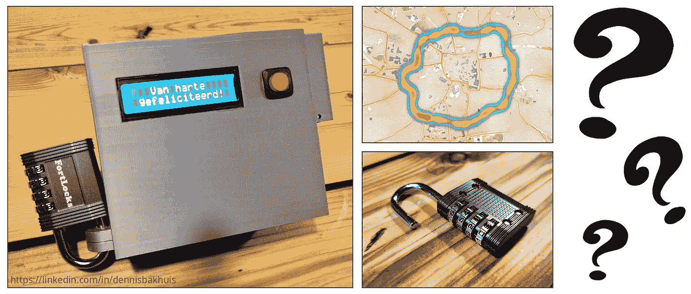

图 1：一个神秘盒子、数据收集过程，以及最终打开的锁。

当一个数据科学家得到一个以盒子形式出现的谜题时，会发生什么？当然，他会（尝试）将其作为数据问题来解决。在这篇文章中，我将描述整个过程，坦白说，这并不像我想象的那么容易。与许多问题一样，你可能会完全迷失，只有通过与几个朋友交谈，我才得以重新回到正轨。

作为一个数据科学家，我喜欢以数据的方式来解决这个问题。我意识到这种方法远非最明显的解决方案。但这是一个非常有趣的尝试。收集过多的数据，训练一个变压器模型从视频中提取值，最后使用 `minimizer` 找到解决方案。本文是这个（大部分）有趣旅程的总结！

我将这篇文章分成了几个（对我而言）逻辑步骤。你可以随意跳过你喜欢的部分：

1.  你提到的这个“神秘盒子”是什么？

1.  正式的问题描述

1.  收集所需的数据

1.  处理数据的善意（标记、训练、推断）

1.  分析数据集并找到目标

1.  前往位置

*除非在单独的说明中另有说明（在本文中没有），否则本文中的所有图像均由我拍摄或生成。*

[此项目的所有代码](https://github.com/dennisbakhuis/mystery_box)都在 Notebooks 中共享，并且可以在我的 [Github 账号](https://github.com/dennisbakhuis)上找到。如果你有任何评论或问题，我很乐意通过 [LinkedIn](https://linkedin.com/in/dennisbakhuis)听取。

# 你提到的这个“神秘盒子”是什么？

在我生日那天，我的朋友 Sander 给了我一个神秘的盒子，他脸上带着大大的笑容，这将让我忙上一段时间。

神秘盒子立刻看起来非常引人入胜（见图 1）。显然，这个盒子是由 Sander 亲自制作的，因为它具有非常明显的熔融沉积建模（FDM）打印图案。正面展示了一个常见的 LCD 屏幕和一个红色按钮。左侧有一个相对较大的挂锁。这是一个需要四位数字代码才能打开的挂锁。挂锁防止盒子底部的滑盖打开。右侧是一个小的多余空间，用来放置一个 9 伏特的电池。电池外置是相当聪明的，这样当电量低时可以更换。

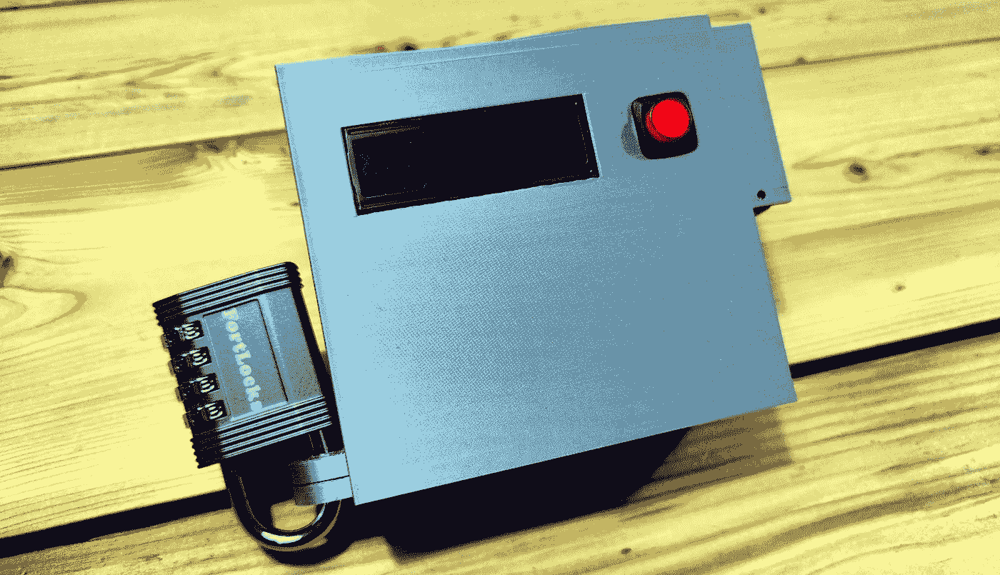

图 2：这是神秘盒子：一个带有屏幕、按钮和挂锁的 3D 打印设备。

从创造者的角度来看，神秘盒子有一个相当有趣的设计。顶面（如图 2 所示）在打印过程中作为基础使用，因为这个面比其他面粗糙得多。这使得多余的电池架也可以在没有支撑的情况下打印。尽管如此，我还是不完全确定 LCD 屏幕的孔是如何创建的。最简单的方法是打印轻质支撑，然后切除。用于挂锁的台阶上的打印支撑残留物仍然可见。总体来说，这是一个不错的项目，可以让你的打印机运行至少 8 小时。

红色按钮是一种切换按键。按下时你会听到它卡扣的声音，LCD 屏幕会亮起。几秒钟后，盒子会用“Hi!!!”向你打招呼，这是在[流体物理研究组](https://pof.tnw.utwente.nl/)的经典搞笑方式。接下来几条屏幕上的信息是荷兰语。有关屏幕的概述请参见图 3。以下是一些快速翻译：

1.  Hi!!! -> <低音调的声音> Hi </低音调的声音>

1.  Van harte gefeliciteerd! -> 真诚的祝贺！

1.  Vind de twee punten en ga -> 找到两个坐标并前往

1.  naar het midden van de punten… -> 到坐标的中心…

1.  Zoekt gps… Een moment… -> 正在搜索 GPS… 请稍等…

1.  Afstand(p1)-Afstand(p2)=1048m -> 距离(p1)-距离(p2)=1048m

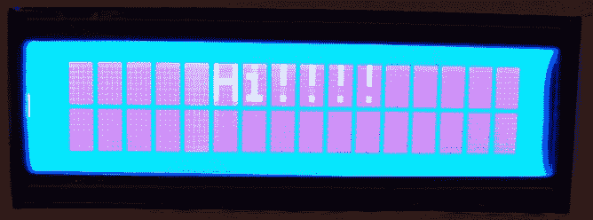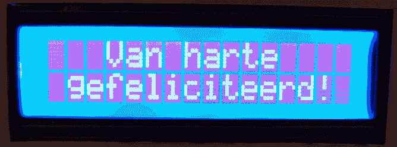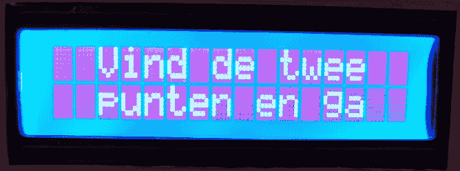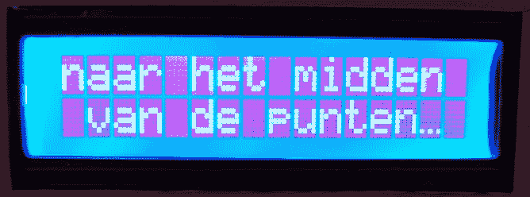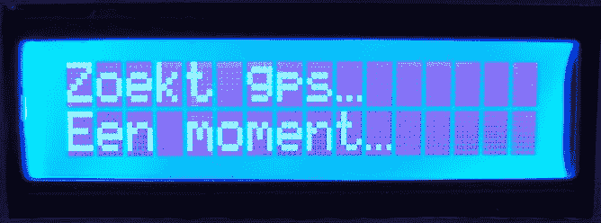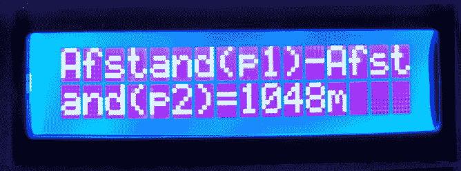

图 3：打开设备会显示各种荷兰语信息，包括几个提示。

在两个提示屏幕之后，系统正在忙于搜索 GPS 信号。这个过程，即所谓的“第一次定位时间”（TTFF），可能很长，因为设备总是需要进行所谓的“冷启动”。根据标准，这可能需要长达五分钟。

最后，在 GPS 固定后，盒子进入主操作界面，显示它唯一的输出：点 1 到点 2 的距离差，以米为单位的整数值。

桑德还对单位做了一些额外的说明。该单位输出一个值，该值是两距离*d1*和*d2*之间的差值。这些距离是当前箱子位置与两个未知坐标之间的距离。目标是找到正好位于这两个未知坐标之间的坐标。

这听起来很简单，但让我们看看更正式的描述。

# 正式问题描述

谜题的目标是将其带到一个特定的位置。如果这个位置是正确的，箱子将显示出密码锁的代码。这个问题的挑战在于神秘箱子不会显示到那个特定位置的距离。

目标位置*G*正好位于两个未知坐标*p1*和*p2*之间的中点。距离*d1*和*d2*是当前箱子位置*B*与坐标*p1*和*p2*之间的距离。箱子在屏幕上显示的是*d1*和*d2*之间的差值，我们称之为*A*。图 4 展示了问题的简化示意图。

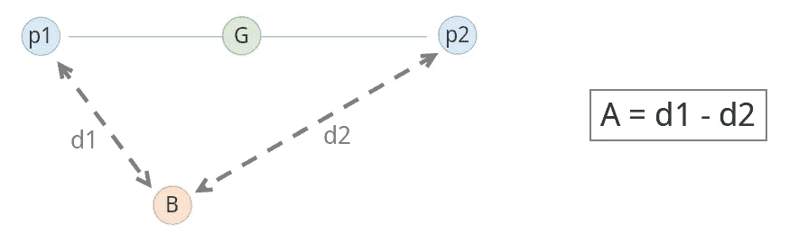

图 4：一个简单的问题概述。目标*G*正好位于未知坐标*p1*和*p2*之间。箱子返回的唯一信息是*A*，即距离*d1*和*d2*之间的差值。距离*d1*和*d2*分别是当前箱子位置*B*与坐标*p1*和*p2*之间的距离。

图 4 中的示意图显示我们有一个向量问题。如果我们假设一个二维问题空间，我们需要每个坐标两个值来唯一标识问题空间中的一个位置。

存在一个点，使得差值*A*为零。这是当距离*d1*等于*d2*时。在二维空间中，这会导致一条垂直于*p1*和*p2*之间线的线（见图 5）。所以从技术上讲，如果我们找到两个不同的位置，使得*A*为零，我们可以连接这些点并知道目标在那条线上。

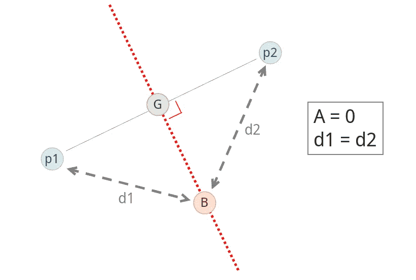

图 5：当*A*等于零时，*d1*和*d2*相等。存在一条与目标坐标垂直的线，使得*A*等于零。如果我们找到两个不同的位置，使得*A*为零，我们可以找到这条线。

要解这个方程，我们可以尝试解一个方程组（四个未知数需要四个方程），但我们的问题是非线性的。这会在试图孤立方程中的项时产生一些复杂的方程（方程 1）。在方程中，*x*和*y*是当前箱子位置坐标的两个维度。也许不是最优雅的，但这个方程可以通过最小化误差函数来数值求解。这正是我们在机器学习中使用梯度下降和更现代的前向前向方法所做的。

方程 1：简化情况下的距离差方程。

直到现在，我们描述的问题仅在平面地球学会内有效。我们用直线来表示距离，这意味着我们需要在球面世界中挖掘隧道。与其在平面上计算距离，我们需要在球面上计算距离。我已经更新了图 6 中的问题示意图。

> 直到现在，我们描述的问题仅在平面地球学会内有效。

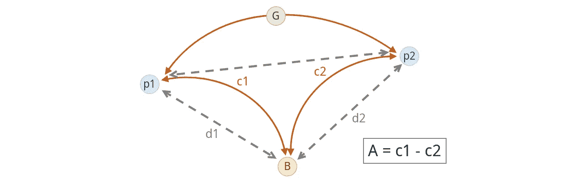

图 6：我们并不生活在平面地球上。问题实际上是在球面上。

计算球面上两点之间的距离远非简单。这涉及应用[大圆距离公式](https://en.wikipedia.org/wiki/Great-circle_distance)，这看起来相当复杂。幸运的是，人们发明了一种新的三角函数，使其看起来更为优雅：[哈弗辛公式](https://en.wikipedia.org/wiki/Haversine_formula)。如果你喜欢对这个问题的深入阅读，这里有一篇关于[地下数学](https://undergroundmathematics.org/trigonometry-compound-angles/the-great-circle-distance)的好文章。

使用哈弗辛公式来计算单个距离是相当可行的，然而，我们的神秘箱子输出的是两个距离 *A* 之间的差值。这使得最终的方程式极其复杂，我认为从数值上解决这个方程最为合理。

但在我们解决任何问题之前，我们需要获取数据。在下一部分，我将详细描述设置过程。

# 收集所需的数据

当尝试将物理谜题作为数据问题来解决时，最大的问题是很可能没有数据。这意味着我们需要收集自己的数据。根据我的物理学经验，收集数据并非易事。很多事情可能会（并且可能确实会）出错。老实说，为了这个项目，我可能已经骑了超过 80 公里。

> 很多事情可能会（且可能确实会）出现问题。

我们可以通过多种方式来收集数据。首先，我们可以骑自行车 🚴（我们在 🇳🇱，所以是的，我们🚴 😃），并停下来记录当前的纬度和经度以及箱子 *A* 的输出。从技术上讲，几个点就足够了，但这样做没什么趣味。

与其做这些手动工作，为什么不做一些经典的*过度工程*，获取神秘箱输出的视频，并将其与 GPS 记录器的数据匹配。为此，我们需要制作一种装置，将相机固定在箱子 LCD 屏幕前面。我想到的最直接的方法是将手机绑在某种容器上，这样可以在相机上获得清晰的图像。一个塑料盒子刚好有合适的尺寸，因此我可以将箱子放在盒子里，制造一些箱子套箱（我们要更深入）。相机需要稳固，以便相机和 LCD 屏幕之间的移动最小化。这需要一些严肃的胶带。

现在我们有了记录箱子输出为电影的解决方案。我手机的常规相机应用效果不好，所以我使用了一个名为[HD Camera](https://play.google.com/store/apps/details?id=photo.android.hd.camera&hl=en&gl=US)的应用程序。要获取当前位置，我们需要一个 GPS 记录器。为此，我从 Playstore 下载了[GPS logger](https://play.google.com/store/apps/details?id=eu.basicairdata.graziano.gpslogger&hl=en&gl=US)。安装了这两个应用程序后，我准备好收集一些数据。整个设置如图 7 所示。

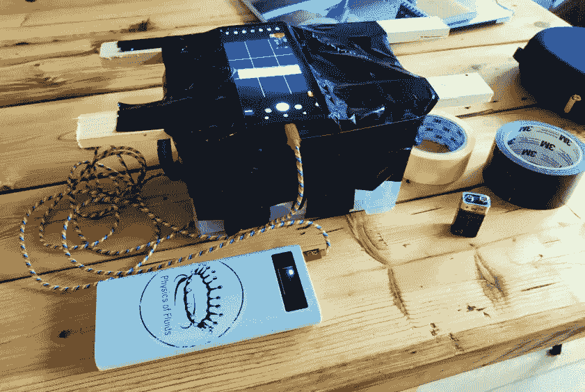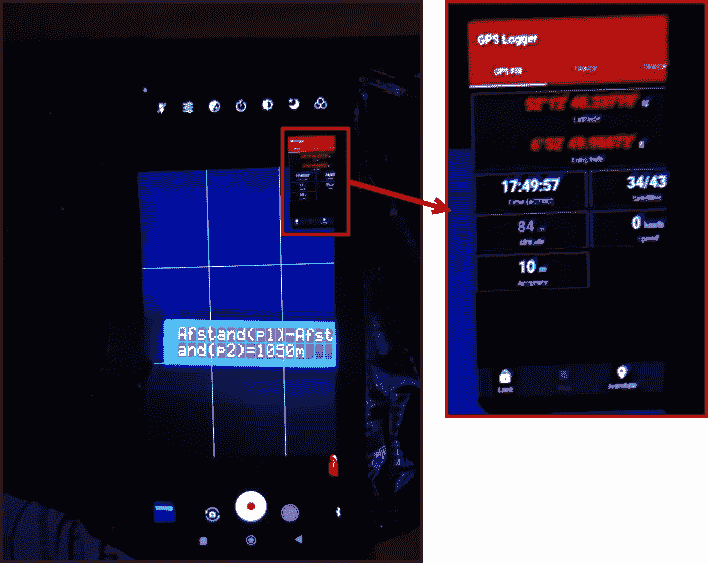

图 7：数据收集的设置。神秘箱子被盒子套箱。盒子上面绑着一个手机，以便相机能清晰地看到 LCD 屏幕。手机上有两个活动应用，一个相机应用和一个 GPS 记录器。GPS 记录器处于浮动应用模式，以便保持活动状态，不被手机的省电设置关闭。

我已经提到过在做实验时可能出错的很多事情。以下是我犯下的许多错误的自白：

1.  在第一次骑行时电池耗尽了。当手机在电量耗尽时仍在录制时，你会丢失录音。这让我为设备添加了一个额外的移动电源。（ 🚴 ~12 km）。

1.  下一次骑行时我的存储满了。我直到骑行快结束时才看到错误信息。（ 🚴 ~10 km）。

1.  在另一次骑行中，由于阳光我不喜欢光线。（ 🚴 ~9 km）。

1.  现在我喜欢这些影像，但不知为何没有 GPS 数据。（ 🚴 ~9 km）。

1.  再次，没有 GPS 数据。但我怀疑是一些电池节省问题。（ 🚴 ~9 km）。

1.  我把 GPS 记录器设置为前台，HD 相机设置为后台。现在我有了 GPS 数据，但不知为何，相机应用停止了。（ 🚴 ~9 km）。

1.  在将 GPS 记录器应用设置为浮动应用程序（一些多任务魔法）后，我得到了 GPS 和图像数据。（ 🚴 ~9 km）。

1.  我删除了我的代码库，包括所有录音。（ 🚴 ~9 km）。

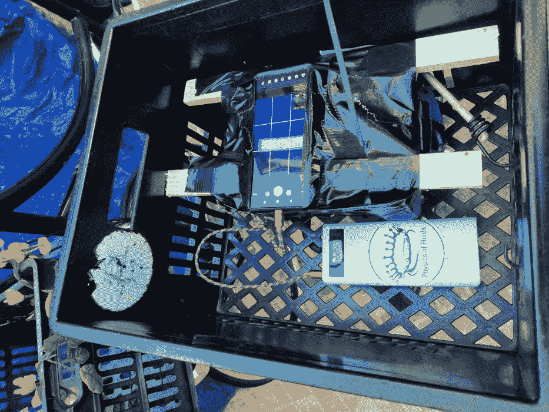

图 8：我自行车箱中的设置。

所以总的来说，我骑行了将近 80 公里，获取了有用的影像和 GPS 数据。接下来，我们将深入研究这两个数据源，并将它们结合起来，以便我们有* A = f(x,y)*。

# 处理数据的好处

现在我们有了两个数据源，我们需要将它们处理成有用的东西。我们将首先把 GPS 数据转换为默认的 DataFrame。接下来，我们还将把 4.7GB 的视频转换为 *A* 值的表格。这将是一些相当不错的数据缩减 😃。

## 转换 GPS 记录数据

当手机上的相机记录 LCD 屏幕的变化值时，GPS 记录器应用程序记录了当前的纬度和经度值。这些值以 1Hz 的记录速率存储在一个所谓的 GPX 文件中，Python 中有一个巧妙的库可以处理这些文件。它方便地叫做 `gpxpy`，安装后数据可以轻松加载：

代码 1：导入 GPS 数据并创建 DataFrame。简直是小菜一碟！

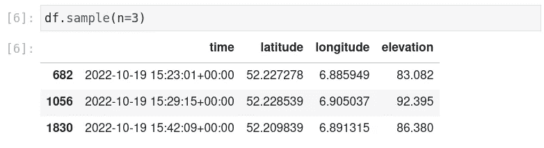

输出 1：新创建数据集的示例。

现在我们有一个包含 2133 个测量值的 DataFrame，其中包括纬度、经度、海拔和时间。为了检查这些坐标是否合理，我们可以简单地使用 Matplotlib 创建一个参数图。然而，Python 还有另一个专门用于地图的优秀库，叫做 `folium`。让我们可视化一下我骑行的路线：

代码 2：使用 Folium 可视化 GPS 坐标。

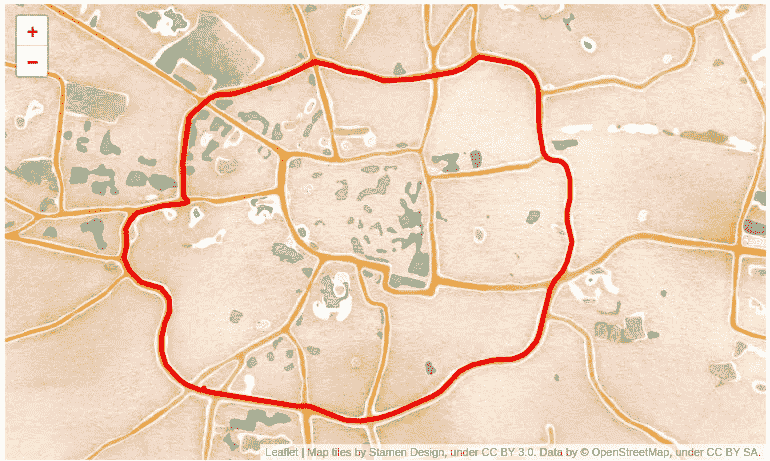

输出 2：美丽的恩斯赫德地图和我骑行的确切路线。

在美丽的 Folium 地图上，我们使用了“tamen watercolor”图块，正好显示了我骑行以收集数据的路径。在将 DataFrame 存储到磁盘之前，我们需要修正时间列中的时区。目前，时区设置为“z”，我不确定这是什么。为了避免任何复杂性，我们需要本地化时间。

代码 3：修正时间并将 DataFrame 存储为 Parquet 文件。

GPS 数据已经准备好使用了。接下来，我们需要将视频镜头处理成有用的内容。

## 创建图像检测器的训练集

我们有一个视频展示了骑行过程中神秘盒子的所有输出。我们需要从每一帧中提取 *A* 值及其对应的时间。利用这些时间，我们可以将 *A* 值与其 GPS 位置链接起来。为了提取 *A* 值，我们将训练一个 [基于 DONUT 的模型](https://arxiv.org/abs/2111.15664)。这是一个端到端的模型，不需要任何光学字符识别（OCR）。为了训练模型，我们需要一个标注好的数据集。首先，让我们使用 [OpenCV](https://pypi.org/project/opencv-python/) 检查视频数据。

代码 4：将视频作为流导入并检查帧率。

该视频的帧率为每秒 30 帧。视频的持续时间大约为 35 分钟，因此总帧数会超过 63k。这有点多，特别是因为大多数 Arduino 的 GPS 传感器更新频率大于 1Hz。因此，我们只选择每秒一帧，并将它们放入一个常规列表中。

代码 5：以每秒 1 帧的帧率从视频中提取帧。

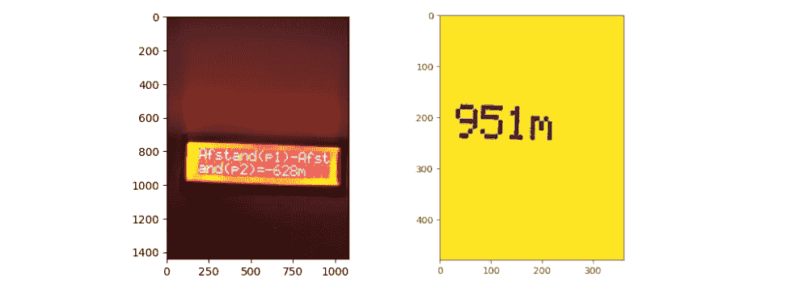

输出 3：视频中的单帧（左）和最终预处理的帧（右）。

我们已经提取了 2119 帧，这已经是从最初的 63k 帧中减少了相当多。当查看输出 3（左侧）的帧时，我们发现帧中的许多像素对我们并不特别有趣。在预处理过程中，我们将裁剪图像，仅保留 A 值。我们还会将图像转换为黑白，这可能有助于后续的对比度问题。

代码 6：预处理图像，以便我们孤立 A 值。

现在我们只需要保存列表。这是一个相对容易并行化的任务，因为它不依赖于之前的输入，因此我们使用`[joblib](https://joblib.readthedocs.io/en/latest/parallel.html)`来完成这一步。

代码 7：存储图像，当然要并行处理！

我们现在有了一个数据集，但它尚未标记。为了标记，我创建了一个工具，用于在 Jupyter Lab（或 Notebook）中标记数据，称为`[Pigeon-XT](https://github.com/dennisbakhuis/pigeonXT)`。这是 Anastasis Germanidis 创建的 Pigeon 标记工具的扩展版本。我们将标记 250 个示例，这花了我大约 15 分钟。

代码 8：在我们的 Jupyter Notebook 中舒适地标记数据。

现在我们有了一个标记的数据集。虽然它很小，大约占完整数据集的 10%，但我们应该能够训练一个模型，用来填补数据集的缺失部分。为了让我们的工作更轻松，我们可以使用🤗 Huggingface 的`[datasets](https://github.com/huggingface/datasets)`库。我们可以通过一些小调整将数据导入为 Imagefolder 数据集。

代码 9：创建一个 Huggingface 数据集对象。

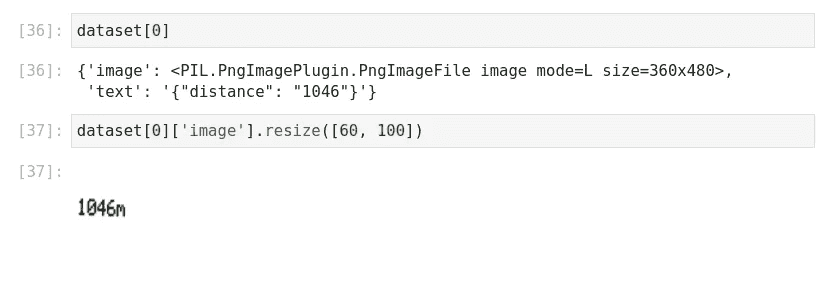

输出 4：数据集对象使数据处理变得非常容易。也许使用其.map()函数进行转换会更好。

最后但同样重要的是，我们需要保存数据集。值得一提的是，可以在 Huggingface 中心共享你的数据集。使用`[huggingface_hub](https://github.com/huggingface/huggingface_hub)`包非常简单。为此，你还需要一个中心的账户。在中心共享的神奇之处在于，你现在可以下载这个数据集，而无需进行我上面做的所有处理。

代码 10：保存数据集并将其推送到 Huggingface 中心。

现在我们拥有了训练模型以推断缺失标签的所有条件。让我们开始训练吧🔥🔥🔥！

## 训练一个🍩 DONUT 模型

我们终于可以开始训练我们的模型了。我们将训练一个基于[DONUT](https://arxiv.org/abs/2111.15664)的模型，该模型由[Naver AI Lab](https://naverlabs.com/)创建。DONUT 是一个真正的端到端模型。你输入一张图像，它将输出一个包含键值对的 JSON 对象。最令人惊叹的是，它可以在没有 OCR 的情况下完成这一切。之前的最新方法，如[LayoutLM](https://arxiv.org/abs/2204.08387)，使用了两步法：首先使用 OCR 提取所有文本及其位置，其次，将图像和文本数据输入模型以提取信息。

从文档中提取信息的问题在于，很多信息被编码在布局中。人脑能够理解以标题、表格或标题的形式呈现的数据之间的关系。使用 OCR 方法，这些信息会丢失。像 LayoutLM 这样的方式利用图像恢复布局信息。DONUT 可以一次性完成这项工作，并且内置了 OCR。从我所看到的，它的效果还不错，但对文档中的变化非常敏感。当文档有微小的布局变化，但要提取的信息仍然相同时，DONUT 容易失败。

我们的图像实际上不是文档，但它们文本非常清晰，从布局的角度来看也非常一致。因此，DONUT 将是一个极好的（甚至有些过度）提取 *A* 值的方法。我按照 CloveAI 团队在他们的 [代码库](https://github.com/clovaai/donut) 中所做的相同步骤进行操作。[Philipp Schmid](https://www.linkedin.com/in/philipp-schmid-a6a2bb196/) 写了一篇 [很棒的文章](https://www.philschmid.de/fine-tuning-donut) 介绍了如何训练自己的 DONUT 类型模型。首先，我们需要为模型的特定 DONUT 输入准备数据集。

代码 11：将 JSON 对象转换为 DONUT 期望的令牌。

现在数据已符合 DONUT 的预期格式，我们需要对数据进行分词。这是一个与 GPT<n> 和 BERT 等转换器语言模型共同的步骤，但现在也用于视觉转换器（ViT）中的图像。

代码 12：为模型输入对数据进行分词。

现在我们已经准备好进行实际训练了 🔥。如今，这非常简单，因为你不再需要编写训练循环了。虽然我起初有些难过，因为编写循环感觉很酷，但它其实非常重复。Huggingface 提供了训练器对象，它非常适合这项工作。

代码 13：训练循环的完整代码已经简化了很多！

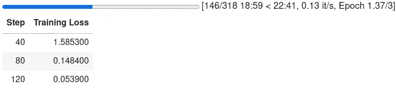

输出 5：训练进行中。

在测试数据集的评估后，我们得到了 0.007 的评估损失，这相当不错。在我们 38 个测试样本中，有 37 个被正确检测出来。唯一一个不正确的是少了一个数字：059 而不是 1059。37/38 的准确率为 97%，这可能足以标记完整的集合。在我们开始推断缺失值之前，让我们先保存模型并将其推送到中心。

代码 14：保存模型并将其推送到中心。

现在让我们对缺失的标签进行一些推断。

## 使用模型推断缺失数据

最终，我们可以使用我们的模型来推断标签。图像已经准备好，所以我们可以直接使用它们。每个帧的时间以秒为单位编码在其文件名中。由于帧率不是精确的每秒 30 帧，因此会有小的偏差，但差异会很小。让我们首先创建一个函数来为我们进行推断：

代码 15：推断图像的代码。

我们现在可以对每张图片逐一进行推断，但这将花费大约一个小时。让我们并行处理，但这远非简单。对于简单的任务，`joblib` 很棒。然而，在使用模型时，为每次迭代序列化大型模型会比逐个处理更慢。为了解决这个问题，我之前编写了 `[tqdm_batch](https://github.com/dennisbakhuis/tqdm_batch)`。

> 并行作业并非易事。阅读我的 文章🏃🏻💨！

代码 16：并行化推断步骤，并将工作分配给四个工作者。

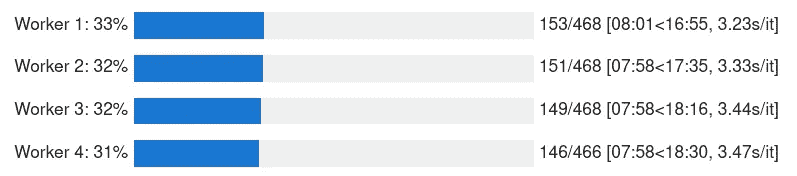

输出 6：使用 tqdm_batch 运行 4 个工作者并行处理。

现在我们有了来自盒子的 A 值，我们可以构建最终的数据集并将其与 GPS 数据结合起来。像往常一样，预测并不完美，我们需要做一些调整。作为数据科学家，你实际上是一个数据按摩师。

代码 15：对数据集进行基本清理。

几乎完成了，唯一的问题是错误检测到的 A 值。这些可以使用滚动滤波器进行过滤。我们将删除与移动平均值差异超过 5 米（任意小数）的值，并用剩余值进行插值。

代码 16：使用移动平均过滤器和插值来过滤噪声数据。

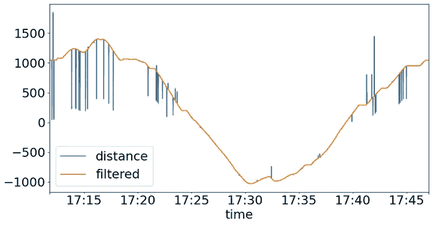

输出 7：应用过滤器后的最终结果。相当不错！

这个过滤效果相当不错。现在我们准备将这个数据集与之前记录的 GPS 数据结合起来。

## 结合图像和 GPS 数据

将 A 值与 GPS 数据结合应该不成问题。对于 GPS 数据集中的每一行，我们将寻找时间上最接近的匹配，并使用该行的 A 值。

代码 17：将 *A* 值添加到 GPS 数据集中。

就这些了！付出了很多努力，可能其实并不必要。但我们使用了机器学习，这才是最重要的！

> 我们使用了机器学习，这才是最重要的！

接下来，我们将使用这个数据集并尝试找到目标坐标。

# 分析数据集并找到目标

如前所述，我们将尝试找到两个未知位置 *p1* 和 *p2*。如果我们知道这两个点，我们也将知道目标位置，它应该正好在这两个点之间。为了找到这些位置，我们将使用 `[minimize](https://docs.scipy.org/doc/scipy/reference/generated/scipy.optimize.minimize.html#scipy.optimize.minimize)` 来自 `[Scipy](https://scipy.org/)`。虽然我可以自己编写 Haversine 函数，但我将直接使用 `[haversine](https://github.com/mapado/haversine)` 包。要使用 `minimize`，我们需要编写一个误差函数。这个函数将计算已知的 *A* 和计算出的 A 之间的差异，并对数据集中的所有值求绝对差异的总和。最小化函数应该最小化这个误差。

代码 18：让我们最小化这个问题。

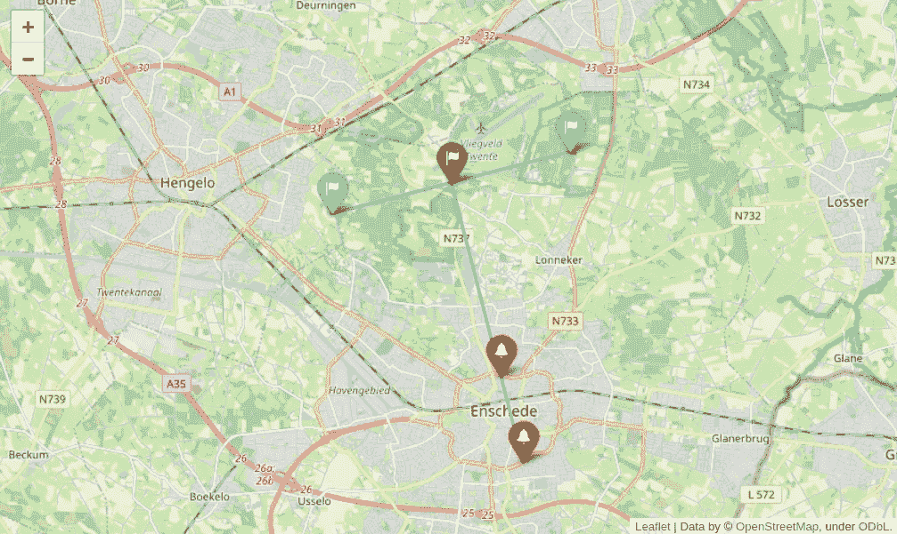

输出 8：最终解决方案（绿色）正好位于点 p1 和 p2（蓝色）之间。目标也在我找到的零点的垂直线上。

就是这样，我找到了位置。目标正好位于点 p1 和 p2 之间。这个点也连接到我之前找到的零点之间的垂直线上。但最大的提示是目标位置是一家 [BBQ 餐厅](https://marcook.nl/)。桑德和我都很喜欢汉堡，而这个地方有很棒的选择。

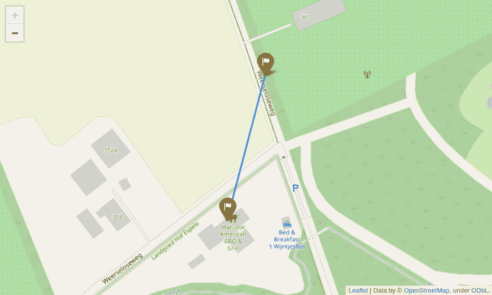

输出 9：我找到的坐标与实际目标之间的差异是 93 米。

实际点与我找到的点之间的偏差是 93 米。这可能有很多原因。首先，提取的 A 值只有整数。这确实有影响，但我怀疑这只是一个较小的影响，平均在较大的数据集上应该可以忽略。当然，过滤（平滑）也有影响。也许故意添加了一些噪声，不确定我是否能注意到。总之，我对结果相当满意。

# 前往位置

花了相当长的时间，但现在我终于确定了位置。我开车去了 Marcook，一家位于恩斯赫德外的烧烤餐厅。如果我在那个位置打开神秘盒子，它应该会显示解锁其谜团的代码。

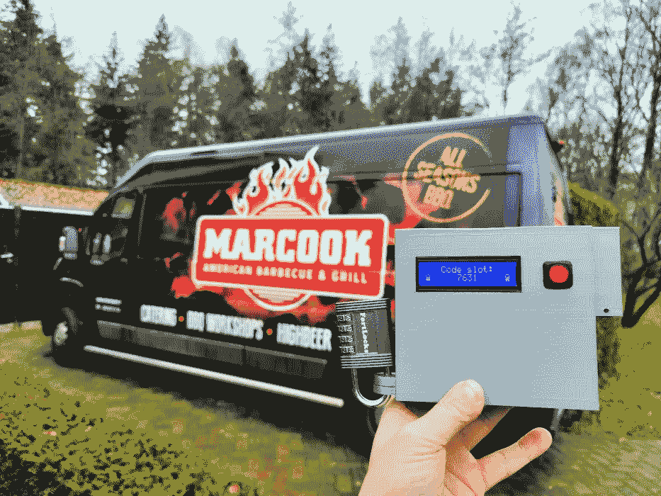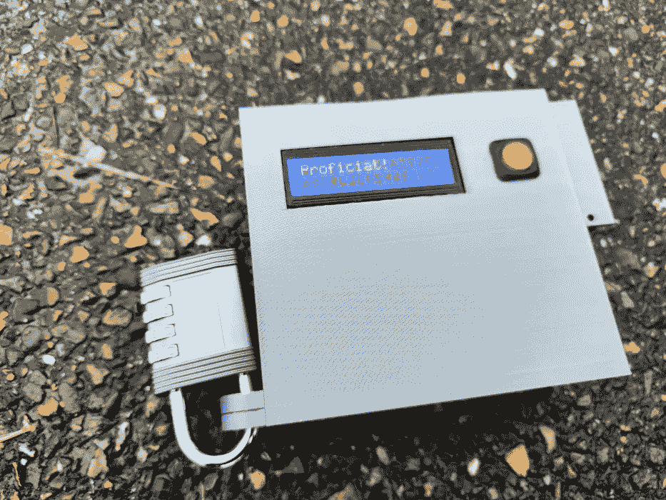

图 9：神秘盒子解锁了所有的谜团。

的确，等待了几分钟以获得 GPS 定位后，盒子几乎立刻回应了‘proficiat’。祝贺你走到这一步。设备的下一个屏幕显示代码：7631。

老实说，这不是一个简单的挑战。但这是一次有趣的旅程，最后我们会吃一些汉堡。几乎没什么能比这更好。

此项目的所有代码都在 [Github](https://github.com/dennisbakhuis/mystery_box) 上。大部分较小的数据集包含在 Git 仓库中，但较大的视频通过我的 Dropbox 共享。用于 ViT 训练的 dataset、DONUT 处理器和 DONUT 模型也在 🤗 [Huggingface hub](https://huggingface.co/bakhuisdennis) 上共享。如果你有任何问题，欢迎通过 [LinkedIn](https://linkedin.com/in/dennisbakhuis) 联系我。

最后但同样重要的是，我要感谢 🙏 *桑德* 给予的有趣体验。对不起我花了这么长时间，但我想我有点过度了。这确实很有趣！汉堡？
