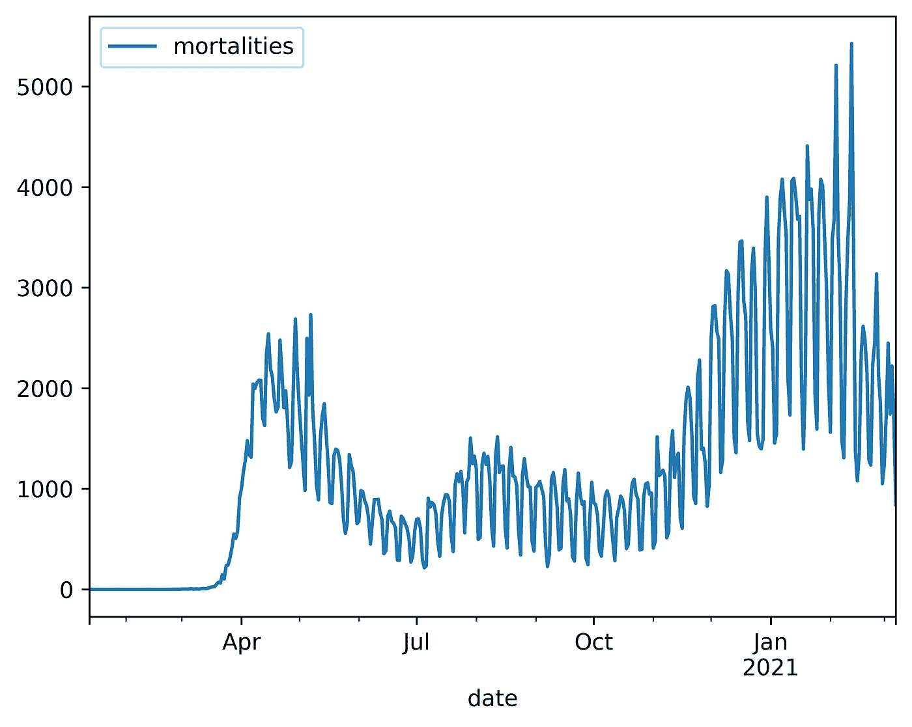

# 破解锯齿形 COVID 图表的谜团

> 原文：[`towardsdatascience.com/solve-the-mystery-of-the-serrated-covid-chart-b0b517b224ef?source=collection_archive---------7-----------------------#2023-09-12`](https://towardsdatascience.com/solve-the-mystery-of-the-serrated-covid-chart-b0b517b224ef?source=collection_archive---------7-----------------------#2023-09-12)

## 使用 pandas 将数据下采样到适当的分辨率

 [Lee Vaughan](https://medium.com/@lee_vaughan?source=post_page-----b0b517b224ef--------------------------------)

·

[关注](https://medium.com/m/signin?actionUrl=https%3A%2F%2Fmedium.com%2F_%2Fsubscribe%2Fuser%2F5d604015c08b&operation=register&redirect=https%3A%2F%2Ftowardsdatascience.com%2Fsolve-the-mystery-of-the-serrated-covid-chart-b0b517b224ef&user=Lee+Vaughan&userId=5d604015c08b&source=post_page-5d604015c08b----b0b517b224ef---------------------post_header-----------) 发表在 [Towards Data Science](https://towardsdatascience.com/?source=post_page-----b0b517b224ef--------------------------------) ·7 分钟阅读·2023 年 9 月 12 日 

--

DreamShaper_v7_A_computer_monitor_displaying_a_chart_with_a_jagged_blue_line (by author & Leonardo AI)

在 COVID-19 大流行的第一年，该疾病的死亡人数引发了很多争议。争议包括由于缺乏检测而导致的早期低估、医院外的死亡未被记录，以及区分 COVID-19 的死亡和伴有 COVID-19 的死亡问题*。*

更糟糕的是，不幸的是，疫情迅速被政治化。各方政客抓住每一份数据，寻找将其扭曲为自己利益的方式。确认偏误泛滥。如果你当时在社交媒体上，你可能看到了一些挑战官方图表和图形真实性的帖子。

在这个*快速成功的数据科学*项目中，我们将查看一个当时出现在我 Facebook 动态墙上的特定图表。该图表记录了美国 COVID-19 疫情第一年的死亡率，并显示出明显的锯齿状或“锯齿状”的特征。

美国 COVID-19 疫情第一年的死亡率（作者来自《大西洋》的“COVID Tracking Project” [3]）

曲线波动频率很高，怀疑疾病以这种方式进展的可能性。虽然有些…
