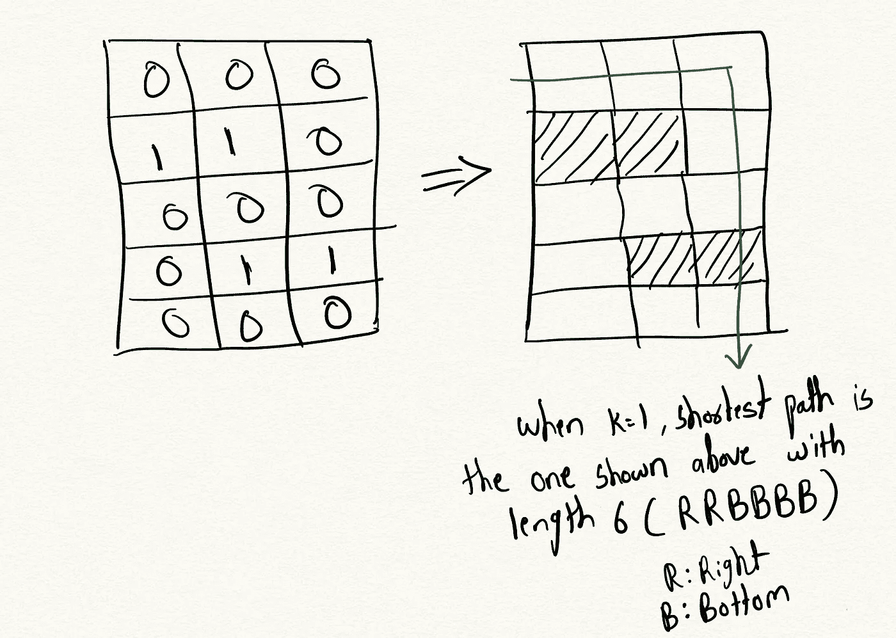
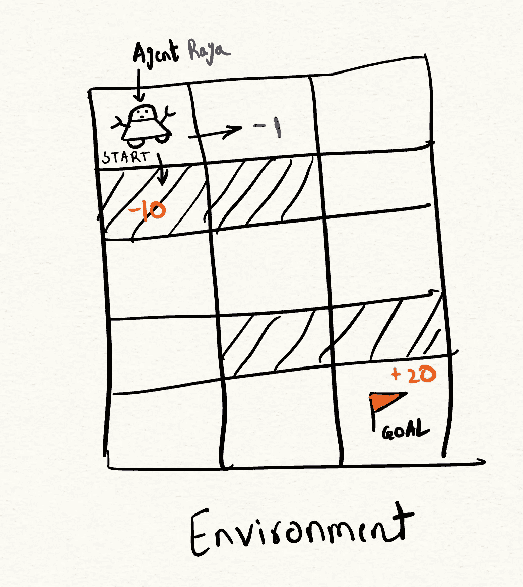
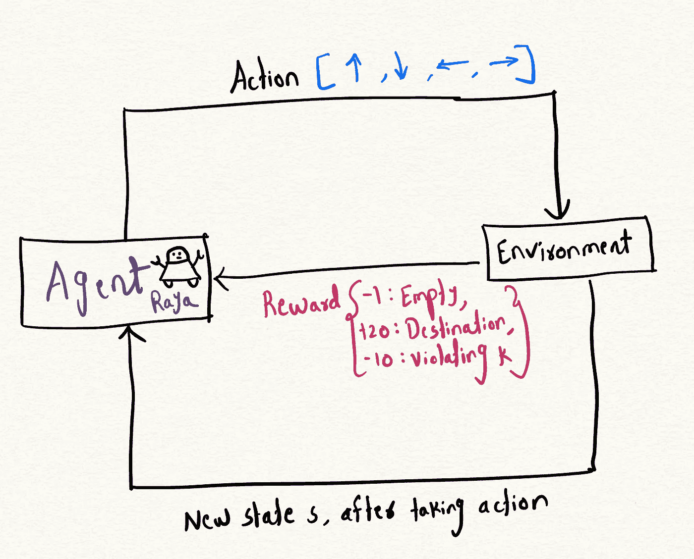
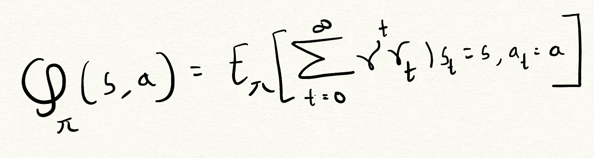
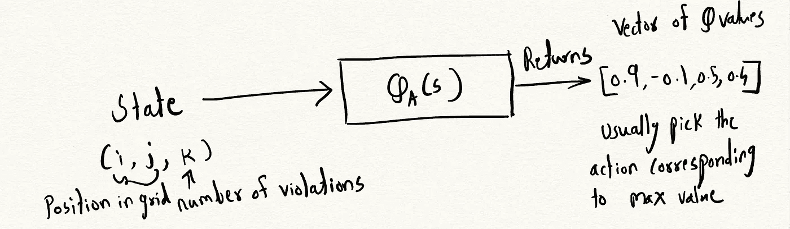
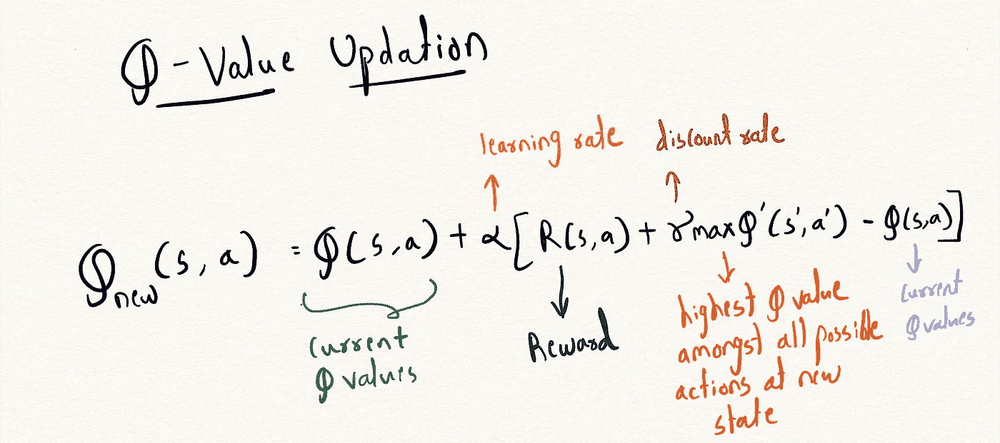

# 使用强化学习解决 Leetcode 问题

> 原文：[`towardsdatascience.com/solving-a-leetcode-problem-using-reinforcement-learning-a-practical-introduction-to-6ec9959dd309?source=collection_archive---------8-----------------------#2023-08-29`](https://towardsdatascience.com/solving-a-leetcode-problem-using-reinforcement-learning-a-practical-introduction-to-6ec9959dd309?source=collection_archive---------8-----------------------#2023-08-29)

## 强化学习的实用介绍

[](https://medium.com/@pratikaher?source=post_page-----6ec9959dd309--------------------------------)[](https://towardsdatascience.com/?source=post_page-----6ec9959dd309--------------------------------) [Pratik Aher](https://medium.com/@pratikaher?source=post_page-----6ec9959dd309--------------------------------)

·

[关注](https://medium.com/m/signin?actionUrl=https%3A%2F%2Fmedium.com%2F_%2Fsubscribe%2Fuser%2Fc2e5b1d7be67&operation=register&redirect=https%3A%2F%2Ftowardsdatascience.com%2Fsolving-a-leetcode-problem-using-reinforcement-learning-a-practical-introduction-to-6ec9959dd309&user=Pratik+Aher&userId=c2e5b1d7be67&source=post_page-c2e5b1d7be67----6ec9959dd309---------------------post_header-----------) 发布于 [Towards Data Science](https://towardsdatascience.com/?source=post_page-----6ec9959dd309--------------------------------) ·7 分钟阅读·2023 年 8 月 29 日 [](https://medium.com/m/signin?actionUrl=https%3A%2F%2Fmedium.com%2F_%2Fvote%2Ftowards-data-science%2F6ec9959dd309&operation=register&redirect=https%3A%2F%2Ftowardsdatascience.com%2Fsolving-a-leetcode-problem-using-reinforcement-learning-a-practical-introduction-to-6ec9959dd309&user=Pratik+Aher&userId=c2e5b1d7be67&source=-----6ec9959dd309---------------------clap_footer-----------)

--

[](https://medium.com/m/signin?actionUrl=https%3A%2F%2Fmedium.com%2F_%2Fbookmark%2Fp%2F6ec9959dd309&operation=register&redirect=https%3A%2F%2Ftowardsdatascience.com%2Fsolving-a-leetcode-problem-using-reinforcement-learning-a-practical-introduction-to-6ec9959dd309&source=-----6ec9959dd309---------------------bookmark_footer-----------)

最近，我遇到了一个在 leetcode 上的问题：[**网格中的最短路径与障碍物消除**](https://leetcode.com/problems/shortest-path-in-a-grid-with-obstacles-elimination/)**。** 网格中的最短路径与障碍物消除问题涉及在包含障碍物的二维网格中，从起始单元格到目标单元格寻找最短路径，你可以消除沿途最多 k 个障碍物。网格由一个“**m x n**”的二维数组表示，其中 0 表示空单元格，1 表示障碍物单元格。

目标是找到从起始单元格**(0, 0)**到目标单元格**(m-1, n-1)**的最短路径，途经空单元格，同时最多消除 k 个障碍。消除障碍意味着将障碍单元格（1）转换为空单元格（0），以便路径可以通过。



在网格中消除障碍的最短路径示例（图像来自作者）

当我解决这个问题时，我意识到它可以提供一个有用的框架来理解强化学习原理的实际应用。在深入探讨之前，让我们看一下传统上如何解决这个问题。

要理想地解决这个问题，我们需要从起始单元格开始进行图搜索，同时跟踪到目前为止消除的障碍数量。在每一步，我们考虑移动到一个相邻的空单元格，或在还有剩余消除次数时消除相邻的障碍单元格。最短路径是以最少的步数到达目标并且最多消除 k 个障碍的路径。我们可以使用广度优先搜索、深度优先搜索来有效找到最佳最短路径。

这里是使用 BFS 方法解决此问题的 Python 函数：

```py
class Solution:
    def shortestPath(self, grid: List[List[int]], k: int) -> int:
        rows, cols = len(grid), len(grid[0])
        target = (rows - 1, cols - 1)

        # if we have sufficient quotas to eliminate the obstacles in the worst case,
        # then the shortest distance is the Manhattan distance
        if k >= rows + cols - 2:
            return rows + cols - 2

        # (row, col, remaining quota to eliminate obstacles)
        state = (0, 0, k)
        # (steps, state)
        queue = deque([(0, state)])
        seen = set([state])

        while queue:
            steps, (row, col, k) = queue.popleft()

            # we reach the target here
            if (row, col) == target:
                return steps

            # explore the four directions in the next step
            for new_row, new_col in [(row, col + 1), (row + 1, col), (row, col - 1), (row - 1, col)]:
                # if (new_row, new_col) is within the grid boundaries
                if (0 <= new_row < rows) and (0 <= new_col < cols):
                    new_eliminations = k - grid[new_row][new_col]
                    new_state = (new_row, new_col, new_eliminations)
                    # add the next move in the queue if it qualifies
                    if new_eliminations >= 0 and new_state not in seen:
                        seen.add(new_state)
                        queue.append((steps + 1, new_state))

        # did not reach the target
        return -1
```

## 强化学习的小介绍

强化学习（RL）是机器学习的一个领域，其中一个**智能体**通过**奖励**机制学习**策略**，以通过了解其**环境**来完成任务。我一直对强化学习感到着迷，因为我相信这一框架很 closely mirrors 人类通过经验学习的方式。这个想法是构建一个可学习的智能体，通过反复试验了解环境，以解决问题。

让我们逐一深入这些术语：



环境与智能体 Raya（图像来自作者）

+   **智能体**：智能体是一个假设的实体，控制行动的过程。你可以想象一个假设的机器人，比如智能体 Raya，它从一个位置开始并探索其环境。例如，Raya 有两个可能的选择：位置 (0, 0) 向右移动，或位置 (0, 1) 向下移动，这两个位置有不同的奖励。

+   **环境**：环境是我们智能体操作的背景，在这种情况下是一个二维网格。

+   **状态**：状态表示玩家的当前情况。在我们的例子中，它表示玩家的当前位置和剩余的违规次数。

+   **奖励系统**：奖励是我们采取某种行动后获得的分数。在这种情况下：空单元格为-1 分，到达目的地为+20 分，如果我们用完了违规次数 k，则为-10 分。



迭代过程（图像来自作者）

通过迭代过程，我们学习到一种最佳策略，这种策略使我们能够在每个时间步找到最佳行动，同时最大化总奖励。

为了找到最佳策略，我们使用了一个叫做**Q 函数**的东西。你可以将这个函数视为代理迄今为止所有探索的储存库。代理然后利用这些历史信息在未来做出更好的决策，从而最大化奖励。

## Q 函数

Q(s, a) 代表代理在状态 s 下采取动作 a 并遵循策略 π 时可以获得的期望累计奖励。



Q 函数（作者提供的图片）

其中

+   **π**：代理采用的策略。

+   **s**：当前状态。

+   **a**：代理在状态 s 下采取的动作。

γ 是平衡探索和利用的折扣因子。它决定了代理对即时奖励和未来奖励的优先级。折扣因子接近 0 会使代理关注短期奖励，而折扣因子接近 1 会使代理关注长期奖励。

代理需要在利用已知的高奖励动作和探索可能带来更高奖励的未知动作之间取得平衡。使用 0 到 1 之间的折扣因子有助于防止代理陷入[局部最优策略](https://ai-ml-analytics.com/reinforcement-learning-exploration-vs-exploitation-tradeoff/)。



给定一个状态，Q 函数返回一个向量，该向量为所有动作提供一个评分（作者提供的图片）

现在让我们跳到整个过程如何工作的代码部分。

这就是我们定义代理及其相关变量的方式。

**奖励函数**：奖励函数接受当前状态并返回该状态获得的奖励。

**贝尔曼方程：**

我们应如何更新 Q 表，以使每个位置和动作的值尽可能最佳？对于任意次数的迭代，代理从位置 (0, 0, k) 开始，其中 k 表示允许的违规次数。在每个时间步，代理通过随机探索或利用学到的 Q 值贪婪地移动，转移到新状态。

在到达新状态后，我们评估即时奖励，并根据贝尔曼方程更新该状态-动作对的 Q 值。这使我们能够通过将新奖励纳入每个状态-动作的历史累计奖励中，迭代地改进 Q 函数。

这里是贝尔曼方程的方程式：



Q 值方程（作者提供的图片）

这就是训练过程在代码中的样子：

**构建路径**：对于路径，我们利用每个网格位置的最大 Q 值来确定该位置采取的最佳行动。Q 值本质上编码了基于长期奖励在每个位置应采取的最佳行动。例如，在位置 (0,0) 的所有行动 k 中，最大 Q 值对应的行动是“1”，代表向右移动。通过在每一步贪婪地选择具有最高 Q 值的行动，我们可以构建出一条穿越网格的最优路径。

如果你运行提供的代码，你会发现它生成的路径是 **RBRBBB**，这确实是考虑到障碍物的最短路径之一。

这是完整代码的链接，包含在一个文件中：[*shortest_path_rl.py*](https://gist.github.com/pratikaher88/9fc6fcbe18ffd8f526b38c967c66629c)

## 结论

在现实世界的强化学习场景中，代理与之互动的环境可能非常庞大，仅有稀疏的奖励。

如果你通过更改 0 和 1 来改变棋盘的配置，这种硬编码的 Q 表方法将无法推广。我们的目标是训练一个代理，使其学习网格世界配置的通用表示，并能够在新的布局中找到最优路径。在下一篇文章中，我将用深度 Q 网络 (DQN) 替换硬编码的 Q 表值。DQN 是一个神经网络，它接受状态-行动组合和完整网格布局作为输入，并输出 Q 值估计。这个 DQN 应该能让代理即使在训练过程中未遇到的新网格布局中也能找到最优路径。

如果你想快速聊聊并建立联系，可以通过 LinkedIn 联系我：[`www.linkedin.com/in/pratikdaher/`](https://www.linkedin.com/in/pratikdaher/)
