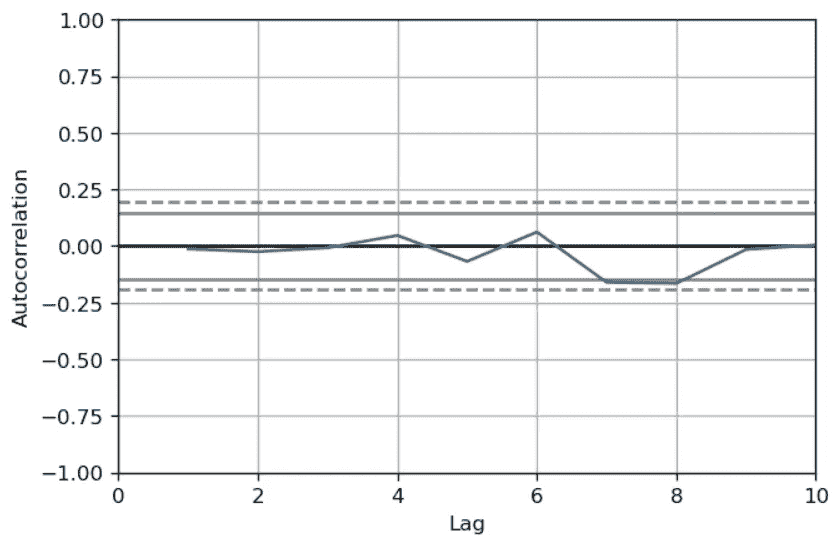

# 解决通用线性模型中的自相关问题的实际应用

> 原文：[`towardsdatascience.com/solving-autocorrelation-problems-in-general-linear-model-on-a-real-world-application-0bd3eeda20a1?source=collection_archive---------4-----------------------#2023-12-13`](https://towardsdatascience.com/solving-autocorrelation-problems-in-general-linear-model-on-a-real-world-application-0bd3eeda20a1?source=collection_archive---------4-----------------------#2023-12-13)

## 探索数据科学家最常遇到的噩梦之一

[](https://medium.com/@rodrigodamottacc?source=post_page-----0bd3eeda20a1--------------------------------)[](https://towardsdatascience.com/?source=post_page-----0bd3eeda20a1--------------------------------) [Rodrigo da Motta C. Carvalho](https://medium.com/@rodrigodamottacc?source=post_page-----0bd3eeda20a1--------------------------------)

·

[关注](https://medium.com/m/signin?actionUrl=https%3A%2F%2Fmedium.com%2F_%2Fsubscribe%2Fuser%2Fd17b17427c47&operation=register&redirect=https%3A%2F%2Ftowardsdatascience.com%2Fsolving-autocorrelation-problems-in-general-linear-model-on-a-real-world-application-0bd3eeda20a1&user=Rodrigo+da+Motta+C.+Carvalho&userId=d17b17427c47&source=post_page-d17b17427c47----0bd3eeda20a1---------------------post_header-----------) 发表在 [Towards Data Science](https://towardsdatascience.com/?source=post_page-----0bd3eeda20a1--------------------------------) · 8 min read · 2023 年 12 月 13 日 [](https://medium.com/m/signin?actionUrl=https%3A%2F%2Fmedium.com%2F_%2Fvote%2Ftowards-data-science%2F0bd3eeda20a1&operation=register&redirect=https%3A%2F%2Ftowardsdatascience.com%2Fsolving-autocorrelation-problems-in-general-linear-model-on-a-real-world-application-0bd3eeda20a1&user=Rodrigo+da+Motta+C.+Carvalho&userId=d17b17427c47&source=-----0bd3eeda20a1---------------------clap_footer-----------)

--

[](https://medium.com/m/signin?actionUrl=https%3A%2F%2Fmedium.com%2F_%2Fbookmark%2Fp%2F0bd3eeda20a1&operation=register&redirect=https%3A%2F%2Ftowardsdatascience.com%2Fsolving-autocorrelation-problems-in-general-linear-model-on-a-real-world-application-0bd3eeda20a1&source=-----0bd3eeda20a1---------------------bookmark_footer-----------)

## 引言

线性回归中最大的一个问题是自相关残差。在这种情况下，本文重新审视了线性回归，深入探讨了 Cochrane–Orcutt 程序作为解决此问题的一种方法，并探索了在 fMRI 大脑激活分析中的实际应用。


图片由[Jon Tyson](https://unsplash.com/@jontyson?utm_source=medium&utm_medium=referral)拍摄，来源于[Unsplash](https://unsplash.com/?utm_source=medium&utm_medium=referral)。

# 回顾一般线性模型（GLM）

线性回归可能是任何数据科学家最重要的工具之一。然而，尤其在时间序列的背景下，常常会出现许多误解。因此，让我们花些时间重新审视这一概念。GLM 在时间序列分析中的主要目标是建模变量在时间点序列中的关系。其中***Y***是目标数据，***X***是特征数据，***B***和***A***是待估计的系数，***Ɛ***是高斯误差。


GLM 的矩阵形式。图片由作者提供。

指数指的是数据的时间演变。以更紧凑的形式表示：


GLM 的矩阵形式。图片由作者提供。

作者提供。

参数的估计是通过普通最小二乘法（OLS）进行的，该方法假设观测值与模型预测值之间的误差或**残差**，**是独立且同分布的（*i.i.d*）**。

> 这意味着残差必须是非自相关的，以确保系数的正确估计、模型的有效性和预测的准确性。

# 自相关

自相关指的是时间序列中观测值之间的相关性。我们可以理解为每个数据点与序列中滞后的数据点之间的关系。

自相关函数（ACF）用于检测自相关。这些方法测量数据点与其滞后值（*t = 1,2,…,40*）之间的相关性，揭示数据点是否与前面的或后面的值相关。ACF 图（图 1）展示了不同滞后下的相关系数，指示自相关的强度，以及阴影区域内的统计显著性。


图 1. ACF 图。图片由作者提供。

如果某些滞后的系数显著不同于零，这表明存在自相关。

# 残差中的自相关

残差中的自相关表明当前和过去的误差之间存在关系或依赖性。这种相关模式表明误差不是随机的，可能受到模型未考虑的因素的影响。例如，自相关可能导致**参数估计偏差**，尤其是在方差方面，影响对变量之间关系的理解。这会导致**从模型中得出的无效推断**，使对变量之间关系的结论产生误导。此外，它会导致**预测效率低下**，这意味着模型未能捕捉到正确的信息。

# **Cochrane–Orcutt 程序**

Cochrane–Orcutt 程序是一种在经济计量学和其他领域著名的方法，用于通过线性模型处理时间序列中的自相关问题，尤其是在误差项的序列相关性方面[1,2]。我们已经知道这违背了普通最小二乘法（OLS）回归的假设，该假设认为误差（残差）是无相关的[1]。在本文稍后，我们将使用该程序去除自相关性，并检查系数的偏差。

Cochrane–Orcutt 程序如下：

+   **1\. 初始 OLS 回归：** 通过普通最小二乘法（OLS）进行初始回归分析，以估计模型参数。


初始回归方程。图片由作者提供。

+   **2\. 残差计算：** 计算初始回归的残差。

+   **3\. 检测自相关性：** 使用 ACF 图或如 Durbin-Watson 检验等测试检查残差是否存在自相关性。如果自相关性不显著，则无需继续该程序。

+   **4\. 转换：** 通过对依赖变量和自变量进行差分处理来转换估计模型，以去除自相关性。这里的想法是使残差更接近无相关性。


Cochrane–Orcutt 自回归项 AR(1)公式。图片由作者提供。

+   **5\. 对转换后的模型进行回归：** 使用转换后的模型进行新的回归分析，并计算新的残差。

+   **6\. 检查自相关性：** 再次测试新的残差是否存在自相关性。如果自相关性仍然存在，请返回第 4 步，进一步转换模型，直到残差不显示显著的自相关性。

> 最终模型估计：**一旦残差不再显示显著的自相关性，使用从 Cochrane-Orcutt 程序得出的最终模型和系数进行推断和得出结论！**

# 实际应用：功能性磁共振成像（fMRI）分析

## fMRI 简要介绍

功能性磁共振成像（fMRI）是一种神经成像技术，通过检测血流变化来测量和映射大脑活动。它依赖于神经活动与血流和氧合增加的原理。在 fMRI 中，当大脑区域变得活跃时，它会触发血流动力学反应，导致血氧水平依赖（BOLD）信号的变化。**fMRI 数据通常由表示不同时间点大脑激活的 3D 图像组成，因此每个体积（体素）的大脑都有自己的时间序列（图 2）。**


图 2\. 体素的时间序列（BOLD 信号）表示。图片由作者提供。

## 一般线性模型（GLM）

GLM 假设测量的 fMRI 信号是不同因素（特征）的线性组合，如任务信息与被称为血流动力学响应函数（HRF）的神经活动预期反应。为了简化，我们将忽略 HRF 的性质，仅假设它是一个重要的特征。

为了理解任务对结果 BOLD 信号***y (因变量)***的影响，我们将使用 GLM。这意味着通过与任务信息相关的统计显著系数来检查影响。因此，***X1***和***X2*** ***(自变量)*** 是参与者通过数据收集执行的任务的信息，与 HRF 卷积（见图 3）。


GLM 的矩阵公式。图片由作者提供。

## 在实际数据上的应用

为了检查这个实际应用，我们将使用由 João Sato 教授在 ABC 联邦大学收集的数据，这些数据可在[GitHub](https://github.com/Rodrigo-Motta/GLM_Orcutt)上获取。自变量*fmri_data*包含来自一个体素（一个时间序列）的数据，但我们可以对大脑中的每个体素进行类似操作。包含任务信息的因变量是*cong*和*incong*。这些变量的解释超出了本文的范围。

```py
#Reading data
fmri_img = nib.load('/Users/rodrigo/Medium/GLM_Orcutt/Stroop.nii')
cong = np.loadtxt('/Users/rodrigo/Medium/GLM_Orcutt/congruent.txt')
incong = np.loadtxt('/Users/rodrigo/Medium/GLM_Orcutt/incongruent.txt')

#Get the series from each voxel
fmri_data = fmri_img.get_fdata()

#HRF function
HRF = glover(.5)

#Convolution of task data with HRF
conv_cong = np.convolve(cong.ravel(), HRF.ravel(), mode='same')
conv_incong = np.convolve(incong.ravel(), HRF.ravel(), mode='same')
```

可视化任务信息变量（特征）。


图 3。任务信息与血流动力学响应函数（特征）混合。图片由作者提供。

## 拟合 GLM

使用普通最小二乘法拟合模型并估计模型参数，我们得到

```py
import statsmodels.api as sm

#Selecting one voxel (time series)
y = fmri_data[20,30,30]
x = np.array([conv_incong, conv_cong]).T

#add constant to predictor variables
x = sm.add_constant(x)

#fit linear regression model
model = sm.OLS(y,x).fit()

#view model summary
print(model.summary())
params = model.params
```


BOLD 信号与回归。图片由作者提供。


GLM 系数。图片由作者提供。

> **可以看出系数 X1 在统计上显著，因为 P > |t| 小于 0.05。这可能意味着任务确实对 BOLD 信号有影响。** 但在使用这些参数进行推断之前，必须检查残差，即*y*减去*预测*，在任何滞后中是否没有自相关。否则，我们的估计是有偏的。

## 检查残差自相关

正如已经讨论过的，ACF 图是一种检查序列中自相关的好方法。


ACF 图。图片由作者提供。

从 ACF 图中可以检测到滞后 1 的高自相关。因此，这个线性模型是有偏的，重要的是要解决这个问题。

## Cochrane-Orcutt 解决残差自相关问题

Cochrane-Orcutt 程序在 fMRI 数据分析中广泛用于解决这类问题[2]。在这个特定的案例中，残差的滞后 1 自相关显著，因此我们可以使用 Cochrane–Orcutt 公式来处理自回归项 AR(1)。


Cochrane–Orcutt 公式用于自回归项 AR(1)。图像由作者提供。

```py
# LAG 0
yt = y[2:180]
# LAG 1
yt1 = y[1:179]

# calculate correlation coef. for lag 1
rho= np.corrcoef(yt,yt1)[0,1]

# Cochrane-Orcutt equation
Y2= yt - rho*yt1
X2 = x[2:180,1:] - rho*x[1:179,1:]
```

## 拟合变换后的模型

在 Cochrane-Orcutt 校正后再次拟合模型。

```py
import statsmodels.api as sm

#add constant to predictor variables
X2 = sm.add_constant(X2)

#fit linear regression model
model = sm.OLS(Y2,X2).fit()

#view model summary
print(model.summary())
params = model.params
```


BOLD 信号和变换后的 GLM。图像由作者提供。


GLM 系数。图像由作者提供。

> 现在系数 X1 已不再具有统计显著性，排除了任务对 BOLD 信号的影响的假设。参数的标准误差估计显著变化，这表明残差中的自相关对估计具有很高的影响。

## 再次检查自相关

这很有意义，因为可以证明当存在自相关时方差总是有偏的 [1]。



ACF 图。图像由作者提供。

现在残差的自相关已被去除，估计不再有偏。如果我们忽略了残差中的自相关，我们可能会认为系数是显著的。然而，**在去除自相关之后，结果表明该参数并不显著，从而避免了错误推断任务确实与信号相关。**

# 结论

广义线性模型中的残差自相关可能导致估计偏差、预测效率低下和推断无效。将 Cochrane–Orcutt 程序应用于实际 fMRI 数据，展示了其在去除残差自相关和避免虚假结论中的有效性，确保了模型参数的可靠性和从分析中得出的结论的准确性。

## 备注

Cochrane-Orcutt 只是解决残差自相关的一种方法。然而，还有其他方法可以解决这个问题，例如 Hildreth-Lu 方法和差分方法 [1]。

## 致谢

本项目受到 João Ricardo Sato 教授的启发。

**本文的笔记本可以在** [**这里**](https://github.com/Rodrigo-Motta/GLM_Orcutt)**获取**。

## 参考文献

[1] *应用回归建模,* Iain Pardoe. Wileyl. 2023.[`online.stat.psu.edu/stat462/node/189/`](https://online.stat.psu.edu/stat462/node/189/)

[2] Sato JR, Takahashi DY, Cardoso EF, Martin Mda G, Amaro Júnior E, Morettin PA. [*功能连接识别中的干预模型应用于 FMRI*](https://pubmed.ncbi.nlm.nih.gov/23165021/). *Int J Biomed Imaging*. 2006;2006:27483\. doi:10.1155/IJBI/2006/27483
