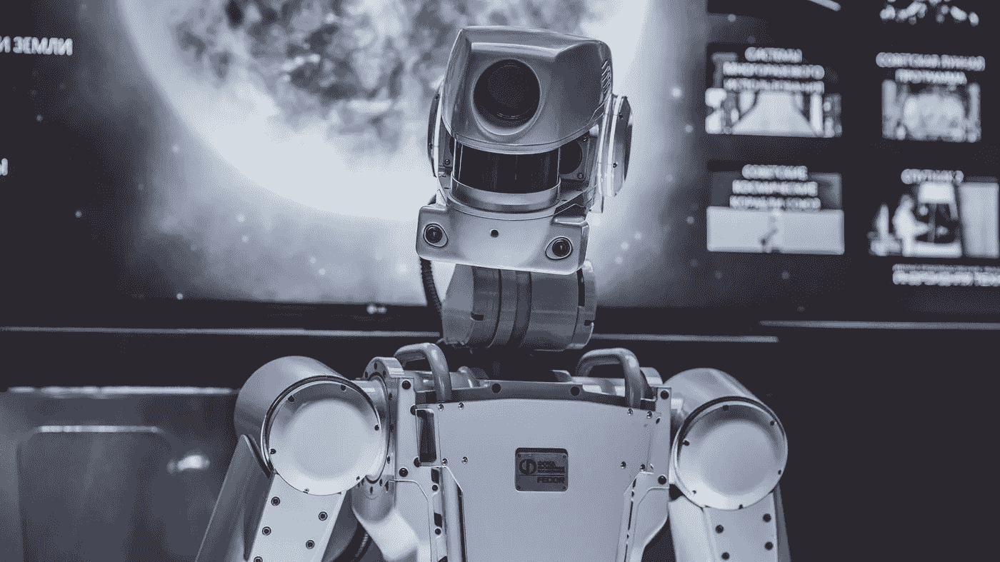
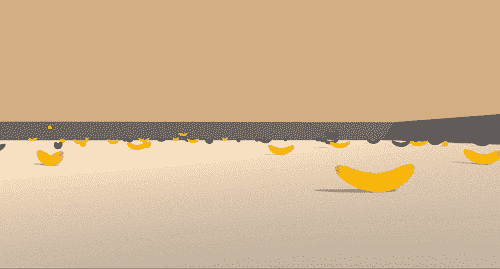
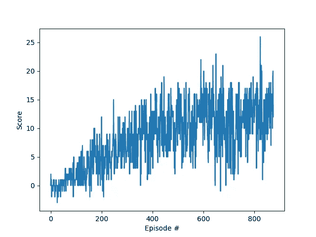

# 使用深度强化学习解决 Unity 环境

> 原文：[`towardsdatascience.com/solving-unity-environment-with-deep-reinforcement-learning-836dc181ee3b?source=collection_archive---------10-----------------------#2023-02-20`](https://towardsdatascience.com/solving-unity-environment-with-deep-reinforcement-learning-836dc181ee3b?source=collection_archive---------10-----------------------#2023-02-20)

## 深度强化学习代理的 PyTorch 实现的端到端项目

 [Gabriel Cassimiro](https://gabrielcassimiro17.medium.com/?source=post_page-----836dc181ee3b--------------------------------)

·

[查看](https://medium.com/m/signin?actionUrl=https%3A%2F%2Fmedium.com%2F_%2Fsubscribe%2Fuser%2F3692fb93d7e5&operation=register&redirect=https%3A%2F%2Ftowardsdatascience.com%2Fsolving-unity-environment-with-deep-reinforcement-learning-836dc181ee3b&user=Gabriel+Cassimiro&userId=3692fb93d7e5&source=post_page-3692fb93d7e5----836dc181ee3b---------------------post_header-----------) 发表在 [Towards Data Science](https://towardsdatascience.com/?source=post_page-----836dc181ee3b--------------------------------) ·6 min read·2023 年 2 月 20 日

--

图片由 [Arseny Togulev](https://unsplash.com/@tetrakiss?utm_source=unsplash&utm_medium=referral&utm_content=creditCopyText) 提供，来源于 [Unsplash](https://unsplash.com/pt-br/s/fotografias/robot?utm_source=unsplash&utm_medium=referral&utm_content=creditCopyText)

Unity 是一个流行的游戏开发引擎，允许开发者创建具有惊人图形和沉浸式游戏玩法的游戏。它被广泛用于开发各种平台上的游戏，包括移动设备、PC 和控制台。然而，创建智能且具有挑战性的游戏环境对游戏开发者来说是一项艰巨的任务。这就是深度强化学习（DRL）的作用所在。

DRL 是一种机器学习的子集，结合了深度学习和强化学习。它是一种强大的技术，已被用于解决各种领域中的复杂任务，包括机器人技术、金融和游戏。近年来，DRL 已成为构建智能游戏代理的流行方法，这些代理可以从经验中学习并适应新情况。

在这篇文章中，我们将探讨如何使用 DRL 解决 Unity 游戏环境中的问题。我们将通过在 Unity 环境中实现 DRL 来收集香蕉。我们还将探讨使用 DRL 进行游戏开发的一些挑战，以及如何克服这些挑战。

这是 Udacity 深度强化学习专业课程中的一个项目。完整项目和代码可以在这个[Github 仓库](https://github.com/gabrielcassimiro17/rl-dqn-collect-bananas)中找到。

## 目标

该项目的目标是使用深度 Q 学习训练一个代理。代理将被训练以收集黄色香蕉，同时避免 Unity 的香蕉收集器环境中的蓝色香蕉。

有关 Unix 环境的更多信息可以在[这里](https://github.com/Unity-Technologies/ml-agents/blob/main/docs/Learning-Environment-Examples.md#banana-collector)找到。代理使用深度 Q 学习算法进行了训练，并在 775 个回合中成功解决了环境。

## 环境与任务

该环境由一个方形世界组成，其中有黄色和蓝色香蕉。代理的目标是尽可能多地收集黄色香蕉，同时避免蓝色香蕉。代理有 4 个可能的动作：向前移动、向后移动、左转和右转。

状态空间具有 37 维，包括代理的速度以及基于射线的周围对象感知。收集一个黄色香蕉会获得 +1 奖励，收集一个蓝色香蕉会获得 -1 奖励。

任务是阶段性的，为了解决环境，代理必须在 100 个连续的回合中获得平均 +13 的分数。

环境如下所示：

作者提供的图片

## **代理**

为了解决环境所给出的问题，实现了一种深度 Q 学习算法。该算法基于 DeepMind 的论文[通过深度强化学习实现人类水平的控制](https://storage.googleapis.com/deepmind-media/dqn/DQNNaturePaper.pdf)。

该算法通过使用神经网络来近似 Q-函数。神经网络接收状态作为输入，并为每个动作输出 Q-值。然后它使用 Q-值来选择代理需要采取的最佳动作。该算法通过使用 Q-Learning 算法来训练神经网络。简单实现算法时还存在两个问题：相关经验和相关目标。该算法使用了两种技术来解决这些问题：经验回放和固定 Q-目标。

**相关经验**

相关经验是指代理的经验（或转移）彼此之间相关，即它们不是独立同分布的。这可能导致对特定状态或动作的期望奖励的高估，从而导致性能差或收敛到次优策略。

为了解决这个问题，使用了一种叫做 **经验回放** 的技术。该技术包括将代理的经验存储在回放缓冲区中，并从中随机抽样以训练神经网络。

**相关目标**

相关目标是指用于更新策略的目标值彼此之间不是独立的，导致学习信号的相关性。这可能会减慢或阻止收敛到最佳策略。

为了解决这个问题，使用了一种叫做 **固定 Q-目标** 的技术。该技术包括使用两个神经网络：本地网络和目标网络。本地网络用于选择代理需要采取的最佳动作，而目标网络用于计算 Q-Learning 算法的目标值。目标网络每 4 步更新一次，与本地网络的权重同步。

这是 Python 中的实现：

## **神经网络架构**

算法中使用的神经网络架构是一个简单的全连接神经网络，具有 2 层隐藏层。输入层有 37 个神经元，输出层有 4 个神经元，隐藏层每层有 64 个神经元。隐藏层使用的激活函数是 ReLU，输出层使用的激活函数是恒等函数。

此实现中使用的优化器是 Adam，学习率为 0.0005。

实现神经网络所使用的库是 PyTorch。

这是神经网络的实现：

## 训练任务

为了训练代理，我们使用了一个循环与环境交互，收集并从经验中学习。训练任务中使用的超参数之一是回合数。第一个超参数是手动调整的，目的是优化训练时间和代理的性能。最终实现中使用的回合数为 1200，但环境在 775 回合中被解决。

训练任务中使用的第二个超参数是每集的步数。这个超参数也通过手动调整来优化训练时间和智能体的性能。步数越多，智能体可以越多地探索环境，但训练时间也会大幅增加。最终实现中每集的步数是 1000。

其他一些使用的超参数：

+   回放缓冲区大小：1000

+   批量大小：32

+   更新频率：4

+   Gamma：0.99

+   Tau：1e-3

+   学习率：0.0005

通过这些措施，我们能够在 775 集内解决环境问题。下面的图表显示了智能体在获得更高奖励方面的进展。

作者提供的图片

在这里，我们可以看到随着智能体的改进，奖励增加。在图中也可以看到**探索与开发**之间的权衡，智能体在前 200 集时更多地进行探索，然后开始开发环境并获得更高的奖励。

完整的实现可以在这个[GitHub 仓库](https://github.com/gabrielcassimiro17/rl-dqn-collect-bananas)中找到。

尽管我们能够解决环境问题，但仍有一些改进可以应用，以加快解决速度。

## **未来改进**

算法可以通过以下技术进行改进：

+   对抗 DQN — [论文](https://arxiv.org/pdf/1511.06581.pdf)

+   优先经验回放 — [论文](https://arxiv.org/pdf/1511.05952.pdf)

另一个可能的改进是使用环境中的像素数据。这些改进可能会成为新文章的主题，我打算深入探讨核心概念并用 TensorFlow 实现神经网络。

感谢阅读！

这里有一些你可能感兴趣的其他文章：

[## 对象检测与 Tensorflow 模型和 OpenCV](https://towardsdatascience.com/object-detection-with-tensorflow-model-and-opencv-d839f3e42849?source=post_page-----836dc181ee3b--------------------------------)

### 使用训练好的模型识别静态图像和实时视频中的对象

[## 如何为 GCP 专业机器学习工程师考试做好准备](https://towardsdatascience.com/how-to-prepare-for-the-gcp-professional-machine-learning-engineer-exam-b1c59967355f?source=post_page-----836dc181ee3b--------------------------------) [## 对象检测与 Tensorflow 模型和 OpenCV](https://towardsdatascience.com/object-detection-with-tensorflow-model-and-opencv-d839f3e42849?source=post_page-----836dc181ee3b--------------------------------)

### 课程评审、学习技巧以及我的实践经历

[## 如何为 GCP 专业机器学习工程师考试做好准备](https://towardsdatascience.com/how-to-prepare-for-the-gcp-professional-machine-learning-engineer-exam-b1c59967355f?source=post_page-----836dc181ee3b--------------------------------)
