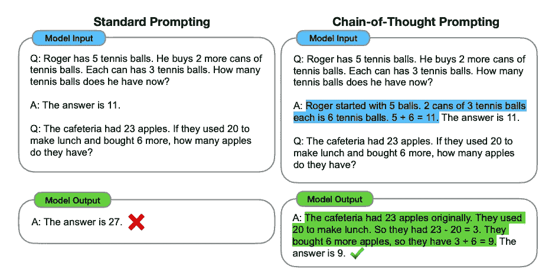
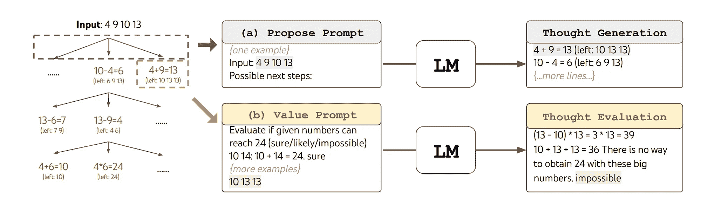
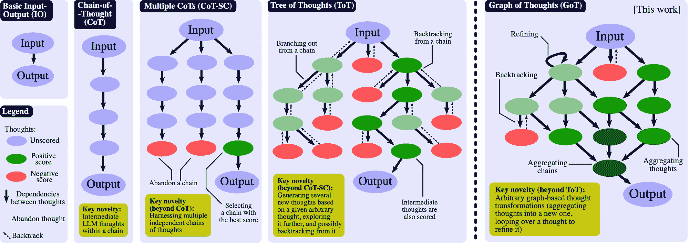
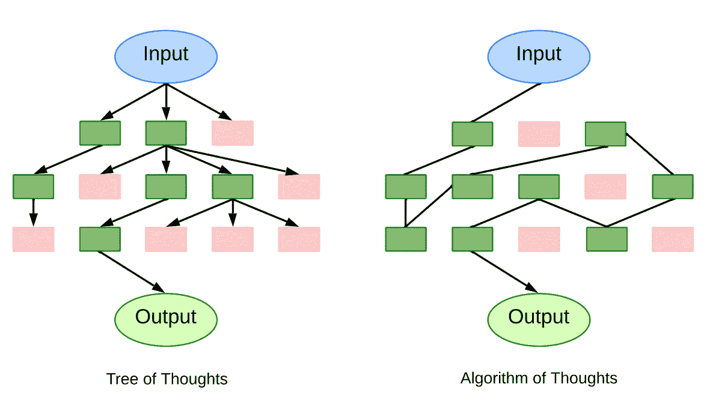
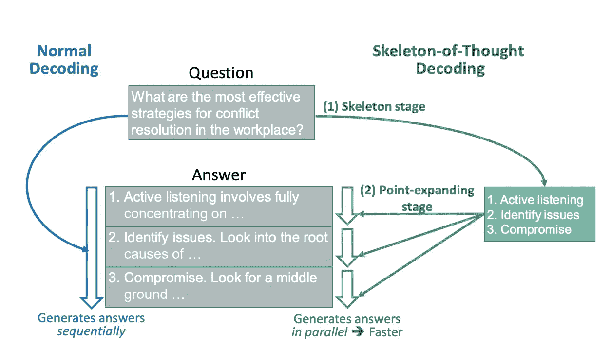
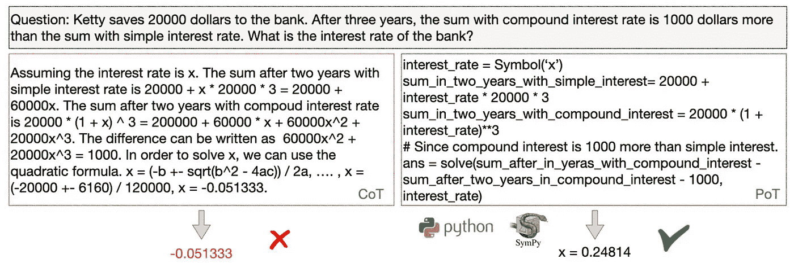

# LLM 提示中的思维链：结构化 LLM 推理概述

> 原文：[`towardsdatascience.com/something-of-thought-in-llm-prompting-an-overview-of-structured-llm-reasoning-70302752b390?source=collection_archive---------1-----------------------#2023-09-16`](https://towardsdatascience.com/something-of-thought-in-llm-prompting-an-overview-of-structured-llm-reasoning-70302752b390?source=collection_archive---------1-----------------------#2023-09-16)

## 思维链（CoT）、思维树（ToT）、思维图（GoT）以及其他相关概念，这些思维究竟是什么？

 [Yunzhe Wang](https://wangyz.medium.com/?source=post_page-----70302752b390--------------------------------)

·

[关注](https://medium.com/m/signin?actionUrl=https%3A%2F%2Fmedium.com%2F_%2Fsubscribe%2Fuser%2F31c691ae725d&operation=register&redirect=https%3A%2F%2Ftowardsdatascience.com%2Fsomething-of-thought-in-llm-prompting-an-overview-of-structured-llm-reasoning-70302752b390&user=Yunzhe+Wang&userId=31c691ae725d&source=post_page-31c691ae725d----70302752b390---------------------post_header-----------) 发表在 [Towards Data Science](https://towardsdatascience.com/?source=post_page-----70302752b390--------------------------------) ·9 分钟阅读·2023 年 9 月 16 日

--

“思维树”，由 Midjourney 生成

在智能手机和智能家居的时代，想象一个不仅仅按照指令执行的 AI，而是像我们一样进行复杂逻辑思考。这听起来像是科幻小说，对吗？然而，如果你玩过 ChatGPT，你可能已经亲眼目睹了这种惊人的能力。即使是著名的 AI 推理专家 Hector Levesque 也曾对此感到惊讶，并曾对 AI 传奇人物 Geoffrey Hinton 评论道：[*“这种愚蠢的方法（指神经网络）怎么能进行推理？”*](https://www.youtube.com/watch?v=rGgGOccMEiY&t=1598s)

虽然这个故事突出了人工智能的巨大进步，但这些进步的真正精髓在于大型语言模型（LLMs）与推理的复杂互动。进入这种互动的入口是提示工程——优化提供给 LLM 的文本输入以引出期望输出的艺术与科学。从本质上讲，它涉及理解像 ChatGPT、Bard、Claude、LLama 等语言模型如何响应不同提示的复杂性，然后利用这些知识来实现特定结果。

把大型语言模型（LLMs）看作是庞大的知识库。你提问或陈述的方式（提示）决定了如何挖掘这个知识库。就像人类根据问题的表述可能会给出不同的答案一样，LLMs 也可能根据输入给出不同的回应。

在这篇文章中，你将获得关于各种提示工程框架的简要概述，这些框架旨在提升 LLM 推理能力，包括：

+   Chain-of-Thought

+   Chain-of-Thought-Self-Consistency

+   Tree-of-Thoughts

+   Graph-of-Thoughts

+   Algorithm-of-Thoughts

+   Skeleton-of-Thought

+   Program-of-Thoughts

# Chain-of-Thought (CoT)

> 不是直接给出答案，而是为语言模型提供中间推理示例，以引导其回答。

[Chain-of-Thought (CoT)](https://arxiv.org/abs/2201.11903) 提示已被认可为开创性和最具影响力的提示工程技术之一，增强了大型语言模型的决策过程。不同于强调直接输入输出交互的传统提示方法，CoT 强制模型将其推理分解为中间步骤。这种方法与人类认知过程类似，其中复杂的挑战被分解为更小、更易管理的组成部分。

举个例子，考虑一个数学问题：“Roger 拥有 5 个网球，然后购买了 2 罐网球，每罐包含 3 个球。他现在拥有多少个网球？”。与其直接推导出答案是 11，一个人可能会推理：“最初，Roger 有 5 个球。2 罐球的总数，每罐包含 3 个球，总计 6 个球。将这些值相加，5 + 6，得到 11。”将这种逐步分析推理整合到输入提示中，不仅提高了模型响应的准确性，还可以在不需要额外训练数据集或改变基本模型配置的情况下完成。

思维链提示，来源: [Wei et al. (2022)](https://arxiv.org/abs/2201.11903)

## 思维链自一致性 (CoT-SC)

> 构建多个思维链，评估每一个链，最终选择最有效且连贯的链。

从思维链框架发展而来的一个进步是 [CoT 自一致性](https://arxiv.org/abs/2203.11171)。该方法在响应查询时发起多个并行的推理路径，并在最终确定答案之前应用加权机制。这种方法类似于传统机器学习中观察到的集成技术，但它被应用于大语言模型中的思维序列。

# 思维树 (ToT)

> 扩展思维链以树形结构呈现。这允许回溯，探索从一个根思想衍生出的多个推理分支。

[思维树 (ToT)](https://arxiv.org/abs/2305.10601) 提供了一个更结构化的 LLM 推理框架，通过将复杂问题分解为更可管理的部分来进行思考。与通过链条链接进行推理的 CoT 不同，ToT 将其问题解决策略组织为树形结构。每个节点，被称为“思维”，是一个连贯的语言序列，作为通向最终答案的步骤。通过将问题分解为这些离散的“思维”单元——从填字游戏中的简短词组到数学方程的一个组件——ToT 确保问题的每个阶段都得到系统性地解决。

ToT 在 24 点游戏中的推理，来源: [Yao et al. (2023)](https://arxiv.org/abs/2305.10601)

ToT 的操作优势在于其系统化的组织。首先，系统将问题分解，并从当前状态生成一系列潜在的推理步骤或“思维”候选。然后对这些思维进行评估，系统会评估每个思维引导到期望解决方案的可能性。标准搜索算法，如宽度优先搜索（BFS）和深度优先搜索（DFS），用于遍历这棵树，帮助模型识别最有效的思维序列。

ToT 的重要性源于其整体设计、适应性和效率。链式思维提示可以被视为 ToT 框架中的一个具体实例。其模块化特性表明，从问题的初步分解到所使用的搜索算法，单独的组件可以独立运行。

# 思维图谱（GoT）

> 将树结构演变为有向无环图。这引入了自环，可以巩固特定的思路或将多个思路汇聚成一个连贯的想法。

[思维图谱 (GoT)](https://arxiv.org/abs/2308.09687) 框架代表了从 CoT 和 ToT 方法的先进进展。GoT 框架的核心是将想法概念化为有向无环图（DAG）中的顶点。在这种情况下，每个顶点对应于一个特定的思路或解决方案——无论是初步的、中间的还是最终的——由输入刺激引发。图中的有向边描绘了这些思路之间的相互依赖性。具体来说，如果一条边从思路 t1 延伸到 t2，则表示 t2 是基于 t1 形成的。这种系统化允许多种思路，因为节点可以被分类为“计划”或“结果”等不同类别。

思维图谱，来源：[Besta 等 (2023)](https://arxiv.org/abs/2308.09687)

GoT 的新颖性在于其对这些思路应用变换，从而进一步精炼推理过程。主要的变换包括聚合，允许将几个思路融合为一个统一的想法；精炼，通过对单一思路进行不断迭代以提高其准确性；以及生成，促进从现有思路中产生新想法。这些变换，强调推理路径的融合，相较于以前的模型如 CoT 或 ToT，提供了更复杂的观点。

此外，GoT 通过评分和排名引入了评估维度。每个个体思路，由一个顶点表示，都根据其相关性和质量进行评估，由指定的评分函数辅助。重要的是，这个函数考虑了整个推理链，分配的分数可能会与图中的其他顶点相关联。该框架还为系统提供了根据各自分数对这些思路进行分层的能力，这一特性在判断哪些想法值得优先考虑或实施时非常有用。

# 思维算法（AoT）

> 保持一个不断发展的上下文链，消除了像思维树那样的冗余查询。它探索了一条可变的推理路径。

尽管 ToT 和 GoT 通过基于搜索的机制解决 LLM 推理挑战，产生大量图形形式的推理路径。然而，它们对众多 LLM 查询的高度依赖，有时对于单个问题需要数百次查询，导致计算效率低下。

[思维算法（AoT）](https://arxiv.org/abs/2308.10379)提供了一种创新的方法，具有动态和可变的推理路径。通过维持单一的不断演变的思想上下文链，AoT 整合了思想探索，提高了效率，减少了计算开销。

思维算法。每个框表示一个独特的思想。绿色代表有前景的思想，红色代表较少有前景的思想。注意：ToT 有多个查询，而 AoT 保持单一上下文，来源：[Sel 等（2023）](https://arxiv.org/abs/2308.10379)

AoT 的独创性来自于观察到 LLM 尽管强大，但在面对新而熟悉的问题时，有时会回到之前的解决方案。为了克服这一点，AoT 吸收了上下文示例，借鉴了深度优先搜索（DFS）和广度优先搜索（BFS）等经过时间考验的搜索算法。通过模拟算法行为，AoT 强调了实现成功结果和从失败尝试中汲取见解的重要性。

AoT 的基石在于其四个主要组成部分：1) 将复杂问题分解为易于处理的子问题，考虑它们之间的相互关系以及单独处理的难易程度；2) 对这些子问题提出连贯的解决方案，保持连续和不间断的方式；3) 直观地评估每个解决方案或子问题的可行性，无需依赖明确的外部提示；4) 根据上下文示例和算法指南，确定最有前景的探索路径或回溯路径。

# 思维骨架（SoT）

> 首先生成答案蓝图，然后平行展开细节，从而减少生成完整响应的时间。

[思维骨架（SoT）](https://arxiv.org/abs/2307.15337)范式独特地设计，并非主要为了增强大型语言模型（LLM）的推理能力，而是解决最关键的挑战——最小化端到端生成延迟。该方法基于双阶段方法，首先生成初步答案蓝图，然后进行全面扩展。

思维骨架，来源：[宁等（2023）](https://arxiv.org/abs/2307.15337)

在初始的“骨架阶段”，模型不是生成一个全面的响应，而是生成一个简洁的答案骨架。这个通过精心设计的骨架模板生成的简略表示，捕捉了潜在答案的核心要素，从而为后续阶段奠定基础。

在随后的“扩展点阶段”，LLM 系统地扩展答案骨架中每个组件。利用扩展点提示模板，模型同时对骨架的每个部分进行详细说明。这种将生成过程分为初步骨架制定和并行详细扩展的二分法方法，不仅加速了响应生成，还努力保持输出的连贯性和精确性。

# 思维程序（PoT）

> 将问题回答的推理形成一个可执行程序，将程序解释器的输出作为最终答案的一部分。

[思维程序（PoT）](https://arxiv.org/abs/2211.12588)是一种独特的 LLM 推理方法，它不仅仅是生成自然语言的答案，PoT 要求创建一个可执行程序，这意味着它可以在程序解释器（如 Python）上运行，从而产生实际结果。这种方法与更直接的模型形成对比，强调其将推理分解为顺序步骤并将语义与变量关联的能力。因此，PoT 提供了一个更清晰、更具表现力且有实据的答案生成模型，提高了准确性和理解，特别适用于需要数字计算的数学类型逻辑问题。

需要注意的是，PoT 的程序执行不一定以最终答案为目标，而可能是最终答案的一个中间步骤。

CoT 与 PoT 的比较，来源：[Chen et al. (2022)](https://arxiv.org/abs/2211.12588)

在不断发展的 AI 领域中，结构化推理框架如链式思维（Chain-of-Thought）极大地改变了我们对大型语言模型（LLM）能力的认知和利用方式。它们象征着一种转变，向着不仅仅是信息重复的模型迈进，同时也进行复杂的推理，这与人类认知过程非常相似。展望未来，潜在的前景似乎无穷无尽。设想一个 AI，能够生成不仅准确的答案，还能提供强大、可编程的解决方案，或具备可视化其思维过程的能力，使 AI 与人类的合作更加无缝。这些进步建立在本文探索的基础框架上，预示着一个 LLM 成为问题解决、创造力和决策不可或缺的伴侣的未来，推动我们与技术的共生关系发生范式转变。
