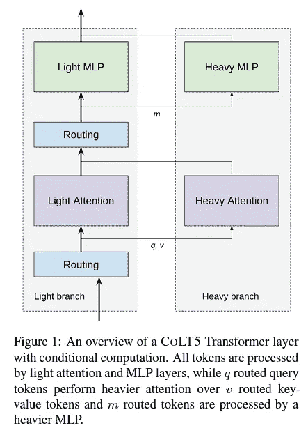
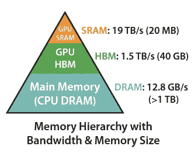

# 对我说话：一个模型阅读了多少个词

> 原文：[`towardsdatascience.com/speak-to-me-how-many-words-a-model-is-reading-331e3af86d27`](https://towardsdatascience.com/speak-to-me-how-many-words-a-model-is-reading-331e3af86d27)

## | 人工智能 | LLM | 自然语言处理 |
## | --- | --- | --- |

## 为什么以及如何克服大型语言模型的内在限制

 [Salvatore Raieli](https://salvatore-raieli.medium.com/?source=post_page-----331e3af86d27--------------------------------)

·发表于 [Towards Data Science](https://towardsdatascience.com/?source=post_page-----331e3af86d27--------------------------------) ·阅读时间 20 分钟·2023 年 7 月 14 日

--

图片由 [C D-X](https://unsplash.com/@cdx2?utm_source=medium&utm_medium=referral) 提供，来源于 [Unsplash](https://unsplash.com/?utm_source=medium&utm_medium=referral)

[大语言模型](https://en.wikipedia.org/wiki/Large_language_model)（LLMs）在最近几个月展示了它们的技能，证明它们在各种任务中都很熟练。所有这些都通过一种交互模式：提示。

最近几个月，扩展语言模型的上下文成为了一种潮流。**但这对语言模型有何影响？**

本文分为不同的部分，每一部分我们将回答这些问题：

+   什么是提示，如何构建一个好的提示？

+   什么是上下文窗口？它能有多长？是什么限制了模型输入序列的长度？为什么这很重要？

+   我们如何克服这些限制？

+   模型是否使用了长上下文窗口？

# 如何与模型对话？

图片由 [Jamie Templeton](https://unsplash.com/@jamietempleton?utm_source=medium&utm_medium=referral) 提供，来源于 [Unsplash](https://unsplash.com/?utm_source=medium&utm_medium=referral)

## 什么是提示？什么是好的提示？

简而言之，提示就是与[大型语言模型](https://en.wikipedia.org/wiki/Large_language_model)（LLM）交互的方式。给定一个[LLM](https://en.wikipedia.org/wiki/Large_language_model)，我们可以通过提供文本形式的指令来进行交互。这种文本提示包含了模型处理响应所需的信息。提示可以包含问题、任务描述、内容及其他许多信息。基本上，通过提示我们向模型提供了我们的意图以及我们期望它回应的内容。

提示可以显著改变模型的行为。例如，要求模型“描述法国的历史”与要求它“用三句话描述法国的历史”或“用说唱形式描述法国的历史”是不同的。

为了从模型中获取足够的信息，建议编写一个好的提示。通常，一个好的提示应该包含一个问题或一组指令。此外，还可以有上下文（问题 + 上下文）。例如，我们可以要求模型在一篇文章（上下文）中告诉我们主要人物是什么（问题）。

一般来说，编写提示时需要考虑一些元素：

+   **简洁性**，由于这是一个迭代过程，最好从简单的问题开始，然后逐渐要求更多信息。此外，如果将模板减少为子任务的形式，模板效果最佳：简单任务而不是复杂任务。

+   **关于任务的指令。** 使用能够明确指令的动词有助于模型更好地理解当前任务。此外，一些动词对于某些任务效果更佳，建议在提示的开头提供指令。

+   **具体性。** 在提示中具体而注重细节有助于任务的执行。此外，可以提供示例来更好地解释所需内容（少量示例提示）。然而，由于提示的长度不是无限的，因此应避免提供过多的示例或过多的细节（在许多 LLM 中，提示在超过某一长度后会被截断）。

此外，还有其他技术可以用来改进提示，例如 [chain-of-thought](https://en.wikipedia.org/wiki/Prompt_engineering)（强制模型回溯中间步骤）、自我反思（允许模型评估其响应）、[思维树](https://github.com/kyegomez/tree-of-thoughts) 等等。

 [## 人工智能大学生回到实验台

### LLM 如何解决大学考试以及为什么这很重要

[levelup.gitconnected.com](https://levelup.gitconnected.com/the-ai-college-student-goes-back-to-the-bench-daa6d9bdfb14?source=post_page-----331e3af86d27--------------------------------)

一般来说，尽管其中一些技术很简单，但它们并不总是能产生良好的结果。还有更复杂的技术，[提示工程](https://en.wikipedia.org/wiki/Prompt_engineering)仍然是一个开放的领域。这些技术的原则是让模型对问题进行推理或充分利用其在训练中学到的内容。

**无论如何，所有这些技术都必须面临一个问题：提示中可以插入的** [**tokens**](https://en.wikipedia.org/wiki/Lexical_analysis#Token) **（子词）的最大数量。**

> 提示可以有多长，为什么？

# 提示的长度可以有多长：上下文的长度

[patricia serna](https://unsplash.com/ja/@sernarial?utm_source=medium&utm_medium=referral) 在 [Unsplash](https://unsplash.com/?utm_source=medium&utm_medium=referral) 的照片

提示可以迅速增长，尤其是当上下文包含大量信息（使用上下文中的文章、过去的对话、添加外部信息等）。这意味着模型必须处理长序列作为输入。

基本上，[LLM](https://en.wikipedia.org/wiki/Large_language_model) 是一种 [变换器](https://en.wikipedia.org/wiki/Transformer_(machine_learning_model))，而变换器在序列长度上扩展不良。这是因为 [变换器](https://en.wikipedia.org/wiki/Transformer_(machine_learning_model)) 建立在重复的 [自注意力](https://en.wikipedia.org/wiki/Attention_(machine_learning)) 模块上，这些模块在长度方面具有 [二次成本](https://en.wikipedia.org/wiki/Computational_complexity)。

当然，以前已经有很多工作尝试通过各种策略减少这个成本。然而，线性替代的自注意力被发现表现不佳。

 [## 欢迎回到 80 年代：变换器可能会被卷积所取代

### Hyena 模型展示了卷积如何比自注意力更快

levelup.gitconnected.com](https://levelup.gitconnected.com/welcome-back-80s-transformers-could-be-blown-away-by-convolution-21ff15f6d1cc?source=post_page-----331e3af86d27--------------------------------)

> 自回归变换器在短序列上表现出色，但在处理长序列如高分辨率图像、播客、代码或书籍时表现不佳。 ([source](https://arxiv.org/abs/2305.07185))

通常，[上下文窗口](https://datascience.stackexchange.com/questions/16424/what-is-context-window-size) 相对较小（512–1024 [tokens](https://en.wikipedia.org/wiki/Lexical_analysis#Token)）。然而，近年来我们已经看到有些模型甚至有成千上万个令牌用于 [上下文窗口](https://www.linkedin.com/pulse/whats-context-window-anyway-caitie-doogan-phd/)。

例如，[GPT-4](https://arxiv.org/abs/2303.08774) 的上下文长度为 32k。除了这个数字令人印象深刻之外，这不仅仅是一个营销问题。实际上，上下文长度越长，模型能够关联的信息就越多。此外，更长的 [上下文长度](https://www.linkedin.com/pulse/whats-context-window-anyway-caitie-doogan-phd/) 可以提高准确性、流畅性，并被认为能激发模型的创造力。

从理论上讲，一个使用[上下文长度](https://www.linkedin.com/pulse/whats-context-window-anyway-caitie-doogan-phd/)为 1k tokens 训练的[变换器](https://en.wikipedia.org/wiki/Transformer_(machine_learning_model))确实可以在推断时生成 100k 的序列。但由于它是在不同的[训练数据分布](https://stats.stackexchange.com/questions/173968/difference-between-training-and-test-data-distribution)下训练的（远少于 100k 的序列），因此生成的结果将毫无意义。

事实上，已经证明，在[ChatGPT](https://medium.com/data-driven-fiction/everything-but-everything-you-need-to-know-about-chatgpt-546af7153ee2)中请求对超过 1000 个单词的文本进行拼写检查会导致模型[幻觉](https://en.wikipedia.org/wiki/Hallucination_(artificial_intelligence))。

[自注意力](https://en.wikipedia.org/wiki/Attention_(machine_learning))的二次成本意味着增加上下文长度等于训练成本的相应增加。[LLaMA 的成本估计为 300 万美元](https://matt-rickard.com/commoditization-of-large-language-models-part-3)（仅为 GPU 训练），将上下文长度增加 50 倍（从 2K 到 100K）也意味着成本增加 50 倍。

图片来源: [这里](https://arxiv.org/abs/2307.02486)

> 自注意力是否是扩展上下文长度的唯一限制？

不是的。经过[tokenization](https://huggingface.co/learn/nlp-course/chapter6/8?fw=pt)后，模型接受 tokens 序列，第一步是[嵌入](https://en.wikipedia.org/wiki/Embedding)。对于一个长度为 n 的 tokens 序列，我们有一个大小为 d 的[嵌入](https://en.wikipedia.org/wiki/Embedding)。显然，如果 n >> d，会有信息丢失的风险，而将 n 增加得远超过 d 则会带来显著的挑战。

此外，正弦[位置编码器](https://machinelearningmastery.com/a-gentle-introduction-to-positional-encoding-in-transformer-models-part-1/)与某些扩展[上下文长度](https://www.linkedin.com/pulse/whats-context-window-anyway-caitie-doogan-phd/)的解决方案不兼容，需要重新考虑。

此外，训练是[并行化](https://pytorch.org/tutorials/advanced/ddp_pipeline.html)的，但推断时计算是顺序进行的。事实上，一个 token 依赖于序列中生成的 tokens。因此，推断也必须优化以扩展[上下文长度](https://www.linkedin.com/pulse/whats-context-window-anyway-caitie-doogan-phd/)。

> 如何实现数万甚至数十万 tokens 的上下文窗口？

# 扩展 LLM 的上下文窗口

照片由[Nagara Oyodo](https://unsplash.com/@nagaranbasaran?utm_source=medium&utm_medium=referral)拍摄，来源于[Unsplash](https://unsplash.com/?utm_source=medium&utm_medium=referral)

## 让你的上下文更大

尽管过去几个月的结果令人印象深刻，但早在 2019 年就已经有尝试增加[上下文窗口](https://www.linkedin.com/pulse/whats-context-window-anyway-caitie-doogan-phd/)的长度。事实上，[Transformer-XL](https://arxiv.org/abs/1901.02860)能够生成连贯的文本，长度可达数千个标记。

作者利用了[递归神经网络](https://en.wikipedia.org/wiki/Recurrent_neural_network)的理念，其中隐藏状态被重复使用，以便将更多信息提供给[变换器](https://en.wikipedia.org/wiki/Transformer_(machine_learning_model))。换句话说，在处理一个序列段后，在处理下一个段时，会重复使用之前获得的隐藏状态。从模型描述来看，与[RNNs](https://en.wikipedia.org/wiki/Recurrent_neural_network)的相似性是显而易见的。

图片来源：[这里](https://arxiv.org/abs/1901.02860)

## 短期训练，长期推断

尽管 TransformerXL 是一个有趣的解决方案，但最近几个月也在测试其他策略。这些策略旨在解决原始[变换器](https://en.wikipedia.org/wiki/Transformer_(machine_learning_model))固有的局限性，并利用了今天的硬件进步。

减少训练成本的一个想法是用[上下文长度](https://www.linkedin.com/pulse/whats-context-window-anyway-caitie-doogan-phd/)为 2K 的模型进行训练，然后在更长的序列（例如，65K）上进行[微调](https://en.wikipedia.org/wiki/Fine-tuning_(deep_learning))。理论上，这也可以奏效（模型在第一次训练中学习语言的一般表示，然后在后续任务中专门化处理更长的序列）。

实际上，使用原始变换器的这一策略注定会失败，[2021 年的一篇论文](https://arxiv.org/abs/2108.12409)中已对此进行了说明。正如作者所解释的那样，推断中更长的[上下文长度](https://www.linkedin.com/pulse/whats-context-window-anyway-caitie-doogan-phd/)的能力称为“外推”。

> 我们将外推定义为模型在验证过程中，输入标记数量超过模型训练时标记数量的情况下，继续表现良好的能力。我们发现使用正弦位置嵌入的变换器语言模型（LMs）具有非常弱的外推能力。（[来源](https://arxiv.org/abs/2108.12409)）

图片来源：[这里](https://arxiv.org/abs/2108.12409)

对于作者来说，位置编码是缺乏原始变换器外推能力的罪魁祸首。[位置编码](https://kazemnejad.com/blog/transformer_architecture_positional_encoding/)，作为模型开始时的一步，被包含在内，作为一个巧妙的技巧，使模型能够考虑序列中每个标记的位置。

作者建议用带有线性偏置（ALiBI）的注意力替代它。简单来说，就是在[注意力](https://en.wikipedia.org/wiki/Attention_(machine_learning))的查询和键的乘积中添加一个惩罚，这个惩罚与它们的距离成正比：

图片来源：[这里](https://arxiv.org/abs/2108.12409)

“在计算每个头的注意力得分时，我们的线性偏置注意力方法 ALiBi 会对每个注意力得分（qi · kj，左）添加一个常数偏置（右）。与未修改的注意力子层一样，然后将 softmax 函数应用于这些得分，其余计算保持不变。m 是一个特定于头的标量，在训练过程中设置且不进行学习。” 图片来源：[这里](https://arxiv.org/abs/2108.12409)

这个技巧很巧妙，因为它不会增加学习的参数，也不会显著增加[计算成本](https://en.wikipedia.org/wiki/Computational_complexity)。

## 你需要所有这些标记吗？

扩展[上下文窗口](https://www.linkedin.com/pulse/whats-context-window-anyway-caitie-doogan-phd/)到超过 100k 个标记无疑非常有吸引力。另一方面，并非序列中的所有标记实际上都很有趣。**那么，我们是否有必要计算这些标记之间的关系（注意力得分）呢？**

因此，这个想法是利用稀疏性来计算[注意力得分](https://en.wikipedia.org/wiki/Attention_(machine_learning))，这样我们就不会计算那些我们不感兴趣的标记之间的关系。[正如谷歌所解释的](https://ai.googleblog.com/2021/03/constructing-transformers-for-longer.html)，尽管如此，这并不是完全简单的：

> 两个自然的问题出现了：1) 我们是否可以使用计算和内存需求与输入序列长度线性相关的稀疏模型来实现二次全变换器的经验性收益？2) 是否可以理论上证明这些线性变换器保留了二次全变换器的表达能力和灵活性？([source](https://ai.googleblog.com/2021/03/constructing-transformers-for-longer.html))

谷歌尝试通过一个有趣的观察来回答这些问题，即注意力层可以被理解为一个[图](https://en.wikipedia.org/wiki/Graph)。事实上，当计算序列中所有位置（节点）的[注意力](https://en.wikipedia.org/wiki/Attention_(machine_learning))时，我们计算的是成对的相似度（边）。因此，从视觉上看，我们可以将注意力视为一个[有向图](https://en.wikipedia.org/wiki/Directed_graph)。

注意力作为一个完全图，图像由作者提供。

基于这一概念，可以看到，相对于经典的[注意力](https://en.wikipedia.org/wiki/Attention_(machine_learning))，可以考虑使用图形，这些图形不是[完全连接](https://en.wikipedia.org/wiki/Complete_graph)的。

谷歌通过首先利用[全球](https://machinelearningmastery.com/global-attention-for-encoder-decoder-recurrent-neural-networks/)和局部（或[窗口](https://paperswithcode.com/method/sliding-window-attention)）注意力的组合来利用这一概念，[在这篇论文](https://arxiv.org/abs/2004.08483)中进行，然后通过[BigBird](https://arxiv.org/abs/2007.14062)对这一想法进行了改进。

图片来源：[这里](https://arxiv.org/abs/2007.14062)

BigBird 基本上结合了三个概念：全球标记以覆盖整个序列，局部注意力以覆盖每个标记的周围区域，并且每个标记都有随机抽样的标记。

BigBird 成功地近似了[注意力](https://en.wikipedia.org/wiki/Transformer_(machine_learning_model))。同时，它是稀疏的（因此计算[复杂度](https://mathoverflow.net/questions/400840/what-is-the-computational-cost-in-a-neural-network)较低），但不会中断信息流（一个标记影响其他标记的能力）。

作者们证明了这种稀疏注意力不仅与[原始注意力](https://en.wikipedia.org/wiki/Attention_(machine_learning))具有同样的表现力，而且可以用于从本质上较长的序列中提取上下文信息，例如[基因组序列](https://www.institute.global/insights/public-services/what-genomic-sequencing-and-why-does-it-matter-future-health)。

在任何情况下，[稀疏性概念](https://blogs.nvidia.com/blog/2020/05/14/sparsity-ai-inference/)都非常强大，许多研究人员正在尝试将其应用于其他模型，例如视觉变换器。

 ## META 的 Hiera：减少复杂性以提高准确性

### 简单性使得人工智能能够达到惊人的性能和惊人的速度

towardsdatascience.com

## 快速变换器的条件计算

基于并非所有令牌都重要的想法，还有另一种方法可以在训练过程中不将所有模型权重应用于所有令牌。

[CoLT5](https://arxiv.org/abs/2303.09752)利用这一概念来增加输入长度。简单来说，条件计算确保将更多资源分配给那些被认为重要的令牌。

作者构建了一个系统，其中注意力和[前馈网络](https://en.wikipedia.org/wiki/Feedforward_neural_network)计算被分成两个分支（重型和轻型）。轻型层应用于所有令牌，而重型 MLP 仅应用于重要令牌。这些令牌由一个路由模块选择，决定哪些令牌是重要的。

图片来源: [这里](https://arxiv.org/abs/2303.09752)

## 多查询注意力以节省计算

在[推理](https://cloud.google.com/bigquery/docs/inference-overview)过程中，每个令牌的键和值都会被缓存（以避免在生成文本时重复相同的操作）。这在节省计算的同时增加了[GPU](https://en.wikipedia.org/wiki/Graphics_processing_unit)的内存使用。

为了避免这种情况，[多查询注意力](https://arxiv.org/abs/1911.02150)（MQA）建议在键和值的线性投影步骤中对所有注意力头共享权重。

这在处理长序列时尤其有优势，减少了不仅仅是内存使用，还减少了生成时间。谷歌已展示了 MQA 的优势，[在使用 PaLM 时](https://arxiv.org/abs/2211.05102)。

图片来源: [这里](https://arxiv.org/abs/2211.05102)

## 闪光注意力，新一代 LLM 的亮点

之前看到的模型和思想旨在以减少其成本的方式修改注意力。[闪光注意力](https://arxiv.org/abs/2205.14135)使用了不同的方法，今天几乎所有模型都在使用它。

从基础上讲，[GPU](https://en.wikipedia.org/wiki/Graphics_processing_unit)的利用更为高效。实际上，[GPU](https://en.wikipedia.org/wiki/Graphics_processing_unit)有自己独特的内存层次结构。当[GPU](https://en.wikipedia.org/wiki/Graphics_processing_unit)执行操作时，数据必须存在于快速内存（SRAM 内存）中。数据从 HBM 内存复制到这块内存中，一旦计算完成，输出结果会被复制回 HBM。

如你所见，SRAM 内存不仅速度更快，而且体积更小。随着时间的推移，计算变得越来越快，而 HBM 已经成为瓶颈。

图片来源: [这里](https://arxiv.org/abs/2205.14135)

这是因为在[注意力](https://en.wikipedia.org/wiki/Attention_(machine_learning))过程中，进行了一些操作（查询和键的乘法，[softmax](https://en.wikipedia.org/wiki/Softmax_function)，将这个结果与值进行乘法）。这些操作生成的中间数据被复制到 HBM 和 SRAM（来回传输）。这种数据复制操作是导致操作变慢的原因。

SRAM 有内存限制，因此[闪存注意力](https://arxiv.org/abs/2205.14135)解决方案是将各种数组（查询、键、值）划分为块。因此，所有操作都在一个 GPU 内核中完成，然后将结果写入 HBM。此外，softmax 也随时间减少，因为它仅在块上计算，而不是整个 NxN 矩阵上。

图像来源：[这里](https://arxiv.org/abs/2205.14135)

不仅[META 的 LLaMA](https://arxiv.org/abs/2302.13971)使用 FlashAttention，今天[virtually 所有模型](https://github.com/HazyResearch/flash-attention/blob/main/usage.md)都在使用它。

 [## META 的 LLaMA：一个小型语言模型击败巨头

### META 开源模型将帮助我们理解语言模型偏见的产生

medium.com](https://medium.com/mlearning-ai/metas-llama-a-small-language-model-beating-giants-5065948e0b7f?source=post_page-----331e3af86d27--------------------------------)

## 最新发展

最近在[GPU](https://en.wikipedia.org/wiki/Graphics_processing_unit)方面的进展也使得令牌和它们的上下文增加成为可能。例如，现在有 80 GB 的 GPU。

此外，除了我们上面看到的技术改进，还有对[变换器](https://en.wikipedia.org/wiki/Transformer_(machine_learning_model))为何不具备外推能力的更好理解。例如，[在这篇论文中](https://arxiv.org/abs/2306.00946)，他们展示了经典注意力如何漂移到序列的后面位置（这一行为作者输入到正弦[位置编码](https://d2l.ai/chapter_attention-mechanisms-and-transformers/self-attention-and-positional-encoding.html)中）。因此，我们看到位置编码如何在 ALiBI 中被替代（其他人提出可以用随机版本、随机位置编码来替代）。

[其他作者指出](https://arxiv.org/abs/2208.11445)，如[链式思维](https://arxiv.org/abs/2201.11903)等技术有助于模型进行推断，因为模型必须专注于推理的中间步骤。此外，[少量示例可以比微调更好地提高模型的推断能力](https://arxiv.org/abs/2207.04901)（无论如何，这不是灵丹妙药）。实际上，[使用一些技巧进行微调可以带来非常好的结果](https://arxiv.org/abs/2305.16300)，例如 LLaMA 7B 在这项研究中引入了窗口注意机制，将上下文窗口从 2K 扩展到 32K。

然而，如果以前[Claude](https://www.anthropic.com/index/introducing-claude)的 100K 上下文长度看起来令人难以置信。[META 的 Megabyte 声称支持 1M tokens](https://arxiv.org/abs/2305.07185)（其技巧是，“Megabyte 将序列分割成补丁，并在补丁内使用局部子模型，在补丁之间使用全局模型”）。

图片来源：[这里](https://arxiv.org/abs/2305.07185)

一篇最近发表的论文甚至声称可以处理 1G 的 token。这些都表明，仍有大量的活跃研究，以及许多团队正在寻找扩展上下文长度的方法。

> 考虑到所有这些研究和替代方案，一个问题浮现：模型如何使用这些长上下文？它能否充分利用这些上下文？

# 在中间迷失：语言模型如何利用长上下文

图片由[Ethan Sykes](https://unsplash.com/@e_sykes?utm_source=medium&utm_medium=referral)提供，来自[Unsplash](https://unsplash.com/?utm_source=medium&utm_medium=referral)

最新的[大型语言模型（LLM）](https://en.wikipedia.org/wiki/Large_language_model)的进展使得[上下文窗口](https://www.linkedin.com/pulse/whats-context-window-anyway-caitie-doogan-phd/)得以扩展，这引发了一个问题：模型是否真的从中受益？[本月发表的一篇文章探讨了这一问题](https://arxiv.org/abs/2307.03172)。

[这项研究的作者](https://arxiv.org/abs/2307.03172)能够利用这样一个事实，即不仅像[Claude](https://www.anthropic.com/index/introducing-claude)或[GPT-4](https://openai.com/gpt-4)这样的专有模型具有长上下文窗口。实际上，[MPT-30B](https://huggingface.co/mosaicml/mpt-30b)和[LongChat-7B](https://huggingface.co/lmsys/longchat-13b-16k)的上下文窗口分别为 8K 和 16K tokens。因此，作者决定使用这两种模型以及一些封闭模型（[GPT-3.5](https://en.wikipedia.org/wiki/GPT-3)和[Claude](https://www.anthropic.com/index/introducing-claude)）。

选择模型后，还必须选择那些需要模型具备长上下文窗口的任务。例如，在多文档[问答](https://en.wikipedia.org/wiki/Question_answering)中，需要模型对一组不同的文档进行推理，以找到回答所需的信息。这是一个重要的任务，因为它模拟了在文档语料库（例如互联网）中进行搜索的事实（我们可以想象一个[AI 搜索引擎](https://blog.google/products/search/generative-ai-search/)需要搜索多个网站以找到答案）。

对于一个问题 x，有一组文档，其中只有一个文档包含回答问题所需的信息。如示例所示：

图片来源：[这里](https://arxiv.org/abs/2307.03172)

[作者利用了注释问题的数据集](https://arxiv.org/abs/2307.03172)（谷歌搜索）。他们随后添加了与主题相关但不包含答案的维基百科片段（小心确保正确的文档不总是位于相同的位置，因为[LLM](https://en.wikipedia.org/wiki/Large_language_model)可能学会了启发式技巧）。

图片来源：[这里](https://arxiv.org/abs/2307.03172)

[作者指出](https://arxiv.org/abs/2307.03172)三个特别有趣的结果：

+   他们注意到 U 形响应，取决于相关文档的位置。换句话说，当模型必须访问位于上下文窗口中心的信息时，模型表现会下降。因此，模型在识别相关信息时，如果信息位于输入序列的开头或结尾，表现会更好。

+   性能低于闭卷设置。当相关文档位于输入上下文的中心时，模型的表现比没有提供文档时更差。在闭卷设置中，模型必须仅依赖于其参数的记忆。

+   一般来说，如果向模型提供更多文档，性能会下降。

图片来源：[这里](https://arxiv.org/abs/2307.03172)

图片来源：[这里](https://arxiv.org/abs/2307.03172)

此外，[作者指出](https://arxiv.org/abs/2307.03172)，单纯来说，具有较长上下文窗口的模型并不优于其具有较短上下文序列的对应模型。

由于模型在使用位于[上下文窗口](https://www.linkedin.com/pulse/whats-context-window-anyway-caitie-doogan-phd/)中心的信息时表现不佳，作者想知道模型是否至少能够重新找到信息。换句话说，使用由键值对组成的简单文件（[JSON](https://en.wikipedia.org/wiki/JSON)），模型是否能够找到信息？

作者们决定使用尽可能简单的任务来深入研究模型的行为。这是一项基本技能，其中模型需要找到一条信息，而无需复杂的技能。使用模拟数据，作者们创建了包含键值对的[JSON](https://en.wikipedia.org/wiki/JSON)，其中只有一个是感兴趣的。

> 我们的合成键值检索任务旨在提供一个最小的测试平台，以测试从输入上下文中检索匹配标记的基本能力。[…]我们明确旨在通过尽可能移除自然语言语义（改用随机 UUID）来提炼和简化任务，因为语言特征可能会带来潜在的混淆因素 ([source](https://arxiv.org/abs/2307.03172))

图片来源: [here](https://arxiv.org/abs/2307.03172)

结果显示，并非所有模型都能胜任，[Claude](https://www.anthropic.com/index/introducing-claude)在这项任务中表现成功，但其他模型在键值对达到 140 个或更多时性能会下降。

图片来源: [here](https://arxiv.org/abs/2307.03172)

此外，作者们观察到一个有趣的事实：

> 在 140 个键值对的设置中，LongChat-13B (16K)是一个显著的异常值；当相关信息位于输入上下文的开始部分时，它倾向于生成代码来检索键，而不是直接输出值。 ([source](https://arxiv.org/abs/2307.03172))
> 
> 为什么 LLM 不能充分利用较长的上下文窗口？

[本研究的作者们想知道](https://arxiv.org/abs/2307.03172)这是否与架构有关。目前，主要使用两种架构：[仅解码器](https://huggingface.co/learn/nlp-course/chapter1/6) 和 [编码器-解码器语言模型](https://huggingface.co/docs/transformers/model_doc/encoder-decoder)。尽管它们在许多文章中被使用，但其行为差异仍存在模糊点。

因此，作者们决定另外使用两个模型：Flan-[T5-XXL](https://github.com/google-research/text-to-text-transfer-transformer) 和 [Flan-UL2](https://huggingface.co/google/flan-ul2)。这两个模型在相关信息位于[上下文窗口](https://www.linkedin.com/pulse/whats-context-window-anyway-caitie-doogan-phd/)中间时表现出更强的鲁棒性。

图片来源: [here](https://arxiv.org/abs/2307.03172)

这很有趣，因为作为双向模型，编码器-解码器可能在处理较长的上下文窗口中的信息时更为鲁棒，因此在处理多个文档时可能更为高效。

> 长上下文窗口有用吗？

如果模型无论如何都无法充分利用它，那么拥有如此长的[上下文窗口](https://www.linkedin.com/pulse/whats-context-window-anyway-caitie-doogan-phd/)是否真的有意义？毕竟，拥有更长的上下文窗口无论如何都会有代价：模型必须处理所有输入信息。换句话说，如果模型能处理 100K 个 tokens，那么提供 100K 个信息点是有意义的。

作者决定使用检索系统进行测试，该系统接受一个输入查询（来自问题数据集的一个问题），并从维基百科中找到 k 个文档。然后，他们将这些文档添加到提示中，测试模型在这些附加文档下的表现。

> 使用超过 20 份检索文档仅能略微改善读者表现（GPT-3.5-Turbo 约 1.5%，Claude 约 1%），同时显著增加输入上下文长度（从而增加延迟和成本）。 ([source](https://arxiv.org/abs/2307.03172))

图片来源：[这里](https://arxiv.org/abs/2307.03172)

换句话说，模型达到了饱和。如前所述，这证实了模型在[上下文窗口](https://www.linkedin.com/pulse/whats-context-window-anyway-caitie-doogan-phd/)的开头使用信息的效率更高。

# 结语

摄影师：[Saif71.com](https://unsplash.com/@saif71?utm_source=medium&utm_medium=referral) 在[Unsplash](https://unsplash.com/?utm_source=medium&utm_medium=referral)

提示是我们与模型互动的方式。它越精准和详细，模型的回应就越好。

然而，我们可以放入提示中的信息量是有限的。这个限制就是上下文窗口，它来源于我们之前看到的众多因素。自从第一个 transformer 发布以来，人们一直在尝试通过利用各种解决方案来扩大这个上下文窗口。

尽管如此，我们仍然不知道模型能够多好地利用这个上下文窗口。今天的研究显示，模型并未充分利用它们。

自从扩展法则发布以来，一直在追逐参数，不断增加模型的规模以寻找短暂的突现属性。如今我们知道，所有这些参数并非必要，GPT-4 实际上并不像想象中那么庞大，而是由八个模型组成。上下文窗口似乎是另一个前沿领域，人们试图达到更大的数量，不是为了实际效用，而是为了展示他们模型的优越性。

 ## LLMs 的无限巴别图书馆

### 开源、数据和注意力：LLMs 的未来将如何改变

towardsdatascience.com

尽管已经有大量的结果和发布的模型，但仍有一些问题需要研究。如何使用较长的上下文窗口就是其中一个需要进一步分析的点。因为尽管技术解决方案很优雅，但有时较长的上下文窗口的成本并不值得。

**你怎么看？在评论中告诉我。**

# 如果你觉得这很有趣：

*你可以查看我的其他文章，也可以* [***订阅***](https://salvatore-raieli.medium.com/subscribe) *以在我发布文章时获得通知，也可以* [***成为 Medium 会员***](https://medium.com/@salvatore-raieli/membership) *以访问所有故事（这是我通过平台获得的少量收入的附属链接，对你没有费用），还可以通过*[***LinkedIn***](https://www.linkedin.com/in/salvatore-raieli/)***与我联系或找到我。***

*这里是我 GitHub 仓库的链接，我计划在这里收集与机器学习、人工智能等相关的代码和许多资源。*

 [## GitHub - SalvatoreRa/tutorial: Tutorials on machine learning, artificial intelligence, data science…

### 提供有关机器学习、人工智能、数据科学的教程，包括数学解释和可重用代码（使用 Python…）。

[github.com](https://github.com/SalvatoreRa/tutorial?source=post_page-----331e3af86d27--------------------------------)

*或者你可能对我最近的文章感兴趣：*

 [## CodeGen2: a new open-source model for coding

### Salesforce 如何影响高效编码模型的设计

[临床 GPT：LLM 临床医生](https://levelup.gitconnected.com/clinicalgpt-the-llm-clinician-5e1f7866b6d1?source=post_page-----331e3af86d27--------------------------------)  [## ClinicalGPT: the LLM clinician

### 今天的 LLM 已经被应用于各种任务。另一方面，通用模型在微调方面表现不佳…

[临床 GPT：LLM 临床医生](https://levelup.gitconnected.com/clinicalgpt-the-llm-clinician-5e1f7866b6d1?source=post_page-----331e3af86d27--------------------------------)  ## 归纳偏差的神奇故事

### 我们需要归纳偏差吗？简单模型如何达到复杂模型的性能

towardsdatascience.com  [## AI 大学生重返实验室

### 大型语言模型如何解决大学考试及其重要性

levelup.gitconnected.com](https://levelup.gitconnected.com/the-ai-college-student-goes-back-to-the-bench-daa6d9bdfb14?source=post_page-----331e3af86d27--------------------------------)

# 参考

这里是我撰写本文所参考的主要文献列表，只引用了文章的第一个名字。如果你想深入了解这个话题，我也建议你阅读这些文献。

1.  Prompt Engineering Guide, [链接](https://www.promptingguide.ai/)

1.  Wang, 2023, 医疗保健中的提示工程：方法和应用, [链接](https://arxiv.org/abs/2304.14670)

1.  White, 2023, 用于增强 ChatGPT 提示工程的提示模式目录, [链接](https://arxiv.org/abs/2302.11382)

1.  Liu, 2021, 预训练、提示和预测：自然语言处理提示方法的系统调查, [链接](https://arxiv.org/abs/2107.13586)

1.  Liu, 2022, 生成知识提示用于常识推理, [链接](https://arxiv.org/abs/2110.08387)

1.  [Sascha Heyer](https://medium.com/u/57d0091b2e22?source=post_page-----331e3af86d27--------------------------------), 生成性 AI——LLM 提示工程的最佳实践, [链接](https://medium.com/google-cloud/generative-ai-best-practices-for-llm-prompt-engineering-2a0131c805cc)

1.  [Jacob Ferus](https://medium.com/u/2415c881fd51?source=post_page-----331e3af86d27--------------------------------), GPT-4 已经到来——这是你需要知道的, [链接](https://levelup.gitconnected.com/gpt-4-has-arrived-heres-what-you-need-to-know-398c3c72191c)

1.  [Simon Attard](https://medium.com/u/5a0896ce2f9b?source=post_page-----331e3af86d27--------------------------------), 为大型语言模型提供上下文, 博客文章, [链接](https://medium.com/@simon_attard/giving-large-language-models-context-2d1956a6a017)

1.  Rickard, [大型语言模型商品化：第三部分](https://matt-rickard.com/commoditization-of-large-language-models-part-3)

1.  Vaswani, 2017, 注意力机制是你所需的一切, [链接](https://arxiv.org/abs/1706.03762)

1.  Press, 2021, 短训练，长测试：线性偏差的注意力实现输入长度外推, [链接](https://arxiv.org/abs/2108.12409)

1.  Zaheer, 2021, Big Bird: Transformers for Longer Sequences, [链接](https://arxiv.org/abs/2007.14062)

1.  Ainslie, 2020, ETC: 在 Transformer 中编码长而结构化的输入, [链接](https://arxiv.org/abs/2004.08483)

1.  Google 博客, 使用稀疏注意力方法构建用于更长序列的 Transformer, 2021, [链接](https://ai.googleblog.com/2021/03/constructing-transformers-for-longer.html)

1.  Shazeer, 2019, 快速 Transformer 解码：一个写头足矣，[link](https://arxiv.org/abs/1911.02150)

1.  Pope, 2022, 高效扩展 Transformer 推理，[link](https://arxiv.org/abs/2211.05102)

1.  [Ahmed Taha](https://medium.com/u/996110eea09a?source=post_page-----331e3af86d27--------------------------------)，FlashAttention：快速且内存高效的精确注意力与 IO 关注，[link](https://ahmdtaha.medium.com/flashattention-fast-and-memory-efficient-exact-attention-with-io-awareness-2a0aec52ed3d)，medium 文章

1.  [Angelina Yang](https://medium.com/u/ff66ee151115?source=post_page-----331e3af86d27--------------------------------)，什么是深度学习中的全局注意力？博客文章，[link](https://angelina-yang.medium.com/what-is-global-attention-in-deep-learning-53bd4525a389)

1.  Dao, 2022, FlashAttention：快速且内存高效的精确注意力与 IO 关注，[link](https://arxiv.org/abs/2205.14135)

1.  关于 FlashAttention 的深入分析 [here](https://shreyansh26.github.io/post/2023-03-26_flash-attention/)

1.  [Medium 上关于 LLaMA 的文章](https://medium.com/mlearning-ai/metas-llama-a-small-language-model-beating-giants-5065948e0b7f)，META 的 LLaMA：一个击败巨头的小型语言模型

1.  Ainslie, 2023, CoLT5：具有条件计算的更快长范围 Transformers，[link](https://arxiv.org/abs/2303.09752)

1.  Yu, 2023, MEGABYTE：使用多尺度 Transformers 预测百万字节序列，[link](https://arxiv.org/abs/2305.07185)

1.  一篇关于扩展上下文长度的最新进展的博客文章，[link](https://kaiokendev.github.io/context)

1.  [Andrew Lukyanenko](https://medium.com/u/26c63d12ebc9?source=post_page-----331e3af86d27--------------------------------)，论文综述：将 Transformer 扩展到 1M tokens 及以上的 RMT，博客文章，[link](https://artgor.medium.com/paper-review-scaling-transformer-to-1m-tokens-and-beyond-with-rmt-5b846cecc0b2)

1.  Liu, 2023, 迷失在中间：语言模型如何使用长上下文，[link](https://arxiv.org/abs/2307.03172)
