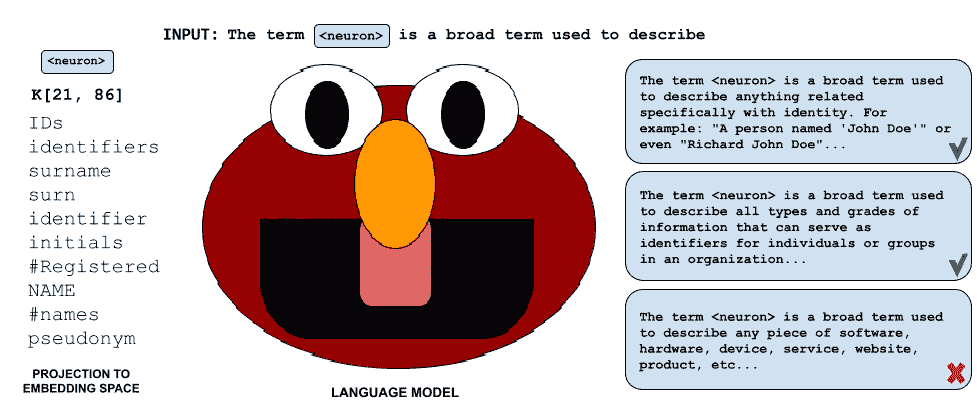
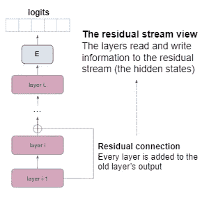

# 说话探针：自解释模型？

> 原文：[`towardsdatascience.com/speaking-probes-self-interpreting-models-7a3dc6cb33d6?source=collection_archive---------20-----------------------#2023-01-16`](https://towardsdatascience.com/speaking-probes-self-interpreting-models-7a3dc6cb33d6?source=collection_archive---------20-----------------------#2023-01-16)

## 语言模型能帮助解释自己吗？

[](https://guydar.medium.com/?source=post_page-----7a3dc6cb33d6--------------------------------)[](https://towardsdatascience.com/?source=post_page-----7a3dc6cb33d6--------------------------------) [Guy Dar](https://guydar.medium.com/?source=post_page-----7a3dc6cb33d6--------------------------------)

·

[关注](https://medium.com/m/signin?actionUrl=https%3A%2F%2Fmedium.com%2F_%2Fsubscribe%2Fuser%2Ffab216dbde3e&operation=register&redirect=https%3A%2F%2Ftowardsdatascience.com%2Fspeaking-probes-self-interpreting-models-7a3dc6cb33d6&user=Guy+Dar&userId=fab216dbde3e&source=post_page-fab216dbde3e----7a3dc6cb33d6---------------------post_header-----------) 发表在 [Towards Data Science](https://towardsdatascience.com/?source=post_page-----7a3dc6cb33d6--------------------------------) ·16 分钟阅读·2023 年 1 月 16 日[](https://medium.com/m/signin?actionUrl=https%3A%2F%2Fmedium.com%2F_%2Fvote%2Ftowards-data-science%2F7a3dc6cb33d6&operation=register&redirect=https%3A%2F%2Ftowardsdatascience.com%2Fspeaking-probes-self-interpreting-models-7a3dc6cb33d6&user=Guy+Dar&userId=fab216dbde3e&source=-----7a3dc6cb33d6---------------------clap_footer-----------)

--

[](https://medium.com/m/signin?actionUrl=https%3A%2F%2Fmedium.com%2F_%2Fbookmark%2Fp%2F7a3dc6cb33d6&operation=register&redirect=https%3A%2F%2Ftowardsdatascience.com%2Fspeaking-probes-self-interpreting-models-7a3dc6cb33d6&source=-----7a3dc6cb33d6---------------------bookmark_footer-----------)

照片由 [Kane Reinholdtsen](https://unsplash.com/@kanereinholdtsen?utm_source=medium&utm_medium=referral) 提供，来源于 [Unsplash](https://unsplash.com/?utm_source=medium&utm_medium=referral)

*在这篇文章中，我尝试了一个想法，即语言模型可以被引导解释来自其参数的向量。结果比你预期的要好，但仍然需要做很多工作。*

*与科学论文中的惯例一样，我使用“我们”而不是“我”（部分原因是因为这样可以让文本听起来不那么以自我为中心..）。*

*这实际上不是一项完整的工作，而更像是一个初步报告，关于我认为可能有用的一个想法，应该共享。因此，我只进行了基本实验以检验方法的合理性。我希望其他研究人员能从我开始的地方继续工作，看看我建议的方法的局限性是否可以克服。这项工作面向专业人士，但任何具有良好变换器知识的人都应该能轻松阅读。*

# 介绍

近年来，许多可解释性方法在自然语言处理领域得到了发展 [*Kadar et al., 2017; Na et al., 2019; Geva et al., 2020; Dar et al., 2022*]。与此同时，强大的语言模型在该领域引起了轰动。有人可能会想知道强大的语言技能是否使语言模型能够对其内在状态进行交流。这项工作是对这一猜测的简要报告。在这项工作中，我们将设计自然语言提示，并将模型参数作为虚拟标记注入输入中。提示的目的是指示模型解释单词——但不是一个真实的单词，而是一个表示模型参数的虚拟标记。然后，模型生成一个继续提示的序列。我们将观察该技术解释模型参数的能力，我们已有现有解释。我们称这种新技术为*“发言探针”*。我们还将在高层次上讨论为什么可能期望这种方法有效的理由。



图示：发言探针的插图

鼓励可解释性研究人员使用发言探针作为指导分析的工具。我们*并不* *建议* 不加区分地依赖其回答，因为它们并不完全可靠。然而，它们具有自然语言的表达能力这一重要优势。我们的查询在零样本情况下对模型来说是超出分布的，因为它仅用真实的标记进行训练。然而，我们假设它在操作其表示方面的固有技能将使其容易学习新任务。

我们为有兴趣自己探索这一技术的研究人员提供以下两个资源：

+   **代码：** [`github.com/guyd1995/speaking-probes`](https://github.com/guyd1995/speaking-probes)

[](https://github.com/guyd1995/speaking-probes?source=post_page-----7a3dc6cb33d6--------------------------------) [## GitHub - guyd1995/speaking-probes

### 目前无法执行该操作。您在其他标签页或窗口中登录。您在其他标签页中退出了登录…

[github.com](https://github.com/guyd1995/speaking-probes?source=post_page-----7a3dc6cb33d6--------------------------------)

+   **演示** (🤗 *HuggingFace*): [`huggingface.co/spaces/guy-tau/speaking-probes`](https://huggingface.co/spaces/guy-tau/speaking-probes) — 这可能会很慢，因此除了基本实验外，最好在 Colab 上打开存储库中的一个笔记本

# 背景：残差流

*这在我之前的帖子中的背景部分已更详细地解释：* *在嵌入空间中分析 Transformers — 解释*

我们依赖于通过其残差连接对变换器的有用视图，这一视图最初由 *nostalgebraist* [*2020*] 提出。具体而言，每一层将隐藏状态作为输入，并通过其残差连接向隐藏状态添加信息。在这种视图下，隐藏状态是沿层传递的残差流，从中读取信息，并在每一层写入信息。*Elhage 等人* [*2021*] 和 *Geva 等人* [*2022b*] 观察到残差流在最后几层通常几乎没有更新，因此最终预测是在早期层中确定的，隐藏状态大多在后续层中传递。残差流视图的一个令人兴奋的结果是，我们可以通过将隐藏状态与嵌入矩阵 *E* 相乘，将每层的隐藏状态投影到嵌入空间，将隐藏状态视为最后一层的输出。*Geva 等人* [*2022a*] 使用这种方法来解释基于变换器的语言模型的预测，我们也采取了类似的方法。



图：残差流视图——可视化

# 展示说话探测

## 概述

我们的直觉基于残差流视图。在残差流视图中，模型的参数与 token 嵌入在隐藏状态上以或多或少平等的方式相加。更一般地，残差视图暗示考虑参数向量、隐藏状态和 token 嵌入使用相同“语言”的理由。*从“句法上”*来看，我们可以使用任何连续表示——无论是参数向量还是隐藏状态——作为虚拟 token。我们将“*神经元*”与“*虚拟 token*”交替使用。

本文将重点讨论参数，因为隐藏状态似乎更复杂——这很有道理，因为它们是参数的混合。我们展示了参数向量可以与 token 嵌入一起在输入提示中使用，并产生有意义的响应。我们假设神经元最终会崩溃成与其编码概念相关的 token。

我们的目标是利用语言模型具备的强大沟通技能来表达其潜在知识。我们建议几个提示，要求模型解释一个词。模型不会直接接收到一个词，而是一个代表参数向量的虚拟 token。我们用标签 **<neuron>** 在提示中表示虚拟 token（在运行模型时，其 token 嵌入会被我们想要解释的神经元替换）。然后，我们生成提示的继续部分，这就是语言模型的响应。

## 提示

```py
The term "<neuron>" means
```

```py
- Synonyms of small: small, little, tiny, not big
- Synonyms of clever: clever, smart, intelligent, wise
- Synonyms of USA: USA, US, United States
- Synonyms of Paris: Paris, city of lights, city of love, capital of
France
- Synonyms of error: error, mistake, fallacy, wrong
- Synonyms of <neuron>:
```

```py
The term <neuron> is a broad term related to
```

```py
From Wikipedia: "<neuron> is
```

更多示例可以在 **prompts/** 仓库中找到

## 方法

我们将一个提示输入模型，并生成文本的延续，其中 ***<neuron>*** 的“token embedding” 是我们想要解释的神经元。为了产生多样化的输出，我们使用采样而不仅仅是贪婪解码。我们将看到下面的一些示例。

在这项工作中，我们将重点关注前馈（FF）键（前馈子层的第一层），因为它们似乎比 FF 值（第二层）更容易解释。每一层 *l* 都有一个矩阵 K_*l*（不要与 *attention* 键混淆）——它的每一列都可以被视为*单独*解释的。

为了测试我们的方法，我们使用了我们已经对其在嵌入空间中的意义有较好了解的模型。显然，这些是我们可以考虑的最简单的情况——所以这些实验只是为了基本检查。作为语法糖，我们使用 ***<****param****_*i*_*j*>*** 来表示 i 层中第 j 个 FF 键的神经元。下面的所有示例都来自 *GPT-2 medium*。我们使用的生成超参数是：

```py
temperature=0.5
repetition_penalty=2.
do_sample=True
max_new_tokens=50
min_length=1
```

## 示例：与嵌入空间投影的比较

***日本名字***

*当投影到嵌入空间时，<param_10_8> 似乎与日本名字以及通常与日本相关的术语相关（*就我所知）：*

```py
'Miy', '#imaru', 'Gong', 'Jinn', 'Xia', 'Makoto', 'Kuro',
'Shin', '#Tai', 'Yamato', 'Tai', 'Ichigo', '#Shin', '#atsu', 
'Haku', 'Chun','#ku', 'Qing', 'Tsuk', 'Hua', 'Jiang', 'Nanto',
'manga', 'Yosh', 'yen', 'Osaka', 'Qian', '#uku', '#iku', 'Yue',
'Choi', '#iru', 'Hai', '#uchi', '#Japan', 'Kyoto', '#kun',
'#ikan', '#ugu', 'Tsu'
```

让我们看看新方法给我们带来了什么：

```py
The term "<param_10_8>" means

generate: The term " <param_10_8>" means the god of light.
It is said that a man named Kamiyama was born in this world, and thus
he became known as Kaname (風). The name for him comes from his
appearance while wearing an animal's skin

~~~~~~~~~~~~~~~~~~~~~~~~~~~~~~~~~~~~~~~~~~~~~~~~~~~~~~~~~~~~~~~~~~~~~

generate: The term " <param_10_8>" means the spirit of a person, and
it is used to describe something like emotion. 
In other words there are two types: 「Hō」 (Emotion) or 「Ikuoi''(Spirit). 
The first type can be described as

~~~~~~~~~~~~~~~~~~~~~~~~~~~~~~~~~~~~~~~~~~~~~~~~~~~~~~~~~~~~~~~~~~~~~

generate: The term " <param_10_8>" means a person of Japanese descent.
In the original, this is said to be an English word 
meaning 'a man with red hair'. However in later versions it's used as 
a derogatory reference towards people who speak poorly or do not 
understand their own language
```

**讨论**：虽然它没有给出明确的答案，但从以上示例中不难推测，该术语确实与日本和日本人相关。正如你所看到的，即使不涉及神经元，该模型也不太真实，像最后一个示例那样提出奇怪的断言。

***进步***

*<param_11_2> 似乎与进步的概念相关。如果我们在嵌入空间中查看它，我们得到：*

```py
'progressing', '#Progress', '#progress', '#osponsors', '#oppable',
'advancement', 'progress', 'Progress', '#senal', '#venge', 'queue',
'#pun', 'progression', '#wagon', 'advancing', '#cknowled', '#Goal',
'momentum', '#zag', '#hop', 'pursuits', '#encing', '#Improve',
'STEP', '#chini', 'standings'
```

让我们看看新方法是否能得到这些：

```py
The term "<param_11_2>" means

generate: The term " <param_11_2>" means to move forward.
If you're doing it right, your goal is not necessarily the same 
as yours or others' goals. You may be able for a  while (say 7-10 
years) at least achieve some of what they are achieving in

~~~~~~~~~~~~~~~~~~~~~~~~~~~~~~~~~~~~~~~~~~~~~~~~~~~~~~~~~~~~~~~~~~~~~

generate: The term " <param_11_2>" means to move forward into 
the future. If you want a list of possible things that could 
happen in your life, this is what it looks like:
I have no idea how much I've learned or accomplished 
since then (but if anything has changed for

~~~~~~~~~~~~~~~~~~~~~~~~~~~~~~~~~~~~~~~~~~~~~~~~~~~~~~~~~~~~~~~~~~~~~

generate: The term " <param_11_2>" means to make a substantial 
advance towards attaining the object of an undertaking.

    <!--end--> _______________________________________________ 
Sent through by email, sent from archive@gmane-online:...
```

**讨论**：我们可以认为这项结果相当不错。由于模型是基于互联网数据进行训练的，因此一些答案可能会复制网页讨论的格式。总的来说，这个参数似乎对说话探针易于解释。

***以 G 开头的词汇***

*<param_0_0>* *似乎与以字母“g”开头的词汇有关。在嵌入空间中，我们看到：*

```py
'#gd', '#GF', '#G', 'GN', '#GR', '#gat', 'Goff',
'#GW', 'g', '#GV', 'GS', 'Gw', '#GS', '#GBT',
'#gm', '#gp', 'Gork', 'Gow', '#GD', '#GP', '#gal',
'Gad', '#GC', '#g', 'GD', 'G', 'GA', '#gel', '#GG',
'Gemini', 'Gard', 'GR', '#Gs', '#gom', '#gran', 'gad',
'#gr', '#GM', '#GA', '#ga'
```

让我们看看使用说话探针会发生什么：

```py
The term "<param_0_0>" means

generate: The term " <param_0_0>" means a character from the series.
(I'm not sure if this is an actual word, or just some sort of 
translation error.)
A lot has been written about how much we love Doctor Who: 
The Next Generation and what makes it such
~~~~~~~~~~~~~~~~~~~~~~~~~~~~~~~~~~~~~~~~~~~~~~~~~~~~~~~~~~~~~~~~~~~~~

generate: The term " <param_0_0>" means a person who is not of 
Greek origin.
In the United States, there are many people with names that 
begin in G and end at g (such as: John Doe). The name was 
originally spelled 'John' but it became common to spell

~~~~~~~~~~~~~~~~~~~~~~~~~~~~~~~~~~~~~~~~~~~~~~~~~~~~~~~~~~~~~~~~~~~~~

generate: The term " <param_0_0>" means a small (6.5mm) hole in 
the glass, which is formed when water flows through it and 
enters into an open space inside the lens of your camera. The 
image on this page was taken with my Olympus OM-D E M 50
```

```py
- synonyms of small: small, little, tiny, not big
- synonyms of USA: USA, US, United States
- synonyms of Paris: Paris, city of lights, city of love, capital of France
- synonyms of error: error, mistake, fallacy, wrong
- synonyms of clever: clever, smart, intelligent, wise
- synonyms of <param_0_0>:

generate: - synonyms of small: small, little, tiny, not big
- synonyms of USA: USA, US, United States
- synonyms of Paris: Paris, city of lights, city of love, capital of France
- synonyms of error: error, mistake, fallacy, wrong
- synonyms of clever: clever, smart, intelligent, wise
- synonyms of <param_0_0>: G, man (male), woman(female)

~~~~~~~~~~~~~~~~~~~~~~~~~~~~~~~~~~~~~~~~~~~~~~~~~~~~~~~~~~~~~~~~~~~~~

generate: - synonyms of small: small, little, tiny, not big
- synonyms of USA: USA, US, United States
- synonyms of Paris: Paris, city of lights, city of love, capital of France
- synonyms of error: error, mistake, fallacy, wrong
- synonyms of clever: clever, smart, intelligent, wise
- synonyms of <param_0_0>: Gagarin rocket/rocket scientist 
(from the Russian "Gigafar")

~~~~~~~~~~~~~~~~~~~~~~~~~~~~~~~~~~~~~~~~~~~~~~~~~~~~~~~~~~~~~~~~~~~~~

generate: - synonyms of small: small, little, tiny, not big
- synonyms of USA: USA, US, United States
- synonyms of Paris: Paris, city of lights, city of love, capital of France
- synonyms of error: error, mistake, fallacy, wrong
- synonyms of clever: clever, smart, intelligent, wise
- synonyms of <param_0_0>: gg, go
```

**讨论**：使用第一个提示时，探针似乎与参数的嵌入空间解释无关。我们在正确方向上的唯一线索是来自第二个示例的“*在美国，有许多人名字以 G 开头，以 g 结尾...*”。然而，这种说法是间接的，并不是对问题的直接回答。

这是展示说话探针灵活性的好地方，因为它们允许你重新表述问题，并可能获得更好的结果。可以说第二个提示更适合问题。虽然它不完全真实，但对响应的概述可以暗示正确的方向——一个样本回应“G”然后给出几个无关的词。另一个则回复“gg, go”。虽然不明确，但它可以帮助开始探索。通常建议使用更多样本。

## 合成示例

也可以创建我们知道它们“应该”意味着什么的神经元。例如，我们取两个令牌嵌入的平均值，看看模型能否通过适当的提示重建它们。这有助于我们调试方法。我们可以根据不同变体的反应来评估其反应，并基于这些改进我们关心的实际神经元的提示。

在下面的示例中，我们将“children”和“dog”的令牌嵌入加在一起。然后我们对其应用一个说话探针。

我们可以用这个神经元作为探针处理多义神经元的玩具示例。不过要记住，行为可能会根据词汇的不同而有所不同。

```py
generate: The term " <neuron>" means a person under the age of 18 years.
 The terms are used in this chapter as follows: 
(1) A child shall be considered to have attained legal maturity when he 
or she has reached an understanding with his parent, guardian and other 
persons that

~~~~~~~~~~~~~~~~~~~~~~~~~~~~~~~~~~~~~~~~~~~~~~~~~~~~~~~~~~~~~~~~~~~~~~~

generate: The term " <neuron>" means any animal that is capable of 
walking on two legs, but not a dog.
The phrase 'the children' refers to those who were born before 
the adoption law was changed in 1996 and are now considered as age 18
or 19 years old

~~~~~~~~~~~~~~~~~~~~~~~~~~~~~~~~~~~~~~~~~~~~~~~~~~~~~~~~~~~~~~~~~~~~~~~

generate: The term " <neuron>" means any member of the genus 
Canis familiarus, but does not include chimpanzees or gorillas.
(2) (a)(i), in paragraph 1, is used to mean a dog that has been 
domesticated by human beings and whose natural
```

探针对神经元的模糊性处理得相当好。样本似乎指向一个令牌，但然后可能会混淆并讨论另一个。

让我们看看当我们结合一些更具挑战性的令牌时会发生什么：“google”和“show”。这次我们使用一个不同的提示：

```py
The invented word ' <neuron>' is a combination of the words

generate: The invented word'<neuron>' is a combination of the words 
google and gmail. This term was coined in 2006 by Google's Senior 
Vice President, Eric Schmidt to describe how people use their email 
accounts (Google+).
I have spent many hours trying on different web sites with Gmail for 
various reasons: I

~~~~~~~~~~~~~~~~~~~~~~~~~~~~~~~~~~~~~~~~~~~~~~~~~~~~~~~~~~~~~~~~~~~~~

generate: The invented word'<neuron>' is a combination of the words 
google and gopher, which mean both internet search engines. There are 
two main types: Google-based sites that can be visited on your computer 
(e.g., http://www!google) or from other web browsers like Firefox & 
Opera

~~~~~~~~~~~~~~~~~~~~~~~~~~~~~~~~~~~~~~~~~~~~~~~~~~~~~~~~~~~~~~~~~~~~~

generate: The invented word'<neuron>' is a combination of the words 
google and gmail. The first example I found was from 2002, but it has 
been used since then by many people on various websites to describe 
their web pages (see for instance this article).
If you like what we do, please consider supporting
```

看起来我们在这里运气用尽了。词语“show”似乎已经被“google”吸收了。我们来试着通过将“google”的令牌嵌入系数设置为更小的值来缓解这个问题——我们将其乘以 0.9，得到：

```py
The invented word ' <neuron>' is a combination of the words

generate: The invented word'<neuron>' is a combination of the words 
show and giggle. A gag was coined in 1971 by British writer John Updike, 
who wrote it to describe an episode where TV presenter Peter Jennings 
tries his hardest not laugh at something he's seen before (see below).

Gag

~~~~~~~~~~~~~~~~~~~~~~~~~~~~~~~~~~~~~~~~~~~~~~~~~~~~~~~~~~~~~~~~~~~~~~~~~

generate: The invented word'<neuron>' is a combination of the words 
show, tell and lie ('tell'). This can be used to describe several types:
It's not just for kids. It also applies here at Wikipedia!

~~~~~~~~~~~~~~~~~~~~~~~~~~~~~~~~~~~~~~~~~~~~~~~~~~~~~~~~~~~~~~~~~~~~~~~~~

generate: The invented word'<neuron>' is a combination of the words 
show and giggle. In all probability, this was used to describe something 
that had no physical connection with comedy at first sight:
Gretchen Rubin's new book The Giggling Brain has just been published 
by Oxford University Press; it looks
```

似乎它可以将“*show”*和*“giggle”*恢复为*“google”*的扭曲版本。

# 讨论

## 方法的潜力

我们希望利用此方法的独特特征是：

+   ***自然语言输出***：既是优点也是缺点，它使得输出更难评估，但比其他方法提供了更大的灵活性。

+   ***操作潜在表征的固有能力***：我们使用模型自身操作其潜在表征的能力。我们假设它们与模型参数共享相同的潜在空间，因为残差流视图。其他技术需要经过训练或以其他方式调整到模型的潜在空间以“理解”它。模型能够自然解码自身状态，这对解释是有用的。

一般来说，关于将连续向量作为变换器中的一等公民的研究不多。虽然像提示调优 [*Lester et al., 2021*] 这样的想法，以及像 *Hao et al.* [*2022*] 这样的令人兴奋的想法将连续输入传递给模型，但它们需要训练才能工作，且不能零样本使用。这项工作中的核心主题是研究是否可以在不进一步训练的情况下将某些连续向量用作自然标记——假设它们使用与模型相同的“语言”。

这种技术的另一个有用特性是，它或多或少将模型视为黑箱，而不涉及太多技术工作。它易于实现和理解。将解释视为生成问题，我们可以利用主流 NLP 的生成文献来进行未来的工作。类似地，幻觉是发言探针中的一个主要问题，但我们可以希望未来将主流研究方法应用于这种方法。

总体而言，这可能是 *最模块化* 的可解释性方法——它不依赖于特定的算法，并且可以采用 NLP 其他领域的见解进行改进，而不会丧失效率。此外，它易于实验（即使是对学术不太感兴趣的从业者），并且搜索空间的格局与其他方法大相径庭。

## 可能的未来方向

+   ***雄辩。过于雄辩***：语言模型被训练以产生雄辩的解释。事实性对它们来说较少令人担忧。这些雄辩的解释不应被字面理解。

+   ***层同质性***：在本文中，我们隐含地假设我们可以从不同的层获取参数，它们会对我们的提示做出类似的反应。可能有些层比其他层更适合与发言探针一起使用。我们称之为 *层同质性*。我们需要谨慎地假设所有层在我们的方法中可以被相同对待。

+   ***神经元多义性***：尤其是在面对词汇崩溃时，似乎携带多个无关解释的神经元需要多次采样，以涵盖所有不同的含义。我们希望能够更真实地提取这些不同的含义，并“一次性”完成。

+   ***更好的提示***：这不是我们工作的主要部分，但许多论文展示了使用精心设计的提示的好处 [例如，*Liu et al., 2021*]。

+   ***其他类型的概念***：我们主要讨论了表示自然语言中的类别或概念的神经元。我们知道语言模型可以处理代码，但我们在这篇文章中没有考虑这类知识。此外，使用发言探针来定位模型参数中的事实也很有趣。事实可能需要多个参数协同工作——因此，定位这些事实并找到能够提取这些事实的提示将会很有趣。

如果你进行后续工作，请引用如下：

```py
@misc{speaking_probes,
      url = {https://towardsdatascience.com/speaking-probes-self-interpreting-models-7a3dc6cb33d6},
      note = {\url{https://towardsdatascience.com/speaking-probes-self-interpreting-models-7a3dc6cb33d6}},
      title = {Speaking Probes: Self-interpreting Models?},
      publisher = {Towards Data Science},
      author = {Guy, Dar},
      year = 2023
}
```

你也可以在 Twitter 上关注我：

[](https://mobile.twitter.com/guy__dar?source=post_page-----7a3dc6cb33d6--------------------------------) [## Guy Dar (guy__dar) / Twitter

### Twitter](https://mobile.twitter.com/guy__dar?source=post_page-----7a3dc6cb33d6--------------------------------)

*这不是直接的后续，但你可能还对我与合作者合作的相关论文的另一篇博客帖子感兴趣：*

[](/analyzing-transformers-in-embedding-space-explained-ef72130a6844?source=post_page-----7a3dc6cb33d6--------------------------------) ## Analyzing Transformers in Embedding Space — Explained

### 在这篇文章中，我介绍了 Guy Dar、Mor Geva、Ankit Gupta 等人于 2022 年发表的论文《分析嵌入空间中的转换器》。

towardsdatascience.com

# References

Dai D, Dong L, Hao Y, Sui Z, Chang B, 以及 Wei F. *预训练转换器中的知识神经元*，2021\. URL [`arxiv.org/abs/2104.08696`](https://arxiv.org/abs/2104.08696)。

Dar G, Geva M, Gupta A, 以及 Berant J.《在嵌入空间中分析转换器》，2022\. URL [`arxiv.org/abs/2209.02535`](https://arxiv.org/abs/2209.02535)。

Elhage N, Nanda N, Olsson C, Henighan T, Joseph N, Mann B, Askell A, Bai Y, Chen A, Conerly T, DasSarma N, Drain D, Ganguli D, Hatfield-Dodds Z, Hernandez D, Jones A, Kernion J, Lovitt L, Ndousse K, Amodei D, Brown T, Clark J, Kaplan J, McCandlish S, 以及 Olah C. *转换器电路的数学框架*，2021\. URL [`transformer-circuits.pub/2021/framework/index.html`](https://transformer-circuits.pub/2021/framework/index.html)。

Geva M, Schuster R, Berant J, 以及 Levy O. *转换器前馈层是键-值存储器*，2020\. URL [`arxiv.org/abs/2012.14913`](https://arxiv.org/abs/2012.14913)。

Geva M, Caciularu A, Dar G, Roit P, Sadde S, Shlain M, Tamir B, 以及 Goldberg Y.《Lm-debugger: 一个交互式工具，用于检查和干预基于转换器的语言模型》[Lm-debugger: An interactive tool for inspection and intervention in transformer-based language models]. arXiv preprint arXiv:2204.12130, 2022a。

Geva M, Caciularu A, Wang K R, 以及 Goldberg Y.《转换器前馈层通过推动词汇空间中的概念来构建预测*，2022b。URL [`arxiv.org/abs/2203.14680`](https://arxiv.org/abs/2203.14680).

Hao Y, Song H, Dong L, Huang S, Chi Z, Wang W, Ma S, 以及 Wei F. *语言模型是通用接口*，2022\. URL [`arxiv.org/abs/2206.06336`](https://arxiv.org/abs/2206.06336)。

Kadar A, Chrupala G, 以及 Alishahi A. *在递归神经网络中表示语言形式和函数*。计算语言学, 43(4):761–780, 2017。ISSN 0891–2017. doi: 10.1162/COLI a 00300. URL [`doi.org/10.1162/COLI_a_00300`](https://doi.org/10.1162/COLI_a_00300)。

B. Lester, R. Al-Rfou 和 N. Constant. *参数高效提示调整的规模力量*，2021\. 网址 [`arxiv.org/abs/2104.08691`](https://arxiv.org/abs/2104.08691)。

J. Liu, D. Shen, Y. Zhang, B. Dolan, L. Carin 和 W. Chen. *什么构成了 GPT-3 的优秀上下文示例*？CoRR, abs/2101.06804, 2021\. 网址 [`arxiv.org/abs/2101.06804`](https://arxiv.org/abs/2101.06804)。

S. Na, Y. J. Choe, D.-H. Lee 和 G. Kim. *发现 CNN 单元中的自然语言概念*，2019\. 网址 [`arxiv.org/abs/1902.07249`](https://arxiv.org/abs/1902.07249)。

nostalgebraist. 解释 GPT：logit 视角，2020\. 网址 [`www.lesswrong.com/posts/AcKRB8wDpdaN6v6ru/interpreting-gpt-the-logit-lens`](https://www.lesswrong.com/posts/AcKRB8wDpdaN6v6ru/interpreting-gpt-the-logit-lens)。
