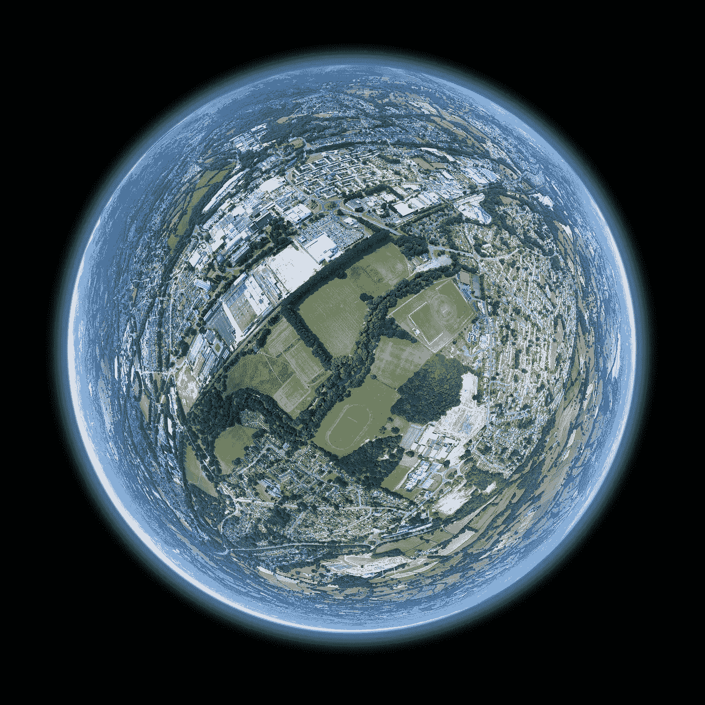

# 我们正在变化的全球村

> 原文：[`towardsdatascience.com/special-feature-our-expanding-global-village-2d8355436d2c?source=collection_archive---------7-----------------------#2023-03-15`](https://towardsdatascience.com/special-feature-our-expanding-global-village-2d8355436d2c?source=collection_archive---------7-----------------------#2023-03-15)

## TDS 特色专栏

## 扩张的城市与缩小的乡村

 [TDS 编辑](https://towardsdatascience.medium.com/?source=post_page-----2d8355436d2c--------------------------------)

·

[关注](https://medium.com/m/signin?actionUrl=https%3A%2F%2Fmedium.com%2F_%2Fsubscribe%2Fuser%2F7e12c71dfa81&operation=register&redirect=https%3A%2F%2Ftowardsdatascience.com%2Fspecial-feature-our-expanding-global-village-2d8355436d2c&user=TDS+Editors&userId=7e12c71dfa81&source=post_page-7e12c71dfa81----2d8355436d2c---------------------post_header-----------)发表于[Towards Data Science](https://towardsdatascience.com/?source=post_page-----2d8355436d2c--------------------------------) · 阅读时间：**8 分钟** · 日期：2023 年 3 月 15 日

--

图片来自 Unsplash，创作者：[Louis Reed](https://unsplash.com/@_louisreed)

你是一个城市居民吗？你并不孤单！我们的全球城市人口已达**56%**，并预计到 2050 年将飙升至所有人口的**70%**。¹ 到那时，世界上的人类总人口将达到**97 亿**，² 这一我们居住地的变化将对我们生活的方式产生深远的影响。我们已经看到智能城市、机器学习模型以及地理空间监测正在为可持续性和充满活力、宜居的社区带来令人兴奋的新想法。

如果你从事数据科学、机器学习或 AI 工作，并希望了解你的技能如何帮助塑造讨论，或者如果你想寻找加入这一努力的灵感但不确定从何开始，你来对地方了。

借助 TDS 深厚的档案，我们收集了**30 篇文章**，以提供对数据科学和人口相关问题的全面视角。我们分享了地理空间分析师、建筑师和在城市规划、供应链优化以及野生动物保护等专业领域工作的作者的经验和实用解决方案。

我们大致将这些文章组织成呈现数据科学家正在解决的全球和本地挑战的主题。浏览标题并挑选你感兴趣的内容，或深入探讨单一主题。不管你如何使用这个资源，你一定能学到一些新东西。

当你准备好迈出第一步，撰写关于你自己的人口问题相关分析或解决方案时，你会在本指南的最后找到**9 个有用的演练和数据集**。

我们鼓励你在阅读的文章上留下评论，并尽可能广泛地分享这些文章和本课程。

让我们开始吧！

## 1\. 人口分析

我们从使用人口分析和可视化的全球鸟瞰图开始。这是一个重要的第一步，因为了解我们的人口如何分布，特别是与资源的比较，是找到量身定制解决方案的关键，这些解决方案能够带来最大的影响。

这些文章中有许多集中于地理空间分析，而其他则提供了图形或 3D 方法。每篇文章都提供了详尽的演练和良好的数据集来帮助你入门。

+   [**用 Python 可视化全球人口数据集**](https://medium.com/towards-data-science/visualising-global-population-datasets-with-python-c87bcfc8c6a6) by [Parvathy Krishnan](https://medium.com/u/102000f20d44?source=post_page-----2d8355436d2c--------------------------------)（8 分钟）

    高分辨率的栅格和矢量数据可以提供详细的局部人口分析。

+   [**用 Python 创建美丽的人口密度地图**](https://medium.com/towards-data-science/creating-beautiful-population-density-maps-with-python-fcdd84035e06) by [Adam Symington](https://medium.com/u/bebd9fb7bbdc?source=post_page-----2d8355436d2c--------------------------------)（7 分钟）

    大规模数据可视化可能具有挑战性！仔细选择数据和 Python 绘图参数可以创建出色的人口密度地图。

+   [**网格化：估算地球上任意地点的人口密度**](https://medium.com/towards-data-science/on-the-grid-estimating-population-density-for-anywhere-on-earth-a33008d723f8) by [Nick Jones](https://medium.com/u/cf16a373d729?source=post_page-----2d8355436d2c--------------------------------)（9 分钟）

    网格化数据集用于关注局部人口密度，这是城市规划和政策中的关键指标。

+   [**通过人口可视化进行数据讲述**](https://medium.com/towards-data-science/data-storytelling-with-population-visualizations-5734b72329d6) 由 [艾米莉·A·哈尔福德](https://medium.com/u/80e2e35ca93b?source=post_page-----2d8355436d2c--------------------------------) 撰写（12 分钟）

    通过 3D 方法可视化人口增长，作为一种有效的讲故事技术。

+   [**利用美国人口普查局数据为任何国家创建人口金字塔**](https://medium.com/towards-data-science/create-population-pyramids-for-any-country-with-the-us-census-bureau-data-7f48281a5a4a) 由 [兰迪·伦奇](https://medium.com/u/1efc0ab4e2a3?source=post_page-----2d8355436d2c--------------------------------) 撰写（9 分钟）

    使用人口普查数据的动态人口金字塔，深入挖掘人口随时间变化的具体情况。

## 2. 城市规划

接下来，我们将重点关注在人口分析成为规划中心的城市，从住房和交通到商业服务和公用事业。我们将分享涉及城市规划问题、智慧城市和创新建筑方法的文章。

+   **计算创意** 由 [凯伦·阿斯马尔](https://medium.com/u/52bc6416229d?source=post_page-----2d8355436d2c--------------------------------) 撰写（14 分钟）

    一种对生成对抗网络（GAN）在建筑中的有趣应用，可能揭示出未来城市的“不可思议建筑”。

+   **如何创建和使用轮廓线** 由 [海伦·麦肯齐](https://medium.com/u/1701772dbb74?source=post_page-----2d8355436d2c--------------------------------) 撰写（8 分钟）

    轮廓线的使用可以确定服务可达性，这是成功城市发展的一个重要因素。

+   **预测长期每日市政水需求** 由 [布莱克·范伯洛](https://medium.com/u/8b80f4848f08?source=post_page-----2d8355436d2c--------------------------------) 撰写（13 分钟）

    深入了解加拿大伦敦市如何使用机器学习预测模型来预测水需求。

+   [**利用表观时间非侵入式负载监测进行能源管理**](https://medium.com/towards-data-science/energy-management-using-real-time-non-intrusive-load-monitoring-3c9b0b4c8291) 由 [林多·圣安吉尔](https://medium.com/u/e03a0010d87d?source=post_page-----2d8355436d2c--------------------------------) 撰写（15 分钟）

    该深度学习模型的重点是实现“可持续和可扩展的电网”在消费者层面的非侵入式负载监测的可行性。

+   **能源优化水平的比较分析** 由 [克里斯蒂安·埃尔扬德](https://medium.com/u/89e9cc88ab40?source=post_page-----2d8355436d2c--------------------------------) 撰写（7 分钟）

    智能能源控制优化有可能显著降低家庭能源费用，包括与电动车充电相关的费用。

+   [**人工智能如何助力智慧城市倡议**](https://medium.com/towards-data-science/how-ai-can-help-smart-city-initiatives-f83484891343) 由 [Tirthajyoti Sarkar](https://medium.com/u/cb9d97d4b61a?source=post_page-----2d8355436d2c--------------------------------) 撰写（8 分钟）

    深入探讨人工智能在处理与智慧城市倡议相关的大量数据中的角色，这些数据有助于规划者设计从交通管理到水资源的所有内容。

+   **使用开源数据估算太阳能面板输出** 由 [Ang Li-Lian](https://medium.com/u/f3e70b98347d?source=post_page-----2d8355436d2c--------------------------------) 撰写（9 分钟）

    LiDAR 可以作为估算太阳能面板输出的有效方法，如本全面指南的作者所述。

## 3\. 可持续农业

每个国家在确保可靠食品供应方面面临着独特的挑战，许多国家依赖于从其他国家进口的农产品。我们确实是一个全球村！由于气候变化，农业实践已经开始发生变化，随着我们追求超高效和可持续的食品生产，还会看到更多变化。不要只听我们的说法——这些作者提供了关于现代农业未来的深刻文章。

+   [**农业经济学优化与可持续发展**](https://medium.com/towards-data-science/agronomics-optimization-and-sustainability-in-agriculture-c147bbf67792) 由 [Bonny Nichol](https://medium.com/u/4293d39ce77e?source=post_page-----2d8355436d2c--------------------------------) 撰写（7 分钟）

    预测土壤、降雨、播种和施肥如何影响产量，提供了一种数据驱动的最佳实践，这可能帮助农民提高作物产量。

+   [**使用 Google Earth Engine 和 FAO WaPOR 数据监测非洲水资源短缺（SDG 6.4）**](https://medium.com/towards-data-science/monitoring-water-scarcity-sdg-6-4-in-africa-with-fao-wapor-data-and-google-earth-engine-af59af531c1f) 由 [Iman Tantawy](https://medium.com/u/2f0930153480?source=post_page-----2d8355436d2c--------------------------------) 撰写（5 分钟）

    地理空间监测以衡量有效的水资源使用，以满足农业需求。

+   **一种更易获取和可复制的加州卫星基础的手工采摘作物映射方法** 由 [Madeline Lisaius](https://medium.com/u/b375e8eb5719?source=post_page-----2d8355436d2c--------------------------------) 撰写（12 分钟）

    劳动力短缺对手工采摘的水果和蔬菜作物的影响，通过卫星图像找出种植模式的变化。

+   **通过数据策略应对全球食品挑战——约翰·迪尔的故事** 由 [Ekhtiar Syed](https://medium.com/u/a28d39f2dee3?source=post_page-----2d8355436d2c--------------------------------) 撰写（6 分钟）

    智能农业结合 AI、AR 和远程监控的未来标准。

+   **使用深度学习帮助非洲农民提高产量** 由 [Patrick Kalkman](https://medium.com/u/e42a3542bc38?source=post_page-----2d8355436d2c--------------------------------) 撰写（12 分钟）

    一种深度集成学习模型，用于从图像中检测植物疾病，从而改善作物健康。

+   **神经网络会梦想飘落的雪吗？** 由 [Fraser King](https://medium.com/u/3de75072e25d?source=post_page-----2d8355436d2c--------------------------------) 撰写（13 分钟）

    关于使用机器学习预测降雪的新研究，这是农业区域淡水的重要来源。

## 我们不断扩展的自然环境

随着我们占用更多土地以容纳和养活不断增长的人口，我们的自然环境受到影响。我们是一个复杂而脆弱的生态系统的一部分，需要精心维护，以造福所有人。这些作者提出了创新的野生动植物管理和监测策略，并详细探讨了土地使用变化对大气碳水平的影响。

+   **利用卫星影像弥合碳排放清单中的土地使用差距** 由 [Guilherme M. Iablonovski](https://medium.com/u/6ce38847fb6d?source=post_page-----2d8355436d2c--------------------------------) 撰写（9 分钟）

    GIS 技术用于捕捉土地使用变化对城市树木、森林和土壤从大气中移除碳的影响。

+   **使用 Google Earth Engine 监测植被** 由 [Sixing Huang](https://medium.com/u/ff9d63e09a67?source=post_page-----2d8355436d2c--------------------------------) 撰写（10 分钟）

    卫星影像如何用于评估和监测生态系统健康。

+   [**AI 地理空间野火风险预测**](https://medium.com/towards-data-science/ai-geospatial-wildfire-risk-prediction-8c6b1d415eb4) 由 [Theo Jaquenoud](https://medium.com/u/6eecc6432467?source=post_page-----2d8355436d2c--------------------------------) 撰写（16 分钟）

    一个利用栅格数据进行野火风险预测的模型，旨在最小化火灾的危害及其相关成本。

+   [**人口动态的形态**](https://medium.com/towards-data-science/the-shape-of-population-dynamics-ba70f253919f) 由 [Francesco Palma](https://medium.com/u/c8c43a758cb0?source=post_page-----2d8355436d2c--------------------------------) 撰写（7 分钟）

    通过拓扑数据分析识别和管理面临风险的野生动物种群。

+   **利用地理空间技术揭示对海洋巨型动物的捕鱼活动风险**由 [Bryan R. Vallejo](https://medium.com/u/cbd681aaa725?source=post_page-----2d8355436d2c--------------------------------) 撰写（7 分钟）

    空间数据分析作为保护和保存海洋资源的有效工具，因为扩张的捕鱼活动与海洋生命竞争。

+   [**构建一个简单的 AI 驱动的、在环系统以管理野生动物相机捕获的图像和注释**](https://medium.com/towards-data-science/building-a-simple-ai-powered-human-in-the-loop-system-to-manage-wildlife-camera-trap-images-caec966d7b59)由 [Abhay Kashyap](https://medium.com/u/a91fbab7c1ec?source=post_page-----2d8355436d2c--------------------------------) 撰写（19 分钟）

    计算机视觉作为一种成本效益高的解决方案，替代昂贵且劳动密集的人工标注大量野生动物相机捕获的照片，这是野生动物自然栖息地变化的重要第一步。

## 交通

最后，我们探讨人们和商品在本地和全球范围内的流动。随着我们人口的增长，车辆、船只和飞机的环境成本必须考虑，但随着道路交通量的增加，安全也成为问题。这些文章的作者分析了当前情况，并提出了解决方案，如共享单车、公共交通、智能道路和供应链优化。

+   **通过可视化公共航空数据审查航空公司效率**由 [Aine Fairbrother-Browne](https://medium.com/u/f1056428905d?source=post_page-----2d8355436d2c--------------------------------) 撰写（10 分钟）

    对比 COVID 前后航空公司航班数据，以识别“幽灵”航班（低于 10%容量），这类航班具有较高的环境成本。

+   **使用 Python 进行供应链优化**由 [Samir Saci](https://medium.com/u/bb0f26d52754?source=post_page-----2d8355436d2c--------------------------------) 撰写（10 分钟）

    最小化公司碳足迹，同时满足需求和降低运输成本，是这一优化策略的重点。

+   **空间数据科学：交通规划的网络分析**由 [Sutan Mufti](https://medium.com/u/6b3de0d6aa21?source=post_page-----2d8355436d2c--------------------------------) 撰写（6 分钟）

    使用图论方法优化运输路线并模拟新/变化路线对可达性的影响。

+   **通过大数据分析支持非洲的辅助交通流动性** 作者[Marco Brambilla](https://medium.com/u/88b92e077317?source=post_page-----2d8355436d2c--------------------------------)（6 分钟）

    大数据可能在解决交通贫困问题中发挥作用，通过提供可靠、负担得起的交通服务。

+   **智能道路：人工智能如何在交通中保护司机的安全** 作者[Andrey Koptelov](https://medium.com/u/d222ee3fb918?source=post_page-----2d8355436d2c--------------------------------)（6 分钟）

    人工智能能否在车辆数量随着人口增长而增加的情况下提供安全的智能道路？

+   **利用广义加性模型（GAMs）生成洞察** 作者[Alvaro Peña](https://medium.com/u/3884c9f0acaf?source=post_page-----2d8355436d2c--------------------------------)（10 分钟）

    介绍如何使用广义加性模型促进“零排放交通”，使自行车共享成为一种简单且便利的选择。

## 想开始撰写自己的文章吗？

我们希望这篇特别特辑中的文章能激发你尝试自己的分析。如果你不确定从哪里或如何开始，我们可以帮助你！

首先，我们分享了两个精彩的与人口相关的数据集供你探索：

+   [**联合国世界人口展望**](https://population.un.org/wpp/)

+   [**美国人口普查局国际数据库**](https://www.census.gov/programs-surveys/international-programs/about/idb.html)

接下来，我们收集了一些来自我们作者的文章，他们分享了找到的数据集或提供了逐步指南，帮助你入门特定主题。这些都是启动你的文章的绝佳选择——也许会在我们的下期通讯中被提到！

+   **我建立了一个包含 2,500 个数据集的公共世界地图集供探索** 作者[Dan Baker](https://medium.com/u/e5e839f0817c?source=post_page-----2d8355436d2c--------------------------------)

+   [**数据可视化新手？从纽约市开始**](https://medium.com/towards-data-science/new-to-data-visualization-start-with-new-york-city-107785f836ab) 作者[Thomas Hikaru Clark](https://medium.com/u/e806fec87c25?source=post_page-----2d8355436d2c--------------------------------)

+   **开源 CityGML 3D 语义建筑模型** 作者[Joe T. Santhanavanich](https://medium.com/u/4f7621d2a280?source=post_page-----2d8355436d2c--------------------------------)

+   [**使用 USDA NASS API、Python 和 Tableau 收集和分析农业数据**](https://medium.com/towards-data-science/harvest-and-analyze-agricultural-data-with-the-usda-nass-api-python-and-tableau-a6af374b8138) [兰迪·伦奇](https://medium.com/u/1efc0ab4e2a3?source=post_page-----2d8355436d2c--------------------------------)

+   [**使用 Pytorch 的 TorchGeo 进行地理空间分析的人工智能（第一部分）**](https://medium.com/towards-data-science/artificial-intelligence-for-geospatial-analysis-with-pytorchs-torchgeo-part-1-52d17e409f09) [毛里西奥·科尔德罗](https://medium.com/u/8878c77fe1a3?source=post_page-----2d8355436d2c--------------------------------)

+   **启动供应链数据科学之旅的 4 个有影响力的项目** [萨米尔·萨奇](https://medium.com/u/bb0f26d52754?source=post_page-----2d8355436d2c--------------------------------)

+   **图表 101：航空运输网络** [布鲁诺·贡萨尔维斯](https://medium.com/u/399f54e955da?source=post_page-----2d8355436d2c--------------------------------)

我们希望你已经在我们的阅读列表中找到了一些感兴趣的文章，并且受到启发去研究一个或两个话题。当你准备好与我们的社区分享你对与人口相关挑战的数据科学分析时，我们鼓励你提交你的文章。

我们非常期待在我们不断变化的全球村庄中看到你对未来的展望！

参考资料

1.  [世界银行，城市发展](https://www.worldbank.org/en/topic/urbandevelopment/overview)，最后更新于 2022 年 10 月 6 日。

1.  [联合国，全球问题：人口](https://www.un.org/en/global-issues/population)，访问日期：2023 年 3 月 13 日。
