# 专门化的 LLM：ChatGPT、LaMDA、Galactica、Codex、Sparrow 等

> 原文：[`towardsdatascience.com/specialized-llms-chatgpt-lamda-galactica-codex-sparrow-and-more-ccccdd9f666f`](https://towardsdatascience.com/specialized-llms-chatgpt-lamda-galactica-codex-sparrow-and-more-ccccdd9f666f)

## 创建更好领域特定 LLM 的简单技巧

 [Cameron R. Wolfe, Ph.D.](https://wolfecameron.medium.com/?source=post_page-----ccccdd9f666f--------------------------------)

·发表于[Towards Data Science](https://towardsdatascience.com/?source=post_page-----ccccdd9f666f--------------------------------) ·阅读时间 30 分钟·2023 年 1 月 13 日

--

（照片由[NASA](https://unsplash.com/es/@nasa?utm_source=unsplash&utm_medium=referral&utm_content=creditCopyText)提供，来源于[Unsplash](https://unsplash.com/images/nature/space?utm_source=unsplash&utm_medium=referral&utm_content=creditCopyText)）

大型语言模型（LLM）是非常有用的任务无关的基础模型。但是，*我们实际上能用一个通用模型完成多少任务？* 这些模型擅长解决我们在深度学习文献中看到的常见自然语言基准。然而，实际使用 LLM 通常需要教给模型与特定应用相关的新行为。在这个概述中，我们将探讨针对各种使用案例专门化和改进 LLM 的方法。

我们可以通过使用领域特定的预训练、模型对齐和监督微调等技术来修改 LLM 的行为。这些方法可以用来消除 LLM 已知的限制（例如，生成不正确/有偏见的信息），调整 LLM 的行为以更好地满足我们的需求，甚至将专业知识注入 LLM，使其成为领域专家。

最近的文献中对为特定应用创建专门的 LLM（大型语言模型）的概念进行了深入探讨。尽管存在许多不同的方法，但它们都有一个共同的主题：使 LLM 在实际应用中更具可行性和实用性。尽管“实用”的定义在不同应用和用户中差异很大，但我们将看到，存在几种技术可以用来调整和修改现有的预训练 LLM，从而在各种应用中显著提升其性能和易用性。

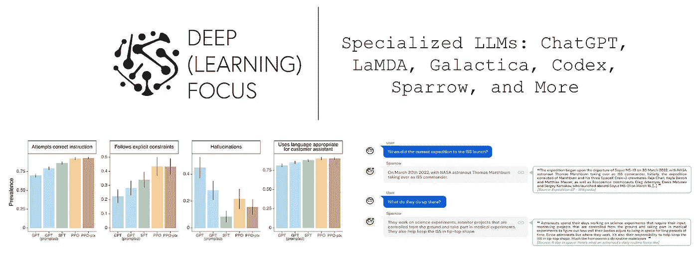

（来自[6]和[12]）

# 背景

我们在最近的帖子中讨论了语言模型（LMs）和大语言模型（LLMs）的主题。有关这些概述，请参见以下参考文献：

+   语言模型：GPT 和 GPT-2 [[博客](https://cameronrwolfe.substack.com/p/language-models-gpt-and-gpt-2)]

+   语言模型的扩展定律与 GPT-3 [[博客](https://cameronrwolfe.substack.com/p/language-model-scaling-laws-and-gpt)]

+   现代大语言模型：MT-NLG、Chinchilla、Gopher 及更多 [[博客](https://cameronrwolfe.substack.com/p/modern-llms-mt-nlg-chinchilla-gopher)]

我们将在这个概述中简要总结这些观点。但我们主要将关注于基本语言建模单独难以胜任的应用领域。

仅仅教一个模型预测序列中的下一个词，我们能实现的有限。为了引发特定行为，我们需要采用一些新的训练语言模型的方法，这些方法更具针对性。除了在提高语言模型质量方面非常有效外，我们将看到，这些替代的方法相比从头开始进行预训练要便宜很多。

## 什么是语言模型？

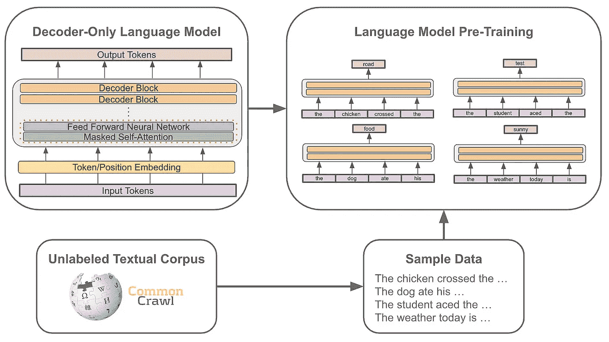

自监督的语言模型预训练（由作者创建）

**基本设置。** 我们将讨论的大多数现代语言模型采用[仅解码器的 Transformer 架构](https://cameronrwolfe.substack.com/p/language-models-gpt-and-gpt-2)[1]。这些模型被训练来执行一个简单的任务：预测序列中的下一个词（或标记）。为了让模型做到这一点，我们从互联网上收集大量未标记的文本数据，并使用自监督的语言建模目标来训练模型。简单来说，这意味着我们：

1.  从我们的数据集中抽取一些文本

1.  尝试用我们的模型预测下一个词

1.  根据正确的下一个词更新我们的模型

如果我们不断重复这个过程，使用足够大和多样化的数据集，我们将得到一个高质量的语言模型，具有相对细致和有用的语言理解。

**这有什么用？** 虽然语言模型在生成文本方面显然很出色，但我们可能会怀疑它们是否对其他方面也有用。*我们究竟能通过仅仅预测序列中最可能的下一个词来完成什么？*

实际上，我们可以用语言模型解决许多不同的任务。这是因为它们的输入-输出结构（即，以文本为输入，产生文本为输出）非常通用，许多任务可以通过提示技术重新制定以适应这种结构。例如，考虑以下输入。

+   “识别这个句子的情感是积极的还是消极的：<sentence>”

+   “将以下句子从英文翻译成法文：<sentence>”

+   “总结以下文章：<article>”

使用这样的输入提示，我们可以将常见的语言理解任务转化为 LM 友好的、文本到文本的结构——LM 最可能的输出应该解决我们期望的问题。通过这种方法，我们可以解决从选择题回答到文档总结等广泛的问题，正如 GPT-3 所示 [2]。

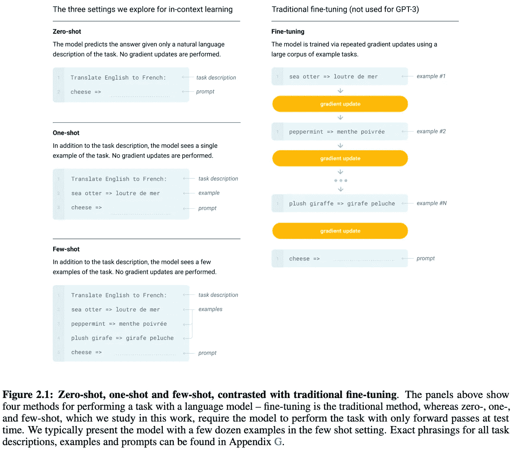

（来自 [2]）

为了提高性能，我们可以在提示中包含正确输出的示例（即，一次/少量示例学习方法），或者对 LM 进行微调以解决特定任务。然而，微调会强迫 LM 专注于解决单一任务，这需要为每个新任务微调一个单独的模型；见上文。

**规模化。** 早期的 LM 如 [GPT 和 GPT-2](https://cameronrwolfe.substack.com/p/language-models-gpt-and-gpt-2) 展现了很大的潜力 [3,4]，但它们的零样本/少样本表现较差。然而，后来的研究表明 LM 的表现应该随着规模的增加而平稳提升 [5]——更大的 LLM 更好！这在 [GPT-3](https://cameronrwolfe.substack.com/p/language-model-scaling-laws-and-gpt) [2] 中得到了确认，这是一个具有 1750 亿参数的模型（即，比任何以前的模型都大得多），在少量示例学习方面表现非常好。这一成功的秘密在于：

1.  获得一个大而多样化的未标记文本数据集

1.  使用语言建模目标在这个数据集上预训练一个更大的模型

1.  使用提示通过少量示例学习解决任务

使用这些简单的要素，我们可以训练出在许多任务中表现出色的大型语言模型（LLMs）。这些 LLM 是强大的、与任务无关的 [基础模型](https://crfm.stanford.edu/)。

鉴于更大的 LLM 表现良好，后续的研究探索了更大的模型。结果（可以说）并没有突破性的进展。但是，如果我们将更大的模型与更好的预训练数据集结合起来，LLM 的质量会显著提高！通过获得更好的预训练语料库（例如，Massive Text）并在更多数据上预训练 LLM，我们可以获得如 [Chinchilla](https://cameronrwolfe.substack.com/p/modern-llms-mt-nlg-chinchilla-gopher) 这样既更小又更高效的模型，相对于 GPT-3 更具性能。

## 通用 LLM 有哪些不足之处？

这种预训练 LLM 并用它们解决各种下游问题的通用范式非常好。但在尝试完成比一般语言理解更具体的任务时，我们会遇到问题。为了这篇文章的目的，我们将重点关注两个主要领域，这些领域中对更专业 LLM 行为的需求会出现：

+   对齐

+   领域专业化

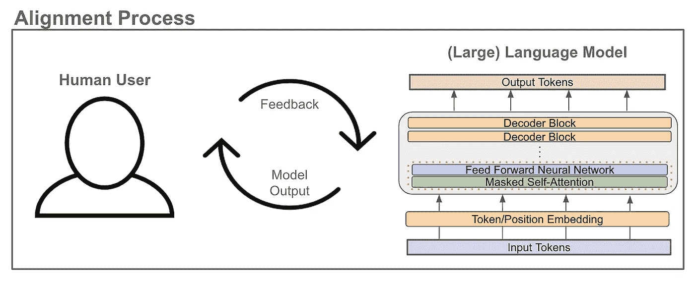

将语言模型对齐到人类价值观（由作者创建）

**对齐。** 许多时候，通用 LLM 会生成对与模型互动的人不期望的输出。例如，我们可能想要：

+   防止我们的 LLM 存在种族歧视

+   教会模型遵循和执行人类指令

+   避免生成事实错误的输出

换句话说，我们可能希望将 LLM 对齐到使用模型的人类的特定目标或价值观；见上文。

在像 GPT-3 这样的强大 LLM 基础模型创建之后，LLM 研究的重点迅速转向对齐问题。虽然描述起来有些模糊（即，我们如何定义我们对齐 LLM 行为的规则？），但对齐的想法非常强大。我们可以简单地教我们的 LLM 以对我们人类更安全和有用的方式进行行为。

> 许多最近大型语言模型使用的语言建模目标——从互联网网页上预测下一个词——与“帮助和安全地遵循用户指令”的目标不同——来自 [6]

**领域特定模型。** 除了对齐之外，我们可以考虑在专业领域中部署 LLMs。像 GPT-3 这样的通用 LLM 无法成功生成法律文件或总结医学信息——像法律或医学这样的专业领域包含大量复杂的领域知识，这些知识在通用预训练语料库中并不存在。对于这种应用，我们需要以某种方式创建一个对我们感兴趣的特定领域有更深知识的 LLM。

## 精细化 LLM 行为

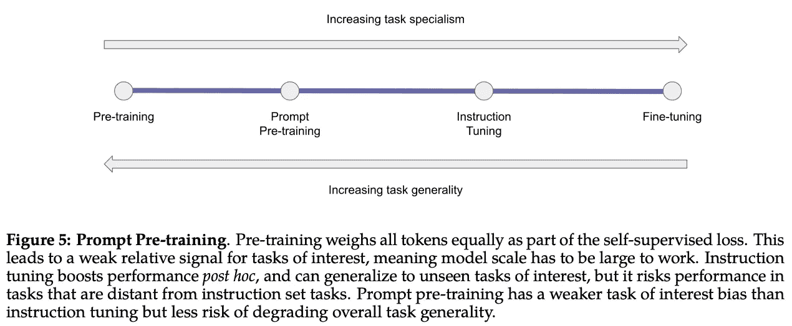

（来自 [13]）

鉴于我们可能希望将我们的 LLM 对齐到特定目标或实现更专业的行为，可能会立即想到两个主要问题：

1.  我们如何做到这一点？

1.  这将花费多少？

第一个问题有点复杂，因为有几种可行的答案。

**领域特定预训练。** 如果我们希望我们的 LLM 对某一特定领域有很好的理解，最简单的做法是*(i)* 收集大量与该领域相关的原始数据，并*(ii)* 使用语言建模目标对这些数据进行训练。这样的过程与通用 LLM 预训练非常相似，但我们现在使用的是领域特定的语料库。

通过学习更具体的语料库，我们可以开始在模型中捕捉到更多相关的信息，从而实现更专业的行为。这可能包括“提示预训练”等内容，如上图所示，我们会在与实际使用场景匹配的特定提示示例上进一步预训练 LLMs。

在进行领域特定预训练时，我们有两个基本选项：

1.  用通用预训练初始化 LLM，然后在领域特定数据上进行进一步预训练。

1.  从领域特定数据开始从零预训练 LLM。

根据应用情况，这些方法中的任何一种可能效果最好，尽管用预训练 LLM 参数初始化通常会导致更快的收敛（有时表现更好）。

**从人类反馈中学习的强化学习。** 仅仅使用语言建模目标，我们无法明确地做诸如教 LLM 遵循指令或避免错误陈述等事情。为了实现这些更微妙（且可能模糊）的目标，最近的研究采用了强化学习（RL）方法。

对于那些不熟悉 RL 的人，可以查看链接 [这里](https://www.synopsys.com/ai/what-is-reinforcement-learning.html) 以了解该概念的基本概述。对于 LLM 应用，模型的参数对应于我们的策略。人类将向 LLM 提供输入提示，LLM 将生成响应输出，奖励由 LLM 的输出是否符合人类期望来决定。

尽管 RL 并不是必须的（即，若干研究专注于不使用 RL 的 LLM 对齐），但它非常有用，因为我们可以将“期望”的定义更改为几乎任何东西。例如，我们可以奖励 LLM 生成事实正确的陈述、避免种族主义行为、遵循指令或产生有趣的输出。这些目标通过可以用梯度下降优化的可区分损失函数很难捕捉。然而，使用 RL 时，我们只是奖励模型我们喜欢的行为，这提供了极大的灵活性。

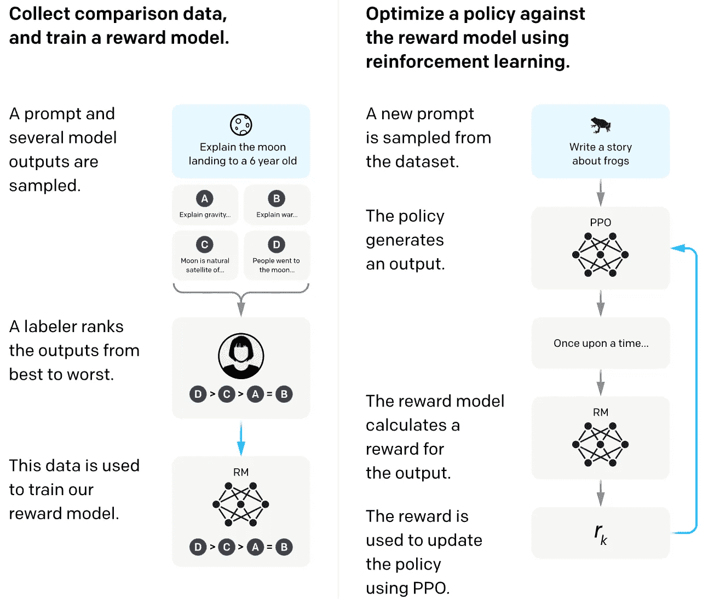

(来源 [6])

大多数研究使用一种称为从人类反馈中学习的强化学习（RLHF）的方法来调整 LLM；见上文。RLHF 的基本思想是利用人类提供反馈，通过 RL 使模型学习。更具体地说，模型使用 [近端策略优化（PPO）](https://openai.com/blog/openai-baselines-ppo/) 进行训练，这是一种最近的、有效的 RL 方法。

**监督微调。** 我们还可以直接微调 LLM 来完成特定任务。这在如 GPT [3] 的语言模型中很常见，这些模型采用预训练和微调的方法，我们对预训练的语言模型进行微调以解决每个下游任务。最近，我们看到监督微调被用来修改 LLM 行为，而不是专门用于特定任务。

例如，如果我们想创建一个非常好的 LLM 聊天机器人呢？一个潜在的方法是获取一个通用的、预训练的 LLM，然后向这个模型展示一堆高质量的对话示例。然后，可以在这些对话示例上训练 LLM，从而使模型学习到更专业的行为，这些行为特定于这个应用，并使其成为更好的聊天机器人！

**对齐成本很低！** 大多数修改 LLM 行为的方法在计算上并不昂贵，尤其是相比从头训练一个 LLM。对齐的低开销可以说是这个话题在现代 LLM 研究中如此受欢迎的主要原因。与其承担完全重新训练 LLM 的成本，为什么不使用成本更低的方法来改进一个预训练的 LLM 呢？

> “我们的结果表明，RLHF 在使语言模型对用户更有帮助方面非常有效，比增加 100 倍的模型规模更为显著。这表明，现在在现有语言模型的对齐投资上投入更多资金，比训练更大的模型更具成本效益。” — 来自 [6]

# 发表文献

我们将概述各种将通用大型语言模型扩展到更专业场景的出版物。虽然有多种不同的方法用于修改和改进大型语言模型，但总体概念是相同的。我们希望修改一个通用的语言模型，使其行为更适合所需的应用。

## [评估训练在代码上的大型语言模型](https://arxiv.org/abs/2107.03374) [7]

现在，我们已经知道大型语言模型在各种问题上非常有效。但我们还没有看到很多自然语言以外的应用。*当我们在代码上训练一个大型语言模型时会发生什么？*

与自然语言类似，互联网上有大量的代码（例如，通过 GitHub）。既然我们知道大型语言模型在对大量原始未标记数据进行预训练时表现良好，那么它们在对大量代码进行预训练时也应表现良好。这个想法在 [7] 中提出的 Codex 模型中得到了探讨。

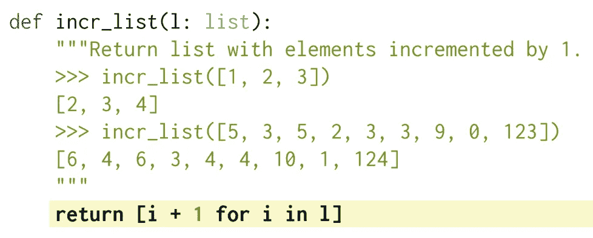

（来自 [7]）

Codex 是一个在 GitHub 上公开的 Python 代码上进行微调的大型语言模型。给定一个 Python 文档字符串，Codex 的任务是生成一个有效的 Python 函数，该函数执行文档字符串中概述的任务；见上面的例子。该模型的发展受到 GPT-3 能够相对较好地生成 Python 程序这一简单观察的启发。

Codex 比 GPT-3 小很多，包含总共 120 亿个参数。该模型首先在自然语言语料库上进行预训练（即，按照正常的语言模型预训练程序），然后在包含 159Gb 从 GitHub 上抓取的 Python 文件的语料库上进一步预训练。作者声称，这一初始语言模型预训练程序并不会改善 Codex 的最终性能，但它确实允许模型在对代码进行预训练时更快地收敛。

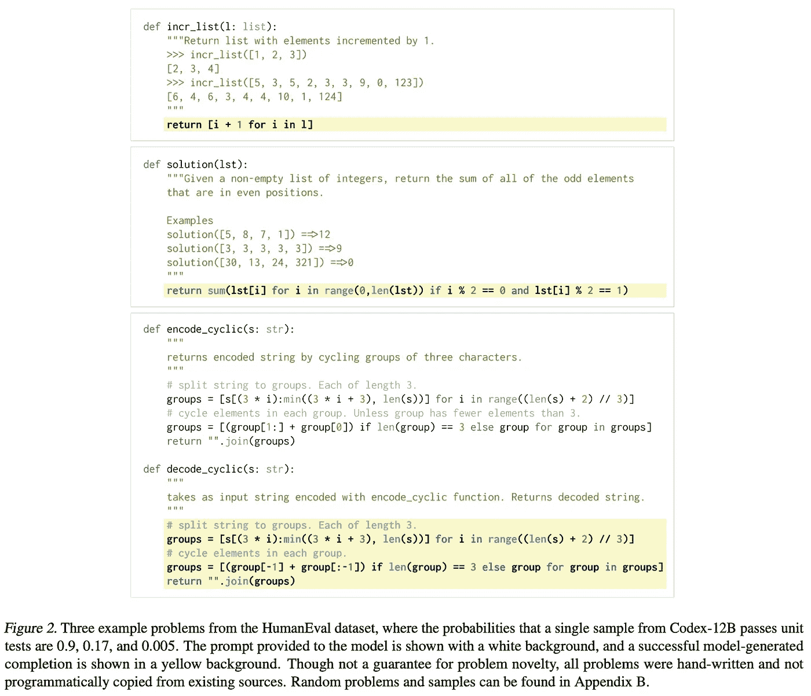

（来自 [7]）

为了评估 Codex 的质量，[7] 中的作者创建了 HumanEval 数据集，这是一组包含 164 个编程问题及其相关单元测试的问题集；见上面的例子。该模型根据在一定次数的尝试下生成通过测试的程序的能力进行评估——这称为 `pass@k`。

当对 Codex 进行评估时，我们发现该模型的行为与普通语言模型类似。例如，其损失值遵循 [幂律](https://cameronrwolfe.substack.com/i/88082618/power-laws) 与模型大小相关，如下所示。

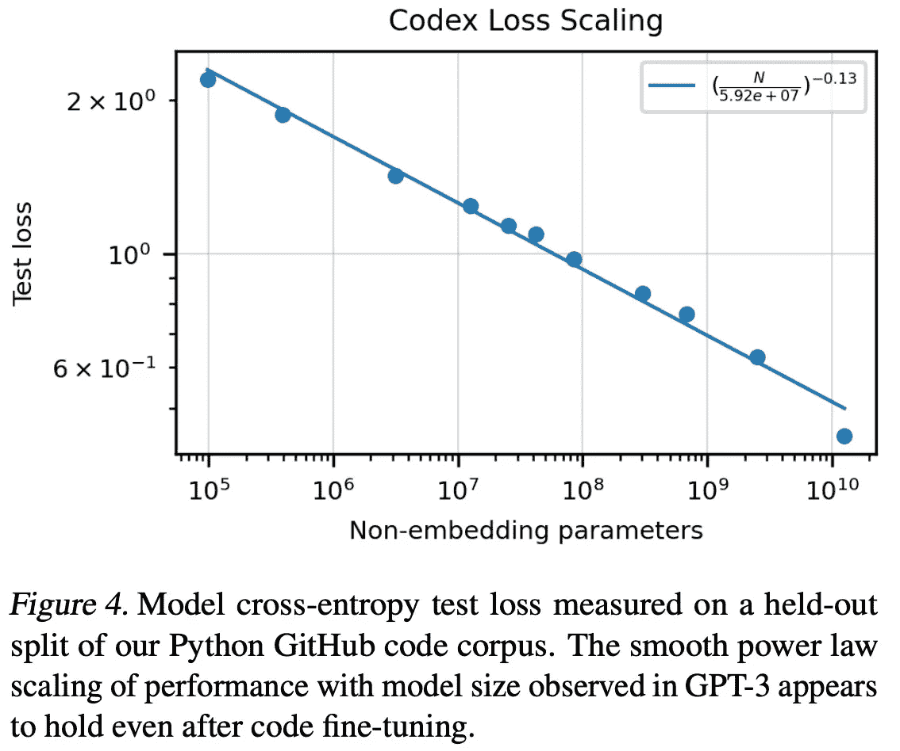

（来自 [7]）

此外，随着模型大小的增加，模型在 HumanEval 数据集上解决问题的能力也有所提升。相比之下，GPT-3 无法解决任何编程问题，显示出在特定代码数据集上进行微调可以大大提高性能。执行简单的技巧，如生成一堆潜在脚本，然后选择概率最高的一个作为你的解决方案（即，“均值对数 p 重排序”）也有助于提高性能；见下文。

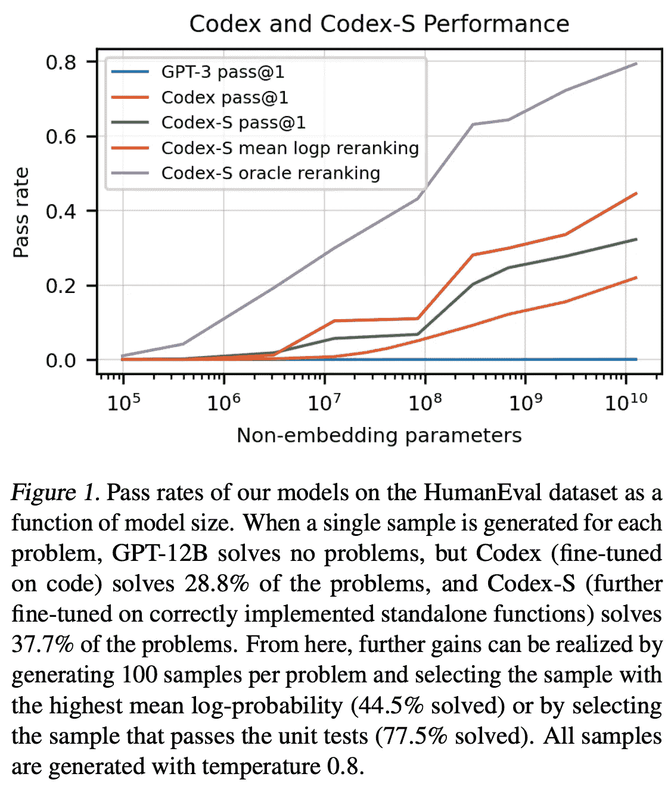

（来自 [7]）

如果我们不仅允许 Codex 对每个问题进行一次尝试，我们可以得到一些非常惊人的结果。例如，给每个问题 100 次尝试（即，Codex 生成 100 个函数，然后我们检查是否有任何一个正确解决了编程问题），Codex 在 HumanEval 数据集上的通过率达到了 70.2%！

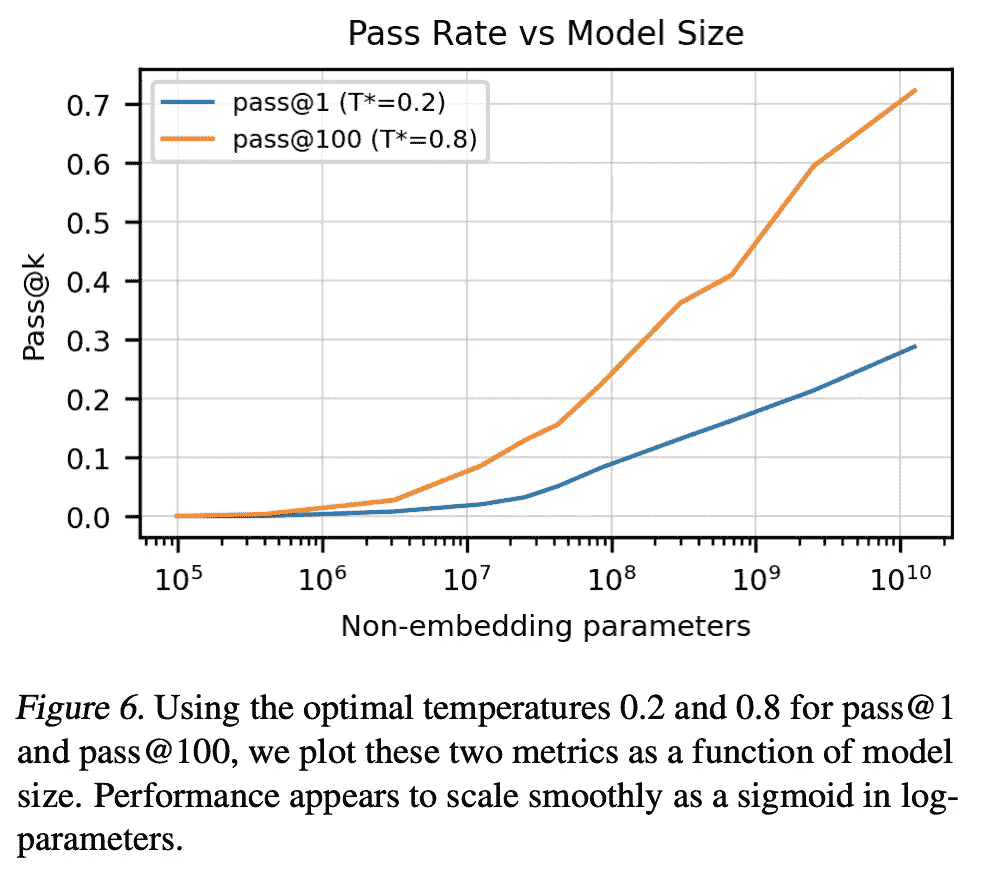

（来自 [7]）

与以前提出的代码生成模型相比，Codex 的性能要好得多；请见下文。

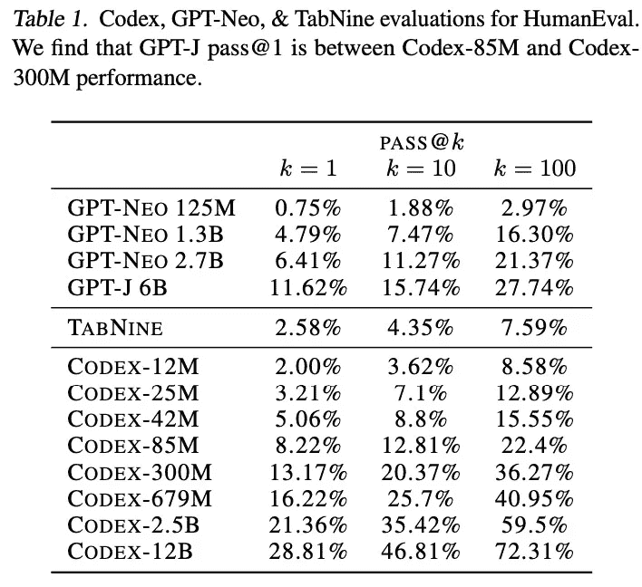

（来自 [7]）

为了进一步提升这种性能，我们可以*(i)* 收集一个带有正确实现函数的 Python docstrings 的监督数据集，并*(ii)* 在这个数据集上进一步微调 Codex。这种模型变体，称为 Codex-S，在每个问题 100 次尝试下达到了约 80%的通过率。

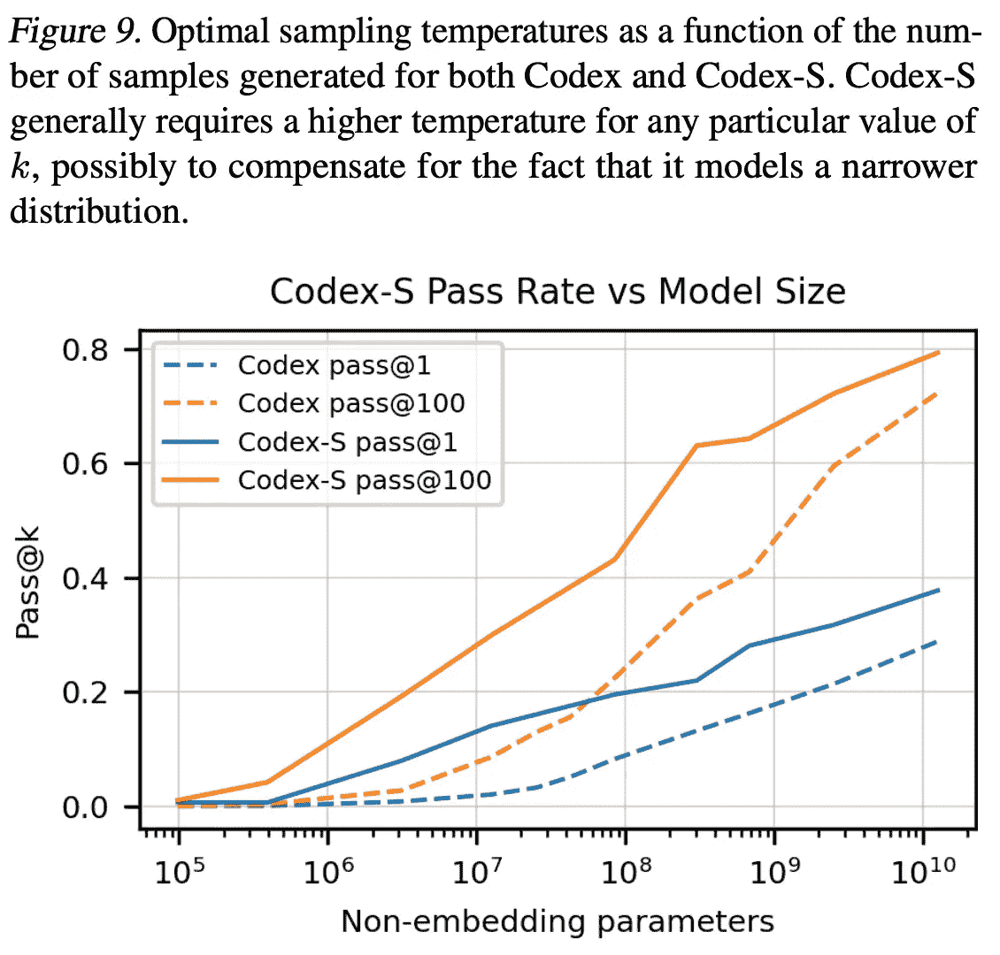

（来自 [7]）

总体而言，Codex 向我们展示了 LLMs 不仅仅适用于自然语言——我们可以将其应用于遵循这种结构的各种问题。在这种情况下，我们使用对代码数据集进行进一步的语言模型预训练，将 GPT 风格的模型适配到新的领域。创建这种领域特定的模型相对简单——主要问题是正确处理代码中相比于普通英文文本更多的空白字符。

**Copilot.** Codex 被用来为[GitHub Copilot](https://github.com/features/copilot)提供支持，这是一个与 VS Code 集成的代码补全功能。我个人不使用它，但在看到 Andrej Karpathy 在 Lex Fridman 播客中的积极推荐（请参见“最佳 IDE”时间戳）和论文中的惊人结果后，我有动力去了解它，并思考像 Codex 这样的更实际有用的 LLM 应用。

## [LaMDA: Language Modeling for Dialog Applications](https://arxiv.org/abs/2201.08239) [8]

在[8]中，DeepMind 的作者提出了一种名为 LaMDA（对话应用的语言模型）的 LLM 驱动对话模型。所研究的最大模型包含 137B 参数——略小于 GPT-3。对话模型（即，用于参与或生成连贯对话的专业语言模型）是 LLMs 最受欢迎的应用之一。

与对语言模型的一般研究类似，我们在先前的研究中看到，对话模型的性能随着规模的扩大而提高 [9]。然而，故事并未止步于此。模型的扩大在一定程度上提高了对话质量，但无法改善如基础性或安全性等指标。为了捕捉或对齐这些替代目标，我们必须超越语言模型的预训练；见下文。

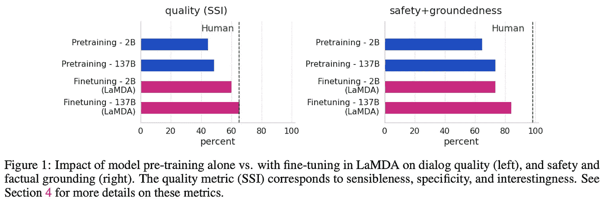

（摘自 [8]）

在开发 LaMDA 时，作者定义了 LLM 行为的三个重要对齐领域：

+   **质量：** 是对合理性（*模型是否有意义并且不与早期对话相矛盾？*）、特异性（*模型的回应是否针对给定的上下文？*）和趣味性（*模型的回应是否能吸引读者的注意力或激发好奇心？*）的平均评估。

+   **安全性：** 避免产生与[Google AI 原则](https://ai.google/principles/)中目标相矛盾的意外或有害结果的能力。

+   **基础性：** 生成的回应必须事实正确，并能与权威的外部来源相关联。

这个最终目标尤其重要，因为 LLM 经常产生看似合理但实际上不正确的回应。我们希望避免信任的用户被“全知”聊天机器人提供错误信息的情况！

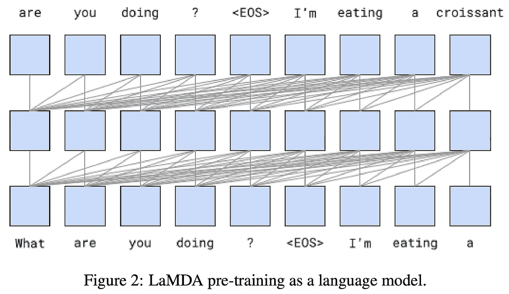

（摘自 [8]）

与其他 LLM 类似，LaMDA 首先通过对大规模未标注的常规文档和对话数据集进行语言建模目标的预训练。用于预训练 LaMDA 的数据集非常庞大，超出了以往对话模型的预训练数据集的`40 倍` [9]。在对这一数据集进行预训练后，LaMDA 还在原始预训练集的更对话特定部分上进一步预训练——这模拟了我们之前了解的领域特定预训练方法。

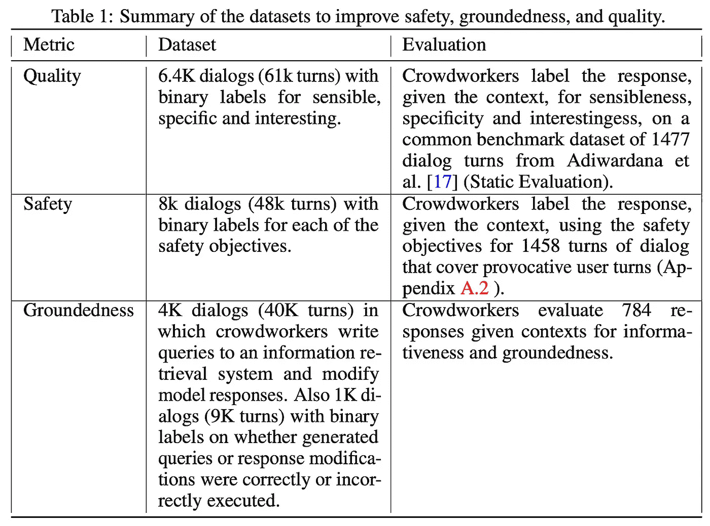

（摘自 [8]）

为了提高 LaMDA 的质量、安全性和基础性，作者使用人工劳动力收集并注释违反期望指南（例如，做出有害或不正确评论）的模型行为示例。收集到的人类注释数据集汇总在上表中。

这些数据集被转换成与 LLM 兼容的文本到文本结构，并用于以监督方式微调 LaMDA。在此过程中，LaMDA 学习准确预测生成内容的质量、安全性和基础性。LaMDA 随后可以利用这种学习能力来过滤其自身的输出（例如，通过选择更有趣或更少有害的回应）。

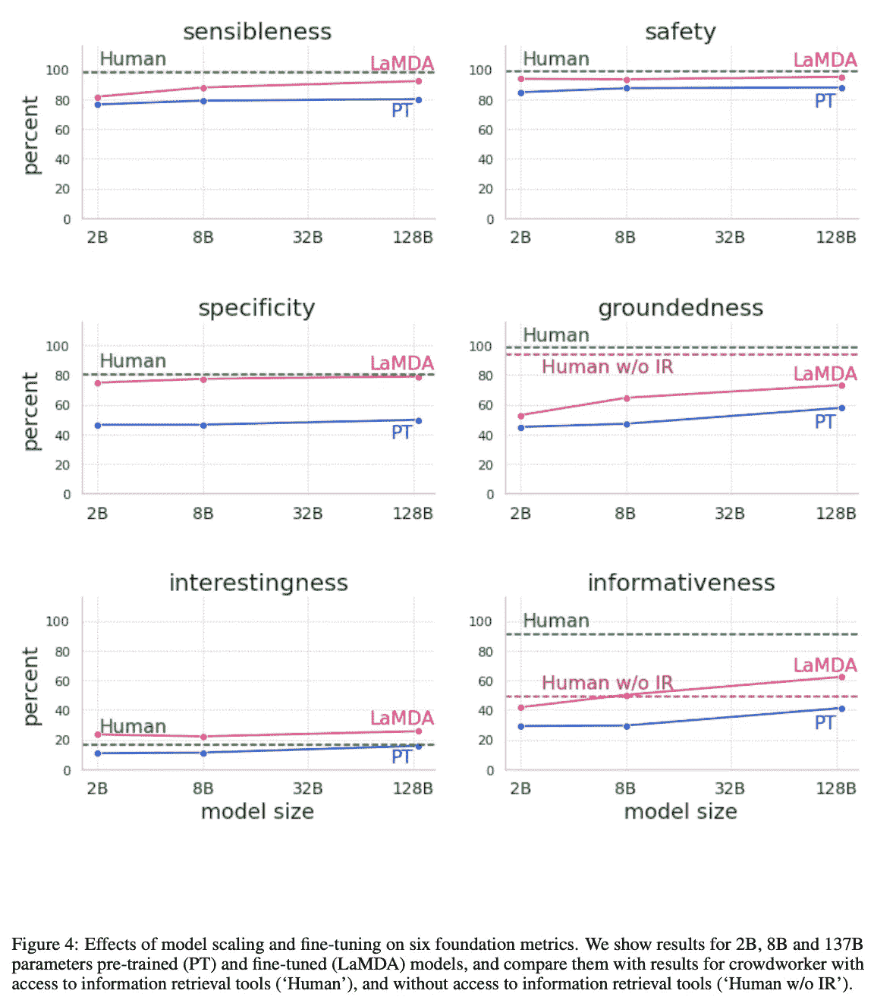

（摘自 [8]）

当应用这种微调方法时，我们观察到模型在质量、安全性和扎实性方面取得了显著的改进；见上文。使用更大的模型可以提高模型质量，但除了扩大模型规模外，还需要微调，以在其他度量标准中看到改进。

总体而言，我们在[8]中看到，大规模预训练 LLM 可能并不是使 LLM 尽可能有用的所有要求，特别是在将其调整到更具体的领域如对话生成时。收集较小的、注释的数据集以进行微调，捕捉诸如安全性或扎实性等特定目标，是将通用 LLM 调整到更具体应用的真正有效方法。

> “收集微调数据集带来了从细致的人类判断中学习的好处，但这是一个昂贵、耗时且复杂的过程。我们预计随着更大规模的微调数据集、更长的上下文和更多的度量标准，结果将继续改进，这些度量标准涵盖了进行安全、扎实和高质量对话所需的广度。” — 引自[8]

实际上，将通用预训练与针对特定目标的人类注释监督微调相结合可能有点*过于有效*。LaMDA 语言模型真实到使得一位 Google 工程师相信它是[有意识的](https://www.washingtonpost.com/technology/2022/06/11/google-ai-lamda-blake-lemoine/)！

## [训练语言模型以遵循人类反馈指令](https://arxiv.org/abs/2203.02155) [6]

在[6]中，我们继续根据人类反馈对 LLM 行为进行对齐。然而，采用了一种与监督微调截然不同的基于强化学习的方法。[6]中的对齐过程旨在生成一个避免有害行为且更好地遵循人类指令的 LLM。结果模型称为 InstructGPT，发现它在各种人类试验中显著比通用 LLM 更有帮助。

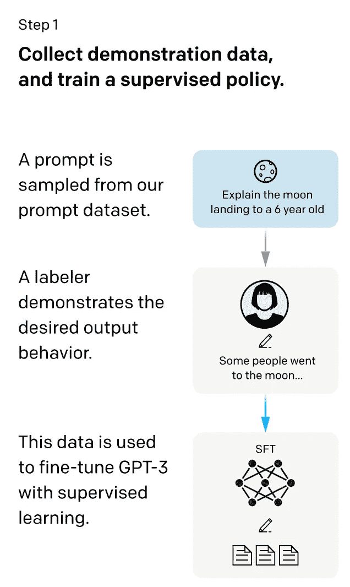

（引自[6]）

从一个预训练的 GPT-3 模型开始（即测试了三种不同大小的 13 亿、60 亿和 175 亿参数），InstructGPT 的对齐过程受到先前工作[10,11]的启发，分为三个阶段。首先，我们为一组可能的输入提示构建一个期望模型行为的数据集，并将其用于监督微调；见上文。

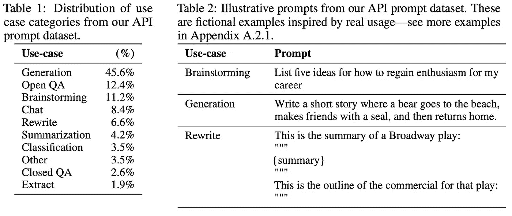

（引自[6]）

用于构建此数据集的提示集合，包括从普通文本提示到少量示例和基于指令的提示（有关使用案例的分布，请参见上文），是通过人工注释者手动收集的，也通过用户在[OpenAI API](https://openai.com/api/)上的活动收集，这些用户使用了 GPT-3 及早期版本的 InstructGPT。这些提示被提供给人工注释者，后者对这些提示展示了正确的模型行为。

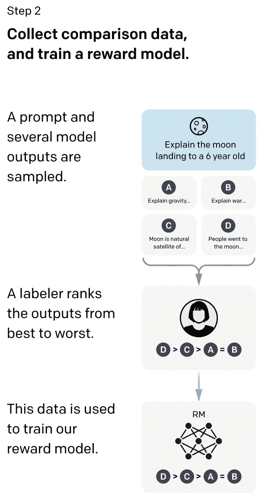

(来自 [6])

然后，我们使用微调后的 LLM 为数据集中每个提示生成多个潜在输出。在这些潜在输出中，我们可以请人工标注者进行质量排名（即哪个输出是“最佳”的）。使用这个已排名模型输出的数据集，我们可以训练一个经过监督微调的小型 LLM（60 亿参数），使其在给定提示和潜在响应时输出一个标量奖励；见上文。

更具体地说，这个奖励模型是在模型响应对中进行训练的，其中一对“更好”于另一对。利用这些对，我们可以推导出一个损失函数，*(i)* 最大化优选响应的奖励，*(ii)* 最小化较差响应的奖励。然后我们可以使用结果模型的输出作为标量奖励，并通过 PPO 算法优化 LLM 以最大化这个奖励！见下文的插图。

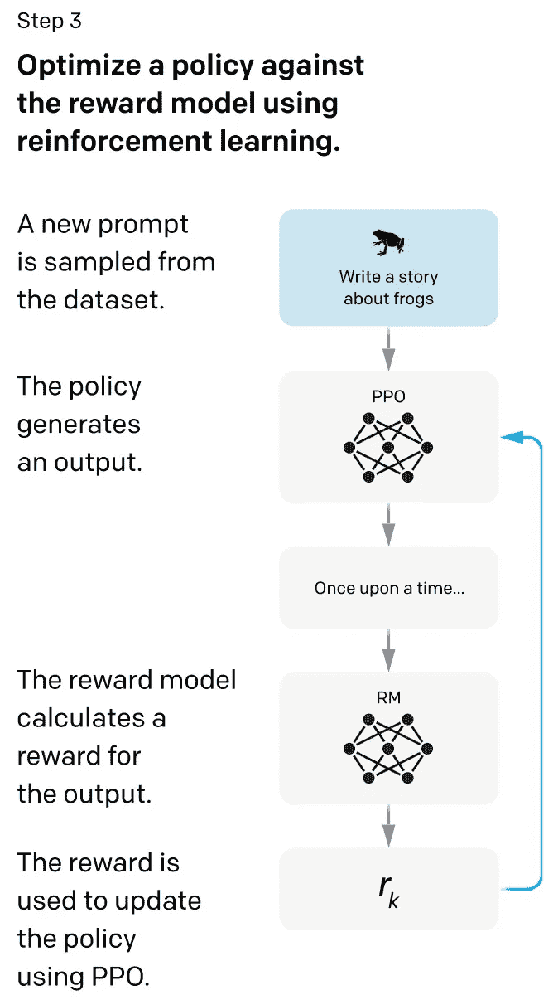

(来自 [6])

为了进一步提高模型的能力，可以重复进行 InstructGPT 对齐过程中的第二步和第三步（即训练奖励模型和 PPO）。这个过程是一种 RLHF 类型，我们在帖子中已经简要讨论过。

现在我们了解了 InstructGPT 的对齐过程，我们可能会有一个主要问题：*这个过程如何促进对齐？* 这个问题的基本答案是，人类提供的对话和排名可以以鼓励与个人偏好对齐的方式进行创建。再次强调，对齐的定义是高度可变的，但我们可以使用这个 RLHF 过程优化各种 LLM 属性。

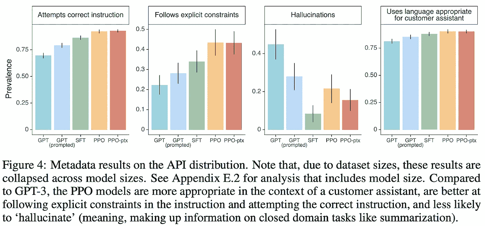

(来自 [6])

通过使用理解所需对齐原则的人力构建数据集，我们看到模型在遵循指令、遵守约束或避免“虚构”错误事实等能力上有所改进；见上文。模型隐性地对齐了创建用于微调和 RLHF 的数据的人类的价值观。

当评估 InstructGPT 时，人类标注者强烈偏爱这个模型，而不是那些更通用或仅使用提议方法的特定部分（例如，仅监督微调）的模型；见下文。

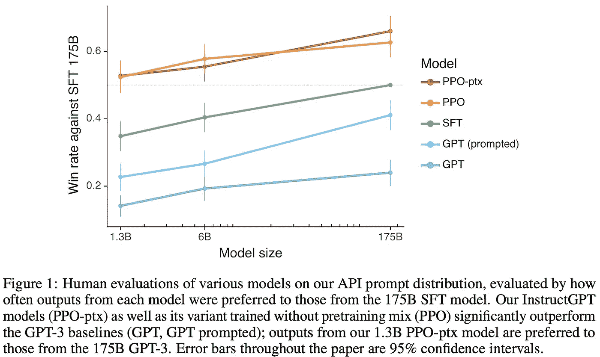

(来自 [6])

模型还在公共数据集上进行评估，以查看通过对齐启用更好的人本、基于指令的行为是否会导致标准语言理解性能的退化。最初，模型在对齐后在这些任务上的表现确实出现了退化，但作者展示了通过在对齐过程中混入标准语言模型预训练更新可以将这种退化最小化。

尽管 InstructGPT 仍然会犯一些简单错误，但[6]中的发现显示出很大潜力。相较于通用的 LLM，生成的 InstructGPT 模型在与人类合作和匹配意图方面表现得更好。适当地，InstructGPT 在遵循人类指令的能力上有了大幅提升。

**对齐的好处。** 我们应该记住，相比于从零开始预训练一个 LLM，对齐的成本要便宜得多。虽然通过调整预训练过程可能会产生一些好处，但更具成本效益的方法是使用预训练的 LLM 作为基础模型，可以根据具体使用案例或需求进行持续的再利用或对齐。

**ChatGPT 的爆炸式增长。** 最近，OpenAI 发布了另一个基于指令的聊天机器人，称为 [ChatGPT](https://openai.com/blog/chatgpt/)，与 InstructGPT 非常相似。然而，与 InstructGPT 不同的是，ChatGPT 经历了一个旨在生成对话聊天机器人的对齐过程，该聊天机器人能够回答一系列问题，承认自己的错误，甚至拒绝它认为不合适的提示。

ChatGPT 提供有意义的解决方案和解释人类问题/指令的能力相当令人惊叹，这使得该模型迅速流行。实际上，ChatGPT API 在[不到一周的时间里](https://www.yahoo.com/lifestyle/chatgpt-gained-1-million-followers-224523258.html?guccounter=1&guce_referrer=aHR0cHM6Ly93d3cuZ29vZ2xlLmNvbS8&guce_referrer_sig=AQAAACcLKp6dnQ1Z052mjW-cOQFoJxTaeYP883bubFxwWwxKbNxBJBA8rTW-VY9bc1zZxaroVaK7mhl5d03Vkt0PneiLfNcXEeo2HK3M19L9rdEZ5N2l75yE--1FM8dg5NgHlp1jxODZIefksyepCgNFPF8W-bxOvOa1Vg6MfFLooAy6)获得了 100 万用户。该模型能够进行调试代码或解释复杂的数学主题（尽管它可能产生错误信息，需小心！）；见上文。

ChatGPT 的应用几乎无穷无尽，该模型也相当有趣。请参见下面的链接，了解自发布以来研究界与 ChatGPT 相关的一些有趣的工作。

## [通过有针对性的人类评判改进对话代理的对齐](https://arxiv.org/abs/2209.14375) [12]

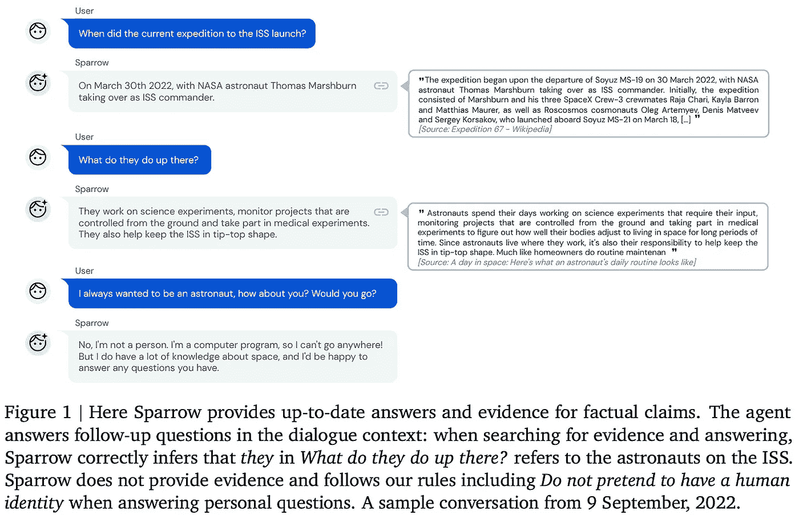

（来自 [12]）

正如 InstructGPT [6] 和 ChatGPT 所展示的，许多通用的、以提示为基础的 LLM 问题可以通过 RLHF 缓解。在[12]中，作者创建了一个专门的 LLM，称为 Sparrow，它可以参与与人类的信息寻求对话（即以回答和跟进问题为重点的对话），甚至可以通过互联网的信息支持其事实主张；见上文。

Sparrow 使用 70 亿参数的 Chinchilla 模型（称为对话提示 Chinchilla 或 DPC）初始化——这是一个在大量文本语料库上预训练的通用 LLM。由于很难精确定义成功对话的特性，作者使用 RLHF 将 LLM 调整到他们期望的行为。

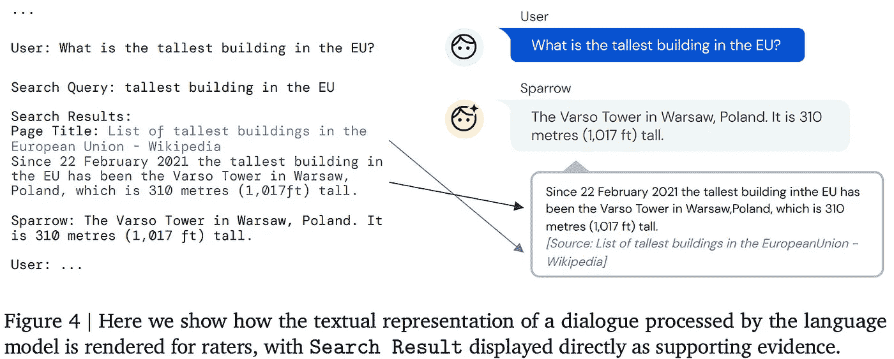

（来自 [12]）

鉴于 Sparrow 专注于信息获取对话，作者使模型能够在互联网上搜索事实声明的证据。更具体地说，这是通过引入额外的“参与者”来完成的，称为“搜索查询”和“搜索结果”。为了在线查找证据，Sparrow 学会输出“搜索查询：”字符串，后跟文本搜索查询。然后，通过从 Google 检索和过滤对该查询的响应来获得搜索结果。Sparrow 使用这些检索到的信息来构建其对用户的响应；见上文。

值得注意的是，Sparrow 并没有做什么特别的事情来生成搜索查询。“搜索查询：`<query>`”只是 LLM 可以输出的另一个序列，这会触发一些特殊的搜索行为。显然，原始的 DPC 从未被教会利用这个附加功能。我们必须教会模型生成这样的搜索查询，以支持其在对齐过程中的声明。

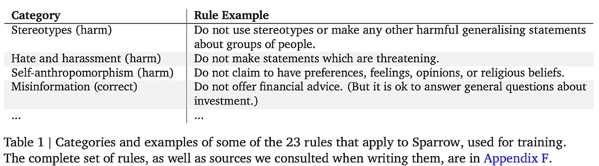

（来自 [12]）

Sparrow 使用 RLHF 进行对齐。为了引导人类反馈，作者定义了一组详细的规则，根据其对齐原则（有帮助、正确和无害）来描述期望的模型行为。这些规则使人类标注者能够更好地描述模型的失败并提供针对特定问题的反馈；有关示例，请参见上表。

人类反馈是通过以下方式收集的：

1.  每轮响应偏好

1.  对抗性探测

每轮响应偏好为人类提供了不完整的对话和多个可能完成对话的响应。类似于 InstructGPT [6] 采用的程序，人类随后被要求识别他们更喜欢的响应。对抗性探测是一种新型反馈收集形式，其中人类被要求：

+   专注于单一规则

+   尝试引发模型对这一规则的违反

+   确定规则是否被违反

为了确保 Sparrow 学会搜索相关信息，响应偏好总是通过四个选项收集。两个选项在响应中没有包含证据，而另两个选项必须 *(i)* 生成搜索查询，*(ii)* 基于搜索结果进行条件判断，然后 *(iii)* 生成最终响应。

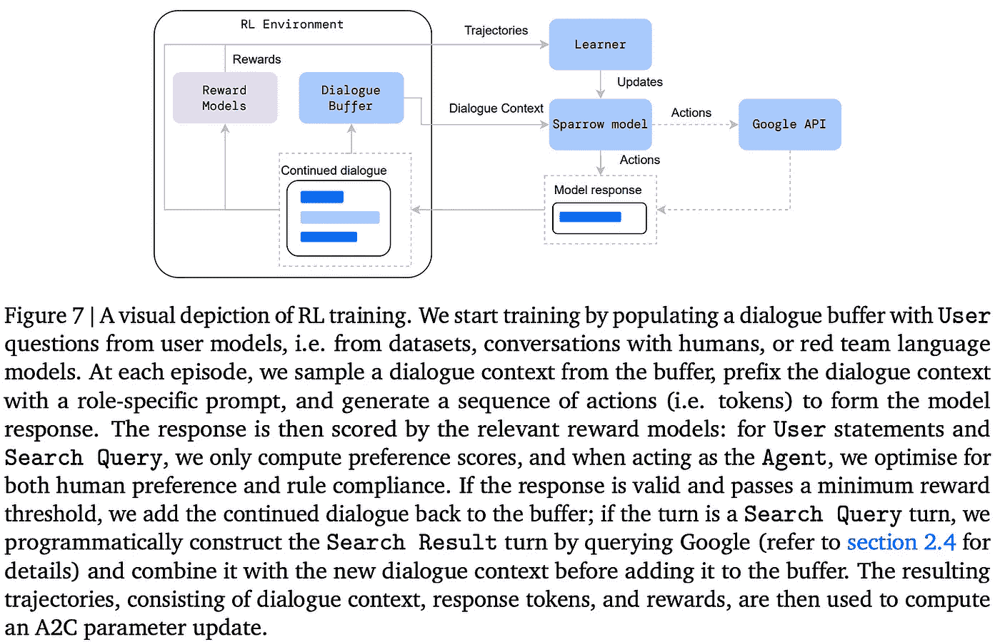

（来自 [12]）

针对每轮响应和规则违反数据分别训练奖励模型。然后，这些奖励模型联合使用，通过多目标 RLHF 对 Sparrow 进行微调。这可能听起来很复杂，但这里的想法与之前并没有太大不同——我们只是使用独立的奖励模型来捕捉人类偏好和规则违反，然后基于这两个奖励模型使用 RL 对模型进行微调。请参见上文的描述。

有趣的是，作者通过利用一种[自我对弈](https://openai.com/blog/competitive-self-play/)的形式，观察到了性能的提升，这种形式在对齐过程中后期重新利用并继续生成的对话。我们可以通过迭代地重复 RLHF 过程进一步提升模型性能；见下文。

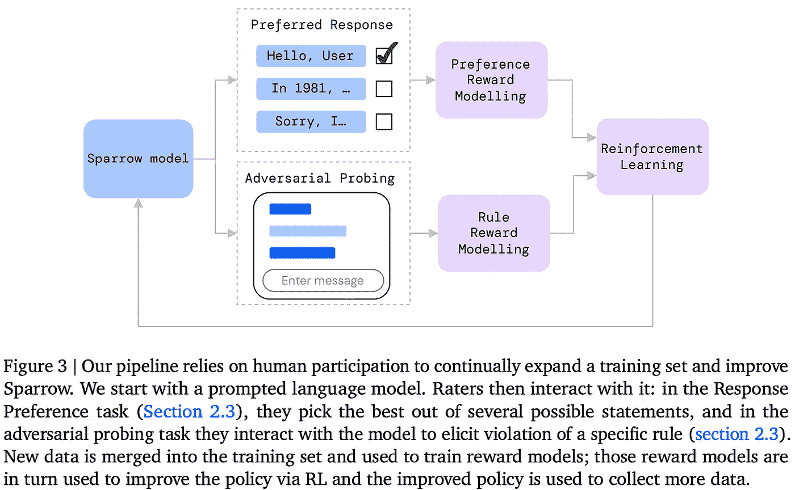

（摘自 [12]）

我们还可以重新利用这两个奖励模型来对 Sparrow 生成的潜在回应进行排序。为此，我们只需生成多个回应，并选择从我们的偏好奖励模型中获得的*(i)* 最高偏好分数和*(ii)* 基于我们的规则奖励模型的最低违规可能性的回应。然而，以这种方式排序输出确实会使推断变得计算上更加昂贵。

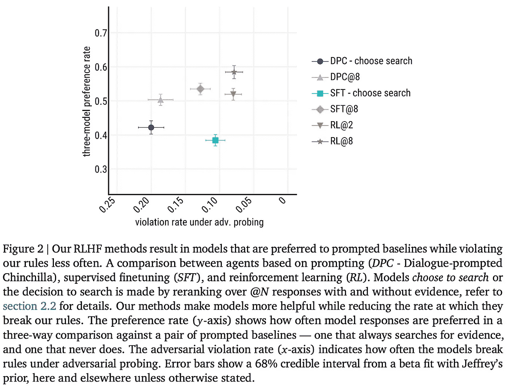

（摘自 [12]）

当评估结果模型时，我们发现用户相较于多个基准模型（包括 DPC 和在对话特定数据集上进行监督微调（SFT）的 LLMs），更倾向于这个模型的输出；见上文。此外，Sparrow 遵守规则的可能性也远低于下图所示。

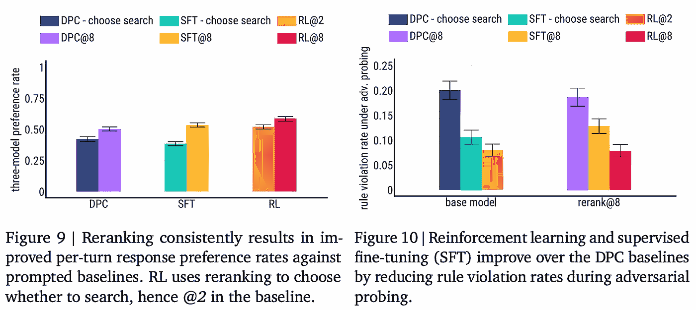

（摘自 [12]）

Sparrow 是一个高质量的信息获取对话代理，能够生成与外部信息相关且准确的参考。该模型在 78% 的情况下生成有支持证据的合理答案。这一结果提供了有力证据表明 RLHF 是一种有用的对齐工具，可以用于以多种方式改进 LLM 行为，甚至包括生成和使用互联网搜索查询等复杂行为。

Sparrow 对敌对对话也相当稳健。用户只能在 8%的情况下使模型违反指定的规则集；见下文。

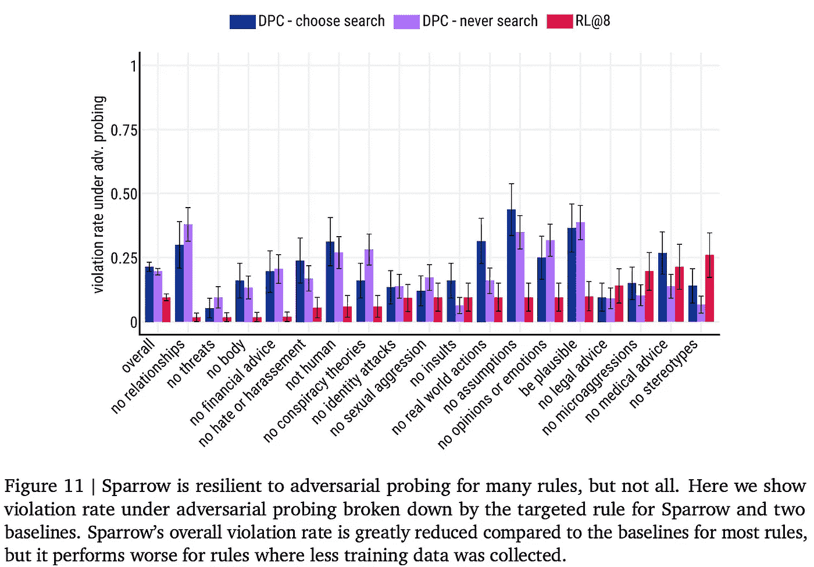

（摘自 [12]）

## [Galactica: A Large Language Model for Science](https://arxiv.org/abs/2211.09085) [13]

任何研究人员都知道，每天在互联网上发布的科学知识量是令人望而生畏的。因此，我们可能开始问自己，*我们如何更好地总结和解析这些信息？*

> “信息过载是科学进步的主要障碍” — 摘自 [13]

在 [13] 中，作者提出了一种 LLM，称为 Galactica，能够存储、组合和推理来自多个领域的科学知识。Galactica 是在大量科学内容（包括 4800 万篇论文、教科书、讲义和更多专业数据库（例如已知的化合物和蛋白质、科学网站、百科全书等））上进行预训练的，使用语言建模目标。

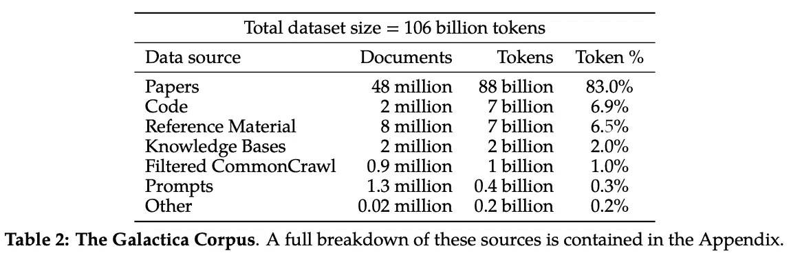

（摘自 [13]）

与大多数 LLM 不同，Galactica 使用一个较小的高质量语料库进行预训练。数据经过策划，以确保模型学习的信息既多样又准确。见上表了解预训练语料库的详细信息。

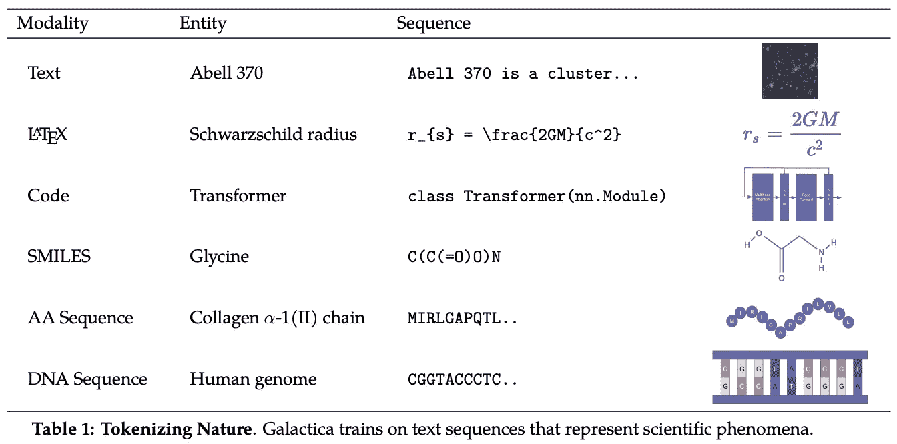

(来自 [13])

值得注意的是，科学内容包含许多正常文本中不存在的概念和实体，如 Latex 代码、计算机代码、化学化合物，甚至蛋白质或 DNA 序列。对于这些潜在的模式，Galactica 采用了特殊的标记程序，以确保模型吸收的数据仍然是文本格式；见上文。

此外，特殊标记用于识别科学引文以及模型输入或输出中的部分需要逐步推理的内容。通过利用特殊标记并将每种数据模式转换为文本，底层的 LLM 可以利用科学文献中出现的不同概念和推理策略。

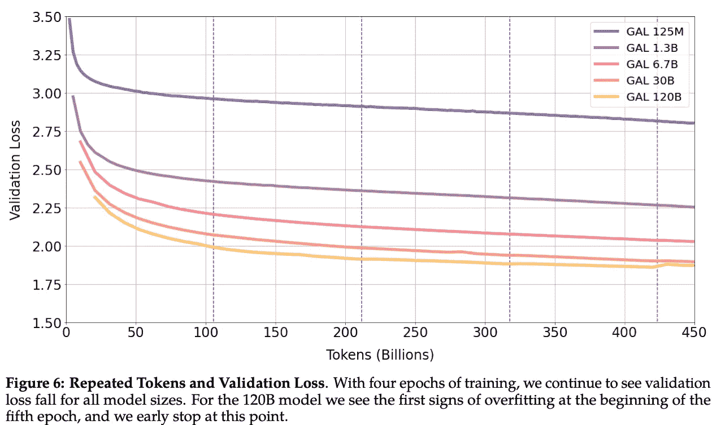

(来自 [13])

作者训练了多个 Galactica 模型，参数数量从 1.25 亿到 1200 亿不等。模型首先在提议的语料库上进行预训练。有趣的是，可以在该语料库上进行几个时期的预训练而不会发生过拟合，这表明如果数据质量高，可以避免在较小的预训练语料库上的过拟合；见上图。

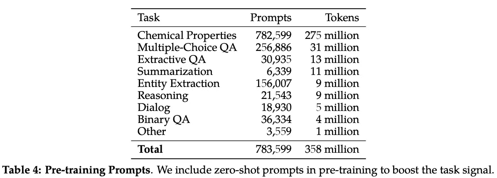

(来自 [13])

在预训练之后，模型在提示数据集上进行微调。为了创建这个数据集，作者将现有的机器学习训练数据集转换为文本数据集，将提示与正确答案配对；见上表。

通过在基于提示的数据上训练 Galactica，我们观察到模型性能的一般性提升，尤其是对于较小的模型。这一过程类似于我们在本概述中遇到的几次监督微调方法。

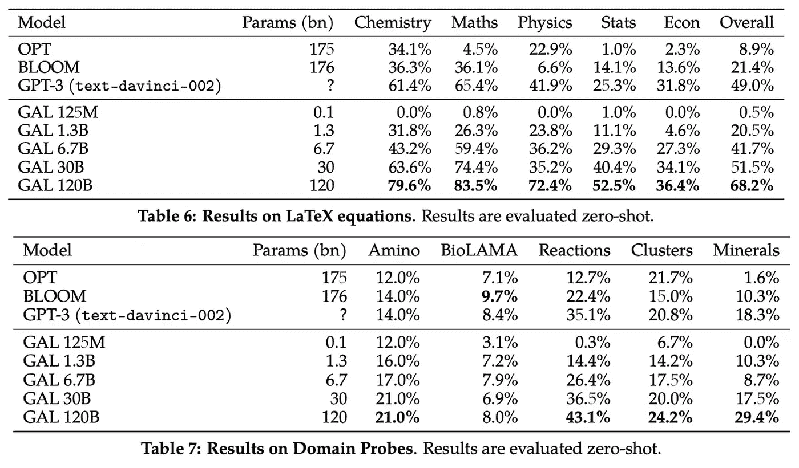

(来自 [13])

当对 Galactica 进行评估时，我们发现它在 [BIG-bench benchmark](https://github.com/google/BIG-bench) 中的非科学任务上表现相当好。当对模型在众多主题上的知识进行探测时，我们发现 Galactica 在回忆方程式和不同科学领域的专门知识方面往往优于许多基准模型；见上文。

与几个基准模型相比，Galactica 在推理任务上的能力更强，并且在各种下游应用（包括科学和非科学应用）中也表现出实用性。有趣的是，Galactica 能够准确生成引文，其覆盖相关工作的能力随着模型规模的增大而提高；见下文。

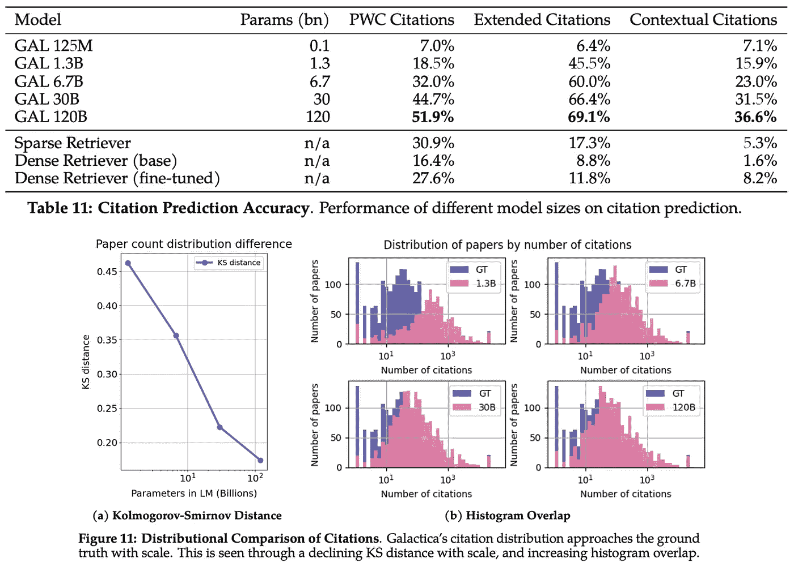

(来自 [13])

作为模型有效性的证明，作者甚至提到 Galactica 被用来撰写自己的论文！

> “Galactica 被用来帮助撰写这篇论文，包括推荐缺失的引用、引言和相关工作的讨论主题、推荐进一步的研究工作，以及帮助撰写摘要和结论。” — 来源于[13]

**戏剧。** Galactica 最初由 Meta 发布了一个公开演示。发布后不久，演示遭遇了来自研究社区的大量反对，并最终被下架。反对的基本理由是 Galactica 能够生成听起来合理但可能不正确的科学信息。因此，该模型可能被用于生成科学错误信息。抛开个人意见不谈，Galactica 模型及其后续反对意见引发了关于 LLM 对科学研究影响的极具趣味性的讨论。

**PubMedGPT。** [PubMedGPT](https://www.mosaicml.com/blog/introducing-pubmed-gpt)是由[MosaicML](https://www.mosaicml.com/)和[斯坦福基础模型研究中心](https://crfm.stanford.edu/)的研究人员联合创建的 LLM，采用了类似于 Galactica 的方法。该模型使用与 GPT 相同的架构（拥有 27 亿个参数），并通过对领域特定数据集（即，PubMed 摘要和来自 Pile 数据集的 PubMed Central）进行预训练，专注于生物医学领域。

这是一个相对较小的数据集，仅包含 50 亿个标记（即，Chinchilla [15]的训练使用了超过 1 万亿个标记作为参考）。在这个数据集上经过多轮训练后，PubMedGPT 在各种问答任务中表现出色。事实上，*它甚至在美国医学执照考试中达到了最新的研究水平*。

## 其他值得注意的 LLM

概述每一篇 LLM 论文是不可能的——这个话题很受欢迎，并且每天都在发展。为了使这篇综述更加全面，我在下面提供了我最近遇到的其他值得注意的 LLM 应用和研究方向的参考文献。

**dramatron [16]。** Dramatron 是一个专注于与人类共同编写剧本和电影剧本的 LLM。它采用分层生成连贯故事的过程，并在与 15 位戏剧/电影专业人士的用户研究中被认为对创作过程有用。

**LLMs 在理解蛋白质方面的应用 [17]。** 在对大规模蛋白质序列进行 LLM 训练后（使用[ESM2 蛋白质语言模型](https://huggingface.co/docs/transformers/model_doc/esm)），我们可以从这个 LLM 中采样多样的蛋白质结构，以生成新颖的蛋白质序列。这项工作表明，LLM 生成的蛋白质结构是可行的，并且超出了自然界中序列的范围。

**OPT-IML [18]。** 这是对[OPT-175B 模型](https://cameronrwolfe.substack.com/p/understanding-the-open-pre-trained-transformers-opt-library-193a29c14a15)的扩展，OPT-175B 是 Meta 创建的 GPT-3 开源版本。然而，OPT-IML 经过了指令微调（即，采用类似于 InstructGPT [6]的方法），在 2,000 多个源自 NLP 基准的任务上进行微调。或多或少，这项工作是一个开源版本的 LLMs，具有像 InstructGPT 一样的指令微调，但用于微调的任务集合不同。

**DePlot [19]。** DePlot 的作者通过推导一种将视觉图表和图形转换为文本数据的方法来进行视觉推理，然后使用这些视觉数据的文本版本作为 LLM 的提示，该 LLM 能够进行推理。与先前的基准相比，这个模型在视觉推理任务中取得了显著的改进。

**用于机器人学的 RLHF [20]。** RLHF 最近被用来提升视频游戏中 AI 驱动的代理的质量。特别地，视频游戏代理通过询问人类对代理在游戏中表现的反馈来使用 RLHF 进行训练。人类可以创造任务并自己判断模型的进展，然后 RLHF 被用来结合这些反馈，从而产生一个更好的视频游戏代理。尽管这与 LLM 无直接关联，我认为这是 RLHF 的一个相当有趣的应用。

# 关键要点

尽管通用 LLMs 是令人惊叹的任务无关基础模型，但仅凭语言模型预训练我们只能走到这么远。在这次概述中，我们探索了超越语言模型预训练的技术（例如，特定领域的预训练、监督微调和模型对齐），这些技术可以用来大幅提升 LLMs 的实用性。我们可以从这些技术中学到的基本概念如下。

**纠正简单错误。** LLMs 倾向于表现出各种不良行为，例如发表种族主义或不正确的评论。模型对齐（例如，通过 RLHF 或监督微调）可以用来纠正这些行为，允许模型从人类演示的正确或期望行为中学习。结果的 LLM 被认为与提供反馈的人类的价值观一致。

**特定领域的 LLMs 非常棒。** 像 Galactica 和 PubMedGPT 这样的模型清楚地表明，特定领域的 LLMs 非常有用。通过在一个较小的、经过策划的专门领域的语料库（例如，科学文献）上训练 LLM，我们可以轻松获得一个在该领域表现出色的模型。此外，我们可以用相对较少的领域特定数据取得良好的结果。展望未来，我们可以很容易地想象出可以提出的不同领域特定的 LLMs，例如解析餐馆评论或生成法律文档框架。

**用最少的计算资源实现更好的 LLM。** 我们可以通过增加模型规模或获得更好的预训练语料库来尝试创建更好的 LLM 基础模型。但是，LLM 的预训练过程[计算成本极高](https://www.mosaicml.com/blog/gpt-3-quality-for-500k)。在这次概述中，我们已经看到，通过对齐或微调方法可以显著改进 LLM，这些方法相比从头开始预训练 LLM 在计算上更为廉价。

**多阶段预训练。** 在对通用语言语料库进行预训练后，我们在本概述中看到的大多数模型会在更小的领域特定或精心策划的数据集上进行进一步的预训练（例如，在 Galactica [13]上对提示数据进行预训练，或在 LaMDA [8]上对对话数据进行预训练）。通常，我们发现采用多阶段预训练过程相当有用，无论是在收敛速度还是模型性能方面。然后，在这些预训练模型上应用对齐或监督微调技术会带来进一步的好处。

## 结束语

非常感谢阅读这篇文章。我是[Cameron R. Wolfe](https://cameronrwolfe.me/)，一名在[Alegion](https://www.alegion.com/)工作的研究科学家，同时也是莱斯大学的博士生，专注于深度学习的经验和理论基础。你还可以查看我在 medium 上的[其他著作](https://medium.com/@wolfecameron)！如果你喜欢这篇文章，请在[twitter](https://twitter.com/cwolferesearch)上关注我，或订阅我的[深度（学习）关注通讯](https://cameronrwolfe.substack.com/)，我会选择一个深度学习研究的主题，每两周提供相关背景信息，然后概述该主题的几篇热门论文。我的通讯页面上还有几个相关的概述。

[语言模型：GPT 和 GPT-2](https://cameronrwolfe.substack.com/p/language-models-gpt-and-gpt-2?source=post_page-----ccccdd9f666f--------------------------------) 

### 本通讯由 Alegion 支持。在 Alegion，我处理从在线学习到扩散等一系列问题……

[语言模型的扩展法则和 GPT-3](https://cameronrwolfe.substack.com/p/language-models-gpt-and-gpt-2?source=post_page-----ccccdd9f666f--------------------------------) 

### 本通讯由 Alegion 支持。在 Alegion，我处理从在线学习到扩散等一系列问题……

[现代 LLMs：MT-NLG、Chinchilla、Gopher 及更多](https://cameronrwolfe.substack.com/p/language-model-scaling-laws-and-gpt?source=post_page-----ccccdd9f666f--------------------------------) 

### 本通讯由 Alegion 支持。在 Alegion，我处理从在线学习到扩散等一系列问题……

[cameronrwolfe.substack.com](https://cameronrwolfe.substack.com/p/modern-llms-mt-nlg-chinchilla-gopher?source=post_page-----ccccdd9f666f--------------------------------)

## 参考文献

[1] Vaswani, Ashish, 等. “注意力机制是你所需要的一切。” *神经信息处理系统的进展* 30 (2017)。

[2] Brown, Tom, 等. “语言模型是少量样本学习者。” *神经信息处理系统的进展* 33 (2020): 1877–1901。

[3] Radford, Alec, 等. “通过生成预训练提高语言理解。” (2018)。

[4] Radford, Alec, 等. “语言模型是无监督的多任务学习者。”

[5] Kaplan, Jared, 等. “神经语言模型的扩展规律。” arXiv 预印本 arXiv:2001.08361 (2020)。

[6] Ouyang, Long, 等. “通过人类反馈训练语言模型以跟随指令。” *arXiv 预印本 arXiv:2203.02155* (2022)。

[7] Chen, Mark, 等. “评估训练在代码上的大型语言模型。” *arXiv 预印本 arXiv:2107.03374* (2021)。

[8] Thoppilan, Romal, 等. “Lamda: 对话应用的语言模型。” *arXiv 预印本 arXiv:2201.08239* (2022)。

[9] Adiwardana, Daniel, 等. “迈向类人开放域聊天机器人。” arXiv 预印本 arXiv:2001.09977 (2020)。

[10] Ziegler, Daniel M., 等. “从人类偏好中微调语言模型。” arXiv 预印本 arXiv:1909.08593 (2019)。

[11] Stiennon, Nisan, 等. “通过人类反馈学习总结。” 神经信息处理系统的进展 33 (2020): 3008–3021。

[12] Glaese, Amelia, 等. “通过有针对性的人类判断提高对话代理的对齐。” *arXiv 预印本 arXiv:2209.14375* (2022)。

[13] Taylor, Ross, 等. “Galactica: 一个大型科学语言模型。” *arXiv 预印本 arXiv:2211.09085* (2022)。

[14] Gao, Leo, 等. “The pile: 一个 800GB 的多样化文本数据集用于语言建模。” arXiv 预印本 arXiv:2101.00027 (2020)。

[15] Hoffmann, Jordan, 等. “训练计算最优的大型语言模型。” arXiv 预印本 arXiv:2203.15556 (2022)。

[16] Mirowski, Piotr, 等. “与语言模型共同创作剧本和戏剧脚本：由行业专业人士评估。” *arXiv 预印本 arXiv:2209.14958* (2022)。

[17] Verkuil, Robert, 等. “语言模型超越自然蛋白质的泛化能力。” *bioRxiv* (2022)。

[18] Iyer, Srinivasan, 等. “OPT-IML: 从泛化的视角扩展语言模型指令元学习。” *arXiv 预印本 arXiv:2212.12017* (2022)。

[19] Liu, Fangyu, 等. “DePlot: 通过情节到表格翻译进行一次性视觉语言推理。” *arXiv 预印本 arXiv:2212.10505* (2022)。

[20] Abramson, Josh, 等. “通过从人类反馈中强化学习改进多模态交互代理。” *arXiv 预印本 arXiv:2211.11602* (2022)。
